# 第五章。分而治之—使用决策树和规则进行分类

当在几份工资和福利水平各不相同的工作中做出选择时，许多人首先列出利弊清单，并根据简单的规则排除选项。例如，“如果我不得不花一个多小时通勤，我会不开心。或者，“如果我的收入少于 5 万美元，我将无法养家糊口。这样，预测一个人未来幸福的复杂而困难的决定可以简化为一系列简单的决定。

本章涵盖决策树和规则学习器——这两种机器学习方法也可以从一组简单的选择中做出复杂的决策。这些方法然后以逻辑结构的形式呈现它们的知识，这些逻辑结构不需要统计知识也能理解。这使得这些模型对于商业策略和过程改进特别有用。

本章结束时，您将学会:

*   树和规则如何“贪婪地”将数据分割成有趣的片段
*   最常见的决策树和分类规则学习器，包括 C5.0、1R 和 RIPPER 算法
*   如何使用这些算法来执行现实世界的分类任务，例如识别有风险的银行贷款和毒蘑菇

我们将从检查决策树开始，然后看看分类规则。然后，我们将通过预览后面的章节来总结我们所学的内容，这些章节讨论了使用树和规则作为更高级的机器学习技术的基础的方法。

# 了解决策树

决策树学习器是强大的分类器，它利用**树结构**来模拟特征和潜在结果之间的关系。如下图所示，这种结构之所以得名，是因为它反映了一棵真正的树是如何从一个宽树干开始的，如果向上看，它会分成越来越窄的树枝。同样，决策树分类器使用分支决策结构，将示例引导到最终的预测类值。

为了更好地理解这在实践中是如何工作的，让我们考虑下面的树，它预测一份工作邀请是否应该被接受。要考虑的工作机会从**根节点**开始，在那里是，然后通过**决策节点**，这些节点要求根据工作的属性做出选择。这些选择将数据划分到**分支** 中，这些分支指示决策的潜在结果，这里描述为是或否结果，尽管在某些情况下可能有两种以上的可能性。在可以做出最终决策的情况下，树由 **叶节点**(也称为**终端节点**)终止，其表示作为一系列决策的结果要采取的行动。在预测模型的情况下，给定树中的一系列事件，叶节点提供预期的结果。

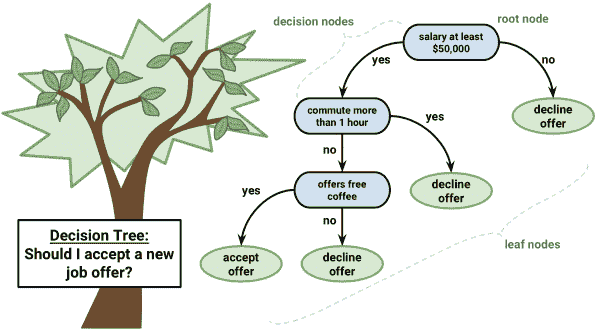

决策树算法的一个很大的好处是类似流程图的树结构不一定只供学习者内部使用。创建模型后，许多决策树算法以人类可读的格式输出结果结构。这提供了对模型如何以及为什么对特定任务有效或无效的巨大洞察力。这也使得决策树特别适用于由于法律原因分类机制需要透明的应用，或者为了通知未来的商业实践需要与他人分享结果的情况。考虑到这一点，一些潜在的用途包括:

*   信用评分模型，其中导致申请人被拒绝的标准需要明确记录，并且没有偏见
*   客户行为的市场研究，如满意度或流失率，将与管理层或广告公司分享
*   基于实验室测量、症状或疾病进展速度的医学状况诊断

虽然前面的应用说明了树在通知决策过程中的价值，但这并不意味着它们的效用到此为止。事实上，决策树可能是最广泛使用的机器学习技术，可以应用于建模几乎任何类型的数据——通常具有优秀的开箱即用的应用。

这就是说，尽管它们有广泛的适用性，但值得注意的是，在某些情况下，树可能不是理想的选择。其中一种情况可能是数据包含大量具有多个级别的标称要素或包含大量数值要素的任务。这些情况可能会导致大量的决策和过于复杂的树。它们还可能导致决策树过度拟合数据的趋势，尽管我们很快就会看到，即使这种弱点也可以通过调整一些简单的参数来克服。

## 各个击破

决策树是使用被称为**递归划分**的启发式算法构建的。这种方法通常也被称为**分治**，因为它将数据分割成子集，然后这些子集又被重复分割成更小的子集，以此类推，直到该过程在算法确定子集内的数据足够同质时停止，或者满足另一个停止标准。

要了解拆分数据集如何创建决策树，请想象一个将成长为成熟树的裸根节点。首先，根节点代表整个数据集，因为没有发生拆分。接下来，决策树算法必须选择一个特征进行分割；理想情况下，它选择最能预测目标类的特征。然后，根据该特征的不同值将示例分成组，并且形成第一组树分支。

沿着每个分支，算法继续对数据进行分而治之，每次都选择最佳候选特征来创建另一个决策节点，直到达到停止标准。在以下情况下，分而治之可能会在某个节点停止:

*   该节点上的所有(或几乎所有)示例都具有相同的类
*   在这些示例中，没有其他需要区分的特征
*   该树已增长到预定义的大小限制

为了说明树的构建过程，让我们考虑一个简单的例子。想象一下，你为一家好莱坞工作室工作，你的角色是决定工作室是否应该继续制作由有前途的新作者提出的剧本。度假归来后，你的办公桌上堆满了提案。没有时间从头到尾阅读每一个提案，你决定开发一个决策树算法来预测一部潜在的电影是否会属于三个类别之一:**关键成功**、**主流热门**或**票房失败**。

为了建立决策树，你转向工作室档案，检查导致该公司最近 30 部作品成功和失败的因素。你很快就会注意到这部电影的预计拍摄预算、排队等候主演的一线明星人数以及成功程度之间的关系。对这一发现感到兴奋，您制作了一个散点图来说明这一模式:

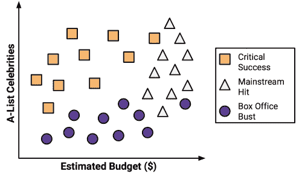

使用分而治之的策略，我们可以从这些数据中构建一个简单的决策树。首先，为了创建树的根节点，我们分割了指示名人数量的特征，将部电影分成有和没有大量一线明星的组:

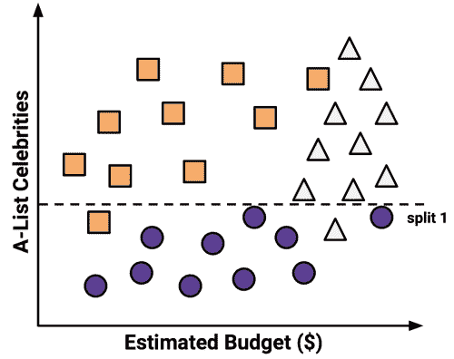

接下来，在有大量名人的电影组中，我们可以在有和没有高预算的电影之间进行另一种划分:

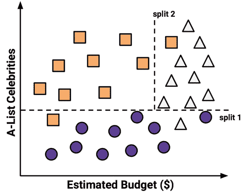

此时，我们已经将数据分为三组。图表左上角的组完全由广受好评的电影组成。这个群体的特点是名人数量多，预算相对较低。在右上角，大多数电影都是高预算和大量名人的票房大片。最后一组没有什么明星影响力，但预算从小到大，包含失败案例。

如果我们愿意，我们可以继续分而治之，根据预算和名人数量越来越具体的范围来分割数据，直到每个当前错误分类的值都驻留在自己的小分区中，并被正确分类。然而，以这种方式过度拟合决策树是不可取的。虽然没有什么可以阻止我们无限地分割数据，但过于具体的决策并不总是更广泛地推广。我们将通过在这里停止算法来避免过度拟合的问题，因为每组中超过 80%的例子来自单个类。这构成了我们停止标准的基础。

### 提示

你可能已经注意到对角线可能会更清晰地分割数据。这是决策树知识表示的一个限制，它使用**轴平行分割**。每个分割一次考虑一个特征的事实防止决策树形成更复杂的决策边界。例如，可以通过一个决策创建一条对角线，该决策询问“名人的数量是否大于预算？”如果是这样，那么“这将是一个关键的成功。”

我们预测电影未来成功的模型可以用一个简单的树来表示，如下图所示。要评估一个脚本，请跟踪每个决策的分支，直到预测到脚本的成功或失败。很快，你就能在积压的剧本中找出最有希望的选项，然后回到更重要的工作上，比如写一篇奥斯卡获奖感言。

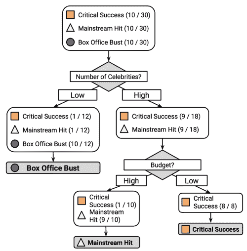

由于真实世界的数据包含两个以上的特征，决策树很快变得比这复杂得多，有更多的节点、分支和叶子。在下一节中，您将了解一种自动构建决策树模型的流行算法。

## c 5.0 决策树算法

决策树有许多实现，但是最著名的实现之一是 **C5.0 算法**。这个算法是由计算机科学家 J. Ross Quinlan 开发的，作为他之前算法 **C4.5** 的改进版本，而本身就是对他的**迭代二分法 3** ( **ID3** )算法的改进。尽管昆兰向商业客户推销 C5.0(详情见[http://www.rulequest.com/](http://www.rulequest.com/))，但该算法的单线程版本的源代码是公开的，因此它已被并入 r

### 注意

更令人困惑的是，R 的`RWeka`包中包含了一个流行的基于 Java 的开源替代 C4.5，名为 **J48** 。因为 C5.0、C4.5 和 J48 之间的差异很小，所以本章中的原则将适用于这三种方法中的任何一种，并且这些算法应该被认为是同义的。

C5.0 算法已经成为生成决策树的行业标准，因为它可以很好地解决大多数开箱即用的问题。与其他高级机器学习模型相比，例如在第 7 章、*黑盒方法-神经网络和支持向量机*中描述的那些模型，C5.0 构建的决策树通常表现几乎一样好，但更容易理解和部署。此外，如下表所示，该算法的缺点相对较小，可以在很大程度上避免:

| 

强项

 | 

弱点

 |
| --- | --- |
| 

*   在大多数问题上表现良好的通用分类器
*   高度自动化的学习过程，可以处理数字或名义特征，以及缺失数据
*   排除不重要的特征
*   可用于小型和大型数据集
*   产生无需数学背景即可解释的模型(用于相对较小的树)
*   比其他复杂模型更高效

 |  |

为了简单起见，我们之前的决策树示例忽略了机器如何采用分而治之策略所涉及的数学问题。让我们更详细地探讨一下，看看这种启发式方法在实践中是如何工作的。

### 选择最佳分割

决策树将面临的第一个挑战是识别根据哪个特征进行分割。在前面的例子中，我们寻找了一种分割数据的方法，使得产生的分区主要包含单个类的例子。一个例子子集只包含一个类的程度称为**纯**，任何只包含一个类的子集称为**纯**。

有多种纯度测量方法可用于识别最佳决策树分裂候选。C5.0 使用**熵**，这是一个从信息论中借用的概念，用于量化一组类值中的随机性或无序性。具有高熵的集合是非常多样的，并且提供关于可能也属于该集合的其他项目的很少信息，因为没有明显的共性。决策树希望找到减少熵的分裂，最终增加群体内的同质性。

通常，熵是以**位**来度量的。如果只有两个可能的类别，熵值的范围可以从 0 到 1。对于 *n* 类，熵的范围从 0 到 *log [2] (n)* 。在每种情况下，最小值表明样本是完全同质的，而最大值表明数据尽可能多样化，没有一个组有哪怕很小的多元性。

在数学概念中，熵的定义如下:


在这个公式中，对于一个给定的数据段 *(S)* ，术语 *c* 是指类级别的数量，术语 *p [i]* 是指落入类级别 *i* 的值的比例。例如，假设我们有一个包含两类数据的分区:红色(60%)和白色(40%)。我们可以如下计算熵:

```
> -0.60 * log2(0.60) - 0.40 * log2(0.40)
[1] 0.9709506

```

我们可以检查所有可能的两类排列的熵。如果我们知道一类中例子的比例是 *x* ，那么另一类中的比例就是*(1–x)*。使用`curve()`函数，我们可以绘制出 *x* 所有可能值的熵:

```
> curve(-x * log2(x) - (1 - x) * log2(1 - x),
 col = "red", xlab = "x", ylab = "Entropy", lwd = 4)

```

这导致了下图:

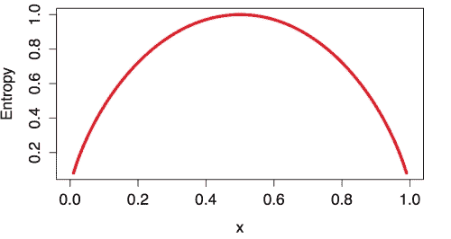

如在 *x = 0.50* 处的熵峰值所示，50-50 分割产生最大熵。随着一个阶级越来越支配另一个阶级，熵减少到零。

为了使用熵来确定要分割的最佳特征，该算法会计算每个可能的特征的分割将导致的同质性变化，这是一种称为**信息增益**的度量。特征 *F* 的信息增益被计算为分割 *(S [1] )* 之前的片段中的熵与分割 *(S [2] )* 产生的分区之间的差:


一个复杂的问题是，在分割之后，数据被分成多个分区。因此，计算*熵(S [2] )* 的函数需要考虑所有分区的总熵。这是通过用记录落入分区的比例来衡量每个分区的熵来实现的。这可以在公式中表述为:


简单来说，由分割产生的总熵是由落入该分区的实例的比例(*w[I]T23)加权的 *n* 分区中的每一个分区的熵的总和。*

信息增益越高，在对该特征进行分割之后，该特征在创建同类组方面越好。如果信息增益为零，则在该特征上分裂的熵没有减少。另一方面，最大信息增益等于分裂之前的熵。这将意味着分割后的熵为零，这意味着分割产生完全同质的组。

前面的公式假设了名义特征，但是决策树也使用信息增益来分割数字特征。为此，通常的做法是测试各种拆分，将值分成大于或小于某个数字阈值的组。这将数字特征简化为两级分类特征，允许照常计算信息增益。为分割选择产生最大信息增益的数值切割点。

### 注

尽管 C5.0 使用信息增益，但它并不是唯一可用于构建决策树的分裂标准。其他常用的标准有**基尼指数**、**卡方统计**和**增益率**。关于这些(以及更多)标准的回顾，请参考 Mingers J. *决策树归纳选择度量的实证比较*。机器学习。1989;3:319-342.

### 修剪决策树

决策树可以继续无限增长，选择分割特征并将数据分成越来越小的分区，直到每个例子都被完美分类或者算法用完了要分割的特征。但是，如果树变得过大，它做出的许多决策将会过于具体，并且模型将会过度适应训练数据。**修剪**决策树的过程包括减小决策树的大小，以便更好地概括看不见的数据。

这个问题的一个解决方案是，一旦树达到一定数量的决策，或者当决策节点只包含少量示例时，就停止树的增长。这叫做**提前停止**或**预先修剪**决策树。由于树避免做不必要的工作，这是一个吸引人的策略。然而，这种方法的一个缺点是，没有办法知道树是否会错过微妙但重要的模式，如果它长到更大的尺寸，它会学习这些模式。

另一种叫做**后修剪**的方法，包括故意生长一棵过大的树，并修剪叶子节点以将树的大小减少到一个更合适的水平。这通常是比预先修剪更有效的方法，因为如果不先生长决策树，就很难确定决策树的最佳深度。稍后修剪树允许算法确定所有重要的数据结构都被发现。

### 注意

修剪操作的实现细节技术性很强，超出了本书的范围。有关一些可用方法的比较，请参见埃斯波西托 F、马莱巴 D、塞梅拉罗 G. *修剪决策树方法的比较分析*。IEEE 模式分析与机器智能汇刊。1997;19: 476-491.

C5.0 算法的好处之一是它对修剪有自己的看法——它使用相当合理的默认值自动处理许多决策。它的总体策略是后期修剪。它首先生成一棵大树，使训练数据过拟合。之后，去除对分类误差影响不大的节点和分支。在某些情况下，整个分支被移到树的更高处，或者被更简单的决策所取代。这些嫁接分支的过程分别被称为**子树提升**和**子树替换** 。

平衡决策树的过拟合和欠拟合是一门艺术，但是如果模型准确性至关重要，那么可能值得花一些时间使用各种修剪选项，看看它是否提高了测试数据的性能。正如你很快就会看到的，C5.0 算法的一个优点是它非常容易调整训练选项。


# 示例–使用 C5.0 决策树识别高风险银行贷款

2007-2008 年的全球金融危机凸显了银行实践中透明度和严谨性的重要性。由于信贷的可用性有限，银行收紧了贷款系统，并转向机器学习来更准确地识别高风险贷款。

决策树广泛应用于银行业，因为它具有很高的准确性，并且能够用通俗易懂的语言建立统计模型。由于许多国家的政府机构都在仔细监控贷款行为，高管们必须能够解释为什么一个申请人被拒绝贷款，而其他申请人却被批准。该信息对于希望确定其信用评级不令人满意的原因的客户也很有用。

很可能自动信用评分模型被用于在电话和网络上即时批准信用申请。在本节中，我们将使用 C5.0 决策树开发一个简单的信贷审批模型。我们还将看到如何调整模型的结果，以最小化导致机构财务损失的错误。

## 第一步——收集数据

我们的信用模型背后的理念是识别预测更高违约风险的因素。因此，我们需要获得大量过去银行贷款的数据和贷款是否违约，以及申请人的信息。

具有这些特征的数据可以在汉堡大学的汉斯·霍夫曼捐赠给 UCI 机器学习数据仓库([http://archive.ics.uci.edu/ml](http://archive.ics.uci.edu/ml))的数据集中找到。该数据集包含从德国信贷机构获得的贷款信息。

### 提示

为了消除一些预处理步骤，本章中介绍的数据集已从原始数据集稍作修改。为了跟随示例，从 Packt Publishing 的网站下载`credit.csv`文件，并将其保存到您的 R 工作目录。

信用数据集包括 1，000 个贷款实例，以及一组数字和名义特征，表明贷款和贷款申请人的特征。一个类变量表明贷款是否违约。让我们看看我们是否能确定任何预测这一结果的模式。

## 第 2 步——探索和准备数据

正如我们之前所做的，我们将使用`read.csv()`函数导入数据。我们将忽略`stringsAsFactors`选项，因此使用默认值`TRUE`，因为数据中的大多数特征都是名义上的:

```
> credit <- read.csv("credit.csv")

```

`str()`功能的前几行输出如下:

```
> str(credit)
'data.frame':1000 obs. of  17 variables:
 $ checking_balance : Factor w/ 4 levels "< 0 DM","> 200 DM",..
 $ months_loan_duration: int  6 48 12 ...
 $ credit_history      : Factor w/ 5 levels "critical","good",..
 $ purpose             : Factor w/ 6 levels "business","car",..
 $ amount              : int  1169 5951 2096 ...

```

我们看到预期的 1，000 个观察值和 17 个特征，它们是因子和整数数据类型的组合。

让我们来看看几个贷款特征的`table()`输出，这些特征似乎可以预测违约。申请人的支票和储蓄账户余额被记录为分类变量:

```
> table(credit$checking_balance)
 < 0 DM   > 200 DM 1 - 200 DM    unknown 
 274         63        269        394
> table(credit$savings_balance)
 < 100 DM > 1000 DM  100 - 500 DM 500 - 1000 DM   unknown 
 603        48           103            63       183

```

支票和储蓄账户余额可能被证明是贷款违约状态的重要预测指标。请注意，由于贷款数据是从德国获得的，货币以德国马克(DM)记录。

贷款的一些特征是数字的，例如它的持续时间和所请求的信用额度:

```
> summary(credit$months_loan_duration)
 Min. 1st Qu.  Median    Mean 3rd Qu.    Max. 
 4.0    12.0    18.0    20.9    24.0    72.0 
> summary(credit$amount)
 Min. 1st Qu.  Median    Mean 3rd Qu.    Max. 
 250    1366    2320    3271    3972   18420

```

贷款金额从 250 德国马克到 18，420 德国马克不等，期限为 4 至 72 个月，平均期限为 18 个月，金额为 2，320 德国马克。

`default`向量表示贷款申请人是否无法满足约定的付款条件并违约。该数据集中共有 30%的贷款违约:

```
> table(credit$default)
 no yes 
700 300

```

高违约率对银行来说是不可取的，因为这意味着银行不太可能完全收回投资。如果我们成功了，我们的模型将识别高违约风险的申请人，允许银行拒绝信贷请求。

### 数据准备–创建随机训练和测试数据集

正如我们在前面章节中所做的那样，我们将把数据分成两部分:一个用于构建决策树的训练数据集和一个用于评估模型对新数据的性能的测试数据集。我们将使用 90%的数据进行培训，10%用于测试，这将为我们提供 100 条记录来模拟新的申请人。

由于前面的章节使用的是随机排序的数据，我们简单地将数据集分成两部分，取前 90%的记录用于训练，其余 10%用于测试。相比之下，信用数据集不是随机排序的，这使得先前的方法不明智。假设银行已经按照贷款金额对数据进行了排序，最大的贷款在文件的末尾。如果我们将前 90%用于训练，剩下的 10%用于测试，我们将只在小额贷款上训练模型，而在大额贷款上测试模型。显然，这可能会有问题。

我们将通过使用信用数据的**随机样本**进行训练来解决这个问题。随机抽样就是随机选择记录子集的过程。在 R 中，`sample()`函数用于执行随机采样。然而，在将其付诸实施之前，通常的做法是设置一个**种子**值，这使得随机化过程遵循一个序列，如果需要，该序列可以在以后被复制。这似乎违背了生成随机数的目的，但这样做有一个很好的理由。通过`set.seed()`函数提供一个种子值确保了如果将来重复分析，会得到相同的结果。

### 提示

你可能想知道一个所谓的随机过程是如何产生相同的结果的。这是因为计算机使用一种称为**伪随机数发生器**的数学函数来创建随机数序列，该序列看起来非常随机，但实际上在已知序列中先前值的情况下是完全可预测的。在实践中，现代伪随机数序列与真正的随机序列几乎无法区分，但具有计算机可以快速轻松地生成它们的优势。

以下命令使用`sample()`函数从 1 到 1000 的整数序列中随机选择 900 个值。注意，`set.seed()`函数使用任意值`123`。省略此种子将导致您的培训和测试分割与本章剩余部分中显示的不同:

```
> set.seed(123)
> train_sample <- sample(1000, 900)

```

正如所料，最终的`train_sample`对象是一个包含 900 个随机整数的向量:

```
> str(train_sample)
 int [1:900] 288 788 409 881 937 46 525 887 548 453 ... 

```

通过使用这个向量从信用数据中选择行，我们可以将它分成我们想要的 90%的训练和 10%的测试数据集。回想一下，在选择测试记录时使用的破折号操作符告诉 R 选择不在指定行中的记录；换句话说，测试数据只包括不在定型样本中的行。

```
> credit_train <- credit[train_sample, ]
> credit_test  <- credit[-train_sample, ]

```

如果一切顺利，我们应该在每个数据集中有大约 30%的违约贷款:

```
> prop.table(table(credit_train$default))
 no       yes 
0.7033333 0.2966667 

> prop.table(table(credit_test$default))
 no  yes 
0.67 0.33

```

这似乎是一个相当平均的分裂，所以我们现在可以建立我们的决策树。

### 提示

如果您的结果不完全匹配，请确保您在创建`train_sample`向量之前立即运行了命令`set.seed(123)`。

## 步骤 3–根据数据训练模型

我们将使用`C50`包中的 C5.0 算法来训练我们的决策树模型。如果您还没有这样做，用`install.packages("C50")`安装这个包，并使用`library(C50)`将其加载到您的 R 会话中。

下面的语法框列出了一些最常用的构建决策树的命令。与我们之前使用的机器学习方法相比，C5.0 算法提供了更多的方法来针对特定的学习问题定制模型，但也有更多的选项可用。一旦加载了`C50`包，`?C5.0Control`命令将显示帮助页面，以获取关于如何微调算法的更多详细信息。

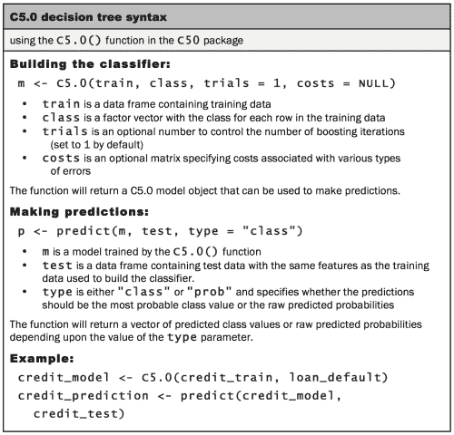

对于我们的信用审批模型的第一次迭代，我们将使用默认的 C5.0 配置，如下面的代码所示。`credit_train`中的第 17 列是`default`类变量，因此我们需要将其从训练数据帧中排除，但将其作为分类的目标因子向量提供:

```
> credit_model <- C5.0(credit_train[-17], credit_train$default)

```

`credit_model`对象现在包含一个 C5.0 决策树。我们可以通过键入树的名称来查看树的一些基本数据:

```
> credit_model

Call:
C5.0.default(x = credit_train[-17], y = credit_train$default)

Classification Tree
Number of samples: 900 
Number of predictors: 16 

Tree size: 57 

Non-standard options: attempt to group attributes

```

前面的文本展示了一些关于树的简单事实，包括生成树的函数调用、特性的数量(标记为`predictors`)以及用于生长树的示例(标记为`samples`)。还列出了树的大小为 57，这表明树的深度为 57 个决策——比我们到目前为止考虑的示例树要大得多！

为了查看树的决策，我们可以在模型上调用`summary()`函数:

```
> summary(credit_model)

```

这会产生以下输出:

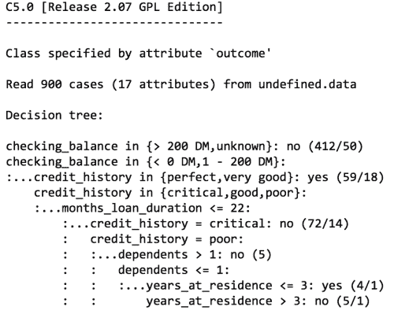

前面的输出显示了决策树中的一些第一分支。前三行可以用简单的语言表示为:

1.  如果支票账户余额未知或大于 200 德国马克，则归类为“不可能违约”
2.  否则，如果支票账户余额少于零德国马克或在 1 至 200 德国马克之间。
3.  并且信用记录是完美的或非常好的，那么归类为“可能违约”

括号中的数字表示符合该决定标准的实例数量，以及被该决定错误分类的数量。例如，在第一行，`412/50`表示在 412 个达成决策的例子中，有 50 个被错误地归类为不可能违约。换句话说，50 名申请者实际上违约了，尽管模型的预测与此相反。

### 提示

有时候一棵树导致的决策没有什么逻辑意义。例如，为什么信用记录非常好的申请人很可能违约，而那些支票余额未知的申请人不太可能违约？像这样相互矛盾的规则时有发生。它们可能反映了数据中的真实模式，也可能是统计异常。不管是哪种情况，调查这种奇怪的决定，看看这种树的逻辑对于业务使用是否有意义，都是很重要的。

在该树之后，`summary(credit_model)`输出显示一个混淆矩阵，这是一个交叉列表，表示模型在训练数据中的错误分类记录:

```
Evaluation on training data (900 cases):

 Decision Tree 
 ---------------- 
 Size      Errors 
 56  133(14.8%)   <<

 (a)   (b)    <-classified as
 ----  ----
 598    35    (a): class no
 98   169    (b): class yes

```

错误输出指出，在 900 个训练实例中，除了 133 个之外，该模型正确地对所有实例进行了分类，错误率为 14.8%。总共有 35 个实际的 no 值被错误地分类为 yes(假阳性)，而 98 个 yes 值被错误地分类为 no(假阴性)。

众所周知，决策树往往会使模型过度适应训练数据。出于这个原因，训练数据上报告的错误率可能过于乐观，在测试数据集上评估决策树尤其重要。

## 步骤 4–评估模型性能

为了将我们的决策树应用到测试数据集，我们使用了`predict()`函数，如下面的代码行所示:

```
> credit_pred <- predict(credit_model, credit_test)

```

这创建了一个预测类值的向量，我们可以使用`gmodels`包中的`CrossTable()`函数将其与实际类值进行比较。将`prop.c`和`prop.r`参数设置为`FALSE`会从表格中删除列和行百分比。剩余百分比(`prop.t`)表示该单元格中的记录占记录总数的比例:

```
> library(gmodels)
> CrossTable(credit_test$default, credit_pred,
 prop.chisq = FALSE, prop.c = FALSE, prop.r = FALSE,
 dnn = c('actual default', 'predicted default'))

```

这导致了下表:

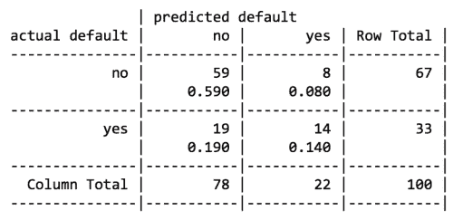

在 100 个测试贷款申请记录中，我们的模型正确预测了 59 个没有违约，14 个违约，结果准确率为 73%，错误率为 27%。这比它在训练数据上的表现差一些，但并不意外，因为一个模型在看不见的数据上的表现往往更差。还要注意，该模型只正确预测了测试数据中 33 个实际贷款违约中的 14 个，即 42%。不幸的是，这种类型的错误是一个潜在的非常昂贵的错误，因为银行每次违约都会损失金钱。让我们看看是否可以再努力一点来改善结果。

## 第 5 步——提高模型性能

我们的模型的错误率可能太高，以至于无法将其部署在实时信用评分应用中。事实上，如果模型预测每个测试用例“没有违约”,它将有 67%的正确率——这个结果并不比我们的模型差多少，但需要的努力要少得多！从 900 个例子中预测贷款违约似乎是一个具有挑战性的问题。

更糟糕的是，我们的模型在识别拖欠贷款的申请人方面表现尤其糟糕。幸运的是，有几个简单的方法来调整 C5.0 算法，这可能有助于改善模型的性能，无论是整体还是代价更高的错误类型。

### 提高决策树的准确性

在 C4.5 算法基础上改进的 C5.0 算法的一种方式是通过增加**自适应增强**。这是一个构建许多决策树的过程，这些决策树为每个示例投票选出最佳类。

### 注意

增强免疫力的想法很大程度上是基于 Rob Schapire 和 Yoav Freund 的研究。要了解更多信息，可以尝试在网上搜索他们的出版物或他们最近的教科书*Boosting:Foundations and Algorithms*。麻省理工学院出版社(2012 年)。

由于 boosting 可以更广泛地应用于任何机器学习算法，本书稍后将在[第 11 章](ch11.html "Chapter 11. Improving Model Performance")、*提高模型性能*中详细介绍。就目前而言，可以说提升根植于这样一种理念，即通过将一些表现不佳的学习者结合起来，你可以创建一个比任何一个单独的学习者都强大得多的团队。每种模式都有一套独特的优点和缺点，它们在解决某些问题时可能更好或更差。因此，使用几个具有互补优势和劣势的学习器的组合可以显著提高分类器的准确性。

`C5.0()`函数使得向我们的 C5.0 决策树添加 boosting 变得容易。我们只需要添加一个额外的`trials`参数，指示在增强的团队中使用的独立决策树的数量。`trials`参数设置上限；如果算法意识到额外的尝试似乎没有提高准确性，它将停止添加树。我们将从 10 次试验开始，这个数字已经成为事实上的标准，因为研究表明这将测试数据的错误率降低了约 25 %:

```
> credit_boost10 <- C5.0(credit_train[-17], credit_train$default,
 trials = 10)

```

在检查生成的模型时，我们可以看到添加了一些额外的行，表明发生了变化:

```
> credit_boost10
Number of boosting iterations: 10 
Average tree size: 47.5

```

经过 10 次迭代，我们的树的大小缩小了。如果您愿意，您可以在命令提示符下键入`summary(credit_boost10)`来查看所有 10 棵树。它还列出了模型在训练数据上的表现:

```
> summary(credit_boost10)

 (a)   (b)    <-classified as
 ----  ----
 629     4    (a): class no
 30   237    (b): class yes

```

该分类器在 900 个训练样本中犯了 34 个错误，错误率为 3.8%。这比我们在添加 boosting 之前注意到的 13.9%的训练错误率有了很大的改进！然而，我们是否能在测试数据上看到类似的改善还有待观察。让我们来看看:

```
> credit_boost_pred10 <- predict(credit_boost10, credit_test)
> CrossTable(credit_test$default, credit_boost_pred10,
 prop.chisq = FALSE, prop.c = FALSE, prop.r = FALSE,
 dnn = c('actual default', 'predicted default'))

```

结果表如下所示:

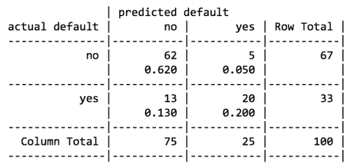

这里，我们将总错误率从增强前的 27%降低到增强模型中的 18%。这看起来并不是一个很大的收益，但事实上比我们预期的 25%的降幅要大。另一方面，该模型在预测违约方面仍然表现不佳，仅正确预测了 *20/33 = 61%* 。缺乏更大的改进可能是我们相对较小的训练数据集的作用，或者它可能只是一个非常难以解决的问题。

也就是说，如果 boosting 可以这么容易地添加，为什么不在默认情况下将它应用于每个决策树呢？这个原因是双重的。首先，如果构建一个决策树需要大量的计算时间，那么构建很多树在计算上可能是不切实际的。第二，如果训练数据非常嘈杂，那么提升可能根本不会导致改善。尽管如此，如果需要更高的精确度，还是值得一试。

### 犯错误比别人付出更大的代价

向可能违约的申请人发放贷款可能是一个代价高昂的错误。减少假阴性数量的一个解决方案可能是拒绝更多的边缘申请人，假设银行从高风险贷款中获得的利息远远超过如果这笔钱根本得不到偿还所带来的巨大损失。

C5.0 算法允许我们为不同类型的错误分配惩罚，以阻止一棵树犯下代价更高的错误。惩罚在**成本矩阵**中指定，该矩阵指定了每个错误相对于任何其他预测的成本。

要开始构建成本矩阵，我们需要从指定维度开始。由于预测值和实际值都可以取两个值，`yes`或`no`，我们需要描述一个 2 x 2 矩阵，使用两个向量的列表，每个向量有两个值。同时，我们还将命名矩阵维度，以避免以后混淆:

```
> matrix_dimensions <- list(c("no", "yes"), c("no", "yes"))
> names(matrix_dimensions) <- c("predicted", "actual")

```

检查新对象表明我们的尺寸设置正确:

```
> matrix_dimensions
$predicted
[1] "no"  "yes"

$actual
[1] "no"  "yes"

```

接下来，我们需要通过提供四个值来填充矩阵，从而为各种类型的错误分配惩罚。因为 R 通过从上到下逐个填充列来填充矩阵，所以我们需要以特定的顺序提供值:

*   预测否，实际否
*   预测是，实际否
*   预测否，实际是
*   预测是，实际是

假设我们认为贷款违约给银行造成的损失是错失机会的四倍。我们的惩罚值可以定义为:

```
> error_cost <- matrix(c(0, 1, 4, 0), nrow = 2,
 dimnames = matrix_dimensions)

```

这将创建以下矩阵:

```
> error_cost
 actual
predicted no yes
 no   0   4
 yes  1   0

```

如该矩阵所定义的，当算法正确分类为“否”或“是”时，没有分配成本，但是假阴性的成本为 4，而假阳性的成本为 1。为了查看这如何影响分类，让我们使用`C5.0()`函数的`costs`参数将其应用到我们的决策树。否则，我们将使用与前面相同的步骤:

```
> credit_cost <- C5.0(credit_train[-17], credit_train$default,
 costs = error_cost)
> credit_cost_pred <- predict(credit_cost, credit_test)
> CrossTable(credit_test$default, credit_cost_pred,
 prop.chisq = FALSE, prop.c = FALSE, prop.r = FALSE,
 dnn = c('actual default', 'predicted default'))

```

这产生了以下混淆矩阵:

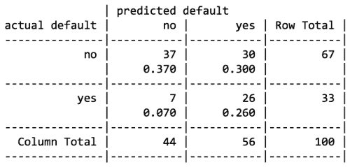

与我们的增强模型相比，这个版本总体上犯了更多的错误:这里有 37%的错误，而增强模型中有 18%的错误。然而，错误的类型是非常不同的。在之前的模型中，只有 42%和 61%的违约被错误分类，而在这个模型中，79%的实际违约被预测为非违约。如果我们的成本估计是准确的，这种以增加假阳性为代价减少假阴性的交易可能是可以接受的。


# 了解分类规则

分类规则以逻辑 if-else 语句的形式表示知识，将一个类别分配给未标记的例子。它们是根据一个**前因**和一个**后果**来指定的；这些形成了一个假设，即“如果这种情况发生，那么那种情况就会发生。”一个简单的规则可能会说，“如果硬盘发出咔嗒声，那么它就要出故障了。”前件包括特征值的某些组合，而后件指定当满足规则的条件时要分配的类值。

规则学习器通常以类似于决策树学习器的方式使用。像决策树一样，它们可用于为未来行动生成知识的应用，例如:

*   识别导致机械设备硬件故障的条件
*   描述客户细分人群的关键特征
*   发现股票市场上股票价格大幅下跌或上涨之前的情况

另一方面，对于某些任务，规则学习器提供了一些明显优于树的优势。与必须通过一系列决策从上到下应用的树不同，规则是可以像事实陈述一样阅读的命题。此外，由于稍后将讨论的原因，规则学习器的结果可能比基于相同数据构建的决策树更简单、直接且更容易理解。

### 提示

正如您将在本章后面看到的，规则可以使用决策树来生成。那么，为什么要为一组独立的规则学习算法而烦恼呢？原因是决策树给任务带来了一组特殊的偏差，规则学习者通过直接识别规则来避免这些偏差。

规则学习器通常适用于特征主要或完全是名义上的问题。它们在识别罕见事件方面做得很好，即使罕见事件只在特征值之间非常特定的相互作用下发生。

## 分而治之

分类规则学习算法利用了一种被称为**分而治之**的启发式算法。该过程包括识别覆盖训练数据中的示例子集的规则，然后将该分区与剩余数据分离。随着规则的添加，数据的附加子集被分离，直到整个数据集被覆盖并且没有更多的示例剩余。

想象规则学习过程的一种方式是考虑通过创建越来越具体的规则来识别类值，从而深入数据。假设你的任务是创建规则来识别动物是否是哺乳动物。您可以将所有动物的集合描绘成一个大空间，如下图所示:

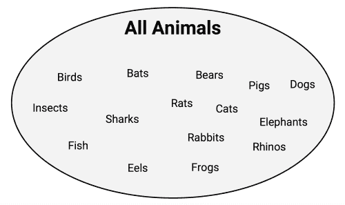

规则学习者从使用可用的特征来寻找同类组开始。例如，使用指示物种是通过陆地、海洋还是空中旅行的特征，第一个规则可能暗示任何陆地动物都是哺乳动物:

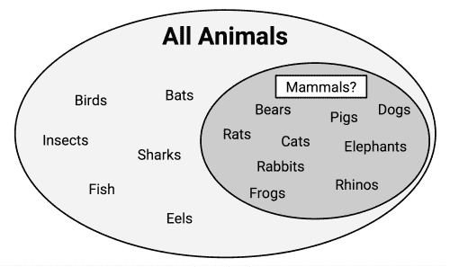

你注意到这条规则有什么问题吗？如果你是一个动物爱好者，你可能已经意识到青蛙是两栖动物，而不是哺乳动物。因此，我们的规则需要更具体一些。让我们进一步深入，提出哺乳动物必须在陆地上行走，并且有尾巴:

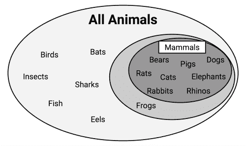

可以定义一个额外的规则来区分蝙蝠，这是仅存的哺乳动物。因此，这个子集可以与其他数据分开。

可以定义一个附加规则来区分蝙蝠，这是仅存的哺乳动物。区别蝙蝠和其他现存动物的一个潜在特征是皮毛的存在。使用围绕这个特征建立的规则，我们已经正确地识别了所有的动物:

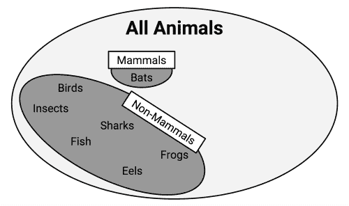

此时，由于所有的训练实例都已分类，规则学习过程将停止。我们总共学到了三条规则:

*   在陆地上行走并且有尾巴的动物是哺乳动物
*   如果动物没有皮毛，它就不是哺乳动物
*   否则，该动物就是哺乳动物

前面的例子说明了规则如何逐渐消耗越来越大的数据段，最终对所有实例进行分类。

由于规则似乎覆盖了部分数据，所以分而治之算法也被称为**覆盖算法**，由此产生的规则被称为覆盖规则。在下一节中，我们将通过研究一个简单的规则学习算法来学习如何在实践中应用覆盖规则。然后，我们将检查一个更复杂的规则学习器，并将两者应用于现实世界的问题。

## 1R 算法

假设一个电视游戏节目有一个轮盘，上面有十个大小均匀的彩色切片。其中三段是红色的，三段是蓝色的，四段是白色的。在旋转轮盘之前，您需要选择其中一种颜色。当轮子停止转动时，如果显示的颜色与您的预测相符，您将赢得一大笔现金奖励。你应该选择什么颜色？

如果你选择白色，你当然更有可能获奖——这是轮子上最常见的颜色。显然，这个游戏节目有点可笑，但它演示了最简单的分类器、 **ZeroR** ，一个字面上不学习任何规则的规则学习器(因此得名)。对于每个未标记的例子，不管其特征的值如何，它都预测最常见的类。

**1R 算法** ( **一个规则**或**一个规则**)，通过选择单个规则来改进 ZeroR。虽然这可能看起来过于简单，但它的表现往往比您预期的要好。经验研究表明，对于许多现实世界的任务，该算法的精度可以接近更复杂的算法。

### 注意

要深入了解 1R 的惊人性能，请参见 Holte RC。*非常简单的分类规则在最常用的数据集上表现良好*。机器学习。1993;11:63-91.

1R 算法的优缺点如下表所示:

| 

强项

 | 

弱点

 |
| --- | --- |
| 

*   生成一个单一的、易于理解的、人类可读的经验法则
*   通常表现得出奇的好
*   可以作为更复杂算法的基准

 | 

*   仅使用单一特征
*   可能过于简单化

 |

这个算法的工作方式很简单。对于每个特征，1R 根据该特征的相似值将数据分组。然后，对于每个段，该算法预测多数类。计算基于每个特征的规则的错误率，并且选择具有最少错误的规则作为一个规则。

下表显示了这对于我们在本节前面看到的动物数据是如何起作用的:

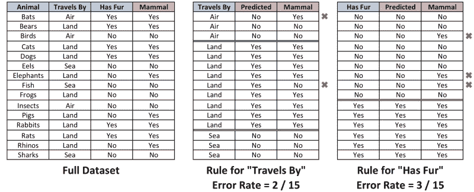

对于通过特征的**旅行，数据集被分成三组:**空中**、**陆地**和**海上**。**空中**和**海洋**组的动物被预测为非哺乳动物，而**陆地**组的动物被预测为哺乳动物。这导致了两个错误:蝙蝠和青蛙。**有皮毛**特征，将动物分为两组。有皮毛的被预测为哺乳动物，没有皮毛的没有被预测为哺乳动物。统计了三个错误:猪、大象和犀牛。由于**行进通过**特征导致更少的错误，1R 算法将基于**行进通过**返回以下“一个规则”:**

*   如果动物乘飞机旅行，它就不是哺乳动物
*   如果动物在陆地上旅行，它就是哺乳动物
*   如果动物在海上旅行，它就不是哺乳动物

算法到此为止，找到了最重要的规则。

显然，这种规则学习算法对于某些任务来说可能太基础了。你希望医疗诊断系统只考虑单一症状，还是希望自动驾驶系统只根据单一因素来停止或加速你的汽车？对于这些类型的任务，更复杂的规则学习器可能是有用的。我们将在下一节中了解其中一个。

## 开膛手算法

早期的规则学习算法被几个问题所困扰。首先，它们因速度慢而臭名昭著，这使得它们对于数量不断增加的大型数据集无效。第二，他们往往倾向于对噪音数据不准确。

解决这些问题的第一步是由 Johannes Furnkranz 和 Gerhard Widmer 在 1994 年提出的。他们的**增量减少错误剪枝(IREP)算法**使用预剪枝和后剪枝方法的组合，生成非常复杂的规则，并在从完整数据集分离实例之前进行剪枝。尽管这种策略有助于规则学习者的表现，但决策树通常表现得更好。

### 注意

关于 IREP 的更多信息，参见 Furnkranz J，Widmer G. *增量减少错误修剪*。第 11 届国际机器学习会议论文集。1994: 70-77.

规则学习者在 1995 年又向前迈进了一步，当时 William W. Cohen 引入了**重复增量修剪以产生错误减少(RIPPER)算法**，该算法在 IREP 的基础上进行改进，以生成匹配或超过决策树性能的规则。

### 注意

关于开膛手的更多细节，见科恩 WW。*快速有效的规则归纳*。第 12 届^(国际机器学习会议论文集。1995:115-123.)

如下表所示，RIPPER 的优势和劣势通常与决策树相当。主要的好处是它们可能会产生一个稍微节俭一点的模型:

| 

强项

 | 

弱点

 |
| --- | --- |
| 

*   生成易于理解、人类可读的规则
*   在大型和嘈杂的数据集上高效
*   通常生成比可比决策树

更简单的模型 | 

*   可能会产生似乎违背常识或专业知识的规则
*   不适合处理数字数据
*   可能无法像更复杂的模型

那样执行 |

RIPPER 算法是从规则学习算法的多次迭代中发展而来的，它是规则学习的高效启发式算法的拼凑。由于其复杂性，对技术实现细节的讨论超出了本书的范围。但是，一般可以理解为一个三步过程:

1.  生长
2.  减少
3.  使最优化

成长阶段使用分而治之的技术，贪婪地向规则添加条件，直到它完美地对数据子集进行分类，或者用完了用于拆分的属性。类似于决策树，信息增益标准用于识别下一个分裂属性。当增加规则的特异性不再减少熵时，该规则立即被删除。重复第一步和第二步，直到它达到一个停止标准，在这一点上，使用各种试探法优化整个规则集。

RIPPER 算法可以创建比 1R 算法复杂得多的规则，因为它可以考虑多个特征。这意味着它可以创建具有多个前提的规则，例如“如果一种动物会飞并且有皮毛，那么它就是哺乳动物。”这提高了算法对复杂数据建模的能力，但就像决策树一样，这意味着规则可能很快变得更加难以理解。

### 注

分类规则学习者的进化并没有随着 RIPPER 而停止。新的规则学习算法正被迅速提出。文献调查显示，算法称为 IREP++，拖鞋，TRIPPER，等等。

## 来自决策树的规则

分类规则也可以直接从决策树中获得。从一个叶节点开始，沿着分支回到根，您将获得一系列决策。这些可以合并成一个规则。下图显示了如何从决策树中构建规则来预测电影的成功:

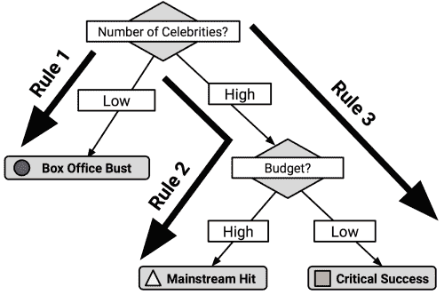

沿着从根节点到每个叶节点的路径，规则如下:

1.  如果名人的数量很少，那么这部电影的票房将会很差。
2.  如果名人数量多，预算高，那么这部电影就会成为主流热门电影。
3.  如果名人数量多而预算低，那么这部电影将会获得巨大成功。

出于将在下面的部分中阐明的原因，使用决策树来生成规则的主要缺点是，生成的规则通常比通过规则学习算法学习到的规则更复杂。决策树采用的分而治之策略对结果的偏向不同于规则学习者。另一方面，从树中生成规则有时计算效率更高。

### 提示

如果您在训练模型时指定了`rules = TRUE`，那么`C50`包中的`C5.0()`函数将使用分类规则生成一个模型。

## 是什么让树和规则贪婪？

决策树和规则学习者被称为**贪婪学习者**，因为他们使用数据是基于先来先服务的原则。决策树使用的分治启发式算法和规则学习器使用的分治启发式算法都试图一次生成一个分区，首先找到最相似的分区，然后是第二相似的分区，依此类推，直到所有的例子都被分类。

贪婪方法的缺点是贪婪算法不能保证为特定数据集生成最优、最准确或最少数量的规则。通过尽早摘下容易摘到的果实，贪婪的学习者可能会很快找到对一个数据子集准确的单一规则；然而，在这样做的时候，学习者可能会错过在整个数据集上开发具有更好的整体准确性的更细致的规则集的机会。然而，如果不使用贪婪方法进行规则学习，很可能对于除了最小数据集之外的所有数据集，规则学习在计算上都是不可行的。


尽管树和规则都采用贪婪学习试探法，但它们在构建规则的方式上有细微的差别。也许区分它们的最好方法是注意，一旦分治在一个特性上分裂，由分裂产生的分区可能不会被重新征服，只会进一步细分。这样，一棵树就永远被它过去的决策历史所限制。相反，一旦分离和征服找到一个规则，任何没有被该规则的所有条件覆盖的例子都可以被重新征服。

为了说明这种对比，考虑前面的案例，我们构建了一个规则学习器来确定一种动物是否是哺乳动物。规则学习者确定了三条规则，这三条规则完美地对示例动物进行了分类:

*   在陆地上行走并有尾巴的动物是哺乳动物(熊、猫、狗、大象、猪、兔子、老鼠、犀牛)
*   如果动物没有皮毛，它就不是哺乳动物(鸟、鳗鱼、鱼、青蛙、昆虫、鲨鱼)
*   否则，动物就是哺乳动物(蝙蝠)

相比之下，基于相同数据构建的决策树可能会提出四个规则来实现相同的完美分类:

*   如果一种动物在陆地上行走，并且有皮毛，那么它就是哺乳动物(熊、猫、狗、大象、猪、兔子、老鼠、犀牛)
*   如果一种动物在陆地上行走并且没有皮毛，那么它就不是哺乳动物(青蛙)
*   如果动物不在陆地上行走，并且有皮毛，那么它就是哺乳动物(蝙蝠)
*   如果动物不在陆地上行走，没有皮毛，那么它就不是哺乳动物(鸟类、昆虫、鲨鱼、鱼、鳗鱼)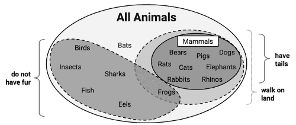

这两种方法的不同结果与青蛙被“在陆地上行走”的决定分开后会发生什么有关。在规则学习器允许青蛙被“没有毛发”决策重新征服的情况下，决策树不能修改现有的分区，因此必须将青蛙放入它自己的规则中。

一方面，因为规则学习者可以重新检查被考虑但最终没有作为先前规则的一部分覆盖的情况，所以规则学习者通常会找到比从决策树生成的规则更精简的规则集。另一方面，这种数据重用意味着规则学习者的计算成本可能比决策树要高一些。


# 示例-与规则学习者一起识别毒蘑菇

每年都有许多人因食用有毒的野生蘑菇而生病，有时甚至死亡。由于许多蘑菇在外观上非常相似，偶尔甚至有经验的蘑菇采集者也会中毒。

与有害植物(如毒橡树或毒常春藤)的识别不同，没有明确的规则(如“三片叶子，让它们去吧”)来识别野生蘑菇是否有毒或可食用。让事情变得复杂的是，许多传统规则，如“毒蘑菇颜色鲜艳”，提供了危险或误导的信息。如果有简单、清晰、一致的规则来识别毒蘑菇，它们可以拯救觅食者的生命。

因为规则学习算法的优势之一是它们生成易于理解的规则，所以它们似乎非常适合这个分类任务。然而，规则只有在准确的情况下才会有用。

## 第一步——收集数据

为了确定区分毒蘑菇的规则，我们将利用卡耐基梅隆大学的 Jeff Schlimmer 的蘑菇数据集。原始数据集可以在 http://archive.ics.uci.edu/ml 的 UCI 机器学习库()免费获得。

该数据集包括来自*奥杜邦学会北美蘑菇野外指南* (1981)中列出的 23 种菇类的 8124 个蘑菇样本的信息。在野外指南中，每种蘑菇都被标注为“绝对可食用”、“绝对有毒”或“可能有毒，不建议食用”为了这个数据集的目的，后一组与“绝对有毒”组结合在一起，形成两个类别:有毒和无毒。UCI 网站上可用的数据字典描述了蘑菇样本的 22 个特征，包括诸如帽形状、帽颜色、气味、鳃大小和颜色、柄形状和栖息地等特征。

### 提示

本章使用蘑菇数据的一个稍微修改的版本。如果您计划跟随示例，从 Packt Publishing 网站下载`mushrooms.csv`文件，并将其保存在您的 R 工作目录中。

## 第 2 步-探索和准备数据

我们从使用`read.csv()`的开始，为我们的分析导入数据。由于所有 22 个特征和目标类都是名义上的，在这种情况下，我们将设置`stringsAsFactors = TRUE`并利用自动因子转换:

```
> mushrooms <- read.csv("mushrooms.csv", stringsAsFactors = TRUE)

```

`str(mushrooms)`命令的输出指出，数据包含 23 个变量的 8124 个观察值，正如数据字典所描述的那样。虽然大多数`str()`的输出并不起眼，但有一个特性值得一提。您注意到下面一行中的`veil_type`变量有什么特别之处吗？

```
$ veil_type : Factor w/ 1 level "partial": 1 1 1 1 1 1 ...

```

如果你认为一个因素只有一个级别是很奇怪的，那你就对了。数据字典为此功能列出了两个级别:部分和通用。然而，我们数据中的所有例子都被归类为部分。很可能该数据元素的编码不正确。在任何情况下，由于面纱类型在不同的样本中没有变化，所以它不能为预测提供任何有用的信息。我们将使用以下命令从分析中删除该变量:

```
> mushrooms$veil_type <- NULL

```

通过将`NULL`分配给面纱类型向量，R 从`mushrooms`数据帧中消除该特征。

在继续深入之前，我们应该快速查看一下蘑菇`type`类变量在我们的数据集中的分布情况:

```
> table(mushrooms$type)
 edible poisonous 
 4208      3916

```

大约 52%的蘑菇样本(*N = 4208*)是可食用的，而 48%(*N = 3916*)是有毒的。

出于本实验的目的，我们将蘑菇数据中的 8214 个样本视为所有可能野生蘑菇的详尽集合。这是一个重要的假设，因为这意味着我们不需要从训练数据中抽取一些样本来进行测试。我们并不试图制定涵盖不可预见的蘑菇类型的规则；我们只是试图找到准确描述所有已知蘑菇类型的规则。因此，我们可以在相同的数据上构建和测试模型。

## 步骤 3–根据数据训练模型

如果我们在这个数据上训练一个假设的 ZeroR 分类器，它会预测什么？由于 ZeroR 忽略了所有的特征，只是简单地预测目标的模式，用简单的语言来说，它的规则会声明所有的蘑菇都是可食用的。显然，这不是一个非常有用的分类器，因为它会使蘑菇采集者生病或死亡，其中近一半的蘑菇样本可能有毒。我们的规则需要做得比这更好，以便提供可以公布的安全建议。同时，我们需要简单易记的规则。

因为简单的规则通常极具预测性，所以让我们看看一个非常简单的规则学习者如何在蘑菇数据上执行。最后，我们将应用 1R 分类器，它将识别目标类的最具预测性的单一特征，并使用它来构建一组规则。

我们将在名为`OneR()`的`RWeka`包中使用 1R 实现。你可能还记得，我们已经在第一章、*介绍机器学习*中安装了`RWeka`，作为安装和加载软件包教程的一部分。如果您还没有按照这些说明安装软件包，您将需要使用`install.packages("RWeka")`命令并在您的系统上安装 Java(有关更多详细信息，请参考安装说明)。完成这些步骤后，通过键入`library(RWeka)`来加载包:

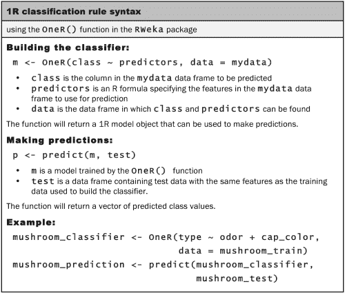

`OneR()`实现使用 R 公式语法来指定要训练的模型。公式语法使用`~`运算符(称为波浪号)来表达目标变量及其预测值之间的关系。要学习的类变量放在波浪号的左边，预测器特性写在右边，用`+`操作符分开。如果您想对`y`类与预测器`x1`和`x2`之间的关系进行建模，您可以将公式写成`y ~ x1 + x2`。如果您想在模型中包含所有变量，可以使用特殊术语`.`。例如，`y ~ .`指定了`y`和数据集中所有其他要素之间的关系。

### 提示

许多 R 函数都使用 R 公式语法，它提供了一些强大的功能来描述预测变量之间的关系。我们将在后面的章节中探讨其中的一些特性。然而，如果你渴望先睹为快，可以使用`?formula`命令随意阅读文档。

使用`type ~ .`公式，我们将允许我们的第一个`OneR()`规则学习者在构建其规则以预测类型时考虑蘑菇数据中所有可能的特征:

```
> mushroom_1R <- OneR(type ~ ., data = mushrooms)

```

为了检查它创建的规则，我们可以输入分类器对象的名称，在本例中是`mushroom_1R`:

```
> mushroom_1R

odor:
 almond  -> edible
 anise  -> edible
 creosote  -> poisonous
 fishy  -> poisonous
 foul  -> poisonous
 musty  -> poisonous
 none  -> edible
 pungent  -> poisonous
 spicy  -> poisonous
(8004/8124 instances correct)

```

在输出的第一行中，我们看到气味特性被选择用于规则生成。气味的种类，如杏仁、茴香等等，规定了蘑菇是否可以食用或有毒的规则。例如，如果蘑菇闻起来有鱼腥味、恶臭、发霉、刺鼻、辛辣或类似杂酚油的味道，那么蘑菇很可能是有毒的。另一方面，像杏仁和茴香这样气味更宜人的蘑菇，以及那些完全没有气味的蘑菇被预测可以食用。对于蘑菇采集的野外指南来说，这些规则可以总结为一个简单的经验法则:“如果蘑菇闻起来令人倒胃口，那么它很可能是有毒的。”

## 第 4 步–评估模型性能

输出的最后一行指出，这些规则正确地预测了 8124 个蘑菇样本中的 8004 个或近 99%的蘑菇样本的可食用性。我们可以使用`summary()`函数获得关于分类器的更多细节，如下例所示的:

```
> summary(mushroom_1R)

=== Summary ===
Correctly Classified Instances        8004  98.5229 %
Incorrectly Classified Instances       120  1.4771 %
Kappa statistic                          0.9704
Mean absolute error                      0.0148
Root mean squared error                  0.1215
Relative absolute error                  2.958  %
Root relative squared error             24.323  %
Coverage of cases (0.95 level)          98.5229 %
Mean rel. region size (0.95 level)      50      %
Total Number of Instances             8124 

=== Confusion Matrix ===
 a    b   <-- classified as
 4208    0 |    a = edible
 120 3796 |    b = poisonous

```

标有`Summary`的部分列出了许多不同的方法来衡量我们的 1R 分类器的性能。我们将在稍后的第 10 章、*评估模型性能*中讨论这些统计数据，因此我们现在忽略它们。

标有`Confusion Matrix`的部分与之前使用的相似。在这里，我们可以看到我们的规则出了什么问题。按键显示在右边，有`a = edible`和`b = poisonous`。表格列指示蘑菇的预测类别，而表格行将 4，208 种可食用蘑菇与 3，916 种有毒蘑菇分开。检查该表，我们可以看到，尽管 1R 分类器没有将任何可食用蘑菇分类为有毒，但它将 120 种有毒蘑菇分类为可食用——这是一个极其危险的错误！

考虑到学习者只利用了一个单一的特征，它做得相当好；如果一个人在寻找蘑菇时避免令人倒胃口的气味，他们几乎会避免去医院。也就是说，当涉及到生命时,“关闭”并不合适，更不用说当读者生病时,《野外指南》的出版商可能会对诉讼的前景感到不高兴。让我们看看是否可以添加更多的规则，开发一个更好的分类器。

## 第 5 步——提高模型性能

对于更复杂的规则学习者，我们将使用基于 Java 的 RIPPER 规则学习算法的实现`JRip()`。与我们之前使用的 1R 实现一样，`JRip()`包含在`RWeka`包中。如果您还没有这样做，请确保使用`library(RWeka)`命令加载软件包:

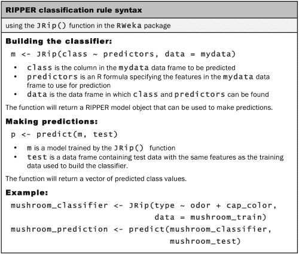

如语法框所示，训练一个`JRip()`模型的过程与我们之前训练一个`OneR()`模型的过程非常相似。这是`RWeka`包中的功能带来的令人愉快的好处之一；算法之间的语法是一致的，这使得比较许多不同模型的过程非常简单。

让我们像训练`OneR()`一样训练`JRip()`规则学习器，允许它从所有可用的特性中选择规则:

```
> mushroom_JRip <- JRip(type ~ ., data = mushrooms)

```

要检查规则，请键入分类器的名称:

```
> mushroom_JRip

JRIP rules:
===========
(odor = foul) => type=poisonous (2160.0/0.0)
(gill_size = narrow) and (gill_color = buff) => type=poisonous (1152.0/0.0)
(gill_size = narrow) and (odor = pungent) => type=poisonous (256.0/0.0)
(odor = creosote) => type=poisonous (192.0/0.0)
(spore_print_color = green) => type=poisonous (72.0/0.0)
(stalk_surface_below_ring = scaly) and (stalk_surface_above_ring = silky) => type=poisonous (68.0/0.0)
(habitat = leaves) and (cap_color = white) => type=poisonous (8.0/0.0)
(stalk_color_above_ring = yellow) => type=poisonous (8.0/0.0)
 => type=edible (4208.0/0.0)
Number of Rules : 9

```

`JRip()`分类器从蘑菇数据中共学习了 9 条规则。阅读这些规则的一个简单方法是将它们视为一系列 if-else 语句，类似于编程逻辑。前三个规则可以表示为:

*   如果气味是恶臭的，那么蘑菇类型是有毒的
*   如果鳃的大小很窄，鳃的颜色是浅黄色的，那么蘑菇是有毒的
*   如果鳃大小狭窄，气味刺鼻，那么蘑菇型有毒

最后，第九条规则意味着任何没有被前面八条规则覆盖的蘑菇样品都是可食用的。以我们的编程逻辑为例，这可以理解为:

*   另外，蘑菇是可以食用的

每个规则旁边的数字表示该规则覆盖的实例数和错误分类的实例数。值得注意的是，使用这九条规则没有错误分类蘑菇样本。结果，最后一个规则覆盖的实例数正好等于数据中的食用菌数(*N = 4208*)。

下图粗略说明了如何将规则应用于蘑菇数据。如果你把椭圆内的一切想象成所有种类的蘑菇，规则学习者识别出特征或特征集，这些特征将同质的片段从更大的组中分离出来。首先，该算法发现了一大群毒蘑菇，它们的恶臭是独一无二的。接下来，它发现了更小更特殊的毒蘑菇群。通过确定每种毒蘑菇的覆盖规则，发现所有剩余的蘑菇都是可食用的。感谢大自然，每种蘑菇都是独一无二的，分类器能够达到 100%的准确率。

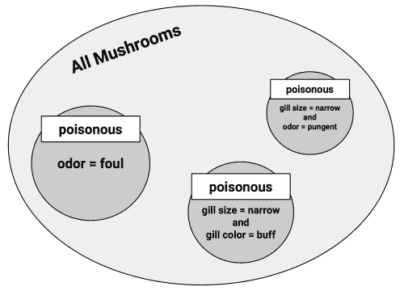<title>Summary</title>

# 总结

本章介绍了两种分类方法，它们使用所谓的“贪婪”算法根据特征值对数据进行分区。决策树使用分而治之的策略来创建类似流程图的结构，而规则学习者分离并征服数据来识别逻辑 if-else 规则。这两种方法产生的模型可以在没有统计背景的情况下进行解释。

一种流行且高度可配置的决策树算法是 C5.0。我们使用 C5.0 算法创建一个树来预测贷款申请人是否会违约。通过使用增加和成本敏感错误的选项，我们能够提高我们的准确性，并避免会给银行带来更多损失的高风险贷款。

我们还使用了两个规则学习器 1R 和 RIPPER 来开发识别毒蘑菇的规则。1R 算法使用单个特征在识别潜在致命蘑菇样品中实现了 99%的准确性。另一方面，由更复杂的 RIPPER 算法生成的九个规则正确地识别了每个蘑菇的可食用性。

这一章仅仅触及了如何使用树和规则的表面。在[第 6 章](ch06.html "Chapter 6. Forecasting Numeric Data – Regression Methods")、*预测数值数据-回归方法*中，我们将学习回归树和模型树技术，它们使用决策树进行数值预测，而不是分类。在[第 11 章](ch11.html "Chapter 11. Improving Model Performance")、*提高模型性能*中，我们将发现如何通过将决策树分组到一个被称为随机森林的模型中来提高决策树的性能。在[第 8 章](ch08.html "Chapter 8. Finding Patterns – Market Basket Analysis Using Association Rules")、*寻找模式-使用关联规则进行购物篮分析*中，我们将看到关联规则——一种与分类规则相关的规则——如何用于识别交易数据中的项目组。