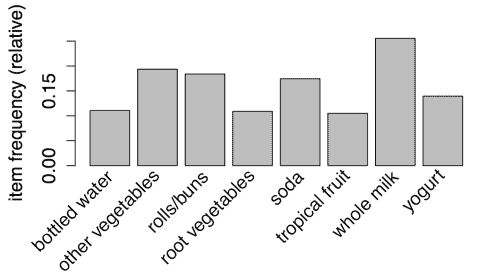
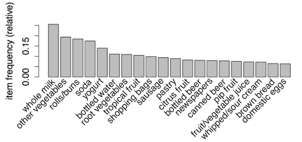
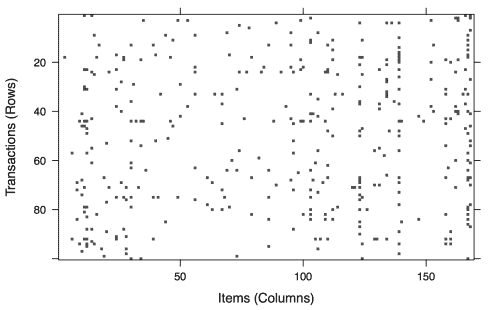
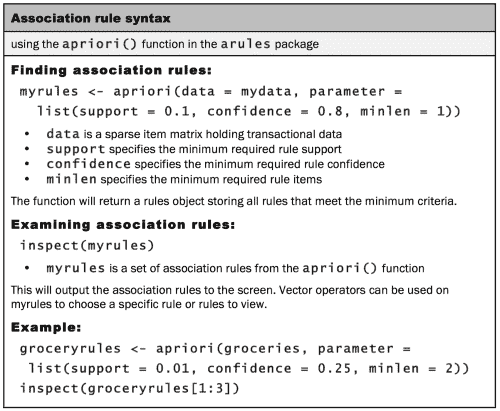

# 八、发现模式——将关联规则用于购物篮分析

回想一下你上一次冲动购物的情形。也许你在杂货店的收银台等着，买了一包口香糖或一块糖。也许在一次购买尿布和配方奶粉的深夜旅行中，你买了一杯含咖啡因的饮料或六罐啤酒。你甚至可能在书商的推荐下一时兴起买了这本书。这些冲动购买并非巧合，因为零售商使用复杂的数据分析技术来识别将推动零售行为的模式。

在过去的几年里，这种推荐系统是基于营销专业人员和库存管理人员或购买者的主观直觉。最近，随着条形码扫描仪、计算机化库存系统和在线购物趋势建立了大量的交易数据，机器学习越来越多地被应用于学习购买模式。实践通常被称为**购物篮分析**，因为它被如此频繁地应用于超市数据。

尽管这项技术起源于购物数据，但它在其他环境中也很有用。当你完成这一章的时候，你将能够把市场篮子分析技术应用到你自己的任务中，不管这些任务是什么。一般来说，这项工作包括:

*   使用简单的表现测量在大型数据库中寻找关联
*   理解事务数据的特性
*   知道如何识别有用的和可行的模式

市场篮子分析的结果是可操作的模式。因此，当我们应用这种技术时，你很可能会在你的作品中找到应用，即使你与零售连锁店没有关系。

# 理解关联规则

购物篮分析的构建模块是可能出现在任何给定交易中的项目。由一个或多个项目组成的组用括号括起来，表示它们形成一个集合，或者更具体地说，一个**项目集**以某种规律出现在数据中。事务是根据项集指定的，例如在典型的杂货店中可能会发现的以下事务:


购物篮分析的结果是一个**关联规则**的集合，这些规则指定了在项目集之间的关系中发现的模式。关联规则总是由项目集的子集组成，并通过将规则左侧的一个项目集(LHS)与规则右侧(RHS)的另一个项目集相关联来表示。LHS 是触发规则需要满足的条件，而 RHS 是满足该条件的预期结果。从示例事务中确定的规则可以用以下形式表示:


用通俗的语言来说，这个关联规则说明，如果花生酱和果冻一起购买，那么面包也有可能被购买。换句话说，“花生酱和果冻意味着面包。”

关联规则是在零售交易数据库的背景下开发的，它不是用于预测，而是用于大型数据库中无监督的知识发现。这与前几章中介绍的分类和数值预测算法不同。即便如此，你会发现关联规则学习器与[第五章](ch05.html "Chapter 5. Divide and Conquer – Classification Using Decision Trees and Rules")、*分而治之——使用决策树和规则分类*中提出的分类规则学习器有着密切的联系和许多共同的特征。

因为关联规则学习器是无监督的，所以不需要对算法进行训练；数据不需要提前标记。该程序只是在一个数据集上运行，希望能找到有趣的关联。当然，缺点是除了评估规则学习者的定性有用性之外，没有一种简单的方法来客观地衡量他们的表现——通常是某种眼球测试。

尽管关联规则最常用于购物篮分析，但它们有助于在许多不同类型的数据中发现模式。其他潜在应用包括:

*   在搜索癌症数据中有趣且频繁出现的 DNA 和蛋白质序列模式
*   发现与欺诈性信用卡或保险使用相结合的购物或医疗索赔模式
*   识别导致客户放弃移动电话服务或升级有线电视套餐的行为组合

关联规则分析用于在大量元素中搜索有趣的联系。人类能够非常直观地获得这种洞察力，但通常需要专家级的知识或大量的经验才能做到规则学习算法在几分钟甚至几秒钟内可以做到的事情。此外，有些数据集太大太复杂，人类很难大海捞针。

## 关联规则学习的 Apriori 算法

正如对人类来说具有挑战性一样，事务性数据使得关联规则挖掘对机器来说也是一项具有挑战性的任务。事务性数据集通常非常大，无论是在事务的数量方面，还是在被监控的项目或功能的数量方面。问题是潜在项目集的数量随着特征的数量呈指数增长。给定 *k* 个可以出现或不出现在一个集合中的项目，有*个 2^k* 个可能的项目集可以是潜在的规则。一个只销售 100 种不同商品的零售商可能有大约 *2^100 = 1.27e+30* 个项目集，而这些项目集是一个算法必须评估的——这似乎是一个不可能完成的任务。

一种更智能的规则学习算法不是逐个评估这些项目集，而是利用这样一个事实，即在现实中，许多项目的潜在组合很少在实践中被发现。例如，即使一家商店既卖汽车用品又卖女性化妆品，一套*{机油、口红}* 也可能非常罕见。通过忽略这些罕见的(也许是不太重要的)组合，可以将规则的搜索范围限制在更易于管理的范围内。

已经做了很多工作来识别用于减少要搜索的项目集数量的启发式算法。也许最广泛使用的在大型数据库中有效搜索规则的方法被称为 **Apriori** 。1994 年由 Rakesh Agrawal 和 Ramakrishnan Srikant 提出，Apriori 算法已经成为关联规则学习的同义词。这个名字来源于这样一个事实，即该算法利用了一个关于频繁项集属性的简单先验(即*先验*)信念。

在我们更深入地讨论之前，值得注意的是，这个算法，像所有的学习算法一样，并不是没有优点和缺点。其中一些列举如下:

| 

强项

 | 

弱点

 |
| --- | --- |
| 

*   能够处理大量的事务性数据
*   产生易于理解的规则
*   有助于“数据挖掘”和发现数据库中意想不到的知识

 | 

*   对小数据集帮助不大
*   需要努力将真正的洞察力从常识中分离出来
*   容易从随机模式中得出虚假的结论

 |

如前所述，Apriori 算法使用一个简单的*先验*信念来缩小关联规则搜索空间:频繁项集的所有子集也必须是频繁的。这种试探法被称为**先验属性**。利用这种敏锐的观察，可以极大地限制要搜索的规则的数量。例如，只有当*{机油}* 和*{口红}* 都频繁出现时，集合*{机油，口红}* 才能频繁出现。因此，如果机油或口红不常见，则包含这些项目的任何套装都可以从搜索中排除。

### 注

有关 Apriori 算法的其他详细信息，请参考:Agrawal R，Srikant R .挖掘关联规则的快速算法。*第 20 届超大型数据库国际会议论文集*。1994:487-499.

为了了解如何在更现实的环境中应用这一原则，让我们考虑一个简单的事务数据库。下表显示了在一家虚拟医院的礼品店中完成的五笔交易:

| 

交易编号

 | 

购买的项目

 |
| --- | --- |
| 一 | *{花，得到恩卡，汽水}* |
| 2 | *{毛绒玩具熊、鲜花、气球、糖果棒}* |
| 3 | *{获得健康卡、糖果棒、鲜花}* |
| 四 | *{毛绒玩具熊，气球，汽水}* |
| 5 | *{鲜花，得到恩卡，汽水}* |

通过观察购买组合，可以推断出有几种典型的购买模式。拜访生病的朋友或家人的人倾向于买一张康复卡和鲜花，而拜访新妈妈的人倾向于买毛绒玩具熊和气球。这种模式值得注意，因为它们出现的频率足以引起我们的兴趣；我们简单地应用一点逻辑和主题经验来解释这个规则。

以类似的方式，Apriori 算法使用项目集“兴趣度”的统计度量来在大得多的事务数据库中定位关联规则。在接下来的部分中，我们将发现 Apriori 如何计算这种感兴趣的度量，以及它们如何与 Apriori 属性结合以减少要学习的规则的数量。

## 衡量规则兴趣-支持和信心

关联规则是否被认为是有趣的由两个统计度量决定:支持度和置信度。通过为这些度量标准中的每一个提供最小阈值并应用先验原则，可以很容易地大大限制所报告的规则的数量，甚至可能限制到只识别显而易见或常识性规则的程度。因此，仔细理解这些标准下排除的规则类型非常重要。

项目集或规则的**支持**度量它在数据中出现的频率。例如项目集*{康复卡，鲜花}* ，在医院礼品店数据中支持 *3 / 5 = 0.6* 。同样的，*{得好卡}→{花}* 的支持度也是 0.6。可以为任何项目集甚至单个项目计算支持度；例如，对*{糖果条}* 的支持是 *2 / 5 = 0.4* ，因为糖果条出现在 40%的购买中。定义项目集 *X* 支持的函数可以定义如下:


这里， *N* 是数据库中的事务数， *count(X)* 是包含项目集 *X* 的事务数。

规则的**置信度**是对其预测能力或准确性的度量。定义为同时包含 *X* 和 *Y* 的项集的支持度除以仅包含 *X* 的项集的支持度:


本质上，置信度告诉我们项目或项目集 *X* 的存在导致项目或项目集 *Y* 的存在的事务的比例。请记住， *X* 导致 *Y* 的置信度与 *Y* 导致 *X* 的置信度是不同的。比如*{花}→{好卡}* 的置信度是 *0.6 / 0.8 = 0.75* 。相比较而言，*{好卡}→{花}* 的置信度为 *0.6 / 0.6 = 1.0* 。这意味着 75%的时间里，购买鲜花伴随着购买康复卡，而 100%的时间里，购买康复卡与鲜花相关。这些信息可能对礼品店的管理非常有用。

### 提示

您可能已经注意到了支持度、置信度和贝叶斯概率规则之间的相似性，这些规则包含在[第 4 章](ch04.html "Chapter 4. Probabilistic Learning – Classification Using Naive Bayes")、*概率学习——使用朴素贝叶斯分类*中。其实*支持度(A，B)* 与 *P(A∩B)* 相同*置信度(A → B)* 与 *P(B|A)* 相同。只是背景不同而已。

像*{康复卡}→{鲜花}* 这样的规则被称为**强规则**，因为它们既有很高的支持度，又有很高的信心。找到更强规则的一种方法是检查礼品店中商品的每一种可能的组合，测量支持度和置信度值，并只报告那些符合特定兴趣级别的规则。然而，如前所述，除了最小的数据集，这种策略通常不可行。

在下一节中，您将看到 Apriori 算法如何使用 Apriori 原则的最低支持度和置信度，通过将规则数量减少到更易于管理的水平来快速找到强规则。

## 用先验原则建立一套规则

回想一下先验原则声明频繁项目集的所有子集也必须是频繁的。换句话说，如果 *{A，B}* 是频繁的，那么 *{A}* 和 *{B}* 一定都是频繁的。还记得，根据定义，支持度指示一个项集在数据中出现的频率。因此，如果我们知道 *{A}* 不满足期望的支持度阈值，就没有理由考虑 *{A，B}* 或任何包含 *{A}* 的项目集；它不可能经常发生。

Apriori 算法使用这种逻辑在实际评估潜在关联规则之前将其排除。创建规则的实际过程分为两个阶段:

1.  识别满足最小支持阈值的所有项目集。
2.  使用满足最小置信度阈值的项目集从这些项目集中创建规则。

第一阶段发生在多次迭代中。每一次连续的迭代都包括评估一组越来越大的项目集的支持度。例如，迭代 1 涉及评估 1 项项集(1 项集)，迭代 2 评估 2 项集，依此类推。每次迭代 *i* 的结果是满足最小支持度阈值的所有 *i* 项集的集合。

来自迭代 *i* 的所有项目集被组合，以生成用于迭代 *i + 1* 中的评估的候选项目集。但是，先验原则甚至可以在下一轮开始之前消除其中一些。如果 *{A}* ， *{B}* ， *{C}* 在迭代 1 中频繁出现，而 *{D}* 不频繁出现，那么迭代 2 将只考虑 *{A，B}* ， *{A，C}* ，以及 *{B，C}* 。因此，该算法只需要评估三个项目集，而不是六个项目集，如果包含 *D* 的项目集没有被事先排除*。*

*继续这个思路，假设在迭代 2 中，发现 *{A，B }**{ B，C}* 频繁，而 *{A，C}* 不频繁。尽管迭代 3 通常会从评估对 *{A，B，C}* 的支持开始，但这一步并不是必须要进行的。为什么不呢？先验原则声明 *{A，B，C}* 不可能是频繁的，因为子集 *{A，C}* 不是。因此，如果在迭代 3 中没有生成新的项集，该算法可能会停止。*

*此时，Apriori 算法的第二阶段可能开始。给定频繁项目集的集合，从所有可能的子集生成关联规则。例如， *{A，B}* 将产生 *{A} → {B}* 和 *{B} → {A}* 的候选规则。这些规则将根据最小置信度阈值进行评估，任何不符合期望置信度的规则都将被删除。*

*<title>Example – identifying frequently purchased groceries with association rules</title>

# 示例–使用关联规则识别经常购买的食品杂货

正如在本章的介绍中所提到的，市场购物篮分析在幕后被用于许多实体和在线零售商所使用的推荐系统。学习关联规则表示经常一起购买的物品的组合。这些模式的知识提供了对连锁杂货店优化库存、宣传促销或组织商店物理布局的新方法的洞察。例如，如果购物者经常购买咖啡或橙汁搭配早餐糕点，那么将糕点放在离咖啡和果汁更近的地方可能会增加利润。

在本教程中，我们将对一家杂货店的交易数据进行购物篮分析。然而，该技术可以应用于许多不同类型的问题，从电影推荐，到约会网站，到发现药物之间的危险相互作用。这样，我们将看到 Apriori 算法如何有效地评估一组潜在的大量关联规则。

## 第一步——收集数据

我们的市场篮子分析将利用从真实世界的杂货店一个月的经营中收集的购买数据。该数据包含 9，835 笔交易或每天约 327 笔交易(在 12 小时的工作日中，大约每小时 30 笔交易)，这表明该零售商不是特别大，也不是特别小。

### 注

这里使用的数据集改编自`arules` R 包中的`Groceries`数据集。有关更多信息，请参阅:Hahsler M，Hornik K，Reutterer T,《挖掘关联规则的概率数据建模的含义》。In: Gaul W，Vichi M，Weihs C，ed。*分类、数据分析和知识组织研究:从数据和信息分析到知识工程*。纽约:斯普林格；2006:598–605.

典型的杂货店提供种类繁多的商品。可能有五种品牌的牛奶、十几种不同类型的洗衣液和三种品牌的咖啡。鉴于零售商的规模适中，我们将假设他们并不十分关心寻找仅适用于特定品牌的牛奶或洗涤剂的规则。记住这一点，所有的品牌名称都可以从购买中删除。这将食品杂货的种类减少到更容易管理的 169 种，使用了广泛的类别，如鸡肉、冷冻食品、人造黄油和苏打水。

### 提示

如果您希望识别高度具体的关联规则，例如客户喜欢花生酱中的葡萄果冻还是草莓果冻，您将需要大量的交易数据。大型连锁零售商使用包含数百万笔交易的数据库，以便在商品的特定品牌、颜色或口味之间找到关联。

你能猜到哪些类型的商品会一起购买吗？葡萄酒和奶酪会是常见的搭配吗？面包和黄油？茶和蜂蜜？让我们深入研究一下这些数据，看看能否证实我们的猜测。

## 第 2 步——探索和准备数据

事务性数据的存储格式与我们之前使用的格式略有不同。我们之前的大部分分析利用矩阵形式的数据，其中行表示示例实例，列表示特征。给定矩阵格式的结构，要求所有示例具有完全相同的一组特征。

相比较而言，事务性数据是一种更自由的形式。像往常一样，数据中的每一行都指定了一个示例—在本例中是一个事务。但是，每个记录都包含一个逗号分隔的任意数量的项目列表，从一个到多个，而不是有固定数量的特性。本质上，特征可能因示例而异。

### 提示

为了跟随这个分析，从 Packt Publishing 网站下载`groceries.csv`文件并保存在您的 R 工作目录中。

原始`grocery.csv`文件的前五行如下:

```
citrus fruit,semi-finished bread,margarine,ready soups
tropical fruit,yogurt,coffee
whole milk
pip fruit,yogurt,cream cheese,meat spreads
other vegetables,whole milk,condensed milk,long life bakery product
```

这些线表示五个独立的杂货店交易。第一笔交易包括四个项目:柑橘类水果、半成品面包、人造黄油和即食汤。相比之下，第三笔交易只包括一个项目:全脂牛奶。

假设我们像在前面的分析中一样，尝试使用`read.csv()`函数加载数据。R 很乐意遵从并将数据读入如下矩阵形式:


您会注意到 R 创建了四列来存储事务数据中的项目:`V1`、`V2`、`V3`和`V4`。虽然这似乎是合理的，但如果我们使用这种形式的数据，我们以后会遇到问题。R 选择创建四个变量，因为第一行正好有四个逗号分隔的值。然而，我们知道杂货店购买可以包含四个以上的项目；在四列设计中，这种交易将在矩阵中的多行中分解。我们可以尝试通过将具有最大数量项目的事务放在文件的顶部来解决这个问题，但是这忽略了另一个更有问题的问题。

通过以这种方式构造数据，R 构建了一组特征，不仅记录交易中的项目，还记录它们出现的顺序。如果我们将我们的学习算法想象为试图找到`V1`、`V2`、`V3`和`V4`之间的关系，那么`V1`中的全脂牛奶可能会与`V2`中出现的全脂牛奶被不同地对待。相反，我们需要一个数据集，它不会将交易视为一组要填充(或不填充)特定项目的头寸，而是视为一个包含或不包含每个特定项目的市场篮子。

### 数据准备–创建交易数据的稀疏矩阵

这个问题的解决方案利用了一种叫做稀疏矩阵的数据结构。你可能还记得，在第四章、*概率学习——使用朴素贝叶斯*分类中，我们使用了稀疏矩阵来处理文本数据。与前面的数据集一样，稀疏矩阵中的每一行都表示一个事务。然而，对于可能出现在某人购物袋中的每一件物品，稀疏矩阵都有一列(即特征)。由于杂货店数据中有 169 种不同的商品，我们的稀疏矩阵将包含 169 列。

为什么不像我们在大多数分析中所做的那样，将它存储为数据框呢？原因是随着额外的事务和项目的增加，传统的数据结构很快变得太大而不适合可用的存储器。即使这里使用相对较小的事务性数据集，矩阵也包含近 170 万个单元，其中大多数包含零(因此，称为“稀疏”矩阵，非零值非常少)。由于存储所有这些零值没有任何好处，所以稀疏矩阵实际上并不将整个矩阵存储在内存中；它只存储项目所占用的单元格。这使得该结构比同等大小的矩阵或数据帧具有更高的存储效率。

为了从事务数据中创建稀疏矩阵数据结构，我们可以使用`arules`包提供的功能。使用`install.packages("arules")`和`library(arules)`命令安装并加载软件包。

### 注意

有关 arules 包的更多信息，请参考:Hahsler M，Gruen B，Hornik k . arules——一种用于挖掘关联规则和频繁项目集的计算环境。*统计软件杂志。2005;14* 。

因为我们正在加载事务数据，所以我们不能简单地使用之前使用的`read.csv()`函数。相反，`arules`提供了一个类似于`read.csv()`的`read.transactions()`函数，除了它产生一个适用于交易数据的稀疏矩阵。`sep = ","`参数指定输入文件中的条目用逗号分隔。要将`groceries.csv`数据读入一个名为`groceries`的稀疏矩阵，请键入以下行:

```
> groceries <- read.transactions("groceries.csv", sep = ",")

```

要查看关于我们刚刚创建的`groceries`矩阵的一些基本信息，在对象上使用`summary()`函数:

```
> summary(groceries)
transactions as itemMatrix in sparse format with
 9835 rows (elements/itemsets/transactions) and
 169 columns (items) and a density of 0.02609146

```

输出中的第一个信息块(如前所示)提供了我们创建的稀疏矩阵的摘要。输出`9835 rows`指的是交易的数量，输出`169 columns`指的是可能出现在某人的购物篮中的 169 种不同的商品。如果该商品是为相应的交易购买的，则矩阵中的每个单元格为`1`，否则为`0`。

`0.02609146`的**密度**值(2.6%)是指非零矩阵细胞的比例。由于矩阵中有 *9，835 * 169 = 1，662，115* 个位置，我们可以计算出在商店 30 天的营业期间总共购买了 *1，662，115 * 0.02609146 = 43，367* 件商品(忽略可能购买了相同商品的重复商品的事实)。通过额外的步骤，我们可以确定平均交易包含 *43，367 / 8，835 = 4.409* 个不同的杂货项目。当然，如果我们进一步查看输出，我们会看到已经提供了每个事务的平均项目数。

`summary()`输出的下一个块列出了事务数据中最常见的项目。由于 *2，513 / 9，835 = 0.2555* ，我们可以确定全脂牛奶出现在 25.6%的交易中。其他蔬菜、面包卷、汽水和酸奶也是其他常见食物，如下所示:

```
most frequent items:
 whole milk other vegetables       rolls/buns
 2513             1903             1809
 soda           yogurt          (Other)
 1715             1372            34055

```

最后，我们看到了一组关于交易规模的统计数据。共有 2159 项交易只包含一个项目，而一项交易有 32 个项目。第一个四分位数和中值购买量分别是两件和三件，这意味着 25%的交易包含两件或更少的物品，交易分为少于三件和多于三件。每笔交易 4.409 件的平均值与我们手工计算的值相符。

```
element (itemset/transaction) length distribution:
sizes
 1    2    3    4    5    6    7    8    9   10   11   12
2159 1643 1299 1005  855  645  545  438  350  246  182  117
 13   14   15   16   17   18   19   20   21   22   23   24
 78   77   55   46   29   14   14    9   11    4    6    1
 26   27   28   29   32
 1    1    1    3    1

 Min. 1st Qu.  Median    Mean 3rd Qu.    Max.
 1.000   2.000   3.000   4.409   6.000  32.000

```

`arules`包包含一些用于检查交易数据的有用特性。要查看稀疏矩阵的内容，将`inspect()`函数与向量运算符结合使用。前五个事务可以按如下方式查看:

```
> inspect(groceries[1:5])
 items 
1 {citrus fruit, 
 margarine, 
 ready soups, 
 semi-finished bread} 
2 {coffee, 
 tropical fruit, 
 yogurt} 
3 {whole milk} 
4 {cream cheese, 
 meat spreads, 
 pip fruit, 
 yogurt} 
5 {condensed milk, 
 long life bakery product,
 other vegetables, 
 whole milk}

```

这些交易符合我们对原始 CSV 文件的看法。为了检查一个特定的项目(即一列数据)，可以使用`[row, column]`矩阵的概念。将它与`itemFrequency()`函数一起使用，我们可以看到包含该项目的交易的比例。例如，这允许我们查看杂货数据中前三项的支持级别:

```
> itemFrequency(groceries[, 1:3])
abrasive cleaner artif. sweetener   baby cosmetics
 0.0035587189     0.0032536858     0.0006100661

```

请注意，稀疏矩阵中的项目按字母顺序在列中排序。研磨清洁剂和人工甜味剂的交易量约为 0.3%，而婴儿化妆品的交易量约为 0.06%。

### 可视化项目支持–项目频率图

为了直观地显示这些统计数据，使用`itemFrequencyPlot()`功能。这允许您生成一个条形图，描述包含某些项目的交易的比例。由于交易数据包含大量的项目，您通常需要限制出现在图中的项目，以便生成清晰的图表。

如果您要求这些项目出现在最小比例的事务中，请使用带有`support`参数的`itemFrequencyPlot()`:

```
> itemFrequencyPlot(groceries, support = 0.1)

```

如下图所示，这会生成一个直方图，显示`groceries`数据中至少有 10%支持度的八个项目:



如果您想将绘图限制在特定数量的项目上，可以将`topN`参数与`itemFrequencyPlot()`一起使用:

```
> itemFrequencyPlot(groceries, topN = 20)

```

直方图随后按支持度递减排序，如下图所示，`groceries`数据中的前 20 项:



### 可视化交易数据–绘制稀疏矩阵

除了查看项目之外，还可以可视化整个稀疏矩阵。为此，使用`image()`功能。显示前五个事务的稀疏矩阵的命令如下:

```
> image(groceries[1:5])

```

结果图描绘了一个具有 5 行 169 列的矩阵，指示了我们请求的 5 个事务和 169 个可能的项目。对于购买项目(列)的交易(行),矩阵中的单元格用黑色填充。


虽然前面的图表很小，可能有点难以阅读，但您可以看到第一个、第四个和第五个事务各包含四个项目，因为它们的行中填充了四个单元格。您还可以看到第三、第五、第二和第四行有一个共同的项目(在图的右侧)。

这种可视化可以成为探索数据的有用工具。首先，它可能有助于识别潜在的数据问题。一直向下填充的列可能表示在每笔交易中购买的商品，如果零售商的名称或标识号无意中包含在交易数据集中，可能会出现这种问题。

此外，图表中的模式可能有助于揭示交易和项目中可操作的洞察力，特别是如果数据以有趣的方式排序的话。例如，如果交易是按日期排序的，黑点的图案可以揭示购买的商品数量或种类的季节性影响。也许在圣诞节或光明节前后，玩具更为常见；万圣节前后，也许糖果变得流行起来。如果项目也被分类，这种类型的可视化会特别强大。然而，在大多数情况下，情节看起来相当随机，就像电视屏幕上的静态画面一样。

请记住，这种可视化对于非常大的事务数据库没有多大用处，因为单元格太小，无法识别。不过，通过将它与`sample()`函数结合起来，您可以查看一组随机抽样的事务的稀疏矩阵。创建 100 个事务的随机选择的命令如下:

```
> image(sample(groceries, 100))

```

这将创建一个 100 行 169 列的矩阵图:



有几列看起来相当拥挤，表明商店里有一些非常受欢迎的商品。但总的来说，点的分布似乎相当随机。鉴于没有其他值得注意的，让我们继续我们的分析。

## 步骤 3–根据数据训练模型

数据准备完成后，我们现在可以在购物车商品中寻找关联。我们将在我们用来探索和准备杂货数据的`arules`包中使用 Apriori 算法的实现。如果您还没有安装和加载这个包，那么您需要安装和加载它。下表显示了使用`apriori()`函数创建规则集的语法:



尽管运行`apriori()`函数很简单，但有时需要进行大量的反复试验，才能找到产生合理数量关联规则的`support`和`confidence`参数。如果您将这些级别设置得太高，您可能会发现没有规则，或者规则太普通而没有多大用处。另一方面，过低的阈值可能会导致大量的规则，或者更糟糕的是，操作可能会花费很长时间或者在学习阶段耗尽内存。

在这种情况下，如果我们试图使用`support = 0.1`和`confidence = 0.8`的默认设置，我们最终会得到一组零规则:

```
> apriori(groceries)
set of 0 rules

```

显然，我们需要扩大搜索范围。

### 提示

如果你仔细想想，这种结果本不应该令人十分惊讶。因为`support = 0.1`默认情况下，为了生成一个规则，一个项目必须至少出现在*0.1 * 9385 = 938.5*个交易中。既然只有八个项目在我们的数据中如此频繁地出现，难怪我们没有发现任何规律。

解决设置最小支持阈值问题的一种方法是，在考虑感兴趣的模式之前，考虑需要的最小事务数。例如，你可以说，如果一件商品一天被购买两次(一个月的数据中大约 60 次)，这可能是一个有趣的模式。从那里，可以计算出只找到匹配至少那么多事务的规则所需的支持级别。由于 9835 中的 60 等于 0.006，我们将首先尝试在那里设置支持。

设定最低置信度需要一种微妙的平衡。一方面，如果信心太低，我们可能会被大量不可靠的规则淹没——例如几十个规则指示通常与电池一起购买的物品。那么我们如何知道广告预算的目标呢？另一方面，如果我们将置信度设置得太高，我们就会局限于显而易见或不可避免的规则——类似于烟雾探测器总是与电池一起购买。在这种情况下，将烟雾探测器移近电池不太可能产生额外的收入，因为这两个项目几乎总是一起购买。

### 提示

适当的最低置信水平在很大程度上取决于您的分析目标。如果你从一个保守的值开始，如果你没有找到可操作的情报，你总是可以减少它来扩大搜索。

我们将从 0.25 的置信阈值开始，这意味着为了包含在结果中，规则必须在至少 25%的时间内是正确的。这将消除最不可靠的规则，同时为我们提供一些空间，通过有针对性的促销来修改行为。

我们现在准备生成一些规则。除了最小的`support`和`confidence`参数之外，设置`minlen = 2`来消除包含少于两个项目的规则也很有帮助。这样可以防止因为频繁购买而创建不感兴趣的规则，例如 *{}* *→* *全脂牛奶*。这条规则满足了最低限度的支持和信心，因为全脂牛奶在超过 25%的交易中被购买，但它不是一个非常可行的见解。

使用 Apriori 算法查找一组关联规则的完整命令如下:

```
> groceryrules <- apriori(groceries, parameter = list(support =
 0.006, confidence = 0.25, minlen = 2))

```

这将我们的规则保存在一个`rules`对象中，通过键入它的名字可以窥见一斑:

```
> groceryrules
set of 463 rules

```

我们的`groceryrules`对象包含一组 463 条关联规则。为了确定它们是否有用，我们必须更深入地挖掘。

## 第 4 步–评估模型表现

为了获得关联规则的高级概述，我们可以如下使用`summary()`。规则长度分布告诉我们每个项目计数有多少规则。在我们的规则集中，150 条规则只有两项，而 297 条有三项，16 条有四项。与此分布相关的`summary`统计数据也已给出:

```
> summary(groceryrules)
set of 463 rules

rule length distribution (lhs + rhs):sizes
 2   3   4
150 297  16

 Min. 1st Qu.  Median    Mean 3rd Qu.    Max.
 2.000   2.000   3.000   2.711   3.000   4.000

```

### 提示

正如前面的输出中所提到的，规则的大小计算为规则左侧(`lhs`)和右侧(`rhs`)的总和。这意味着像*{ bread }***→**{ butter }*这样的规则是两个项目，而*{花生酱、果冻}***→**【bread }*是三个项目。**

**接下来，我们看到规则质量度量的汇总统计数据:支持、信心和提升。支持和信任措施不应该非常令人惊讶，因为我们使用这些作为规则的选择标准。如果大多数或所有规则的支持度和信任度非常接近最低阈值，我们可能会感到震惊，因为这意味着我们可能将标准设得太高了。这里的情况并非如此，因为有许多规则的值都要高得多。**

```
****summary of quality measures:**
 **support           confidence          lift** 
 **Min.   :0.006101   Min.   :0.2500   Min.   :0.9932** 
 **1st Qu.:0.007117   1st Qu.:0.2971   1st Qu.:1.6229** 
 **Median :0.008744   Median :0.3554   Median :1.9332** 
 **Mean   :0.011539   Mean   :0.3786   Mean   :2.0351** 
 **3rd Qu.:0.012303   3rd Qu.:0.4495   3rd Qu.:2.3565** 
 **Max.   :0.074835   Max.   :0.6600   Max.   :3.9565**** 
```

**第三列是我们尚未考虑的指标。一个规则的*提升*度量一个项目或项目集相对于其典型购买率被购买的可能性有多大，假设你知道另一个项目或项目集已经被购买。这由以下等式定义:**

****

### **提示**

**与项目顺序相关的置信度不同， *lift(X → Y)* 与 *lift(Y → X)* 相同。**

**例如，假设在杂货店，大多数人购买牛奶和面包。仅仅出于偶然，我们会发现牛奶和面包都有很多交易。然而，如果 *lift(牛奶→面包)*大于 1，则意味着这两个项目一起出现的频率比人们预期的要高。因此，大的提升值是规则重要的强有力的指示，并且反映了项目之间的真实联系。**

**在`summary()`输出的最后一部分，我们接收挖掘信息，告诉我们规则是如何选择的。在这里，我们看到包含 9，835 个交易的`groceries`数据用于构建最小支持度为 0.0006、最小置信度为 0.25 的规则:**

```
****mining info:**
 **data ntransactions support confidence**
 **groceries          9835   0.006       0.25**** 
```

**我们可以使用`inspect()`函数来看看具体的规则。例如,`groceryrules`对象中的前三条规则可以按如下方式查看:**

```
****> inspect(groceryrules[1:3])**** 
```

****

**第一条规则可以用简单的语言理解为，“如果顾客买盆栽植物，他们也会买全脂牛奶。”在 0.007 的支持度和 0.400 的置信度下，我们可以确定该规则涵盖 0.7%的交易，并且在涉及盆栽植物的 40%的购买中是正确的。lift 值告诉我们，假设顾客购买了一盆盆栽植物，相对于普通顾客，他/她购买全脂牛奶的可能性有多大。因为我们知道大约 25.6%的顾客购买了全脂牛奶(`support`)，而购买盆栽植物的顾客中有 40%购买了全脂牛奶(`confidence`)，所以我们可以计算 lift 值为 *0.40 / 0.256 = 1.56* ，这与显示的值相匹配。**

### **注意**

**请注意，标有`support`的列表示规则的支持值，而不是仅表示`lhs`或`rhs`的支持值。**

**尽管信心和 lift 都很高，但是*{盆栽}**→**{全脂奶}* 看起来是不是很有用的法则？可能不会，因为似乎没有一个合乎逻辑的理由来解释为什么有人会更有可能用盆栽植物来买牛奶。然而，我们的数据显示并非如此。我们如何理解这个事实？**

**一种常见的方法是将关联规则分为以下三类:**

*   **可控告的**
*   **不重要的**
*   **费解的**

**显然，购物篮分析的目标是找到**可操作的**规则，提供清晰而有用的洞察力。有些规则很清楚，有些则很有用；很少发现这两种因素的结合。**

**所谓的**琐碎的规则**包括任何明显到不值得一提的规则——它们很清楚，但没用。假设你是一名营销顾问，被支付了一大笔钱，为交叉促销商品寻找新的机会。如果你报告了*【尿布】* *→* *【公式】*的发现，你很可能不会被邀请回来从事另一份咨询工作。**

### **提示**

**琐碎的规则也可以伪装成更有趣的结果。例如，假设你发现了某个品牌的儿童麦片和某部 DVD 电影之间的联系。如果电影的主角在麦片盒子的正面，这个发现就不是很有见地了。**

**如果项目之间的联系如此不清楚，以至于弄清楚如何使用信息是不可能或几乎不可能的，那么规则就是无法解释的。该规则可能只是数据中的一个随机模式，例如，一个规则表明*{ pickles }**→**{巧克力冰淇淋}* 可能是由于一个客户，其怀孕的妻子经常渴望奇怪的食物组合。**

**最好的规则是隐藏的宝石——那些未被发现的对模式的洞察力，一旦被发现就变得显而易见。如果有足够的时间，一个人可以评估每一个规则来找到宝石。然而，我们(执行购物篮分析的人)可能不是判断一个规则是可操作的、琐碎的还是无法解释的最佳判断者。在下一节中，我们将通过采用排序和共享学习到的规则的方法来提高我们工作的效用，这样最有趣的结果可能会浮到顶部。**

## **第 5 步——提高模型表现**

**专家也许能够很快识别出有用的规则，但是让他们评估成百上千的规则是浪费他们的时间。因此，能够根据不同的标准对规则进行排序，并将它们从 R 中提取出来，形成一种可以与营销团队共享并进行更深入检查的形式是非常有用的。这样，我们可以通过使结果更具可操作性来提高规则的表现。**

### **对关联规则集进行排序**

**根据购物篮分析的目标，最有用的规则可能是那些具有最高`support, confidence,`或`lift.`的规则。`arules`包包含一个`sort()`函数，可用于对规则列表进行重新排序，使具有最高或最低质量度量值的规则排在最前面。**

**为了对`groceryrules`对象重新排序，我们可以应用`sort()`，同时为 by 参数指定一个`"support"`、`"confidence"`或`"lift"`值。通过将`sort`函数与向量操作符相结合，我们可以获得特定数量的有趣规则。例如，可以使用以下命令检查根据提升统计信息的最佳五个规则:**

```
****> inspect(sort(groceryrules, by = "lift")[1:5])**** 
```

**这些输出如下所示:**

****

**这些规则似乎比我们之前看到的更有趣。第一条规则，T10 值约为 3.96，意味着购买草本植物的人购买块根类蔬菜的可能性是普通消费者的近四倍——也许是为了某种炖菜？规则二也很有趣。鲜奶油在装有浆果的购物车中出现的几率是其他购物车的三倍多，这表明它可能是甜点的搭配？**

### **提示**

**默认情况下，排序顺序是递减的，这意味着最大的值排在最前面。要颠倒这个顺序，添加一个附加行，`parameterdecreasing = FALSE`。**

### **提取关联规则的子集**

**假设有了前面的规则，营销团队对制作一个广告来推销浆果的可能性感到兴奋，现在正是浆果上市的季节。然而，在活动结束之前，他们要求你调查浆果是否经常与其他物品一起购买。要回答这个问题，我们需要找到所有以某种形式包含浆果的规则。**

**`subset()`函数提供了一种搜索事务、项目或规则子集的方法。要使用它来查找任何带有出现在规则中的`berries`的规则，使用下面的命令。它会将规则存储在一个名为`berryrules`的新对象中:**

```
****> berryrules <- subset(groceryrules, items %in% "berries")**** 
```

**然后，我们可以像处理更大的集合一样检查规则:**

```
****> inspect(berryrules)**** 
```

**结果是以下一组规则:**

****

**有四个规则涉及浆果，其中两个似乎足够有趣，可以被称为可操作的。除了鲜奶油，浆果也经常和酸奶一起购买——这对组合可以作为早餐或午餐以及甜点。**

**`subset()`功能非常强大。选择子集的标准可以用几个关键字和运算符来定义:**

*   **前面解释过的关键字`items`匹配出现在规则中任何地方的一个条目。要将子集限制为仅在左侧或右侧匹配，请使用`lhs`和`rhs`代替。**
*   **操作符`%in%`意味着在您定义的列表中必须找到至少一个项目。如果你想要任何匹配浆果或酸奶的规则，你可以写`items %in%c("berries", "yogurt”)`。**
*   **附加运算符可用于部分匹配(`%pin%`)和完全匹配(`%ain%`)。部分匹配允许您使用一个搜索:`items %pin% "fruit"`找到柑橘类水果和热带水果。完全匹配要求所有列出的项目都存在。例如，`items %ain% c("berries", "yogurt")`只查找同时具有`berries`和`yogurt`的规则。**
*   **子集也可以被`support`、`confidence`或`lift`限制。例如，`confidence > 0.50`会将您限制在置信度大于 50%的规则上。**
*   **匹配的标准可以与标准的 R 逻辑操作符结合使用，比如 and ( `&`)、or ( `|`)和 not ( `!`)。**

**使用这些选项，您可以将规则的选择限制为您想要的特定或一般。**

### **将关联规则保存到文件或数据框中**

**为了分享您的购物篮分析的结果，您可以使用`write()`函数将规则保存到 CSV 文件中。这将生成一个 CSV 文件，可用于大多数电子表格程序，包括 Microsoft Excel:**

```
****> write(groceryrules, file = "groceryrules.csv",**
 **sep = ",", quote = TRUE, row.names = FALSE)**** 
```

**有时将规则转换成 R 数据框架也很方便。这可以使用`as()`功能轻松完成，如下所示:**

```
****> groceryrules_df <- as(groceryrules, "data.frame")**** 
```

**这将创建一个数据框，其中包含因子格式的规则，以及用于`support`、`confidence`和`lift`的数字向量:**

```
****> str(groceryrules_df)**
**'data.frame':463 obs. of 4 variables:**
 **$ rules     : Factor w/ 463 levels "{baking powder} => {other vegetables}",..: 340 302 207 206 208 341 402 21 139 140 ...**
 **$ support   : num  0.00691 0.0061 0.00702 0.00773 0.00773 ...**
 **$ confidence: num  0.4 0.405 0.431 0.475 0.475 ...**
 **$ lift      : num  1.57 1.59 3.96 2.45 1.86 ...**** 
```

**如果您想要对规则执行额外的处理或者需要将它们导出到另一个数据库，您可能会选择这样做。**

**<title>Summary</title>

# 总结

关联规则经常被用来在大型零售商的海量交易数据库中发现有用的信息。作为一个无监督的学习过程，关联规则学习者能够从大型数据库中提取知识，而无需任何关于要寻找什么模式的先验知识。问题是，要将大量信息压缩成更小、更易管理的结果集需要一些努力。我们在本章中学习的 Apriori 算法是通过设置最小兴趣阈值，并只报告符合这些标准的关联来实现的。

我们使用 Apriori 算法对一家中型超市一个月的交易进行购物篮分析。即使在这个小例子中，也发现了大量的关联。在这些模式中，我们注意到了几种可能对未来营销活动有用的模式。我们应用的相同方法在规模大得多的零售商的数据库中使用，数据库的规模是我们的许多倍。

在下一章，我们将研究另一种无监督学习算法。与关联规则非常相似，它旨在发现数据中的模式。但与寻找特征中的模式的关联规则不同，下一章的方法关注的是寻找例子之间的联系。***