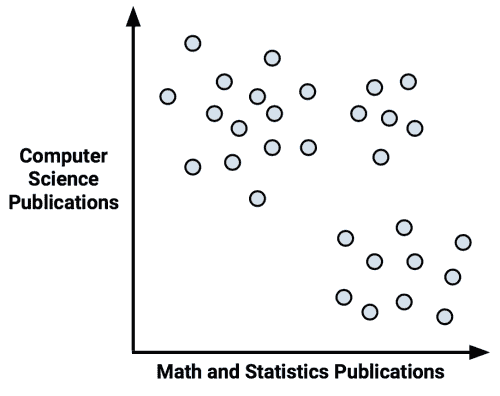
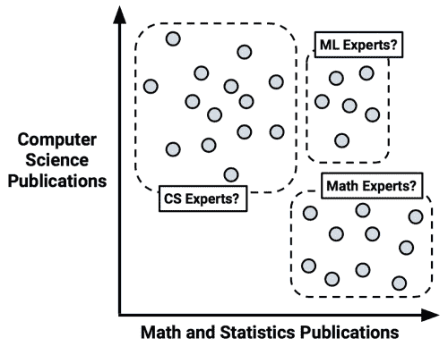
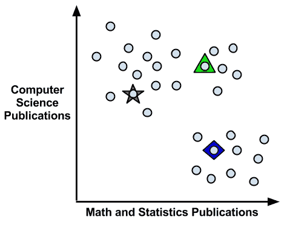
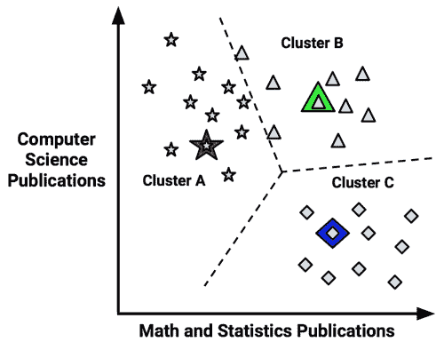
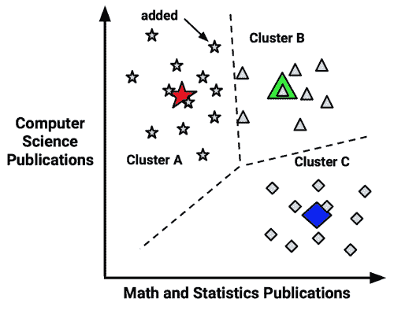
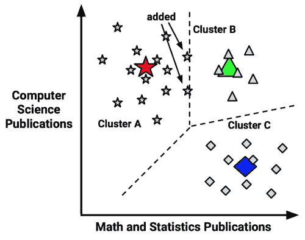
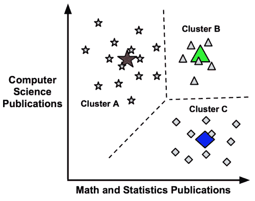
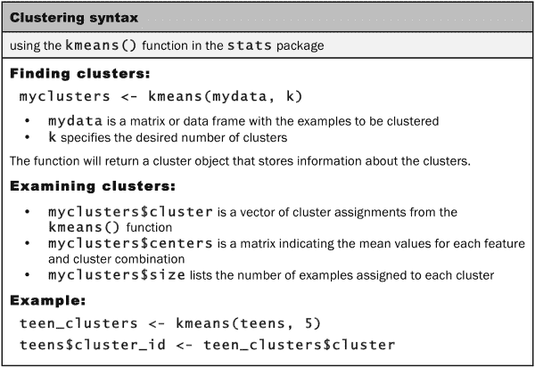
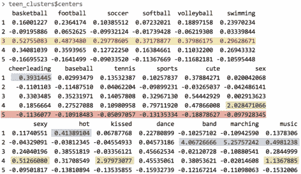
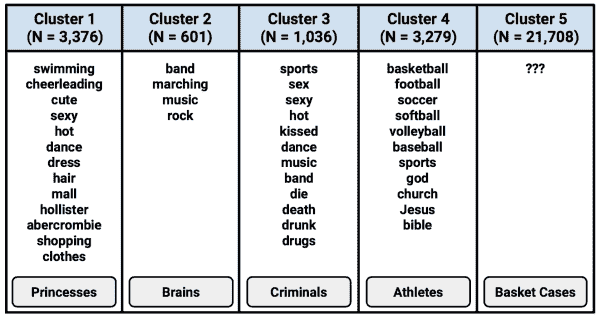

# 第九章。寻找数据组–用 k-means 聚类

你曾经花时间观看一大群人吗？如果是这样，你很可能已经看到了一些重复出现的人格。也许某一类型的人，通过一套新熨过的西装和一个公文包，成为“肥猫”商务主管的典型代表。一个穿着紧身牛仔裤、法兰绒衬衫和太阳镜的 20 多岁的年轻人可能会被称为“潮人”，而一个从小型货车上卸下孩子的女人可能会被称为“足球妈妈”。

当然，这些类型的刻板印象应用到个人身上是危险的，因为没有两个人是完全一样的。然而，作为一种描述集体的方式，这些标签捕捉到了群体中个体之间潜在的相似性。

你很快就会知道，聚类的行为，或发现数据中的模式，与发现人群中的模式没有太大的不同。在本章中，您将学习:

*   聚类任务的方式不同于我们之前研究的分类任务
*   聚类如何定义一个组，以及 k-means(一种经典且易于理解的聚类算法)如何识别这样的组
*   将聚类应用于在青少年社交媒体用户中识别市场细分的现实任务所需的步骤

在开始行动之前，我们将首先深入了解集群到底需要什么。

# 了解聚类

聚类是一种无监督的机器学习任务，它自动将数据分为**个簇、**或相似项目的组。它这样做的时候并没有提前被告知这些组应该是什么样子。由于我们可能甚至不知道我们在寻找什么，聚类用于知识发现而不是预测。它提供了对数据中发现的自然分组的洞察。

如果事先不知道一个集群是由什么组成的，计算机怎么可能知道一个组在哪里结束，另一个组在哪里开始？答案很简单。聚类的指导原则是，聚类内部的项目应该彼此非常相似，但与外部的项目非常不同。相似性的定义可能因应用而异，但基本思想总是相同的——对数据进行分组，以便将相关元素放在一起。

由此产生的集群可用于行动。例如，您可能会在以下应用中找到聚类方法:

*   将客户划分为具有相似人口统计数据或购买模式的群体，以开展有针对性的营销活动
*   通过识别已知群集之外的使用模式来检测异常行为，如未经授权的网络入侵
*   通过将具有相似值的要素分组到数量较少的同类类别中来简化极大的数据集

总的来说，只要不同的数据可以用数量少得多的组来举例说明，聚类就很有用。它会产生有意义且可操作的数据结构，从而降低复杂性并提供对关系模式的洞察。

## 作为机器学习任务的聚类

聚类与我们到目前为止研究的分类、数值预测和模式检测任务有些不同。在每一种情况下，结果都是一个将特征与结果或特征与其他特征相关联的模型；从概念上讲，模型描述了数据中的现有模式。相反，聚类创建新数据。未标记的示例被给予完全从数据内的关系推断出的聚类标签。出于这个原因，有时你会看到被称为**无监督分类**的聚类任务，因为在某种意义上，它对未标记的例子进行分类。

问题是从无监督分类器获得的类别标签没有内在意义。聚类将告诉您哪些示例组是密切相关的—例如，它可能返回组 A、B 和 C—但是应用可操作的和有意义的标签取决于您。为了了解这如何影响集群任务，让我们考虑一个假设的例子。

假设您正在组织一个以数据科学为主题的会议。为了促进专业网络和协作，您计划根据三个研究专业之一将人们分组:计算机和/或数据库科学、数学和统计以及机器学习。不幸的是，在发出会议邀请后，您意识到您忘记了包括一项调查，询问与会者更喜欢坐在哪个学科的座位上。

灵光一现，你意识到你可以通过检查每个学者的出版历史来推断他或她的研究专业。为此，您开始收集每个参与者在计算机科学相关期刊上发表的文章数量以及在数学或统计相关期刊上发表的文章数量的数据。使用为几位学者收集的数据，您可以创建一个散点图:



不出所料，似乎有一种模式。我们可能会猜测，左上角代表拥有许多计算机科学出版物但很少数学文章的人，可能是一群计算机科学家。按照这个逻辑，右下角可能是一群数学家。同样，右上角，那些既有数学又有计算机科学经验的人，可能是机器学习专家。

我们的分组在视觉上形成；我们只是将聚类识别为紧密分组的数据点。然而，尽管看似明显的分组，但不幸的是，如果不亲自询问每个学者的学术专长，我们就无法知道他们是否真正同质。我们使用的标签要求我们对属于这个群体的人的类型做出定性的、假定的判断。因此，您可能会用不确定的术语来想象分类标签，如下所示:



与其主观地定义群体边界，不如用机器学习来客观地定义它们。鉴于上图中的轴平行分裂，我们的问题似乎是第五章、*分而治之——使用决策树和规则分类*中描述的决策树的明显应用。这可能以“如果一个学者很少有数学出版物，那么他/她是计算机科学专家”的形式为我们提供了一个规则不幸的是，这个计划有一个问题。由于我们没有关于每个点的真实类值的数据，监督学习算法将没有能力学习这样的模式，因为它将无法知道什么样的分裂将导致同质组。

另一方面，聚类算法使用的过程与我们目测散点图的过程非常相似。使用实例相关程度的度量，可以识别同质组。在下一节中，我们将开始研究如何实现聚类算法。

### 提示

这个例子突出了集群的一个有趣的应用。如果从未标记的数据开始，可以使用聚类来创建分类标签。从那里，你可以应用一个监督学习器，比如决策树，来找到这些类的最重要的预测器。这叫做**半监督学习**。

## k-means 聚类算法

**k-means** **算法**可能是最常用的聚类方法。经过几十年的研究，它成为许多更复杂的聚类技术的基础。如果您理解了它所使用的简单原理，您将拥有理解当今使用的几乎所有聚类算法所需的知识。下面的站点列出了许多这样的方法，用于在[http://cran.r-project.org/web/views/Cluster.html](http://cran.r-project.org/web/views/Cluster.html)进行聚类的 **CRAN 任务视图**。

### 注

由于 k-means 随着时间的推移而发展，因此该算法有许多实现方式。一种流行的方法描述于:Hartigan JA，Wong MA。一种 k 均值聚类算法。应用的*统计数据*。1979;28:100-108.

尽管自 k-means 出现以来聚类方法已经有所改进，但这并不意味着 k-means 已经过时。事实上，这种方法现在可能比以往更受欢迎。下表列出了 k-means 仍然被广泛使用的一些原因:

| 

强项

 | 

弱点

 |
| --- | --- |
| 

*   使用简单的原则，可以用非统计术语来解释
*   高度灵活，并且可以通过简单的调整来解决几乎所有的缺点
*   在许多真实的用例下表现得足够好

 |  |

如果 k-means 这个名字你听起来很熟悉，你可能会想起在第 3 章、*懒惰学习-使用最近邻分类*中讨论的 k-NN 算法。正如您将很快看到的，k-means 与 k-nearest neighbors 有更多的共同点，而不仅仅是字母 k。

k-means 算法将 *n* 个示例中的每一个分配给 *k* 个聚类中的一个，其中 *k* 是预先确定的数字。目标是最小化每个聚类内的差异，最大化聚类之间的差异。

除非 *k* 和 *n* 非常小，否则在所有可能的例子组合中计算最优聚类是不可行的。取而代之的是，该算法使用一个启发式过程来寻找**局部最优**解。简而言之，这意味着它从对聚类分配的初始猜测开始，然后稍微修改分配，以查看这些变化是否提高了聚类内的同质性。

我们将很快深入讨论这个过程，但是这个算法本质上包括两个阶段。首先，它将示例分配给初始的一组 *k* 集群。然后，它通过根据当前落入集群的示例调整集群边界来更新分配。更新和分配的过程发生几次，直到改变不再提高聚类适合度。此时，该过程停止，集群完成。

### 提示

由于 k-means 的启发性，只要对起始条件稍作修改，最终结果可能会有所不同。如果结果变化很大，这可能表明有问题。例如，数据可能没有自然分组，或者选择的 *k* 的值不当。考虑到这一点，多次尝试聚类分析来测试您的发现的稳健性是一个好主意。

为了了解分配和更新过程在实践中是如何工作的，让我们再来看看假设的数据科学会议的案例。虽然这是一个简单的例子，但它将说明 k-means 如何在幕后操作的基本原理。

### 使用距离分配和更新聚类

与 k-NN 一样，k-means 将特征值视为多维特征空间中的坐标。对于会议数据，只有两个特征，因此我们可以将特征空间表示为如前所述的二维散点图。

k-means 算法从选择特征空间中的 k 个点作为聚类中心开始。这些中心是催化剂，促使其余的例子到位。通常，通过从训练数据集中选择 *k 个*随机样本来选择这些点。由于我们希望识别三个集群，根据该方法，将随机选择 *k = 3* 个点。这些点在下图中用星形、三角形和菱形表示:



值得注意的是，尽管上图中的三个聚类中心恰好相隔很远，但情况并不总是如此。因为它们是随机选择的，所以这三个中心很可能是三个相邻的点。由于 k-means 算法对聚类中心的起始位置非常敏感，这意味着随机机会可能对最终的聚类集有很大的影响。

为了解决这个问题，可以修改 k-means 以使用不同的方法来选择初始中心。对于的例子，一个变体选择出现在特征空间中任何地方的随机值(而不是只在数据中观察到的值中选择)。另一种选择是完全跳过这一步；通过将每个示例随机分配到一个集群，算法可以立即跳到更新阶段。这些方法中的每一种都为最终的聚类集添加了特定的偏差，您可以使用这些偏差来改进您的结果。

### 注

在 2007 年，一种叫做**的算法被引入，它提出了一种选择初始聚类中心的替代方法。这是一种有效的方法，可以更接近最优聚类解决方案，同时减少随机机会的影响。更多信息，请参考 *Arthur D，Vassilvitskii S* 。k-means++:小心播种的好处。*第十八届 ACM-SIAM 离散算法研讨会会议录*。2007:1027–1035.**

在选择初始聚类中心之后，根据距离函数将其他样本分配到最近的聚类中心。你会记得我们在学习 k-最近邻时学习了距离函数。传统上，k-means 使用欧几里德距离，但有时也使用曼哈顿距离或闵可夫斯基距离。

回想一下，如果 *n* 表示特征的数量，则示例 *x* 和示例 *y* 之间的欧几里德距离公式为:


例如，如果我们将一个拥有五份计算机科学出版物和一份数学出版物的客人与一个没有计算机科学论文和两份数学论文的客人进行比较，我们可以用 R 计算如下:

```
> sqrt((5 - 0)^2 + (1 - 2)^2)
[1] 5.09902

```

使用这个距离函数，我们找到每个例子和每个聚类中心之间的距离。然后将该示例分配给最近的聚类中心。

### 提示

请记住，当我们使用距离计算时，所有要素都需要是数字，并且这些值应该提前标准化到标准范围。在第 3 章[中讨论的方法*懒惰学习——使用最近邻分类*将证明对这项任务有帮助。](ch03.html "Chapter 3. Lazy Learning – Classification Using Nearest Neighbors")

如下图所示，三个聚类中心将示例划分为三个部分，分别标记为**聚类 A** 、**聚类 B** 和**聚类 C** 。虚线表示由聚类中心创建的 **芙诺以图**的边界。Voronoi 图指示比任何其他区域更靠近一个聚类中心的区域；所有三个边界相交的顶点是到所有三个聚类中心的最大距离。使用这些边界，我们可以很容易地看到每个初始 k 均值种子所声明的区域:



既然初始分配阶段已经完成，k-means 算法继续到更新阶段。更新聚类的第一步包括将初始中心转移到新的位置，称为 **质心**，其计算为当前分配给该聚类的点的平均位置。下图说明了当聚类中心移动到新的质心时，Voronoi 图中的边界也移动，并且曾经在**聚类 B** (由箭头指示)中的点被添加到**聚类 A** :



作为这种重新分配的结果，k-means 算法将继续通过另一个更新阶段。移动聚类质心、更新聚类边界并将点重新分配到新的聚类中(如箭头所示)后，该图如下所示:



因为又重新分配了两个点，所以必须进行另一次更新，移动质心并更新聚类边界。但是，因为这些变化不会导致重新分配，所以 k-means 算法会停止。集群分配现在是最终的:



最终的集群可以以两种方式之一报告。首先，您可以简单地报告每个示例的集群分配,例如 A、B 或 C。或者，您可以在最后一次更新后报告簇质心的坐标。无论使用哪种报告方法，您都可以通过计算质心或将每个示例分配给其最近的聚类来定义聚类边界。

### 选择合适的集群数量

在对 k-means 的介绍中，我们了解到该算法对随机选择的聚类中心很敏感。事实上，如果我们在前一个例子中选择了三个起点的不同组合，我们可能会发现分割数据的聚类与我们预期的不同。同样，k-means 对聚类数也很敏感；这种选择需要微妙的平衡。将 *k* 设置得非常大将会提高聚类的均匀性，同时，也有过度拟合数据的风险。

理想情况下，您将拥有关于真实分组的先验知识(先验信念),并且您可以应用这些信息来选择聚类的数量。例如，如果你正在对电影进行聚类，你可以先将 *k* 设置为等于奥斯卡奖考虑的类型数量。在我们之前解决的数据科学会议座位问题中， *k* 可能反映了被邀请的学术研究领域的数量。

有时，集群的数量由业务需求或分析动机决定。例如，会议厅中的桌子数量可以决定应该从数据科学与会者列表中创建多少组人员。将这个想法扩展到另一个商业案例，如果营销部门只有资源来创建三个不同的广告活动，那么设置 *k = 3* 来将所有潜在客户分配到三个诉求之一可能是有意义的。

在没有任何先验知识的情况下，一个经验法则建议将 *k* 设置为等于 *(n / 2)* 的平方根，其中 *n* 是数据集中示例的数量。但是，这种经验法则可能会导致大型数据集的聚类数量庞大。幸运的是，还有其他统计方法可以帮助找到合适的 k-means 聚类集。

一种被称为**肘形法**的技术试图测量不同的 *k 值*下集群内的同质性或异质性如何变化。如下图所示，随着更多集群的加入，集群内的同质性有望提高；同样，随着集群数量的增加，异构性也将继续降低。因为您可以继续看到改进，直到每个示例都在自己的集群中，所以目标不是最大化同质性或最小化异质性，而是找到 *k* 以便超过该点后收益递减。这个 *k* 的值被称为**弯头点**，因为它看起来像一个弯头。


有许多统计数据可以用来测量聚类中的同质性和异质性，这些统计数据可以与肘方法一起使用(下面的信息框提供了更多详细信息的引用)。尽管如此，在实践中，迭代测试大量的 *k* 值并不总是可行的。这部分是因为聚类大型数据集可能相当耗时；重复聚类数据更糟糕。无论如何，需要精确的最佳集群集的应用非常少。在大多数集群应用中，根据便利性而不是严格的性能要求来选择 k 值就足够了。

### 注

有关各种集群绩效指标的详细回顾，请参考: *Halkidi M，Batistakis Y，Vazirgiannis M* 。聚类验证技术。*智能信息系统杂志*。2001;17:107-145.

设定 *k* 的过程本身有时也能引出有趣的见解。通过观察聚类的特征如何随着 *k* 的变化而变化，人们可以推断出数据在哪里具有自然定义的边界。更紧密聚集的群体会有一点变化，而不那么同质的群体会随着时间的推移而形成和解散。

总的来说，花一点时间担心让 k 完全正确可能是明智的。下一个例子将展示如何利用从好莱坞电影中借来的哪怕是一丁点儿的主题知识来设定 *k* 从而找到可操作的和有趣的集群。由于聚类是无监督的，任务实际上是关于你如何利用它；价值在于你从算法的发现中获得的洞察力。


# 示例–使用 k 均值聚类发现青少年细分市场

在社交网络服务 ( **SNS** )上与朋友互动，比如脸书、Tumblr 和 Instagram，已经成为全世界青少年的成人礼。这些青少年拥有相对较高的可支配收入，是希望销售零食、饮料、电子产品和卫生用品的商家梦寐以求的人群。

数以百万计的青少年消费者使用这样的网站，吸引了营销人员的注意，他们正努力在竞争日益激烈的市场中寻找优势。获得这种优势的一个方法是识别具有相似品味的青少年群体，这样客户就可以避免将广告瞄准对所售产品不感兴趣的青少年。例如，对于对运动不感兴趣的青少年来说，运动服装可能很难销售。

给定青少年社交网站页面的文本，我们可以识别有共同兴趣的群体，比如体育、宗教或音乐。聚类可以使发现该群体中的自然片段的过程自动化。然而，将由我们来决定集群是否有趣，以及我们如何利用它们做广告。让我们从头到尾试试这个过程。

## 第一步——收集数据

在本次分析中，我们将使用一个数据集，代表 2006 年在某知名社交网站上拥有个人资料的 30，000 名美国高中生的随机样本。为了保护用户的匿名性，社交网站将保持匿名。然而，在收集数据时，社交网络是美国青少年的热门网站。因此，我们有理由假设这些数据代表了 2006 年美国青少年中相当广泛的一部分。

### 提示

这个数据集是 Brett Lantz 在圣母大学对青少年身份进行社会学研究时汇编的。如果你将数据用于研究目的，请引用这本书的章节。完整数据集可从 Packt Publishing 网站获得，文件名为`snsdata.csv`。为了以交互方式进行，本章假设您已经将该文件保存到 R 工作目录中。

数据是在四个高中毕业年(2006 年到 2009 年)平均采样的，代表了数据收集时的高年级、低年级、高二年级和高一年级。使用自动网络爬虫，SNS 档案的全文被下载，并且每个青少年的性别、年龄和 SNS 朋友的数量被记录。

使用文本挖掘工具将剩余的 SNS 页面内容分成单词。从所有页面出现的前 500 个单词中，选择了 36 个单词来代表五类兴趣:即课外活动、时尚、宗教、浪漫和反社会行为。这 36 个词包括*足球*、*性感*、*亲吻*、*圣经*、*购物*、*死亡*、*毒品*等术语。最终的数据集显示了每个人的每个词在这个人的 SNS 档案中出现的次数。

## 第 2 步——探索和准备数据

我们可以使用`read.csv()`的默认设置将数据加载到数据框中:

```
> teens <- read.csv("snsdata.csv")

```

让我们也快速看一下具体的数据。`str()`输出的前几行如下:

```
> str(teens)
'data.frame':  30000 obs. of  40 variables:
 $ gradyear    : int  2006 2006 2006 2006 2006 2006 2006 2006 ...
 $ gender      : Factor w/ 2 levels "F","M": 2 1 2 1 NA 1 1 2 ...
 $ age         : num  19 18.8 18.3 18.9 19 ...
 $ friends     : int  7 0 69 0 10 142 72 17 52 39 ...
 $ basketball  : int  0 0 0 0 0 0 0 0 0 0 ...

```

正如我们所预期的那样，数据包括 30，000 名青少年，其中 4 个变量表示个人特征，36 个单词表示兴趣。

你注意到`gender`排周围有什么奇怪的东西吗？如果你仔细观察，你可能已经注意到了`NA`值，它与`1`和`2`值相比是不合适的。`NA`是 R 告诉我们记录有缺失值的方式——我们不知道这个人的性别。到目前为止，我们还没有处理过缺失数据，但对于许多类型的分析来说，这可能是一个重大问题。

我们来看看这个问题有多实质。一种选择是使用`table()`命令，如下所示:

```
> table(teens$gender)
 F     M
22054  5222

```

尽管这个命令告诉我们有多少个`F`和`M`值，但是`table()`函数排除了`NA`值，而不是将其作为一个单独的类别。为了包含`NA`值(如果有的话)，我们只需要添加一个额外的参数:

```
> table(teens$gender, useNA = "ifany")
 F     M  <NA>
22054  5222  2724

```

在这里，我们看到 2，724 条记录(9%)缺少性别数据。有趣的是，在社交网站数据中，女性是男性的四倍多，这表明男性不像女性那样倾向于使用社交网站。

如果你检查数据框中的其他变量，你会发现除了`gender`，只有`age`有缺失值。对于数字数据，`summary()`命令告诉我们缺少的`NA`值的数量:

```
> summary(teens$age)
 Min. 1st Qu.  Median    Mean 3rd Qu.    Max.    NA's
 3.086  16.310  17.290  17.990  18.260 106.900    5086

```

总共有 5086 条记录(17%)缺少年龄。同样令人关注的是，最小值和最大值似乎不合理；一个 3 岁或 106 岁的孩子不太可能上高中。为了确保这些极端值不会给分析带来问题，我们需要在继续之前清理它们。

高中生更合理的年龄范围包括那些至少 13 岁但尚未满 20 岁的人。任何超出此范围的年龄值都应被视为缺失数据，我们不能相信所提供的年龄。为了重新编码年龄变量，我们可以使用`ifelse()`函数，如果年龄至少为 13 岁且小于 20 岁，则为`teen$age`赋值`teen$age`的值；否则，它将接收值`NA`:

```
> teens$age <- ifelse(teens$age >= 13 & teens$age < 20,
 teens$age, NA)

```

通过重新检查`summary()`输出，我们看到年龄范围现在遵循一个看起来更像实际高中的分布:

```
> summary(teens$age)
 Min. 1st Qu.  Median    Mean 3rd Qu.    Max.    NA's
 13.03   16.30   17.26   17.25   18.22   20.00    5523

```

不幸的是，现在我们制造了一个更大的数据丢失问题。在继续分析之前，我们需要找到处理这些值的方法。

### 数据准备-虚拟编码缺失值

处理缺失值的一个简单的解决方案是排除任何缺失值的记录。然而，如果你想通了这种做法的含义，你可能会在这样做之前三思——仅仅因为它容易并不意味着它是一个好主意！这种方法的问题是，即使遗漏不多，您也可以很容易地排除大部分数据。

例如，假设在我们的数据中，性别值为`NA`的人与年龄数据缺失的人完全不同。这意味着通过排除那些缺少性别或年龄的人，您将排除 9%+17% = 26%的数据，或者超过 7500 条记录。这只是针对两个变量的缺失数据！数据集中缺失值的数量越多，任何给定记录被排除的可能性就越大。很快，您将只剩下一个很小的数据子集，或者更糟的是，剩余的记录将系统地不同或者不代表全部人口。

性别等分类变量的另一个解决方案是将缺失值作为一个单独的类别。例如，我们可以为未知性别添加一个额外的类别，而不是局限于女性和男性。这允许我们利用虚拟编码，这在[第 3 章](ch03.html "Chapter 3. Lazy Learning – Classification Using Nearest Neighbors")、*惰性学习-使用最近邻分类*中有所涉及。

如果您还记得，虚拟编码涉及为标称特性的每个级别创建一个单独的二进制(1 或 0)值虚拟变量，只有一个级别除外，该级别用作参照组。一个类别可以被排除的原因是因为它的状态可以从其他类别中推断出来。例如，如果某人不是女性且性别不明，那么他一定是男性。因此，在这种情况下，我们只需要为女性和未知性别创建虚拟变量:

```
> teens$female <- ifelse(teens$gender == "F" &
 !is.na(teens$gender), 1, 0)
> teens$no_gender <- ifelse(is.na(teens$gender), 1, 0)

```

如你所料，`is.na()`函数测试性别是否等于`NA`。因此，如果性别等于`F`并且性别不等于`NA`，则第一条语句将值`1`赋给`teens$female`；否则，它将赋值`0`。在第二条语句中，如果`is.na()`返回`TRUE`，意味着性别缺失，则`teens$no_gender`变量被赋值`1`；否则，它被赋予值`0`。为了确认我们的工作是否正确，让我们将构建的虚拟变量与原始的`gender`变量进行比较:

```
> table(teens$gender, useNA = "ifany")
 F     M  <NA>
22054  5222  2724
> table(teens$female, useNA = "ifany")
 0     1
 7946 22054
> table(teens$no_gender, useNA = "ifany")
 0     1
27276  2724

```

`teens$female`和`teens$no_gender`的`1`值的数量分别与`F`和`NA`值的数量相匹配，因此我们应该能够信任我们的工作。

### 数据准备–输入缺失值

接下来，让我们消除 5523 个缺失的年龄值。因为年龄是数字，所以为未知值创建一个额外的类别是没有意义的——相对于其他年龄，您将“未知”排在哪里？相反，我们将使用不同的策略，称为**插补**，它涉及用对真实值的猜测来填充缺失数据。

你能想出一种方法，让我们能够利用社交网络数据对青少年的年龄做出明智的猜测吗？如果你想利用毕业年，你已经有了正确的想法。毕业队列中的大多数人出生在一个日历年内。如果我们能确定每个群体的典型年龄，我们就能对那一年毕业的学生的年龄有一个相当合理的估计。

找到典型值的一种方法是计算平均值。如果我们尝试应用`mean()`函数，就像我们在之前的分析中所做的那样，就会出现问题:

```
> mean(teens$age)
[1] NA

```

问题在于，对于包含缺失数据的向量，均值是不确定的。由于我们的年龄数据包含缺失值，`mean(teens$age)`返回一个缺失值。我们可以通过添加一个额外的参数来纠正这一点，以便在计算平均值之前删除丢失的值:

```
> mean(teens$age, na.rm = TRUE)
[1] 17.25243

```

这表明我们数据中的学生平均年龄约为 17 岁。这只让我们走了一部分路。我们实际上需要每个毕业年份的平均年龄。你可能想计算四次平均值，但是 R 的好处之一是通常有一种方法可以避免重复。在这种情况下，`aggregate()`功能就是这项工作的工具。它计算数据子组的统计数据。在这里，它计算了移除`NA`值后毕业年份的平均年龄:

```
> aggregate(data = teens, age ~ gradyear, mean, na.rm = TRUE)
 gradyear      age
1     2006 18.65586
2     2007 17.70617
3     2008 16.76770
4     2009 15.81957

```

毕业年份的每一次变化，平均年龄相差大约一岁。这一点也不令人惊讶，但这一发现有助于证实我们的数据是合理的。

`aggregate()`输出是一个数据帧。这对于某些目的是有帮助的，但是需要额外的工作来将合并回我们的原始数据。或者，我们可以使用`ave()`函数，该函数返回一个重复了组均值的向量，因此结果的长度等于原始向量的长度:

```
> ave_age <- ave(teens$age, teens$gradyear, FUN =
 function(x) mean(x, na.rm = TRUE))

```

为了将这些平均值归入缺失值，我们需要再调用一次`ifelse()`来使用`ave_age`值，前提是原始年龄值为`NA`:

```
> teens$age <- ifelse(is.na(teens$age), ave_age, teens$age)

```

`summary()`结果显示缺失值现已消除:

```
> summary(teens$age)
 Min. 1st Qu.  Median    Mean 3rd Qu.    Max.
 13.03   16.28   17.24   17.24   18.21   20.00

```

有了可供分析的数据，我们就可以开始这个项目有趣的部分了。让我们看看我们的努力是否有回报。

## 步骤 3–根据数据训练模型

为了将青少年聚集到市场细分中，我们将在`stats`包中使用 k-means 的实现，默认情况下它应该包含在您的 R 安装中。如果您碰巧没有这个包，您可以像安装任何其他包一样安装它，并使用`library(stats)`命令加载它。尽管在各种 R 包中并不缺少 k-means 函数，但是`stats`包中的`kmeans()`函数被广泛使用，它提供了算法的一个普通实现。



`kmeans()`函数需要一个仅包含数字数据的数据框和一个指定所需聚类数的参数。如果您准备好了这两件事情，构建模型的实际过程就很简单了。麻烦在于，选择正确的数据和聚类组合可能需要一点技巧；有时会涉及大量的尝试和错误。

我们将开始我们的聚类分析，只考虑代表各种兴趣在青少年社交网络档案上出现次数的 36 个特征。为方便起见，我们制作一个仅包含这些要素的数据框:

```
> interests <- teens[5:40]

```

如果您还记得第 3 章、*懒惰学习-使用最近邻分类*中的内容，在使用距离计算进行任何分析之前，通常采用的做法是对要素进行归一化或 z 分数标准化，以便每个要素都利用相同的范围。通过这样做，您可以避免这样一个问题，即某些特性之所以占据主导地位，仅仅是因为它们比其他特性具有更大的取值范围。

z 值标准化过程会对要素进行重缩放，使其平均值为零，标准差为一。这种转换改变了数据的解释，在这里可能会有用。具体来说，如果有人在个人资料中三次提到足球，没有额外的信息，我们不知道这是否意味着他们比同龄人更喜欢足球。另一方面，如果 z 值是 3，我们知道他们比普通青少年提到足球的次数要多得多。

要将 z 分数标准化应用于`interests`数据帧，我们可以使用`scale()`函数和`lapply()`，如下所示:

```
> interests_z <- as.data.frame(lapply(interests, scale))

```

由于`lapply()`返回一个矩阵，必须使用`as.data.frame()`函数将其强制转换回数据框形式。

我们的最后一个决定包括决定使用多少个聚类来分割数据。如果我们使用太多的集群，我们可能会发现它们太具体而没有用；相反，选择太少可能会导致异构分组。用 *k* 的值来试验，你应该会感觉很舒服。如果你不喜欢这个结果，你可以很容易地尝试另一个值并重新开始。

### 提示

如果您熟悉分析总体，则选择聚类数会更容易。对自然分组的真实数量有一个预感可以让你省去一些试错。

为了帮助我们预测数据中的集群数量，我将遵从我最喜欢的电影之一，即 1985 年上映并由约翰·休斯执导的成人喜剧《早餐俱乐部》。这部电影中的青少年角色被分为五类:大脑、运动员、废人、公主和罪犯。鉴于这些身份在流行的青少年小说中普遍存在，五岁似乎是一个合理的起点。

为了使用 k-means 算法将青少年的兴趣数据分成五个聚类，我们在`interests`数据帧上使用了`kmeans()`函数。因为 k-means 算法使用随机起始点，所以使用了`set.seed()`函数来确保结果与后面示例中的输出相匹配。如果您还记得前面的章节，这个命令将 R 的随机数生成器初始化为一个特定的序列。如果没有此语句，每次运行 k-means 算法时，结果都会有所不同:

```
> set.seed(2345)
> teen_clusters <- kmeans(interests_z, 5)

```

k-means 聚类过程的结果是一个名为`teen_clusters`的列表，它存储了五个聚类中每一个的属性。让我们深入研究一下，看看算法对青少年兴趣数据的划分有多好。

### 提示

如果你发现你的结果与这里显示的不同，确保`set.seed(2345)`命令在`kmeans()`功能之前运行。

## 步骤 4–评估模型性能

评估聚类结果可能有些主观。最终，该模型的成功或失败取决于集群对其预期目的是否有用。由于这一分析的目标是为了营销目的识别具有相似兴趣的青少年群体，我们将主要从定性的角度来衡量我们的成功。对于其他聚类应用，可能需要更多的成功量化指标。

评估一组聚类的效用的最基本的方法之一是检查每个组中样本的数量。如果组太大或太小，它们不太可能非常有用。要获得`kmeans()`簇的大小，请按如下方式使用`teen_clusters$size`组件:

```
> teen_clusters$size
[1]   871   600  5981  1034 21514

```

这里，我们看到了我们请求的五个集群。最小的集群有 600 名青少年(2%)，而最大的集群有 21，514 名青少年(72%)。虽然在最大和最小的集群中的人数之间的巨大差距稍微令人担忧，但如果不更仔细地检查这些群体，我们将不会知道这是否表明一个问题。这种情况下，集群的大小差异表明一些真实的东西，如一大群有相似兴趣的青少年，或者它可能是由初始 k-means 集群中心引起的随机侥幸。当我们开始观察每个星团的同质性时，我们会知道得更多。

### 提示

有时，k-means 可能会找到非常小的聚类—偶尔，小到一个点。如果初始聚类中心之一恰好落在远离其余数据的异常值上，就会发生这种情况。人们并不总是清楚是将这样的小群体视为代表一群极端情况的真实发现，还是由随机机会引起的问题。如果您遇到这个问题，可能值得使用不同的随机种子重新运行 k-means 算法，以查看小集群对于不同的起点是否健壮。

为了更深入地了解集群，我们可以使用`teen_clusters$centers`组件来检查集群质心的坐标，对于前四个兴趣点，如下所示:

```
> teen_clusters$centers
 basketball   football      soccer    softball
1  0.16001227  0.2364174  0.10385512  0.07232021
2 -0.09195886  0.0652625 -0.09932124 -0.01739428
3  0.52755083  0.4873480  0.29778605  0.37178877
4  0.34081039  0.3593965  0.12722250  0.16384661
5 -0.16695523 -0.1641499 -0.09033520 -0.11367669

```

输出的行(标记为`1`到`5`)指的是五个集群，而每行的数字表示列在列顶部的兴趣的集群平均值。因为这些值是 z 分数标准化的，所以正值高于所有青少年的总体平均水平，负值低于总体平均水平。例如，第三行在 basketball 列中具有最高值，这意味着集群`3`在所有集群中对篮球的平均兴趣最高。

通过检查这些聚类是高于还是低于每个兴趣类别的平均水平，我们可以开始注意到区分这些聚类的模式。在实践中，这包括打印聚类中心，并在其中搜索任何模式或极值，很像一个单词搜索难题，但有数字。下面的屏幕截图显示了五个聚类中的每一个聚类的突出显示模式，涵盖了 36 项青少年兴趣中的 19 项:



给定兴趣数据的这个子集，我们已经可以推断出聚类的一些特征。**群组 3** 在所有体育项目上的兴趣水平都大大高于平均水平。这表明这可能是一群**运动员**对*早餐俱乐部*的刻板印象。**群组 1** 包括“啦啦队”和“热门”一词的提及率最高，高于对足球的平均兴趣水平。这些就是所谓的**公主**吗？

通过继续以这种方式检查集群，可以构建一个列出每个组的主要兴趣的表格。在下表中，每个聚类都显示了最能区别于其他聚类的特征，以及最能准确捕捉该群体特征的*早餐俱乐部*标识。

有趣的是，**簇 5** 的区别在于它是普通的；其成员对每一项测量活动的兴趣都低于平均水平。就成员人数而言，它也是最大的一个团体。一个可能的解释是，这些用户在网站上创建了个人资料，但从未发表过任何兴趣爱好。



### 提示

当分享细分分析的结果时，应用简化和捕捉群体本质的信息标签通常是有帮助的，例如*早餐俱乐部*类型学在此应用。添加这种标签的风险在于，它们会对群体成员进行定型，从而模糊群体的细微差别。因为这样的标签会使我们的思维产生偏差，如果标签被认为是全部的真理，重要的模式就会被忽略。

给定表格，一个营销主管将会清楚地描述社交网站的五种青少年访问者。基于这些简档，执行人员可以向具有与一个或多个集群相关的产品的企业销售目标广告印象。在下一节中，我们将看到如何将聚类标签应用到原始群体中。

## 第 5 步——提高模型性能

因为聚类创建新信息，所以聚类算法的性能至少在某种程度上取决于聚类本身的质量以及对该信息的处理。在前面的部分中，我们已经展示了五个集群为青少年的兴趣提供了有用和新颖的见解。以此衡量，该算法似乎表现得相当好。因此，我们现在可以集中精力将这些见解转化为行动。

我们将从将聚类应用回整个数据集开始。由`kmeans()`函数创建的`teen_clusters`对象包括一个名为`cluster`的组件，该组件包含样本中所有 30，000 个人的聚类分配。我们可以使用以下命令将其作为一列添加到`teens`数据框中:

```
> teens$cluster <- teen_clusters$cluster

```

有了这些新数据，我们就可以开始研究聚类分配与个体特征的关系了。例如，以下是社交网站数据中前五名青少年的个人信息:

```
> teens[1:5, c("cluster", "gender", "age", "friends")]
 cluster gender    age friends
1       5      M 18.982       7
2       3      F 18.801       0
3       5      M 18.335      69
4       5      F 18.875       0
5       4   <NA> 18.995      10

```

使用`aggregate()`函数，我们还可以查看集群的人口统计特征。平均年龄不会因群体而有太大变化，这并不令人惊讶，因为这些青少年的身份往往在高中之前就确定了。这描述如下:

```
> aggregate(data = teens, age ~ cluster, mean)
 cluster      age
1       1 16.86497
2       2 17.39037
3       3 17.07656
4       4 17.11957
5       5 17.29849

```

另一方面，按组群划分，女性的比例存在一些实质性差异。这是一个非常有趣的发现，因为我们没有使用性别数据来创建聚类，但是聚类仍然可以预测性别:

```
> aggregate(data = teens, female ~ cluster, mean)
 cluster    female
1       1 0.8381171
2       2 0.7250000
3       3 0.8378198
4       4 0.8027079
5       5 0.6994515

```

回想一下，总的来说，大约 74%的社交网站用户是女性。**第 1 簇**，即所谓的**公主**，几乎 84%是女性，而**第 2 簇**和**第 5 簇**只有大约 70%是女性。这些差异意味着青少年男孩和女孩在他们的社交网页上讨论的兴趣存在差异。

鉴于我们在预测性别方面的成功，你可能也会怀疑这些聚类预测了用户的朋友数量。这一假设似乎得到了如下数据的支持:

```
> aggregate(data = teens, friends ~ cluster, mean)
 cluster  friends
1       1 41.43054
2       2 32.57333
3       3 37.16185
4       4 30.50290
5       5 27.70052

```

平均来看，**公主**的朋友最多(41.4)，其次是**运动员** (37.2)和**脑洞** (32.6)。低端是**罪犯** (30.5)和**废人** (27.7)。和性别一样，青少年的朋友数量和他们预测的聚类之间的联系是显著的，因为我们没有将友谊数据作为聚类算法的输入。同样有趣的是，朋友的数量似乎与每个集群的高中受欢迎程度的刻板印象有关；典型的受欢迎群体往往有更多的朋友。

群体成员、性别和朋友数量之间的联系表明，这些群体可以作为行为的有用预测指标。以这种方式验证它们的预测能力可以使群集在推销给营销团队时更容易销售，最终提高算法的性能。


# 总结

我们的发现支持了一句流行的谚语“物以类聚，人以群分”通过使用机器学习方法将青少年与其他有类似兴趣的人聚集在一起，我们能够开发出一种青少年身份类型，这种类型可以预测个人特征，如性别和朋友数量。这些相同的方法可以应用于具有类似结果的其他环境。

本章只讲述了集群的基础知识。作为一种非常成熟的机器学习方法，k-means 算法以及许多其他聚类算法有许多变体，这些算法为任务带来了独特的偏见和启发。基于本章的基础，你将能够理解并应用其他聚类方法来解决新问题。

在下一章，我们将开始研究衡量学习算法成功的方法，这些方法适用于许多机器学习任务。虽然我们的过程一直致力于评估学习的成功，但为了获得最高程度的绩效，能够以最严格的术语定义和测量它是至关重要的。