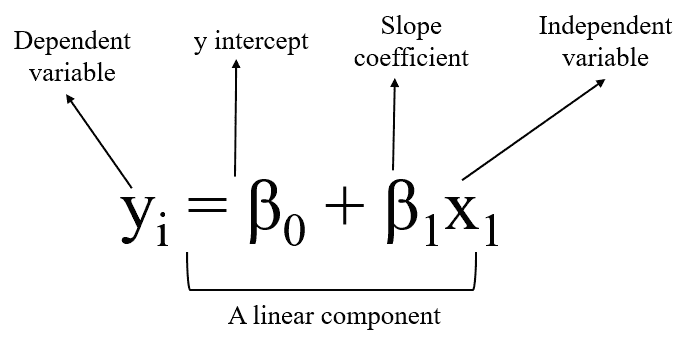
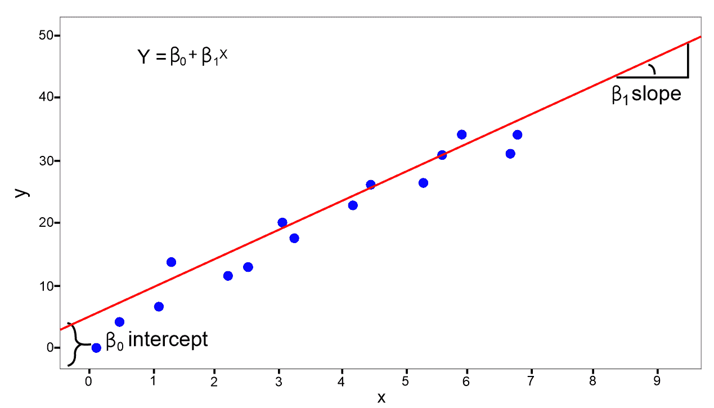
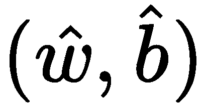
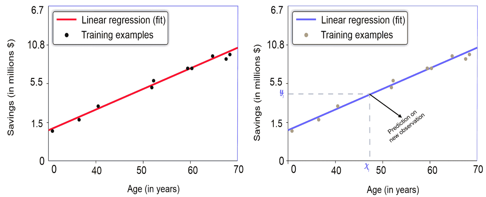
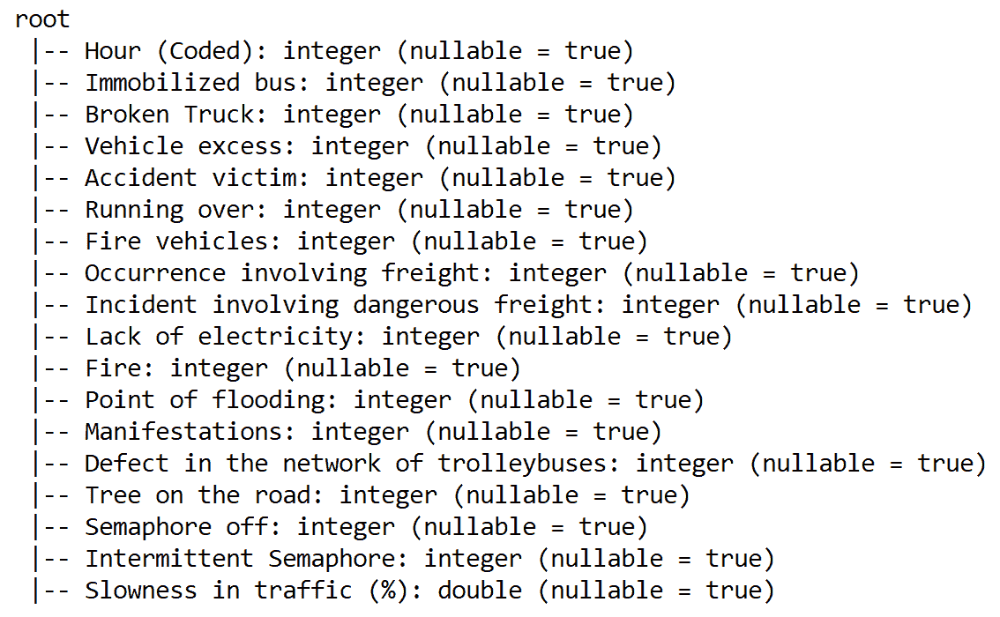
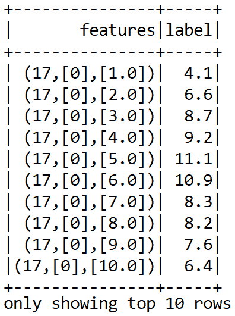
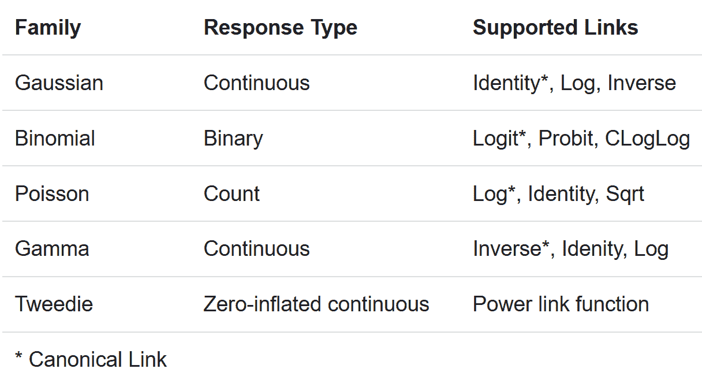
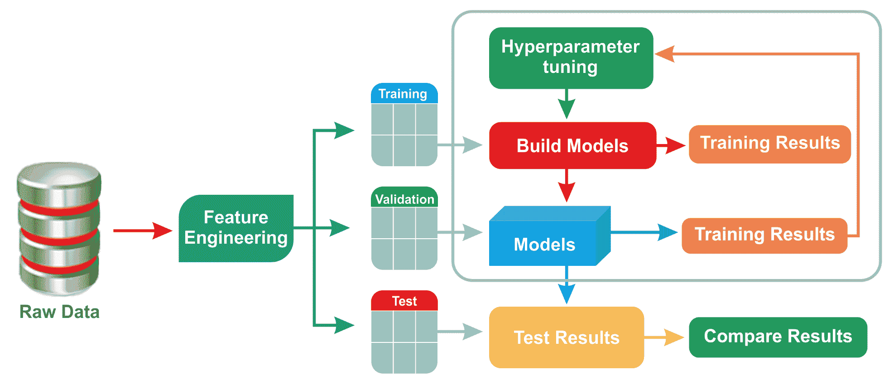
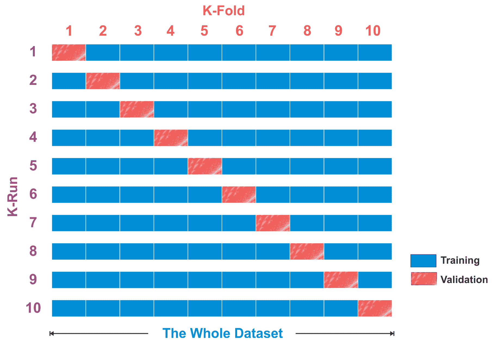

# 用于回归分析的 Scala

在本章中，我们将详细学习回归分析。我们将从回归分析工作流程开始学习，之后是**线性回归** ( **LR** )和**广义线性回归** ( **GLR** )算法。然后，我们将开发一个回归模型，使用 LR 和 g LR 算法以及它们在 Scala 中基于 Spark ML 的实现来预测交通中的慢度。最后，我们将学习交叉验证的超参数调整和网格搜索技术。简而言之，在这个端到端项目中，我们将学习以下主题:

*   回归分析概述
*   回归分析算法
*   通过实例学习回归分析
*   线性回归
*   广义线性回归
*   超参数调整和交叉验证


# 技术要求

确保在您的机器上安装并配置了 Scala 2.11.x 和 Java 1.8.x。

这几章的代码文件可以在 GitHub 上找到:

[https://github . com/packt publishing/Machine-Learning-with-Scala-Quick-Start-Guide/tree/master/chapter 02](https://github.com/PacktPublishing/Machine-Learning-with-Scala-Quick-Start-Guide/tree/master/Chapter02)

请观看以下视频，了解实际运行的代码:

[http://bit.ly/2GLlQTl](http://bit.ly/2GLlQTl)


# 回归分析概述

在前一章中，我们已经对**机器学习** ( **ML** )过程有了一些基本的了解，因为我们已经看到了回归和分类之间的基本区别。回归分析是一组统计过程，用于估计一组变量(称为因变量)与一个或多个自变量之间的关系。因变量的值取决于自变量的值。

回归分析技术有助于我们理解这种依赖性，即当任何一个自变量发生变化，而其他自变量保持不变时，因变量的值是如何变化的。举个例子，我们假设一个人年纪大了，银行里的存款会更多。在这里，**储蓄金额**(以百万美元计)取决于年龄(即**年龄**以年计):

| **年龄(年)** | **储蓄(百万美元)** |
| 40 | 1.5 |
| 50 | 5.5 |
| 60 | 10.8 |
| 70 | 6.7 |

因此，我们可以在 2D 图中绘制这两个值，其中因变量(**储蓄**)绘制在*y*-轴上，自变量(**年龄**)应绘制在*x*-轴上。一旦这些数据点被绘制出来，我们就可以看到它们之间的相关性。如果理论图表确实代表了变老对储蓄的影响，那么我们就可以说，一个人越老，他的银行账户里的储蓄就越多。

现在的问题是，我们如何判断年龄在多大程度上帮助一个人在银行账户中获得更多的钱？要回答这个问题，可以在图表上所有数据点的中间画一条线。这条线称为回归线，可以使用回归分析算法精确计算。回归分析算法采用离散或连续(或两者兼有)输入要素并生成连续值。

分类任务用于预测类别属性的标签，而回归任务用于对类别属性进行数值预测。

使用这种回归模型对未知的和新的观察结果进行预测，就像创建一个由多个组件共同工作的数据管道，其中我们在两个阶段观察算法的性能:学习和推理。在整个过程中，为了使预测模型成功，数据在所有 ML 任务中充当一等公民。


# 学问

学习阶段的重要任务之一是准备数据并将其转换为特征向量(每个特征的数字向量)。可以将特征向量格式的训练数据输入到学习算法中来训练模型，该模型可以用于推理。通常，当然基于数据大小，运行算法可能需要几个小时(甚至几天)才能使要素收敛到一个有用的模型中，如下图所示:


学习和训练预测模型—它展示了如何从训练数据生成特征向量，以训练生成预测模型的学习算法


# 推理

在推理阶段，经过训练的模型用于智能地使用该模型，例如从从未见过的数据进行预测、提出建议以及推断未来的规则。通常，与学习阶段相比，它花费的时间更少，有时甚至是实时的。因此，推理就是根据新的(即未观察到的)数据测试模型，并评估模型本身的性能，如下图所示:


从现有模型向预测分析推理(从未知数据生成特征向量以进行预测)

总之，当使用回归分析时，目标是预测一个连续的目标变量。既然我们已经知道了如何为监督学习任务构建一个基本的工作流程，那么了解一些可用的回归算法将会为如何应用这些回归算法提供更多的具体信息。


# 回归分析算法

有许多算法被提出并可用，它们可用于回归分析。例如，LR 试图找到变量之间的关系和依赖关系。它使用线性函数对连续因变量 *y* (即标签或目标)和一个或多个自变量 *x* 之间的关系进行建模。回归算法的示例包括:

*   **线性回归** ( **LR** )
*   **广义线性回归** ( **GLR** )
*   **生存回归** ( **SR** )
*   **等渗回归** ( **IR** )
*   **决策树回归器** ( **DTR** )
*   **随机森林回归** ( **RFR** )
*   **梯度助推树木回归** ( **GBTR** )

我们首先用最简单的 LR 算法来解释回归，该算法对因变量 *y* 之间的关系进行建模，这涉及到相互依赖的变量 *x* 的线性组合:



在前面的方程式字母中，*β[0]和*β[1]分别是 *y* 轴截距和直线斜率的两个常数。LR 是关于学习模型，它是输入示例(数据点)的特征的线性组合。**

看看下图，想象红线不在那里。我们有一些蓝色的点(数据点)。是否可以合理的开发一个机器学习(回归)模型来分离其中的大部分？现在，如果我们在两类数据之间画一条直线，它们几乎是分开的，不是吗？这样的线(在我们的例子中是红色的)被称为决策边界，在回归分析的情况下也被称为回归线(更多信息请参见下面的例子):



如果给我们一个带标签的例子集合，比如说，其中 *N* 是数据集中的样本数，*x[I]是样本的 *D* 维特征向量 *i = 1，2… N* ，而*y[I]是实数值 *y ∈ R* 然后综合这些，下一步就是建立下面的数学模型， *f* :**


这里， *w* 是一个 *D* 维参数化向量， *b* 是一个实数。符号 *f [w，b]表示模型 *f* 由值 *w* 和 *b* 参数化。一旦我们有了一个明确定义的模型，现在就可以用它来预测未知的 *y* 对于给定的 *x，*即 *y ← f [w，b] (x)* 。然而，有一个问题，因为模型是用两个不同的值( *w* ， *b* )参数化的，这将意味着当应用于相同的样本时，即使来自相同的分布，模型也倾向于产生两个不同的预测。*

从字面上看，它可以被称为优化问题——目标是找到最优(例如，最小值)值,这样参数的最优值将意味着模型倾向于做出更准确的预测。简而言之，在 LR 模型中，我们旨在找到和的最佳值，以最小化以下目标函数:


在前面的等式中，表达式 *(f [w，b](X[I])-y[I])²*称为**损失函数**，它是对样本 *i* 给出错误预测的惩罚(即误差或损失)的度量。这个损失函数是平方误差损失的形式。然而，也可以使用其他损失函数，如下式所示:


等式 1 中的**平方误差** ( **SE** )称为*L[2]损失，这是回归分析任务的默认损失函数。另一方面，方程( *2)* 中的**绝对误差** ( **AE** )称为 *L [1]* 损失。*

在数据集有许多异常值的情况下，使用 *L [1]* loss 比 *L [2]* 更推荐，因为 *L [1]* 对异常值更鲁棒。

所有基于模型的学习算法都有一个与之相关的损失函数。然后，我们试图通过最小化成本函数来找到最佳模型。在我们的 LR 情况下，成本函数由平均损失(也称为经验风险)定义，它可以被公式化为通过将模型拟合到可能包含许多样本的训练数据而获得的所有惩罚的平均值。

*图 4* 显示了一个简单线性回归的例子。假设这个想法是预测**的储蓄金额**对**的年龄**。因此，在这种情况下，我们有一个自变量 *x* (即一组 1D 数据点，在我们的情况下，还有**年龄**)和一个因变量 *y* (储蓄金额**(以百万美元计)**)。一旦我们有了一个训练好的回归模型，我们就可以使用这条线来预测新的未标记输入示例的目标值*y[l]， *x [l] 。*然而，在 *D* 维特征向量(例如 *2D* 或 *3D* 的情况下，它将是一个平面(对于 *2D* )或一个超平面(对于*= 3D*):*



图 4:回归线分离数据点以解决年龄与储蓄量的关系:I)左边的模型根据训练数据分离数据点:ii)右边的模型预测未知的观察值

现在，您看到了为什么回归超平面尽可能靠近训练示例这一要求如此重要:如果*图 4* (右边的模型)中的蓝线远离蓝点，则预测 *y [l]* 不太可能是正确的。最佳拟合线是回归分析的结果，它预计会穿过大多数数据点。然而，在实践中，由于回归误差的存在，它不会通过所有的数据点。

回归误差是任何数据点(实际)和直线(预测)之间的距离。

由于解决回归问题本身就是一个优化问题，我们希望误差尽可能小，因为较小的误差有助于提高预测精度，同时预测看不见的观察值。尽管 LR 算法在许多情况下不是很有效，但最好的事情是 LR 模型通常不会过度拟合，这对于更复杂的模型来说是不太可能的。

在前一章中，我们讨论了过度拟合(一种模型在训练期间预测非常好，但在应用于测试集时会产生更多错误的现象)和欠拟合(如果您的训练错误较低而验证错误较高，则您的模型很可能会过度拟合您的训练数据)。这两种现象通常是由偏差和方差引起的。


# 性能指标

为了测量回归模型的预测性能，根据回归误差提出并使用了几个度量，可以概括如下:

*   **均方误差(MSE)** :它是预测值与估计值之差的度量，即一条拟合线与数据点的接近程度。MSE 越小，拟合越接近数据。
*   **均方根误差(RMSE)** :它是 MSE 的平方根，但与垂直轴上绘制的量具有相同的单位。
*   **R 平方**:用于评估数据与拟合的回归线在 0 到 1 之间的接近程度的决定系数。R 平方越高，模型就越符合您的数据。
*   **平均绝对误差(MAE)** :不考虑方向的连续变量的*精度*的度量。MAE 越小，模型就越适合您的数据。

既然我们知道了回归算法如何工作，以及如何使用几个指标来评估性能，下一个重要的任务就是应用这些知识来解决现实生活中的问题。


# 通过实例学习回归分析

在上一节中，我们讨论了一个简单的现实问题(即**年龄**对**储蓄**)。然而，在实践中，有几个现实生活中的问题，其中涉及更多的因素和参数(即数据属性)，回归也可以应用。先介绍一个现实生活中的问题。想象一下，你住在巴西的圣保罗市，在那里你每天都要浪费几个小时的宝贵时间，因为不可避免的原因，如公共汽车抛锚、卡车坏了、车辆过剩、事故受害者、超车、消防车、涉及危险货物的事故、缺电、火灾和洪水。

现在，为了测量浪费了多少工时，我们可以开发一种自动化技术，它可以预测交通的缓慢程度，这样你就可以避开某些路线，或者至少粗略估计一下你到达城市中的某个地点需要多长时间。使用机器学习的预测分析应用程序可能是预测这种缓慢的首选解决方案之一。是的，为此我们将在下一节使用巴西圣保罗市的城市交通行为数据集。


# 数据集的描述

数据集下载自[https://archive . ics . UCI . edu/ml/datasets/Behavior+of+the+urban+traffic+of+the+city+of+Sao+Paulo+in+Brazil](https://archive.ics.uci.edu/ml/datasets/Behavior+of+the+urban+traffic+of+the+city+of+Sao+Paulo+in+Brazil)。它包含 2009 年 12 月 14 日和 2009 年 12 月 18 日之间巴西圣保罗市的城市交通行为记录。该数据集具有以下特征:

*   **小时**:花在路上的总时间
*   **固定母线**:固定母线数量
*   **坏车**:坏车数量
*   **车辆过剩**:多余车辆数
*   **事故受害者**:道路或路边的事故受害者人数
*   **超越**:超越或接管案例数
*   **消防车**:消防车及车辆数量

*   **涉及货运的事件**:卡车运输的散装货物数量
*   **危险品事故**:事故涉及运输散装货车数量
*   **缺电**:受灾地区无电的小时数
*   **火灾**:火灾次数
*   **淹没点**:淹没区点数
*   **表现**:显示正在施工或危险迹象的地点数量
*   **无轨电车网络缺陷**:无轨电车网络缺陷数量
*   **道路上的树木**:道路上或路边造成障碍的树木数量
*   **旗语关闭**:作为信号使用的带有臂、灯或旗帜的机械装置的数量
*   **间歇旗语**:在特定时间内作为信号使用的带有手臂、灯或旗帜的机械装置的数量
*   **交通缓慢**:由于上述原因，人们被堵在路上的平均小时数

最后一个特性是我们想要预测的目标列。由于我使用了该数据集，我想感谢以下出版物:

费雷拉，R. P .，阿丰索，c .，，萨希，R. J. (2011 年 11 月)。结合人工智能技术预测圣保罗市的城市车辆交通行为。第十届巴西计算智能大会(CBIC) -巴西福塔莱萨。(第 1-7 页)，2011 年。


# 数据集的探索性分析

首先，我们读取**探索性数据分析** ( **EDA** )的训练集。读者可以参考`EDA.scala`文件。一旦提取出来，就会有一个名为`Behavior of the urban traffic of the city of Sao Paulo in Brazil.csv`的 CSV 文件。让我们将文件重命名为`UrbanTraffic.csv`。另外，`Slowness in traffic (%)`，也就是最后一列，以不寻常的格式表示慢度的百分比:它用逗号(`,`)表示实数，例如，`4,1`而不是`4.1`。所以我用句点(`.`)替换了该列中所有逗号(`,`)的实例。否则，Spark CSV 阅读器会将该列视为`String`类型:

```
val filePath= "data/UrbanTraffic.csv"
```

首先，让我们使用`read.csv()`方法加载、解析并创建一个 DataFrame，但是使用 Databricks CSV 格式(也称为`com.databricks.spark.csv`)，方法是将它设置为读取 CSV 文件的头，这直接应用于所创建的 DataFrame 的列名；并且`inferSchema`属性被设置为`true`，因为如果您不显式指定`inferSchema`配置，浮点值将被视为字符串*。*这可能导致`VectorAssembler`引发异常，如`java.lang.IllegalArgumentException: Data type StringType is not supported`:

```
val rawTrafficDF = spark.read
      .option("header", "true")
      .option("inferSchema", "true")
      .option("delimiter", ";")
      .format("com.databricks.spark.csv")
      .load("data/UrbanTraffic.csv")
      .cache
```

现在，让我们打印刚刚创建的 DataFrame 的模式，以检查并确保结构得到保留:

```
rawTrafficDF.printSchema()
```

从下面的截图可以看出，Spark 数据帧的模式已经被正确识别。此外，正如所料，我的 ML 算法的所有特性都是数值型的(换句话说，以整数或双精度格式):



您可以看到没有一列是分类特征。所以，我们不需要任何数值转换。现在让我们使用`count()`方法来看看数据集中有多少行:

```
println(rawTrafficDF.count())
```

这给出了 135 个样本计数**。**现在让我们使用`show()`方法来查看数据集的快照，但是只显示了一些选定的列，这样更有意义，而不是显示所有的列。但是可以随意使用`rawTrafficDF.show()`查看所有栏目:

```
rawTrafficDF.select("Hour (Coded)", "Immobilized bus", "Broken Truck", 
                    "Vehicle excess", "Fire", "Slowness in traffic (%)").show(5)
```

由于`Slowness in traffic (%)`列包含连续值，我们必须处理一个回归任务。既然我们已经看到了数据集的快照，那么有必要使用`sql()`接口查看一些其他统计数据，例如 Spark SQL 的平均索赔或损失、最小和最大损失:


不过，在此之前，让我们将最后一列从`Slowness in traffic (%)`重命名为`label`，因为 ML 模型会对此有所抱怨。即使在回归模型上使用了`setLabelCol`之后，它仍然会查找名为`label`的列。这就引入了一个恶心的错误说法`org.apache.spark.sql.AnalysisException: cannot resolve 'label' given input columns`:

```
var newTrafficDF = rawTrafficDF.withColumnRenamed("Slowness in traffic (%)", "label")
```

因为我们想要执行一些 SQL 查询，所以我们需要创建一个临时视图，以便可以在内存中执行操作:

```
newTrafficDF.createOrReplaceTempView("slDF")
```

现在让我们以百分比的形式平均慢度(与标准小时的偏差):

```
spark.sql("SELECT avg(label) as avgSlowness FROM slDF").show()
```

前面的代码行应该显示平均每天跨路线 10%的延迟，并基于其他因素:

```

 +------------------+
 | avgSlowness      |
 +------------------+
 |10.051851851851858|
 +------------------+
```

另外，我们可以看到城市中的洪水点的数量。但是，为此我们可能需要做一些额外的工作，将列名改为单个字符串，因为它是包含空格的多字符串，所以 SQL 无法解析它:

```
newTrafficDF = newTrafficDF.withColumnRenamed("Point of flooding", "NoOfFloodPoint")
spark.sql("SELECT max(NoOfFloodPoint) FROM slDF").show()
```

这将显示多达七个非常危险的洪水点:

```
+-------------------+
|max(NoOfFloodPoint)|
+-------------------+
|                  7|
+-------------------+
```

然而，`describe()`方法将更加灵活地给出这些类型的统计数据。让我们对所选的列执行此操作:

```
rawTrafficDF.select("Hour (Coded)", "Immobilized bus", "Broken Truck", 
                    "Point of flooding", "Fire", "Slowness in traffic (%)")
                    .describe().show()
```

因此，我们可以看到，慢度在`3.4`和`23.4`之间变化，相当高。这就是为什么我们需要有效的数据处理步骤，以便能够保持这种关系。现在让我们转而关注数据预处理:


# 特征工程和数据准备

既然我们已经看到了数据集的一些属性，并且没有空值或分类特征，我们不需要任何其他预处理或中间转换。我们只需要在拥有训练集和测试集之前做一些功能工程。

获得这些集合之前的第一步是准备 Spark 回归模型可以使用的训练数据。为此，Spark 分类和回归算法需要两个组件，称为`features`和`label`。幸运的是，我们已经有了`label`专栏。接下来，`features`列必须包含除了`label`列之外的所有列的数据，这可以使用`VectorAssembler()`转换器来实现。

由于所有的列都是数字，我们可以直接从 Spark ML 库中使用`VectorAssembler()`将一个给定的列列表转换成一个向量列。因此，让我们收集理想列的列表。您可能已经猜到，我们必须排除`label`列，这可以使用标准 Scala 的`dropRight()`方法来完成:

```
val colNames = newTrafficDF.columns.dropRight(1)    

val assembler = new VectorAssembler()
    .setInputCols(colNames)
    .setOutputCol("features")
```

现在我们有了`VectorAssembler()`估计器，我们现在调用`transform()`方法，它将把选择的列嵌入到一个向量列中:

```
val assembleDF = assembler.transform(newTrafficDF).select("features", "label")  
assembleDF.show()
```

正如所料，前面代码段的最后一行显示了具有`label`和`features`的组合数据帧，这是训练 ML 算法所需要的:



我们现在可以继续生成单独的训练集和测试集。此外，我们可以缓存这两个集合以实现更快的内存访问。我们使用 60%的数据来训练模型，另外 40%将用于评估模型:

```
val seed = 12345L
val splits = data.randomSplit(Array(0.60, 0.40), seed)
val (trainingData, validationData) = (splits(0), splits(1))

trainingData.cache // cache in memory for quicker access
validationData.cache // cache in memory for quicker access
```

在我们开始训练回归模型之前，这就是我们所需要的。首先，我们开始训练 LR 模型并评估性能。


# 线性回归

在本节中，我们将开发一个预测分析模型，使用 LR 算法预测每行数据的交通缓慢度。首先，我们创建一个 LR 估计量如下:

```
val lr = new LinearRegression()
     .setFeaturesCol("features")
     .setLabelCol("label")
```

然后我们调用`fit()`方法对训练集进行如下训练:

```
println("Building ML regression model")
val lrModel = lr.fit(trainingData)
```

现在我们有了合适的模型，这意味着它现在能够做出预测。因此，让我们开始评估训练集和验证集上的模型，并计算 RMSE、MSE、MAE、R 平方等:

```
println("Evaluating the model on the test set and calculating the regression metrics")
// **********************************************************************
val trainPredictionsAndLabels = lrModel.transform(testData).select("label", "prediction")
                                            .map {case Row(label: Double, prediction: Double) 
                                            => (label, prediction)}.rdd

val testRegressionMetrics = new RegressionMetrics(trainPredictionsAndLabels)    
```

太好了！我们已经成功计算出了训练集和测试集的原始预测。现在，我们已经获得了训练集和验证集的性能指标，让我们来观察训练集和验证集的结果:

```
val results = "\n=====================================================================\n" +
      s"TrainingData count: ${trainingData.count}\n" +
      s"TestData count: ${testData.count}\n" +
      "=====================================================================\n" +
      s"TestData MSE = ${testRegressionMetrics.meanSquaredError}\n" +
      s"TestData RMSE = ${testRegressionMetrics.rootMeanSquaredError}\n" +
      s"TestData R-squared = ${testRegressionMetrics.r2}\n" +
      s"TestData MAE = ${testRegressionMetrics.meanAbsoluteError}\n" +
      s"TestData explained variance = ${testRegressionMetrics.explainedVariance}\n" +
      "=====================================================================\n"
println(results)
```

前面的代码段应该显示类似的内容。但是，由于随机性，您可能会体验到略有不同的输出:

```
=====================================================================
 TrainingData count: 80
 TestData count: 55
 =====================================================================
 TestData MSE = 7.904822843038552
 TestData RMSE = 2.8115516788845536
 TestData R-squared = 0.3699441827613118
 TestData MAE = 2.2173672546414536
 TestData explained variance = 20.293395978801147
 =====================================================================
```

现在我们也有了对测试集的预测，但是，我们不能直接说这是一个好的还是最优的回归模型。为了用较低的 MAE 进一步改善结果，Spark 还提供了线性回归实现的通用版本，称为 GLR。


# 广义线性回归(GLR)

在 LR 中，假设输出遵循高斯分布。相比之下，在**广义线性模型** ( **GLMs** )中，响应变量*Y[I]遵循某种形式的概率分布的参数集的某种随机分布。正如我们在前面的例子中看到的，跟踪和创建 GLR 估计量并不困难:*

```
val glr = new GeneralizedLinearRegression()
      .setFamily("gaussian")//continuous value prediction (or gamma)
      .setLink("identity")//continuous value prediction (or inverse)
      .setFeaturesCol("features")
      .setLabelCol("label")
```

对于基于 GLR 的预测，基于数据类型支持以下响应和身份链接函数(来源:[https://spark . Apache . org/docs/latest/ml-classification-regression . html # generalized-linear-regression](https://spark.apache.org/docs/latest/ml-classification-regression.html#generalized-linear-regression)):



然后我们调用`fit()`方法对训练集进行训练，如下所示:

```
println("Building ML regression model")
val glrModel = glr.fit(trainingData)
```

Spark 中通过`GeneralizedLinearRegression`接口的当前实现最多只支持 4096 个特性。现在我们有了拟合的模型(这意味着它现在能够进行预测)，让我们开始在训练集和验证集上评估模型，并计算 RMSE、MSE、MAE、R 平方等:

```
// **********************************************************************
println("Evaluating the model on the test set and calculating the regression metrics")
// **********************************************************************
val trainPredictionsAndLabels = glrModel.transform(testData).select("label", "prediction")
                                            .map { case Row(label: Double, prediction: Double) 
                                            => (label, prediction) }.rdd

val testRegressionMetrics = new RegressionMetrics(trainPredictionsAndLabels)
```

太好了！我们已经成功计算出了训练集和测试集的原始预测。现在，我们已经获得了训练集和测试集的性能指标，让我们观察一下训练集和验证集的结果:

```
val results = "\n=====================================================================\n" +
      s"TrainingData count: ${trainingData.count}\n" +
      s"TestData count: ${testData.count}\n" +
      "=====================================================================\n" +
      s"TestData MSE = ${testRegressionMetrics.meanSquaredError}\n" +
      s"TestData RMSE = ${testRegressionMetrics.rootMeanSquaredError}\n" +
      s"TestData R-squared = ${testRegressionMetrics.r2}\n" +
      s"TestData MAE = ${testRegressionMetrics.meanAbsoluteError}\n" +
      s"TestData explained variance = ${testRegressionMetrics.explainedVariance}\n" +
      "=====================================================================\n"
println(results)
```

前面的代码段应该显示类似的结果。但是，由于随机性，您可能会体验到略有不同的输出:

```

 =====================================================================
 TrainingData count: 63
 TestData count: 72
 =====================================================================
 TestData MSE = 9.799660597570348
 TestData RMSE = 3.130440958965741
 TestData R-squared = -0.1504361865072692
 TestData MAE = 2.5046175463628546
 TestData explained variance = 19.241059408685135
 =====================================================================
```

使用 GLR，我们可以看到一个稍微差一点的 MAE 值，RMSE 也更高。如果你看到这两个例子，我们不必调整超参数，只是让模型训练和评估每个参数的单个值。我们甚至可以使用正则化参数来减少过度拟合。但是，ML 管道的性能通常会随着超参数调整而提高，这通常是通过网格搜索和交叉验证来完成的。在下一节中，我们将讨论如何通过交叉验证的模型获得更好的性能。


# 超参数调整和交叉验证

在机器学习中，超参数这个术语指的是那些不能直接从常规训练过程中学习到的参数。这些是你可以在机器学习算法上调整的各种旋钮。超参数通常通过用参数的不同组合训练模型来决定，并通过测试来决定哪一个效果最好。最终，提供最佳模型的组合将是我们的最终超参数。设置超参数会对训练模型的性能产生重大影响。

另一方面，交叉验证通常与超参数调整结合使用。交叉验证(也称为旋转估计)是一种模型验证技术，用于评估统计分析和结果的质量。交叉验证有助于描述数据集，以便在训练阶段使用验证集测试模型。


# 超参数调谐

不幸的是，没有捷径或直接的方法来根据明确的方法选择正确的超参数组合——当然，经验会有所帮助。例如，在训练随机森林时，矩阵分解、k-means 或逻辑/LR 算法可能是合适的。以下是此类超参数的一些典型示例:

*   基于树的算法中的树叶、箱或树的深度的数量
*   迭代次数
*   正则化值
*   矩阵分解中潜在因子的个数
*   k-均值聚类中的聚类数等等

从技术上讲，超参数形成了一个称为参数网格的 *n* 维空间，其中 *n* 是超参数的数量。这个空间中的每个点都是一个特定的超参数配置，这是一个超参数向量。

在[第一章](33fe7442-ce44-4a18-bac6-0e08e9b1ae1e.xhtml)、【Scala 机器学习介绍中讨论过，过拟合和欠拟合是机器学习中两个有问题的现象。因此，有时完全收敛到最佳模型参数集通常不是必要的，甚至可能是优选的，因为几乎最佳拟合的模型往往在新数据或设置上表现得更好。换句话说，如果您关心最佳拟合模型，您真的不需要最佳参数集。

实际上，我们不能探索这个空间中的每一个点，所以通常使用网格搜索该空间中的子集。下图显示了一些高层次的想法:



图 5:ML 模型的超参数调整

虽然这种方案有几种方法，但随机搜索或网格搜索可能是最广为人知的技术:

*   **网格搜索**:使用这种方法，在你想要测试的字典中定义不同的超参数。然后，在将它们馈送到 ML 模型之前，构建参数网格，使得可以用不同的组合来执行训练。最后，算法会告诉您哪种超参数组合的精确度最高。
*   **随机搜索**:正如你所理解的，用所有可能的超参数组合来训练一个 ML 模型是一个非常昂贵和耗时的操作。然而，我们通常没有那么大的灵活性，但我们仍然希望调整这些参数。在这种情况下，随机搜索可能是一种变通方法。通过评估超参数空间中的 *n* 个均匀随机点来执行随机搜索，并选择模型给出最佳性能的正确组合。


# 交叉验证

交叉验证有两种，称为穷举交叉验证，包括留 p-out 交叉验证和留 1-out 交叉验证，非穷举交叉验证是基于 K-fold 交叉验证和重复随机子采样交叉验证，例如 5-fold 或 10-fold 交叉验证，非常常见。

在大多数情况下，使用 10 重交叉验证，而不是在验证集上进行测试。此外，训练集应该尽可能大(因为更多具有质量特征的数据有利于训练模型)，这不仅是为了训练模型，而且是因为大约 5%到 10%的训练集可以用于交叉验证。

使用 K 倍交叉验证技术，完整的训练数据被分成 K 个子集。在 K-1 个子集上训练模型；最后一个留着验证。这个过程重复 K 次，使得每次 K 个子集之一被用作验证集，而其他 K-1 个子集被用于形成训练集。这样，每个子集(折叠)至少被用于训练和验证一次。

最后，已经获得的不同机器学习模型通过分类器的装袋(或推进)方案或通过平均(即回归)来结合。下图解释了 10 重交叉验证技术:



图 6: 10 重交叉验证技术


# Spark ML 中的调整和交叉验证

在 Spark ML 中，在执行交叉验证之前，我们需要一个`paramGrid`(这是一个参数网格)。`ParamGridBuilder`接口用于定义`CrossValidator`必须搜索的超参数空间，最后，`CrossValidator()`将我们的管道、LR 回归器的超参数空间和交叉验证的折叠数作为参数。

因此，让我们通过指定最大迭代次数、正则化参数值、容差值和弹性网络参数来开始创建`paramGrid`，如 LR 模型所示(因为我们观察到此模型的 MAE 较低):

```
// ***********************************************************
println("Preparing K-fold Cross Validation and Grid Search")
// ***********************************************************
val paramGrid = new ParamGridBuilder()
      .addGrid(lr.maxIter, Array(10, 20, 30, 50, 100, 500, 1000))
      .addGrid(lr.regParam, Array(0.001, 0.01, 0.1))
      .addGrid(lr.tol, Array(0.01, 0.1))
      .build()
```

正则化参数通过减少估计回归参数的方差来减少过度拟合。现在，为了获得更好、更稳定的性能，我们可以执行 10 重交叉验证。因为我们的任务是预测连续值，所以我们需要定义`RegressionEvaluator`，即回归的评估器，它需要两个输入列——`prediction`和`label`——并基于 MSE、RMSE、R 平方和 MAE 评估定型:

```
println("Preparing 10-fold Cross Validation")
val numFolds = 10 //10-fold cross-validation
val cv = new CrossValidator()
      .setEstimator(lr)
      .setEvaluator(new RegressionEvaluator())
      .setEstimatorParamMaps(paramGrid)
      .setNumFolds(numFolds)
```

太棒了，我们创造了交叉验证估计量。现在是时候训练 LR 模型了:

```
println("Training model with the Linear Regression algorithm")
val cvModel = cv.fit(trainingData)
```

顺便说一下，Spark 提供了一种使用`save()`方法保存训练好的 ML 模型的方法:

```
// Save the workflow
cvModel.write.overwrite().save("model/LR_model")  
```

然后可以使用`load()`方法从磁盘恢复相同的模型:

```
val sameCVModel = LinearRegressionModel.load("model/LR_model")
```

然后，我们在类似于 LR 和 GLR 模型的测试集上计算模型的指标:

```
println("Evaluating the cross validated model on the test set and calculating the regression metrics")
val trainPredictionsAndLabelsCV = cvModel.transform(testData).select("label", "prediction")
                                      .map { case Row(label: Double, prediction: Double)
                                      => (label, prediction) }.rdd

val testRegressionMetricsCV = new RegressionMetrics(trainPredictionsAndLabelsCV)
```

最后，我们收集指标并打印出来，以获得一些见解:

```
val cvResults = "\n=====================================================================\n" +
      s"TrainingData count: ${trainingData.count}\n" +
      s"TestData count: ${testData.count}\n" +
      "=====================================================================\n" +
      s"TestData MSE = ${testRegressionMetricsCV.meanSquaredError}\n" +
      s"TestData RMSE = ${testRegressionMetricsCV.rootMeanSquaredError}\n" +
      s"TestData R-squared = ${testRegressionMetricsCV.r2}\n" +
      s"TestData MAE = ${testRegressionMetricsCV.meanAbsoluteError}\n" +
      s"TestData explained variance = ${testRegressionMetricsCV.explainedVariance}\n" +
      "=====================================================================\n"
println(cvResults)
```

前面的代码段应该显示类似的内容。但是，由于随机性，您可能会体验到略有不同的输出:

```
 =====================================================================
 TrainingData count: 80
 TestData count: 55
 =====================================================================
 TestData MSE = 7.889401628365509
 TestData RMSE = 2.8088078660466453
 TestData R-squared = 0.3510269588724132
 TestData MAE = 2.2158433237623667
 TestData explained variance = 20.299135214455085
 =====================================================================
```

正如我们所看到的，RMSE 和 MAE 都略低于未经交叉验证的 LR 模型。理想情况下，这些指标的值应该更低。然而，由于训练和测试集的规模较小，可能 LR 和 GLR 模型都过拟合。尽管如此，我们仍将尝试在第四章、 *Scala 中使用稳健的回归分析算法，用于基于树的集成技术*。更具体地说，我们将尝试用决策树、随机森林和 GBTRs 来解决同样的问题。


# 摘要

在这一章中，我们看到了如何使用 LR 和 g LR 算法开发一个回归模型来分析保险理赔。我们还看到了如何使用交叉验证和网格搜索技术来提高 GLR 模型的性能，这提供了超参数的最佳组合。最后，我们看到了一些常见问题，以便类似的回归技术可以应用于解决其他现实生活中的问题。

在下一章中，我们将通过一个名为“通过流失预测分析即将离任的客户”的现实问题，看到另一种名为“分类”的监督学习技术。Scala 中将使用几种分类算法进行预测。客户流失预测对企业来说至关重要，因为它可以帮助您发现可能会取消订阅、产品或服务的客户，还可以通过预测哪些客户可能会取消服务订阅来最大限度地减少客户流失。