# 三、Scala 分类学习

在前一章中，我们看到了如何开发一个预测模型来分析保险严重程度索赔作为一个回归分析问题。我们应用了非常简单的线性回归，以及**广义线性回归** ( **GLR** )。

在这一章中，我们将学习另一个被监督的学习任务，叫做分类。我们将使用广泛使用的算法，如逻辑回归、**朴素贝叶斯** ( **NB** )和**支持向量机** ( **支持向量机**)来分析和预测客户是否可能取消订购他们的电信合同。

特别是，我们将涵盖以下主题:

*   分类介绍
*   用真实的例子学习分类
*   用于流失预测的逻辑回归
*   用于流失预测的 SVM
*   预测的 NB


# 技术要求

确保在您的机器上安装并配置了 Scala 2.11.x 和 Java 1.8.x。

这几章的代码文件可以在 GitHub 上找到:

[https://github . com/packt publishing/Machine-Learning-with-Scala-Quick-Start-Guide/tree/master/chapter 03](https://github.com/PacktPublishing/Machine-Learning-with-Scala-Quick-Start-Guide/tree/master/Chapter03)

请看下面的视频，看看代码是如何运行的:
[http://bit.ly/2ZKVrxH](http://bit.ly/2ZKVrxH)


# 分类概述

作为一种有监督的学习任务，分类是基于一个或多个自变量识别哪组观察值(样本)属于什么的问题。该学习过程基于包含关于成员的类别或标签的观察(或实例)的训练集。通常，分类问题是当我们训练一个模型来预测定量(但离散)目标时，如 *s* pam 检测、流失预测、情感分析、癌症类型预测等。

假设我们想开发一个预测模型，根据学生的托福和 GRE 成绩来预测他/她是否有足够的能力进入计算机科学领域。此外，假设我们有以下范围/格式的一些历史数据:

*   托福考试:在 0 到 100 之间
*   **GRE**:0 到 100 之间
*   **录取** : 1 为录取，0 为未录取

现在，为了了解我们是否可以使用如此简单的数据来进行预测，让我们创建一个散点图，将所有记录以**录取**和**拒绝**为因变量，以**托福**和 **GRE** 为自变量，如下所示:

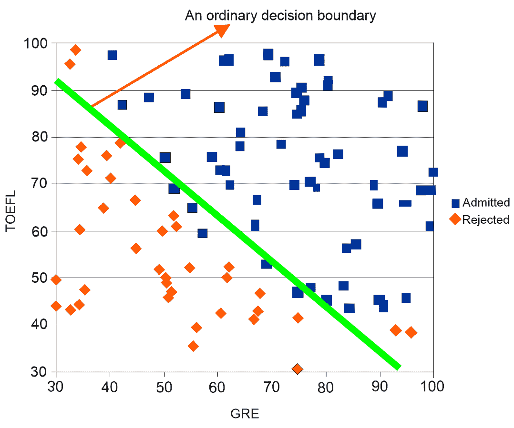

通过查看数据点(假设图中的对角线不在那里)，我们可以合理地开发一个线性模型来分离大部分数据点。现在，如果我们在两类数据之间画一条直线，它们几乎是分开的。这样一条线(在我们的例子中是绿色的)被称为决策边界。因此，如果决策边界具有合理分离的最大数据点，它可以用于对看不见的数据进行预测，我们也可以说，我们预测的线以上的数据点是合格的，线以下的数据点是不合格的。

尽管这个例子是回归分析的一个基本开端，但是分离数据点的任务并不容易。因此，为了计算如何划分如此大量的数据点，我们可以使用逻辑回归或其他分类算法，我们将在接下来的章节中讨论这些算法。我们还会看到，画一条普通的直线可能并不正确，因此我们经常不得不画曲线。

如果我们仔细观察与录取相关的数据图，也许直线不是分隔每个数据点的最佳方式，曲线会更好，如下图所示:

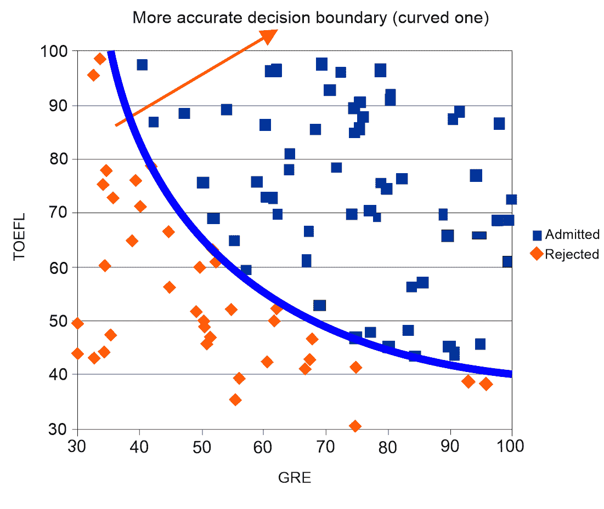

然而，为了获得弯曲的决策边界，我们不仅必须将负责的函数(称为决策边界函数)从线性变为某个高阶多项式，还必须将数据变为二次多项式。

这意味着我们必须将我们的问题建模为逻辑回归模型。也就是我们需要将数据从 *{GRE，TOEFL* *}* 格式改为二次函数格式， *{GRE，GRE^2，TOEFL，TOEFL^2，GRE∫TOEFL**}*。然而，以手工方式这样做是很麻烦的，并且对于大型数据集来说是不可能的。幸运的是，Spark MLlib 实现了许多算法，用于建模此类问题和解决其他分类问题，包括:

*   **逻辑回归** ( **LR** )
*   SVM
*   铌
*   **多层感知器** ( **MLP** )
*   **决策树** ( **DT** )
*   **随机森林** ( **射频**)
*   **坡度提升树木** ( **GBT** )

对于分类问题，用于训练或测试分类器的样本存在实际(即真实)标签(即类)和预测标签(即类)；这可以归入以下类别之一:

*   **真阳性(TP)** :真标签为阳性，分类器做出的预测也为阳性
*   **真阴性(TN)** :真标签为阴性，分类器做出的预测也为阴性
*   **假阳性(FP)** :真实标签为阴性，但分类器做出的预测为阳性
*   **假阴性(FN)** :真实标签为阳性，但分类器做出的预测为阴性

这些度量(TP、FP、TN 和 FN)是我们之前列出的大多数分类器的评估度量的构建块。然而，通常用于确定有多少预测是正确的纯准确性通常不是一个好的指标，因此使用其他指标，如精确度、召回率、F1 分数、AUC 和**马修的相关系数** ( **MCC** ):

*   *准确度*是分类器正确预测的样本分数(包括阳性和阴性)除以样本总数:


*   *精度*是属于阳性类别(真阳性)的正确预测样本数除以实际属于阳性类别的样本总数:


*   *召回*是被正确预测属于负类的样本数除以实际属于负类的元素总数:


*   F1 分数是精确度和召回率的调和平均值。由于 F1 分数是召回率和精确度之间的平衡，它可以被认为是精确度的替代物:


**接收机工作特性** ( **ROC** )是绘制 **FPR** (到 *x* 轴)和 **TPR** (到 *y* 轴)不同阈值的曲线。因此，对于您的分类器的不同阈值，我们计算 **TPR** 和 **FPR** ，绘制 **ROC** 曲线，并计算 **ROC** 曲线下的面积(也称为 **AUC** )。这可以想象如下:

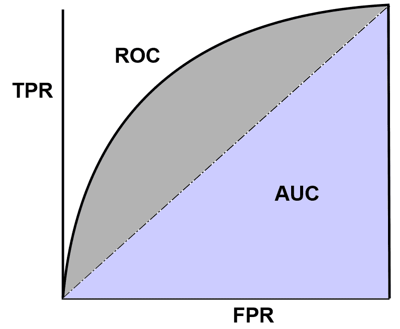

MCC 被视为二元分类器的平衡度量，即使对于具有非常不平衡的类的数据集也是如此:


让我们讨论一个更真实的分类问题的例子，这就是流失分析。客户流失是指任何业务中客户或顾客的流失，这正在成为不同业务领域的主要关注点，如银行、互联网服务提供商、保险公司等*。*客户不满和竞争对手更好的报价是这种*背后的主要原因。*在电信行业，当许多用户转向另一家服务提供商时，公司不仅会失去这些客户和收入，还会给其他老客户或打算开始使用他们服务的人留下不好的印象。

最终，客户流失的全部成本包括收入损失和用新客户替代这些客户的电话营销成本。然而，这些类型的损失会给企业带来巨大的损失。还记得诺基亚主宰手机市场的时代吗？苹果突然宣布 iPhone 3G，这是智能手机时代的一场革命。然后，大约 10%到 12%的客户停止使用诺基亚，转而使用 iPhone。尽管诺基亚后来也试图发布智能手机，但他们无法与苹果竞争。

简而言之，客户流失预测对企业至关重要，因为它可以帮助您发现可能会取消订阅、产品或服务的不同类型的客户。简而言之，其思想是预测现有客户是否会退订现有服务，即二元分类问题。


# 开发客户流失预测模型

如果您首先确定哪些客户可能会取消对现有服务的订阅，并向这些客户提供特殊优惠或计划，那么准确识别流失可能性可以最大限度地减少客户流失。当涉及到员工流失预测和开发预测模型时，这个过程在很大程度上是由数据驱动的，机器学习可以用来理解客户的行为。这是通过分析以下内容来实现的:

*   人口统计数据，如年龄、婚姻状况和工作状况
*   基于社交媒体数据的情感分析
*   使用他们的浏览点击流日志进行行为分析
*   呼叫圈数据和支持呼叫中心统计

可以通过以下三个步骤开发自动化流失分析管道:

1.  首先，确定分析客户流失的典型任务，这将取决于公司政策
2.  然后，收集和分析数据并开发预测模型
3.  最后，在生产就绪环境中部署模型

最终，电信公司将能够预测和增强客户体验，防止流失，并定制营销活动。在实践中，这样的分析将有助于留住最有可能离开的客户。这意味着我们不需要担心可能会留下来的客户。


# 数据集的描述

我们可以使用 Orange Telecom 的客户流失数据集来开发一个预测模型，该模型将预测哪些客户会取消他们对现有服务的订阅。该数据集经过充分研究，内容全面，用于开发小型原型。它包含 churn-80 和 churn-20 数据集，可从以下链接下载:

*   流失-80:[https://bml-data.s3.amazonaws.com/churn-bigml-80.csv](https://bml-data.s3.amazonaws.com/churn-bigml-80.csv)
*   流失-20:[https://bml-data.s3.amazonaws.com/churn-bigml-20.csv](https://bml-data.s3.amazonaws.com/churn-bigml-20.csv)

由于两个数据集来自相同的分布，具有相同的结构，我们将使用 churn-80 数据集进行训练和 10 重交叉验证。然后，使用 churn-20 对训练好的模型进行评估。两个数据集具有相似的结构，因此具有以下模式:

*   **状态** : `String`
*   **账户长度** : `Integer`
*   **区号** : `Integer`
*   **国际计划** : `String`
*   **语音邮件计划** : `String`
*   **邮件数量** : `Integer`
*   **全天分钟数** : `Double`
*   **全天通话总量** : `Integer`
*   **总日费用** : `Double`
*   **总晚间分钟数** : `Double`
*   **晚间通话总数** : `Integer`
*   **晚间总费用** : `Double`
*   **总夜间分钟数** : `Double`
*   **总夜间通话次数** : `Integer`
*   **夜间总费用** : `Double`
*   **总国际分钟数** : `Double`
*   **国际通话总量** : `Integer`
*   **国际收费总额** : `Double`
*   **客服电话** : `Integer`


# 探索性分析和特征工程

首先，在将数据作为 Spark DataFrame 加载之前，我们指定完全相同的模式(即自定义模式)，如下所示:

```
val schema = StructType(Array(
    StructField("state_code", StringType, true),
    StructField("account_length", IntegerType, true),
    StructField("area_code", StringType, true),
    StructField("international_plan", StringType, true),
    StructField("voice_mail_plan", StringType, true),
    StructField("num_voice_mail", DoubleType, true),
    StructField("total_day_mins", DoubleType, true),
    StructField("total_day_calls", DoubleType, true),
    StructField("total_day_charge", DoubleType, true),
    StructField("total_evening_mins", DoubleType, true),
    StructField("total_evening_calls", DoubleType, true),
    StructField("total_evening_charge", DoubleType, true),
    StructField("total_night_mins", DoubleType, true),
    StructField("total_night_calls", DoubleType, true),
    StructField("total_night_charge", DoubleType, true),
    StructField("total_international_mins", DoubleType, true),
    StructField("total_international_calls", DoubleType, true),
    StructField("total_international_charge", DoubleType, true),
    StructField("total_international_num_calls", DoubleType, true),
    StructField("churn", StringType, true)))
```

然后，我们必须用指定的所有字段创建一个 Scala case 类，并对齐前面的模式(变量名不言自明):

```
case class CustomerAccount(state_code: String, account_length: Integer, area_code: String, 
                 international_plan: String, voice_mail_plan: String, num_voice_mail: Double, 
                 total_day_mins: Double, total_day_calls: Double, total_day_charge: Double, 
                 total_evening_mins: Double, total_evening_calls: Double, total_evening_charge: Double, 
                 total_night_mins: Double, total_night_calls: Double, total_night_charge: Double,  
                 total_international_mins: Double, total_international_calls: Double, 
                 total_international_charge: Double, total_international_num_calls: Double, churn: String)
```

让我们创建一个 Spark 会话并导入`implicit._`包，它允许我们指定一个 DataFrame 操作，如下所示:

```
import spark.implicits._
```

现在，让我们创建训练集。我们用 Spark 推荐的格式`com.databricks.spark.csv`读取 CSV 文件。我们不需要任何显式的模式推理；因此，我们制作了`inferSchema` `false`，但是我们使用了我们自己的模式，这是我们之前创建的。然后，我们从所需的位置加载数据文件，最后指定我们的数据源，以便我们的数据帧看起来与我们指定的完全相同:

```
val trainSet: Dataset[CustomerAccount] = spark.read.
    option("inferSchema", "false")
    .format("com.databricks.spark.csv")
    .schema(schema)
    .load("data/churn-bigml-80.csv")
    .as[CustomerAccount]
trainSet.printSchema()
```

正如我们在下面的截图中看到的，Spark 数据帧的模式已经被正确识别。但是，有些特征是非数字的，而是分类的。然而，正如 ML 算法所期望的，所有的特征必须是数字的(即，`integer`或`double`格式):

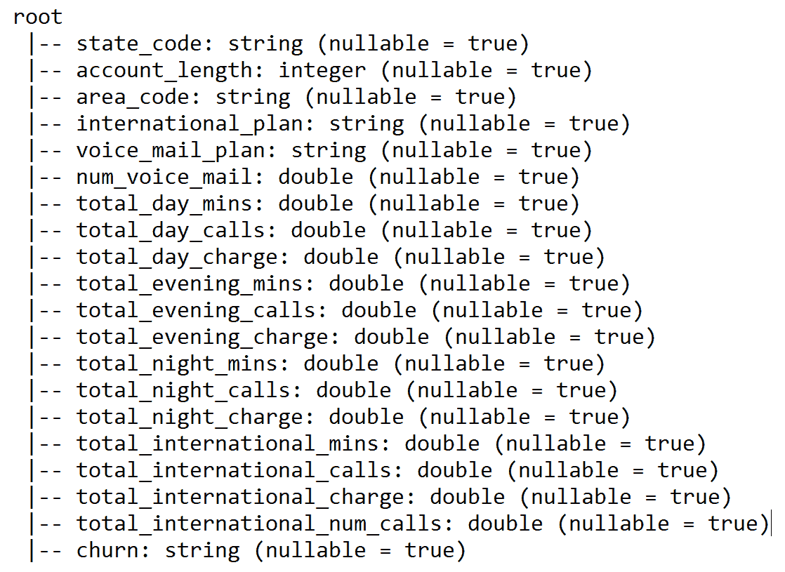

太棒了。看起来和数据结构一模一样。现在，让我们通过使用`show()`方法来看一些样本数据，如下所示:

```
trainSet.show()
```

前面一行代码的输出显示了数据帧的前 20 个样本:

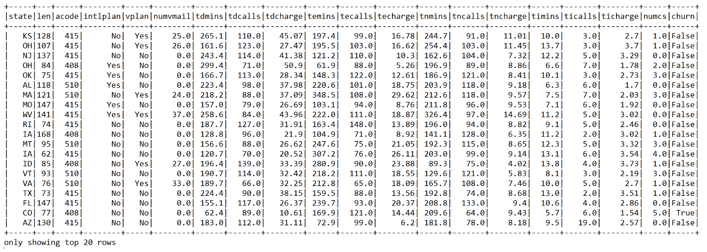

在前面的屏幕截图中，为了便于查看，缩短了列名。通过使用`describe()`方法，我们还可以看到训练集的相关统计数据:

```
val statsDF = trainSet.describe()  
statsDF.show()
```

以下汇总统计数据不仅让我们对数据的均值和标准差分布有了一些了解，还提供了一些描述性统计数据，例如数据帧中每个要素的样本数(即计数)、最小值和最大值:


如果这个数据集可以放入 RAM，我们可以通过使用 Spark 的`cache()`方法缓存它以便快速和重复访问:

```
trainSet.cache()
```

让我们看看一些有用的属性，比如与`churn`的变量相关性。例如，让我们看看`churn`与国际电话总数的关系:

```
trainSet.groupBy("churn").sum("total_international_num_calls").show()
```

从下面的输出中我们可以看到，打更多国际电话的客户不太可能(也就是`False`)更换运营商:

```
+-----+----------------------------------+
 |churn|sum(total_international_num_calls)|
 +-----+----------------------------------+
 |False|                            3310.0|
 |True |                             856.0|
 +-----+----------------------------------+
```

让我们来看看`churn`与国际通话费总额的关系:

```
trainSet.groupBy("churn").sum("total_international_charge").show()
```

从下面的输出中我们可以看到，拨打更多国际电话的客户(如前所示)被收取更多费用，但仍然不太可能(即`False`)更换运营商:

```
 +-----+-------------------------------+
 |churn|sum(total_international_charge)|
 +-----+-------------------------------+
 |False|              6236.499999999996|
 | True|                        1133.63|
 +-----+-------------------------------+
```

现在我们还需要准备好测试集来评估模型，让我们准备相同的测试集，类似于训练集，如下所示:

```
val testSet: Dataset[CustomerAccount] = spark.read
      .option("inferSchema", "false")
      .format("com.databricks.spark.csv")
      .schema(schema)
      .load("data/churn-bigml-20.csv")
      .as[CustomerAccount]
```

现在，让我们缓存它们，以便更快更快地访问，以便进一步操作:

```
testSet.cache()
```

让我们看看训练集的一些相关属性，以了解它对我们的目的有多合适。首先，让我们为这个会话的持久性创建一个临时视图。然而，我们可以创建一个目录作为接口，用于创建、删除、更改或查询底层数据库、表、函数等:

```
trainSet.createOrReplaceTempView("UserAccount") 
spark.catalog.cacheTable("UserAccount")
```

我们现在可以按`churn`标签对数据进行分组，并计算每组中的实例数量，如下所示:

```
trainSet.groupBy("churn").count.show()
```

前一行应该显示只有`388`客户可能会转向另一家运营商。但是，`2278`客户仍然将当前运营商作为首选运营商:

```
 +-----+-----+
 |churn|count|
 +-----+-----+
 |False| 2278|
 | True| 388 |
 +-----+-----+
```

因此，我们的`False`流失样本大约是`True`流失样本的七倍。由于目标是留住最有可能离开的客户，我们将准备我们的训练集，以确保预测 ML 模型对`True`流失样本敏感。

此外，由于训练集是高度不平衡的，我们应该将`False` `churn`类向下采样到 388/2278 的一个分数，这给出了`0.1675`:

```
val fractions = Map("False" -> 0.1675, "True" -> 1.0)
```

这样，我们也只映射`True`流失样本。现在，让我们使用`sampleBy()`方法为训练集创建一个新的数据帧，其中包含来自下采样数据帧的样本:

```
val churnDF = trainSet.stat.sampleBy("churn", fractions, 12345L)
```

第三个参数是用于再现性目的的种子。让我们来看看这个:

```
churnDF.groupBy("churn").count.show()
```

现在，我们可以看到这些阶级几乎是平衡的:

```
 +-----+-----+
 |churn|count|
 +-----+-----+
 |False|  390|
 | True|  388|
 +-----+-----+
```

现在，让我们看看变量之间的关系。让我们看看白天、夜晚、晚上和国际语音呼叫如何对`churn`类做出贡献:

```
spark.sql()("SELECT churn, SUM(total_day_charge) as TDC, 
                                    SUM(total_evening_charge) as TEC, SUM(total_night_charge) as TNC, 
                                    SUM(total_international_charge) as TIC, 
                                    SUM(total_day_charge) + SUM(total_evening_charge) +  
                                    SUM(total_night_charge) + SUM(total_international_charge) 
                    as Total_charge FROM UserAccount GROUP BY churn 
                    ORDER BY Total_charge DESC").show()
```

然而，这并没有给出任何明确的相关性，因为可能留下来的客户比其他想要离开的客户打更多的白天、晚上、晚上和国际语音电话:


现在，让我们看看白天、晚上、晚上和国际语音通话的语音通话分钟数对前面的`Total_charge`类别`churn`的贡献:

```
spark.sql()("SELECT churn, SUM(total_day_mins) + 
                    SUM(total_evening_mins) + 
                    SUM(total_night_mins) + 
                    SUM(total_international_mins) as Total_minutes 
                    FROM UserAccount GROUP BY churn")
                .show()
```

从前面的两个表中可以清楚地看出，总日分钟数和总日费用在这个训练集中是高度相关的特征，这对我们的 ML 模型训练没有好处。因此，最好将它们一起移除。让我们删除每对相关字段中的一列，以及`state_code`和`area_code`列，因为它们不会被使用:

```
val trainDF = churnDF
    .drop("state_code")
    .drop("area_code")
    .drop("voice_mail_plan")
    .drop("total_day_charge")
    .drop("total_evening_charge")
```

太棒了。最后，我们有训练数据框架，可用于更好的预测建模。让我们来看看结果数据框中的一些列:

```
trainDF.select("account_length", "international_plan", "num_voice_mail", 
                "total_day_calls","total_international_num_calls", "churn")
             .show(10)
```

但是，我们还没有完成——当前的数据帧不能提供给模型。这就是所谓的估计量。如前所述，我们的数据需要转换成由标签(在`Double`中)和特征(在`Vector`中)组成的 Spark 数据帧格式:


现在，我们需要创建一个管道，通过链接几个转换器和估算器来传递数据。然后，管道作为特征提取器工作。更具体的说，我们准备了两个`StringIndexer`变压器和一个`VectorAssembler`。

第一个`StringIndexer`将`String`分类特征`international_plan`和标签转换成数字索引。第二个`StringIndexer`将分类标签(即`churn`)转换成数字格式。这样，索引分类特征允许决策树和随机的类似森林的分类器适当地处理分类特征，从而提高性能:

```
val ipindexer = new StringIndexer()
      .setInputCol("international_plan")
      .setOutputCol("iplanIndex")

val labelindexer = new StringIndexer()
      .setInputCol("churn")
      .setOutputCol("label")
```

现在，我们需要提取有助于分类的最重要的特征。由于我们已经删除了一些列，因此得到的列集由以下字段组成:

*   标签→流失:`True`或`False`
*   特征→ { `account_length`、`iplanIndex`、`num_voice_mail`、`total_day_mins`、`total_day_calls`、`total_evening_mins`、`total_evening_calls`、`total_night_mins`、`total_night_calls`、`total_international_mins`、`total_international_calls`、`total_international_num_calls` }

由于我们已经使用`StringIndexer`将分类标签转换成数字标签，下一个任务是提取特征:

```
val featureCols = Array("account_length", "iplanIndex", "num_voice_mail", 
                        "total_day_mins", "total_day_calls", "total_evening_mins", 
                        "total_evening_calls", "total_night_mins", "total_night_calls", 
                        "total_international_mins", "total_international_calls", 
                        "total_international_num_calls")
```

现在，让我们使用`VectorAssembler()`将特征转换成特征向量，它将所有的`featureCols`合并/转换成一个称为特征的列:

```
val assembler = new VectorAssembler()
      .setInputCols(featureCols)
      .setOutputCol("features")
```

现在我们已经有了真正的训练集，它由标签和特征向量组成，下一个任务是创建一个估计器，这是流水线的第三个元素。我们将从一个非常简单但功能强大的 LR 分类器开始。


# LR 用于流失预测

LR 是一种用于分类的算法，它预测二元响应。它类似于线性回归，我们在[第 2 章](f649db9f-aea9-4509-b9b8-e0b7d5fb726a.xhtml)、*Scala for Regression Analysis*中描述过，除了它不预测连续值——它预测离散类。损失函数是 sigmoid 函数(或逻辑函数):


类似于线性回归，成本函数背后的直觉是惩罚在真实响应和预测响应之间具有大误差的模型:

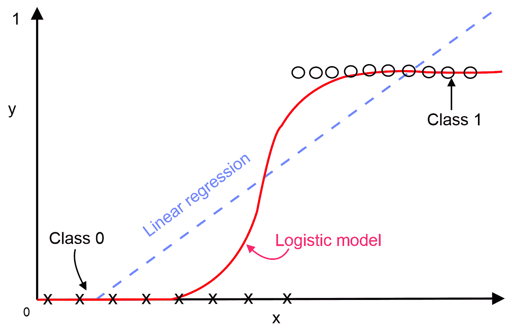

对于给定的新数据点， **x** *，*LR 模型使用以下等式进行预测:

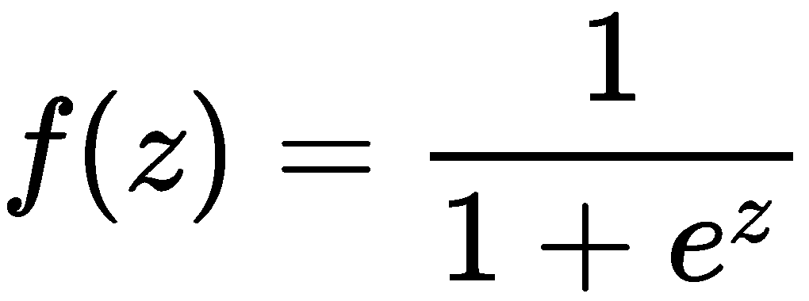

在前面的等式中，将逻辑函数应用于回归以获得其属于任一类别的概率，其中 *z = w ^T x* 并且如果*f(w^Tx)>0.5*，则结果为正；否则为负。这意味着分类线的阈值假定为 *0.5* 。

现在我们知道了 LR 算法是如何工作的，让我们开始使用基于 Spark ML 的 LR 估计器开发，它将预测客户是否有可能流失。首先，我们需要定义一些超参数来训练基于 LR 的管道:

```
val numFolds = 10
val MaxIter: Seq[Int] = Seq(100)
val RegParam: Seq[Double] = Seq(1.0) // L2 regularization param set 1.0 with L1 reg. to reduce overfitting
val Tol: Seq[Double] = Seq(1e-8)// for convergence tolerance for iterative algorithms
val ElasticNetParam: Seq[Double] = Seq(0.0001) //Combination of L1 & L2
```

`RegParam`是一个标量，帮助我们调整约束的强度:小值意味着软余量，而大值意味着硬余量。`Tol`参数用于迭代算法的收敛容差，如 LR 或线性 SVM。一旦我们定义并初始化了超参数，我们的下一个任务是实例化 LR 估计器，如下所示:

```
val lr = new LogisticRegression()
         .setLabelCol("label")
         .setFeaturesCol("features")
```

现在，让我们使用`Pipeline()`方法构建一个流水线估计器，将三个变压器(`ipindexer`、`labelindexer`和`assembler`向量)和 LR 估计器(即`lr`)链接在一个流水线中，也就是说，它们中的每一个都充当一个阶段:

```
val pipeline = new Pipeline()
            .setStages(Array(PipelineConstruction.ipindexer,
                  PipelineConstruction.labelindexer,
                        PipelineConstruction.assembler, lr))
```

Spark ML 管道可以包含以下组件:

*   **DataFrame** :保存原始数据和中间转换数据。

*   **Transformer** :用于通过添加额外的特征列将一个数据帧转换成另一个数据帧。
*   **估计量**:估计量是 ML 模型，比如线性回归。
*   **流水线**:用于将前面的组件、数据帧、转换器和估计器链接在一起。
*   **参数**:一个 ML 算法有很多旋钮可以调整。这些称为超参数，由 ML 算法学习以拟合数据的值称为参数。

为了在超参数空间上执行这样的网格搜索，我们需要首先定义它。在这里，Scala 的函数式编程属性非常方便，因为我们只需在参数网格中添加函数指针和相应的待评估参数。在这里，交叉验证评估者将通过 LR 的最大迭代、正则化参数、容差和弹性网搜索最佳模型:

```
val paramGrid = new ParamGridBuilder()
      .addGrid(lr.maxIter, MaxIter)
      .addGrid(lr.regParam, RegParam)
      .addGrid(lr.tol, Tol)
      .addGrid(lr.elasticNetParam, ElasticNetParam)
      .build()
```

注意，超参数形成了一个 *n* 维空间，其中 *n* 是超参数的数量。这个空间中的每个点都是一个特定的超参数配置，这是一个超参数向量。当然，我们不能探索这个空间中的每一个点，所以我们基本上做的是在那个空间中的一个子集(理想情况下是均匀分布的)上进行网格搜索。然后我们需要定义一个`BinaryClassificationEvaluator`评估器，因为这是一个二元分类问题:

```
val evaluator = new BinaryClassificationEvaluator()
                  .setLabelCol("label")
                  .setRawPredictionCol("prediction")
```

我们通过使用`ParamGridBuilder`使用`CrossValidator`来迭代 LR 的最大迭代、回归参数、公差和弹性净参数，具有 10 重交叉验证:

```
val crossval = new CrossValidator()
      .setEstimator(pipeline)
      .setEvaluator(evaluator)
      .setEstimatorParamMaps(paramGrid)
      .setNumFolds(numFolds)
```

前面的代码旨在执行交叉验证。验证器本身使用`BinaryClassificationEvaluator`估计器来评估每一次折叠的渐进式网格空间中的训练，并确保不会发生过度拟合。

尽管有这么多东西在幕后进行，我们的`CrossValidator`对象的接口仍然很小，众所周知的`CrossValidator`也从估计器扩展并支持`fit`方法。这意味着，在调用`fit`方法后，完整的预定义管道，包括所有特征预处理和 LR 分类器，被执行多次——每次使用不同的超参数向量:

```
val cvModel = crossval.fit(Preprocessing.trainDF)
```

现在，是时候使用测试数据集评估 LR 模型了。首先，我们需要转换测试集，类似于我们之前描述的训练集:

```
val predDF= cvModel.transform(Preprocessing.testSet)
val result = predDF.select("label", "prediction", "probability")
val resutDF = result.withColumnRenamed("prediction", "Predicted_label")
resutDF.show(10)
```

前面的代码块显示了模型生成的`Predicted_label`和原始的`probability`。此外，它还显示了实际的标签。正如我们所看到的，在某些情况下，模型预测正确，但在其他情况下，它变得混乱:

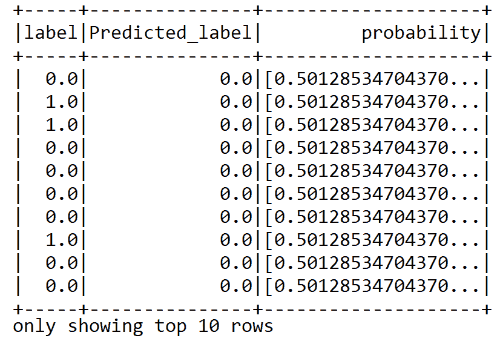

预测概率在根据客户不完美的可能性对其进行排序时也非常有用。这样，有限数量的资源可以用于电信业务，可以专注于最有价值的客户。然而，通过查看前面的预测数据帧，很难猜测分类的准确性。但是，在第二步中，评估员使用`BinaryClassificationEvaluator`进行自我评估，如下所示:

```
val accuracy = evaluator.evaluate(predDF)
println("Classification accuracy: " + accuracy)
```

从我们的二元分类模型来看，这应该显示出大约 77%的分类准确度:

```
Classification accuracy: 0.7679333824070667
```

我们计算另一个性能指标，称为精确召回曲线下的面积和 ROC 曲线下的面积。为此，我们可以构建一个包含测试集原始分数的 RDD:

```
val predictionAndLabels = predDF
      .select("prediction", "label")
      .rdd.map(x => (x(0).asInstanceOf[Double], x(1)
      .asInstanceOf[Double]))
```

现在，前述 RDD 可用于计算前述性能指标:

```
val metrics = new BinaryClassificationMetrics(predictionAndLabels)
println("Area under the precision-recall curve: " + metrics.areaUnderPR)
println("Area under the receiver operating characteristic (ROC) curve : " + metrics.areaUnderROC)
```

在这种情况下，评估返回 77%的准确度，但只有 58%的精度:

```
Area under the precision-recall curve: 0.5770932703444629
Area under the receiver operating characteristic (ROC) curve: 0.7679333824070667
```

在下面的代码中，我们将计算更多的指标。真假正负预测对于评估模型的性能也很有用。然后，我们打印结果以查看指标，如下所示:

```
val tVSpDF = predDF.select("label", "prediction") // True vs predicted labels
val TC = predDF.count() //Total count

val tp = tVSpDF.filter($"prediction" === 0.0)
            .filter($"label" === $"prediction")
            .count() / TC.toDouble

val tn = tVSpDF.filter($"prediction" === 1.0)
            .filter($"label" === $"prediction")
            .count() / TC.toDouble

val fp = tVSpDF.filter($"prediction" === 1.0)
            .filter(not($"label" === $"prediction"))
            .count() / TC.toDouble
val fn = tVSpDF.filter($"prediction" === 0.0)
            .filter(not($"label" === $"prediction"))
            .count() / TC.toDouble

println("True positive rate: " + tp *100 + "%")
println("False positive rate: " + fp * 100 + "%")
println("True negative rate: " + tn * 100 + "%")
println("False negative rate: " + fn * 100 + "%")
```

前面的代码段显示了真阳性率、假阳性率、真阴性率和假阴性率，我们稍后将使用它们来计算 MCC 分数:

```
True positive rate: 66.71664167916042%
False positive rate: 19.04047976011994%
True negative rate: 10.944527736131935%
False negative rate: 3.2983508245877062%
```

最后，我们还计算 MCC 分数，如下所示:

```
val MCC = (tp * tn - fp * fn) / math.sqrt((tp + fp) * (tp + fn) * (fp + tn) * (tn + fn))
println("Matthews correlation coefficient: " + MCC)
```

前面一行给出了马修斯相关系数`0.41676531680973805`。这是一个正值，这给了我们一个健壮模型的一些迹象。但是，我们还没有收到良好的准确性，所以我们继续前进，尝试其他分类器，如 NB。这一次，我们将使用 Apache Spark ML 包中的 liner NB 实现。


# 用于流失预测的 NB

NB 分类器基于贝叶斯定理，具有以下假设:

*   每对特征之间的独立性
*   特征值是非负的，例如计数

例如，如果癌症与年龄有关，这可以用来评估患者可能患有癌症的概率*。*贝叶斯定理数学表述如下:

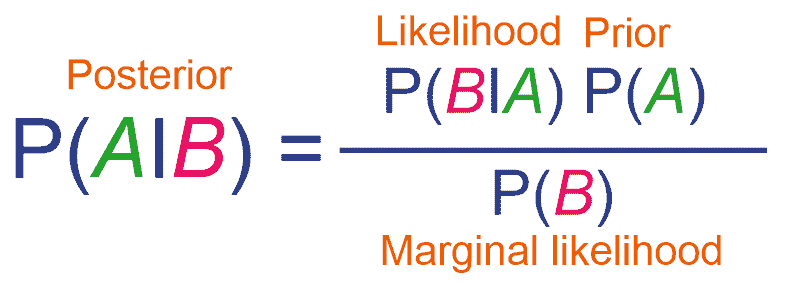

在上式中， *A* 和 *B* 是 *P (B) ≠ 0* 的事件。其他术语可以描述如下:

*   *P*(*A*|*B*)称为观察事件 *A* 的后验或条件概率，假设 *B* 为真
*   假定 *A* 为真，P ( *B* | *A* )是事件 *B* 的可能性
*   *P(A)* 为先验， *P(B)* 为先验概率，也称为边际似然或边际概率

高斯 NB 是用于分类的 NB 的一般化版本，它基于数据的二项式分布。例如，我们的流失预测问题可以表述如下:

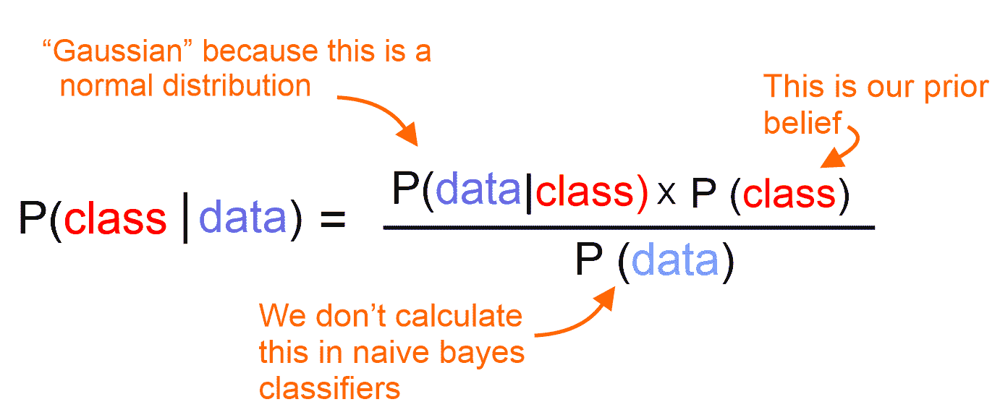

可以采用前面的列表来解决我们的问题，如下所示:

*   *P(类|数据)*是通过独立变量(*数据*)建模预测的*类*的后验概率
*   *P(数据|类)*是预测值的可能性或概率，给定*类*
*   *P(类)*是预测值的*类*和 *P(数据)*的先验概率或边际似然

著名的哈佛幸福研究表明，只有 10%的幸福的人是富有的。虽然你可能认为这个统计数据非常有说服力，但你可能有点想知道真正快乐的富人的比例。贝叶斯定理使用两个额外的线索来帮助你计算这个保留统计量:

*   总体上快乐的人的百分比——即 *P(A)*
*   富人占总人口的百分比——也就是说

贝叶斯定理背后的关键思想是通过考虑总体比率来反转统计数据。假设以下信息事先可用:

*   40%的人是快乐的=> *(一)*
*   5%的人是富人=> *P(B)*

现在，让我们考虑哈佛的研究是正确的——即 *P(B|A) = 10%* 。现在我们知道了快乐的富人的比例，P(A|B) 可以计算如下:

*P(A | B)= { P(A)* P(B | A)}/P(B)=(40% * 10%)/5% = 80%*

因此，大多数人也是快乐的！很好。为了更清楚起见，我们假设全世界的人口是 5000 人。根据我们的计算，存在两个事实:

*   事实 1:这告诉我们有 500 个人是快乐的，哈佛的研究告诉我们这些快乐的人中有 50 个也是富人
*   **事实二**:总共有 60 个富人，所以他们中快乐的比例是 50/60 ~ 83%

这证明了贝叶斯定理及其有效性。要使用 NB，我们需要实例化一个 NB 估计器，如下所示:

```
val nb = new NaiveBayes()
      .setLabelCol("label")
      .setFeaturesCol("features")
```

现在，我们已经准备好变压器和估算器，下一个任务是连接一个管道，也就是说，每个管道充当一个阶段:

```
val pipeline = new Pipeline()
      .setStages(Array(PipelineConstruction.ipindexer,
        PipelineConstruction.labelindexer,
        PipelineConstruction.assembler,nb))
```

让我们定义`paramGrid`在超参数空间上执行这样的网格搜索。然后交叉验证器将通过 NB 的`smoothing`参数搜索最佳模型。与 LR 或 SVM 不同，NB 算法中没有超参数:

```
 val paramGrid = new ParamGridBuilder()
      .addGrid(nb.smoothing, Array(1.0, 0.1, 1e-2, 1e-4))// default value is 1.0
      .build()
```

加法平滑或拉普拉斯平滑是一种用于平滑分类数据的技术。

让我们定义一个`BinaryClassificationEvaluator`评估器来评估模型:

```
val evaluator = new BinaryClassificationEvaluator()
                  .setLabelCol("label")
                  .setRawPredictionCol("prediction")
```

我们使用`CrossValidator`来执行 10 重交叉验证，以选择最佳模型:

```
val crossval = new CrossValidator()
      .setEstimator(pipeline)
      .setEvaluator(evaluator)
      .setEstimatorParamMaps(paramGrid)
      .setNumFolds(numFolds)
```

让我们调用`fit()`方法，这样完整的预定义`pipeline`，包括所有的特征预处理和 LR 分类器，被执行多次——每次使用不同的超参数向量:

```
val cvModel = crossval.fit(Preprocessing.trainDF)
```

现在，是时候在测试数据集上评估 SVM 模型的预测能力了。首先，我们需要用模型管道来转换测试集，这将根据我们在前面的特性工程步骤中描述的相同机制来映射特性:

```
val predDF = cvModel.transform(Preprocessing.testSet)
```

然而，通过查看前面的预测数据帧，很难猜测分类的准确性。但是，在第二步中，评估员使用`BinaryClassificationEvaluator`进行自我评估，如下所示:

```
val accuracy = evaluator.evaluate(predDF)
println("Classification accuracy: " + accuracy)
```

对于我们的二进制分类模型，前面一行代码应该显示 75%的分类准确率:

```
Classification accuracy: 0.600772911299227
```

像以前一样，我们构建了一个包含测试集原始分数的 RDD:

```
val predictionAndLabels = predDF.select("prediction", "label")
      .rdd.map(x => (x(0).asInstanceOf[Double], x(1)
        .asInstanceOf[Double]))
```

现在，前述 RDD 可用于计算前述性能指标:

```
val metrics = new BinaryClassificationMetrics(predictionAndLabels)
println("Area under the precision-recall curve: " + metrics.areaUnderPR)
println("Area under the receiver operating characteristic (ROC) curve : " + metrics.areaUnderROC)
```

在这种情况下，评估返回 75%的准确度，但只有 55%的精度:

```
Area under the precision-recall curve: 0.44398397740763046
Area under the receiver operating characteristic (ROC) curve: 0.600772911299227
```

在下面的代码中，我们再次计算了一些指标。假的和真的正的和负的预测也有助于评估模型的性能:

```
val tVSpDF = predDF.select("label", "prediction") // True vs predicted labels
val TC = predDF.count() //Total count

val tp = tVSpDF.filter($"prediction" === 0.0)
            .filter($"label" === $"prediction")
            .count() / TC.toDouble

val tn = tVSpDF.filter($"prediction" === 1.0)
            .filter($"label" === $"prediction")
            .count() / TC.toDouble

val fp = tVSpDF.filter($"prediction" === 1.0)
            .filter(not($"label" === $"prediction"))
            .count() / TC.toDouble
val fn = tVSpDF.filter($"prediction" === 0.0)
            .filter(not($"label" === $"prediction"))
            .count() / TC.toDouble

println("True positive rate: " + tp *100 + "%")
println("False positive rate: " + fp * 100 + "%")
println("True negative rate: " + tn * 100 + "%")
println("False negative rate: " + fn * 100 + "%")
```

前面的代码段显示了真阳性率、假阳性率、真阴性率和假阴性率，我们稍后将使用它们来计算 MCC 分数:

```
True positive rate: 66.71664167916042%
False positive rate: 19.04047976011994%
True negative rate: 10.944527736131935%
False negative rate: 3.2983508245877062%
```

最后，我们还计算 MCC 分数，如下所示:

```
val MCC = (tp * tn - fp * fn) / math.sqrt((tp + fp) * (tp + fn) * (fp + tn) * (tn + fn))
println("Matthews correlation coefficient: " + MCC)
```

前面一行给出了 Matthews 相关系数`0.14114315409796457`，而这一次，我们在准确性和 MCC 分数方面的表现甚至更差。因此，值得用另一个分类器来尝试一下，比如 SVM。我们将使用 Spark ML 包中的线性 SVM 实现。

用于流失预测的 SVM

SVM 也是一种用于分类的种群算法。SVM 基于决策平面的概念，它定义了我们在本章开始时讨论的决策边界。下图显示了 SVM 算法的工作原理:


# 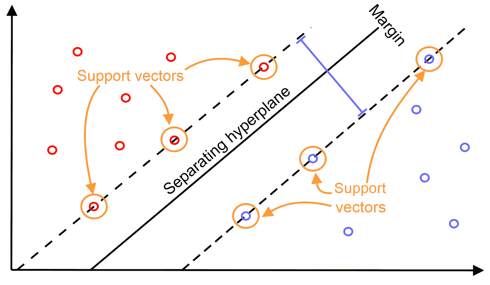

SVM 使用核函数，该函数找到以最大间隔分隔类别的线性超平面。下图显示了属于两个不同类别(红色和蓝色)的数据点(即支持向量)如何使用基于最大差值的决策边界进行分离:

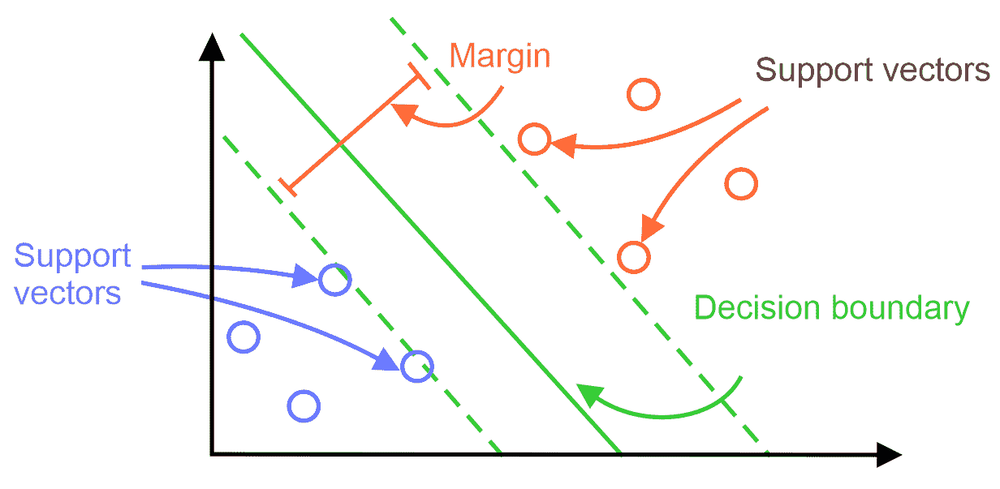

前面的支持向量分类器可以在数学上表示为点积，如下所示:

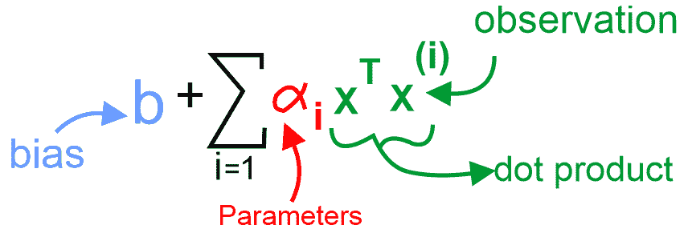

如果要分离的数据是非常高维的，核技巧使用核函数将数据转换到更高维的特征空间，以便它们可以线性分离以进行分类。从数学上讲，核心技巧是用核心替换点积，这将允许非线性决策边界和计算效率:


既然我们已经知道了 SVM，让我们开始使用 SVM 的基于 Spark 的实现。首先，我们需要定义一些超参数来训练基于 LR 的管道:

一旦我们定义并初始化了超参数，下一个任务就是实例化 SVM 估计器，如下所示:

现在，我们已经准备好变压器和估算器，下一个任务是连接一个管道，也就是说，每个管道充当一个阶段:

```
val numFolds = 10
val MaxIter: Seq[Int] = Seq(100)
val RegParam: Seq[Double] = Seq(1.0) // L2 regularization param, set 0.10 with L1 regularization
val Tol: Seq[Double] = Seq(1e-8)
val ElasticNetParam: Seq[Double] = Seq(1.0) // Combination of L1 and L2
```

Once we have the hyperparameters defined and initialized, the next task is to instantiate an SVM estimator, as follows:

```
val svm = new LinearSVC()
```

Now that we have transformers and an estimator ready, the next task is to chain in a single pipeline—that is, each of them acts as a stage:

```
val pipeline = new Pipeline()
      .setStages(Array(PipelineConstruction.ipindexer,
        PipelineConstruction.labelindexer,
        PipelineConstruction.assembler,svm))
```

让我们定义`paramGrid`在超参数空间上执行这样的网格搜索。这将通过 SVM 的最大迭代、正则化参数、容差和弹性网络搜索最佳模型:

让我们定义一个`BinaryClassificationEvaluator`评估器来评估模型:

我们使用`CrossValidator`来执行 10 重交叉验证，以选择最佳模型:

```
val paramGrid = new ParamGridBuilder()
      .addGrid(svm.maxIter, MaxIter)
      .addGrid(svm.regParam, RegParam)
      .addGrid(svm.tol, Tol)
      .addGrid(svm.elasticNetParam, ElasticNetParam)
      .build()
```

现在，让我们调用 fit 方法，以便包括所有特征预处理和 LR 分类器的完整预定义`pipeline`被多次执行——每次使用不同的超参数向量:

```
val evaluator = new BinaryClassificationEvaluator()
                  .setLabelCol("label")
                  .setRawPredictionCol("prediction")
```

现在，是时候在测试数据集上评估 SVM 模型的预测能力了:

```
val crossval = new CrossValidator()
      .setEstimator(pipeline)
      .setEvaluator(evaluator)
      .setEstimatorParamMaps(paramGrid)
      .setNumFolds(numFolds)
```

前面的代码块显示了预测的标签和模型生成的原始概率。此外，它还显示了实际的标签。

```
val cvModel = crossval.fit(Preprocessing.trainDF)
```

正如我们所看到的，在某些情况下，模型预测正确，但在其他一些情况下，它变得混乱:

```
val predDF= cvModel.transform(Preprocessing.testSet)
predDF.show(10)
```

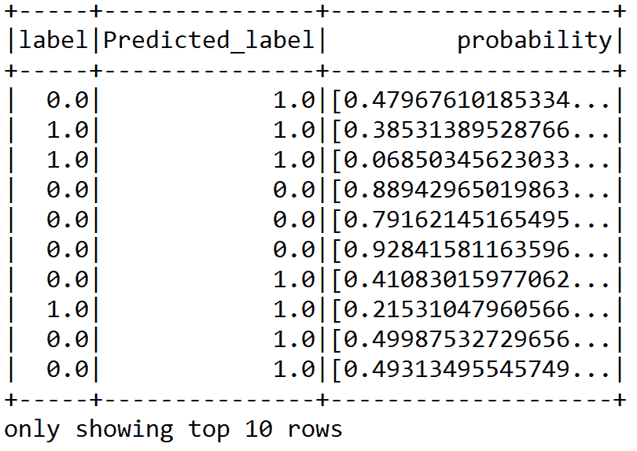

然而，通过查看前面的预测数据帧，很难猜测分类的准确性。但是，在第二步中，评估者使用`BinaryClassificationEvaluator`进行自我评估，如下所示:

因此，从我们的二元分类模型中，我们获得了大约 75%的分类准确度:

现在，我们构建一个包含测试集原始分数的 RDD，它将用于计算性能指标，如精确召回曲线下面积(AUC)和接收操作特征曲线下面积(ROC):

```
val accuracy = evaluator.evaluate(predDF)
println("Classification accuracy: " + accuracy)
```

现在，前述 RDD 可用于计算前述性能指标:

```
Classification accuracy: 0.7530180345969819
```

Now, we construct an RDD containing the raw scores on the test set, which will be used to compute performance metrics such as area under the precision-recall curve (AUC) and are under the received operating characteristic curve (ROC):

```
val predictionAndLabels = predDF
      .select("prediction", "label")
      .rdd.map(x => (x(0).asInstanceOf[Double], x(1)
      .asInstanceOf[Double]))
```

Now, the preceding RDD can be used to compute the aforementioned performance metrics:

```
val metrics = new BinaryClassificationMetrics(predictionAndLabels) 
println("Area under the precision-recall curve: " + metrics.areaUnderPR)
println("Area under the receiver operating characteristic (ROC) curve : " + metrics.areaUnderROC)
```

在这种情况下，评估返回 75%的准确度，但只有 55%的精度:

我们还可以计算更多的度量。例如，假的和真的正的和负的预测对于评估模型的性能也是有用的:

前面的代码段显示了真阳性率、假阳性率、真阴性率和假阴性率，我们稍后将使用它们来计算 MCC 分数:

```
Area under the precision-recall curve: 0.5595712265324828
Area under the receiver operating characteristic (ROC) curve: 0.7530180345969819
```

最后，我们还计算 MCC 分数，如下所示:

```
val tVSpDF = predDF.select("label", "prediction") // True vs predicted labels
val TC = predDF.count() //Total count

val tp = tVSpDF.filter($"prediction" === 0.0)
            .filter($"label" === $"prediction")
            .count() / TC.toDouble

val tn = tVSpDF.filter($"prediction" === 1.0)
            .filter($"label" === $"prediction")
            .count() / TC.toDouble

val fp = tVSpDF.filter($"prediction" === 1.0)
            .filter(not($"label" === $"prediction"))
            .count() / TC.toDouble
val fn = tVSpDF.filter($"prediction" === 0.0)
            .filter(not($"label" === $"prediction"))
            .count() / TC.toDouble

println("True positive rate: " + tp *100 + "%")
println("False positive rate: " + fp * 100 + "%")
println("True negative rate: " + tn * 100 + "%")
println("False negative rate: " + fn * 100 + "%")
```

The preceding code segment shows the true positive, false positive, true negative, and false negative rates, which we will use to compute the MCC score later on:

```
True positive rate: 66.71664167916042%
False positive rate: 19.04047976011994%
True negative rate: 10.944527736131935%
False negative rate: 3.2983508245877062%
```

Finally, we also compute the MCC score, as follows:

```
val MCC = (tp * tn - fp * fn) / math.sqrt((tp + fp) * (tp + fn) * (fp + tn) * (tn + fn))
println("Matthews correlation coefficient: " + MCC)
```

这给了我一个`0.3888239300421191`的马修斯相关系数。虽然我们已经尝试使用多达三种分类算法，但我们仍然没有收到良好的准确性。考虑到 SVM 设法给我们 76%的准确率，这仍然被认为是低的。此外，没有最合适的特征选择选项，这有助于我们用最合适的特征训练我们的模型。为了提高分类精度，我们将需要使用基于树的方法，如 DT、RF 和 GBT，它们有望提供更强大的响应。我们将在下一章做这件事。

摘要

在这一章中，我们学习了不同的经典分类算法，如 LR、SVM 和 NB。使用这些算法，我们预测客户是否可能取消他们的电信订购。我们还讨论了构建成功的客户流失预测模型需要哪些类型的数据。


# 基于树的分类器和树集成分类器非常有用和健壮，并且广泛用于解决分类和回归任务。在下一章中，我们将研究开发这样的分类器和回归器，使用基于树和集成的技术，如 DT、RF 和 GBT，用于分类和回归。

In this chapter, we have learned about different classical classification algorithms, such as LR, SVM, and NB. Using these algorithms, we predicted whether a customer is likely to cancel their telecommunications subscription or not. We've also discussed what types of data are required to build a successful churn predictive model.

Tree-based and tree ensemble classifiers are really useful and robust, and are widely used for solving both classification and regression tasks. In the next chapter, we will look into developing such classifiers and regressors using tree-based and ensemble techniques such as DT, RF, and GBT, for both classification and regression.