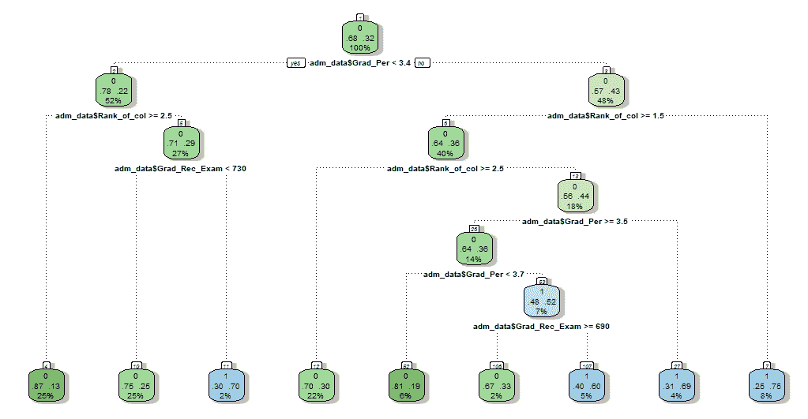
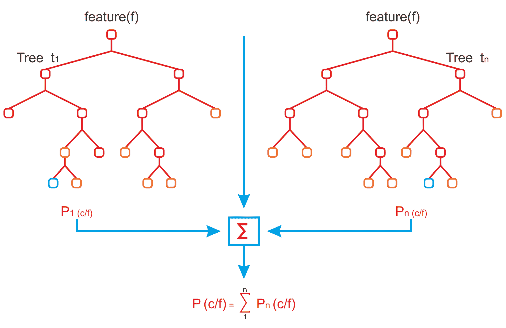
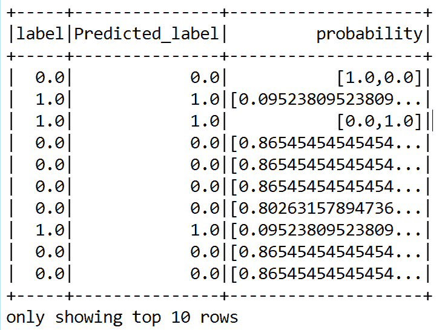
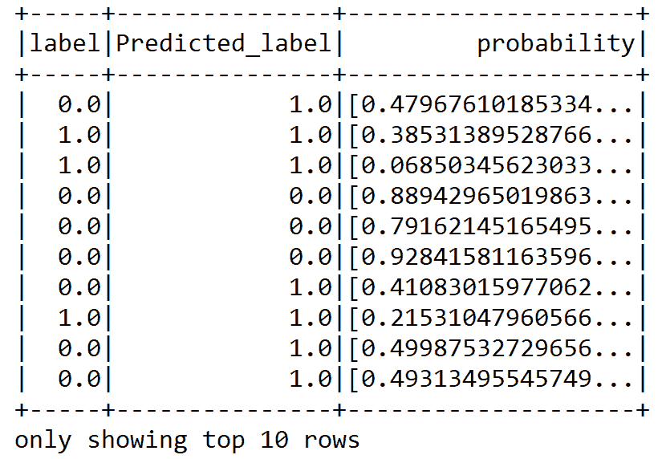
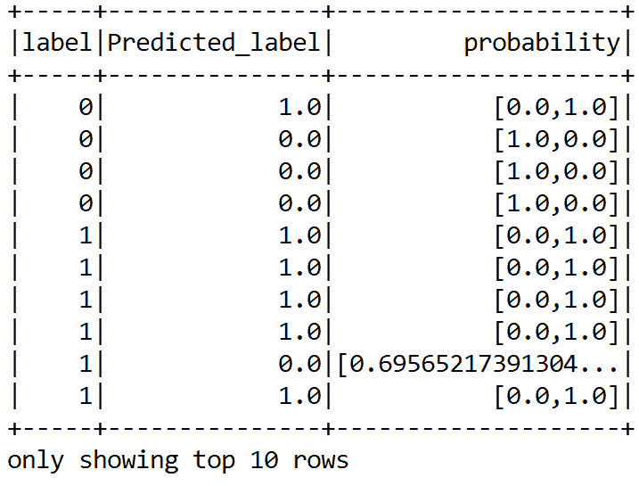

# 基于树的集成技术的 Scala

在前一章中，我们使用线性模型解决了分类和回归问题。我们还使用了逻辑回归、支持向量机和朴素贝叶斯。然而，在这两种情况下，我们都没有体验到良好的准确性，因为我们的模型显示出较低的可信度。

另一方面，基于树的分类器和树集成分类器非常有用、健壮，并且广泛用于分类和回归任务。本章将简要介绍使用基于树和集成技术开发这些分类器和回归器，例如用于分类和回归的**决策树** ( **DTs** )、**随机森林** ( **RF** )和**梯度增强树** ( **GBT** )。更具体地说，我们将重新审视并解决我们之前讨论过的回归(来自[第二章](f649db9f-aea9-4509-b9b8-e0b7d5fb726a.xhtml)， *Scala 用于回归分析*)和分类(来自[第三章](51712107-c5bc-4d7d-a84a-3039aafc8c0a.xhtml)， *Scala 用于学习分类*)问题。

本章将涵盖以下主题:

*   决策树和树集合
*   监督学习的决策树
*   用于监督学习的梯度提升树
*   监督学习的随机森林
*   下一步是什么？


# 技术要求

确保在您的机器上安装并配置了 Scala 2.11.x 和 Java 1.8.x。

这几章的代码文件可以在 GitHub 上找到:

[https://github . com/packt publishing/Machine-Learning-with-Scala-Quick-Start-Guide/tree/master/chapter 04](https://github.com/PacktPublishing/Machine-Learning-with-Scala-Quick-Start-Guide/tree/master/Chapter04)

看看下面的播放列表，看看本章的动作视频代码:
[http://bit.ly/2WhQf2i](http://bit.ly/2WhQf2i)


# 决策树和树集合

DTs 通常属于监督学习技术，用于识别和解决与分类和回归相关的问题。顾名思义，DTs 有不同的分支——每个分支根据统计概率表示一个可能的决策、现象或反应。就特征而言，DTs 分为两种主要类型:训练集和测试集，这有助于对预测的标签或类进行良好的更新。

二进制和多类分类问题都可以通过 DT 算法来处理，这也是它被用于跨问题的原因之一。例如，对于我们在[第 3 章](51712107-c5bc-4d7d-a84a-3039aafc8c0a.xhtml)、 *Scala 中介绍的准入示例，用于学习分类*，DTs 从准入数据中学习，以一组`if...else`决策规则来近似正弦曲线，如下图所示:



基于高校录取数据利用 DTs 生成决策规则

一般来说，树越大，决策规则越复杂，模型越适合。DTs 的另一个令人兴奋的功能是它们可以用来解决分类和回归问题。现在让我们来看看 DTs 的优缺点。两种广泛使用的基于树的集成技术是 RF 和 GBT。这两种技术的主要区别在于训练树的方式和顺序:

*   RFs 独立地训练每棵树，但是基于数据的随机样本。这些随机样本有助于使模型比单个 DT 更稳健，因此不太可能对训练数据造成过载。
*   GBTs 一次训练一棵树。由先前训练的树产生的错误将被每个新训练的树纠正。随着更多树的加入，模型变得更有表现力。

RFs 采用一个观察子集和一个变量子集来构建，这是一个 DTs 集合。这些树实际上是在同一个训练集的不同部分上训练的，但是个体树长得非常深，倾向于从高度不可预测的模式中学习。

有时非常深的树是 DT 模型中过度拟合问题的原因。此外，这些偏差会使分类器表现不佳，即使所表示的要素质量相对于数据集而言是好的。

当构建 DTs 时，RFs 将它们集成在一起，以获得更准确和稳定的预测。RFs 有助于将多个 DTs 平均在一起，其目标是通过计算事例对之间的接近度来减少方差以确保一致性。这也是 RF 的一个直接后果。通过独立陪审员小组的最大投票，我们得到了比最佳陪审团更好的最终预测。下图显示了如何将来自两个森林的决策集成在一起以获得最终预测:



基于树的集成及其组装技术

最后，RF 和 GBT 都产生 DT 的加权集合，随后预测来自每个集合模型的个体树的组合结果。使用这些方法(作为分类器或回归器)时，参数设置如下:

*   如果树的数量为 1，则不应用引导。如果树的数量大于 1，则应用自举，支持的值为`auto`、`all`、`sqrt`、`log2`和三分之一。
*   支持的数值为[0.0-1.0]和[1-n]。如果`numTrees`是`1`，`featureSubsetStrategy`被设置为`all`。如果`numTrees > 1`(用于射频)，`featureSubsetStrategy`设置为`sqrt`分类。如果选择`featureSubsetStrategy`作为`auto`，算法会自动推断出最佳特征子集策略。
*   杂质标准仅用于信息增益计算，基尼系数和方差分别作为分类和回归的支持值。
*   `maxDepth`是树的最大深度(例如，深度 0 表示 1 个叶节点，深度 1 表示 1 个内部节点和 2 个叶节点，以此类推)。
*   `maxBins`表示用于分割要素的最大箱数，建议值为 100 以获得更好的结果。

既然我们已经处理了回归分析和分类问题，让我们看看如何更舒适地使用 DT、RF 和 GBT 来解决这些问题。先从 DT 开始吧。


# 监督学习的决策树

在这一节中，我们将看到如何使用 DTs 来解决回归和分类问题。在前两章[第二章](f649db9f-aea9-4509-b9b8-e0b7d5fb726a.xhtml)、*回归分析的 Scala*和[第三章](51712107-c5bc-4d7d-a84a-3039aafc8c0a.xhtml)、*学习分类的 Scala*中，我们解决了客户流失和保险赔付问题。那分别是分类和回归问题。在这两种方法中，我们都使用了其他经典模型。然而，我们将看到如何用基于树和集成的技术来解决它们。我们将使用 Scala 中 Apache Spark ML 包中的 DT 实现。


# 分类决策树

首先我们知道 [第三章](51712107-c5bc-4d7d-a84a-3039aafc8c0a.xhtml)*Scala 对于学习分类*的客户流失预测问题，我们也知道数据。我们也知道 DTs 的工作原理。因此，我们可以使用基于 Spark 的 DTs 实现直接进入编码部分。首先，我们通过实例化`DecisionTreeClassifier`接口来创建一个`DecisionTreeClassifier`评估器。此外，我们需要指定标签和特征向量列:

```
val dTree = new DecisionTreeClassifier()
        .setLabelCol("label")// Setting label column
        .setFeaturesCol("features") // Setting feature vector column
        .setSeed(1234567L)// for reproducibility
```

如前几章所述，我们有三个变压器(`ipindexer`、`labelindexer`和`assembler`)和一个估计器(`dTree`)。我们现在可以将它们链接在一个管道中，这样每个管道都可以充当一个阶段:

```
val pipeline = new Pipeline()
          .setStages(Array(PipelineConstruction.ipindexer,
                            PipelineConstruction.labelindexer,
                                PipelineConstruction.assembler,dTree))
```

由于我们想要执行超参数调整和交叉验证，我们将不得不创建一个`paramGrid`变量，该变量将在 K 倍交叉验证期间用于超参数空间的网格搜索:

```
var paramGrid = new ParamGridBuilder()
  .addGrid(dTree.impurity, "gini" :: "entropy" :: Nil)
  .addGrid(dTree.maxBins, 2 :: 5 :: 10 :: 15 :: 20 :: 25 :: 30 :: Nil)
  .addGrid(dTree.maxDepth, 5 :: 10 :: 15 :: 20 :: 25 :: 30 :: 30 :: Nil)
  .build()
```

更具体地说，这将搜索 DT 的`impurity`、`maxBins`和`maxDepth`以获得最佳模型。最大箱数用于分离连续要素以及选择如何在每个结点上分割要素。结合起来，该算法通过 DT 的`maxDepth`和`maxBins`参数搜索最佳模型。

在前面的代码段中，我们创建了一个渐进的`paramGrid`变量，其中我们将组合指定为一个字符串或整数值列表。这意味着我们正在用不同的超参数组合创建网格空间。这将帮助我们提供由最佳超参数组成的最佳模型。然而，为此，我们需要有一个`BinaryClassificationEvaluator`评估员来评估每个模型，并在交叉验证过程中挑选最佳模型:

```
val evaluator = new BinaryClassificationEvaluator()
                  .setLabelCol("label")
                  .setRawPredictionCol("prediction")
```

我们使用`CrossValidator`进行 10 重交叉验证，以选择最佳模型:

```
println("Preparing for 10-fold cross-validation")
val numFolds = 10

val crossval = new CrossValidator()
     .setEstimator(pipeline)
     .setEvaluator(evaluator)
     .setEstimatorParamMaps(paramGrid)
     .setNumFolds(numFolds)
```

现在，让我们调用`fit`方法，以便包括所有特征预处理和 DT 分类器在内的完整预定义管道被多次执行——每次使用不同的超参数向量:

```
val cvModel = crossval.fit(Preprocessing.trainDF)
```

现在是时候评估 DT 模型在测试数据集上的预测能力了:

```
val predictions = cvModel.transform(Preprocessing.testSet)
prediction.show(10)
```

这将引导我们进入下面的数据框，显示预测标签与实际标签的对比。此外，它还显示了原始概率:



然而，基于前面的预测数据框架，很难猜测分类的准确性。但是在第二步中，使用`BinaryClassificationEvaluator`进行评估，如下所示:

```
val accuracy = evaluator.evaluate(predictions)
println("Classification accuracy: " + accuracy)
```

这将提供具有精度值的输出:

```
Accuracy: 0.8441663599558337
```

因此，从我们的二元分类模型中，我们获得了大约 84%的分类准确度。与 SVM 和 LR 一样，我们将基于以下 RDD 观察精确召回曲线下的区域和**接收器操作特性** ( **ROC** )曲线下的区域，其中包含测试集的原始分数:

```
val predictionAndLabels = predictions
      .select("prediction", "label")
      .rdd.map(x => (x(0).asInstanceOf[Double], x(1)
        .asInstanceOf[Double]))
```

前面的 RDD 可用于计算前面提到的两个性能指标:

```
val metrics = new BinaryClassificationMetrics(predictionAndLabels)
println("Area under the precision-recall curve: " + metrics.areaUnderPR)
println("Area under the receiver operating characteristic (ROC) curve: " + metrics.areaUnderROC)
```

在这种情况下，评估返回 84%的准确度，但只有 67%的精确度，这比 SVM 和 LR 的结果好得多:

```
Area under the precision-recall curve: 0.6665988000794282
Area under the receiver operating characteristic (ROC) curve: 0.8441663599558337
```

然后，我们计算更多的指标，例如，假阳性和真阳性，假阴性和真阴性，因为这些预测对于评估模型的性能也很有用:

```
val TC = predDF.count() //Total count

val tp = tVSpDF.filter($"prediction" === 0.0).filter($"label" === $"prediction")
                    .count() / TC.toDouble // True positive rate
val tn = tVSpDF.filter($"prediction" === 1.0).filter($"label" === $"prediction")
                    .count() / TC.toDouble // True negative rate
val fp = tVSpDF.filter($"prediction" === 1.0).filter(not($"label" === $"prediction"))
                    .count() / TC.toDouble // False positive rate
val fn = tVSpDF.filter($"prediction" === 0.0).filter(not($"label" === $"prediction"))
                    .count() / TC.toDouble // False negative rate
```

另外，我们计算马修斯相关系数:

```
val MCC = (tp * tn - fp * fn) / math.sqrt((tp + fp) * (tp + fn) * (fp + tn) * (tn + fn)) 
```

让我们观察一下模型的可信度有多高:

```
println("True positive rate: " + tp *100 + "%")
println("False positive rate: " + fp * 100 + "%")
println("True negative rate: " + tn * 100 + "%")
println("False negative rate: " + fn * 100 + "%")
println("Matthews correlation coefficient: " + MCC)
```

太棒了。我们只达到了 70%的准确率，这可能就是为什么我们的树数量很少的原因，但是是什么因素呢？

```
True positive rate: 70.76461769115441%
False positive rate: 14.992503748125937%
True negative rate: 12.293853073463268%
False negative rate: 1.9490254872563717%
Matthews correlation coefficient: 0.5400720075807806
```

现在，让我们看看在交叉验证后，我们在哪个级别获得了最佳模型:

```
val bestModel = cvModel.bestModel
println("The Best Model and Parameters:\n--------------------")
println(bestModel.asInstanceOf[org.apache.spark.ml.PipelineModel].stages(3))
```

根据以下输出，我们用`53 nodes`在`depth 5`获得了最佳树模型:

```
The Best Model and Parameters:
DecisionTreeClassificationModel of depth 5 with 53 nodes
```

让我们通过展示树来提取在树构建期间采取的那些步骤(即决策)。该树帮助我们找到数据集中最有价值的特征:

```
bestModel.asInstanceOf[org.apache.spark.ml.PipelineModel]
      .stages(3)
      .extractParamMap
val treeModel = bestModel.asInstanceOf[org.apache.spark.ml.PipelineModel]
      .stages(3)
      .asInstanceOf[DecisionTreeClassificationModel]
println("Learned classification tree model:\n" + treeModel.toDebugString)
```

在下面的输出中，`toDebugString()`方法打印了树的决策节点，并在最后一片叶子上确定了预测结果:

```
Learned classification tree model:
If (feature 3 <= 245.2)
 If (feature 11 <= 3.0)
 If (feature 1 in {1.0})
 If (feature 10 <= 2.0)
 Predict: 1.0
 Else (feature 10 > 2.0)
 If (feature 9 <= 12.9)
 Predict: 0.0
 Else (feature 9 > 12.9)
 Predict: 1.0
 …
 Else (feature 7 > 198.0)
 If (feature 2 <= 28.0)
 Predict: 1.0
 Else (feature 2 > 28.0)
 If (feature 0 <= 60.0)
 Predict: 0.0
 Else (feature 0 > 60.0)
 Predict: 1.0
```

我们还可以看到某些特征(在我们的例子中是`3`和`11`)被用于决策——也就是说，这是客户可能流失的两个最重要的原因。但是那两个特征是什么呢？让我们看看他们:

```
println("Feature 11:" + Preprocessing.trainDF.filter(PipelineConstruction.featureCols(11)))
println("Feature 3:" + Preprocessing.trainDF.filter(PipelineConstruction.featureCols(3)))
```

根据以下输出，特征 3 和 11 是最重要的预测因素:

```
Feature 11: [total_international_num_calls: double]
Feature 3:  [total_day_mins: double]
```

客户服务呼叫和全天分钟数由 DTs 选择，因为它们提供了一种自动机制来确定最重要的功能。


# 回归决策树

在[第 3 章](51712107-c5bc-4d7d-a84a-3039aafc8c0a.xhtml)、 *Scala 学习分类*中，我们学习了如何预测关于交通缓慢的问题。我们应用**线性回归** ( **LR** )和广义线性回归来解决这个问题。此外，我们非常了解这些数据。

如前所述，对于回归问题，DT 还可以提供非常强大的响应和性能。类似于`DecisionTreeClassifier`，可以用`DecisionTreeRegressor()`方法实例化`DecisionTreeRegressor`估算器。此外，我们需要显式指定标签和特性列:

```
// Estimator algorithm
val model = new DecisionTreeRegressor().setFeaturesCol("features").setLabelCol("label")
```

在实例化前面的估计器时，我们可以设置最大箱数、树数、最大深度和杂质。

然而，由于我们将执行 k-fold 交叉验证，我们可以在创建`paramGrid`时设置这些参数:

```
// Search through decision tree's parameter for the best model
var paramGrid = new ParamGridBuilder()
      .addGrid(rfModel.impurity, "variance" :: Nil)// variance for regression
      .addGrid(rfModel.maxBins, 25 :: 30 :: 35 :: Nil)
      .addGrid(rfModel.maxDepth, 5 :: 10 :: 15 :: Nil)
      .addGrid(rfModel.numTrees, 3 :: 5 :: 10 :: 15 :: Nil)
      .build()
```

为了获得更好、更稳定的性能，让我们将 k 倍交叉验证和网格搜索作为模型调整的一部分。如你所料，我将进行 10 次交叉验证。根据您的设置和数据集随意调整折叠次数:

```
println("Preparing K-fold Cross Validation and Grid Search: Model tuning")
val numFolds = 10  // 10-fold cross-validation 
val cv = new CrossValidator()
      .setEstimator(rfModel)
      .setEvaluator(new RegressionEvaluator)
      .setEstimatorParamMaps(paramGrid)
      .setNumFolds(numFolds)
```

太棒了。我们创造了交叉验证估计量。现在是时候用交叉验证来训练 DT 回归模型了:

```
println("Training model with decision tree algorithm")
val cvModel = cv.fit(trainingData)
```

现在我们有了合适的模型，我们可以进行预测了。因此，让我们开始评估训练集和验证集上的模型，并计算 RMSE、MSE、MAE、R 平方等:

```
println("Evaluating the model on the test set and calculating the regression metrics")
val trainPredictionsAndLabels = cvModel.transform(testData).select("label", "prediction")
                                            .map { case Row(label: Double, prediction: Double) 
                                            => (label, prediction) }.rdd

val testRegressionMetrics = new RegressionMetrics(trainPredictionsAndLabels)
```

一旦我们有了最佳拟合和交叉验证的模型，我们可以期待一个良好的预测精度。让我们在训练和验证集上观察结果:

```
val results = "\n=====================================================================\n" +
      s"TrainingData count: ${trainingData.count}\n" +
      s"TestData count: ${testData.count}\n" +
      "=====================================================================\n" +
      s"TestData MSE = ${testRegressionMetrics.meanSquaredError}\n" +
      s"TestData RMSE = ${testRegressionMetrics.rootMeanSquaredError}\n" +
      s"TestData R-squared = ${testRegressionMetrics.r2}\n" +
      s"TestData MAE = ${testRegressionMetrics.meanAbsoluteError}\n" +
      s"TestData explained variance = ${testRegressionMetrics.explainedVariance}\n" +
      "=====================================================================\n"
println(results)
```

以下输出显示了测试集的 MSE、RMSE、R 平方、MAE 和解释方差:

```
=====================================================================
 TrainingData count: 80
 TestData count: 55
 =====================================================================
 TestData MSE = 7.871519100933004
 TestData RMSE = 2.8056227652578323
 TestData R-squared = 0.5363607928629964
 TestData MAE = 2.284866391184572
 TestData explained variance = 20.213067468774792
 =====================================================================
```

太好了！我们已经成功地在训练集和测试集上计算了原始预测，我们可以看到与 LR 回归模型相比的改进。让我们寻找有助于提高精确度的模型:

```
val bestModel = cvModel.bestModel.asInstanceOf[DecisionTreeRegressionModel]
```

此外，我们可以通过观察林中的 dt 来了解决策是如何做出的:

```
println("Decision tree from best cross-validated model: " + bestModel.toDebugString)
```

以下是输出:

```
Decision tree from best cross-validated model at depth 5 with 39 nodes
 If (feature 0 <= 19.0)
 If (feature 0 <= 3.0)
 If (feature 0 <= 1.0)
 If (feature 3 <= 0.0)
 If (feature 4 <= 0.0)
 Predict: 4.1
 Else (feature 4 > 0.0)
 Predict: 3.4000000000000004
 ....
 Predict: 15.30909090909091
 Else (feature 0 > 25.0)
 Predict: 12.800000000000002
 Else (feature 11 > 1.0)
 Predict: 22.100000000000023
 Else (feature 9 > 1.0)
 Predict: 23.399999999999977
```

使用 DTs，可以测量特征的重要性，以便在稍后阶段我们可以决定使用哪些特征以及从数据帧中删除哪些特征。让我们从之前刚刚创建的最佳模型中找出特征重要性，所有特征按升序排列如下:

```
val featureImportances = bestModel.featureImportances.toArray

val FI_to_List_sorted = featureImportances.toList.sorted.toArray
println("Feature importance generated by the best model: ")
for(x <- FI_to_List_sorted) println(x)

```

以下是模型生成的特征重要性:

```
Feature importance generated by the best model:
 0.0
 0.0
 0.0
 0.0
 0.0
 0.0
 0.0
 0.0
 7.109215735617604E-5
 2.1327647206851872E-4
 0.001134987328520092
 0.00418143999334111
 0.025448271970345014
 0.03446268498009088
 0.057588305610674816
 0.07952108027588178
 0.7973788612117217

```

最后一个结果对于理解特征的重要性很重要。正如你所看到的，RF 把一些特性排到了更重要的位置。例如，最后几个特征是最重要的，而其中八个不太重要。我们可以删除那些不重要的列，并再次训练 DT 模型，以观察在测试集上 MAE 是否有任何更大的减少和 R 平方的增加。


# 用于监督学习的梯度提升树

在这一节中，我们将看到如何使用 GBT 来解决回归和分类问题。在前两章[第二章](f649db9f-aea9-4509-b9b8-e0b7d5fb726a.xhtml)、 *Scala 进行回归分析*和[第三章](51712107-c5bc-4d7d-a84a-3039aafc8c0a.xhtml)、 *Scala 进行学习分类*中，我们解决了客户流失和保险赔付严重度问题，分别是分类和回归问题。在这两种方法中，我们都使用了其他经典模型。然而，我们将看到如何用基于树和集成的技术来解决它们。我们将使用 Scala 中 Spark ML 包的 GBT 实现。


# 用于分类的梯度增强树

我们从[第三章](51712107-c5bc-4d7d-a84a-3039aafc8c0a.xhtml)、*Scala for Learning class ification*中知道客户流失预测问题，对数据了如指掌。我们已经知道 RF 的工作原理，所以让我们开始使用基于 Spark 的 RF 实现:

1.  通过调用`GBTClassifier()`接口实例化一个`GBTClassifier`估算器:

```
val gbt = new GBTClassifier()
      .setLabelCol("label")
      .setFeaturesCol("features")
      .setSeed(1234567L)
```

2.  我们准备了三个变压器和一个估算器。链在单个管道中，即它们中的每一个都充当一个阶段:

```
// Chain indexers and tree in a Pipeline.
val pipeline = new Pipeline()
      .setStages(Array(ScalaClassification.PipelineConstruction.ipindexer,
        ScalaClassification.PipelineConstruction.labelindexer,
        ScalaClassification.PipelineConstruction.assembler,
        gbt))
```

3.  定义`paramGrid`变量，在超参数空间进行网格搜索:

```
// Search through decision tree's maxDepth parameter for best model
val paramGrid = new ParamGridBuilder()
      .addGrid(gbt.maxDepth, 3 :: 5 :: 10 :: Nil) // :: 15 :: 20 :: 25 :: 30 :: Nil)
      .addGrid(gbt.impurity, "gini" :: "entropy" :: Nil)
      .addGrid(gbt.maxBins, 5 :: 10 :: 20 :: Nil) //10 :: 15 :: 25 :: 35 :: 45 :: Nil)
      .build()
```

4.  定义一个`BinaryClassificationEvaluator`评估器来评估模型:

```
val evaluator = new BinaryClassificationEvaluator()
                  .setLabelCol("label")
                  .setRawPredictionCol("prediction")
```

5.  我们使用`CrossValidator`对最佳模型选择进行 10 重交叉验证:

```
// Set up 10-fold cross validation
val numFolds = 10
val crossval = new CrossValidator()
      .setEstimator(pipeline)
      .setEvaluator(evaluator)
      .setEstimatorParamMaps(paramGrid)
      .setNumFolds(numFolds)
```

6.  现在让我们调用`fit`方法，这样完整的预定义管道，包括所有的特征预处理和 DT 分类器，被执行多次——每次使用不同的超参数向量:

```
val cvModel = crossval.fit(Preprocessing.trainDF)
```

现在是时候评估 DT 模型在测试数据集上的预测能力了:

1.  用模型管道转换测试集，这将按照我们在前面的特性工程步骤中描述的相同机制更新特性:

```
val predictions = cvModel.transform(Preprocessing.testSet)
prediction.show(10)
```

这将引导我们进入下面的数据框，显示预测标签与实际标签的对比。此外，它还显示了原始概率:



但是，看到前面的预测数据帧后，真的很难猜测分类精度。

2.  但是在第二步中，使用如下的`BinaryClassificationEvaluator`进行评估:

```
val accuracy = evaluator.evaluate(predictions)
println("Classification accuracy: " + accuracy)
```

这将为我们提供分类准确性:

```
Accuracy: 0.869460802355539
```

因此，我们从我们的二元分类模型中获得了大约 87%的分类准确度。就像 SVM 和 LR 一样，我们将基于以下 RDD 来观察精确回忆曲线下的面积和 ROC 曲线下的面积，该包含测试集上的原始分数:

```
val predictionAndLabels = predictions
      .select("prediction", "label")
      .rdd.map(x => (x(0).asInstanceOf[Double], x(1)
      .asInstanceOf[Double]))
```

前面的 RDD 可用于计算前面提到的性能指标:

```
val metrics = new BinaryClassificationMetrics(predictionAndLabels)
println("Area under the precision-recall curve: " + metrics.areaUnderPR)
println("Area under the receiver operating characteristic (ROC) curve: " + metrics.areaUnderROC)
```

这将共享准确性和预测方面的价值:

```
Area under the precision-recall curve: 0.7270259009251356
Area under the receiver operating characteristic (ROC) curve: 0.869460802355539
```

在这种情况下，评估返回 87%的准确度，但只有 73%的精确度，这比 SVM 和 LR 好得多。然后我们再计算一些真假度量。正面和负面预测也有助于评估模型的性能:

```
val TC = predDF.count() //Total count

val tp = tVSpDF.filter($"prediction" === 0.0).filter($"label" === $"prediction")
                    .count() / TC.toDouble // True positive rate
val tn = tVSpDF.filter($"prediction" === 1.0).filter($"label" === $"prediction")
                    .count() / TC.toDouble // True negative rate
val fp = tVSpDF.filter($"prediction" === 1.0).filter(not($"label" === $"prediction"))
                    .count() / TC.toDouble // False positive rate
val fn = tVSpDF.filter($"prediction" === 0.0).filter(not($"label" === $"prediction"))
                    .count() / TC.toDouble // False negative rate
```

另外，我们计算马修斯相关系数:

```
val MCC = (tp * tn - fp * fn) / math.sqrt((tp + fp) * (tp + fn) * (fp + tn) * (tn + fn)) 
```

让我们观察一下模型的可信度有多高:

```
println("True positive rate: " + tp *100 + "%")
println("False positive rate: " + fp * 100 + "%")
println("True negative rate: " + tn * 100 + "%")
println("False negative rate: " + fn * 100 + "%")
println("Matthews correlation coefficient: " + MCC)
```

现在让我们来看看真阳性、假阳性、真阴性和假阴性的比率。此外，我们看到了 MCC:

```
True positive rate: 0.7781109445277361
False positive rate: 0.07946026986506746
True negative rate: 0.1184407796101949
False negative rate: 0.0239880059970015
Matthews correlation coefficient: 0.6481780577821629
```

这些比率看起来很有希望，因为我们经历了正的 MCC，它显示了大部分正相关，表明一个稳健的分类器。现在，与 DTs 类似，RFs 可以在分类过程中进行调试。要打印树并选择最重要的特性，运行 DT 中的最后几行代码。注意，我们仍然通过将`numTrees`、`maxBins`和`maxDepth`限制在`7`来限定超参数空间。请记住，更大的树最有可能表现得更好。因此，您可以随意摆弄这些代码和添加特性，也可以使用更大的超参数空间，例如，更大的树。


# 回归的 GBTs

为了减小损失函数的大小，GBTs 将训练许多 dt。对于每个实例，该算法将使用当前可用的集合来预测每个训练的标签。

与决策树类似，GBTs 可以执行以下操作:

*   处理分类和数字特征
*   用于二元分类和回归(尚不支持多类分类)
*   不需要特征缩放
*   从非常高维的数据集中捕获非线性和特征交互

假设我们有 *N* 个数据实例(被*x[I]=实例 *i* 的特征， *y* 是标签(被*y[I]=实例 *i* 的标签)，那么 *f(x [i] )* 就是 GBT 模型对实例*I*的预测标签**


第一个等式称为*对数*损失，它是二项式负*对数*似然的两倍。第二种称为平方误差，通常被称为 *L2* 损失和基于 GBT 的回归任务的默认损失。最后，第三种称为绝对误差，通常称为 *L1* 损失，如果数据点有许多异常值且比平方误差稳健，则推荐使用这种方法。

现在我们知道了 GBT 回归算法的最小工作原理，我们可以开始了。让我们通过调用`GBTRegressor()`接口来实例化一个`GBTRegressor`估算器:

```
val gbtModel = new GBTRegressor().setFeaturesCol("features").setLabelCol("label")
```

当实例化前面的估计器时，我们可以设置最大箱数、树数、最大深度和杂质。然而，由于我们将执行 k-fold 交叉验证，我们也可以在创建`paramGrid`变量时设置这些参数:

```
// Search through GBT's parameter for the best model
var paramGrid = new ParamGridBuilder()
      .addGrid(gbtModel.impurity, "variance" :: Nil)// variance for regression
      .addGrid(gbtModel.maxBins, 25 :: 30 :: 35 :: Nil)
      .addGrid(gbtModel.maxDepth, 5 :: 10 :: 15 :: Nil)
      .addGrid(gbtModel.numTrees, 3 :: 5 :: 10 :: 15 :: Nil)
      .build()
```

**Validation while training**: Gradient boosting can overfit, especially when you train your model with more trees. In order to prevent this issue, it is useful to validate (for example, using cross-validation) while carrying out the training.

为了获得更好、更稳定的性能，让我们准备 k 倍交叉验证和网格搜索作为模型调整的一部分。如你所料，我将进行 10 次交叉验证。根据您的设置和数据集随意调整折叠次数:

```
println("Preparing K-fold Cross Validation and Grid Search: Model tuning")
val numFolds = 10  // 10-fold cross-validation 
val cv = new CrossValidator()
      .setEstimator(gbtModel)
      .setEvaluator(new RegressionEvaluator)
      .setEstimatorParamMaps(paramGrid)
      .setNumFolds(numFolds)
```

太棒了。我们创造了交叉验证估计量。现在是时候用交叉验证来训练`RandomForestRegression`模型了:

```
println("Training model with RandomForestRegressor algorithm")
val cvModel = cv.fit(trainingData)
```

现在我们有了合适的模型，我们可以进行预测了。让我们开始评估训练集和验证集上的模型，并计算 RMSE、MSE、MAE 和 R 平方误差:

```
println("Evaluating the model on the test set and calculating the regression metrics")
val trainPredictionsAndLabels = cvModel.transform(testData).select("label", "prediction")
                                            .map { case Row(label: Double, prediction: Double) 
                                            => (label, prediction) }.rdd

val testRegressionMetrics = new RegressionMetrics(trainPredictionsAndLabels)
```

一旦我们有了最佳拟合和交叉验证的模型，我们可以期待一个高预测精度。现在，让我们观察训练和验证集的结果:

```
val results = "\n=====================================================================\n" +
      s"TrainingData count: ${trainingData.count}\n" +
      s"TestData count: ${testData.count}\n" +
      "=====================================================================\n" +
      s"TestData MSE = ${testRegressionMetrics.meanSquaredError}\n" +
      s"TestData RMSE = ${testRegressionMetrics.rootMeanSquaredError}\n" +
      s"TestData R-squared = ${testRegressionMetrics.r2}\n" +
      s"TestData MAE = ${testRegressionMetrics.meanAbsoluteError}\n" +
      s"TestData explained variance = ${testRegressionMetrics.explainedVariance}\n" +
      "=====================================================================\n"
println(results)
```

以下输出显示了测试集的 MSE、RMSE、R 平方、MAE 和解释方差:

```
=====================================================================
 TrainingData count: 80
 TestData count: 55
 =====================================================================
 TestData MSE = 5.99847335425882
 TestData RMSE = 2.4491780977011084
 TestData R-squared = 0.4223425609926217
 TestData MAE = 2.0564380367107646
 TestData explained variance = 20.340666319995183
 =====================================================================
```

太好了！我们已经成功计算了训练和测试集的原始预测，我们可以看到与 LR、DT 和 GBT 回归模型相比的改进。让我们寻找有助于提高精确度的模型:

```
val bestModel = cvModel.bestModel.asInstanceOf[GBTRegressionModel]
```

此外，我们可以通过观察林中的 DTs 来了解决策是如何做出的:

```
println("Decision tree from best cross-validated model: " + bestModel.toDebugString)
```

在下面的输出中，toDebugString()方法打印了树的决策节点和最后叶子的最终预测结果:

```
Decision tree from best cross-validated model with 10 trees
 Tree 0 (weight 1.0):
 If (feature 0 <= 16.0)
 If (feature 2 <= 1.0)
 If (feature 15 <= 0.0)
 If (feature 13 <= 0.0)
 If (feature 16 <= 0.0)
 If (feature 0 <= 3.0)
 If (feature 3 <= 0.0)
 Predict: 6.128571428571427
 Else (feature 3 > 0.0)
 Predict: 3.3999999999999986
 ....
 Tree 9 (weight 1.0):
 If (feature 0 <= 22.0)
 If (feature 2 <= 1.0)
 If (feature 1 <= 1.0)
 If (feature 0 <= 1.0)
 Predict: 3.4
 ...
```

使用随机森林，可以测量要素的重要性，以便在稍后阶段，我们可以决定使用哪些要素以及从数据帧中删除哪些要素。让我们从之前刚刚创建的最佳模型中找出特征重要性，所有特征按升序排列如下:

```
val featureImportances = bestModel.featureImportances.toArray

val FI_to_List_sorted = featureImportances.toList.sorted.toArray
println("Feature importance generated by the best model: ")
for(x <- FI_to_List_sorted) println(x)

```

以下是模型生成的特征重要性:

```
Feature importance generated by the best model:
 0.0
 0.0
 5.767724652714395E-4
 0.001616872851121874
 0.006381209526062637
 0.008867810069950395
 0.009420668763121653
 0.01802097742361489
 0.026755738338777407
 0.02761531441902482
 0.031208534172407782
 0.033620224027091
 0.03801721834820778
 0.05263475066123412
 0.05562565266841311
 0.13221209076999635
 0.5574261654957049
```

最后一个结果对于理解特征的重要性很重要。如你所见，RF 对一些看起来更重要的特性进行了排名。例如，后两个特征最重要，前两个不太重要。我们可以删除一些不重要的列，并训练 RF 模型来观察测试集上的 R 平方和 MAE 值是否有任何减少。


# 监督学习的随机森林

在这一节中，我们将看到如何使用 RF 来解决回归和分类问题。我们将使用 Scala 中 Spark ML 包的 DT 实现。虽然 GBT 和 RF 都是树的集合，但是训练过程是不同的。例如，RF 使用 bagging 技术来执行这个例子，而 GBT 使用 boosting。然而，这两种组合之间有一些实际的权衡，这可能会造成选择什么的两难境地。然而，在大多数情况下，RF 会是赢家。以下是一些理由:

*   gbt 一次训练一棵树，但是 RF 可以并行训练多棵树。所以射频的训练时间更短。然而，在某些特殊情况下，使用 GBTs 训练和使用较少数量的树会更快更方便。
*   RFs 不太容易过度拟合。换句话说，RFs 减少了更多树的方差，但是 gbt 减少了更多树的偏差。
*   RFs 更容易调优，因为性能随着树的数量单调增加，但是 gbt 随着树数量的增加性能会变差。


# 用于分类的随机森林

我们从[第三章](51712107-c5bc-4d7d-a84a-3039aafc8c0a.xhtml)、*Scala for Learning class ification*中熟悉客户流失预测问题，也对数据了如指掌。我们也知道射频的工作原理。因此，我们可以直接使用 RFs 的基于 Spark 的实现进行编码。

我们首先通过调用`RandomForestClassifier()`接口来实例化`RandomForestClassifier`估计器:

```
val rf = new RandomForestClassifier()
                    .setLabelCol("label")
                    .setFeaturesCol("features")
                    .setSeed(1234567L)  // for reproducibility
```

现在，我们已经准备好了三个变压器和一个估算器，下一个任务是连接一个流水线，也就是说，它们中的每一个都充当一个阶段:

```
val pipeline = new Pipeline()
      .setStages(Array(PipelineConstruction.ipindexer,
                   PipelineConstruction.labelindexer,
                         PipelineConstruction.assembler,rf))
```

让我们定义`paramGrid`在超参数空间上执行网格搜索:

```
val paramGrid = new ParamGridBuilder()
       .addGrid(rf.maxDepth, 3 :: 5 :: 15 :: 20 :: 50 :: Nil)
       .addGrid(rf.featureSubsetStrategy, "auto" :: "all" :: Nil)
       .addGrid(rf.impurity, "gini" :: "entropy" :: Nil)
       .addGrid(rf.maxBins, 2 :: 5 :: 10 :: Nil)
       .addGrid(rf.numTrees, 10 :: 50 :: 100 :: Nil)
       .build()
```

让我们定义一个`BinaryClassificationEvaluator`评估器来评估模型:

```
val evaluator = new BinaryClassificationEvaluator()
                  .setLabelCol("label")
                  .setRawPredictionCol("prediction")
```

我们使用`CrossValidator`进行 10 重交叉验证以选择最佳模型:

```
val crossval = new CrossValidator()
      .setEstimator(pipeline)
      .setEvaluator(evaluator)
      .setEstimatorParamMaps(paramGrid)
      .setNumFolds(numFolds)
```

现在让我们调用`fit`方法，这样完整的预定义管道，包括所有的特征预处理和 DT 分类器，被执行多次——每次使用不同的超参数向量:

```
val cvModel = crossval.fit(Preprocessing.trainDF)
```

现在是时候评估 DT 模型在测试数据集上的预测能力了。

作为第一步，我们需要用模型管道来转换测试集，这将根据我们在特性工程步骤中描述的相同机制来映射特性:

```
val predictions = cvModel.transform(Preprocessing.testSet)
prediction.show(10)
```

这将引导我们进入下面的数据框，显示预测标签与实际标签的对比。此外，它还显示了原始概率:



然而，基于前面的预测数据框架，很难猜测分类的准确性。

但是在第二步中，使用`BinaryClassificationEvaluator`进行评估，如下所示:

```
val accuracy = evaluator.evaluate(predictions)
println("Classification accuracy: " + accuracy)
```

以下是输出:

```
Accuracy: 0.8800055207949945
```

因此，我们从我们的二元分类模型中获得了大约 87%的分类准确度。现在，类似于 SVM 和 LR，我们将基于以下 RDD 观察精确回忆曲线下的面积和 ROC 曲线下的面积，其包含测试集上的原始分数:

```
val predictionAndLabels = predictions
      .select("prediction", "label")
      .rdd.map(x => (x(0).asInstanceOf[Double], x(1)
        .asInstanceOf[Double]))
```

前面的 RDD 可用于计算前面提到的性能指标:

```
val metrics = new BinaryClassificationMetrics(predictionAndLabels)
println("Area under the precision-recall curve: " + metrics.areaUnderPR)
println("Area under the receiver operating characteristic (ROC) curve: " + metrics.areaUnderROC)
```

在这种情况下，评估返回 88%的准确度，但只有 73%的精确度，这比 SVM 和 LR 好得多:

```
Area under the precision-recall curve: 0.7321042166486744
Area under the receiver operating characteristic (ROC) curve: 0.8800055207949945
```

然后，我们计算一些更多的度量，例如，假的和真的正面和负面预测，这将有助于评估模型的性能:

```
val TC = predDF.count() //Total count

val tp = tVSpDF.filter($"prediction" === 0.0).filter($"label" === $"prediction")
                    .count() / TC.toDouble // True positive rate
val tn = tVSpDF.filter($"prediction" === 1.0).filter($"label" === $"prediction")
                    .count() / TC.toDouble // True negative rate
val fp = tVSpDF.filter($"prediction" === 1.0).filter(not($"label" === $"prediction"))
                    .count() / TC.toDouble // False positive rate
val fn = tVSpDF.filter($"prediction" === 0.0).filter(not($"label" === $"prediction"))
                    .count() / TC.toDouble // False negative rate
```

另外，我们计算马修斯相关系数:

```
val MCC = (tp * tn - fp * fn) / math.sqrt((tp + fp) * (tp + fn) * (fp + tn) * (tn + fn))
```

让我们观察一下模型的可信度有多高:

```
println("True positive rate: " + tp *100 + "%")
println("False positive rate: " + fp * 100 + "%")
println("True negative rate: " + tn * 100 + "%")
println("False negative rate: " + fn * 100 + "%")
println("Matthews correlation coefficient: " + MCC)
```

现在让我们来看看真阳性、假阳性、真阴性和假阴性的比率。此外，我们还看到了 MCC:

```
True positive rate: 0.7691154422788605
False positive rate: 0.08845577211394302
True negative rate: 0.12293853073463268
False negative rate: 0.019490254872563718
Matthews correlation coefficient: 0.6505449208932913
```

就像 DT 和 GBT 一样，RF 不仅表现出稳健的性能，而且性能略有改善。像 DT 和 GBT 一样，可以调试 RF 来获得在分类期间构建的 DT。对于要打印的树和选择的最重要的特性，尝试 DT 中的最后几行代码，就完成了。

你能猜出训练了多少不同的模型吗？我们有 10 倍的交叉验证和介于 2 和 7 之间的 5 维超参数空间基数。现在来简单算一下:*10 * 7 * 5 * 2 * 3 * 6 = 12600*款！

现在我们已经看到了如何在分类设置中使用 RF，让我们来看另一个回归分析的例子。


# 回归随机森林

因为 RF 对于大规模数据集来说足够快且可伸缩，所以基于 Spark 的 RF 实现可以帮助您实现巨大的可伸缩性。幸运的是，我们已经知道了射频的工作原理。

如果以 RF 计算邻近度，存储需求也会呈指数增长。

我们可以直接使用基于 Spark 的 RF 实现来进行编码。我们首先通过调用`RandomForestClassifier()`接口来实例化`RandomForestClassifier`估计器:

现在，让我们通过指定一些超参数来创建网格空间，例如最大箱数、树的最大深度、树的数量和杂质类型:

为了获得更好、更稳定的性能，让我们准备 k 倍交叉验证和网格搜索作为模型调整的一部分。如你所料，我将进行 10 次交叉验证。根据您的设置和数据集随意调整折叠次数:

```
val rfModel = new RandomForestRegressor()
        .setFeaturesCol("features")
        .setLabelCol("label")
```

太棒了。我们创造了交叉验证估计量。现在是时候用交叉验证来训练随机森林回归模型了:

```
// Search through decision tree's maxDepth parameter for best model
var paramGrid = new ParamGridBuilder()
      .addGrid(rfModel.impurity, "variance" :: Nil)// variance for regression
      .addGrid(rfModel.maxBins, 25 :: 30 :: 35 :: Nil)
      .addGrid(rfModel.maxDepth, 5 :: 10 :: 15 :: Nil)
      .addGrid(rfModel.numTrees, 3 :: 5 :: 10 :: 15 :: Nil)
      .build()
```

现在我们有了合适的模型，我们可以进行预测了。让我们开始评估训练集和验证集上的模型，并计算 RMSE、MSE、MAE 和 R 的平方:

```
println("Preparing K-fold Cross Validation and Grid Search: Model tuning")
val numFolds = 10  // 10-fold cross-validation 
val cv = new CrossValidator()
      .setEstimator(rfModel)
      .setEvaluator(new RegressionEvaluator)
      .setEstimatorParamMaps(paramGrid)
      .setNumFolds(numFolds)
```

一旦我们有了最佳拟合和交叉验证的模型，我们可以期待一个良好的预测精度。现在让我们观察训练集和验证集的结果:

```
println("Training model with RandomForestRegressor algorithm")
val cvModel = cv.fit(trainingData)
```

以下输出显示了测试集的 MSE、RMSE、R 平方、MAE 和解释方差:

```
println("Evaluating the model on the test set and calculating the regression metrics")
val trainPredictionsAndLabels = cvModel.transform(testData).select("label", "prediction")
                                            .map { case Row(label: Double, prediction: Double) 
                                            => (label, prediction) }.rdd

val testRegressionMetrics = new RegressionMetrics(trainPredictionsAndLabels)
```

太好了！我们已经成功计算了训练集和测试集的原始预测，与 LR、DT 和 GBT 回归模型相比，我们可以看到改进。让我们寻找有助于提高精确度的模型:

```
val results = "\n=====================================================================\n" +
      s"TrainingData count: ${trainingData.count}\n" +
      s"TestData count: ${testData.count}\n" +
      "=====================================================================\n" +
      s"TestData MSE = ${testRegressionMetrics.meanSquaredError}\n" +
      s"TestData RMSE = ${testRegressionMetrics.rootMeanSquaredError}\n" +
      s"TestData R-squared = ${testRegressionMetrics.r2}\n" +
      s"TestData MAE = ${testRegressionMetrics.meanAbsoluteError}\n" +
      s"TestData explained variance = ${testRegressionMetrics.explainedVariance}\n" +
      "=====================================================================\n"
println(results)
```

此外，通过查看林中的 dt，我们可以了解决策是如何做出的:

```
=====================================================================
 TrainingData count: 80
 TestData count: 55
 =====================================================================
 TestData MSE = 5.99847335425882
 TestData RMSE = 2.4491780977011084
 TestData R-squared = 0.4223425609926217
 TestData MAE = 2.0564380367107646
 TestData explained variance = 20.340666319995183
 =====================================================================
```

Great! We have managed to compute the raw prediction on the train and the test sets, and we can see the improvements compared to the LR, DT, and GBT regression models. Let's hunt for the model that helps us to achieve better accuracy:

```
val bestModel = cvModel.bestModel.asInstanceOf[RandomForestRegressionModel]
```

在下面的输出中，`toDebugString()`方法打印了树的决策节点和最后的预测结果:

```
println("Decision tree from best cross-validated model: " + bestModel.toDebugString)
```

使用 RF，可以测量特征的重要性，以便在稍后阶段，我们可以决定使用哪些特征，以及从数据帧中删除哪些特征。让我们先找出我们刚刚创建的最佳模型中的特性重要性，然后按如下升序排列所有特性:

以下是模型生成的特征重要性:

```
Decision tree from best cross-validated model with 10 trees
 Tree 0 (weight 1.0):
 If (feature 0 <= 16.0)
 If (feature 2 <= 1.0)
 If (feature 15 <= 0.0)
 If (feature 13 <= 0.0)
 If (feature 16 <= 0.0)
 If (feature 0 <= 3.0)
 If (feature 3 <= 0.0)
 Predict: 6.128571428571427
 Else (feature 3 > 0.0)
 Predict: 3.3999999999999986
 ....
 Tree 9 (weight 1.0):
 If (feature 0 <= 22.0)
 If (feature 2 <= 1.0)
 If (feature 1 <= 1.0)
 If (feature 0 <= 1.0)
 Predict: 3.4
 ...
```

最后一个结果对于理解特征的重要性很重要。如所见，一些特征比其他特征具有更高的权重。甚至其中一些没有权重。权重越高，特征的重要性越高。比如后两个特性最重要，前两个不太重要。我们可以删除一些不重要的列，并训练 RF 模型来观察测试集上的 R 平方和 MAE 值是否有任何减少。

```
val featureImportances = bestModel.featureImportances.toArray

val FI_to_List_sorted = featureImportances.toList.sorted.toArray
println("Feature importance generated by the best model: ")
for(x <- FI_to_List_sorted) println(x)

```

下一步是什么？

```
Feature importance generated by the best model:
 0.0
 0.0
 5.767724652714395E-4
 0.001616872851121874
 0.006381209526062637
 0.008867810069950395
 0.009420668763121653
 0.01802097742361489
 0.026755738338777407
 0.02761531441902482
 0.031208534172407782
 0.033620224027091
 0.03801721834820778
 0.05263475066123412
 0.05562565266841311
 0.13221209076999635
 0.5574261654957049
```

到目前为止，我们主要介绍了用于回归和分类的经典算法和基于树的算法。我们看到，与经典算法相比，集成技术表现出最好的性能。然而，还有其他算法，如 one-vs-rest 算法，它使用其他分类器来解决分类问题，如逻辑回归。


# 除此之外，基于神经网络的方法，如**多层感知器** ( **MLP** )、**卷积神经网络** ( **CNN** )和**循环神经网络** ( **RNN** )，也可以用来解决监督学习问题。然而，正如所料，这些算法需要大量的训练样本和大型计算基础设施。到目前为止，我们在示例中使用的数据集只有几个样本。此外，这些并不是高维度的。这并不意味着我们不能用它们来解决这两个问题；我们可以，但是由于缺少训练样本，这会导致巨大的过度拟合。

我们如何解决这个问题？嗯，我们可以搜索其他数据集，也可以随机生成训练数据。我们将讨论并展示我们如何训练基于神经网络的深度学习模型来解决其他问题。

Apart from this, neural-network-based approaches, such as **multilayer perceptron** (**MLP**), **convolutional neural network** (**CNN**), and **recurrent neural network** (**RNN**), can also be used to solve supervised learning problems. However, as expected, these algorithms require a large number of training samples and a large computing infrastructure. The datasets we used so far throughout the examples had a few samples. Moreover, those were not so high dimensional. This doesn't mean that we cannot use them to solve these two problems; we can, but this results in huge overfitting due to a lack of training samples.

How do we fix this issue? Well, we can either search for other datasets or generate training data randomly. We'll discuss and show how we can train neural-network-based deep learning models to solve other problems.

摘要

在本章中，我们简要介绍了强大的基于树的算法，如 DTs、GBT 和 RF，用于解决分类和回归任务。我们看到了如何使用基于树和集成技术开发这些分类器和回归器。通过两个真实世界的分类和回归问题，我们看到了树集成技术如何优于基于 DT 的分类器或回归器。


# 我们讨论了结构化和标签化数据的分类和回归的监督学习。然而，随着云计算、物联网和社交媒体的兴起，非结构化数据正在前所未有地增长，给出了超过 80%的数据，其中大部分是未标记的。

无监督学习技术，如聚类分析和降维，是数据驱动的研究和行业设置中自动从非结构化数据集中发现隐藏结构的关键应用。聚类算法有很多，比如 k-means，二分法 k-means。然而，这些算法不能很好地处理高维输入数据集，并且经常遭受*维数灾难*。使用**主成分分析** ( **PCA** )等算法降低维度，并输入潜在数据，对于聚类数十亿个数据点非常有用。

在下一章中，我们将使用一种基因组数据，根据他们的优势祖先，也称为地理种族，对一个群体进行聚类。我们还将学习如何评估聚类分析结果，以及如何使用降维技术来避免维数灾难。

Unsupervised learning techniques, such as clustering analysis and dimensionality reduction, are key applications in data-driven research and industry settings to find hidden structures from unstructured datasets automatically. There are many clustering algorithms, such as k-means and bisecting k-means. However, these algorithms cannot perform well with high-dimensional input datasets and often suffer from the *curse of dimensionality*. Reducing the dimensionality using algorithms such as **principal component analysis** (**PCA**) and feeding the latent data is useful for clustering billions of data points.

In the next chapter, we will use one kind of genomic data to cluster a population according to their predominant ancestry, also called geographic ethnicity. We will also learn how to evaluate the clustering analysis result and about the dimensionality reduction technique to avoid the curse of dimensionality.