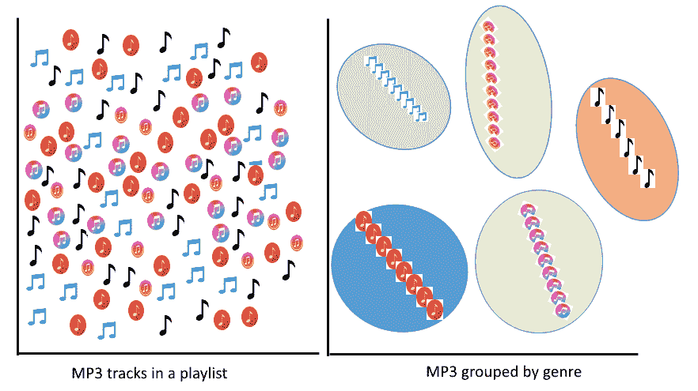
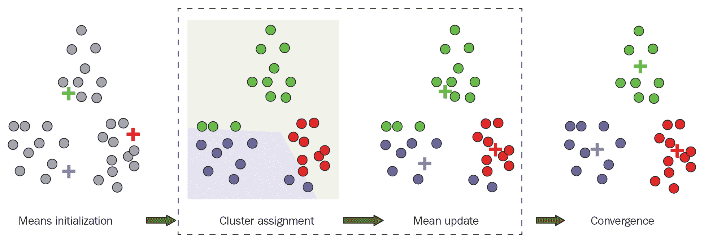
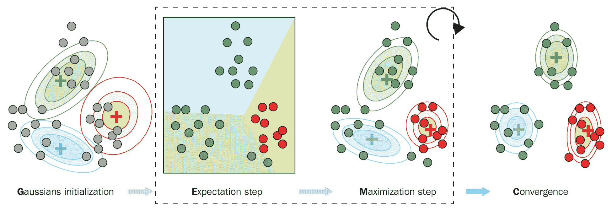
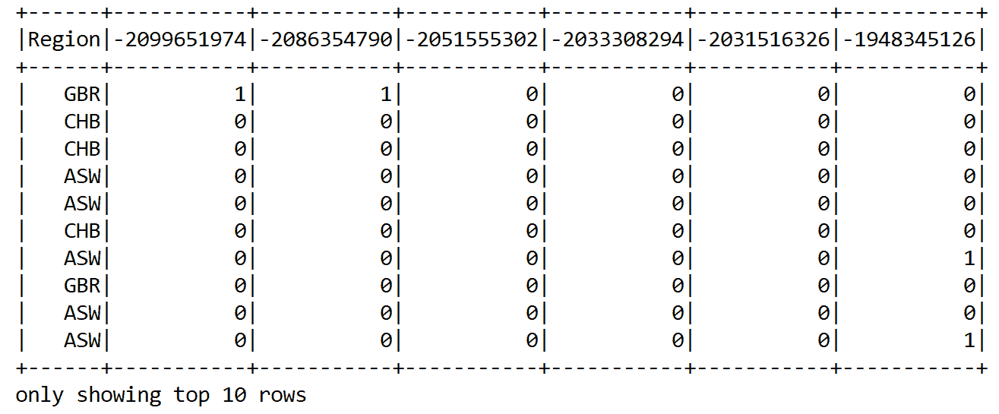
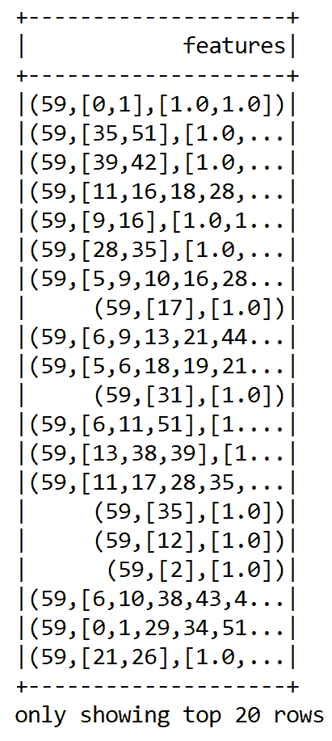
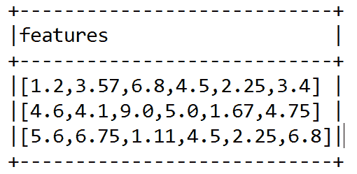
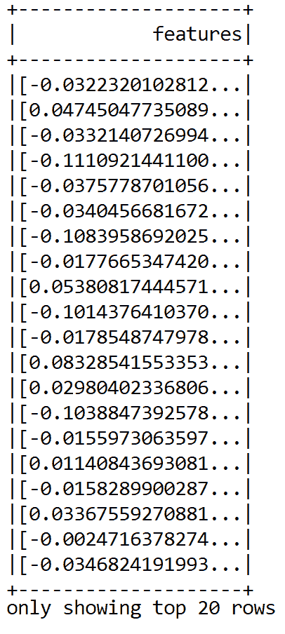

# Scala 支持降维和聚类

在前面的章节中，我们看到了几个监督学习的例子，包括分类和回归。我们对结构化和标记的数据执行监督学习技术。然而，正如我们之前提到的，随着云计算、物联网和社交媒体的兴起，非结构化数据正以前所未有的速度增长。总的来说，这些数据中有 80%以上是非结构化的，其中大部分是未标记的。

无监督学习技术，如聚类分析和维数约简，是数据驱动的研究和行业设置中发现非结构化数据集中隐藏结构的两个关键应用。为此提出了许多聚类算法，例如 k-means、平分 k-means 和高斯混合模型。然而，这些算法无法处理高维输入数据集，并且通常会遭遇*维数灾难*。因此，使用像**主成分分析** ( **PCA** )这样的算法来降低维度，并输入潜在数据，这是一种用于聚类数十亿个数据点的有用技术。

在这一章中，我们将使用一种遗传变异(一种基因组数据)来根据他们的主要祖先(也称为地理种族)对人群进行聚类。我们将评估聚类分析的结果，随后是降维技术，以避免维数灾难。

我们将在本章中讨论以下主题:

*   无监督学习概述
*   学习聚类-聚类地理种族
*   主成分分析降维
*   具有降维数据的聚类


# 技术要求

确保在您的机器上安装并配置了 Scala 2.11.x 和 Java 1.8.x。

这几章的代码文件可以在 GitHub 上找到:

[https://github . com/packt publishing/Machine-Learning-with-Scala-Quick-Start-Guide/tree/master/chapter 05](https://github.com/PacktPublishing/Machine-Learning-with-Scala-Quick-Start-Guide/tree/master/Chapter05)

看看下面的视频，看看代码是如何运行的:
[http://bit.ly/2ISwb3o](http://bit.ly/2ISwb3o)


# 无监督学习概述

在无监督学习中，输入集在训练阶段被提供给系统。与监督学习相比，输入对象没有用它们的类别来标记。虽然在分类分析中，训练数据集是有标签的，但当我们在现实世界中收集数据时，我们并不总是有这种优势，但我们仍然希望找到数据的重要值或隐藏结构。在 NeuralIPS' 2016 中，脸书人工智能首席执行官 Yann LeCun 介绍了*蛋糕类比*:

“如果智能是一块蛋糕，无监督学习就是蛋糕，监督学习就是蛋糕上的糖衣，强化学习就是蛋糕上的樱桃。我们知道如何制作糖衣和樱桃，但我们不知道如何制作蛋糕。”

为了创建这样的蛋糕，使用了几个无监督的学习任务，包括聚类、降维、异常检测和关联规则挖掘。如果无监督学习算法有助于在数据集中找到以前未知的模式，而不需要标签，我们可以为本章学习以下类比:

*   K-means 是一种流行的聚类分析算法，用于将相似的数据点分组在一起
*   PCA 等降维算法有助于在数据集中找到最相关的特征

在本章中，我们将通过一个实例来讨论这两种聚类分析技术。


# 聚类分析

聚类分析和降维是无监督学习的两个最流行的例子，我们将在本章中通过例子来讨论。假设你的电脑或智能手机里有大量合法的 MP3 文件。在这种情况下，如果您不能直接访问歌曲的元数据，您怎么可能将歌曲分组在一起呢？

一种可能的方法是混合各种 ML 技术，但是集群通常是最好的解决方案。这是因为我们可以开发一个聚类模型，以便自动对相似的歌曲进行分组，并将其组织到您最喜欢的类别中，如乡村、说唱或摇滚。

虽然数据点没有被标注，但是我们仍然可以进行必要的特征工程，将相似的对象分组在一起，这就是通常所说的聚类。

聚类是指基于某些相似性度量分组在一起的数据点的集合。

然而，这对一个人类来说并不容易。取而代之的是，标准方法是定义两个对象之间的相似性度量，然后寻找彼此之间比与其他聚类中的对象更相似的任何对象聚类。一旦我们完成了数据点(即 MP3 文件)的聚类并完成了验证，我们就知道了数据的模式(即哪种类型的 MP3 文件属于哪个组)。

左手边的示意图显示了一个播放列表中的所有 **MP3 曲目，这些曲目是分散的。右侧部分显示了 MP3 是如何基于流派进行分组的:**




# 聚类分析算法

聚类算法的目标是将一组相似的未标记数据点组合在一起，以发现潜在的模式。以下是一些已经提出并用于聚类分析的算法:

*   k 均值
*   平分 k-均值
*   **高斯混合模型** ( **GMM** )
*   **幂迭代聚类** ( **PIC** )
*   **潜狄氏分配** ( **LDA** )
*   流式 k 均值算法

K-means，平分 k-means 和 GMM 是最广泛使用的。我们将详细介绍它们，以展示快速开始的聚类分析。然而，我们还将看一个仅基于 k 均值的例子。


# 聚类分析的 k-均值方法

K-means 寻找固定数量 *k* 的聚类(即质心的数量)，将数据点划分为 *k* 个聚类，并通过保持质心尽可能小来将每个数据点分配到最近的聚类。

质心是代表群集中心的虚拟或真实位置。

K-means 通过最小化代价函数来计算数据点和 k 个聚类中心之间的距离(通常是欧几里德距离)，代价函数称为**聚类内平方和** ( **WCSS** )。k-means 算法通过在两个步骤之间交替进行:

*   **聚类分配步骤**:将每个数据点分配给其平均值具有最小平方欧几里德距离的聚类，产生最低的 WCSS
*   **质心更新步骤**:计算新聚类中观察值的新平均值，并将其用作新的质心

上述步骤可以用下图表示:



当质心已经稳定或者当预定义的迭代次数已经被迭代时，k-means 算法完成。虽然 k-means 使用欧几里德距离，但也有其他方法来计算距离，例如:

*   **切比雪夫距离**可用于仅考虑最显著的尺寸来测量距离
*   **汉明距离**算法可以识别两个字符串之间的差异
*   为了使距离度量尺度不偏离，**马氏距离**可用于归一化协方差矩阵
*   **曼哈顿距离**用于仅考虑轴对齐方向来测量距离
*   **闵可夫斯基距离**算法用于计算欧几里德距离、曼哈顿距离和切比雪夫距离
*   **哈弗线距离**用于测量球体上两点离该位置的大圆距离，即经度和纬度


# 平分 k-均值

平分 k-means 可以被认为是 k-means 和层次聚类的组合，它从单个聚类中的所有数据点开始。然后，它随机选取一个聚类进行分割，使用基本 k-means 返回两个子聚类。这被称为**二等分步骤**。

二分 k-means 算法基于一篇名为*的论文，该论文由 *Michael Steinbach 等人*， *KDD 文本挖掘研讨会，2000 年*撰写，已经被扩展以适合 Spark MLlib。*

然后，对分步骤迭代预定次数(通常由用户/开发者设置)，并且收集产生具有最高相似性的聚类的所有分裂。继续这些步骤，直到达到期望的集群数量。虽然平分 k-means 比常规 k-means 更快，但它会产生不同的聚类，因为平分 k-means 会随机初始化聚类。


# 高斯混合模型

GMM 是一个概率模型，它强烈假设所有的数据点都是由有限个参数未知的高斯分布混合生成的。因此，它也是一种基于分布的聚类算法，它基于一种期望最大化方法。

GMM 也可以被认为是广义的 k-均值，其中模型参数被迭代地优化以使模型更好地适合训练数据集。整个过程可以写成一个三步伪代码:

*   **目标函数**:使用**期望最大化** ( **EM** )计算并最大化对数似然
*   **EM 步骤**:该 EM 步骤由两个子步骤组成，称为期望和最大化:

    *   **步骤 E** :计算较近数据点的后验概率
    *   **步骤 M** :更新优化模型参数，拟合混合高斯模型
*   **分配**:在*步骤 E* 中执行软分配

前面的步骤可以非常简单地想象如下:




# 其他聚类分析算法

其他聚类算法包括 PIC，它用于根据给定的成对相似性(如边)对图中的节点进行聚类。LDA 经常用于文本聚类用例，例如主题建模。

另一方面，流式 k-means 类似于 k-means，但适用于流式数据。例如，当我们希望动态地估计聚类，以便在新数据到达时更新聚类分配时，使用流式 k-means 是一个很好的选择。有关示例的更详细讨论，感兴趣的读者可以参考以下链接:

*   基于 Spark ML 的聚类算法([https://spark.apache.org/docs/latest/ml-clustering.html](https://spark.apache.org/docs/latest/ml-clustering.html))
*   基于 Spark MLlib 的聚类算法([https://spark.apache.org/docs/latest/mllib-clustering.html](https://spark.apache.org/docs/latest/mllib-clustering.html))


# 通过实例进行聚类分析

聚类分析中最重要的任务之一是分析基因组图谱以将个体归属于特定的种族群体，或者分析疾病易感性的核苷酸单倍型。来自亚洲、欧洲、非洲和美洲的人类祖先可以根据他们的基因组数据来区分。研究表明，Y 染色体谱系可以进行地理定位，这为人类基因型的人类等位基因聚类提供了证据。根据国家癌症研究所([https://www . Cancer . gov/publications/dictionary/genetics-dictionary/def/genetic-variant](https://www.cancer.gov/publications/dictionaries/genetics-dictionary/def/genetic-variant)):

"Genetic variants are an alteration in the most common DNA nucleotide sequence. The term variant can be used to describe an alteration that may be benign, pathogenic, or of unknown significance. The term variant is increasingly being used in place of the term mutation."

更好地理解遗传变异有助于我们找到相关的人群，识别易患常见病的患者，并解决罕见疾病。简而言之，这个想法是基于他们的基因变异来聚集地理上的种族群体。然而，在进一步深入之前，让我们先了解一下数据。


# 数据集的描述

来自 1000 个基因组项目的数据是人类基因变异的一个大目录。该项目旨在确定被研究人群中频率超过 1%的遗传变异。1000 个基因组项目的第三阶段于 2014 年 9 月完成，涵盖了来自 26 个群体的 2504 个个体和 844 亿个遗传变异体。根据优势祖先，种群样本分为五个超种群组:

*   东亚(CHB、JPT、CHS、CDX 和 KHV)
*   欧洲(CEU、TSI、FIN、GBR 和 IBS)
*   非洲(YRI、LWK、GWD、MSL、ESN、ASW 和 ACB)
*   美国(MXL、PUR、CLM 和 PEL)
*   南亚(GIH、PJL、BEB、斯图和国际电联)

每个基因型包含 23 条染色体和一个包含样本和群体信息的独立面板文件。**变体调用格式** ( **VCF** )中的数据以及面板文件可以从[ftp://ftp.1000genomes.ebi.ac.uk/vol1/ftp/release/20130502/](ftp://ftp.1000genomes.ebi.ac.uk/vol1/ftp/release/20130502/)下载。


# 准备编程环境

由于 1，000 基因组计划的第三版贡献了大约 820 GB 的数据，因此需要使用可扩展的软件和硬件来处理它们。为此，我们将使用由以下组件组成的软件堆栈:

*   **ADAM** :这可以用来实现支持 VCF 文件格式的可扩展基因组数据分析平台，这样我们就可以将基于基因型的 RDD 转换成 Spark 数据框架。
*   **苏打水** : H20 是一个机器学习的 AI 平台，是一个基于 web 的数据处理 UI，支持 Java、Python、r 等编程语言，简而言之，苏打水等于 H2O 加火花。
*   基于 Spark-ML 的 k-means 被训练用于聚类分析。

对于这个例子，我们需要使用多种技术和软件栈，比如 Spark、H2O 和 Adam。在使用 H20 之前，请确保您的笔记本电脑至少有 16 GB 内存和足够的存储空间。我将把这个解决方案作为一个 Maven 项目来开发。

让我们为 Maven 友好的项目定义`pom.xml`文件上的属性标签:

```
<properties>
        <spark.version>2.4.0</spark.version>
        <scala.version>2.11.7</scala.version>
        <h2o.version>3.22.1.1</h2o.version>
        <sparklingwater.version>2.4.1</sparklingwater.version>
        <adam.version>0.23.0</adam.version>
</properties>
```

一旦您在 Eclipse 上创建了一个 Maven 项目(从 IDE 或者使用`mvn install`命令),所有需要的依赖项都将被下载！


# 聚集地理种族

24 个 VCF 文件贡献了大约 820 GB 的数据，这将带来巨大的计算挑战。为了克服这一点，使用最小染色体 y 的遗传变异。VCF 文件的大小约为 160 MB。让我们从创建`SparkSession`开始:

```
val spark:SparkSession = SparkSession
           .builder()
            .appName("PopStrat")
             .master("local[*]")
              .config("spark.sql.warehouse.dir", "temp/") 
               .getOrCreate()
```

现在，让我们向 Spark 展示 VCF 和面板文件的路径:

```
val genotypeFile = "Downloads/ALL.chr22.phase3_shapeit2_mvncall_integrated_v5a.20130502.genotypes.vcf"
val panelFile = "Downloads/integrated_call_samples_v3.20130502.ALL.panel"
```

我们使用 Spark 处理面板文件，以访问目标人群数据并识别人群。首先，我们创建一组我们想要形成集群的`populations`:

```
val populations = Set("FIN", "GBR", "ASW", "CHB", "CLM")
```

然后，我们需要在样本 ID 和给定总体之间创建一个映射，以便我们可以过滤掉我们不感兴趣的样本:

```
def extract(file: String, filter: (String, String) => Boolean): Map[String, String] = {
      Source
        .fromFile(file)
        .getLines()
        .map(line => {
          val tokens = line.split(Array('\t', ' ')).toList
          tokens(0) -> tokens(1)
        })
        .toMap
        .filter(tuple => filter(tuple._1, tuple._2))
    }

val panel: Map[String, String] = extract(
      panelFile,(sampleID: String, pop: String) => populations.contains(pop))
```

面板文件生成所有个人、人群、种族、超人群和性别的样本 ID:


在[FTP://FTP . 1000 genomes . ebi . AC . uk/vol 1/FTP/release/2013 05 02/integrated _ call _ samples _ v 3.2013 05 02 . all . panel](ftp://ftp.1000genomes.ebi.ac.uk/vol1/ftp/release/20130502/integrated_call_samples_v3.20130502.ALL.panel)查看面板文件详情。

然后，加载 ADAM 基因型并过滤基因型，以便只留下我们感兴趣的群体中的那些基因型:

```
val allGenotypes: RDD[Genotype] = sc.loadGenotypes(genotypeFile).rdd
val genotypes: RDD[Genotype] = allGenotypes.filter(genotype => {
      panel.contains(genotype.getSampleId)
    })
```

接下来，将`Genotype`对象转换成我们自己的`SampleVariant`对象以节省内存。然后，`genotype`对象被转换成包含需要进一步处理的数据的`SampleVariant`对象:

*   **样品 ID** :唯一标识特定样品
*   **变体 ID** :唯一识别特定的遗传变体
*   **备选等位基因计数**:当样本不同于参考基因组时需要

准备一个`SampleVariant`的签名如下所示，它采用`sampleID`、`variationId`和`alternateCount`对象:

```
// Convert the Genotype objects to our own SampleVariant objects to try and conserve memory
case class SampleVariant(sampleId: String, variantId: Int, alternateCount: Int)
```

然后，我们必须从基因型文件中找到`variantID`。`varitantId`是一个字符串类型，由名称和染色体中的开始和结束位置组成:

```
def variantId(genotype: Genotype): String = {
      val name = genotype.getVariant.getContigName
      val start = genotype.getVariant.getStart
      val end = genotype.getVariant.getEnd
      s"$name:$start:$end"
    }
```

一旦我们有了`variantID`，我们就应该寻找`alternateCount`。在基因型文件中，存在等位基因参考的对象将是基因替代:

```
def alternateCount(genotype: Genotype): Int = {
        genotype.getAlleles.asScala.count(_ != GenotypeAllele.REF)
    }
```

最后，我们将构造一个`SampleVariant`对象。为此，我们需要实习样品 id，因为它们会在 VCF 文件中重复出现:

```
def toVariant(genotype: Genotype): SampleVariant = {
      new SampleVariant(genotype.getSampleId.intern(),
        variantId(genotype).hashCode(),
        alternateCount(genotype))
    }
```

现在，我们需要的是准备`variantsRDD`。首先，我们必须按样本 ID 对变量进行分组，以便我们可以逐个样本地处理变量。然后，我们可以得到样本的总数，用于查找某些样本中缺失的变体。最后，我们必须按变体 ID 对变体进行分组，并过滤掉一些样本中缺失的变体:

```
val variantsRDD: RDD[SampleVariant] = genotypes.map(toVariant)
val variantsBySampleId: RDD[(String, Iterable[SampleVariant])] = variantsRDD.groupBy(_.sampleId)
val sampleCount: Long = variantsBySampleId.count()

println("Found " + sampleCount + " samples")
val variantsByVariantId: RDD[(Int, Iterable[SampleVariant])] =
      variantsRDD.groupBy(_.variantId).filter {
        case (_, sampleVariants) => sampleVariants.size == sampleCount
      }
```

现在，让我们用交替计数大于零的样本计数来映射`variantId`。然后，我们过滤掉不在我们期望的频率范围内的变体。这里的目标是减少数据集中的维数，以便更容易地训练模型:

```
val variantFrequencies: collection.Map[Int, Int] = variantsByVariantId
      .map {
        case (variantId, sampleVariants) =>
          (variantId, sampleVariants.count(_.alternateCount > 0))
      }
      .collectAsMap()
```

样本(或个体)总数已经确定。现在，在使用变量 id 对它们进行分组之前，我们可以过滤掉不太重要的变量。由于我们有超过 8400 万种基因变异，过滤将有助于我们应对维数灾难。

指定的范围是任意的，选择它是因为它包括合理数量的变量，但不会太多。更具体地说，对于每个变体，已经计算了交替等位基因的频率，并且排除了具有少于 12 个交替等位基因的变体，在分析中留下大约 3，000，000 个变体(对于 23 个染色体文件):

```
val permittedRange = inclusive(11, 11) // variants with less than 12 alternate alleles 
val filteredVariantsBySampleId: RDD[(String, Iterable[SampleVariant])] =
      variantsBySampleId.map {
        case (sampleId, sampleVariants) =>
          val filteredSampleVariants = sampleVariants.filter(
            variant =>
              permittedRange.contains(
                variantFrequencies.getOrElse(variant.variantId, -1)))
          (sampleId, filteredSampleVariants)
      }
```

一旦我们有了`filteredVariantsBySampleId`，我们需要对每个样本 ID 的变量进行排序。每个样本现在应该有相同数量的排序变量:

```
val sortedVariantsBySampleId: RDD[(String, Array[SampleVariant])] =
      filteredVariantsBySampleId.map {
        case (sampleId, variants) =>
          (sampleId, variants.toArray.sortBy(_.variantId))
      }
    println(s"Sorted by Sample ID RDD: " + sortedVariantsBySampleId.first())
```

RDD 中的所有项目现在应该在相同的订单中具有相同的变体。最后一项任务是使用`sortedVariantsBySampleId`构建包含区域和备选计数的行的 RDD:

```
val rowRDD: RDD[Row] = sortedVariantsBySampleId.map {
      case (sampleId, sortedVariants) =>
        val region: Array[String] = Array(panel.getOrElse(sampleId, "Unknown"))
        val alternateCounts: Array[Int] = sortedVariants.map(_.alternateCount)
        Row.fromSeq(region ++ alternateCounts)
    }
```

因此，我们可以只使用第一个来构造训练数据帧的头:

```
val header = StructType(
      Array(StructField("Region", StringType)) ++
        sortedVariantsBySampleId
        .first()
        ._2
        .map(variant => {
          StructField(variant.variantId.toString, IntegerType)
        }))
```

干得好！我们有我们的 RDD 和`StructType`头。现在，我们可以通过最小的调整/转换来玩 Spark 机器学习算法。


# 训练 k-means 算法

一旦我们有了`rowRDD`和头，我们需要使用头和`rowRDD`从变量中构造模式数据帧的行:

```
// Create the SchemaRDD from the header and rows and convert the SchemaRDD into a Spark DataFrame
val sqlContext = sparkSession.sqlContext
var schemaDF = sqlContext.createDataFrame(rowRDD, header)
schemaDF.show(10)
>>> 
```

前面的`show()`方法应该显示包含特性和`label`列(即`Region`)的训练数据集的快照:



在前面的数据帧中，只显示了几个`feature`列和`label`列，以便适合页面。由于训练是无人监督的，我们需要删除`label`列(即`Region`):

```
schemaDF = sqlContext.createDataFrame(rowRDD, header).drop("Region")
schemaDF.show(10)
>>> 
```

前面的`show()`方法显示了 k-means 的训练数据集的快照。注意没有`label`列(即`Region`):


在[第一章](33fe7442-ce44-4a18-bac6-0e08e9b1ae1e.xhtml)、*Scala 机器学习简介*和[第二章](f649db9f-aea9-4509-b9b8-e0b7d5fb726a.xhtml)、 *Scala 进行回归分析*中，我们看到 Spark 期望有两栏(`features`和`label`)进行监督训练。然而，对于无监督训练，只需要包含特征的单个列。由于我们删除了`label`列，现在我们需要将整个`variable`列合并成一个单独的`features`列。为此，我们将使用`VectorAssembler()`变压器。让我们选择要嵌入向量空间的列:

```
val featureCols = schemaDF.columns
```

然后，我们将通过指定输入列和输出列来实例化`VectorAssembler()`转换器:

```
// Using vector assembler to create feature vector 
val featureCols = schemaDF.columns
val assembler = new VectorAssembler()
    .setInputCols(featureCols)
    .setOutputCol("features")
 val assembleDF = assembler.transform(schemaDF).select("features")
```

现在，让我们看看 k 均值的特征向量是什么样的:

```
assembleDF.show()
```

前面一行显示了组合的向量，它们可以用作 k-means 模型的特征向量:



最后，我们准备训练 k-means 算法，并通过计算 **WCSS** 来评估聚类:

```
val kmeans = new KMeans().setK(5).setSeed(12345L)
val model = kmeans.fit(assembleDF)
 val WCSS = model.computeCost(assembleDF)
println("Within Set Sum of Squared Errors for k = 5 is " + WCSS)
 }
```

以下是`k = 5`的 **WCSS** 值:

```
Within Set Sum of Squared Errors for k = 5 is 59.34564329865
```

我们成功地将 k-means 应用于聚类遗传变异。然而，我们看到 WCSS 很高，因为 k-means 无法分离不同相关和高维特征之间的非线性。这是因为基因组测序数据集由于大量的遗传变异而非常高维。

在下一节中，我们将了解如何使用降维技术(如 PCA)在将输入数据输入 k-means 之前降低其维数，以获得更好的聚类质量。


# 降维

由于人类是视觉动物，理解高维数据集(甚至超过三维)是不可能的。即使对于机器(或者说，我们的机器学习算法)，也很难从相关和高维特征中建模非线性。在这里，降维技术是一个救星。

从统计学上来说，降维是减少随机变量的数量，以找到数据的低维表示，同时保留尽可能多的信息的过程**。**

在下图中可以直观地看到 PCA 的整个步骤:


PCA 和**奇异值分解** ( **SVD** )是最流行的降维算法。从技术上讲，PCA 是一种统计技术，用于强调变化并从数据集中提取最重要的模式(即特征)，这不仅对聚类有用，而且对分类和可视化也有用。


# 基于 Spark ML 的主成分分析

基于 Spark-ML 的 PCA 可用于将向量投影到低维空间，以在将遗传变异特征输入 k-means 模型之前降低其维数。以下示例显示了如何将 6D 特征向量从以下特征向量投影到 4D 主分量中:

```
val data = Array(
      Vectors.dense(1.2, 3.57, 6.8, 4.5, 2.25, 3.4),
      Vectors.dense(4.60, 4.10, 9.0, 5.0, 1.67, 4.75),
      Vectors.dense(5.60, 6.75, 1.11, 4.5, 2.25, 6.80))

val df = spark.createDataFrame(data.map(Tuple1.apply)).toDF("features")
df.show(false)
```

现在我们有了一个带有 6D 特征向量的特征数据帧，它可以被输入 PCA 模型:



首先，我们必须通过设置必要的参数来实例化 PCA 模型，如下所示:

```
val pca = new PCA()
      .setInputCol("features")
      .setOutputCol("pcaFeatures")
      .setK(4)
      .fit(df)
```

为了区分原始特征和基于主成分的特征，我们使用`setOutputCol()`方法将输出列名设置为`pcaFeatures`。然后，我们设置 PCA 的维数(即主成分数)。最后，我们拟合数据帧进行转换。一个模型可以从旧的数据中加载，但是对于`explainedVariance`将会有一个空的向量。现在，让我们展示由此产生的特性:

```
val result = pca.transform(df).select("features", "pcaFeatures")
result.show(false)
```

前面的代码使用 PCA 产生一个以 4D 特征向量作为主要成分的特征数据帧:


同样，我们可以将上一步组装好的数据帧(即`assembleDF`)和前五个主成分进行变换。不过，您可以调整主成分的数量。

最后，为了避免任何歧义，我们将`pcaFeatures`列重命名为`features`:

```
val pcaDF = pca.transform(assembleDF)
           .select("pcaFeatures")
           .withColumnRenamed("pcaFeatures", "features")
pcaDF.show()
```

前面的代码行显示了嵌入的向量，这些向量可以用作 k-means 模型的特征向量:



前面的屏幕截图显示了作为最重要功能的前五个主要组件。太好了——一切进展顺利。最后，我们准备训练 k-means 算法，并通过计算 WCSS 来评估聚类:

```
val kmeans = new KMeans().setK(5).setSeed(12345L)
val model = kmeans.fit(pcaDF)
 val WCSS = model.computeCost(pcaDF)
println("Within Set Sum of Squared Errors for k = 5 is " + WCSS)
    }
```

这一次，WCSS 略低(与之前的值`59.34564329865`相比):

```
Within Set Sum of Squared Errors for k = 5 is 52.712937492025276
```

通常，我们随机设置`k`(即`5`)的数量，并计算 WCSS。然而，通过这种方式，我们不能总是设置最佳的集群数量。为了找到一个最佳值，研究人员提出了两种技术，称为肘方法和轮廓分析，我们将在下面的小节中讨论。


# 确定最佳聚类数

有时，在开始训练之前天真地假设聚类数可能不是一个好主意。如果假设与最佳聚类数相差太远，模型的性能会很差，因为会引入过拟合或欠拟合问题。因此，确定最佳聚类的数量是一个单独的优化问题。有两种流行的技术可以解决这个问题:

*   这种启发式方法，叫做**肘法**
*   **剪影分析**，观察预测簇之间的间隔距离


# 肘法

我们首先将`k`的值设置为`2`，并通过增加`k`和观察 WCSS 的值在相同的数据集上运行 k-means 算法。正如所预料的那样，在某个时刻，成本函数(即 WCSS 值)会出现急剧下降。然而，在大幅下跌后，随着`k`值的增加，WCSS 的值变得微不足道。正如肘法所建议的，我们可以在 WCSS 最后一次大跌后，挑选出`k`的最优值:

```
val iterations = 20
    for (k <- 2 to iterations) {
      // Trains a k-means model.
      val kmeans = new KMeans().setK(k).setSeed(12345L)
      val model = kmeans.fit(pcaDF)

// Evaluate clustering by computing Within Set Sum of Squared Errors.
val WCSS = model.computeCost(pcaDF)
println("Within Set Sum of Squared Errors for k = " + k + " is " + WCSS)
    }
```

现在，让我们看看不同数量的集群的 WCSS 值，例如在`2`和`20`之间:

```
Within Set Sum of Squared Errors for k = 2 is 135.0048361804504
Within Set Sum of Squared Errors for k = 3 is 90.95271589232344
...
Within Set Sum of Squared Errors for k = 19 is 11.505990055606803
Within Set Sum of Squared Errors for k = 20 is 12.26634441065655
```

如前面的代码所示，我们计算了成本函数 WCSS，作为 k-means 算法的聚类数的函数，并将其应用于所选人群的 Y 染色体遗传变异。可以观察到，当`k = 5`时出现大的下降(尽管这不是剧烈的下降)。因此，我们选择的集群数量为 10。


# 剪影分析

通过观察预测聚类之间的分离距离来分析轮廓。绘制轮廓图将显示数据点与其相邻聚类之间的距离，然后我们可以直观地检查多个聚类，以便相似的数据点得到很好的分离。

用于测量聚类质量的轮廓分数具有[-1，1]的范围。通过计算轮廓得分来评估聚类质量:

```
val evaluator = new ClusteringEvaluator()
for (k <- 2 to 20 by 1) {
      val kmeans = new KMeans().setK(k).setSeed(12345L)
      val model = kmeans.fit(pcaDF)
      val transformedDF = model.transform(pcaDF)
      val score = evaluator.evaluate(transformedDF)
      println("Silhouette with squared Euclidean distance for k = " + k + " is " + score)
    }
```

我们得到以下输出:

```
Silhouette with squared Euclidean distance for k = 2 is 0.9175803927739566
Silhouette with squared Euclidean distance for k = 3 is 0.8288633816548874
....
Silhouette with squared Euclidean distance for k = 19 is 0.5327466913746908
Silhouette with squared Euclidean distance for k = 20 is 0.45336547054142284
```

如前面代码所示，剪影的高度值是用`k = 2`生成的，也就是`0.9175803927739566`。然而，这表明遗传变异应该分为两组。肘法建议`k = 5`为最佳聚类数。
让我们使用平方欧几里德距离找出轮廓，如下面的代码块所示:

`k = 2`的平方欧几里德距离的轮廓是`0.9175803927739566`。

已经发现，对分 k-means 算法可以为数据点产生更好的聚类分配，收敛到全局最小值。另一方面，k-means 经常陷入局部极小值。请注意，根据机器的硬件配置和数据集的随机性，您可能会观察到上述参数的不同值。

感兴趣的读者也应该参考 https://spark.apache.org/docs/latest/mllib-clustering.html[的基于 Spark-MLlib 的聚类技术，以获得更多的见解。](https://spark.apache.org/docs/latest/mllib-clustering.html)

摘要

```
val kmeansOptimal = new KMeans().setK(2).setSeed(12345L)
val modelOptimal = kmeansOptimal.fit(pcaDF)

// Making predictions
val predictionsOptimalDF = modelOptimal.transform(pcaDF)
predictionsOptimalDF.show()    

// Evaluate clustering by computing Silhouette score
val evaluatorOptimal = new ClusteringEvaluator()
val silhouette = evaluatorOptimal.evaluate(predictionsOptimalDF)
println(s"Silhouette with squared Euclidean distance = $silhouette")
```

在这一章中，我们讨论了一些聚类分析技术，如 k-均值、二分 k-均值和 GMM。我们看到了一个循序渐进的例子，展示了如何根据基因变异对种族进行分类。特别是，我们使用主成分分析进行降维，使用 k-means 进行聚类，使用 H2O 和亚当处理大规模基因组数据集。最后，我们学习了寻找最佳聚类数的肘方法和剪影方法。

It has been found that the bisecting k-means algorithm can result in better cluster assignment for data points, converging to the global minima. On the other hand, k-means often gets stuck in the local minima. Please note that you might observe different values of the preceding parameters depending on your machine's hardware configuration and the random nature of the dataset.

集群是大多数数据驱动应用的关键。读者可以尝试在更高维的数据集上应用聚类算法，如基因表达或 miRNA 表达，以聚类相似和相关的基因。一个很好的资源是基因表达癌症 RNA-Seq 数据集，它是开源的。该数据集可以从 UCI 机器学习知识库下载，网址为[https://archive . ics . UCI . edu/ml/datasets/gene+expression+cancer+RNA-Seq](https://archive.ics.uci.edu/ml/datasets/gene+expression+cancer+RNA-Seq)。


# 在下一章，我们将讨论推荐系统中基于项目的协同过滤方法。我们将学习如何开发图书推荐系统。技术上，它将是一个基于模型的推荐引擎，有 Scala 和 Spark。我们将看到如何在 ALS 和矩阵分解之间进行互操作。

In this chapter, we discussed some clustering analysis techniques, such as k-means, bisecting k-means, and GMM. We saw a step-by-step example of how to cluster ethnic groups based on their genetic variants. In particular, we used the PCA for dimensionality reduction, k-means for clustering, and H2O and ADAM for handling large-scale genomics datasets. Finally, we learned about the elbow and silhouette methods for finding the optimal number of clusters.

Clustering is the key to most data-driven applications. Readers can try to apply clustering algorithms on higher-dimensional datasets, such as gene expression or miRNA expression, in order to cluster similar and correlated genes. A great resource is the gene expression cancer RNA-Seq dataset, which is open source. This dataset can be downloaded from the UCI machine learning repository at [https://archive.ics.uci.edu/ml/datasets/gene+expression+cancer+RNA-Seq](https://archive.ics.uci.edu/ml/datasets/gene+expression+cancer+RNA-Seq).

In the next chapter, we will discuss item-based collaborative filtering approaches for the recommender system. We'll learn how to develop a book recommendation system. Technically, it will be a model-based recommendation engine with Scala and Spark. We will see how we can interoperate between ALS and matrix factorization.