<title>Scala for Recommender System</title> 

# 用于推荐系统的 Scala

在这一章中，我们将学习开发推荐系统的不同方法。然后我们将学习如何开发图书推荐系统。在技术上，它将是一个基于模型的推荐引擎，基于**交替最小二乘** ( **ALS** )和矩阵分解算法。我们将在 Scala 中使用这些算法的基于 Spark MLlib 的实现。简而言之，我们将在本章中学习以下主题:

*   推荐系统概述
*   基于相似性的推荐系统
*   基于内容的推荐系统
*   协作方法
*   混合推荐系统
*   开发基于模型的图书推荐系统

<title>Technical requirements</title> 

# 技术要求

确保在您的机器上安装并配置了 Scala 2.11.x 和 Java 1.8.x。

这几章的代码文件可以在 GitHub 上找到:

[https://github . com/packt publishing/Machine-Learning-with-Scala-Quick-Start-Guide/tree/master/chapter 06](https://github.com/PacktPublishing/Machine-Learning-with-Scala-Quick-Start-Guide/tree/master/Chapter06)

看看下面的视频，看看代码是如何运行的:
[http://bit.ly/2UQTFHs](http://bit.ly/2UQTFHs)

<title>Overview of recommendation systems</title> 

# 推荐系统概述

推荐系统是一种信息过滤方法，它预测用户对项目的评价。那么预测评级高的项目将被推荐给用户。推荐系统现在或多或少地被用于推荐电影、音乐、新闻、书籍、研究文章、产品、视频、书籍、新闻、脸书朋友、餐馆、路线、搜索查询、社交标签、产品、合作者、笑话、餐馆、服装、金融服务、Twitter 页面、Android/iOS 应用、酒店、人寿保险，甚至在线约会网站中的合作伙伴。

<title>Types of recommender systems</title> 

# 推荐系统的类型

有几种方法可以开发推荐引擎，这些引擎通常会生成一个推荐列表，例如基于相似性、基于内容、协作和混合的推荐系统，如下图所示:

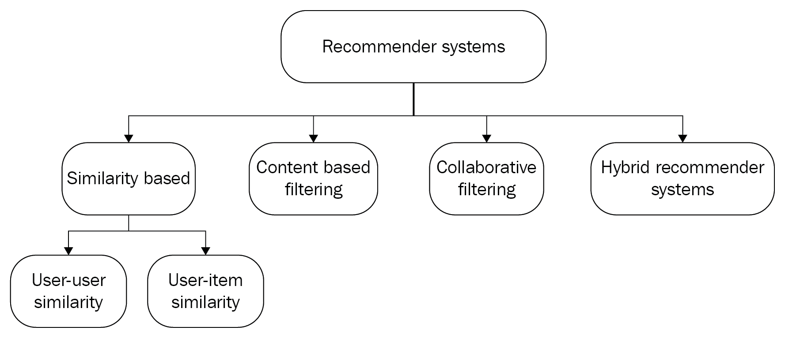

我们将讨论基于相似性、基于内容、协作和混合的推荐系统。然后根据它们的优缺点，我们将看到一个展示如何开发图书推荐系统的实践示例。

<title>Similarity-based recommender systems</title> 

# 基于相似性的推荐系统

有两种主要类型的基于相似性的方法:**用户-用户相似性**和**用户-项目相似性**。这些可以用来建立推荐系统。为了使用用户-用户项目相似性方法，首先构建用户-用户相似性矩阵。然后，它会挑选相似用户已经喜欢的商品，最后，它会为特定用户推荐商品。

假设我们要开发一个图书推荐系统:自然会有很多图书用户(读者)和图书列表。为简洁起见，我们挑选以下机器学习相关书籍作为代表性书籍，以飨读者:


然后，基于用户-用户相似性的推荐系统将基于使用一些相似性度量技术的相似性度量来推荐书籍。例如，余弦相似度计算如下:


在上式中， *A* 和 *B* 代表两个用户。如果相似性阈值大于或等于定义的阈值，用户 *A* 和 *B* 将很可能具有相似的偏好:

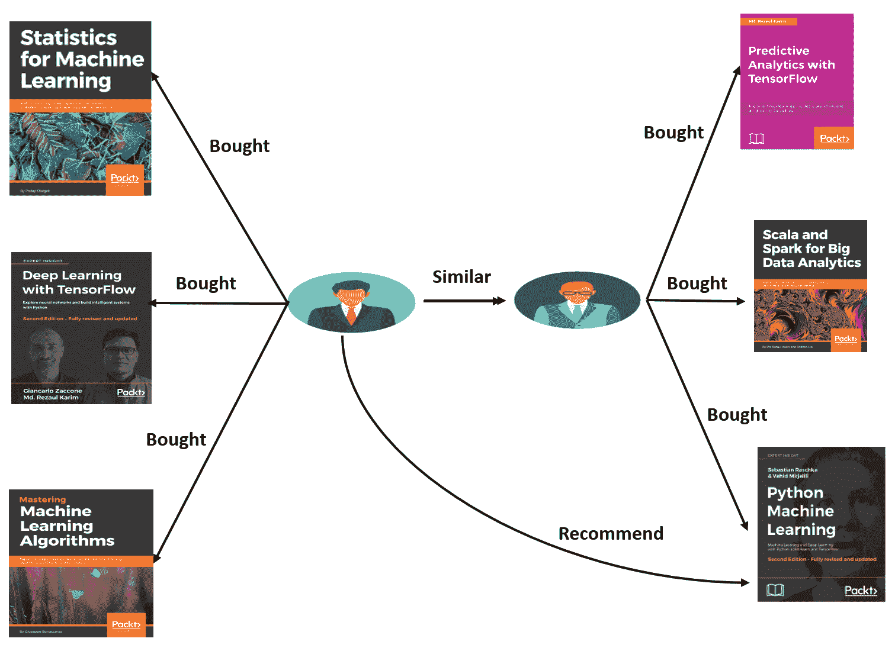

然而，基于用户-用户相似性的推荐系统并不健壮。这有几个原因:

*   用户的偏好和口味通常会随着时间而改变
*   它们在计算上非常昂贵，因为许多情况下的相似性计算来自非常稀疏的矩阵计算

亚马逊和 YouTube 有数百万订阅用户，所以你创建的任何用户-用户效用矩阵都是非常稀疏的。一种解决方法是使用项目-项目相似性，它还会计算项目-项目效用矩阵，查找相似的项目，并最终推荐相似的项目，如下图所示:

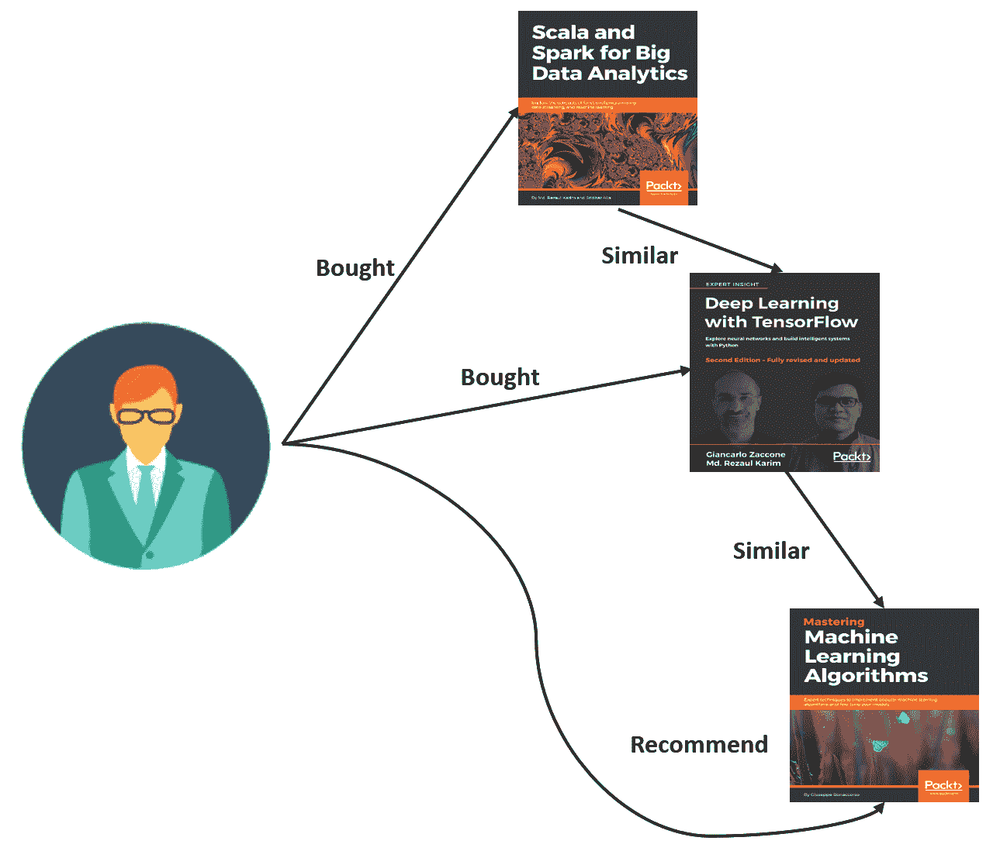

与用户-用户相似性方法相比，这种方法有一个优点，即通常在初始阶段之后，对给定项目的评级不会发生非常显著的变化。让我们以《百页机器学习书*为例，这本书在亚马逊上已经获得了非常好的评价，尽管它才发布了几个月。因此，即使在接下来的几个月里，一些人给它较低的评级，它的评级在最初阶段后也不会有太大变化。*

有趣的是，这也是一种假设，即评级不会随着时间的推移而发生非常显著的变化。然而，这种假设在用户数量远高于项目数量的情况下非常适用。

<title>Content-based filtering approaches</title> 

# 基于内容的过滤方法

基于内容的过滤方法基于经典的机器学习技术，例如分类或回归。这种类型的系统学习如何表示一个项目(书) *I [j]* 和一个用户 *U [i]* 。然后，在将它们组合为特征向量之前，为*I[j]和*U[I]创建单独的特征矩阵。然后，将特征向量送入分类或回归模型进行训练。这样 ML 模型就生成了标签*L[ij]，有趣的是用户*U[I]对物品*I[j]给出的对应评分:*****

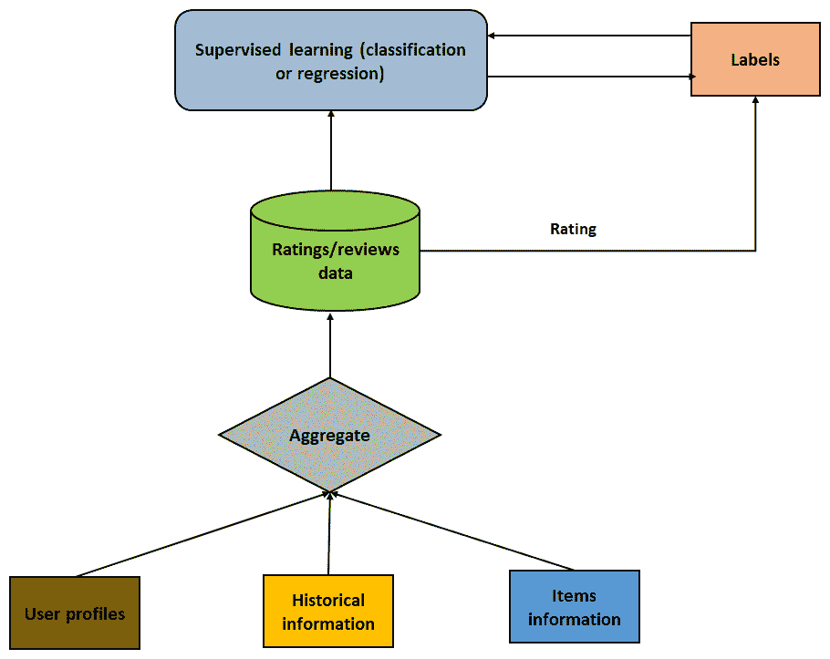

一般警告是，应创建对评级有直接影响的特征(**标签**)。这意味着特性应该尽可能地相互依赖，以避免相关性。

<title>Collaborative filtering approaches</title> 

# 协同过滤方法

协同过滤的思想是，当我们有很多用户喜欢一些项目时，那么那些项目可以推荐给还没有看过的用户。假设我们有四个读者和四本书，如下图所示:

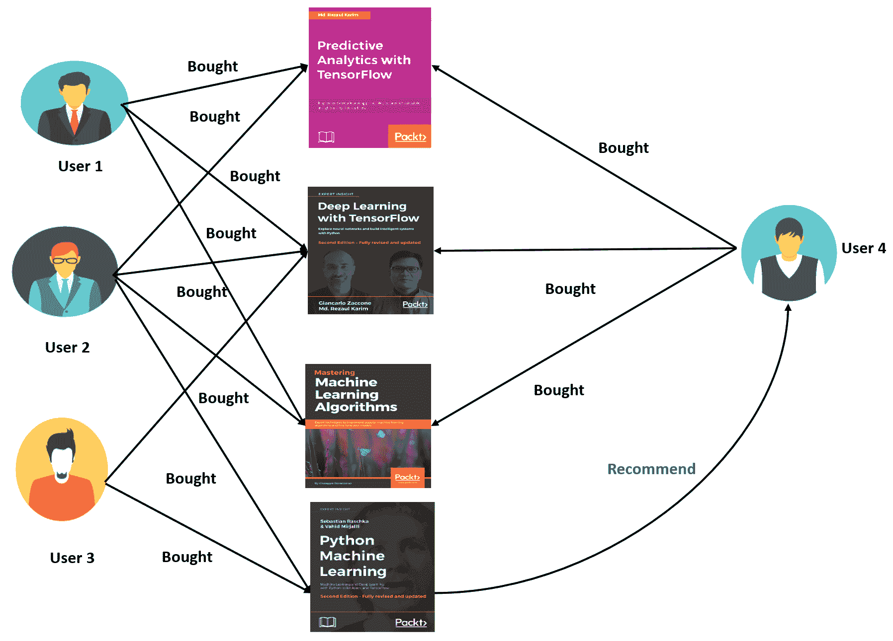

还有，假设这些用户都买了物品 1(即**用 TensorFlow** 预测分析)和物品 2(即**用 TensorFlow** 深度学习)。现在，假设**用户 4** 已经阅读了物品 1、2 和 3，并且说**用户 1** 和**用户 2** 都购买了物品 3(即**掌握机器学习算法**)。不过由于**用户 4** 还没有看到第 4 项(也就是 **Python 机器学习**)，所以**用户 3** 可以推荐给他。

因此，基本的假设是，以前推荐过一个项目的用户将来也会推荐。如果这个假设不再成立，那么协同过滤推荐系统就无法建立。这可能是协同过滤方法遭受冷启动、可伸缩性和稀疏性问题的原因。

**Cold start**: Collaborative filtering approaches can get stuck and cannot make recommendation especially when a large amount of data about users is missing in the uer-item matrix.<title>The utility matrix</title> 

# 效用矩阵

假设我们有一组用户对一套图书表现出偏好。用户对一本书的偏好越高，评分就越高，在 1 到 10 之间。让我们用一个矩阵来理解这个问题，矩阵中的行代表用户，列代表书籍:

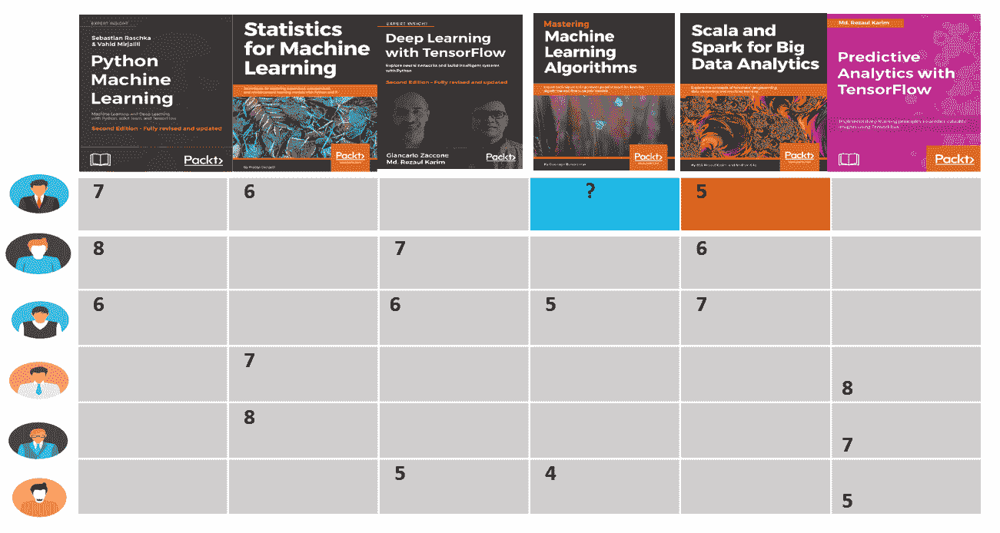

让我们假设评级范围从 1 到 10，10 是最高级别的偏好。然后，在前面的表格中，用户(第 1 行)给第一本书(第 1 列)评分为 **7** ，给第二本书评分为 **6** 。此外，有许多空单元格表明用户没有给这些书任何评级。

这个矩阵通常被称为用户-项目或效用矩阵，其中每行代表一个用户，每列代表一个项目(书籍)，而一个单元格代表用户对该项目的相应评级。

实际上，效用矩阵*非常稀疏*，因为大量单元是空的。原因是我们有如此多的项目，单个用户几乎不可能对所有项目进行评级。即使用户评价了 10%的项目，这个矩阵的其他 90%的单元仍然是空的。这些空单元格通常用 NaN 表示，这意味着不是一个数字，尽管在我们的效用矩阵例子中我们使用了**？**。这种稀疏性通常会造成计算的复杂性。我给你举个例子。

假设有 100 万用户( *n* )，只有 1 万项(电影， *m* )，就是 *10，000，000 * 10，000* 或者 *10 ^(11)* ，一个非常大的数字。现在，即使一个用户评价了 10 本书，这意味着给定评价的总数将是*10 * 100 万= 10 ⁷* 。这个矩阵的稀疏度可以计算如下:

*S [m] =空单元格数/单元格总数=(10^(10)-10⁷)/10^(10)= 0.9999*

这意味着 99.99%的单元格仍将是空的。

<title>Model-based book recommendation system</title> 

# 基于模型的图书推荐系统

在本节中，我们将展示如何使用 Spark MLlib 库开发基于模型的图书推荐系统。从这个链接下载书籍和相应的评分:[http://www2.informatik.uni-freiburg.de/~cziegler/BX/](http://www2.informatik.uni-freiburg.de/~cziegler/BX/)。有三个 CSV 文件:

*   `BX-Users.csv`:包含用户的人口统计数据，每个用户指定有用户 id(`User-ID`)。

*   `BX-Books.csv`:有`Book-Title`、`Book-Author`、`Year-Of-Publication`、`Publisher`等书籍相关信息。每本书都有一个国际标准书号。另外，给出了`Image-URL-S`、`Image-URL-M`和`Image-URL-L`。

*   `BX-Book-Ratings.csv`:包含`Book-Rating`栏指定的等级。评分等级从`1`到`10`(数值越高表示升值越大)，或者用`0`表示。

在进入编码部分之前，我们需要多了解一点矩阵分解技术，比如**奇异值分解** ( **SVD** )。SVD 可用于将条目和用户条目转换到同一个潜在空间，该空间表示用户和条目之间的交互。矩阵分解背后的基本原理是潜在特征代表用户如何对项目评分。

矩阵分解

因此，给定用户和项目的描述，这里的任务是预测用户将如何评价那些还没有被评价的项目。更正式地说，如果一个用户*U[I]喜欢 item *V [1]* ， *V [5]* ，以及 *V [7]* ，，那么任务就是推荐 item *V [j]* 到*


<title>Matrix factorization</title> 

# 一旦我们有了这样一个应用，这个想法就是每次我们收到新的数据，我们就把它更新到训练数据集，然后更新 ALS 训练得到的模型，这里使用了协同过滤的方法。为了处理用户手册效用矩阵，使用低秩矩阵分解算法:

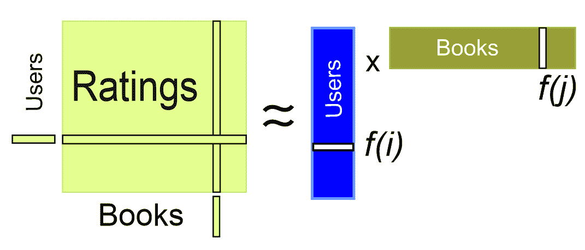

因为不是所有的书都被所有的用户评级，所以不是这个矩阵中的所有条目都是已知的。前一节中讨论的协作过滤方法是这个团体的救世主。那么，使用协同过滤，我们可以通过分解**用户因素(V)** 和**图书因素(V)** 来解决近似评级矩阵的优化问题，可以描述如下:

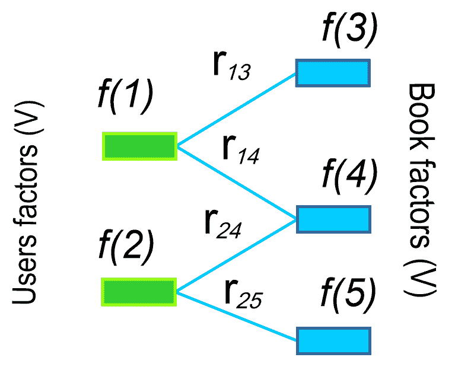

选择这两个矩阵，使得用户-书籍对的误差(在已知评级的情况下)最小化。ALS 算法首先用随机值(在我们的例子中，在 1 和 10 之间)填充用户矩阵，然后优化这些值，使误差最小化。然后，ALS 将图书矩阵保持为固定，并使用以下数学等式优化用户矩阵的值:


Spark MLlib 支持基于模型的协作过滤方法。在这种方法中，用户和项目由一小组潜在因素来描述，用于预测用户-项目效用矩阵的缺失条目。如前所述，ALS 算法可以通过迭代的方式学习这些潜在因素。ALS 算法接受六个参数，即`numBlocks`、`rank`、`iterations`、`lambda`、`implicitPrefs`和`alpha`。`numBlocks`是并行计算所需的块数。`rank`参数是潜在因素的数量。`iterations`参数是 ALS 收敛的迭代次数。`lambda`参数表示正则化参数。`implicitPrefs`参数意味着我们希望使用来自其他用户的明确反馈，最后，`alpha`是偏好观察的基线置信度。

探索性分析

在这一小节中，我们将对评级、图书和相关统计数据进行一些探索性分析。这种分析将帮助我们更好地理解数据:

以下代码段显示了来自`BX-Books.csv`文件的书籍数据帧:

<title>Exploratory analysis</title> 

# 以下是输出:

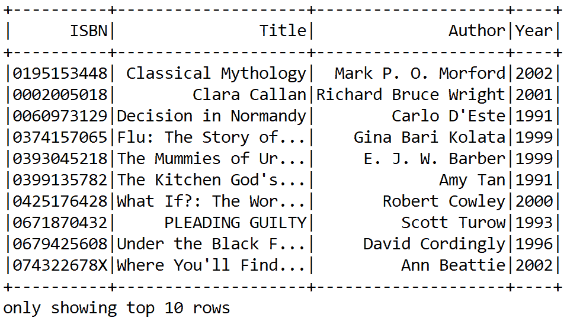

```
val ratigsFile = "data/BX-Book-Ratings.csv"
var ratingDF = spark.read.format("com.databricks.spark.csv")
      .option("delimiter", ";")
      .option("header", true)
      .load(ratigsFile)
```

让我们看看有多少不同的书:

```
/* Explore and query on books         */
val booksFile = "data/BX-Books.csv"
var bookDF = spark.read.format("com.databricks.spark.csv")
            .option("header", "true")
            .option("delimiter", ";")
            .load(booksFile)    
bookDF = bookDF.select(bookDF.col("ISBN"), 
                       bookDF.col("Book-Title"), 
                       bookDF.col("Book-Author"), 
                       bookDF.col("Year-Of-Publication"))

bookDF = bookDF.withColumnRenamed("Book-Title", "Title")
                .withColumnRenamed("Book-Author", "Author")
                .withColumnRenamed("Year-Of-Publication", "Year")

bookDF.show(10)
```

以下是输出:

这些信息对后面的案例很有价值，这样我们就可以知道有多少本书在评级数据集中缺少评级。要注册这两个数据集，我们可以使用以下代码:

通过创建一个临时视图作为内存中的表，这将有助于加快内存中的查询。让我们检查一下与收视率相关的统计数据。只需使用以下代码行:

```
val numDistinctBook = bookDF.select(bookDF.col("ISBN")).distinct().count()
println("Got " + numDistinctBook + " books") 
```

你应该找到`Got 1149780 ratings from 105283 users on 340556 books`。现在，让我们获得最高和最低评分，以及对一本书进行评分的用户数:

```
Got 271,379 books
```

前面的代码应该生成最高和最低评分，以及对一本书进行评分的用户数:

```
ratingsDF.createOrReplaceTempView("ratings")
moviesDF.createOrReplaceTempView("books")
```

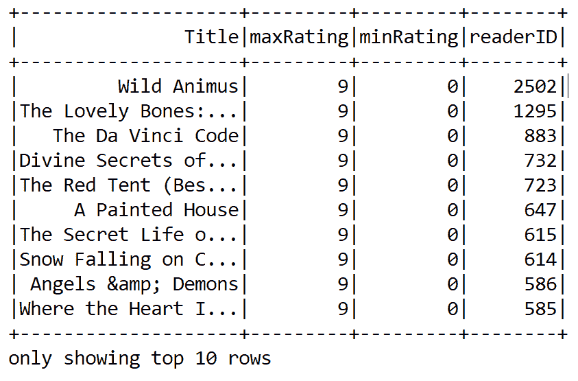

```
/* Explore and query ratings for books         */
val numRatings = ratingDF.count()
val numUsers = ratingDF.select(ratingDF.col("UserID")).distinct().count()
val numBooks = ratingDF.select(ratingDF.col("ISBN")).distinct().count()
println("Got " + numRatings + " ratings from " + numUsers + " users on " + numBooks + " books")
```

现在，为了获得进一步的洞察，我们需要了解更多关于用户及其评级的信息，这可以通过找到前十名最活跃的用户以及他们对某本书的评级次数来实现:

```
// Get the max, min ratings along with the count of users who have rated a book.    
val statDF = spark.sql("select books.Title, bookrates.maxRating, bookrates.minRating, bookrates.readerID "
      + "from(SELECT ratings.ISBN,max(ratings.Rating) as maxRating,"
      + "min(ratings.Rating) as minRating,count(distinct UserID) as readerID "
      + "FROM ratings group by ratings.ISBN) bookrates "
      + "join books on bookrates.ISBN=books.ISBN " + "order by bookrates.readerID desc")

    statDF.show(10)
```

前面几行代码应该显示前十个最活跃的用户以及他们给一本书评分的次数:

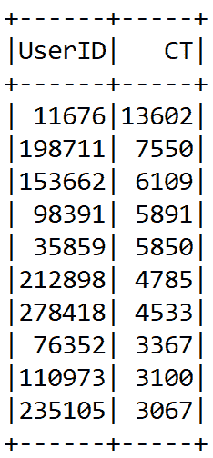

现在让我们来看看一个特定的用户，并找到用户`130554`评价高于`5`的书籍:

```
// Show the top 10 most-active users and how many times they rated a book
val mostActiveReaders = spark.sql("SELECT ratings.UserID, count(*) as CT from ratings "
      + "group by ratings.UserID order by CT desc limit 10")
mostActiveReaders.show()
```

如上所述，前面的代码行应该显示用户 130554 评分超过 5 分的所有电影的名称:

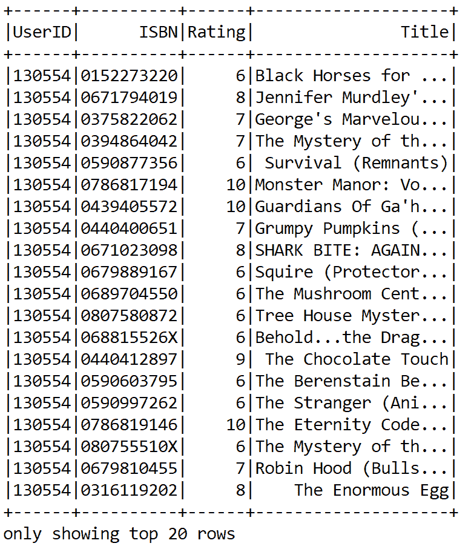

Now let's have a look at a particular user, and find the books that, say, user `130554` rated higher than `5`:

```
// Find the movies that user 130554 rated higher than 5
val ratingBySpecificReader = spark.sql(
      "SELECT ratings.UserID, ratings.ISBN,"
        + "ratings.Rating, books.Title FROM ratings JOIN books "
        + "ON books.ISBN=ratings.ISBN "
        + "WHERE ratings.UserID=130554 and ratings.Rating > 5")

ratingBySpecificReader.show(false)
```

As described, the preceding line of code should show the name of all the movies rated by user 130554 giving more than 5 ratings:

准备培训和测试评级数据

以下代码将 RDD 评级拆分为 RDD 培训数据(60%)和 RDD 测试数据(40%)。第二个参数(即`1357L`)是*种子*，通常用于再现性目的:

您将看到训练数据框架中有 689，144 个评级，测试数据框架中有 345，774 个评级。ALS 算法需要训练的评级 RDD。以下代码说明了使用 API 构建推荐模型的方法:

<title>Prepare training and test rating data</title> 

# `trainRatingsRDD`是一个评级 RDD，包含`UserID`、`ISBN`，以及我们在上一步中准备的训练数据集中的相应评级。类似地，我们从测试数据帧中准备了另一个 RDD:

基于`trainRatingsRDD`，我们通过添加最大迭代、块数、alpha、rank、lambda、seed 和隐式偏好来构建 ALS 用户模型。这种方法通常用于分析和预测特定用户的缺失评分:

```
val splits = ratingDF.randomSplit(Array(0.60, 0.40), 1357L)
val (trainingData, testData) = (splits(0), splits(1))

trainingData.cache
testData.cache

val numTrainingSample = trainingData.count()
val numTestSample = testData.count()
println("Training: " + numTrainingSample + " test: " + numTestSample) 
```

最后，我们迭代模型学习`10`次。通过这种设置，我们获得了良好的预测精度。建议读者应用超参数调整来找到这些参数的最佳值。为了评估模型的质量，我们计算**均方根误差** ( **RMSE** )。下面的代码计算在定型集的帮助下开发的模型的 RMSE 值:

```
val trainRatingsRDD = trainingData.rdd.map(row => {
      val userID = row.getString(0)
      val ISBN = row.getInt(1)
      val ratings = row.getString(2)
      Rating(userID.toInt, ISBN, ratings.toDouble)
    })
```

对于前面的设置，我们得到以下输出:

```
val testRatingsRDD = testData.rdd.map(row => {
      val userID = row.getString(0)
      val ISBN = row.getInt(1)
      val ratings = row.getString(2)
      Rating(userID.toInt, ISBN, ratings.toDouble)
    })
```

上述方法计算 RMSE 来评估模型。RMSE 越低，模型及其预测能力越好，如下所示:

```
val model : MatrixFactorizationModel = new ALS()
      .setIterations(10)
      .setBlocks(-1)
      .setAlpha(1.0)
      .setLambda(0.01)
      .setRank(25)
      .setSeed(1234579L)
      .setImplicitPrefs(false) // We want explicit feedback
      .run(trainRatingsRDD)
```

最后，我们来做一些针对特定用户的电影推荐。让我们来看看用户`276747`的十大图书预测:

```
var rmseTest = computeRmse(model, testRatingsRDD, true)
println("Test RMSE: = " + rmseTest) //Less is better
```

For the preceding setting, we get the following output:

```
Test RMSE: = 1.6867585251053991 
```

The preceding method computes the RMSE to evaluate the model. The lower the RMSE, the better the model and its prediction capability is, which goes as follows:

```
//Compute the RMSE to evaluate the model. Less the RMSE better the model and it's prediction capability. 
def computeRmse(model: MatrixFactorizationModel, ratingRDD: RDD[Rating], implicitPrefs: Boolean): Double =         {
    val predRatingRDD: RDD[Rating] = model.predict(ratingRDD.map(entry => (entry.user, entry.product)))
    val predictionsAndRatings = predRatingRDD.map {entry => ((entry.user, entry.product), entry.rating)}
                                .join(ratingRDD
                                .map(entry => ((entry.user, entry.product), entry.rating)))
                                .values    
    math.sqrt(predictionsAndRatings.map(x => (x._1 - x._2) * (x._1 - x._2)).mean()) // return MSE
          }
```

我们得到以下输出:

```
println("Recommendations: (ISBN, Rating)")
println("----------------------------------")
val recommendationsUser = model.recommendProducts(276747, 10)
recommendationsUser.map(rating => (rating.product, rating.rating)).foreach(println)
println("----------------------------------")
```

我们认为前面模型的性能可以进一步提高。然而，据我们所知，没有模型调整工具可用于基于 MLlib 的 ALS 算法。

感兴趣的读者应该参考[https://spark . Apache . org/docs/preview/ml-collaborative-filtering . html](https://spark.apache.org/docs/preview/ml-collaborative-filtering.html)了解更多关于调整基于 ML 的 ALS 模型的信息。

添加新的用户评级并做出新的预测

```
Recommendations: (ISBN => Rating)
 (1051401851,15.127044702142243)
 (2056910662,15.11531283195148)
 (1013412890,14.75898119158678)
 (603241602,14.53024153450836)
 (1868529062,14.180262929540024)
 (746990712,14.121654522195225)
 (1630827789,13.741728003481194)
 (1179316963,13.571754513473993)
 (505970947,13.506755847456258)
 (632523982,13.46591014905454)
 ----------------------------------
```

我们可以创建一个新用户 ID、图书的 ISBN 和上一步预测的评级的序列:

现在，我们将它们添加到用于训练推荐模型的数据中。为此，我们使用 Spark 的`union()`转换:

<title>Adding new user ratings and making new predictions</title> 

# 最后，我们使用之前选择的所有参数(当使用小数据集时)来训练 ALS 模型:

我们将需要重复，每次用户添加新的评级。理想情况下，我们将分批进行，而不是针对每个用户进入系统的每个评级。然后，我们可以再次为其他用户提供推荐，例如`276724`，之前他对书籍的评价缺失:

```
val new_user_ID = 300000 // new user ID randomly chosen

//The format of each line is (UserID, ISBN, Rating)
val new_user_ratings = Seq(
      (new_user_ID, 817930596, 15.127044702142243),
      (new_user_ID, 1149373895, 15.11531283195148),
      (new_user_ID, 1885291767, 14.75898119158678),
      (new_user_ID, 459716613, 14.53024153450836),
      (new_user_ID, 3362860, 14.180262929540024),
      (new_user_ID, 1178102612, 14.121654522195225),
      (new_user_ID, 158895996, 13.741728003481194),
      (new_user_ID, 1007741925, 13.571754513473993),
      (new_user_ID, 1033268461, 13.506755847456258),
      (new_user_ID, 651677816, 13.46591014905454))

val new_user_ratings_RDD = spark.sparkContext.parallelize(new_user_ratings)
val new_user_ratings_DF = spark.createDataFrame(new_user_ratings_RDD).toDF("UserID", "ISBN", "Rating")

val newRatingsRDD = new_user_ratings_DF.rdd.map(row => {
      val userId = row.getInt(0)
      val movieId = row.getInt(1)
      val ratings = row.getDouble(2)
      Rating(userId, movieId, ratings)
    }) 
```

Now we add them to the data we will use to train our recommender model. We use Spark's `union()` transformation for this:

```
val complete_data_with_new_ratings_RDD = trainRatingsRDD.union(newRatingsRDD)
```

Finally, we train the ALS model using all the parameters we selected before (when using the small dataset):

```
val newModel : MatrixFactorizationModel = new ALS()
      .setIterations(10)
      .setBlocks(-1)
      .setAlpha(1.0)
      .setLambda(0.01)
      .setRank(25)
      .setSeed(123457L)
      .setImplicitPrefs(false)
      .run(complete_data_with_new_ratings_RDD)
```

We will need to repeat that every time a user adds new ratings. Ideally, we will do this in batches, and not for every single rating that comes into the system for every user. Then we can again make recommendations for other users such as `276724`, whose ratings about books were missing previously:

```
// Making Predictions. Get the top 10 book predictions for user 276724
//Book recommendation for a specific user. Get the top 10 book predictions for reader 276747
println("Recommendations: (ISBN, Rating)")
println("----------------------------------")
val newPredictions = newModel.recommendProducts(276747, 10)
newPredictions.map(rating => (rating.product, rating.rating)).foreach(println)
println("----------------------------------")
```

以下是输出:

最后，我们计算 RMSE:

以下是输出:

摘要

```
Recommendations: (ISBN, Rating)
 ----------------------------------
 (1901261462,15.48152758068679)
 (1992983531,14.306018295431224)
 (1438448913,14.05457411015043)
 (2022242154,13.516608439192192)
 (817930596,13.487733919030019)
 (1079754533,12.991618591680165)
 (611897245,12.716161072778828)
 (11041460,12.44511878072316)
 (651596038,12.13345082904184)
 (1955775932,11.7254312955358)
 ----------------------------------
```

在这一章中，我们学习了推荐系统的不同方法，比如基于相似性的、基于内容的、协同过滤的和混合的。此外，我们讨论了这些方法的缺点。然后我们实现了一个端到端的图书推荐系统，这是一个基于模型的推荐，带有 Spark。我们还看到了如何在 ALS 和矩阵分解之间进行互操作，以有效地处理效用矩阵。

```
var newrmseTest = computeRmse(newModel, testRDD, true)
println("Test RMSE: = " + newrmseTest) //Less is better
```

下一章我们将讲解 ML 新兴分支之一的**d**eep 学习 ( **DL** )的一些基本概念。我们将简要讨论一些最著名和最广泛使用的神经网络结构。然后，我们将看看 DL 框架和库的各种特性。

```
Test RMSE: = 4.892434600794704
```

<title>Summary</title> 

# 然后，我们将看到如何准备编程环境，然后继续使用一些开源 DL 库进行编码，例如**deep learning 4j**(**DL4J**)。最后，我们将使用两种神经网络架构来解决一个现实生活中的问题，这两种架构分别称为**多层感知器** ( **MLP** )和**长短期记忆** ( **LSTM** )。

In this chapter, we have learned different approaches for recommender systems, such as similarity-based, content-based, collaborative filtering, and hybrid. Additionally, we discussed the downsides of these approaches. Then we implemented an end-to-end book recommendation system, which is a model-based recommendation with Spark. We have also seen how to interoperate between ALS and matrix factorization to efficiently handle a utility matrix.

In the next chapter, we will explain some basic concepts of **d****eep learning** (**DL**), which is one of the emerging branches of ML. We will briefly discuss some of the most well known and widely used neural network architectures. Then, we will look at various features of DL frameworks and libraries.

Then we will see how to prepare a programming environment, before moving on to coding with some open source DL libraries, such as **Deeplearning4j** (**DL4J**). Finally, we will solve a real-life problem using two neural network architectures, called **multilayer perceptron** (**MLP**) and **long short-term memory** (**LSTM**).