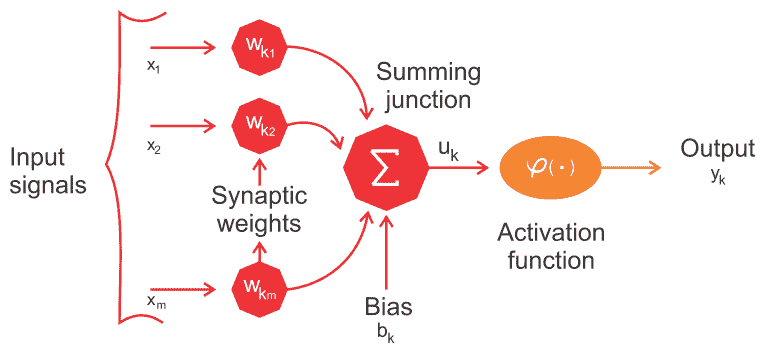
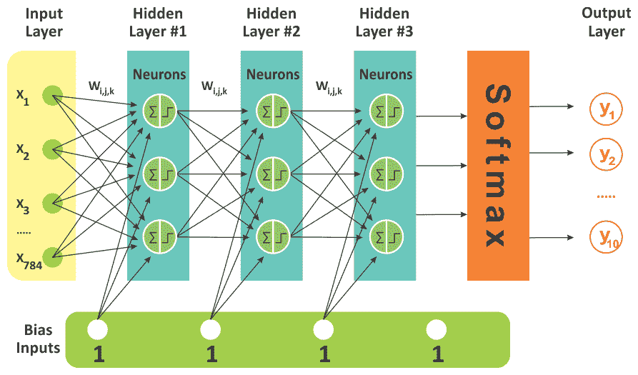
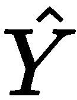
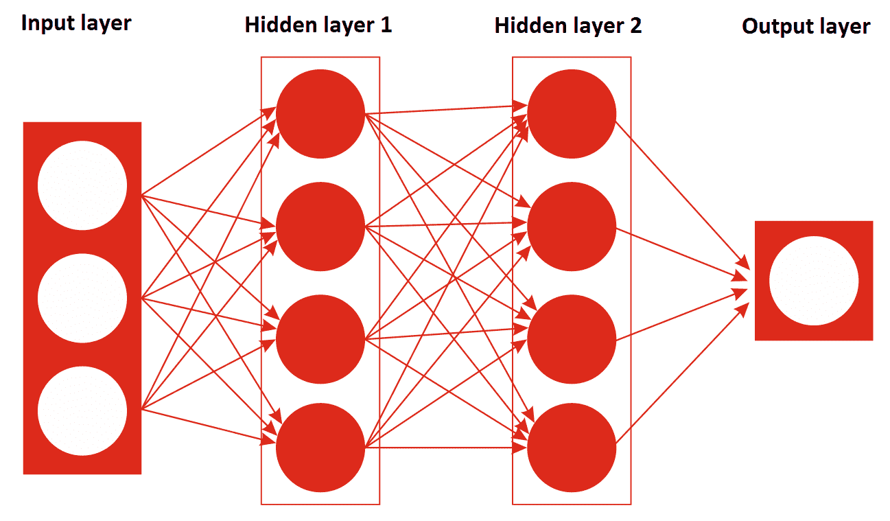
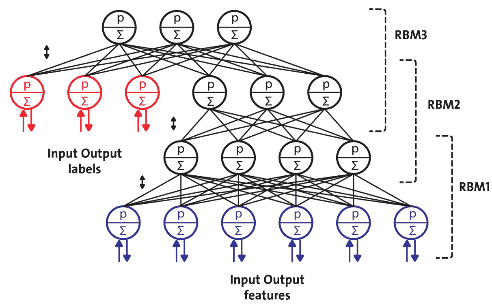
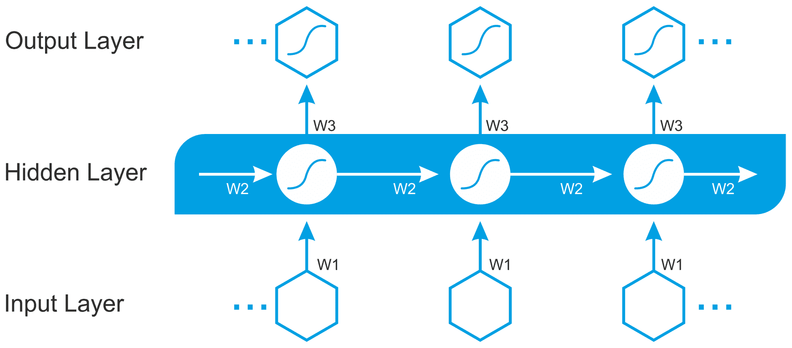
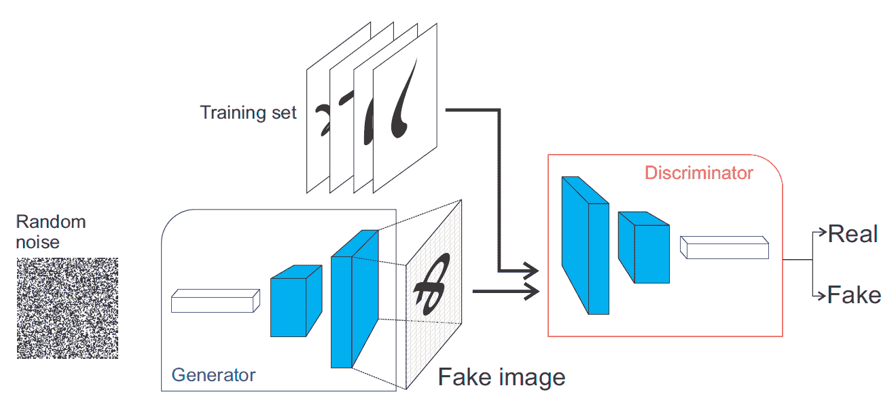
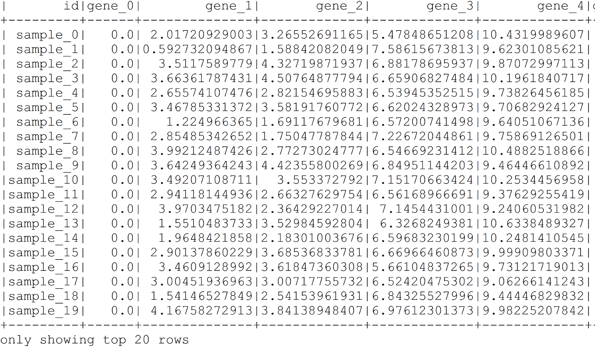
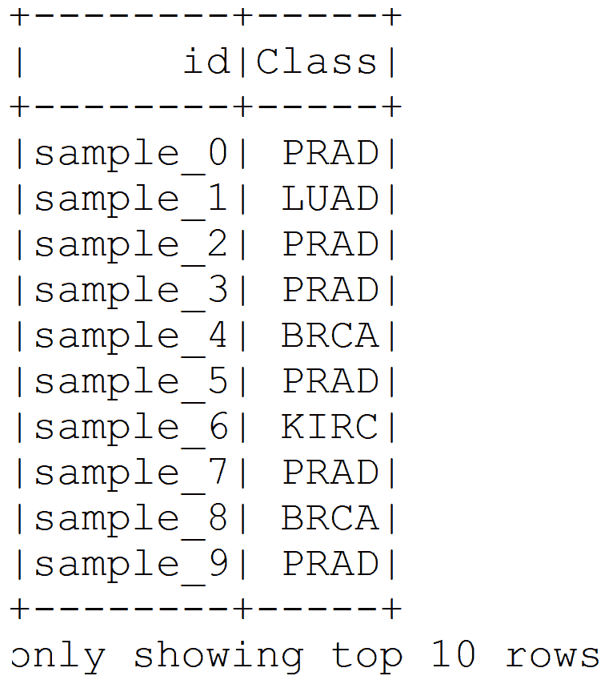

# Scala 深度学习简介

纵观[第二章](f649db9f-aea9-4509-b9b8-e0b7d5fb726a.xhtml)、*回归分析的 Scala*，到[第六章](4935de5b-9527-4ff2-82ed-927dea04c77a.xhtml)、*推荐系统的 Scala*，我们通过现实生活中的例子了解到了线性的和经典的**机器学习** ( **ML** )算法。在本章中，我们将解释**深度学习** ( **DL** )的一些基本概念。我们将从 DL 开始，它是 ML 的新兴分支之一。我们将简要讨论一些最著名和广泛使用的神经网络架构和 DL 框架和库。

最后，我们将使用**长短期记忆** ( **LSTM** )架构，从**癌症基因组图谱** ( **TCGA** )精选的非常高维的数据集进行癌症类型分类。本章将涵盖以下主题:

*   DL 对 ML

*   DL 和神经网络

*   深度神经网络架构
*   DL 框架
*   开始学习


# 技术要求

确保在您的机器上安装并配置了 Scala 2.11.x 和 Java 1.8.x。

这几章的代码文件可以在 GitHub 上找到:

[https://github . com/packt publishing/Machine-Learning-with-Scala-Quick-Start-Guide/tree/master/chapter 07](https://github.com/PacktPublishing/Machine-Learning-with-Scala-Quick-Start-Guide/tree/master/Chapter07)

看看下面的视频，看看代码是如何运行的:
[http://bit.ly/2vwrxzb](http://bit.ly/2vwrxzb)


# DL 对 ML

用于小规模数据分析的简单 ML 方法不再有效，因为 ML 方法的有效性随着大型和高维数据集而降低。接下来是 DL——ML 的一个分支，它基于一组算法，试图对数据中的高级抽象进行建模。Ian Goodfellow *等人*(深度学习，麻省理工学院出版社，2016)对 DL 的定义如下:

"Deep learning is a particular kind of machine learning that achieves great power and flexibility by learning to represent the world as a nested hierarchy of concepts, with each concept defined in relation to simpler concepts, and more abstract representations computed in terms of less abstract ones."

与 ML 模型类似，DL 模型也接受输入 *X* ，并从中学习高级抽象或模式以预测输出 *Y* 。例如，基于过去一周的股票价格，DL 模型可以预测第二天的股票价格。当对这样的历史股票数据执行训练时，DL 模型试图最小化预测值和实际值之间的差异。通过这种方式，DL 模型试图对以前没有见过的输入进行归纳，并对测试数据进行预测。

现在，你可能想知道，如果一个 ML 模型可以做同样的任务，为什么我们需要 DL 来做这个？嗯，DL 模型往往在处理大量数据时表现良好，而旧的 ML 模型在某个点之后就停止了改进。DL 的核心概念受到大脑结构和功能的启发，被称为**人工神经网络** ( **ANNs** )。作为数字逻辑的核心，人工神经网络帮助你学习输入和输出之间的关联，以便做出更稳健和准确的预测。但是，DL 不仅仅局限于 ANNs 有许多理论上的进步、软件栈和硬件改进将 DL 带给了大众。我们来看一个例子；假设我们想要开发一个预测分析模型，比如动物识别器，我们的系统必须解决两个问题:

*   若要对图像表示猫还是狗进行分类
*   把狗和猫的图像聚集在一起

如果我们使用典型的 ML 方法来解决第一个问题，我们必须定义面部特征(耳朵、眼睛、胡须等)并编写一个方法来确定在对特定动物进行分类时哪些特征(通常是非线性的)更重要。

然而，与此同时，我们不能解决第二个问题，因为用于聚类图像的经典 ML 算法(例如 k-means)不能处理非线性特征。看看下面的图表，它显示了一个工作流程，如果给定的图像是一只猫，我们是否想要分类，我们将遵循这个流程:


DL 算法将这两个问题更进一步，在确定哪些特征对于分类或聚类最重要之后，将自动提取最重要的特征。相反，当使用经典的 ML 算法时，我们必须手动提供这些特征。

DL 算法将采取更复杂的步骤。例如，首先，它会在聚类猫或狗时识别最相关的边。然后，它会尝试找到各种形状和边缘的分层组合。这一步称为**提取、转换和加载** ( **ETL** )。然后经过几次迭代，复杂概念和特征的层次识别将被执行。然后，基于所识别的特征，DL 算法将决定这些特征中的哪些对于分类动物是最重要的。这一步被称为特征提取。最后，它将取出标签列，并使用**自编码器** ( **AEs** )执行无监督训练，以提取要重新分配给 k-means 进行聚类的潜在特征。然后，**聚类分配硬化损失** ( **CAH 损失**)和重建损失朝着最优聚类分配联合优化。

然而，在实践中，DL 算法被提供了原始图像表示，它看不到我们所看到的图像，因为它只知道每个像素的位置及其颜色。图像被分成不同的分析层。在较低层次上，软件分析例如几个像素的网格，任务是检测一种颜色或各种细微差别。如果它发现了什么，它就通知下一级，下一级在这一点上检查给定的颜色是否属于一个更大的形式，比如一条线。

该过程继续到更高的级别，直到算法理解下图所示的内容:


虽然*狗对猫*是一个非常简单的分类器的例子，但能够做这些类型事情的软件现在已经很普遍，可以在识别人脸的系统中找到，或者在谷歌上搜索图像的系统中找到。这种软件是基于 DL 算法的。相反，通过使用线性 ML 算法，我们不能构建这样的应用，因为这些算法不能处理非线性图像特征。

此外，使用 ML 方法，我们通常只处理几个超参数。然而，当神经网络参与进来时，事情就变得太复杂了。在每一层中，都有数百万甚至数十亿个超参数需要调整——数量如此之多，以至于成本函数变得非凸。另一个原因是隐藏层中使用的激活函数是非线性的，因此成本是非凸的。


# DL 和 ann

受人脑工作方式启发的人工神经网络构成了深度学习及其真正实现的核心。如果没有人工神经网络，今天围绕深度学习的革命是不可能的。因此，为了理解 DL，我们需要理解神经网络是如何工作的。


# 人工神经网络和人脑

ann 代表了人类神经系统的一个方面，以及神经系统是如何由许多使用轴突相互通信的神经元组成的。感受器接收来自内部或外部世界的刺激。然后，它们将这些信息传递给生物神经元进行进一步处理。

除了称为轴突的另一个长延伸外，还有许多树突。在其末端，有被称为突触末端的微小结构，用于将一个神经元连接到其他神经元的树突。生物神经元从其他神经元接收被称为信号的短电脉冲，作为响应，它们触发自己的信号。

因此，我们可以总结出，神经元包括一个细胞体(也称为胞体)，一个或多个用于接收来自其他神经元的信号的树突，以及一个用于执行神经元产生的信号的轴突。当一个神经元向其他神经元发送信号时，它就处于活跃状态。然而，当它从其他神经元接收信号时，它处于非活动状态。在空闲状态下，神经元在达到某个激活阈值之前积累所有接收到的信号。这一切促使研究人员测试人工神经网络。


# 神经网络简史

ann 和 DL 中最重要的进展可以用下面的时间表来描述。我们已经看到人工神经元和感知机分别在 1943 年和 1958 年是如何提供基础的。然后，异或在 1969 年由明斯基*等人*公式化为线性不可分问题，但后来在 1974 年，沃博斯*等人*。演示了训练感知器的反向传播算法。

然而，最重大的进步发生在 20 世纪 80 年代，当时约翰·霍普菲尔德*等人*于 1982 年提出了霍普菲尔德网络。然后，神经网络和 DL 的教父之一，辛顿和他的团队在 1985 年提出了玻尔兹曼机器。然而，可能最重要的进步之一发生在 1986 年，当时 Hinton *等人*成功训练了 MLP 和 Jordan *等人*提出的 RNNs。同年，Smolensky *等人*也提出了玻尔兹曼机的改进版本，称为**限制玻尔兹曼机** ( **RBM** )。

但在 90 年代，最有意义的一年是 1997 年，1990 年 Lecun *et al.* 提出 LeNet，1997 年 Jordan *et al.* 提出循环神经网络。同年，Schuster *等人*提出了 LSTM 的改进版本和原 RNN 的改进版本，称为双向 RNN。以下时间线简要介绍了不同神经网络架构的历史:


尽管从 1997 年到 2005 年，计算技术取得了重大进步，但我们并没有经历太多的进步，直到辛顿在 2006 年再次出击，他和他的团队通过堆叠多个 RBM 提出了**深度信念网络** ( **DBN** )。然后，在 2012 年，Hinton 发明了 dropout，它显著改善了深度神经网络中的正则化和过拟合。

之后，Ian Goodfellow *等人*推出了 GANs，这是图像识别的一个重大里程碑。2017 年，Hinton 提出了 CapsNet，以克服常规 CNN 的限制，这是迄今为止最重要的里程碑之一。


# 安是怎么学习的？

基于生物神经元的概念，出现了人工神经网络的概念。类似于生物神经元，人工神经元由以下部分组成:

*   聚集来自神经元的信号的一个或多个传入连接
*   一个或多个输出连接，用于将信号传送到其他神经元
*   确定输出信号数值的激活函数

除了神经元的状态，突触权重也被考虑，它影响网络内的连接。每个权重都有一个用 *W [ij]* 表示的数值，这个数值就是连接神经元 *i* 到神经元 *j* 的突触权重。现在，对于每个神经元 *i* ，一个输入向量可以由 *x [i] = (x [1] ，x [2] ，…x [n] )* 定义，一个权重向量可以由 *w [i] = (w [i1] ，w [i2] ，…w [定义现在，根据神经元的位置，权重和输出函数决定了单个神经元的行为。然后，在前向传播期间，隐藏层中的每个单元得到以下信号:]*


然而，在这些砝码中，还有一种特殊类型的砝码，称为偏置单元， *b* 。从技术上讲，偏置单元没有连接到任何先前的层，所以它们没有真正的活动。但是，bias *b* 值允许神经网络将激活函数向左或向右移动。考虑到偏置单元，修改后的网络输出公式如下:


前面的等式表示每个隐藏单元得到输入的总和，乘以相应的权重——这被称为**求和点**。然后，**求和点**的合成输出通过激活功能，该功能压缩输出，如下图所示:



人工神经元模型的工作原理

然而，实际的神经网络架构由输入、隐藏和输出层组成，这些层由构成网络结构的*节点*组成，但仍遵循人工神经元模型的工作原理，如前图所示。输入图层仅接受数字数据，例如实数形式的要素、具有像素值的图像等:



具有一个输入层、三个隐藏层和一个输出层的神经网络

在这里，隐藏层执行大部分计算来学习模式，网络使用称为损失函数的特殊数学函数来评估其预测与实际输出相比的准确性。它可以是复杂的误差，也可以是非常简单的均方误差，定义如下:


在上式中，表示网络做出的预测，而 *Y* 表示实际或预期输出。最后，当误差不再减小时，神经网络收敛并通过输出层进行预测。


# 训练神经网络

神经网络的学习过程被配置为权重优化的迭代过程。权重在每个时期被更新。一旦训练开始，目标是通过最小化损失函数来生成预测。然后在测试集上评估网络的性能。我们已经知道了人工神经元的简单概念。然而，仅仅产生一些人工信号不足以学习一项复杂的任务。因此，一种常用的监督学习算法是反向传播算法，它非常常用于训练复杂的人工神经网络。

最终，训练这样的神经网络也是一个优化问题，其中我们试图通过迭代调整网络权重和偏差来最小化误差，通过使用通过**梯度下降** ( **GD** )的反向传播。这种方法迫使网络回溯其所有层，以在损失函数的相反方向上更新节点间的权重和偏差。

然而，这个使用 GD 的过程并不能保证达到全局最小值。隐藏单元的存在和输出函数的非线性意味着误差的行为非常复杂并且具有许多局部最小值。该反向传播步骤通常使用许多训练批次执行数千次或数百万次，直到模型参数收敛到最小化成本函数的值。当验证集上的误差开始增加时，训练过程结束，因为这可能标志着阶段过度拟合的开始。

使用 GD 的缺点是收敛时间太长，无法满足处理大规模训练数据的需求。因此，提出了一种更快的 GD，称为**随机梯度下降** ( **SDG** )，这也是 DNN 训练中广泛使用的优化器。在 SGD 中，我们每次迭代只使用来自训练集的一个训练样本来更新网络参数，这是真实成本梯度的随机近似。

现在还有其他高级优化器，如 Adam、RMSProp、ADAGrad、Momentum 等等。它们都是 SGD 的直接或间接优化版本。


# 权重和偏差初始化

现在，这里有一个棘手的问题:我们如何初始化权重？嗯，如果我们将所有的权重初始化为相同的值(例如，0 或 1)，每个隐藏的神经元将获得完全相同的信号。让我们试着分解一下:

*   如果所有权重都初始化为 1，则每个单元得到的信号等于输入之和
*   如果所有权重都是 0，这就更糟了，那么隐藏层中的每个神经元都将得到零信号

对于网络权值初始化，Xavier 初始化被广泛使用。它类似于随机初始化，但通常效果更好，因为它可以根据默认输入和输出神经元的总数来确定初始化的速率。

你可能想知道在训练一个常规的 DNN 时是否能摆脱随机初始化。嗯，最近，一些研究人员一直在谈论随机正交矩阵初始化的性能优于任何随机初始化训练 DNNs。当初始化偏差时，我们可以将它们初始化为零。

但是将偏置设置为小的恒定值，例如对于所有偏置为 0.01，确保所有的**整流线性单元** ( **雷鲁斯**)可以传播一些梯度。然而，它既不表现良好，也没有显示出持续的改善。所以建议坚持用零。


# 激活功能

为了允许神经网络学习复杂的决策边界，我们对它的一些层应用非线性激活函数。常用的函数包括 Tanh、ReLU、softmax 及其变体。更专业地说，每个神经元接收突触权重的加权和信号以及作为输入连接的神经元的激活值。为此目的最广泛使用的函数之一是所谓的 sigmoid 逻辑函数，其定义如下:


该函数的定义域包括所有实数，共定义域为(0，1)。这意味着从神经元输出的任何值(根据其激活状态的计算)将总是在 0 和 1 之间。如下图所示， **Sigmoid** 函数提供了对神经元饱和率的解释，从不活动(等于 **0** )到完全饱和，这发生在预定的最大值(等于 **1** ):


乙状结肠与双曲正切活化函数

另一方面，双曲正切，或 **Tanh** ，是激活函数的另一种形式。 **Tanh** 展平 **-1** 和 **1** 之间的一个实数值。上图显示了 **Tanh** 和 **Sigmoid** 激活功能之间的差异。特别是，在数学上， *tanh* 激活函数可以表示如下:


通常，在**前馈神经网络** ( **FFNN** )的最后一级中，softmax 函数被用作决策边界。这是一种常见的情况，尤其是在解决分类问题时。softmax 函数用于多类别分类问题中可能类别的概率分布。

对于回归问题，我们不需要使用任何激活函数，因为网络会生成连续值，即概率。然而，我看到现在有人用身份激活函数来解决回归问题。

总之，选择合适的激活函数和网络权重初始化是使网络发挥最佳性能并帮助获得良好训练的两个问题。现在我们知道了神经网络的简史，让我们在下一节深入研究不同的架构，这将让我们对它们的用法有一个概念。


# 神经网络架构

我们可以将 DL 架构分为四类:

*   **深度神经网络** ( **DNNs** )
*   **卷积神经网络**(**CNN**)
*   **循环神经网络** ( **RNNs** )
*   **紧急架构** ( **EAs** )

然而，DNNs、CNN 和 RNNs 有许多改进的变体。虽然大多数变体是为解决特定领域的研究问题而提出或开发的，但基本工作原理仍然遵循最初的 DNN、CNN 和 RNN 架构。以下小节将向您简要介绍这些架构。


# DNNs

dnn 是一种神经网络，具有复杂和更深层次的架构，每层都有大量的神经元，神经元之间有许多连接。虽然 DNN 提到了非常深的网络，但为了简单起见，我们将 MLP、**栈自编码器** ( **SAE** )和**深度信念网络** ( **DBNs** )视为 DNN 架构。这些架构大多作为 FFNN 工作，意味着信息从输入层传播到输出层。

多个感知器堆叠在一起成为多层感知器，其中各层连接成一个有向图。基本上，MLP 是最简单的 FFNNs 之一，因为它有三层:输入层、隐藏层和输出层。这样，信号以一种方式传播，从输入层到隐藏层，再到输出层，如下图所示:



自编码器和 RBM 分别是 SAE 和 dbn 的基本构件。与 MLP 不同，它是一种以监督方式训练的 FFNN，SAE 和 DBNs 都分两个阶段训练:无监督预训练和监督微调。在无监督的预训练中，层按顺序堆叠，并使用使用过的未标记数据以逐层方式进行训练。在监督微调中，输出分类器层被堆叠，并且通过用标记数据进行再训练来优化完整的神经网络。

MLP 的一个问题是它经常过度拟合数据，所以它不能很好地概括。为了克服这个问题，Hinton *等人*提出了 DBN，它使用贪婪的逐层预训练算法。DBNs 由一个可见层和多个隐藏单元层组成。DBN 的构造块是 RBM，如下图所示，其中几个 RBM 一个接一个地堆叠在一起:



最上面的两层之间有无向对称连接，但是下面的两层有来自前一层的有向连接。尽管取得了许多成功，dbn 现在正被 AEs 所取代。


# 自编码器

AEs 也是从输入数据中自动学习的特殊类型的神经网络。AEs 由两部分组成:编码器和解码器。编码器将输入压缩成潜在空间表示。然后，解码器部分尝试从该表示中重建原始输入数据:

*   **编码器**:使用函数 *h=f(x)* 将输入编码或压缩成潜在空间表示
*   **解码器**:使用被称为 *r=g(h)* 的函数从潜在空间表示中解码或重建输入

因此，AE 可以用函数 *g(f(x)) = o* 来描述，其中我们希望 *0* 与 *x* 的原始输入一样接近。下图显示了 AE 的典型工作方式:


AEs 在数据去噪和数据可视化的降维方面非常有用。AEs 可以比 PCA 更有效地学习数据投影，称为表示。


# CNN

CNN 已经取得了很大的成就，并且在计算机视觉(例如，图像识别)中被广泛采用。在 CNN 网络中，连接方案与 MLP 或 DBN 相比有很大不同。一些卷积层以级联方式连接。每层都由一个 ReLU 层、一个池层、附加卷积层(+ReLU)和另一个池层支持，池层之后是一个全连接层和一个 softmax 层。下图是用于面部识别的 CNN 架构示意图，它将面部图像作为输入，并预测愤怒、厌恶、恐惧、快乐、悲伤等情绪。


用于面部识别的 CNN 的示意性架构

重要的是，dnn 不知道像素是如何组织的，因为它们不知道附近的像素是接近的。CNN 通过在图像的小区域中使用特征地图，使用较低层来嵌入这种先验知识，而较高层将较低层的特征组合成较大的特征。

这对于大多数自然图像都很有效，给了 CNN 决定性的领先优势。每个卷积层的输出是一组对象，称为特征图，由单个内核过滤器生成。然后，特征图可用于定义下一层的新输入。CNN 网络中的每个神经元都会产生一个输出，后面跟着一个激活阈值，这个阈值与输入成正比，不受限制。


# RNNs

在 RNNs 中，单元之间的连接形成一个有向循环。RNN 建筑最初是由 Hochreiter 和 Schmidhuber 在 1997 年构思的。RNN 架构有标准的 MLP，加上附加的环路，因此它们可以利用 MLP 强大的非线性映射能力。它们也有某种形式的记忆。下图显示了一个非常基本的 RNN，它有一个输入层、两个递归层和一个输出层:



然而，这种基本的 RNN 受到梯度消失和爆炸问题的困扰，并且不能对长期依赖性进行建模。这些架构包括 LSTM、**门控循环单元** ( **GRUs** )、双向 LSTM 以及其他变体。因此，LSTM 和 GRU 可以克服常规循环神经网络的缺点:梯度消失/爆炸问题和长短期依赖性。


# 生成对抗网络

Ian Goodfellow *等人*在一篇名为*生成对抗网络*的论文中介绍了 GANs(详见 [https:/ / arxiv。org/abs/ 1406。2661v1](https://arxiv.org/pdf/1406.2661v1.pdf) )。下图简要说明了 GAN 的工作原理:



GAN 的工作原理

gan 是深度神经网络架构，由两个网络、一个生成器和一个鉴别器组成，它们相互对立(因此得名，*对立*):

*   **生成器**试图从特定的概率分布中生成数据样本，并且与实际对象非常相似
*   **鉴别器**将判断其输入是来自原始训练集还是来自发生器部分

许多 DL 实践者认为 GANs 是最重要的进步之一，因为 GANs 可以用来模拟任何数据分布，并且基于数据分布，可以教会 GANs 创建机器人艺术家图像、超分辨率图像、文本到图像合成、音乐、语音等等。

例如，由于对抗性训练的概念，脸书的人工智能研究主任 Yann LeCun 将 GANs 称为 ML 过去 10 年中最有趣的想法。


# 胶囊网络

在 CNN 中，每一层通过慢感受野或最大池操作在更细粒度的水平上理解图像。如果图像有旋转、倾斜或非常不同的形状或方向，CNN 无法提取这样的空间信息，并且在图像处理任务中表现非常差。即使是 CNN 中的池操作也不能对这种位置不变性有多大帮助。CNN 的这个问题通过标题为*胶囊之间的动态路由*的论文引导我们了解 CapsNet 的最新进展(详见 [https:/ / arxiv。org/ abs/ 1710。09829](https://arxiv.org/pdf/1710.09829.pdf) )作者杰弗里·辛顿*等人*:

胶囊是一组神经元，其活动向量代表特定类型实体(如对象或对象部分)的实例化参数

与常规的 DNN 不同，在 CapsNets 中，我们不断地添加层，这个想法是在一个层中添加更多的层。这样，顶网就是一组嵌套的神经层。在 CapsNet 中，使用路由算法计算胶囊的向量输入和输出，该算法迭代地传递信息并处理物理中使用的**自洽场** ( **SCF** )过程:


上图显示了一个简单的三层顶网的示意图。 **DigiCaps** 层中每个胶囊的活动向量的长度表示每个类的一个实例的存在，用于计算损失。

既然我们已经了解了神经网络的工作原理和不同的神经网络架构，那么动手实现一些东西将会很棒。然而，在此之前，我们先来看看一些流行的 DL 库和框架，它们是这些网络架构的实现所附带的。


# DL 框架

有几种流行的 DL 框架。它们中的每一个都有一些优点和缺点。有些是基于桌面的，有些是基于云的平台，您可以在其中部署/运行您的 DL 应用。然而，大多数在开放许可下发布的库在人们使用图形处理器时会有所帮助，这最终会有助于加快学习过程。

这样的框架和库包括 TensorFlow、PyTorch、Keras、Deeplearning4j、H2O 以及**微软认知工具包** ( **CNTK** )。甚至在几年前，包括 Theano、Caffee 和 Neon 在内的其他实现也被广泛使用。然而，这些现在都过时了。由于我们将专注于 Scala 中的学习，基于 JVM 的 DL 库如 Deeplearning4j 可能是一个合理的选择。**deep learning 4j**(**DL4J**)是第一个为 Java 和 Scala 构建的商业级开源分布式 DL 库。这也为 Hadoop 和 Spark 提供了集成支持。DL4J 是为在分布式 GPU 和 CPU 上的业务环境中使用而构建的。DL4J 的目标是尖端和即插即用，更多的是惯例而不是配置，这允许非研究人员快速原型制作。下图显示了去年的谷歌趋势，说明了 TensorFlow 有多受欢迎:


不同 DL 框架的趋势—TensorFlow 和 Keras 占主导地位；然而，Theano 正在失去它的受欢迎程度；另一方面，针对 JVM 的 Deeplearning4j 正在兴起

它的众多库可以与 DL4J 集成，并且将使您的 JVM 体验更容易，无论您是用 Java 还是 Scala 开发 ML 应用。与 JVM 的 NumPy 类似，ND4J 提供了线性代数的基本操作(矩阵创建、加法和乘法)。但是，ND4S 是一个用于线性代数和矩阵操作的科学计算库。它还为基于 JVM 的语言提供了 n 维数组。

除了前面提到的库之外，最近还有一些关于云计算的 DL 计划。这个想法是将 DL 功能引入到具有数十亿个数据点和高维数据的大数据中。例如，**亚马逊网络服务** ( **AWS** )、微软 Azure、谷歌云平台、**英伟达 GPU 云** ( **NGC** )都提供了原生于其公共云的机器和 DL 服务。

2017 年 10 月，AWS 发布了针对**亚马逊弹性计算云** ( **亚马逊 EC2** ) P3 实例的**深度学习 AMIs** ( **DLAMIs** )。这些 ami 预装了 DL 框架，如 TensorFlow、Gluon 和 Apache MXNet，这些框架针对亚马逊 EC2 P3 实例中的 NVIDIA Volta V100 GPUs 进行了优化。DL 服务目前提供三种类型的 AMI:Conda AMI、Base AMI 和带源代码的 AMI。

CNTK 是 Azure 的开源 DL 服务。与 AWS 的产品类似，它专注于可以帮助开发人员构建和部署 DL 应用的工具。该工具包安装在 Python 2.7 的根环境中。Azure 还提供了一个模型库，其中包括代码样本等资源，以帮助企业开始使用该服务。

另一方面，NGC 为人工智能科学家和研究人员提供了 GPU 加速的容器(见[https://www . NVIDIA . com/en-us/data-center/GPU-cloud-computing/](https://www.nvidia.com/en-us/data-center/gpu-cloud-computing/))。NGC 采用了容器化的深度学习框架，如 TensorFlow、PyTorch、MXNet 等，这些框架经过英伟达的调整、测试和认证，可以在参与云服务提供商的最新英伟达 GPU 上运行。然而，也有第三方服务可以通过他们各自的市场获得。

现在，您已经了解了神经网络架构的工作原理，并且已经看到了用于实现 DL 解决方案的可用 DL 框架的简要概述，让我们继续下一部分，进行一些实践学习。


# 开始学习

大规模癌症基因组学数据通常以多平台和异构的形式出现。这些数据集在生物信息学方法和计算算法方面带来了巨大的挑战。许多研究人员已经提出利用这些数据来克服几个挑战，使用经典的 ML 算法作为癌症诊断和预后的主要对象或支持元素。


# 数据集的描述

基因组数据涵盖了生物上所有与 DNA 相关的数据。虽然在这篇论文中，我们也将使用其他类型的数据，如转录组数据(RNA 和 miRNA)，但为了方便起见，所有数据将被称为基因组数据。由于人类基因组计划(**【HGP】**)(1984-2000)在人类 DNA 全序列测序上的成功，人类遗传学研究近年来取得了巨大突破。现在，让我们看看可以用于我们目的的真实数据集是什么样的。我们将使用*基因表达癌症 RNA-Seq* 数据集，该数据集可以从 UCI ML 知识库下载(更多信息请参见[https://archive . ics . UCI . edu/ML/datasets/gene+expression+cancer+RNA-Seq](https://archive.ics.uci.edu/ml/datasets/gene+expression+cancer+RNA-Seq))。

该数据集是另一个数据集的随机子集，该数据集在以下论文中进行了报道:Weinstein，John N .，*等人*。*癌症基因组图谱泛癌分析项目。*自然遗传学 45.10 (2013): 1113-1120。项目的名称是泛癌分析项目。它收集了来自数千名身体不同部位原发性肿瘤患者的数据。它涵盖了 12 种肿瘤类型，包括:

*   **多形性胶质母细胞瘤** ( **GBM**
*   **成淋巴细胞性急性髓细胞白血病** ( **AML** )
*   **头颈鳞癌** ( **HNSC** )
*   **肺腺癌** ( **卢阿德**)
*   **L** **ung 鳞状细胞癌** ( **LUSC** )
*   **乳腺癌** ( **BRCA** )
*   **肾透明细胞癌** ( **KIRC** )
*   **卵巢癌** ( **OV** )
*   **膀胱癌** ( **BLCA** )
*   **结肠腺癌** ( **COAD** )
*   **宫颈癌和子宫内膜癌** ( **UCEC** )
*   **直肠腺癌** ( **读作** )

这个数据集合是 RNA-Seq (HiSeq) PANCAN 数据集的一部分。它是对患有不同类型肿瘤的患者的基因表达的随机提取:BRCA、KIRC、COAD、LUAD 和 PRAD。

该数据集是来自 801 名患者的癌症患者的随机集合，每个患者具有 20，531 个属性。样本(`instances`)按行存储。每个样品的变量(`attributes`)是由 Illumina HiSeq 平台测量的 RNA-Seq 基因表达水平。每个属性都有一个假名(`gene_XX`)。属性的排序与原始提交一致。例如，`sample_0`上的`gene_1`以`2.01720929003`的值显著且有差异地表达。

下载数据集时，您会看到有两个 CSV 文件:

*   `data.csv`:包含每个样本的基因表达数据
*   `labels.csv`:与每个样本相关的标签

让我们来看看处理过的数据集。请注意，考虑到以下屏幕截图中的高维数，我们将只查看几个精选功能，其中第一列代表样本 id(即匿名患者 id)。其余的列表示特定的基因表达在患者的肿瘤样品中是如何发生的:



现在，看看下表中的标签。这里，`id`列包含样本 id，`Class`列代表癌症标签:



现在，你可以想象我为什么选择这个数据集。尽管我们没有很多样本，但数据集仍然是高度多维的。此外，这种类型的高维数据集非常适合应用 DL 算法。因此，如果给定了特征和标签，我们是否可以根据特征和地面真相对这些样本进行分类？为什么不呢？我们将尝试用 DL4J 库来解决这个问题。首先，我们必须配置我们的编程环境，以便我们可以编写代码。


# 准备编程环境

在本节中，我们将在开始编码之前讨论如何配置 DL4J、ND4s、Spark 和 ND4J。以下是使用 DL4J 时必须考虑的先决条件:

*   Java 1.8+(仅限 64 位)
*   Apache Maven 用于自动构建和依赖管理器
*   IntelliJ IDEA 或 Eclipse IDE
*   用于版本控制和 CI/CD 的 Git

以下库可以与 DJ4J 集成，以增强您在开发 ML 应用时的 JVM 体验:

*   **DL4J** :核心神经网络框架，自带很多 DL 架构和底层功能。
*   **ND4J** :可以认为是 JVM 的 NumPy。它附带了线性代数的一些基本运算。例如矩阵创建、加法和乘法。
*   DataVec :这个库在执行特性工程的同时支持 ETL 操作。
*   **JavaCPP** :这个库充当 Java 和原生 C++之间的桥梁。
*   **仲裁器**:这个库为 DL 算法提供了基本的评估功能。
*   **RL4J** :针对 JVM 的深度强化学习。
*   **ND4S** :这是一个科学计算库，它还支持基于 JVM 的语言的 n 维数组。

如果您在首选 IDE 上使用 Maven，让我们定义项目属性，在`pom.xml`文件中提到这些版本:

```
<properties>
     <project.build.sourceEncoding>UTF-8</project.build.sourceEncoding>
     <jdk.version>1.8</jdk.version>
     <spark.version>2.2.0</spark.version>
     <nd4j.version>1.0.0-alpha</nd4j.version>
     <dl4j.version>1.0.0-alpha</dl4j.version>
     <datavec.version>1.0.0-alpha</datavec.version>
     <arbiter.version>1.0.0-alpha</arbiter.version>
     <logback.version>1.2.3</logback.version>
</properties>
```

然后，使用 DL4J、ND4S 和 ND4J 所需的所有依赖项，如`pom.xml`文件所示。对了，DL4J 自带 Spark 2.1.0。此外，如果您的计算机上没有配置本机系统 BLAS，ND4J 的性能将会降低。一旦您执行任何用 Scala 编写的简单代码，您将会遇到以下警告:

```
****************************************************************
 WARNING: COULD NOT LOAD NATIVE SYSTEM BLAS
 ND4J performance WILL be reduced
 ****************************************************************
```

然而，安装和配置 BLAS，如 OpenBLAS 或 IntelMKL，并不困难；你可以投入一些时间去做。有关详细信息，请参考以下 URL:

[http://nd4j.org/getstarted.html#open](http://nd4j.org/getstarted.html#open)

干得好！我们的编程环境已经为简单的 DL 应用开发做好了准备。现在，是时候使用一些示例代码了。


# 预处理

由于我们没有任何未标记的数据，我想随机选择一些样本进行测试。还有一点需要注意的是，要素和标注位于两个独立的文件中。因此，我们可以执行必要的预处理，然后将它们连接在一起，这样预处理后的数据将同时具有要素和标注。

然后，其余的数据将用于训练。最后，我们将把训练集和测试集保存在一个单独的 CSV 文件中，供以后使用。按照以下步骤开始:

1.  首先，让我们加载示例并查看统计数据。这里，我们使用 Spark 的`read()`方法，但是也指定了必要的选项和格式:

```
val data = spark.read.option("maxColumns", 25000).format("com.databricks.spark.csv")
      .option("header", "true") // Use first line of all files as header
      .option("inferSchema", "true") // Automatically infer data types
      .load("TCGA-PANCAN/TCGA-PANCAN-HiSeq-801x20531/data.csv");// set this path accordingly
```

2.  然后，我们会看到一些相关的统计数据，比如特征的数量和样本的数量:

```
val numFeatures = data.columns.length
val numSamples = data.count()
println("Number of features: " + numFeatures)
println("Number of samples: " + numSamples)
```

因此，有来自`801`不同患者的`801`个样本，数据集的维度太高，因为它具有`20532`个特征:

```
Number of features: 20532
Number of samples: 801
```

3.  此外，由于`id`列只代表患者的匿名 ID，所以我们可以简单地删除它:

```
val numericDF = data.drop("id") // now 20531 features left
```

4.  然后，我们使用 Spark 的`read()`方法加载标签，并指定必要的选项和格式:

```
val labels = spark.read.format("com.databricks.spark.csv")
      .option("header", "true") 
      .option("inferSchema", "true") 
      .load("TCGA-PANCAN/TCGA-PANCAN-HiSeq-801x20531/labels.csv") 
labels.show(10)
```

我们已经看到了标签数据帧的样子。我们将跳过`id`。然而，`Class`列是绝对的。正如我们前面提到的，DL4J 不支持需要预测的分类标签。因此，我们必须将其转换为数字格式(更具体地说，是整数)；为此，我会使用 Spark 的`StringIndexer()`:

1.  首先，我们创建一个`StringIndexer()`，我们将索引操作应用于`Class`列，并将其重命名为`label`。此外，我们`skip`空条目:

```
val indexer = new StringIndexer().setInputCol("Class")
              .setOutputCol("label")
              .setHandleInvalid("skip"); // skip null/invalid values    
```

2.  然后，我们通过调用`fit()`和`transform()`操作来执行索引操作，如下所示:

```
val indexedDF = indexer.fit(labels).transform(labels)
                       .select(col("label")
                       .cast(DataTypes.IntegerType)); // casting data types to integer
```

3.  现在，让我们来看看索引数据帧:

```
indexedDF.show()
```

前面的代码行应该将`label`列转换为数字格式:


4.  太棒了。现在，所有列(包括要素和标注)都是数字。因此，我们可以将要素和标注合并到单个数据框架中。为此，我们可以使用 Spark 的`join()`方法，如下所示:

```
val combinedDF = numericDF.join(indexedDF)
```

5.  现在，我们可以通过随机拆分`combinedDF`来生成训练集和测试集，如下所示:

```
val splits = combinedDF.randomSplit(Array(0.7, 0.3), 12345L) //70% for training, 30% for testing
val trainingDF = splits(0)
val testDF = splits(1)
```

6.  现在，让我们看看每组样品的`count`:

```
println(trainingDF.count())// number of samples in training set
println(testDF.count())// number of samples in test set
```

7.  训练集中应该有 561 个样本，测试集中应该有 240 个样本。最后，我们将它们保存在单独的 CSV 文件中，供以后使用:

```
trainingDF.coalesce(1).write
      .format("com.databricks.spark.csv")
      .option("header", "false")
      .option("delimiter", ",")
      .save("output/TCGA_train.csv")

testDF.coalesce(1).write
      .format("com.databricks.spark.csv")
      .option("header", "false")
      .option("delimiter", ",")
      .save("output/TCGA_test.csv")
```

8.  现在我们有了训练集和测试集，我们可以用训练集训练网络，用测试集评估模型。

Spark 将在项目根目录下的`output`文件夹下生成 CSV 文件。但是，您可能会看到一个非常不同的名称。我建议您分别为训练集和测试集将它们重命名为`TCGA_train.csv`和`TCGA_test.csv`。

考虑到高维数，我宁愿尝试更好的网络，如 LSTM，这是 RNN 的改进版本。在这一点上，关于 LSTM 的一些上下文信息将有助于理解这一思想，并将在下一节之后提供。


# 数据集准备

在上一节中，我们准备了训练集和测试集。然而，我们需要付出一些额外的努力，使它们可以被 DL4J 使用。更具体地说，DL4J 期望数字格式的训练数据和最后一列是`label`列。剩下的数据应该是特征。

我们现在将尝试像那样准备我们的训练和测试集。首先，我们将找到保存训练集和测试集的文件:

```
// Show data paths
val trainPath = "TCGA-PANCAN/TCGA_train.csv"
val testPath = "TCGA-PANCAN/TCGA_test.csv"
```

然后，我们将定义所需的参数，例如特性的数量、类的数量和批量大小。这里，我使用`128`作为`batchSize`，但是你可以相应地调整它:

```
// Preparing training and test set.
val labelIndex = 20531
val numClasses = 5
val batchSize = 128
```

该数据集用于训练:

```
val trainingDataIt: DataSetIterator = readCSVDataset(trainPath, batchSize, labelIndex, numClasses)
```

这是我们想要分类的数据:

```
val testDataIt: DataSetIterator = readCSVDataset(testPath, batchSize, labelIndex, numClasses)
```

从前面两行代码中可以看出，`readCSVDataset()`基本上是一个读取 CSV 格式数据的包装器，然后`RecordReaderDataSetIterator()`方法将记录读取器转换为数据集迭代器。


# LSTM 网络建设

用 DL4J 创建神经网络从`MultiLayerConfiguration`开始，它组织网络层及其超参数。然后，使用`NeuralNetConfiguration.Builder()`界面添加创建的层。如下图所示，LSTM 网络由五层组成:输入层，其后是三个 LSTM 层。最后一个图层是 RNN 图层，在本例中也是输出图层:


用于癌症类型预测的 LSTM 网络，采用 20，531 个特征和固定偏差(即 1)并生成多类输出

为了创建 LSTM 层，DL4J 提供了一个 LSTM 类的实现。然而，在我们开始为网络创建层之前，让我们定义一些超参数，例如输入/隐藏/输出节点(神经元)的数量:

```
// Network hyperparameters
val numInputs = labelIndex
val numOutputs = numClasses
val numHiddenNodes = 5000
```

然后，我们通过指定图层来创建网络。第一、第二和第三层是 LSTM 层。最后一层是 RNN 层。对于所有隐藏的 LSTM 层，我们指定输入和输出单元的数量，并使用 ReLU 作为激活函数。然而，由于这是一个多类分类问题，我们使用`SOFTMAX`作为输出图层的`activation`函数，使用`MCXNET`作为损失函数:

```
//First LSTM layer
val layer_0 = new LSTM.Builder()
      .nIn(numInputs)
      .nOut(numHiddenNodes)
      .activation(Activation.RELU)
      .build()

//Second LSTM layer
val layer_1 = new LSTM.Builder()
      .nIn(numHiddenNodes)
      .nOut(numHiddenNodes)
      .activation(Activation.RELU)
      .build()

//Third LSTM layer
val layer_2 = new LSTM.Builder()
      .nIn(numHiddenNodes)
      .nOut(numHiddenNodes)
      .activation(Activation.RELU)
      .build()

//RNN output layer
val layer_3 = new RnnOutputLayer.Builder()
      .activation(Activation.SOFTMAX)
      .lossFunction(LossFunction.MCXENT)
      .nIn(numHiddenNodes)
      .nOut(numOutputs)
      .build()
```

在前面的代码块中，softmax `activation`函数给出了类的概率分布，`MCXENT`是多类分类设置中的交叉熵损失函数。

然后，使用 DL4J，我们使用`NeuralNetConfiguration.Builder()`接口添加之前创建的层。首先，我们添加所有的 LSTM 图层，然后是最终的 RNN 输出图层:

```
//Create network configuration and conduct network training
val LSTMconf: MultiLayerConfiguration = new NeuralNetConfiguration.Builder()
      .seed(seed) //Random number generator seed for improved repeatability. Optional.
      .optimizationAlgo(OptimizationAlgorithm.STOCHASTIC_GRADIENT_DESCENT)
      .weightInit(WeightInit.XAVIER)
      .updater(new Adam(5e-3))
      .l2(1e-5)
      .list()
          .layer(0, layer_0)
          .layer(1, layer_1)
          .layer(2, layer_2)
          .layer(3, layer_3)
      .pretrain(false).backprop(true).build()
```

在前面的代码块中，我们使用 SGD 作为优化器，它试图优化`MCXNET`损失函数。然后，我们使用`XAVIER`初始化网络权重，而`Adam`作为 SGD 的网络更新器。最后，我们使用前面的多层配置初始化多层网络:

```
val model: MultiLayerNetwork = new MultiLayerNetwork(LSTMconf)
model.init()
```

此外，我们可以检查跨层和整个网络中超参数的数量。通常，这种类型的网络有许多超参数。让我们打印网络中的参数数量(以及每一层):

```
//print the score with every 1 iteration
model.setListeners(new ScoreIterationListener(1))

//Print the number of parameters in the network (and for each layer)
val layers = model.getLayers()
var totalNumParams = 0
var i = 0

for (i <- 0 to layers.length-1) {
      val nParams = layers(i).numParams()
      println("Number of parameters in layer " + i + ": " + nParams)
      totalNumParams = totalNumParams + nParams
}
println("Total number of network parameters: " + totalNumParams)
```

上述代码的输出如下:

```
Number of parameters in layer 0: 510640000
Number of parameters in layer 1: 200020000
Number of parameters in layer 2: 200020000
Number of parameters in layer 3: 25005
Total number of network parameters: 910705005
```

正如我之前所说的，我们的网络有 9.1 亿个参数，这是非常庞大的。在优化超参数时，这也是一个巨大的挑战。


# 网络培训

首先，我们将使用前面的`MultiLayerConfiguration`创建一个`MultiLayerNetwork`。然后，我们将初始化网络，并在训练集上开始训练:

```
var j = 0
println("Train model....")
for (j <- 0 to numEpochs-1) {
   model.fit(trainingDataIt)
```

最后，我们还指定不需要做任何预训练(这在 DBN 或栈式自编码器中通常是需要的)。


# 评估模型

培训完成后，下一个任务是评估模型，我们将在这里的测试集上进行评估。对于评估，我们将使用`Evaluation()`方法。这个方法创建了一个包含五个可能的类的评估对象。

首先，让我们对每个测试样本进行迭代评估，并从训练好的模型中获得网络预测。最后，`eval()`方法对照真实类检查预测:

```
println("Evaluate model....")
val eval: Evaluation = new Evaluation(5) //create an evaluation object with 5 possible classes    
while (testDataIt.hasNext()) {
      val next:DataSet = testDataIt.next()
      val output:INDArray  = model.output(next.getFeatureMatrix()) //get the networks prediction
      eval.eval(next.getLabels(), output) //check the prediction against the true class
    }
println(eval.stats())
println("****************Example finished********************")
  }
```

以下是输出:

```
==========================Scores========================================
 # of classes:    5
 Accuracy:        0.9900
 Precision:       0.9952
 Recall:          0.9824
 F1 Score:        0.9886
 Precision, recall & F1: macro-averaged (equally weighted avg. of 5 classes)
 ========================================================================
 ****************Example finished******************
```

哇！难以置信！我们的 LSTM 网络已经准确地对样本进行了分类。最后，让我们看看分类器如何预测每个类别:

```
Actual label 0 predicted by the model as 0: 82 times
Actual label 1 predicted by the model as 0: 1 times
Actual label 1 predicted by the model as 1: 17 times
Actual label 2 predicted by the model as 2: 35 times
Actual label 3 predicted by the model as 0: 1 times
Actual label 3 predicted by the model as 3: 30 times 
```

使用 LSTM 预测癌症类型的预测准确性可疑地更高，不是吗？我们的模型不合适吗？我们的模型过度拟合了吗？


# 使用 Deeplearning4j UI 观察培训

由于我们的准确度可疑地更高，我们可以观察训练进行得如何。是的，有办法发现它是否过拟合，因为我们可以在 DL4J UI 上观察训练、验证和测试损失。不过，这里就不讨论细节了。看看[https://deep learning 4j . org/docs/latest/deep learning 4j-nn-visualization](https://deeplearning4j.org/docs/latest/deeplearning4j-nn-visualization)了解更多关于如何做的信息。


# 摘要

在这一章中，我们看到了如何从 TCGA 收集的非常高维的基因表达数据集中，根据肿瘤类型对癌症患者进行分类。我们的 LSTM 架构成功实现了 99%的准确率，这是非常出色的。尽管如此，我们讨论了 DL4J 的许多方面，这将在接下来的章节中有所帮助。最后，我们看到了与本项目、LSTM 网络和 DL4J 超参数/网络调整相关的一些常见问题的答案。

这或多或少是我们使用 Scala 和不同开源框架开发 ML 项目的小小旅程的结束。在这些章节中，我试图为你提供几个例子，告诉你如何有效地使用这些美妙的技术来开发 ML 项目。在写这本书的时候，我不得不在脑海中保留许多约束；比如页数，API 可用性，当然还有我的专业知识。

然而，总的来说，我试图通过避免不必要的理论细节来使这本书简单，因为你可以在许多书籍、博客和网站上读到这一点。我还会在 GitHub 知识库上保持这本书的代码更新，网址是[https://GitHub . com/packt publishing/Machine-Learning-with-Scala-Quick-Start-Guide](https://github.com/PacktPublishing/Machine-Learning-with-Scala-Quick-Start-Guide)。随时打开一个新的问题或任何拉请求，以改善代码，并保持关注。

尽管如此，我将把解决方案作为 Zeppelin 笔记本上传到每一章，这样您就可以交互式地运行代码。顺便说一下，Zeppelin 是一款基于网络的笔记本，支持数据驱动、交互式数据分析以及使用 SQL 和 Scala 的协作文档。一旦您在首选平台上配置了 Zeppelin，您就可以从 GitHub 资源库下载笔记本，将它们导入 Zeppelin，然后开始使用。更多的细节，你可以看看 https://zeppelin.apache.org/的。