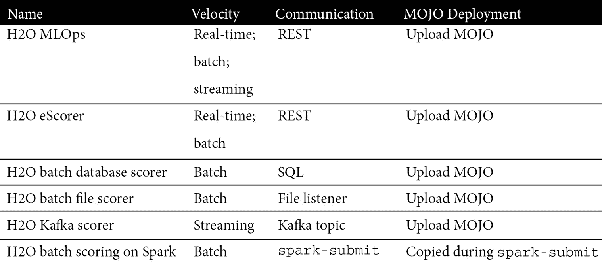
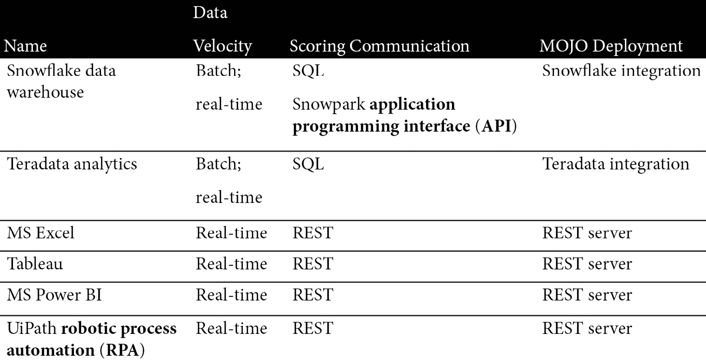
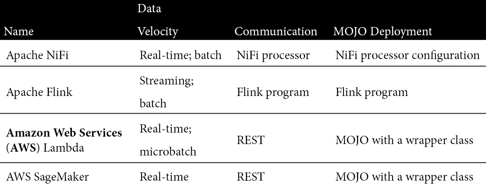

# 十、H2O 模型部署模式

在前一章中，我们了解了从我们的模型构建步骤中生成一个随时可以部署的评分工件是多么容易，以及这个工件，称为 MOJO，是如何被设计来灵活地部署到各种各样的生产系统的。

在这一章中，我们通过调查各种 MOJO 部署模式并深入研究每种部署模式的细节来探索 MOJO 部署的灵活性。我们将看到 MOJOs 是如何在 H2O 软件、包括**商业智能** ( **BI** )工具在内的第三方软件以及您自己的软件上实现评分的。这些实施将包括对实时、批量和流式数据的评分。

回想一下从 [*第一章*](B16721_01_Final_SK_ePub.xhtml#_idTextAnchor015) ，*机遇与挑战*，**机器学习** ( **ML** )模型在部署到生产系统时如何实现商业价值。您在本章中获得的知识将允许您为特定的业务案例找到合适的 MOJO 部署模式。例如，它将允许分析师从 **Microsoft Excel** 电子表格中执行时间序列预测，允许技术人员对来自制造流程的数据流中的产品缺陷预测做出回应，允许业务利益相关者对直接在雪花表上评分的欺诈预测做出回应。

本章的目标是让你实现自己的 H2O 模型评分，无论是从这些例子，你的网络搜索，还是你的想象力，这些例子的启发。

因此，在本章中，我们将讨论以下主要话题:

*   调查 MOJO 部署模式的示例
*   探索 H2O 软件上的 MOJO 评分示例
*   探索第三方软件上的 MOJO 评分示例
*   探索目标系统软件上的 MOJO 评分示例
*   探索基于 H2O 无人驾驶人工智能集成的加速器示例

# 技术要求

本章没有技术要求，尽管我们将强调实现和执行 MOJO 部署模式的技术步骤。

# 调查 MOJO 部署模式的样本

本章的目的是概述部署 MOJOs 进行预测的各种方式。给出了足够的细节来帮助理解 MOJO 部署和评分的背景。提供链接是为了查找底层细节。

首先，让我们以表格形式总结一下我们的 MOJO 评分模式示例，以了解部署 MOJO 的许多不同方式。在这个示例概述之后，我们将更全面地阐述每个表条目。

请注意，我们的部署模式摘要的表列如下所示:

*   **数据速度**:这是指被评分数据的大小和速度，分为**实时**(单个记录被评分，通常不到 100 毫秒)**批量**(一次评分大量记录)**流式**(被评分记录的连续流)。
*   **计分通信**:这是指计分是如何被触发和通信的——例如，通过一个**表象状态转移** ( **REST** )调用或者一个**结构化查询语言** ( **SQL** )语句。
*   **MOJO 部署**:这是一个关于 MOJO 如何在评分系统上部署的简短描述。

让我们来看看一些部署模式。我们将这些模式分为四类。

## H2O 软件

这是一个您可以在 H2O.ai 提供和支持的软件上部署和评分 MOJOs 的方法示例。下表对此进行了总结:



我们将看到部署到 H2O 软件是超级容易的，因为你所要做的就是上传 MOJO(手动或编程)。

## 第三方软件集成

以下是一些使用第三方软件进行 MOJO 评分的例子:



请注意，一些第三方集成是通过使用部署到 REST 服务器的 MOJOs 的评分来完成的。这样做的好处是将您的部署集中在一个地方(REST 服务器)，并从许多地方使用它(例如，在员工个人计算机上部署的许多 Tableau 或 MS Excel 实例)。

其他第三方集成是通过直接在第三方软件系统上部署 MOJOs 来完成的。例如，雪花集成是在雪花架构上实现的，并允许以雪花规模执行批量评分(每秒可以对几十万行进行评分)。

## 您的软件集成

我们将探索以下模式，将 MOJOs 直接集成到您自己的软件中:


MOJO 集成到您的软件中需要一个 MOJO 包装类。我们在第九章 、*制作配乐和 H2O MOJO*中学习了如何做到这一点。当然，您可以采用另一种方法，将您的软件与从 REST 端点使用的 MOJO 评分相集成。

## 基于 H2O 无人驾驶人工智能集成的加速器

本书重点介绍了 H2O 岩心(H2O-3 和苏打水)建模技术，用于针对大数据量建立模型。H2O 提供了一种替代的建模技术，称为无人驾驶人工智能。无人驾驶 AI 是一个专业的、**自动化 ML** ( **AutoML** )引擎，允许用户在极短的时间内找到高度准确和可信的模型。然而，无人驾驶人工智能无法在 H2O 核心可以进行的大规模数据集上进行训练。然而，无人驾驶人工智能也会产生一种魔力，它的魔力与 H2O 核心魔力类似。这些相似之处在 [*第 9 章*](B16721_09_Final_SK_ePub.xhtml#_idTextAnchor159) 、*制作评分和 H2O MOJO*中有所涉及。

网上有很多部署无人驾驶 AI MOJOs 的例子。这些例子可以作为以相同模式部署 H2O 核心 MOJOs 的指南。因此，将以下无人驾驶人工智能示例视为加速器，可以帮助您部署您的 H2O 核心 MOJOs，但一些实施细节会有所不同:



这四个表中显示的模式应该能让你很好地理解部署 MOJOs 的许多方法。然而，它们并不代表所有的可能性。

关于可能性的一个注记

此处显示的模式仅仅是现有的或可能的 H2O MOJO 评分模式的一个示例。通过网络搜索可以找到其他 MOJO 评分模式，您可以发挥想象力，以多种方式将 MOJO 评分集成到您自己的软件中。此外，H2O.ai 正在快速扩展其用于评分的第三方合作伙伴集成，以及扩展其自身的 MOJO 部署、监控和管理功能。这是一个快速移动的空间。

既然我们已经了解了 MOJO 部署模式的概况，那么让我们开始深入研究每个例子。

# 探索使用 H2O 软件进行 MOJO 评分的示例

本节中的模式代表了部署到 H2O 软件的 mojo。部署到 H2O 软件有许多优势。首先，软件是由 H2O 和他们的 ML 专家团队支持的。第二，对于 H2O 软件来说，这个部署工作流程大大简化了，因为你所要做的就是在一个简单的上传中提供 MOJO(通过**用户界面** ( **UI** )、一个 API 或者一种传输方法，比如远程复制)。第三，H2O 评分软件具有额外的功能，如监测预测和数据漂移，这对部署到生产系统的模型非常重要。

让我们先来看看 H2O 的旗舰模型评分平台。

## H2O MLOps

H2O MLOps 是一个用于部署、监控、管理和治理 ML 模型的全功能平台。H2O MLOps 致力于大规模部署模型(许多模型和模型版本、企业级吞吐量和性能、**高可用性**等等)，并解决生产中模型的监控、管理和治理问题。

H2O MLOps 及其与 H2O 更大的**端到端** ML 平台的关系将在 [*第 13 章*](B16721_13_Final_SK_ePub.xhtml#_idTextAnchor241) 、*介绍 H2O AI 云*中进行回顾。另请参见[https://docs . H2O . ai/mlops-release/latest-stable/docs/user guide/index . html](https://docs.h2o.ai/mlops-release/latest-stable/docs/userguide/index.html)获取 MLOps 用户指南，以便更好地了解 H2O MLOps。

### 模式概述

H2O MLOps 评分模式如下图所示:


图 10.1-H2O mlop 的模型评分模式

我们接下来将详细阐述这一点。

### 评分上下文

这是 H2O.ai 的旗舰模型部署、模型监控和模型治理平台。它可用于托管和评分 H2O 和第三方(非 H2O)模型。

H2O MLOps 实时批量评分模型。预测可选地返回原因代码。模型部署为单一模型、冠军/挑战者和 A/B。参见*附加注释*部分，了解其功能的完整描述。

### 履行

H2O MLOps 是一个现代的基于 Kubernetes 的实现，使用 Terraform 脚本和舵图部署。

### 评分示例

以下代码片段显示了使用`curl`命令发送的实时评分请求:

```
curl -X POST -H "Content-Type: application/json" -d @- https://model.prod.xyz.com/9c5c3042-1f9a-42b5-ac1a-9dca19414fbb/model/score << EOF
{"fields":["loan_amnt","term","int_rate","emp_length","home_ownership","annual_inc","purpose","addr_state","dti","delinq_2yrs","revol_util","total_acc","longest_credit_length","verification_status"rows":[["5000","36months","10.65","10",24000.0","RENT","AZ","27.650","0","83.7","9","26","verified"]]}EOF
```

这是结果:

```
{"fields":["bad_loan.0","bad_loan.1"],"id":"45d0677a-9327-11ec-b656-2e37808d3384","score":[["0.7730158252427003","0.2269841747572997"]]} 
```

从这里，我们看到贷款违约的概率(`1`的`bad_loan`值)是`0.2269841747572997`。`id`字段用于识别 REST 端点，这在模型以冠军/挑战者或 A/B 测试模式部署时非常有用。

### 附加注释

以下是 H2O MLOps 关键功能的简要总结:

*   **多部署模式**:单机；冠军/挑战者；A/B 型号
*   **多模型问题**:表格化；时间序列；形象；语言模型
*   **Shapley 值**:部署时，指定是否返回 Shapley 值(原因代码)和预测
*   **第三方模型**:对非 H2O 模型进行评分和监控，例如 scikit-learn 模型
*   **模型管理**:模型注册；版本控制；模型元数据；提升和批准工作流
*   **API**:API和**持续集成和持续交付** ( **CI/CD** )集成
*   **分析**:可以选择将得分数据推送到您的系统中，供您自己进行分析
*   **谱系**:理解数据、实验和模型的谱系
*   **Model monitoring**: Data drift and prediction monitoring with alert management (bias and other types of monitoring are on the MLOps roadmap)

    H2O MLOps 与其他 H2O 模型评分软件

    MLOps 是 H2O 的旗舰全功能平台，用于部署、监控和管理评分模型。H2O 提供其他软件(概述如下),专门解决 MLOps 可能不适合的需求或限制。

接下来，让我们看看 H2O 休息射手。

## H2O·埃斯科勒

H2O 有一个轻量级但功能强大的 REST 服务器来评分 MOJOs，叫做 H2O eScorer。这是一个很好的替代方案，可将 MOJOs 作为 REST 端点，而无需满足 H2O MLOps 平台的更大基础设施要求，从而将部署选项释放到内部部署和轻量级部署。回想一下，第三方软件通常通过 REST 端点集成的方式与 MOJOs 集成，因此这是实现这一点的有效方法。

### 模式概述

H2O 刀架划线器图形如下图所示:


图 10.2-H2O 休息评分者的 MOJO 评分模式

这里是一个阐述。

### 评分上下文

H2O 休息计分器对休息终点进行实时和批量预测。预测可选地包括原因代码。

### 履行

H2O Rest scorer 是一个单独的 Java 归档文件，保存着一个 Apache Tomcat 服务器，该服务器托管着一个 Spring REST 服务框架。属性文件将应用配置为托管多个 REST 评分端点。MOJO 要么通过 REST 本身加载，要么通过其他方式将 MOJO 传输到服务器。

高吞吐量是通过在一个负载平衡器后放置多个 H2O 休息计分器来实现的。

### 评分示例

以下是实时评分的 REST 终点的一些示例:

```
http://192.1.1.1:8080/model?name=riskmodel.mojo &row=5000,36months,10.65,162.87,10,RENT,24000,VERIFIED-income,AZ,27.65,0,1,0,13648,83.7,0"
```

REST scorer 的 REST API 相当灵活。例如，它包括多种构造有效载荷的方式(例如，一个观察值输入可以作为**逗号分隔值** ( **CSV** )、 **JavaScript 对象表示法** ( **JSON** )，或者与中返回的scorer 输出具有相同格式的其他结构，这在与 BI 工具集成时很方便)。

### 附加注释

以下是 H2O 休息计分器的一组功能的总结:

*   每个 H2O Rest 评分者可以对多个模型(即 MOJOs)进行评分，每个模型都有自己的 Rest 端点。
*   通常，在 H2O REST scorer 服务器上，每个 CPU 每秒可以获得 1000 次。
*   安全、监控和日志记录设置可在属性文件中配置。
*   **Java 监控 bean**(**JMX**)可以配置，这样你自己的监控工具就可以收集和分析运行时统计数据。监控包括评分错误、评分延迟和数据漂移。
*   安全特性包括 **HTTPS** 、管理员认证、认证端点 **URIs** 和来自 IP 前缀的受限访问。
*   有大量的日志记录。
*   REST API 提供了广泛的功能，包括获取模型元数据、定义预测输出格式、定义日志详细程度以及管理服务器上的 MOJOs。
*   REST API 可以生成从不同 BI 工具发送的示例请求，以便在 H2O REST 评分器上对模型进行评分——例如，调用 Power BI 模型的示例 Python 代码。

接下来，我们将看看 H2O 批处理数据库计分器。

## H2O 批处理数据库计分器

H2O 批处理数据库计分器是一个客户端应用，它可以使用 **Java 数据库连接** ( **JDBC** )连接对表执行批处理预测。

### 模式概述

H2O 批次数据库计分器模式如下图所示:


图 10.3-H2O 批处理数据库计分器的 MOJO 计分模式

我们接下来将详细阐述这一点。

### 评分上下文

H2O 批处理数据库计分器对数据库表执行批处理预测。预测可选地包括原因代码。根据其配置方式，针对表格行的预测可以插入到新表格中，或者更新到正在评分的同一个表格中。或者，它可以生成预测结果的 CSV 文件。该 CSV 输出可用于手动更新表格或其他下游处理。

H2O 批次数据库评分的处理顺序详见*图 10.3* 。

### 履行

H2O 批处理数据库计分器是一个单独的 JAR 文件，可从 H2O.ai 获得。JAR 文件使用属性文件来配置数据库工作流的各个方面。

更具体地说，属性文件包含以下内容:

*   SQL 连接字符串
*   用于批量评分的 SQL `SELECT`语句
*   SQL `INSERT`或`UPDATE`语句来写预测结果
*   批量评分过程中的线程数
*   通往 MOJO 的道路
*   是否将结果写入 CSV 的标志
*   安全设置
*   其他设置

### 评分示例

以下命令显示了如何从命令行运行批处理作业:

```
java -cp /PostgresData/postgresql-42.2.5.jar:H2OBatchDB.jar \ ai.h2o.H2OBatchDB
```

当然，这可以集成到调度程序或脚本中，以调度和自动化批量评分。

注意，这个命令不包含任何关于数据库或表的内容。从该命令启动的程序找到属性文件，如前面的*实现*小节所述，并使用那里的信息来驱动批评分。

### 附加注释

单个属性文件包含运行单个批量评分作业所需的所有信息(属性文件映射到一个针对要评分的表的 SQL 语句)。

如果 Java 命令中没有规定要评分的属性文件(参见*评分示例*部分)，则使用默认属性文件。或者，可以在 Java 命令行的中指定一个特定的属性文件来运行非默认的评分作业。

接下来，让我们看看 H2O 批处理文件计分器。

## H2O 批处理文件计分器

H2O 批处理文件记分器是一个能够对文件中的记录执行批处理预测的应用。

### 模式概述

H2O 批处理文件划线器模式如下图所示:


图 10.4–H2O 批处理文件计分器的 MOJO 计分模式

这就是的使用方法。

### 评分上下文

针对文件中的记录进行批量评分，并且输出将是一个与输入文件相同的文件，但每个记录都附加了一个评分字段。输出文件将保留在 H2O 批计分器系统中，直到被另一个系统处理(例如，复制到下游系统进行处理)。

### 履行

H2O 批处理文件计分器是一个单独的 JAR 文件，可以从 H2O.ai 获得。命令行参数用于指定模型和输入文件的位置，以及任何运行时参数，例如跳过文件中存在的列头。

### 评分示例

以下命令显示了如何从命令行运行批处理文件作业:

```
java -Xms10g -Xmx10g -Dskipheader=true -Dautocolumns=true -classpath mojo2-runtime.jar:DAIMojoRunner_TQ.jar daimojorunner_tq.DAIMojoRunner_TQ pipeline.mojo LoanStats4.csv
```

有几点值得一提。

### 附加注释

这个计分器非常适合作为单个任务处理非常大的文件(> GB)，使其易于在传统的批处理工作流中使用。如果输入文件包含标题，那么 scorer 将选择正确的列传递给模型，如果没有标题，那么这些列可以作为命令行参数传递。

现在让我们来看看这位 H2O·卡夫卡式的射手。

## H2O·卡夫卡得分手

H2O 卡夫卡评分器是一个应用，集成了来自卡夫卡流的评分。

### 模式概述

H2O 卡夫卡计分器图案为，如下图所示:


图 10.5–H2O·卡夫卡评分者的 MOJO 评分模式

### 评分上下文

针对流数据的评分如*图 10.5* 所示。具体来说，H2O 卡夫卡评分器从主题队列中提取消息，并将评分结果发布到另一个主题。

### 履行

H2O 卡夫卡评分器是一个 JAR 文件，在 Kafka 系统上实现。属性文件用于配置使用哪个主题(以及对哪些消息进行评分)和发布到哪个主题(将结果发送到哪里)。当 H2O Kafka scorer JAR 文件启动时，它加载 MOJO，然后监听来自主题的消息。

### 评分示例

当消息到达上游主题时，评分完成。预测被附加到原始消息的最后一个字段。这个新消息被发送到一个主题进行下游处理。

### 附加注释

使用分布式并行架构中固有的原生 Kafka 扩展技术来扩展吞吐量。

最后，让我们来看看 H2O·巴奇在 Spark 上的得分。

## H2O 星火上批量评分

H2O MOJO可以被部署为本地 Spark 任务。

### 模式概述

火花图案上的 H2O 批次计分如下图所示:


图 10.6–H2O 在 Spark 上批量评分的 MOJO 评分模式

### 评分上下文

在火花簇上批量评分。因此，批次评分是分布式的，因此可以很好地扩展到大批量。

### 履行

对 Spark 集群上的mojo 评分所需的依赖关系通过`spark-submit`命令进行分配，如下节所示。

### 评分示例

首先，我们将创建一个`myRiskScoring.py`。代码如下面的代码片段所示:

```
from pysparkling.ml import *
```

```
settings = H2OMOJOSettings(convertUnknownCategoricalLevelsToNa = True, convertInvalidNumbersToNa = True)
```

```
model_location="hdfs:///models/risk/v2/riskmodel.zip"
```

```
model = H2OMOJOModel.createFromMojo(model_location, settings")
```

```
predictions = model.transform(dataset)
```

```
// do something with predictions, e.g. write to hdfs
```

然后，向 H2O 评分库提交您的 Spark 作业，如下所示:

```
./bin/spark-submit \
    --py-files py/h2o_pysparkling_scoring.zip \
    myRiskScoring.py
```

注意，`h2o_pysparkling_scoring.zip`依赖项将被分配给具有作业的集群。这个库可以从 H2O.ai 的中获得。

### 附加注释

除了前面的代码示例中显示的评分设置之外，还有其他评分设置。以下链接会提供更多细节:[https://docs . H2O . ai/sparkling-water/3.1/latest-stable/doc/deployment/load _ mojo . html](https://docs.h2o.ai/sparkling-water/3.1/latest-stable/doc/deployment/load_mojo.html)。

我们已经完成了对 H2O 软件的一些评分模式的审查。现在让我们过渡到第三方软件的评分模式。

# 探索使用第三方软件进行 MOJO 评分的示例

现在让我们来看一些涉及第三方软件的评分的例子。

## 雪花融合

H2O.ai 已经与雪花合作，将 MOJO 评分整合到雪花表格中。值得注意的是，该集成中的 MOJO 部署在雪花架构上，因此实现了雪花的本机可伸缩性优势。结合 MOJO 评分的低延迟，的结果是在几秒钟内对大规模雪花表进行批量评分，尽管对少量记录进行实时评分也是可以实现的。

### 模式概述

雪花集成模式如下图所示:


图 10.7–雪花 Java 用户定义函数(UDF)集成的 MOJO 评分模式

我们来细说一下。

### 评分上下文

针对雪花表进行批量评分，并利用雪花平台的可伸缩性。因此，可以对任何雪花表进行评分，包括那些包含大量数据集的表。

评分是通过从雪花客户端运行 SQL 语句来完成的。这可以是本机雪花工作表 SnowSQL，也可以是带有雪花连接器的 SQL 客户端。或者，可以使用 Snowflake 的 Snowpark API 以编程方式进行评分。

### 履行

要实现您的分数，创建一个 staging 表并授予对它的权限。然后将您的 MOJO 和 H2O JAR 文件依赖项复制到 staging 表中。

然后，您可以使用 SQL 创建一个 Java UDF 来导入这些依赖项，并为进行评分的 H2O 依赖项分配一个处理程序。然后，在创建 SQL 评分语句时，将引用该 UDF，如下所示。

你可以在这里找到 H2O 的依赖项和说明:[https://S3 . amazonaws . com/artifacts . H2O . ai/releases/ai/H2O/Dai-snow flake-integration/Java-UDF/download/index . html](https://s3.amazonaws.com/artifacts.h2o.ai/releases/ai/h2o/dai-snowflake-integration/java-udf/download/index.html)。

在 https://cloud.h2o.ai/v1/latestapp/wave-snowflake[网站](https://cloud.h2o.ai/v1/latestapp/wave-snowflake)还可以在线获得使用 UDF 和雪花的完整体验。

### 评分示例

这是一个 SQL 语句的例子，其中对一个表执行批量评分:

```
select ID, H2OScore_Java('Modelname=riskmodel.zip', ARRAY_CONSTRUCT(loan_amnt, term, int_rate, installment, emp_length, annual_inc, verification_status, addr_state, dti, inq_last_6mths, revol_bal, revol_util, total_acc)) as H2OPrediction from RiskTable;
```

请注意，H2O 评分 UDF(如*实现*部分所示加载)正在运行，并且模型名称(MOJO 名称)被引用。

### 附加注释

对于更程序化的方法，您可以使用 Snowpark API 而不是 SQL 语句来批量评分。

### 替代实施–通过雪花外部函数评分

如果您不想将 MOJOs 直接部署到雪花环境中，您可以在雪花上实现一个外部函数，然后将评分传递给 H2O·埃斯科勒实现。请注意，评分本身是在雪花的外部，批量吞吐率是由 H2O eScorer 而不是雪花架构决定的。如下图所示:


图 10.8–雪花外部功能集成的 MOJO 评分模式

为了实现这一点，我们将使用 AWS 上的雪花作为例子。请遵循以下步骤:

1.  首先，使用雪花客户端创建`api_integration`到`aws_api_gateway`。当与 H2O escore 通信时，需要一个网关来保护外部功能，它将在雪花外部。您需要有正确的角色来创建它。
2.  然后，使用 SQL 在 Snowflake 上创建一个外部函数——例如，名为 H2OPredict。外部函数将引用`api_integration`。
3.  现在，您已经准备好通过外部函数传递给 H2O eScorer 对雪花表格进行批量评分。下面是一个示例 SQL 语句:

    ```
    select ID, H2OPredict('Modelname=riskmodel.zip', loan_amnt, term, int_rate, installment, emp_length, annual_inc, verification_status, addr_state, dti, inq_last_6mths, revol_bal, revol_util, total_acc) as H2OPrediction from RiskTable;
    ```

让我们看看 Teradata 集成。

## Teradata 集成

H2O.ai 已经与 Teradata 合作，直接针对 Teradata 表实现批处理或实时评分。如下图所示:


图 10.9-Teradata 集成的 MOJO 评分模式

### 评分上下文

针对 Teradata 表进行批量评分，并利用 Teradata 平台的可伸缩性。因此，可以对任何 Teradata 表进行评分，包括那些拥有大量数据集的表。这在概念上类似于雪花 UDF 集成，但只是在概念上:底层架构和实现是根本不同的。

针对 Teradata 表的评分是通过从 Teradata 客户端运行 SQL 语句来完成的。这可以是本机 Teradata Studio 客户端，也可以是带有 Teradata 连接器的 SQL 客户端。

### 履行

要实现，你首先必须安装 Teradata Vantage **自带模型** ( **BYOM** )。然后，您使用 SQL 创建一个 Vantage 表来存储 H2O MOJO。然后使用 SQL 将 MOJOs 加载到 Vantage 表中。详见[https://docs . teradata . com/r/cynuzkahmt 3 u2q ~ MX 35 yxa/WC 6 ku 8 fmrvnx 4 cmpeqyoxa](https://docs.teradata.com/r/CYNuZkahMT3u2Q~mX35YxA/WC6Ku8fmrVnx4cmPEqYoXA)。

### 评分示例

下面是一个对 Teradata 表进行批量评分的 SQL 语句示例:

```
select * from H2OPredict(
```

```
on risk_table
```

```
on (select * from mojo_models where model_id=riskmodel) dimension
```

```
using Accumulate('id')
```

```
) as td_alias;
```

在这种情况下，代码假设所有的`risk_table`字段都被用作 MOJO 的输入。

### 附加注释

批处理分数的 SQL 语句可能包含返回原因代码、阶段概率和叶节点分配的选项。

## 商务智能工具集成

MOJO 评分的一个强大用途是集成到 BI 工具中。最常见的方法是在 REST 服务器上或针对数据库实现 MOJO 评分，如下图所示。请注意，在这种模式中，MOJOs 不是部署在 BI 工具本身上，而是与外部评分系统集成。MOJO 评分的低延迟特性允许用户通过以下模式与 MOJO 预测进行实时交互:


图 10.10–BI 工具集成的 MOJO 评分模式

### 评分上下文

BI 工具整合了来自外部计分器的实时预测。

### 履行

实施外部 REST 或数据库 MOJO 评分系统。与外部计分器的集成是在 BI 工具中实现的。这些集成是特定于每个 BI 工具的，通常，一个 BI 工具有多种方式来进行这种集成。

### 评分示例–Excel

以下代码块显示了在 Excel 电子表格的单元格中创建的公式:

```
=WEBSERVICE(CONCAT("http://192.1.1.1:8080/modeltext?name=riskmodel.mojo&row=",TEXTJOIN(","FALSE, $A4:$M4))))
```

当公式应用于目标单元格时，或者每当公式中引用的任何单元格中的值发生变化时，都会调用此 web 服务。然后，用户可以将公式向下拖动到一列，并让预测填充该列。

请注意，在前面的公式中，REST 调用构成了要作为 CSV 而不是 JSON 评分的观察。这个有效负载的结构是特定于 REST API 及其端点的。

我们可以以类似的方式使用 REST 端点将 MOJO 评分集成到其他第三方软件中，尽管端点构造的语义不同。让我们看看如何在 Tableau 中完成它。

### 评分示例-表格

Tableau 是一种常见的仪表板工具，在企业中用于向组织内的各种不同用户呈现信息。

使用 Tableau 脚本语法，可以从仪表板调用模型。这是非常强大的，因为现在，业务用户可以根据需要直接在仪表板中获得当前预测结果。您可以在这里看到一个示例脚本:

```
SCRIPT_STR(
```

```
'name'='riskmodel.mojo',
```

```
ATTR([./riskmodel.mojo]),
```

```
ATTR([0a4bbd12-dcad-11ea-ab05-024200eg007]),
```

```
ATTR([loan_amnt]),
```

```
ATTR([term]),
```

```
ATTR([int_rate]),
```

```
ATTR([installment]),
```

```
ATTR([emp_length]),
```

```
ATTR([annual_inc]),
```

```
ATTR([verification_status]),
```

```
ATTR([addr_state]),
```

```
ATTR([dti]),
```

```
ATTR([inq_last_6mths]),
```

```
ATTR([revol_bal]),
```

```
ATTR([revol_util]),
```

```
ATTR([total_acc]))
```

脚本将值作为属性(`ATTR`关键字)读取，并在对模型进行 REST 调用时将它们传递给 Tableau 环境中的脚本。使用 REST 调用允许部署和管理一个集中的模型，但是不同的应用和消费者基于他们的特定需求调用该模型。

现在，让我们看看如何在 Power BI 中构建一个 REST 端点。

### 评分示例 Power BI

以下是 Power BI 的评分示例。在这种情况下，我们使用了一个`Web.Contents`幂查询 M 函数。此功能粘贴到您的 Power BI 仪表板中所需的 Power BI 元素:

```
Web.Contents(
```

```
    "http://192.1.1.1:8080",
```

```
    [
```

```
        RelativePath="modeltext",
```

```
        Query=
```

```
        [
```

```
            name="riskmodel.mojo",
```

```
            loan_amnt=Loan_Ammt,
```

```
            term=Term,
```

```
            int_rate=Int_Rate,
```

```
            installment=Installments,
```

```
            emp_length=Emp_Length,
```

```
            annual_inc=Annual_Inc,
```

```
            verification_status=Verification_Status,
```

```
            addr_state=Addr_State,
```

```
            dti=DTI,
```

```
            inq_last_6mths= Inq_Last_6mths,
```

```
            revol_bal=Revol_Bal,
```

```
            revol_util=Revol_Util,
```

```
            total_acc=Total_Acc
```

```
        ]
```

```
    ]
```

```
)
```

让我们从这些具体的例子中归纳出一点。

### 附加注释

每个 BI 工具都以自己的方式与 REST 端点或数据库集成，并且通常提供多种方式来实现。有关详细信息，请参见您的 BI 工具文档。

## UiPath 集成

**UiPath** 是一个 RPA 平台，它基于人工操作自动化工作流。做出预测并对这些预测做出响应是这种自动化的一个强大部分，因此在这些工作流程步骤中对模型进行评分是非常合适的。您可以在下图中看到这样的示例:


图 10.11–ui path 集成的 MOJO 评分模式

### 评分上下文

UiPath 与外部 MOJO 评分相集成，类似于上一节中 BI 工具的评分。在 UiPath 的情况下，工作流步骤被配置为进行 REST 调用、接收预测并响应该预测。

### 履行

MOJO 评分是在 REST 服务器外部实现的，UiPath 请求构建器向导用于配置 REST 端点以返回预测。详情可以看这里:[https://www . ui path . com/learning/video-tutorials/application-integration-rest-we B- service-JSON](https://www.uipath.com/learning/video-tutorials/application-integration-rest-web-service-json)。

### 评分示例

该视频展示了如何使用 https://www.youtube.com/watch?v=LRlGjphraTY[H2O MOJO 评分来自动化工作流程。](https://www.youtube.com/watch?v=LRlGjphraTY)

我们刚刚完成了对第三方软件的一些 MOJO 评分模式的调查。让我们来看看您的组织自己构建的软件的一些评分模式。

# 使用您的目标系统软件探索 MOJO 评分示例

除了在 H2O 和第三方软件上部署评分的 MOJOs 之外，您还可以采取**自己动手** ( **DIY** )的方式，在自己的软件中部署评分。让我们看看如何做到这一点。

## 您的软件应用

有两种方法可以从你自己的软件中评分:集成外部评分系统或直接在你的软件系统中嵌入评分。

下图显示了与外部评分系统集成的模式:


图 10.12–外部评分的 MOJO 应用评分模式

这种模式应该看起来很熟悉，因为它从根本上与我们从 BI 工具中看到的评分是一样的:您的软件充当一个客户端来消费来自另一个系统的 MOJO 预测。外部预测系统可以是部署在 REST 服务器(例如，H2O REST 计分器)或批处理数据库计分器(例如，雪花 Java UDF 或 H2O 批处理数据库计分器)或其他外部系统上的 MOJO，您的应用需要实现连接到该系统的库。

相比之下，下图显示了将 MOJO 评分直接嵌入应用本身的模式:


图 10.13–嵌入式评分的 MOJO 应用评分模式

这样做需要您的应用实现一个 Java 包装器类，该类使用 H2O MOJO API 来加载 MOJO 并使用它来评分数据。这在第九章*的 [*和《H2O MOJO》的*中有详细说明。](B16721_09_Final_SK_ePub.xhtml#_idTextAnchor159)*

什么时候应该使用外部评分模式而不是嵌入评分模式？当然，每种模式都有优点和缺点。

外部评分模式将评分从应用中分离出来，从而允许每个组件及其周围的角色专注于它做得最好的部分。例如，应用开发人员可以专注于开发应用，而不是部署和监控模型。此外，可以重用外部评分组件，以便许多应用和客户端可以连接到同一个部署模型。最后，特别是在基于数据库的评分(例如，Java UDF 和 Teradata 集成)和具有极端批量大小或吞吐量的流式评分的情况下，试图自己构建它是困难的或愚蠢的。

嵌入式评分模式的优势在于消除了通过网络发送观察和预测的时间成本。这可能重要，也可能不重要，取决于您的**服务级别协议**(**SLA**)。这无疑简化了执行评分的基础设施要求，尤其是在网络基础设施不可用或不可靠的情况下。最后，通常由于法规的原因，将模型部署和应用作为一个单独的实体来管理可能是理想的或者必要的，因此需要将两者耦合起来。

## 设备上评分

MOJOs 可以部署到设备上，无论是办公室扫描仪/打印机、医疗设备还是传感器。这些可以被视为迷你应用，外部或嵌入式评分的决定同样适用于设备和应用，如前所述。然而，就设备而言，外部评分相对于嵌入式评分的优势和劣势可能会被大大放大。例如，像**物联网** ( **物联网**)传感器这样的设备可能数以千计，在这些设备上部署和管理模型的成本可能会超过与中央外部计分器进行网络通信所带来的更大延迟的成本。

重要说明

根据经验，可用的设备内存需要是 MOJO 大小的两倍以上。

# 探索基于 H2O 无人驾驶人工智能集成的加速器示例

到目前为止，这本书已经把重点放在用 H2O 建造大比例模型上。我们一直在用 H2O 核心(通常称为 H2O 开放源)做这件事，这是一个可扩展到大规模数据集的分布式 ML 框架。我们将在 [*第 13 章*](B16721_13_Final_SK_ePub.xhtml#_idTextAnchor241) 、*介绍 H2O 人工智能云、*中看到，H2O 提供了一套更广泛的功能，由一个名为 H2O 人工智能云的端到端平台代表。这些能力之一是一个高度专注的基于人工智能的 AutoML 组件，称为无人驾驶人工智能，我们将在第 13 章 *介绍 H2O 人工智能云*的 [*中将其与 H2O 核心区分开来。*](B16721_13_Final_SK_ePub.xhtml#_idTextAnchor241)

无人驾驶人工智能类似于 H2O 核心，因为它也通过通用的 MOJO 运行时和 API 生成随时部署的 MOJO，尽管无人驾驶人工智能需要一个许可证文件来部署 MOJO，并且 MOJO 和运行时的命名不同于 H2O 核心。

这里提到这一点的原因是，无人驾驶人工智能的几个集成已经建立起来，并得到了很好的记录，但还没有为 H2O 核心类似地建立起来。这些集成及其文档可用作加速器，为 H2O 核心做同样的事情。请记住，部署 H2O 核心 mojo 不需要许可证，mojo 和运行时的名称也不同。

描述加速器的方法

这里概述了加速器，并提供了链接，以便您了解它们的实现细节。如上所述，这些加速器代表了 H2O 无人驾驶 AI AutoML 工具生成的 MOJOs 的部署。请查看 [*第九章*](B16721_09_Final_SK_ePub.xhtml#_idTextAnchor159) 、*生产评分和 H2O MOJO* 以了解从 H2O 核心(H2O-3 或苏打水)生成的 MOJO 与从无人驾驶 AI 生成的 MOJO 在本质上是相同的，但在命名和 MOJO API 上有所不同。这些知识将允许您实现无人驾驶 AI MOJO 细节，如 H2O 核心 MOJO 的链接所示。

让我们来看看的一些例子。

## 阿帕奇尼菲

Apache NiFi 是一款**开源软件** ( **OSS** )，旨在以 UI 和拖放的方式对数据流进行编程。它是围绕通过不同的可配置处理器移动数据的概念而构建的，这些处理器以专门的方式作用于数据。产生的数据流允许处理器序列的子流的分叉、合并和嵌套，并且通常类似于复杂的**有向无环图**(**Dag**)。项目的主页可以在这里找到:【https://nifi.apache.org/index.html】T21。

NiFi 处理器可用于与外部 REST、JDBC 和 Kafka 系统通信，因此可以利用外部系统的 MOJOs 评分模式。

但是，您可以构建自己的处理器，将 MOJO 嵌入到处理器中，以进行实时或批量评分。该处理器只需要指向 MOJO 及其依赖项的配置。下面的链接展示了如何为无人驾驶人工智能做这件事，并可以用作 H2O 核心做同样事情的加速器:[https://github . com/h2oai/Dai-deployment-examples/tree/master/mojo-nifi](https://github.com/h2oai/dai-deployment-examples/tree/master/mojo-nifi)。

## 阿帕奇弗林克

Apache Flink 是一个高吞吐量分布式流和批处理引擎，具有广泛的功能集，可以以容错方式运行事件驱动、数据分析和数据管道应用。

以下链接展示了如何嵌入无人驾驶 AI MOJOs，以直接针对 Flink 数据流对数据进行评分，并可用作 H2O 核心进行相同操作的加速器:[https://github . com/h2oai/Dai-deployment-examples/tree/master/mojo-Flink](https://github.com/h2oai/dai-deployment-examples/tree/master/mojo-flink)。

## AWS Lambda

AWS Lambda 是一种无服务器的计算服务，让你无需建立、管理和支付底层服务器基础设施就能运行代码。它可以执行任何短期和无状态的计算任务，因此非常适合处理评分请求。以下加速器展示了如何实现一个 AWS Lambda 作为实时或批量 MOJO 评分的 REST 端点:[https://h2oai . github . io/Dai-deployment-templates/AWS _ Lambda _ scorer/](https://h2oai.github.io/dai-deployment-templates/aws_lambda_scorer/)。

## AWS SageMaker

AWS SageMaker 可以用来主持和监控模型评分。以下加速器展示了如何实现实时 MOJO 评分的 REST 端点:[https://h2oai . github . io/Dai-deployment-templates/AWS-sage maker-hosted-scorer/](https://h2oai.github.io/dai-deployment-templates/aws-sagemaker-hosted-scorer/)。

现在，我们已经完成了对 H2O mojo 评分和部署模式的调查。当您的 H2O 规模模型被部署到生产系统时，它们的商业价值就实现了。这里显示的例子只是一些可能性，但是它们应该让您了解 MOJO 部署和评分的多样性。

让我们总结一下本章所学的内容。

# 总结

在本章中，我们探讨了部署 MOJOs 和消费预测的各种方法。这包括根据实时、批处理和流数据进行评分，以及使用 H2O 软件、第三方软件(如 BI 工具和雪花表格)以及您自己的软件和设备进行评分。从这些例子中可以明显看出，H2O 模型部署的可能性非常多样，因此能够满足您特定的评分需求。

现在，我们已经了解了如何将 H2O 模型部署到生产评分环境中，让我们后退一步，开始从企业利益相关者的角度来看问题，这些利益相关者参与了与 H2O 一起实现 ML 规模成功所需的所有步骤。在下一节中，我们将通过这些利益相关者的需求和关注来审视 H2O。