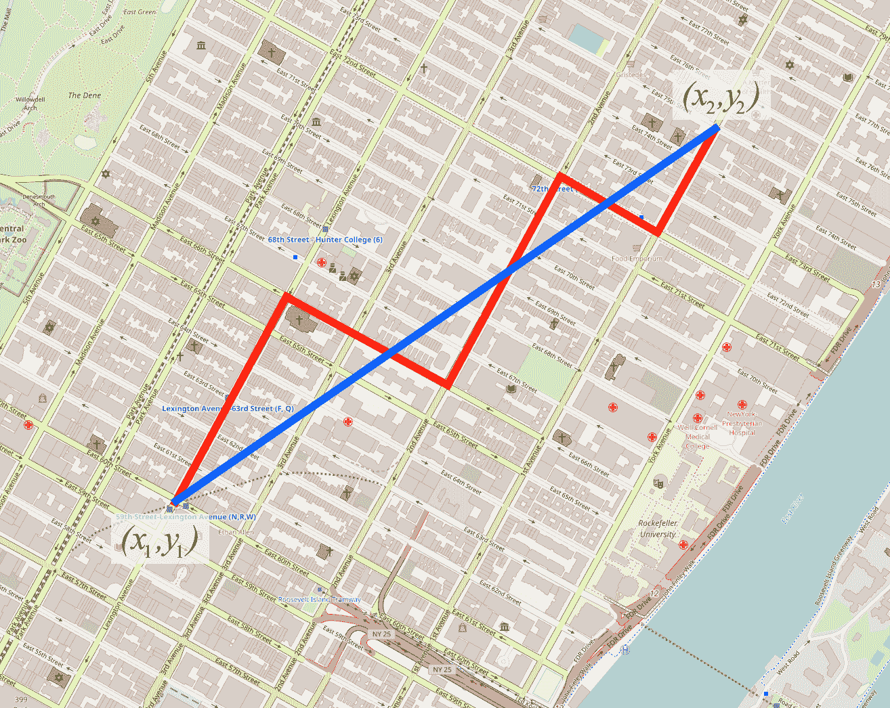
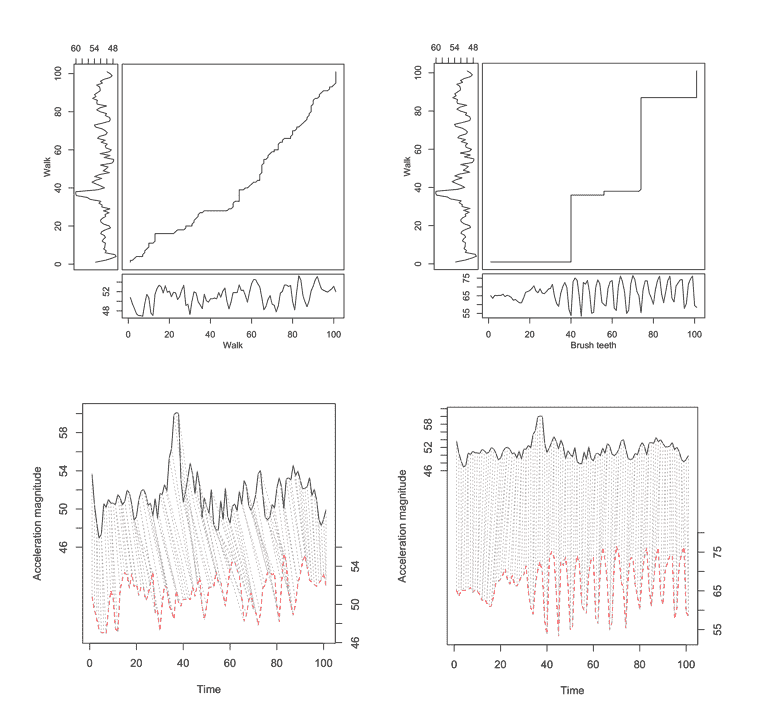
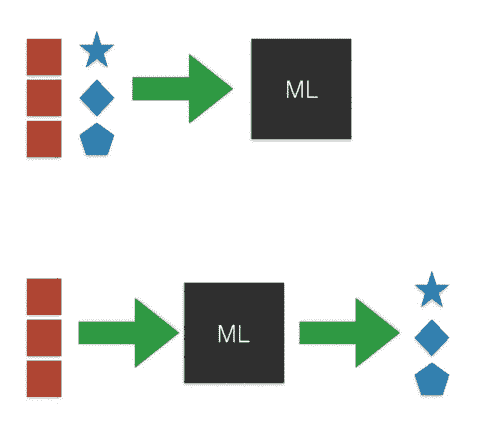
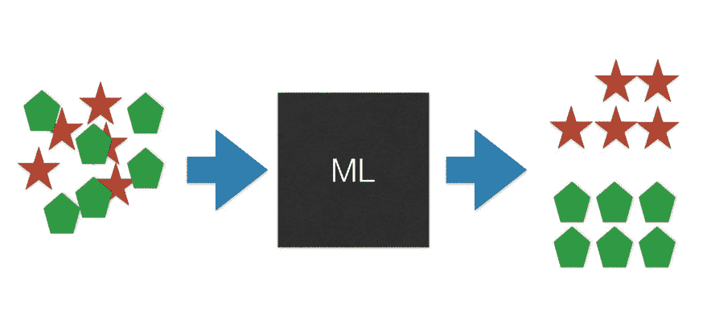
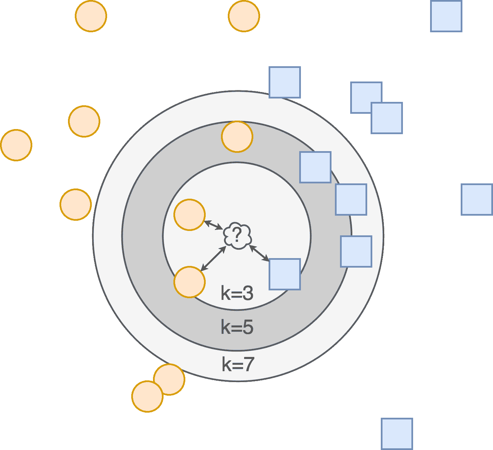
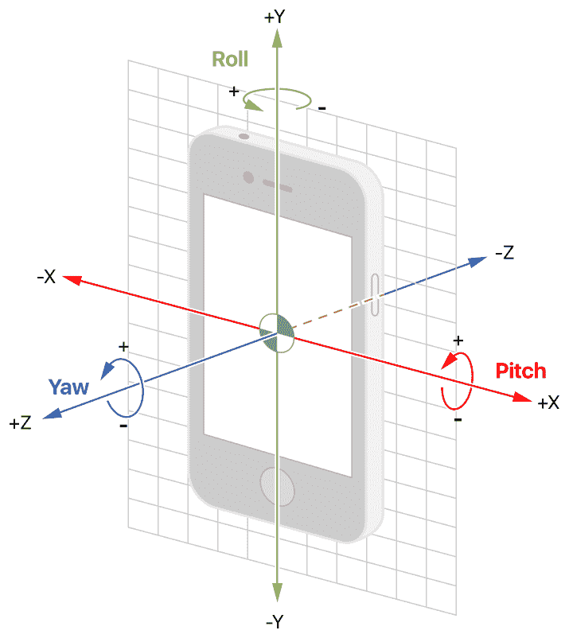
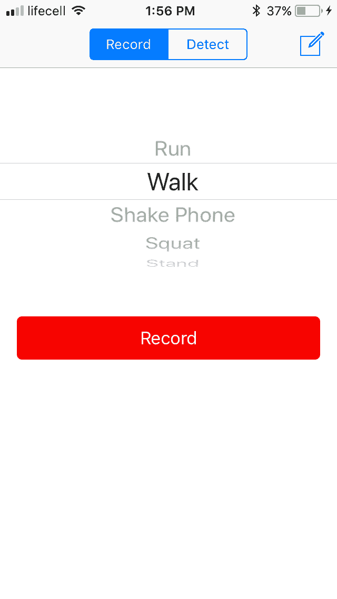
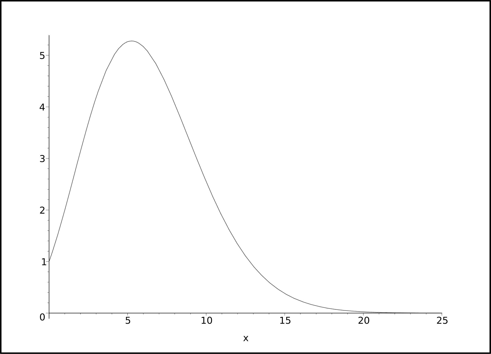

<title>K-Nearest Neighbors Classifier</title>  

# k 近邻分类器

本章致力于一类重要的机器学习算法，称为基于实例的模型。该名称来源于这样一个事实，即它们是围绕实例之间的相似性(距离)及其背后的几何直觉的概念而建立的。作为我们新学到的技能的实际应用，我们将构建一个应用程序，它可以根据来自运动传感器的数据识别用户运动的类型，并完全在设备上学习(这次没有 Python)。

我们在本章讨论和实现的算法有 **k 近邻** ( **KNN** )和**动态时间规整** ( **DTW** )。

在本章中，我们将讨论以下主题:

*   选择距离度量-欧几里得、编辑距离、出租车和 DTW
*   构建 KNN 多类分类器
*   机器学习模型背后的几何直觉
*   高维空间中的推理
*   选择超参数

<title>Calculating the distance</title>  

# 计算距离

我们如何计算距离？嗯，那要看是什么样的问题。在二维空间中，我们用来计算两点之间的距离，( *x* [1] ， *y* [1] )和( *x* [2] ， *y* [2] )，为—**欧几里德距离**。但这不是出租车司机计算距离的方式，因为在城市里，你不能抄近路，直奔目标。所以，他们使用(不知不觉)另一种距离度量:**曼哈顿距离**或**出租车距离**，也称为 *l* [1-] 定额:。如果只允许我们沿着坐标轴移动，这就是距离:



图 3.1:蓝线代表欧几里德距离，红线代表曼哈顿距离。由 OpenStreetMap 提供的曼哈顿地图

犹太德国数学家赫尔曼·闵可夫斯基提出了欧几里得距离和曼哈顿距离的推广。闵可夫斯基距离的公式如下:


其中 *p* 和 *q* 是*n*-维向量(或者是*n*-维空间中的点的坐标，如果你愿意的话)。但是 *c* 代表什么呢？它是闵可维距离的一个顺序:在 *c = 1* 下给出曼哈顿距离的一个等式，在 *c = 2* 下给出欧氏距离。

矢量运算，包括曼哈顿和欧几里德距离的计算，可以并行化以提高效率。苹果的 Accelerate 框架为快速矢量和矩阵计算提供了 API。

在机器学习中，我们将距离的概念推广到任何类型的对象，我们可以使用一个函数来计算它们有多相似:距离度量。这样，我们可以定义两个文本、两个图片或两个音频信号之间的距离。我们来看两个例子。

当你处理两个长度相等的文本时，你使用**编辑距离**；例如，**汉明距离**—将一个字符串转换成另一个字符串所需的最少替换次数。为了计算编辑距离，我们使用了动态规划，这是一种迭代方法，将问题分解为小的子问题，并记住每一步的结果以供将来计算。编辑距离是处理文本修订的应用程序中的一个重要度量；例如，在生物信息学中(见下图):


图 3.2:来自不同物种的四段 DNA 排列在一起:现代人、尼安德特人、大猩猩和猫。现代人与他人的汉明编辑距离分别为 1、5、11。

通常，我们将不同的信号(音频、运动数据等)存储为数字数组。我们如何度量这两个数组的相似性？我们使用欧几里得距离和编辑距离的组合，称为 DTW。

<title>DTW</title>  

# DTW

尽管它有一个科幻的名字，DTW 与时间旅行没有什么关系，除了这项技术在 20 世纪 80 年代的语音识别中很流行。将两个信号想象成沿时间轴定向的两个弹簧。我们将它们并排放在桌子上，想要测量它们有多相似(或者有多不同...什么一样？)他们是。其中一个将作为模板。我们开始一点一点地拉伸和压缩另一个，直到它看起来和第一个一模一样(或者最相似)。然后，我们考虑我们在对齐两个弹簧上投入了多少努力——我们将所有的张力和拉伸加在一起，得到 DTW 距离。

两个声音信号之间的 DTW 距离告诉我们它们彼此有多相似。例如，有了未知语音命令的记录，我们可以将其与数据库中的语音命令进行比较，并找到最相似的命令。DTW 不仅可以用于音频，还可以用于许多其他类型的信号。我们将使用它来计算运动传感器信号之间的距离:



图 3.3:两个加速度计信号的 DTW 对准。左边:行走样本对着另一个行走样本。右边:刷牙反对走路。排列越短，两个信号越接近。使用[1]和[2]创建的图。

让我们用一个简单的例子来说明这一点。假设我们有两个数组:*【5，2，1，3】*和*【10，2，4，3】*。我们如何计算长度为 1 的两个数组之间的距离:*【5】*和【10】？你可以用平方差作为衡量标准；比如 *(5 - 10) ² = 25* 。好了，现在我们来延伸其中一个:*【5，2】*和*【10】，*并计算累计差值:

|  | **【5】** | **【2】** |
| **【10】** | *25* | *25+(2-10)²= 89* |

让我们扩展另一个数组，使其具有*【5，2】*和*【10，2】*。现在，如何计算累积差异并不像以前那样清楚，但让我们假设我们对将一个数组转换为另一个数组的最简单方法感兴趣(换句话说，最小距离):

|  |  | **【2】** |
| **【10】** | *25* | *89* |
| **【2】** | *25 + (5-2) ² = 34* | *最小值(25，89，34) + (2-2) ² = 25* |

通过以这种方式进一步扩展数组，最终我们将得到下表:

|  | **【5】** | **【2】** | **【1】** | **【3】** |
| **【10】** | *25* | *89* | *89 + (1-10) ² = 170* | *170 + (3-10) ² = 219* |
| **【2】** | *34* | *25* | *min (89，170，25)**+ (1-2) ² = 26* | *min (170，219，26)**+ (3-2) ² = 27* |
| **【4】** | *34+(5-4) ² =35* | *最小(34，25，35)**+ (2-4) ² = 29* | *最小(25，26，29)**+ (1-4) ² = 34* | *min (26，27，34)**+ (3-4) ² = 27* |
| **【3】** | *35+(5-3) ² =39* | *最小(35，29，39)**+ (2-3) ² = 30* | *min (29，34，30)**+ (1-3) ² = 33* | *min (34，27，33)**+ (3-3) ² = 27* |

表格右下角的单元格包含我们感兴趣的量:两个数组之间的 DTW 距离，这是一个数组转换成另一个数组的难易程度的度量。我们刚刚检查了转换数组的所有可能方法，并找到了其中最简单的方法(在表中用灰色阴影标记)。沿着表的对角线移动表示数组之间完全匹配，水平方向表示从第一个数组中删除元素，垂直方向表示插入元素(与*图 3.3* 比较)。最终的数组对齐如下所示:

*【5，2，1，3，-】*

*【10，2，-，4，3】*

顺便说一下，DTW 不仅可以应用于单一数字的数组。用欧几里得距离或曼哈顿距离代替平方差，你就可以比较三维空间中的轨迹或滑行路线。

<title>Implementing DTW in Swift</title>  

# 在 Swift 中实施 DTW

该算法有两个版本(有局部性约束和没有局部性约束)。我们将两者都实现。

我们在本章中开发的应用程序的完整源代码可以在补充材料的`MotionClassification`文件夹中找到。

让我们定义一个 DTW 结构，并在其中创建一个静态函数`distance`:

```
func distance(sVec: [Double], tVec: [Double]) -> Double { 
```

首先，我们创建一个大小为 *(n+1* x *m+1)* *，*的距离矩阵，并用一些值填充它:矩阵的第一个单元格应该等于零，第一行和第一列应该等于最大 double 值。这是以后以适当的方式处理边界条件所需要的。第一个单元格起初始值的作用:最初，距离为零。所有其他单元格现在都不重要，因为我们稍后将覆盖它们的值:

```
let n = sVec.count 
let m = tVec.count 
var dtwMat = [[Double]](repeating: [Double](repeating: Double.greatestFiniteMagnitude, count: m+1), count: n+1) 
dtwMat[0][0] = 0 
```

之后，我们从 *1* 到 *n* 和 *1* 到 *m* 遍历两个数组，填充距离矩阵。在每个位置*【I，j】*，我们计算前一个位置 *(i-1，j-1)* 的代价，作为数组中相应位置的平方差:*(s[I-1]-t[j-1])²*:

```
for i in 1...n { 
  for j in 1...m { 
    let cost = pow(sVec[i-1] - tVec[j-1], 2) 
    let insertion = dtwMat[i-1][j] 
    let deletion = dtwMat[i][j-1] 
    let match = dtwMat[i-1][j-1] 
    let prevMin = min(insertion, deletion, match) 
    dtwMat[i][j] = cost + prevMin 
  } 
} 
```

我们现在寻找的值在矩阵的最后一个单元格: *dtw[n，m]* 。为了使不同长度的系列之间的结果具有可比性，我们根据最长系列的长度对其进行归一化:

```
    return dtwMat[n][m]/Double(max(n, m))  
} 
```

这给出了两个系列之间的平均距离。

为了避免将整个序列扭曲到其对应部分的小片段，引入了位置约束。它设置了一行中可以找到的删除/插入次数的上限。

以及一个带有局部约束的算法版本`w`:

```
func distance(sVec: [Double], tVec: [Double], w: Int) -> Double { 
    let n = sVec.count 
    let m = tVec.count 
    var dtwMat = [[Double]](repeating: [Double](repeating: Double.greatestFiniteMagnitude, count: m+1), count: n+1) 
    dtwMat[0][0] = 0 
    let constraint = max(w, abs(n-m)) 

    for i in 1...n { 
        for j in max(1, i-constraint)...min(m, i+constraint) { 
            let cost = pow(sVec[i-1] - tVec[j-1], 2) 
            let insertion = dtwMat[i-1][j] 
            let deletion = dtwMat[i][j-1] 
            let match = dtwMat[i-1][j-1] 
            dtwMat[i][j] = cost + min(insertion, deletion, match) 
        } 
    } 
    return dtwMat[n][m]/Double(max(n, m)) 
} 
```

让我们测试我们的算法。前两个向量相似:

```
let aVec: [Double] = [1,2,3,4,5,6,7,6,5,4,3,2,1] 
let bVec: [Double] = [2,3,4,5,7,7,6,5,4,3,2,1,0,-2] 

let distance1 = DTW.distance(sVec: aVec, tVec: bVec) 
let distance2 = DTW.distance(sVec: aVec, tVec: bVec, w: 3) 
```

两种情况下的结果都是 0.857 左右。

现在我们有两个非常不同的向量:

```
let cVec: [Double] = [1,2,3,4,5,6,7,6,5,4,3,2,1,0] 
let dVec: [Double] = [30,2,2,0,1,1,1,14,44] 

let distance3 = DTW.distance(sVec: cVec, tVec: dVec) 
let distance4 = DTW.distance(sVec: cVec, tVec: dVec, w: 3) 
```

结果分别为 216.571 和 218.286。注意，具有局部性约束的距离甚至比没有局部性约束的距离更大。

我们对 DTW 的实现是幼稚的，可以使用并行计算来加速。计算距离矩阵中新的行/列，不需要等到前一个完成；你只需要在你的行/列前面的一个单元格中填充它。使用 GPU 可以有效地并行化 DTW。参见*使用 GPU 和 FPGAs 加速动态时间弯曲子序列搜索*了解更多详细信息【3】。

<title>Using instance-based models for classification and clustering</title>  

# 使用基于实例的模型进行分类和聚类

基于实例的机器学习算法通常容易理解，因为它们背后有一些几何直觉。它们可以用来执行不同种类的任务，包括分类、回归、聚类和异常检测。

一开始很容易混淆分类和聚类。提醒你一下，分类是众多监督学习类型中的一种。任务是从特征集合中预测一些离散标签(*图 3.4* ，左侧窗格)。从技术上讲，分类有两种类型:二进制(检查*是*或*否*)和多类(*是* / *否* / *可能是* / *我不知道* / *你能重复一下问题吗？*)。但是在实践中，您总是可以从几个二元分类器构建一个多类分类器。

另一方面，聚类是无监督学习的任务。这意味着，与分类不同的是，它对数据标签一无所知，并自行计算出数据中相似样本的聚类。在下一章中，我们将讨论一种基于实例的聚类算法，称为 *k* -means (KNN)，在这一章中，我们将重点讨论基于实例的算法 KNN 在多类分类中的应用:

  

图 3.4:分类过程(左边)和聚类(右边)。分类包括两个步骤:用标记数据进行训练，用未标记数据进行推理。聚类根据样本的相似性对样本进行分组。

<title>People motion recognition using inertial sensors</title>  

# 使用惯性传感器的人体运动识别

在每天结束时看到它的统计数据:你花了多少时间做你喜欢的事情，又浪费了多少时间，这不是很棒吗？有了这种报告，你可以根据真实的数据做出时间管理决策，而不仅仅是直觉。等等，但是 App Store 上有很多时间追踪器，对吧？当然，但大多数都有一个问题:你必须手动填写，因为它们无法检测到你每时每刻都在做什么。你不能教他们识别你的活动类型。幸运的是，我们可以使用机器学习来解决这个问题；具体来说，**时间序列分类**。

时间序列是一种特殊的数据集，其中的样本按时间排列。通常，时间序列是在等时间间隔(采样间隔)后重复采样时生成的。换句话说，时间序列是在规则的时间间隔之后，在连续时刻测量的一系列值，并描述在时间维度上展开的过程。

时间序列数据类型在 iOS 应用中很常见:例如来自惯性传感器的信号、来自 HealthKit 的测量值以及任何其他具有明确时间对应关系并定期采样的数据。一些其他类型的数据，如应用程序日志或用户活动记录，可以简化为一种特殊类型的时间序列:分类时间序列，其中类别代替了数字。

运动识别任务在健康监控和健身应用中非常重要，但也可能有一些不寻常的用例。比如，*送我上去！闹钟*应用程序让你起床，因为它不允许你打盹，直到你采取一些措施。它通过摇动设备来区分真实的步骤和欺骗的企图。

核心运动框架提供 API 来获取用户的运动历史或来自运动传感器的实时数据流。它还可以区分有限的运动类型，但我们将教会我们的应用程序识别比核心运动更多的类型。随着可穿戴附件的普及，运动传感器成为非常常见的数据源；然而，本章中描述的方法并不特定于传感器数据，因此您可以将这些算法应用于许多其他实际问题。这就是通用机器学习算法的好处:你可以将它们应用于任何类型的数据，你只需要找到数据的适当表示。

<title>Understanding the KNN algorithm</title>  

# 理解 KNN 算法

为了识别不同类型的运动活动，我们将训练 KNN 分类器。该方法的思想是找到与带有未知标签的样本最接近的 *k* 个训练样本，并将该标签预测为这些 *k* 中最频繁出现的类别。就是这样:



图 3.5: KNN 分类算法。标记为的新数据点。根据其邻居的类别进行分类。

请注意邻域数的选择如何影响分类结果。

事实上，该算法非常简单，以至于人们很容易用更复杂的术语来表述它。让我们开始吧。KNN 的秘方是距离度量:函数，它定义了两个样本之间的距离。我们已经讨论了其中的几个:欧几里德，曼哈顿，闵可夫斯基，编辑距离和 DTW。按照术语，样本是某个 *n* 维空间中的点，其中 *n* 等于每个样本中的特征数量。这个空间被称为**特征空间**，样本以点云的形式分布在其中。未知数据点的分类分三步进行:

1.  计算训练集中该点到所有点的距离
2.  选择距离未知点最近的 *k-*
3.  在他们中间进行多数投票

将一类点与另一类点分开的表面称为**决策边界**。KNN 算法通过添加越来越多的训练样本来创建分段线性决策边界，该决策边界可以逼近任何复杂度的决策边界:


图 3.6: Voronoi 像元图用颜色显示了每个点的最近邻。根据您选择的距离度量，图表看起来会有很大不同。从左到右:曼哈顿( *c = 1* )、欧几里德( *c = 2* )、闵可夫斯基( *c = 3* )距离度量。

类似 KNN 的算法也被称为**非一般化机器学习**。在第 6 章、*线性回归和梯度下降*中，我们将讨论线性回归，这是一种构造所有数据点的一般表示的算法——直线，因为它假设所有数据点都位于直线上。与线性回归不同，KNN 不对数据的底层结构做任何假设，它只是存储所有的训练样本。这两种方法各有利弊。

你可能认为这个算法太简单了，除了一些玩具任务之外，不能用于任何事情。但是多年来，KNN 已经被证明成功地应用于广泛的问题，例如手写识别和卫星照片分类。同样值得注意的是，很容易将这种分类算法转化为回归——您只需要用实数替换分类标签，并添加插值函数。

参数与非参数模型
线性回归的许多限制来自于假设数据呈正态分布。对基础数据的统计分布做出明确假设的统计模型被称为**参数模型**。

与线性回归不同，KNN 对样本的分布不做任何假设。这就是为什么我们称它们为**非参数**。这是在数据具有不寻常分布和决策边界不规则的情况下选择的正确工具。

<title>Implementing KNN in Swift</title>  

# 在 Swift 中实施 KNN

KNN 和 DTW 的快速实现可以在许多机器学习和 DSP 库中找到，例如`lbimproved`和`matchbox` C++库:

*   [github.com/lemire/lbimproved](http://github.com/lemire/lbimproved)
*   [github.com/hfink/matchbox](http://github.com/hfink/matchbox)

KNN 分类器适用于几乎任何类型的数据，因为您定义了数据点的距离度量。这就是为什么我们将它定义为一个用特性和标签的类型参数化的通用结构。标签应该符合一个`Hashable`协议，因为我们将把它们用于字典键:

```
struct kNN<X, Y> where Y: Hashable { ... } 
```

KNN 有两个超参数:*k*——邻居数量`var k: Int`和距离度量。我们将在别处定义它，并在初始化期间传递。度量是一个函数，返回任意两个样本`x1`和`x2`的双倍距离:

```
var distanceMetric: (_ x1: X, _ x2: X) -> Double 
```

在初始化过程中，我们只记录结构内部的超参数。`init`的定义是这样的:

```
init (k: Int, distanceMetric: @escaping (_ x1: X, _ x2: X) -> Double) { 
    self.k = k 
    self.distanceMetric = distanceMetric 
}  
```

KNN 存储了所有的训练数据点。为此，我们使用了一组对*(特征，标签)*:

```
private var data: [(X, Y)] = []  
```

与监督学习模型一样，我们将坚持使用两种方法的接口，`train`和`predict`，它们反映了监督算法生命的两个阶段。在 KNN 的情况下，`train`方法只是保存数据点，以便稍后在`predict`方法中使用:

```
mutating func train(X: [X], y: [Y]) { 
    data.append(contentsOf: zip(X, y)) 
} 
```

`predict`方法获取数据点并预测其标签:

```
func predict(x: X) -> Y? {  
    assert(data.count > 0, "Please, use method train() at first to provide training data.") 
    assert(k > 0, "Error, k must be greater then 0.") 
```

为此，我们遍历训练数据集中的所有样本，并将它们与输入样本`x`进行比较。我们使用*(距离，标签)*元组来跟踪到每个训练样本的距离。在这之后，我们将所有的样本按距离降序排列，取(`prefix`)第一个`k`元素:

```
    let tuples = data 
        .map { (distanceMetric(x, $0.0), $0.1) }  
        .sorted { $0.0 < $1.0 }  
        .prefix(upTo: k) 
```

这种实现并不是最佳的，可以通过在每一步只跟踪最好的`k`样本来改进，但它的目标是展示最简单的机器学习算法，而无需深入复杂的数据结构，并表明即使是这样的天真版本也可以在复杂的任务中表现良好。

现在我们在顶级`k`样本中安排多数投票。我们统计每个标签出现的频率，并按降序排列:

```
let countedSet = NSCountedSet(array: tuples.map{$0.1}) 
let result = countedSet.allObjects.sorted { 
    countedSet.count(for: $0) > countedSet.count(for: $1) 
    }.first 
return result as? Y 
} 
```

`result`变量保存一个预测的类标签。

<title>Recognizing human motion using KNN</title>  

# 利用 KNN 识别人体运动

Core Motion 是一个 iOS 框架，为移动设备的惯性传感器提供了一个 API。它还可以识别一些用户运动类型，并将它们存储到 HealthKit 数据库中。

如果不熟悉 Core Motion API，请查看框架参考:[https://developer.apple.com/reference/coremotion](https://developer.apple.com/reference/coremotion)。

本例的代码可以在补充资料的`Code/02DistanceBased/ MotionClassification`文件夹中找到。

根据 iOS 11 beta 2，`CMMotionActivity`类包括以下运动类型:

*   静止的
*   步行
*   运转
*   汽车的
*   自行车运动

其他一切都属于一个未知的类别或被认为是上述之一。核心运动没有提供识别自定义运动类型的方法，因此我们将为此训练自己的分类器。与前一章的决策树不同，KNN 将接受端到端的设备培训。它也不会冻结在 Core ML 中，因为我们保留了对它的所有控制，我们将能够在应用程序运行时更新它。

iOS 设备有三种类型的运动传感器:

*   **陀螺仪**:测量设备在空间中的方位
*   **加速度计**:测量设备加速度
*   **磁力计或指南针**:测量磁力

他们也有一个气压计来检测海拔和其他一些传感器，但它们与我们的目的不太相关。我们将使用加速度计数据流来训练我们的 KNN 分类器，并预测不同的运动类型，如摇动手机或蹲下。

以下清单显示了如何从加速度计获取更新:

```
let manager = CMMotionManager() 
manager.accelerometerUpdateInterval = 0.1 
manager.startAccelerometerUpdates(to: OperationQueue.main) { (data: CMAccelerometerData?, error: Error?) in 
    if let acceleration = data?.acceleration { 
        print(acceleration.x, acceleration.y, acceleration.z) 
    } 
} 
```

Core Motion 中的加速度计 API 提供了一系列三维向量，如下图所示:



图 3.7:加速度计和陀螺仪的核心运动坐标系

为了训练我们的分类器，我们需要一些标记数据。由于我们没有现成的数据集，并且运动信号可能因人而异，我们将允许用户添加新的样本并改进模型。在界面中，用户选择他想要记录的运动类型，并按下 record 按钮，如下一个截图所示。应用程序对 25 个加速度向量进行采样，获取每个向量的幅度，并将它们与所选运动类型的标签一起馈送到 KNN 分类器中。用户可以记录任意多的样本。

<title>Cold start problem</title>  

# 冷启动问题

一个非常常见的情况是，当机器学习系统开始在一个新的环境中运行时，没有可用于预训练的信息。这种情况被称为**冷启动**。这样的系统需要一定的时间来收集足够的训练数据，并开始产生有意义的预测。这个问题经常出现在个性化和推荐系统的环境中。

解决这个问题的一个方法是所谓的**主动学习**，系统可以主动寻找可以提高其性能的新数据。通常，这意味着系统询问用户来标记一些数据。例如，在系统启动之前，可以要求用户提供一些已标记的示例，或者当遇到特别困难的情况要求手动标记时，系统可以 ping 他。主动学习是半监督学习的一个特例。

主动学习的第二个组成部分是通过关联权重来估计哪些样本是最有用的。在 KNN 的情况下，这些样本可能是模型不太确定的样本，例如，其邻居的类几乎被平均划分的样本或远离所有其他样本的样本(异常值)。

然而，一些研究人员指出，主动学习是建立在有缺陷的假设之上的:用户总是有空并且愿意回答问题，他/她的答案总是正确的。这也是构建主动学习解决方案时值得牢记的一点。

我猜当 Twitter 应用程序在凌晨 4 点向你发送推送通知时，比如*看看这个和其他 13 个亮点*，它只是想使用主动学习来更新其小型个性化二进制分类器，该分类器包含*有趣的* / *不有趣的*内容。



图 3.8:应用程序界面

在分类阶段，我们将相同大小的未标记块输入到分类器中，并获得显示给用户的预测。我们使用 DTW 作为带有位置约束的距离度量。在我的实验中，`k`作为`1`给出了最好的结果，但是你可以用其他数量的邻居进行实验。这里我只展示机器学习部分，没有数据收集部分和用户界面。

创建分类器:

```
classifier = kNN(k: 1, distanceMetric: DTW.distance(w: 3)) 
```

训练分类器:

```
self.classifier.train(X: [magnitude(series3D: series)], y: [motionType]) 
```

`magnitude()`函数通过计算矢量幅度将三维序列转换为一维序列，以简化计算。

做出预测:

```
let motionType = self.classifier.predict(x: magnitude(series3D: series)) 
```

<title>Balanced dataset</title>  

# 平衡数据集

该应用程序允许您记录不同运动类型的样本。在训练模型时，您可能会注意到一个有趣的效果:要获得准确的预测，不仅需要足够的样本，还需要数据集中不同类的比例大致相等。想想看:如果你有两个类(`walk`和`run`)的 100 个样本，其中 99 个属于一个类(`walk`)，那么提供 99%准确率的分类器可能是这样的:

```
func predict(x: [Double]) -> MotionType { 
   return .walk 
} 
```

但这显然不是我们想要的。

这个观察引导我们到平衡数据集的概念；对于大多数机器学习算法来说，您希望不同类别的样本在数据集中被同等频繁地表示。

<title>Choosing a good k</title>  

# 选择一个好 k

选择超参数 *k* 的适当值很重要，因为它可以提高模型的性能，如果选择不当也会降低性能。一个流行的经验法则是取训练样本数量的平方根。许多流行的软件包使用这个启发式算法作为默认的 k 值。不幸的是，由于数据和距离度量的差异，这并不总是很好。

从一开始就没有基于数学的方法来得出最佳邻居数量。唯一的选择是扫描一系列的 *k* s，并根据一些性能指标选择最佳的一个。您可以使用我们在上一章已经描述过的任何性能指标:准确性、 *F1* 等等。当数据不足时，交叉验证尤其有用。

事实上，有一个 KNN 的变体，它根本不需要 *k* 。这个想法是让算法以一个球的半径来搜索球内的邻居。然后，根据点的局部密度， *k* 对于每个点将是不同的。这种算法的变体被称为**基于半径的邻居学习**。它受到*n*-球体积问题的困扰(见下一节)，因为你拥有的功能越多，半径就应该越大，以捕捉至少一个邻居。

<title>Reasoning in high-dimensional spaces</title>  

# 高维空间中的推理

处理高维特征空间需要特别的心理预防，因为我们用来处理三维空间的直觉开始失效。例如，让我们看看 *n* 维空间的一个特殊性质，称为 *n* 球体积问题。*N*-球只是 *n* 维欧氏空间中的一个球。如果我们将这种*n*-球( *y* 轴)的体积绘制成多个维度( *x* 轴)的函数，我们将看到下图:



图 3.9:*n*-球在 *n* 维空间中的体积

请注意，在开始时，音量会上升，直到在五维空间中达到峰值，然后开始下降。这对我们的模型意味着什么？具体来说，对于 KNN，这意味着从五个要素开始，您拥有的要素越多，以您要分类的点为中心的球体半径就应该越大，以覆盖 KNN。

高维空间中出现的反直觉现象俗称为**维度诅咒**。这包括了我们过去处理的三维空间中无法观察到的广泛现象。Pedro Domingos 在他的*中提供了一些关于机器学习的例子:*

“在高维空间中，一个多元高斯分布的大部分质量并不在均值附近，而是在它周围越来越远的壳层中；而且一个高维橙子的大部分体积都在果皮里，而不是果肉里。如果恒定数量的样本均匀分布在高维超立方体中，在某些维度之外，大多数样本比它们的最近邻居更靠近超立方体的面。如果我们通过在超立方体中雕刻来近似一个超球面，在高维空间中，几乎所有超立方体的体积都在超球面之外。这对机器学习来说是个坏消息，因为一种类型的形状通常会被另一种类型的形状所近似。”

具体就 KNN 而言，它同等重视所有方面。当一些特征不相关时，特别是在高维时，这就产生了问题，因为这些不相关的特征引入的噪声抑制了包含在良好特征中的信号。在我们的例子中，我们通过只考虑运动信号中每个三维向量的幅度，绕过了多维问题。

<title>KNN pros</title>  

# KNN 专业

*   如果你不想要使用高级数据结构的优化版本，实现起来很简单。
*   很好理解和解读。该算法在理论上进行了很好的研究，并且对其在不同环境中的数学性质有很多了解。
*   您可以插入任何距离度量。这允许处理复杂的对象，比如时间序列、图表、地理坐标，以及基本上任何可以定义距离度量的东西。
*   算法可用于分类、排名、回归(使用邻居平均值或加权平均值)、推荐，甚至可以提供(一种)概率输出-有多少比例的邻居投票支持此类。
*   在模型中加入新数据或删除过时数据很容易。这使得 KNN 成为在线学习(参见[第一章](71afcfb5-3c3b-4d79-9eb8-e6b759dbb2ff.xhtml)、*机器学习*入门)系统的一个很好的选择。

<title>KNN cons</title>  

# KNN 骗局

*   该算法训练速度快，但推理速度慢。
*   您需要以某种方式选择最佳的 *k* (参见*选择好的 k* 部分)。
*   由于 *k* 的值很小，模型会受到异常值的严重影响；换句话说，容易过度拟合。
*   您需要选择一个距离度量。对于通常的实值特征，可以在许多可用选项中进行选择(参见*计算距离*部分),从而得到不同的最近邻。许多机器学习包中默认使用的度量是欧几里德距离；然而，这种选择只不过是一种传统，对于许多应用来说并不是最佳选择。
*   模型的大小随着新数据的加入而增加。
*   如果有几个相同的样品，但标签不同，该怎么办？在这种情况下，根据样本存储的顺序，结果可能会有所不同。
*   这个模型遭受了维数灾难。

<title>Improving our solution</title>  

# 改进我们的解决方案

我们可以从几个方向着手改进我们的运动识别算法。

<title>Probabilistic interpretation</title>  

# 概率解释

`CMMotionActivity`类为每个预测的运动类型提供一个置信度。我们也可以将这个特性添加到我们的算法中。我们可以返回标签在邻居中的比例，而不是返回一个标签。

<title>More data sources</title>  

# 更多数据源

我们只使用了加速度计，但也可以使用陀螺仪和磁力计。这可以通过几种方式实现:您可以将三个时间序列合并为一个三维时间序列，或者您可以训练三个独立分类器的集成。

我们还将加速度计的 *x* 、 *y* 和 *z* 合并为一个幅度值，但您可以尝试将它们用作单独的时间序列。在这种情况下，对于三个运动传感器，您将有九个时间序列。

<title>Smarter time series chunking</title>  

# 更智能的时间序列分块

我们将时间序列分成 25 个元素长度的块。当运动类型从一种变化到另一种时，这会引入延迟。这也可以通过引入滑动窗口而不是块来相对容易地解决。使用这种方法，我们不需要等待新的块被交付；每当我们从运动传感器获得新值时，我们就记录一帧或预测一个新标签。

<title>Hardware acceleration</title>  

# 硬件加速

KNN 算法本质上是并行的，因为要计算两个数据点之间的距离，您不需要了解其他数据点的任何信息。这使得它成为 GPU 加速的完美候选。正如我们提到的，DTW 也可以针对并行执行进行优化。

<title>Trees to speed up the inference</title>  

# 树木加快了推断速度

数组并不是 KNN 存储器实现的唯一可能的候选者。为了使邻居搜索更快，许多实现使用特殊的数据结构，如 KD 树或球树。

如果您对更多细节感兴趣，请查看 scikit-learn 文档:[http://sci kit-learn . org/stable/modules/neighbors . html # nearest-neighbor-algorithms](http://scikit-learn.org/stable/modules/neighbors.html#nearest-neighbor-algorithms)。

<title>Utilizing state transitions</title>  

# 利用状态转换

一些运动类型之间的转换比其他类型之间的转换更有可能:很容易想象用户如何在静止后开始行走，但很难想象他如何在蹲下后立即开始跑步。建模这种概率状态变化的流行方式是**隐马尔可夫模型** ( **嗯**)，但那是一个很长的故事了。

<title>Summary</title>  

# 摘要

在这一章中，我们实现了一个用于运动数据分类的工作机器学习解决方案，并在一个设备上对其进行了端到端的训练。最简单的基于实例的模型是最近邻分类器。你可以用它来分类任何类型的数据，唯一棘手的是选择一个合适的距离度量。对于特征向量( *n* 维空间中的点),已经发明了许多度量标准，例如欧几里德距离和曼哈顿距离。对于字符串，编辑距离是流行的。对于时间序列，我们应用 DTW。

最近邻法是非参数模型，这意味着我们可以在不考虑统计数据分布的情况下应用它。另一个优点是它非常适合在线学习，并且易于并行化。缺点之一是维数灾难和预测的算法复杂性(懒惰学习)。

在下一章中，我们将继续基于实例的算法，这一次集中在无监督的聚类任务。

<title>Bibliography</title>  

# 文献学

1.  Lichman，M. (2013)，UCI 机器学习知识库([http://archive.ics.uci.edu/ml](http://archive.ics.uci.edu/ml))，加州尔湾:加州大学信息与计算机科学学院，*用于 ADL 识别的数据集，带腕戴加速度计数据集*
2.  Toni Giorgino (2009)，*计算和可视化 dtw 包中的动态时间弯曲比对，*统计软件杂志，31(7)，1-24，doi:10.18637/jss.v031.i07

3.  *利用 GPU 和 FPGAs 加速动态时间弯曲子序列搜索*，多鲁克·萨特、阿卜杜拉·穆恩、瓦利德·纳贾尔、维特·尼恩纳特拉库尔、埃蒙·基奥，发表在 2010 年 ICDM IEEE 会刊上。第 1001-1006 页:[http://alumni.cs.ucr.edu/~mueen/pdf/icdm2010.pdf](http://alumni.cs.ucr.edu/~mueen/pdf/icdm2010.pdf)
4.  Domingos P. 2012，*关于机器学习需要知道的一些有用的事情*，ACM 通讯，10 月，55(10)，第 78-87 页