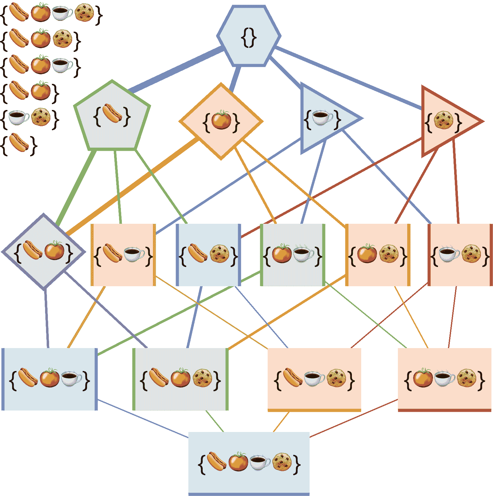
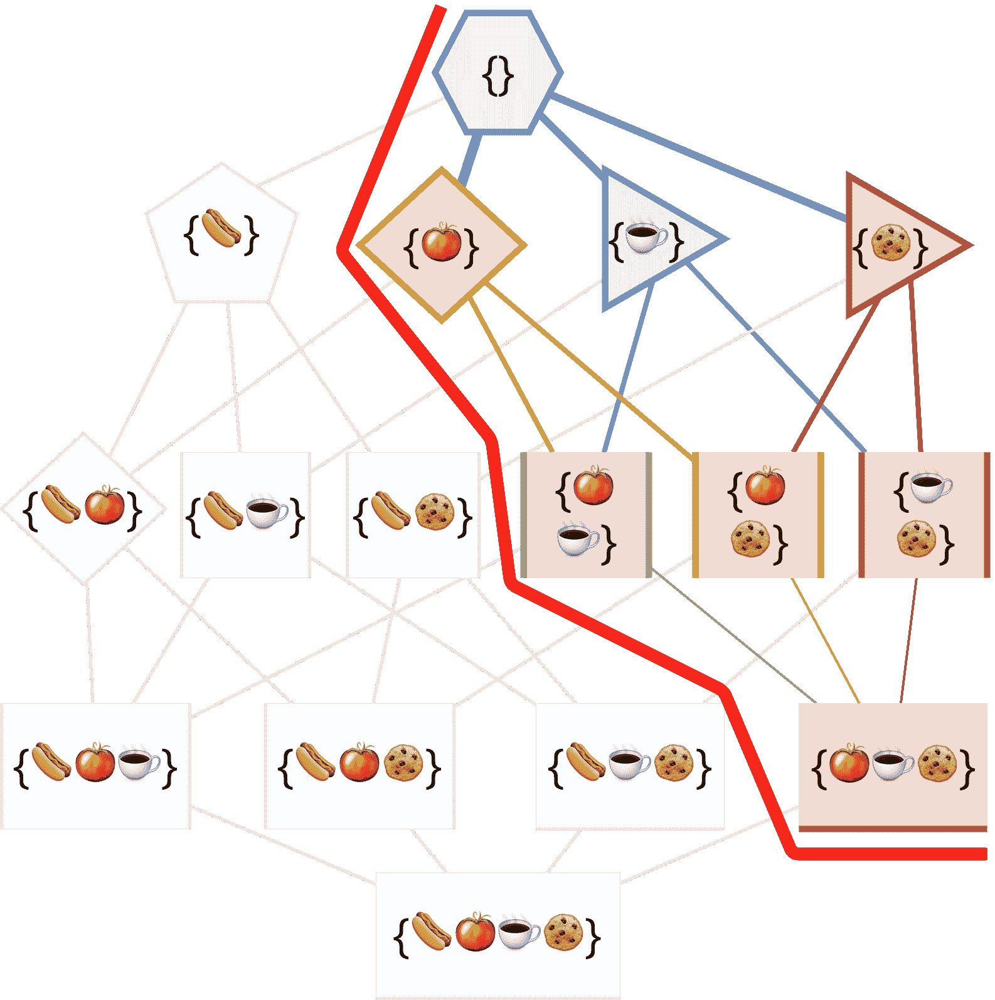
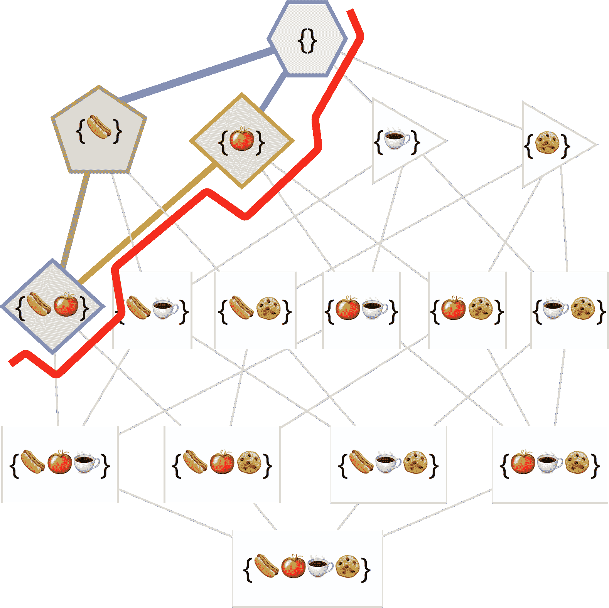

# 五、关联规则学习

在许多实际应用中，数据以列表的形式出现(有序或无序):购物清单、播放列表、访问过的位置或 URL、应用日志等等。有时这些列表是作为业务流程的副产品生成的，但是它们仍然包含对流程改进潜在有用的信息和见解。为了提取一些隐藏的知识，可以使用一种特殊的无监督学习算法——关联规则挖掘。在这一章中，我们将构建一个应用，它可以分析你的购物清单，以规则的形式找出你的偏好，例如“*如果你已经买了燕麦片和玉米片，你还想买牛奶*”这可以用来创建可适应的用户体验，例如，上下文建议或提醒。

在本章中，我们将讨论以下主题:

*   关联规则
*   关联措施
*   关联规则挖掘算法
*   构建适应性强的用户体验


# 查看关联规则

在许多情况下，我们对展示某些项目共现的模式感兴趣。例如，营销人员想知道哪些商品经常一起购买，临床人员需要知道与某些医疗状况相关的症状，在信息安全领域，我们想知道哪些活动模式与入侵或欺诈相关。所有这些问题都有一个共同的结构:在事务(购物清单、医疗案例、用户活动事务)中组织有项目(商品、症状、日志中的记录)。有了这种类型的数据，我们就可以对其进行分析，找出关联规则，比如*如果客户买了一个柠檬，* *买了一些饼干，他也有可能买茶，*或者用更正式的表示法:(饼干，柠檬→茶)。

我们将在本章通篇使用象形图，以便于项目集和规则的可视化符号:{   →  }。

这些规则使我们能够做出明智的决策，例如将相关物品放在同一个货架上，为患者提供适当的护理，以及在怀疑系统中有可疑活动时提醒安全人员。发现这些规则的无监督学习算法被称为**关联规则挖掘**或**关联规则学习**算法。这些被认为是一种无监督学习，因为你不需要标记数据来生成规则。

关联规则学习不是人们通常在关于机器学习的入门书籍中看到的算法类型。这可能是因为它们的用例相对狭窄。然而，在接下来的章节中，我们将会看到规则学习是如何成为一个适应性强的用户界面的引擎，以及如何在其他重要的应用中使用。在这之后，我们希望你会同意这些方法的力量被低估了。


# 定义数据结构

到本章结束时，我们想要的是一个叫做 Apriori 的规则学习算法。稍后我们将了解算法细节；现在，我们只想定义我们将在本章中使用的数据结构，以及一些实用函数。

该算法的一般结构如下:

```swift
public struct Apriori<Item: Hashable & Equatable> { 
```

在最简单的情况下，事务中项目的顺序无关紧要，它们的编号和相关的时间戳也无关紧要。这意味着我们将我们的项目集和交易视为数学或 Swift 集:

```swift
public typealias ItemSet = Set<Item> 
```

参数`I`是您交易中的一种项目。接下来，我们必须为子集和规则实现一些结构:

```swift
class Subsets: Sequence {
  var subsets: [ItemSet]
  init(_ set: ItemSet) {
    self.subsets = Array(set).combinations().map(Set.init)
  }
  func makeIterator() -> AnyIterator<ItemSet> {
    return AnyIterator { [weak self] in
    guard let `self` = self else {
      return nil
    }
    return self.subsets.popLast()
  }
}
public struct Rule {
  let ifPart: Set<I>
  let thenPart: Set<I>
}  
```

Apriori 的结构变量如下:

```swift
public var elements: Set<Int> 
public let transactions: ContiguousArray<ItemSet> 
public let map: [I: Int] 
public let invertedMap: [Int: I] 
```

支撑储存在这里，以防止多重计算:

```swift
public convenience init(transactions: [[I]]) { 
    self.init(transactions: transactions.map(Set<I>.init)) 
} 

public init(transactions: [Set<I>]) { 
    // delete 

    var indexedTransactions = [ItemSet]() 
    var counter = 0 
    var map = [I: Int]() 
    var invertedMap = [Int: I]() 

    for transaction in transactions { 
        var indexedTransaction = ItemSet() 
        for item in transaction { 
            if let stored = map[item] { 
                indexedTransaction.insert(stored) 
            } else { 
                map[item] = counter 
                invertedMap[counter] = item 
                indexedTransaction.insert(counter) 
                counter += 1 
            } 
        } 
        indexedTransactions.append(indexedTransaction) 
    } 

    self.transactions = ContiguousArray(indexedTransactions) 
    self.elements = self.transactions.reduce(Set<Int>()) {$0.union($1)} 
    self.map = map 
    self.invertedMap = invertedMap 

    self.total = Double(self.transactions.count) 
} 
```


# 使用关联度量评估规则

看看这两条规则:

*   {燕麦片、玉米片→牛奶}
*   {狗粮，回形针→洗衣粉}

直觉上，第二条规则看起来比第一条更不可能，不是吗？但是，我们怎么能确定呢？在这种情况下，我们需要一些定量的方法来显示每个规则的可能性。我们在这里寻找的是在机器学习和数据挖掘中我们称之为关联度量。规则挖掘算法围绕这一概念，其方式类似于基于距离的算法围绕距离度量的方式。在本章中，我们将使用四种关联衡量标准:支持、信心、提升和信念(参见*表 5.1* )。

请注意，这些度量没有告诉我们规则有多有用或有趣，只是量化了它们的概率特征。一个规则的有用性和实用性可能很难用数学方法来把握，通常需要在每种情况下进行人工判断。在统计学中，解释分析结果通常是领域专家或开发人员的事情。


# 支持关联措施

假设我们有以下六个购物清单(六个交易),只包含四个项目:热狗、西红柿、茶和饼干。这是我们的数据库:

{}

{T5}

{    }

{   }

{   }

{  }

我们说项目集{   }涵盖了交易 1、3 和 5，因为项目集是这些交易中每一个的子集。我们的例子中有*2^n= 2⁴= 16*个可能的项目集，包括空项目集。

项目集的支持显示了该集作为事务的一部分出现的频率；换句话说，这个项目集中包含多大比例的交易。例如:


假设对空项目集的支持等于数据集中的事务数(在我们的例子中， *supp({}) = 6* )。如果你用一个图来表示所有的项目集(见*图 5.1* ，你可能会注意到支持度总是随着项目集长度的增长而下降。当挖掘关联规则时，我们通常对支持度大于给定阈值的较大项目集感兴趣；例如，对于支持阈值 0.5，这样的项目集是{   } 、{  }和{  }。换句话说，这意味着每个项目集至少涵盖所有交易的一半。

这里，为了方便起见，我们将关联度量提取到单独的结构扩展:

```swift
public extension Apriori { 
  public mutating func support(_ set: ItemSet) -> Double { 
```

我们存储已经计算的支持值，因为它们在算法运行期间不会改变，并且我们将能够防止重复代价高昂的操作。然而，另一方面，这种解决方案增加了内存占用:

```swift
if let stored = supports[set] { 
  return stored 
} 

let support = transactions.filter{set.isSubset(of: $0)}.count 
let total = transactions.count 

let result = Double(support)/Double(total) 
supports[set] = result 

return result 
} 
```



图 5.1:左上角描述的事务的项目集合图。每个项目集的粗体边数描述了支持值(例如，三角形表示支持= 3)。每个节点的传入边的宽度与其支持度成比例。请注意，随着项目集大小的增长，支持度如何从顶部(6)到底部(1)单调下降


# 信任关联度量

置信度关联度量显示一个项目在包括其他项目的交易中出现的可能性:


注意置信度不能大于 *1* 。这一措施的问题是，它没有考虑到该项目的普遍支持；如果{  }在数据集中很常见，那么它很可能会独立于任何关联出现在事务中。

请注意:


在 Swift 中:

```swift
public mutating func confidence(_ rule: Rule) -> Double { 
    return support(rule.ifPart.union(rule.thenPart))/support(rule.ifPart) 
} 
```


# 提升关联措施

提升是由感兴趣的项目的支持标准化的置信度，如下所示:


Lift 考虑了两个集合{   }和{  }的支持。 *lift* > *1* 表示物品正相关，意味着如果箭头前的物品存在，箭头后的物品有可能被购买。*解除* < *1* 暗示一种消极的联想；在我们的例子中，这意味着如果顾客已经买了热狗和西红柿，他就不太可能再往篮子里放茶了。 *Lift* = *1* 表示完全没有关联。

不同于自信:


在 Swift 中:

```swift
public mutating func lift(_ rule: Rule) -> Double { 
    return support(rule.ifPart.union(rule.thenPart))/support(rule.ifPart)/support(rule.thenPart) 
} 
```


# 定罪关联措施

信念是一种有助于判断规则是否碰巧存在的手段。它是由 Sergey Brin 和合著者在 1997 年引入的[1],作为不能捕捉关联方向的信心的替代。定罪是比较*出现的概率如果*没有*那么，*如果它们依赖于*的实际频率如果*没有*那么:*


在命名器中，我们有没有{  }的项目集的预期频率。(换句话说，这个规则不成立的频率。)在分母中，我们观察到了错误预测的频率。在我们的例子中，它表明如果{  }和{  }之间的关联是偶然的，那么规则{  →  }成立的几率大约为 67%(T3 = 1.667)。

| **关联度** | **公式** | **范围** | **注意事项** |
| 支持 | *supp(X)= P(X^+)**supp(X∪Y)= P(X^+∪Y^+)* | [0, 1] | *X* 在数据集中出现的频率如何？ *X* 和 *Y* 一起出现在数据集中的频率？ |
| 信心 |  | [0, 1] | 给定 *X* 的存在， *Y* 也存在的概率有多大？ |
| 电梯 |  | [0, ∞] | *1* 表示 *X* 和 *Y* 之间的独立性，因为对于独立事件 *P(A ∩ B) = P(A)P(B)* 。 |
| 定罪 |  | [0, ∞] | *1* 表示独立，∞表示永远正确。 |

表 5.1:常见关联度量

*X* and *Y* stand for the item sets themselves, and they stand for the events of their presence in a transaction, so *P(X^(+ )∩ Y^+)* denotes the probability that both *X* and *Y* are present in a transaction.

For the comprehensive list of association measures used in rule learning with explanations, formulas, and references, see *A Probabilistic Comparison of Commonly Used Interest Measures for Association Rules* by Michael Hahsler at [http://michael.hahsler.net/research/association_rules/measures.html](http://michael.hahsler.net/research/association_rules/measures.html).<title>Decomposing the problem</title>  

# 分解问题

从数据集中提取具有给定置信度和支持度的所有关联规则的任务并不简单。让我们通过将它分解成更小的子任务来实现它:

*   查找支持度高于给定阈值的所有项目集
*   从置信度高于给定阈值的项目集中生成所有可能的规则


# 生成所有可能的规则

我们需要一个方法来生成这个数组元素的所有可能的组合。组合是通过子集的二进制表示找到的，如下面的代码片段所示:

```swift
public extension Array { 
public func combinations() -> [[Element]] { 
        if isEmpty { return [] } 
        let numberOfSubsets = Int(pow(2, Double(count))) 
        var result = [[Element]]() 
        for i in 0..<numberOfSubsets { 
            var remainder = i 
            var index = 0 
            var combination = [Element]() 
            while remainder > 0 { 
                if remainder % 2 == 1 { 
                    combination.append(self[index]) 
                } 
                index += 1 
                remainder /= 2 
            } 
            result.append(combination) 
        } 
        return result 
    } 
} 
```

下面是使用示例:

```swift
let array = [1,2,3] 
print(array.combinations()) 
```

生产:

```swift
[[], [1], [2], [1, 2], [3], [1, 3], [2, 3], [1, 2, 3]] 
```


# 查找频繁项目集

我们实现的算法的第一步是基于支持度。该函数返回支持度大于`minSupport`的所有项目集的集合:

```swift
func frequentItemSets(minSupport: Double) -> Set<ItemSet> { 

    var itemSets = Set<ItemSet>() 

    let emptyItemSet: ItemSet = ItemSet() 

    supporters[emptyItemSet] = Array(0 ..< transactions.count) 
```

这里我们使用优先级队列数据结构来跟踪可能的扩展。

Foundation 或 Swift 标准库中没有优先级队列实现，标准数据结构不在本书讨论范围之内。我们使用大卫·科佩克的开源实现(麻省理工学院许可):[https://github.com/davecom/SwiftPriorityQueue](https://github.com/davecom/SwiftPriorityQueue)。

为了使它与项目集一起工作，我们必须对代码做一点修改——不是用可比较的类型进行参数化，而是用符合等价协议的类型进行参数化:

```swift
    var queue = PriorityQueue<ItemSet>(order: { (lh, rh) -> Bool in 
        lh.count > rh.count 
    }, startingValues: [emptyItemSet]) 

    while let itemset = queue.pop() { 
        var isMax = true 

        for anExtension in allExtensions(itemset) { 
            if isAboveSupportThreshold(anExtension, extending: itemset, threshold: minSupport) { 
                isMax = false 
                queue.push(anExtension) 
            } 
        } 
        if isMax == true { 
            itemSets.insert(itemset) 
        } 
    } 

    return itemSets 
} 
```

注意，这个算法有一个不好的特性:它多次生成相同的项目集。我们稍后将回到这一点。


# Apriori 算法

关联规则学习最著名的算法是 Apriori。它是由 Agrawal 和 Srikant 在 1994 年提出的。该算法的输入是交易的数据集，其中每个交易是一组项目。输出是支持度和置信度大于某个指定阈值的关联规则的集合。这个名字来自拉丁语短语*先验*(字面意思是“从之前的事情”)，因为算法背后有一个聪明的观察:*如果项目集是不频繁的，那么我们可以预先确定它的所有子集也是不频繁的。*

您可以通过以下步骤实现 Apriori:

1.  计算长度为 1 的所有项目集的支持度，或者计算数据集中每个项目的出现频率。
2.  删除支持度低于阈值的项目集。
3.  存储所有剩余的项目集。
4.  用所有可能的扩展将每个存储的项目集扩展一个元素。这一步被称为候选生成。
5.  计算每个候选人的支持值。
6.  删除所有低于阈值的候选人。
7.  删除第 3 步中所有与其扩展具有相同支持的存储项。
8.  将所有剩余的候选项添加到存储中。
9.  重复步骤 4 到步骤 8，直到不再有支持大于阈值的扩展。

如果你有很多数据，这不是一个非常有效的算法，但无论如何不建议移动应用使用大数据。这种算法在当时很有影响力，在今天也很优雅和容易理解。

如果您希望从数据中提取规则作为服务器端数据处理管道的一部分，您可能希望在`mlxtend` Python 库中检查 Apriori 的实现:[http://rasbt . github . io/mlx tend/user _ guide/frequency _ patterns/Apriori/](http://rasbt.github.io/mlxtend/user_guide/frequent_patterns/apriori/)。

   

图 5.2:通过只排除一个节点，我们可以将可能的规则数量减少两倍。通过排除两个节点，我们将假设空间缩小了四倍


# 在 Swift 中实现先验知识

下面是一个代码的简化版本，可以在补充材料中找到。这里我们将跳过一些不太重要的部分。

返回具有给定支持度和置信度的关联规则的主要方法如下:

```swift
public func associationRules(minSupport: Double, minConfidence: Double) -> [Rule] { 
    var rules = [Rule]() 
    let frequent = frequentItemSets(minSupport: minSupport) 

    for itemSet in frequent { 
        for (ifPart, thenPart) in nonOverlappingSubsetPairs(itemSet) { 
            if confidence(ifPart, thenPart) >= minConfidence { 
                let rule = Rule(ifPart: convertIndexesToItems(ifPart), thenPart: convertIndexesToItems(thenPart)) 
                rules.append(rule) 
            } 
        } 
    } 

    return rules 
} 
func nonOverlappingSubsetPairs(_ itemSet: ItemSet) -> [(ItemSet, ItemSet)] { 
    var result = [(ItemSet, ItemSet)]() 
    let ifParts = Subsets(itemSet) 
    for ifPart in ifParts { 
        let nonOverlapping = itemSet.subtracting(ifPart) 
        let thenParts = Subsets(nonOverlapping) 
        for thenPart in thenParts { 
            result.append((ifPart, thenPart)) 
        } 
    } 
    return result 
} 
```


# 运行先验

最后，这是我们在玩具例子中使用算法的方式:

```swift
let transactions = [["", "", "", ""], 
                    ["", "", ""], 
                    ["", "", ""], 
                    ["", ""], 
                    ["", ""], 
                    ["", ""], 
                    [""] 
] 

let apriori = Apriori<String>(transactions: transactions) 
let rules = apriori.associationRules(minSupport: 0.3, minConfidence: 0.5) 
for rule in rules { 
    print(rule) 
    print("Confidence: ", apriori.confidence(rule), "Lift: ", apriori.lift(rule), "Conviction: ", apriori.conviction(rule)) 
} 
```

它产生以下内容:

```swift
{  → } 
Confidence:  0.8 Lift:  1.4 Conviction:  2.14285714285714 
{  → } 
Confidence:  1.0 Lift:  1.4 Conviction:  inf 
{  → } 
Confidence:  0.75 Lift:  1.3125 Conviction:  1.71428571428571 
{  → } 
Confidence:  0.75 Lift:  1.3125 Conviction:  1.71428571428571 
```

我们来分析一下这是怎么回事。第二条规则具有最大的信心和说服力。


# 对真实世界的数据运行先验

在这个例子中，我们从一个公寓中收集了真实世界的购物清单，并组成了一个小但真实的数据集。让我们看看是否能够使用我们的算法从中提取任何有意义的规则。请注意，这个数据集非常小。对于 Apriori 的任何生产应用，您将需要更大的数据集:

```swift
let transactions =  
[["Grapes", "Cheese"], 
["Cheese", "Milk"], 
["Apples", "Oranges", "Cheese", "Gingerbread", "Marshmallows", "Eggs", "Canned vegetables"], 
["Tea", "Apples", "Bagels", "Marshmallows", "Icecream", "Canned vegetables"], 
["Cheese", "Buckwheat", "Cookies", "Oatmeal", "Banana", "Butter", "Bread", "Apples", "Baby puree"], 
["Baby puree", "Cookies"], 
["Cookies"], 
["Chicken", "Grapes", "Pizza", "Cheese", "Marshmallows", "Cream"], 
["Potatoes"], 
["Chicken"], 
["Сornflakes", "Cookies", "Oatmeal"], 
["Tea"], 
["Chicken"], 
["Chicken", "Eggs", "Cheese", "Oatmeal", "Bell pepper", "Bread", "Chocolate butter", "Buckwheat", "Tea", "Rice", "Corn", "Сornflakes", "Juice", "Sugar"], 
["Bread", "Canned vegetables"], 
["Carrot", "Beetroot", "Apples", "Sugar", "Buckwheat", "Rice", "Pasta", "Salt", "Rice flour", "Dates", "Tea", "Butter", "Beef", "Cheese", "Eggs", "Bread", "Cookies"] 
] 
```

在对阈值进行了一些实验后，您可以看到我们最终得到了 0.15 的支持度和 0.75 的置信度。这给出了您在下表中可以看到的 15 条规则:

```swift
let apriori = Apriori<String>(transactions: transactions) 
let rules = apriori.associationRules(minSupport: 0.15, minConfidence: 0.75) 
```

生成的规则根据其生命周期进行排序:

| **规则** | **信心** | **抬起** | **定罪** |
| {奶酪，面包→荞麦} | 一 | 5.333333333 | ∞ |
| {荞麦→奶酪、面包} | 一 | 5.333333333 | ∞ |
| {奶酪，荞麦→面包} | 一 | 四 | ∞ |
| 荞麦→面包 | 一 | 四 | ∞ |
| {面包→奶酪、荞麦} | 0.75 | 四 | 3.25 |
| 面包→荞麦 | 0.75 | 四 | 3.25 |
| {鸡蛋→奶酪} | 一 | 2.285714286 | ∞ |
| {荞麦，面包→奶酪} | 一 | 2.285714286 | ∞ |
| {荞麦→奶酪} | 一 | 2.285714286 | ∞ |
| {面包→奶酪} | 0.75 | 1.714285714 | 2.25 |
| {苹果→奶酪} | 0.75 | 1.714285714 | 2.25 |

表 5.2: 15 条规则

荞麦是一种流行于东欧、西亚和其他地方的谷物。人们通常吃荞麦粥配黄油和面包(但不是在波兰)。然而，就我们的情况而言，似乎我们更喜欢奶酪而不是黄油，这并不完全正确。11 条规则中有 7 条建议我们购买奶酪，这并不奇怪，因为它是所有交易中最常见的项目。剩下的四条规则指向面包和荞麦之间的联系，这不是偶然的，因为在乌克兰许多人一起消费这些产品，所以这些规则是有效的。这里重要的是，算法能够提取对应于现实世界现象的模式:用户偏好、文化传统等等。


# 先验的利与弊

先验的优点如下:

*   这是关联规则学习算法中最简单易懂的算法
*   产生的规则是直观的，并且易于传达给最终用户
*   它不需要标记数据，因为它是完全无人监督的；因此，您可以在许多不同的情况下使用它，因为未标记的数据通常更容易访问
*   基于这种实现，针对不同的用例提出了许多扩展——例如，有一些关联学习算法考虑到了项目的排序、它们的数量以及相关的时间戳
*   该算法是穷举的，因此它找到了具有指定支持度和置信度的所有规则

先验的缺点如下:

*   如果数据集很小，该算法可以找到许多只是偶然发生的错误关联。您可以通过评估从支持度、置信度、提升度和确信度值的保留测试数据中获得的规则来解决这个问题。
*   正如 Agrawal 和 Srikant 在他们原始论文的结尾所指出的，该算法没有考虑产品的层次结构或交易中购买的商品数量。这些附加信息虽然对购物篮分析有用，但在其他规则挖掘领域可能是不相关的，并且超出了这种特定机器学习方法的范围。
*   该算法计算量很大，但是有许多 Apriori 的变体可以提高算法的复杂性。


# 构建适应性强的用户体验

人机交互从来都不容易。计算机不理解语音、情感或肢体语言。然而，我们都习惯于使用不太智能的按钮、下拉框、选择器、开关、复选框、滑块和数百种其他控件与智能设备进行交流。它们符合一种新的语言，通常称为 UI。缓慢但不可避免的是，机器学习已经进入了计算机与人类直接交互的所有领域:语音输入、手写输入、唇读、手势识别、身体姿势估计、面部情感识别、情感分析等等。这可能不会立即显而易见，但机器学习是 UI 和 UX 的未来。今天，机器学习已经在改变用户与设备的交互方式。基于机器学习的解决方案可能会因其便利性而在 ui 中被广泛采用。此外，排名、上下文建议、自动翻译和个性化也是大多数互联网用户已经习惯的元素。机器学习如何推动用户界面的一个很好的例子是脸书应用，它在设备上运行机器学习(甚至离线)，自动对你的时间线中的帖子进行排序。

在设计界，这种用户交互模式通常被称为**预期**或**算法设计**，并且经常被描述为**新趋势**或**黑魔法**。本质上，你可能在博客或演示中看到的所有预期设计的例子都是机器学习的例子(只是不要告诉设计人员)。机器学习不仅可以推动大数据分析，还可以推动小的 UI 调整，如移动屏幕上的按钮或猜测用户下一步想做什么，并帮助他们做到这一点。这些东西经过适当的设计和测试，可以让你的应用更加有趣和易于使用。这种设计模式的主要目标是当用户使用应用时，将他或她从认知负荷中解放出来。当你开始使用一个新的应用时，通常就像处于一个新的环境中:你知道不同的对象放在哪里，去哪里找到你想要的东西，以及捷径和陷阱在哪里。通过允许计算机也向用户学习，我们可以调整 UX，使用户的学习曲线更陡峭。

Laura Busche 在她的博客*中解释了这个概念，关于《Smashing magazine》的预期设计*你需要知道的是:

“在心理学中，我们使用认知负荷这个术语来描述在任何给定时刻工作记忆中使用的脑力劳动量。对于每个参与用户体验设计的人来说，认知负荷是一个至关重要的考虑因素。我们是否在尽我们所能来减轻由于学习新的东西来使用我们的产品所带来的压力？我们如何减少用户在任何时候都需要担心的元素的数量？减少认知负荷是预期设计的基石之一，因为它有助于通过预见用户的需求来创造更愉快的体验。"

预期设计背后的主要思想是选择更少的原则——换句话说，我们以一种智能的方式减少了用户的选择数量。

实际上，根据你的应用，你可以用很多不同的方式来做到这一点；你可以过滤掉不相关的结果，把最有可能的选项推到列表的顶部或者增加它们的大小，等等。

回到本章的主题，你可以使用关联规则学习来分析你的应用中的用户活动，并缩小他们的可能性空间。例如，在照片编辑应用中，用户对他们的照片应用一组滤镜。当用户选择了第一个过滤器时，可以使用规则来预测接下来最有可能应用哪个过滤器(或者甚至哪组过滤器)。在这里，您可以根据其中一个关联度量对候选人进行排序。在[第 7 章](008b17c3-cc77-41b8-b879-3dc0456af2cb.xhtml)、*线性分类器和逻辑回归*中，您将看到另一个基于监督学习的预期设计示例。


# 摘要

在这一章中，我们探讨了关联规则学习，它是无监督学习的一个分支。我们实现了 Apriori 算法，该算法可用于在不同的事务数据集中发现规则形式的模式。Apriori 的经典用例是购物篮分析。然而，它在概念上也很重要，因为规则学习算法弥合了经典人工智能方法(逻辑编程、概念学习、搜索图形等)和基于逻辑的机器学习(决策树)之间的差距。

在下一章，我们将回到监督学习，但这一次我们将把注意力从非参数模型，如 KNN 和 k-means，转移到参数线性模型。我们还将讨论线性回归和梯度下降优化方法。


# 文献学

1.  Sergey Brin、Rajeev Motwani、Jeffrey D. Ullman 和 Shalom Tsur，*市场购物篮数据的动态项目集计数和隐含规则*，1997 年 SIGMOD，ACM SIGMOD 数据管理国际会议论文集，第 255-264 页，美国亚利桑那州图森，1997 年 5 月
2.  Rakesh Agrawal 和 Ramakrishnan Srikant，*挖掘关联规则的快速算法*，第 20 届^(超大规模数据库国际会议论文集，VLDB，487-499 页，智利圣地亚哥，1994 年 9 月，http://www.vldb.org/conf/1994/P487.PDF:)