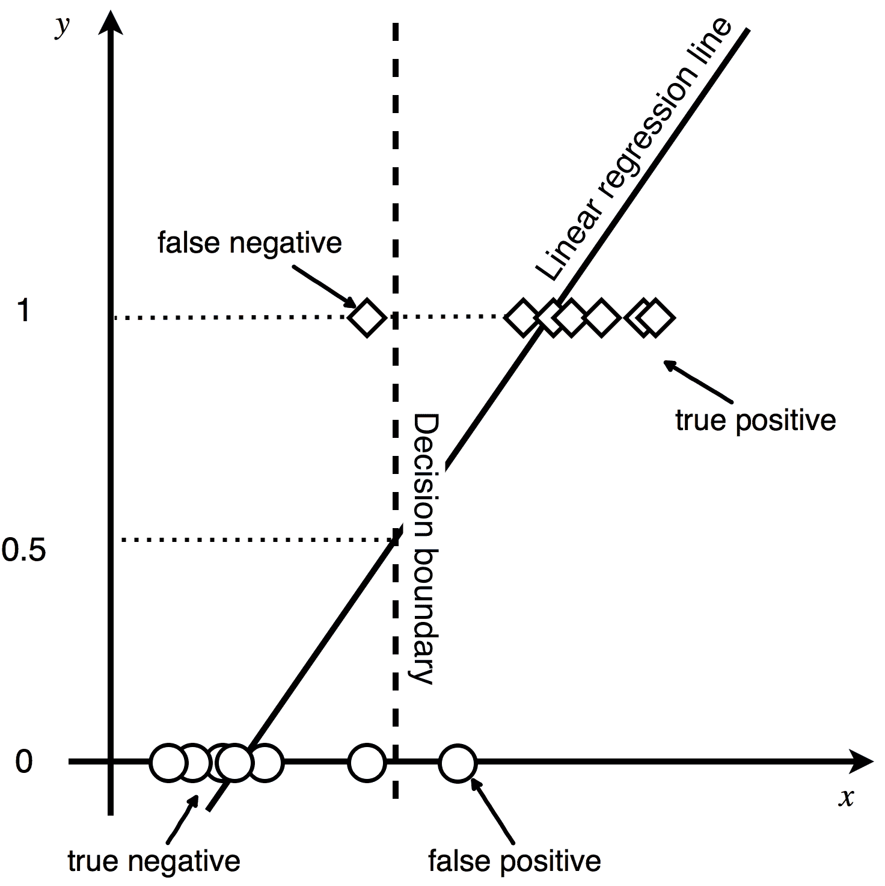
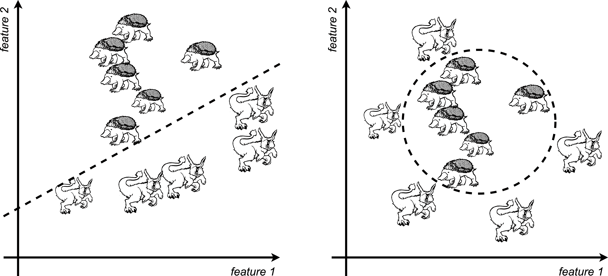
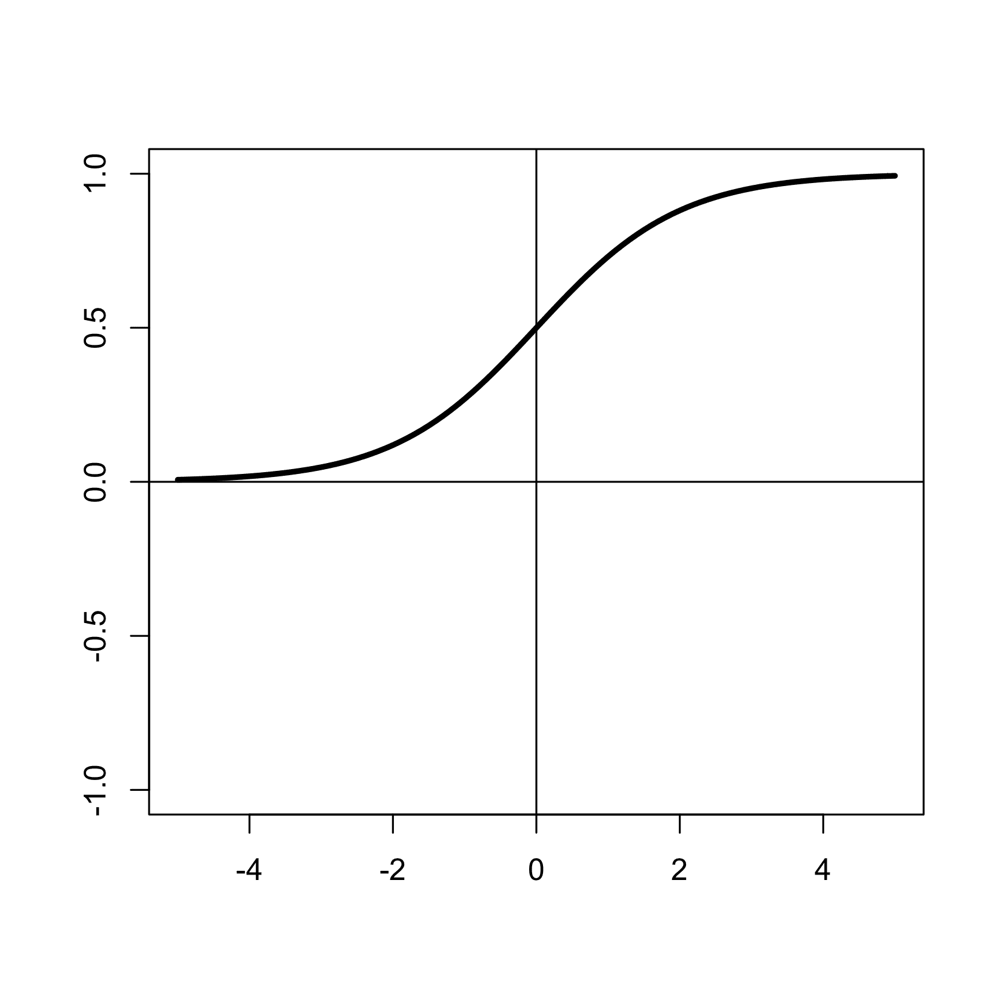
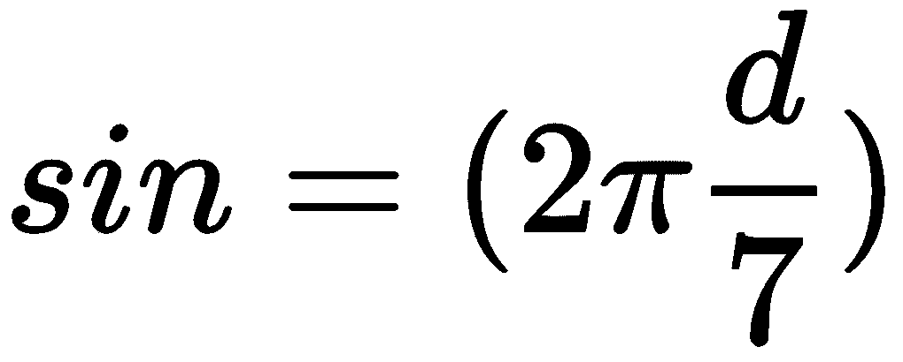
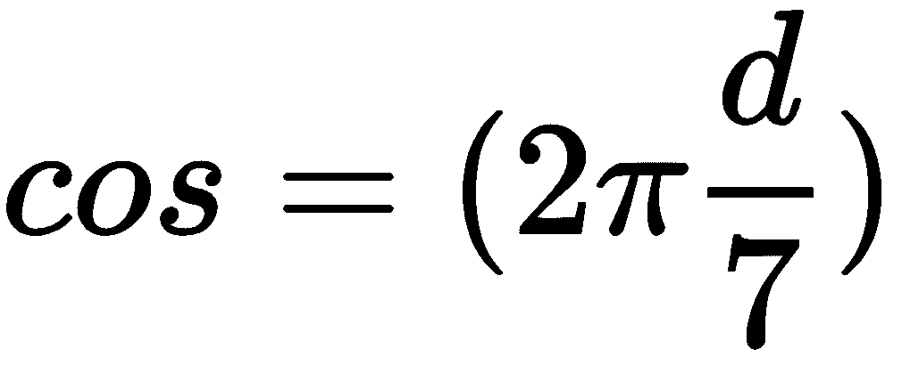
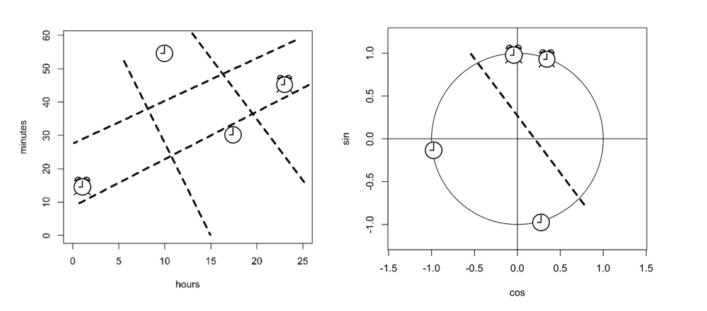
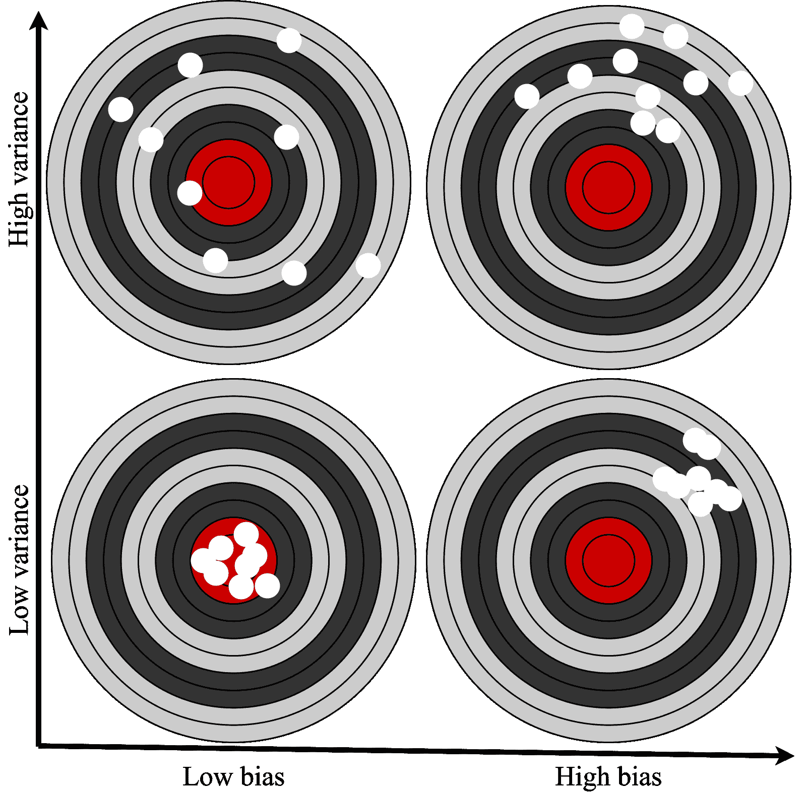

# 七、线性分类器和逻辑回归

在前一章中，我们在工具箱中添加了几个用于回归任务的有用的监督学习算法。继续构建线性回归，在这一章中，我们将构建两个分类算法:**线性分类器**和**逻辑回归**。两者都以熟悉的特征向量作为输入，类似于多元线性回归。不同之处在于它们的产量。线性分类器将输出真或假(二元分类),逻辑回归将提供某些事件发生的概率。

本章要讨论的主题是:

*   偏差和方差
*   线性分类器
*   逻辑回归


# 重新审视分类任务

我们已经在前面的章节中使用并实现了一些分类算法:决策树学习、随机森林和 KNN 都非常适合解决这个任务。然而，正如 Boromir 曾经说过的那样，<q>“一个人不能简单地走进神经网络而不了解逻辑回归”</q>。所以，提醒你一下，分类几乎和回归一样，除了响应变量 *y* 不是连续的(`float`)，而是从某组离散值(`enum`)中取值。在这一章中，我们主要关注二进制分类，其中 *y* 可以是真或假，一或零，并且属于正或负类。

虽然，如果你考虑一下这个问题，通过一个接一个地链接几个二进制分类器来构建一个多类分类器并不太难。在分类领域，响应变量 *y* 通常被称为**标签**。


# 线性分类器

线性回归可以很容易地适用于二元分类:只需预测高于某个阈值的所有回归输出的正类，以及低于该阈值的所有输出的负类。例如，在下图中，阈值为 0.5。具有 *x* < 0.5 的所有内容被分类为负类，而具有 *x* > 0.5 的所有内容被分类为正类。将一个类别的特征值与另一个类别的特征值分开的线被称为**决策边界**。如果有多个特征，决策边界将不是一条线，而是一个超平面:



图 7.1:线性分类器


# 逻辑回归

你会发现线性分类器有很多问题。其中之一是，许多数据集无法用一条直线正确区分:



图 7.2:线性可分(左边)和非线性可分(右边)数据。虚线所示的决策边界。资料来源:Mykola Sosnovshchenko。

另一个问题是，线性回归线可以预测一些样本的负值或大于 1 的值，即使我们肯定知道 *y* 应该是零或一。为了解决这个问题，我们需要一些函数，它接受[-∞，+∞]中的值，并输出从 0 到 1 范围内的值。一种这样的功能是逻辑功能。请参考下面的公式和图表:



图 7.3:逻辑功能

请记住，在线性回归中，我们将假设函数定义为线性变换(向量的点积):


在逻辑回归中，我们添加一个非线性逻辑转换，如下所示:


逻辑回归用于估计某个事件发生或不发生的概率。换句话说，它是一种二元分类算法，输出样本属于一个或另一个类别的概率。逻辑回归输出的典型示例如下:*这封信有 0.95%的几率是垃圾邮件，有 0.05%的几率不是*。

逻辑回归的输出总是在一个范围(0，1)内。我们仍然称这个算法为*回归*，尽管它被用于分类，因为它产生一个连续的输出；然而，这是我们使用微分函数所能得到的最接近离散输出的结果。为什么我们希望它们是不同的？因为我们要用好朋友梯度下降来学习参数向量 *w* 。


# 在 Swift 中实现逻辑回归

该实现与多元线性回归最重要的区别如下:

*   只有特征矩阵 *x* 需要归一化，目标向量 *y* 不需要归一化，因为输出具有范围(0，1)
*   假设是不同的
*   成本函数看起来不同，但成本梯度保持不变

同样，我们需要一些加速功能:

```
import Accelerate 
```

逻辑回归类定义类似于多元线性回归:

```
public class LogisticRegression { 
public var weights: [Double]! 

public init(normalization: Bool) { 
    self.normalization = normalization 
} 

private(set) var normalization: Bool 
private(set) var xMeanVec = [Double]() 
private(set) var xStdVec = [Double]() 
```


# 逻辑回归的预测部分

这是为一个样本输入和一个输入矩阵实现假设的代码:

```
public func predict(xVec: [Double]) -> Double { 
    if normalization { 
        let input = xVec 
        let differenceVec = vecSubtract(input, xMeanVec) 
        let normalizedInputVec = vecDivide(differenceVec, xStdVec) 

        let h = hypothesis(xVec: [1.0]+normalizedInputVec) 

        return h 
    } else { 
        return hypothesis(xVec: [1.0]+xVec) 
    } 
} 

private func hypothesis(xVec: [Double]) -> Double { 
    var result = 0.0 
    vDSP_dotprD(xVec, 1, weights, 1, &result, vDSP_Length(xVec.count)) 
    return 1.0 / (1.0 + exp(-result)) 
} 

public func predict(xMat: [[Double]]) -> [Double] { 
    let rows = xMat.count 
    precondition(rows > 0) 
    let columns = xMat.first!.count 
    precondition(columns > 0) 

    if normalization { 
        let flattenedNormalizedX = xMat.map{ 
            return vecDivide(vecSubtract($0, xMeanVec), xStdVec) 
            }.reduce([], +) 

        // Add a column of ones in front of the matrix. 
        let basisExpanded = prependColumnOfOnes(matrix: flattenedNormalizedX, rows: rows, columns: columns) 
        let hVec = hypothesis(xMatFlattened: basisExpanded) 

        return hVec 
    } else { 
        // Flatten and prepend a column of ones. 
        let flattened = xMat.map{[1.0]+$0}.reduce([], +) 
        return hypothesis(xMatFlattened: flattened) 
    } 
} 

private func hypothesis(xMatFlattened: [Double]) -> [Double] { 
    let matCount = xMatFlattened.count 
    let featureCount = weights.count 
    precondition(matCount > 0) 
    let sampleCount = matCount/featureCount 
    precondition(sampleCount*featureCount == matCount) 
    let labelSize = 1 
    var result = gemm(aMat: xMatFlattened, bMat: weights, rowsAC: sampleCount, colsBC: labelSize, colsA_rowsB: featureCount) 

    // -h 
    vDSP_vnegD(result, 1, &result, 1, vDSP_Length(sampleCount)) 

    // exp(-h) 
    // vForce function for double-precision exponent. 
    var outputLength = Int32(sampleCount) 
    vvexp(&result, result, &outputLength) 

    // 1.0 + exp(-h) 
    var one = 1.0 
    vDSP_vsaddD(result, 1, &one, &result, 1, vDSP_Length(sampleCount)) 

    // 1.0 / (1.0 + exp(-h)) 
    vDSP_svdivD(&one, result, 1, &result, 1, vDSP_Length(sampleCount)) 

    return result 
} 
```


# 训练逻辑回归

训练部分也非常类似于线性回归:

```
public func train(xMat: [[Double]], yVec: [Double], learningRate: Double, maxSteps: Int) { 
  precondition(maxSteps > 0, "The number of learning iterations should be grater then 0.") 
  let sampleCount = xMat.count 
  precondition(sampleCount == yVec.count, "The number of samples in xMat should be equal to the number of labels in yVec.") 
  precondition(sampleCount > 0, "xMat should contain at least one sample.") 
  precondition(xMat.first!.count > 0, "Samples should have at least one feature.") 
  let featureCount = xMat.first!.count 
  let weightsCount = featureCount+1 

  weights = [Double](repeating: 1.0, count: weightsCount) 

  if normalization { 
    // Flatten
    let flattenedXMat = xMat.reduce([], +) 
    let (normalizedXMat, xMeanVec, xStdVec) = matNormalize(matrix: flattenedXMat, rows: sampleCount, columns: featureCount) 
    // Save means and std-s for prediction phase
    self.xMeanVec = xMeanVec 
    self.xStdVec = xStdVec 
    // Add first column of ones to matrix
    let designMatrix = prependColumnOfOnes(matrix: normalizedXMat, rows: sampleCount, columns: featureCount) 

    gradientDescent(xMatFlattened: designMatrix, yVec: yVec, α: learningRate, maxSteps: maxSteps) 
  } else { 
    // Flatten and prepend a column of ones
    let flattenedXMat = xMat.map{[1.0]+$0}.reduce([], +) 
    gradientDescent(xMatFlattened: flattenedXMat, yVec: yVec, α: learningRate, maxSteps: maxSteps) 
  } 
} 
```


# 价值函数

`cost`函数是我们可以用来评估预测质量的东西:

```
// cost(y, h) = -sum(y.*log(h)+(1-y).*log(1-h))/m 
public func cost(trueVec: [Double], predictedVec: [Double]) -> Double { 
  let count = trueVec.count 
  // Calculate squared Euclidean distance. 
  var result = 0.0 

  var left = [Double](repeating: 0.0, count: count) 
  var right = [Double](repeating: 0.0, count: count) 

  // log(h) 
  var outputLength = Int32(count) 
  vvlog(&left, predictedVec, &outputLength) 

  // -y.*log(h) 
  left = vecMultiply(trueVec, left) 

  // 1-y 
  var minusOne = -1.0 
  var oneMinusTrueVec = [Double](repeating: 0.0, count: count) 
  vDSP_vsaddD(trueVec, 1, &minusOne, &oneMinusTrueVec, 1, vDSP_Length(count)) 
  vDSP_vnegD(oneMinusTrueVec, 1, &oneMinusTrueVec, 1, vDSP_Length(count)) 

  // 1-h 
  var oneMinusPredictedVec = [Double](repeating: 0.0, count: count) 
  vDSP_vsaddD(predictedVec, 1, &minusOne, &oneMinusPredictedVec, 1, vDSP_Length(count)) 
  vDSP_vnegD(oneMinusPredictedVec, 1, &oneMinusPredictedVec, 1, vDSP_Length(count)) 

  // log(1-h) 
  vvlog(&right, oneMinusPredictedVec, &outputLength) 

  // (1-y).*log(1-h) 
  right = vecMultiply(oneMinusTrueVec, right) 

  // left+right 
  let sum = vecAdd(left, right) 

  // sum() 
  vDSP_sveD(sum, 1, &result, vDSP_Length(count)) 

  // Normalize by vector length. 
  result/=(Double(count)) 
  return -result 
}  
```

`cost`函数的导数是我们用来调整权重以最小化`cost`函数本身的东西:

```
// x'*sum(h-y) 
private func costGradient(trueVec: [Double], predictedVec: [Double], xMatFlattened: [Double]) -> [Double] { 
  let matCount = xMatFlattened.count 
  let featureCount = weights.count 
  precondition(matCount > 0) 
  precondition(Double(matCount).truncatingRemainder(dividingBy: Double(featureCount)) == 0) 
  let sampleCount = trueVec.count 
  precondition(sampleCount > 0) 
  precondition(sampleCount*featureCount == matCount) 
  let labelSize = 1 

  let diffVec = vecSubtract(predictedVec, trueVec) 

  // Normalize by vector length. 
  let scaleBy = 1/Double(sampleCount) 
  let result = gemm(aMat: xMatFlattened, bMat: diffVec, rowsAC: featureCount, colsBC: labelSize, colsA_rowsB: sampleCount, transposeA: true, α: scaleBy) 

  return result 
} 

// alpha is a learning rate 
private func gradientDescentStep(xMatFlattened: [Double], yVec: [Double], α: Double) -> [Double] { 

  // Calculate hypothesis predictions. 
  let hVec = hypothesis(xMatFlattened: xMatFlattened) 
  // Calculate gradient with respect to parameters. 
  let gradient = costGradient(trueVec: yVec, predictedVec: hVec, xMatFlattened: xMatFlattened) 
  let featureCount = gradient.count 

  // newWeights = weights - α*gradient 
  var alpha = α 
  var scaledGradient = [Double](repeating: 0.0, count: featureCount) 
  vDSP_vsmulD(gradient, 1, &alpha, &scaledGradient, 1, vDSP_Length(featureCount)) 

  let newWeights = vecSubtract(weights, scaledGradient) 

  return newWeights 
} 

private func gradientDescent(xMatFlattened: [Double], yVec: [Double], α: Double, maxSteps: Int) { 
  for _ in 0 ..< maxSteps { 
    let newWeights = gradientDescentStep(xMatFlattened: xMatFlattened, yVec: yVec, α: α) 
    if newWeights==weights { 
      print("convergence") 
      break 
    } // convergence 
    weights = newWeights 
  } 
}  
```


# 预测用户意图

问题:苹果的默认时钟应用，如果从应用切换器菜单(从屏幕底部向上滑动时看到的那个)打开，总是显示计时器选项卡。我个人每天使用这个应用主要是为了一个原因——设置一个闹钟，它在一个不同的标签中。通过了解星期几和一天中的时间，很容易通过在需要时打开适当的警报标签和默认标签来使应用更智能(和不那么烦人)。为此，我们需要收集不同日子里我们通常设置闹钟的时间的历史记录。

让我们更精确地描述这项任务:

*   输入数据:用户打开应用的日期、小时和分钟
*   预期输出:用户想要设置警报的概率

任务是二元分类，这使得逻辑回归成为解决方案的完美候选。


# 处理日期

将日期和时间转换成数字特征的直接方法是用整数替换它们。例如，一周中的日子(假设星期日是第一天)可以编码为 0 到 6 的数字，小时可以编码为 0 到 23 的整数:

```
Monday, 11:45 pm, alarm tab → [1, 23, 45, 1]
Thursday, 1:15 am, alarm tab → [4, 1, 15, 1]
Saturday, 10:55 am, timer tab → [6, 10, 55, 0]
Tuesday, 5:30 pm, timer tab → [2, 17, 30, 0]
```

为了解释为什么这是一个不好的方法，请看下图。下午 11:45 和凌晨 1:15 的样本彼此接近，但是如果我们以简单的方式对它们进行编码，这对于我们的模型来说并不明显。我们可以通过将星期几( *d* )与小时( *h* )和分钟( *m* )一起投影到圆圈上来解决这种情况:

| **参数** | **公式** |
| `dow_sin` | **** |
| `dow_cos` |  |
| `time_sin` |  |
| `time_cos` |  |

这种转换的结果可以在下图中看到:



变换后，数据集中的每个样本将包含四个新要素:

| **道琼斯 _sin** | **陶氏 _cos** | **时间 _ 罪恶** | **时间 _ 费用** | **标签** |
| `0.781831482` | `0.623489802` | `-0.065403129` | `0.997858` | `alert` |
| `-0.433883739` | `-0.900968868` | `0.321439465` | `0.946930129` | `alert` |
| `-0.781831482` | `0.623489802` | `0.279829014` | `-0.960049854` | `timer` |
| `0.974927912` | `-0.222520934` | `-0.991444861` | `-0.130526192` | `timer` |

现在，这些数据点可以通过线性分类器或逻辑回归成功分离。


# 为您的问题选择回归模型

到目前为止，您可能会对模型、正则化和预处理技术的数量感到不知所措。别担心，选择模型有一个简单的算法:

1.  如果您的标注是连续的-线性回归
2.  如果你的标签是二元的——逻辑回归
3.  高维度和多重共线性-正则化方法(套索、山脊和弹性网)


# 偏差-方差权衡

机器学习中的误差可以分解为两个部分:偏差和方差。它们之间的区别通常用拍摄比喻来解释，如下图所示。如果您在 10 个不同的数据集上训练一个高方差模型，结果将会非常不同。如果你在 10 个不同的数据集上训练一个高偏差模型，你会得到非常相似的结果。换句话说，高偏差模型倾向于欠拟合，高方差模型倾向于过拟合。通常，模型的参数越多，越容易过度拟合，但模型类别之间也存在差异:线性回归和逻辑回归等参数模型往往有偏差，而 KNN 等非参数模型通常具有较高的方差:



图 7.4:误差的两个组成部分:偏差和方差


# 摘要

在本章中，我们讨论了如何将线性回归转换成分类算法。我们还实现了逻辑回归，这是一种重要的分类算法。

理解了这一点对我们在下一章会有很大的帮助，在下一章我们将实现我们的第一个神经网络。