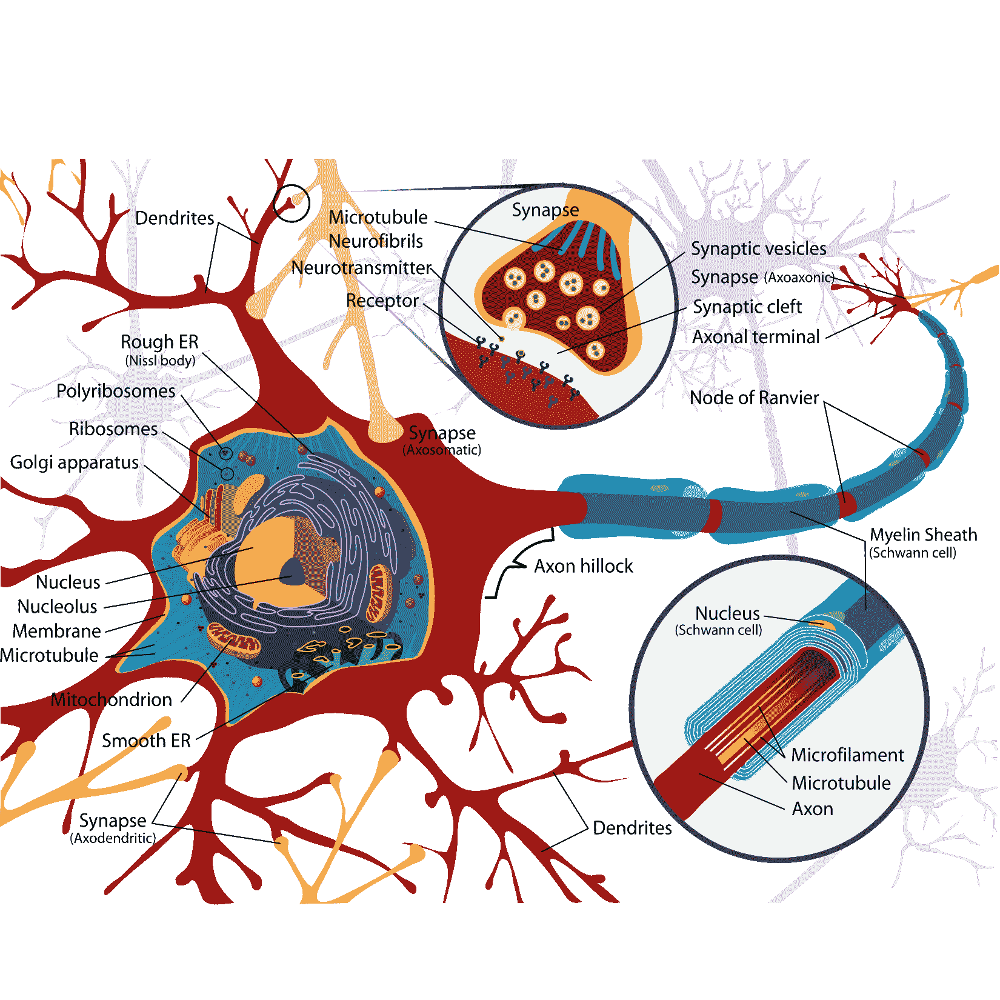
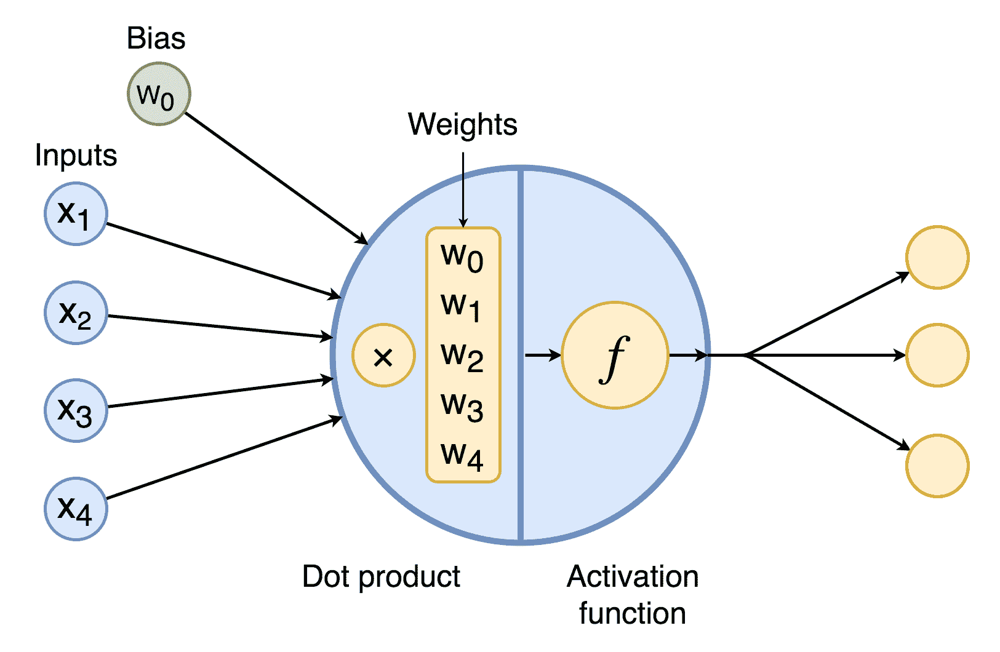
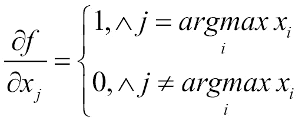
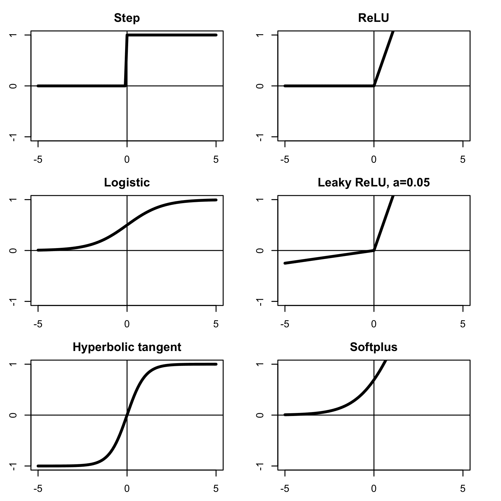
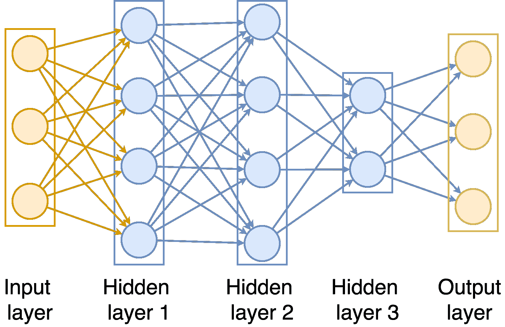
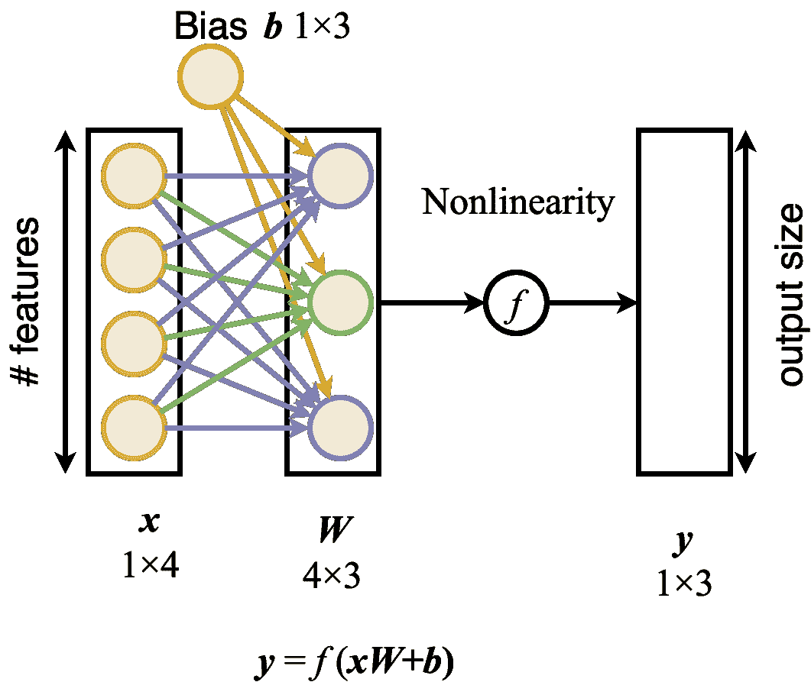
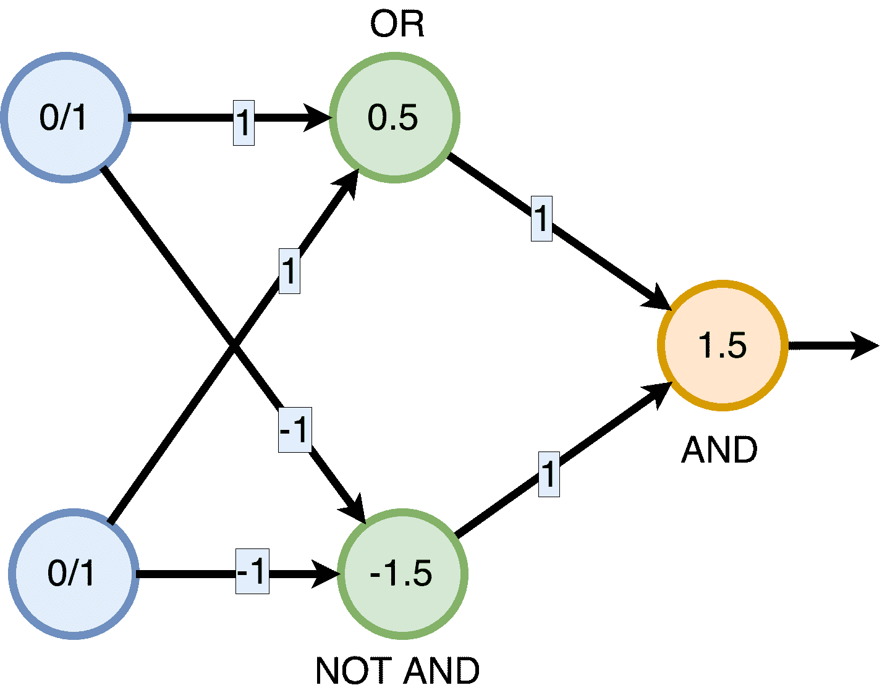

# 八、神经网络

就在十年前，人工神经网络被大多数研究人员认为是计算机科学的一个没有前途的分支。但随着计算能力的增长，以及在 GPU 上训练神经网络的有效算法的发现，情况发生了巨大变化。该领域的最新发现取得了前所未有的成果，比如在视频中追踪物体；合成现实的演讲、绘画和音乐，从一种语言到另一种语言的自动翻译；以及从文本、图像和视频中提取意义。神经网络被重新命名为*深度学习*，它们在计算机视觉和自然语言处理方面创造了各种记录，在过去几年(2014-2018 年)中击败了几乎所有其他的人工智能方法。深度神经网络引起了新的机器学习热潮，引发了一波关于人工通用智能即将到来的讨论和预测。

现在，已经有如此多的神经网络类型，以至于很难跟踪它们:卷积、递归、递归、自编码器、生成对抗、二元、有记忆、有注意力等等。新的架构和应用几乎每周都在出现，这要归功于世界各地不断增长的爱好者社区，他们尝试使用神经网络，将它们应用于各种可能的任务。

以下是 NNs 目前做得或多或少成功的一个简短列表:

*   给黑白照片上色
*   绘制新的口袋妖怪
*   写广告脚本
*   诊断癌细胞

由于深度学习的突破，我们几乎可以说(尽管还没有大声说)我们的计算机现在可以幻想、做梦和产生幻觉。今天，研究人员正在研究神经网络，它们可以自行设计和训练其他神经网络，编写计算机程序，帮助理解细胞内过程，破译被遗忘的文字和海豚的语言。从这一章开始，我们将开始投入深度学习。

在本章中，我们将讨论以下主题:

*   什么是 NNs，神经元，层，激活函数？
*   有哪些类型的激活功能？
*   如何训练神经网络:反向传播，随机梯度下降
*   什么是深度学习？
*   哪些深度学习框架最适合 iOS 应用？
*   实现多层感知器，以及如何训练它。


# 什么是人工神经网络？

我们称之为人工神经网络的模型组是通用近似机；换句话说，这些函数可以模仿任何其他感兴趣的函数的行为。这里，我指的是数学意义上的函数，与计算机科学相反:接受实值输入向量并返回实值输出向量的函数。这个定义适用于前馈神经网络，我们将在本章中讨论。在接下来的章节中，我们将看到将输入张量(多维数组)映射到输出张量的网络，以及将自己的输出作为输入的网络。

我们可以把神经网络看作一个图，把神经元看作一个有向无环图中的一个节点。每个这样的节点接受一些输入并产生一些输出。现代神经网络只是受到生物大脑的松散启发。如果你想知道更多关于生物原型及其与神经网络的关系，查看*查看生物类比*部分。


# 构建神经元

考虑到一个生物神经元具有惊人复杂的结构(见*图 8.1* )，我们如何在程序中建模呢？实际上，可以说，这种复杂性大部分存在于硬件层面。我们可以把它抽象出来，把神经元想象成图中的一个节点，它接受一个或多个输入，产生一些输出(有时称为*激活*)。

等等，但这听起来不是很熟悉吗？是的，你是对的:人工神经元只是一个数学函数。

对神经元建模的最常见方式是通过非线性函数 *f* 使用输入的加权和:


其中 *w* 是权重向量， *x* 是输入向量， *b* 是偏置项。y 是神经元的标量输出。



图 8.1:脊椎动物的典型运动神经元。来自 Wikimedia Commons 的公共领域图



图 8.2:人工神经元图

典型的人工神经元通过以下三个步骤处理输入，如前图所示(*图 8.2* ):

1.  取输入的加权和。每个神经元都有一个权重向量，其长度与输入的数量相同。有时，引入一个额外的权重作为偏差项(总是等于 1)。输入的加权和是输入向量和权重向量的点积。
2.  通过非线性函数传递结果(同义词:激活函数、传递函数)。
3.  将计算结果向下游传递给下一个神经元。

第一步是非常熟悉的线性回归。如果激活是一个阶跃函数，这使得单个神经元在数学上等同于二元线性分类器。如果你用逻辑函数代替阶跃函数，你将得到逻辑回归。但是现在我们称它们为神经元，并且可以将它们组合成一个网络。

当神经元的输入权重调整到使整个神经元产生更好的输出时，就发生了神经元的学习。同样，这与线性回归相同。为了训练一个神经网络，我们通常使用反向传播算法，这是建立在熟悉的梯度下降。


# 非线性函数

激活函数将神经元的加权输入映射为实数值，以产生神经元的输出。NN 的许多特性取决于激活函数的选择，包括其泛化能力和训练过程收敛的速度。通常，我们希望它是可微的，所以我们可以使用梯度下降来优化整个网络。最常用的激活函数是非线性的:分段线性，或 s 形(见*表 8.1* )。非线性激活函数允许神经网络在仅使用少量神经元的许多重要任务中胜过其他算法。简单来说，激活功能可以分为两类:阶跃式和整流器式(参见*图 8.3* )。让我们仔细看看一些例子:

| **名称** | **公式** | **衍生** |
| 阶跃函数 |  |  |
| 物流的 |  |  |
| 双曲正切 |  |  |
| 热卢 |  |  |
| 泄漏 ReLU |  |  |
| Softplus |  |  |
| 最大输出 |  |  |

表 8.1:常用的激活功能



图 8.3:常见激活函数的曲线图:左边一列为阶跃函数，右边一列为整流器函数


# 阶梯式激活函数

heaviside 阶跃函数(也称为**单位阶跃函数**或**阈值函数**)为所有小于*零*的值输出 *0* ，为所有其他值输出 *1* 。这是模拟生物神经元的自然选择，它产生电脉冲，或者保持沉默: *0* 。不幸的是，由于在 *0* 处的不连续性，函数是不可微的，这使得无法使用梯度下降算法来训练这样的网络。这种网络中的每个单个神经元都是二元线性分类器的数学等价物，因此这种网络不能很好地执行非线性任务。

一个**逻辑(sigmoid)函数**是一个阶跃函数的连续近似。该功能将输入从范围(-∞，+∞)压缩到范围( *0* ， *1* )。它允许使用梯度下降来训练神经网络，但是它也有两个问题:

*   由于 sigmoid 的形状，使用它的 nn 容易出现**消失梯度问题**，这将在后面解释(参见*消失梯度问题*部分)。
*   sigmoid 的输出不是以零为中心的。这在训练期间引入了权重值的不期望的曲折行为，并且网络通常训练较慢。

利用 sigmoid 激活功能，每个神经元本质上执行逻辑回归。

**双曲正切** ( **tanh** )是一个比例对数函数，所以函数的形状非常相似但其输出的范围是( *-1* ， *1* )。这意味着双曲正切函数仍然受到梯度消失的影响，但至少它的输出现在是零中心的。


# 类似整流器的激活功能

整流器是分段线性函数，在 NNs 上下文之外很难见到。这类功能是专门为减轻传统的步进式激活功能的问题和局限性而设计的。整流器应用简单的阈值:`max(0, x)`。一个神经元使用一个整流器被称为**整流线性单元** ( **ReLU** )。

与 sigmoids 不同，整流器不会在上端饱和。这有助于神经元区分差的预测和非常差的预测，并在如此困难的情况下相应地更新权重。ReLU 在计算上也非常便宜:与需要指数运算的 sigmoids 不同，ReLU 可以作为阈值运算来实现。研究还表明，ReLU 的网络收敛速度比使用 sigmoids 的网络快六倍，因此 ReLU 在发明后很快在深度学习社区中受到欢迎。

ReLU 有它自己的缺点，所以提出了一些修改来解决它们:

*   **Leaky ReLU** :不是所有值都是 *0* ，而是小于 *0* 并且该激活返回输入的一小部分(例如 *0.01* )。分数的大小由常数α决定。据推测，这应该可以防止 ReLU 在底端饱和，但实际操作中通常帮助不大。
*   **随机化 ReLU** : α在某些界限内是随机的。随机化是 NN 正则化的一种常用方法，我们将在本章后面看到。
*   **参数 ReLU (PReLU)** : α为可训练参数，通过梯度下降进行调整。
*   **Softplus** :使用指数的 ReLU 近似值。这个函数的导数是 sigmoid。
*   **Maxout 单元**:将 ReLU 和 leaky ReLU 组合在一个表达式中。这样，它允许 maxout 单元具有所有 ReLU 优点，即线性度，没有饱和，但没有垂死的 ReLU 问题。这里的缺点是 maxout 单元的参数数量是 ReLU 的两倍，所以计算起来更昂贵。


# 构建网络

单个神经元可以组织成一个网络(见*图 8.4* )，通常是将几个神经元并联在一层，然后一层层堆叠起来。这样的网络被称为**前馈神经网络**或**多层感知器(MLP)** 。第一层是输入层，最后一层是输出层，所有内层称为*隐藏层*。如果一层的每个神经元都连接到下一层的所有神经元，这样的网络称为**全连接 NN** 。

具有一种激活类型(通常是 sigmoid)的全连接前馈多层感知器是传统(规范)类型的 NN。它主要用于分类目的。在以下章节中，我们将讨论其他类型的神经网络，但在本章中，我们将坚持 MLP:



图 8.4:五层全连接前馈神经网络


# 在 Swift 中构建神经层

全连接层很容易实现，因为它可以表示为两个操作:

*   权重矩阵 *W* 和输入向量 *x.* 之间的矩阵乘法
*   激活功能 *f* 的逐点应用:



图 8.5:一层的细节

在许多框架中，这两个操作是分开的，因此矩阵乘法发生在全连接层，而激活发生在下一个非线性层。这很方便，因为这样我们可以很容易地用卷积代替加权和。在下一章，我们将讨论卷积神经网络。

但是现在，让我们看看 NNs 如何执行逻辑运算。一个神经元足以模拟任何逻辑门，除了 XOR。这一发现导致了 20 世纪 60 年代的第一次人工智能冬天；然而，XOR 对于具有两层网络的模型来说是微不足道的。


# 使用神经元构建逻辑功能

在 iOS 和 macOS SDK 的其他模糊部分中，有一个有趣的库叫做 SIMD。它是直接访问向量指令和向量类型的接口，向量指令和向量类型直接映射到 CPU 中的向量单元，无需编写汇编代码。从 2.0 版本开始，您可以直接从 Swift 代码中引用该标题中定义的向量和矩阵类型以及线性代数运算符。

**通用逼近**定理指出，如果找到合适的权重，具有一个隐藏层的简单 NN 可以逼近各种各样的连续函数。这也通常被重新表述为 NNs，即通用函数逼近器。然而，这个定理并没有告诉我们是否有可能找到这样合适的权重。

要访问这些好东西，您需要在 Swift 文件中使用`import simd`，或者在 C/C++/Objective-C 文件中使用`#include <simd/simd.h>`。GPU 中也有 SIMD 单位，所以你也可以将 SIMD 导入到你的金属着色器代码中。

根据 iOS 10.3/Xcode 8.2.1，C SIMD 的部分功能在 Swift 版本中不可用；例如，逻辑和三角运算。要查看它们，创建 Objective-C 文件，`#import <simd/simd.h>`并点击*命令*，点击`simd.h`转到头文件。

我最喜欢 SIMD 的部分是，其中所有的向量和矩阵都明确地将大小作为其类型的一部分。例如，函数`float 4()`返回大小为 4 x 4 的矩阵。但是这也使得 SIMD 不灵活，因为只有大小从 2 到 4 的矩阵可用。

看看 SIMD 游乐场的一些 SIMD 用法的例子:

```swift
let firstVector = float4(1.0, 2.0, 3.0, 4.0) 
let secondVector = firstVector 
let dotProduct = dot(firstVector, secondVector) 
```

结果如下:



图 8.6:实现异或功能的神经网络

为了说明 SIMD 可用于 ML 算法，让我们在 SIMD 实现一个简单的 XOR NN:

```swift
func xor(_ a: Bool, _ b: Bool) -> Bool { 
    let input = float2(Float(a), Float(b)) 

    let weights1 = float2(1.0, 1.0) 
    let weights2 = float2(-1.0, -1.0) 

    let matrixOfWeights1 = float2x2([weights1, weights2]) 
    let weightedSums = input * matrixOfWeights1 

    let stepLayer = float2(0.5, -1.5) 

    let secondLayerOutput = step(weightedSums, edge: stepLayer) 

    let weights3 = float2(1.0, 1.0) 
    let outputStep: Float = 1.5 

    let weightedSum3 = reduce_add(secondLayerOutput * weights3) 

    let result = weightedSum3 > outputStep 
    return result 
} 
```

SIMD 的好处是，它明确告诉 CPU 一步计算点积，而不是循环遍历向量，而是利用 SIMD 指令。


# 在 Swift 中实现层

当您想要在 Swift 中实现 NN 时，至少有三个选项可供考虑:

*   在纯 Swift 中实现它(这可能主要用于研究目的)。在 GitHub 上可以找到许多不同复杂性和功能的实现。看起来好像每个程序员在她/他生命的某个阶段开始用她/他最喜欢的编程语言编写一个神经网络库。
*   使用低级加速库(金属性能着色器或 bnn)来实现它。
*   使用一些通用 NN 框架实现它—Keras、TensorFlow、PyTorch 等等—然后将其转换为核心 ML 格式。

金属性能着色器库包括三种类型的 NNs 激活:ReLU、sigmoid 和 TanH ( `MPSCNNNeuronReLU`、`MPSCNNNeuronSigmoid`、`MPSCNNNeuronTanH`)。更多信息请参考:[https://developer . apple . com/reference/metalperformanceshaders](https://developer.apple.com/reference/metalperformanceshaders)。


# 训练网络

目前训练神经网络最常见的方法是误差反向传播算法，或反向传播(通常简称为*反向传播*)。正如我们已经看到的，单个神经元经常让我们想起线性或逻辑回归，所以反向传播通常与我们的老朋友梯度下降算法一起出现也就不足为奇了。NN 训练的工作方式如下:

*   正向传递-输入显示在图层上，变换逐层应用到图层上，直到预测在最后一个图层上输出。
*   损失计算-将预测与地面真实值进行比较，并使用损失函数 *J* 为输出层的每个神经元计算误差值。
*   然后，误差被向后传播(反向传播)，使得每个神经元具有与其相关联的误差，该误差与其对输出的贡献成比例。
*   使用梯度下降的一个步骤来更新权重( *w)* 。使用误差值针对每个神经元的权重计算损失函数的梯度。然后，通常的梯度下降步骤发生在线性回归中。

只有当正向传播中的所有变换都是可微的(在最简单的情况下，点积和激活函数)时，反向传播才是可能的，因为它本质上是来自微积分的链规则的应用。

如需进一步阅读，请转至[https://en.wikipedia.org/wiki/back 传播](https://en.wikipedia.org/wiki/Backpropagation)。


# 消失梯度问题

sigmoid 在一端渐近地接近零，而在另一端是 *1* 。在这些尾部，函数的导数非常小。这对反向传播算法来说是个坏消息，因为当信号通过网络传播回来更新权重时，这些几乎为零的值会杀死信号。

死神经元的问题是:如果你随机初始化网络权重，权重大的 sigmoidal 神经元从一开始就死了(几乎不传输信号)。


# 看到生物类比

每个人都听说过人工神经网络模仿大脑的工作方式。这实际上与事实相差甚远。真实的情况是，神经网络作为一个领域是从模拟大脑如何工作的尝试中发展出来的。大脑的基本单位是神经元(神经细胞)。人脑包含大约 860 亿个神经元。神经元可以在其体内产生电位(动作电位)。神经元有两种类型的分支投射。一种是短投影，称为树突(来自希腊语 *δεvεδpov* ，tree)。通常，它们的功能是接收来自其他神经元的电脉冲。另一种类型是更长的投射，称为轴突(来自希腊语αξοv，axis)。有些神经元没有轴突，但没有神经元有一个以上的轴突。轴突的功能是将电脉冲从神经元传递到其他细胞。

通过其轴突，神经元连接到其他神经元的体(或树突)，并向它们传输电信号。不是所有的神经元都向其他神经元传递信号；其中一些刺激肌肉和腺体。

轴突末端有称为突触的结构——连接细胞体或树突。为了向下一个神经元传递信号，突触会发出化学神经介质(或很少发出电信号)。人脑中大约有 1014-1015 个突触。你可以自己计算存储如此大量的信息需要多少磁盘空间。在我们的人造大脑中，人造神经元要少得多。即使是最大的现代神经网络也只能与水母或蜗牛的大脑相提并论。然而，神经元或突触的数量并不是全部，因为有些动物的大脑比人类的大脑包含更多的神经元。如果你对这个话题感兴趣，请访问维基百科页面:[https://en . Wikipedia . org/wiki/List _ of _ animals _ by _ number _ of _ neurons](https://en.wikipedia.org/wiki/List_of_animals_by_number_of_neurons)。

尽管神经网络的概念是从生物学中借用的，但人们应该有强大的想象力才能看出生物原型与现代人工神经网络是如何相似的。这就是为什么一些研究人员认为一些其他的名字，像*计算图*更合适。生物学术语曾经在这个领域更受欢迎，但现在字面上唯一广泛使用的生物学术语是*神经元*。


# 基本神经网络子程序

BNNS 是 Accelerate 的子模块，包含为在 CPU 上运行推理而优化的卷积 NN 原语。它是在 iOS 10 和 macOS 10.12 中引入的。请注意，它只包含用于推理的函数，不包含用于训练的函数。

这个库背后的动机是为公共例程提供统一的 API，这样应用开发人员就不需要每次都从头开始重新实现卷积和其他原语(这很难，我们已经在 CNN 一章中看到过)。在典型的 CNN 中，大部分能量都花在卷积层上。完全连接的层在计算上更昂贵，但通常 CNN 在最末端包含一个或几个层，所以卷积仍然消耗大约 70%的能量。这就是拥有高度优化的卷积层非常重要的原因。与 MPS 不同，CNN 可以在 iOS、macOS、tvOS 甚至 watchOS 上使用。因此，如果你想在电视机或手表上运行深度学习(只是因为你可以)，这是你的首选工具。

更严肃地说，当你为没有金属性能着色器支持的设备实现 NNS 时，BNNS 是有用的(旧的 iOS 设备和现在所有的 macOS 设备)。在所有其他情况下，您仍然希望使用 MPS CNNs 来利用 GPU 大规模并行性。

要检查金属功能的可用性，请查看[https://developer.apple.com/metal/availability/](https://developer.apple.com/metal/availability/)。

BNNS 包含三种类型的层:卷积、池化和全连接层，以及几种激活:同一性、校正线性、泄漏校正线性、sigmoid、tanh、缩放 tanh 和 abs。


# BNNS 示例

在以下示例中，输入图像的大小为 224 x 224 x 64，输出图像的大小为 222 x 222 x 96。卷积权重的维数是 3×3×64×96。也就是 54.5 亿次浮点运算(gigaFloPS)。在整个 MNIST 识别网络中，每次转发大约有 1-2 万亿次运算。

BNNS 是 Accelerate 的一部分，因此您需要导入 Accelerate 来访问神经网络构建块。您要做的第一件事是描述输入栈:

```swift
var inputStack = BNNSImageStackDescriptor(
  width: 224, height: 224, channels: 64,
  row_stride: 224, image_stride: 224*224,
  data_type: BNNSDataTypeFloat32,
  data_scale: 1.0, data_bias: 0.0)
```

大多数参数是不言自明的；`row_stride`是到下一行的像素增量，`image_stride`类似地是到下一通道的像素增量，`data_type`是一种存储类型。

输出栈看起来应该类似:

```swift
var outputStack = BNNSImageStackDescriptor(
  width: 1, height: 10, channels: 1,
  row_stride: 1, image_stride: 10,
  data_type: BNNSDataTypeFloat32,
  data_scale: 1.0, data_bias: 0.0)
```

现在让我们创建一个卷积层。`BNNSConvolutionLayerParameters`包含卷积层的描述:

```swift
let activation = BNNSActivation(function: BNNSActivationFunctionIdentity, alpha: 0, beta: 0)

var convolutionParameters = BNNSConvolutionLayerParameters(
  x_stride: 1, y_stride: 1,
  x_padding: 0, y_padding: 0,
  k_width: 3, k_height: 3,
  in_channels: 64, out_channels: 96,
  weights: convolutionWeights,
  bias: convolutionBias,
  activation: activation)
```

`k_width`和`k_height`分别是籽粒宽度和高度。

创建层本身:

```swift
let convolutionLayer = BNNSFilterCreateConvolutionLayer(&inputStack, &outputStack, &convolutionParameters, nil)
```

`nil`代表默认`BNNSFilterParameters`。

现在你可以使用过滤器，并在不再需要时通过调用`BNNSFilterDestroy(convolutionLayer)`将其销毁。

池层:

```swift
// Describe pooling layer
BNNSPoolingLayerParameters pool = {
    .k_width = 3,
// kernel height
// kernel width
// X padding
// Y padding
    .k_height = 3,
    .x_padding = 1,
    .y_padding = 1,
    .x_stride = 2,
    .y_stride = 2,
    .in_channels = 64,
    .out_channels = 64,
    .pooling_function = BNNSPoolingFunctionMax  // pooling function
};
// Create pooling layer filter
BNNSFilter filter = BNNSFilterCreatePoolingLayer(
    &in_stack,     // BNNSImageStackDescriptor for input stack
    &out_stack,    // BNNSImageStackDescriptor for output stack
    &pool,         // BNNSPoolingLayerParameters
    NULL);         // BNNSFilterParameters (NULL = defaults)
// Use the filter ...
// Destroy filter
BNNSFilterDestroy(filter);

// Describe input vector
BNNSVectorDescriptor in_vec = {
    .size = 3000,
// size
// storage type
};
// Describe fully connected layer
BNNSFullyConnectedLayerParameters full = {
    .in_size = 3000,
    .out_size = 20000,
    .weights = {
        .data_type = BNNSDataTypeFloat16,
        .data = weights
// input vector size
// output vector size
// weights storage type
// pointer to weights data
} };
// Create fully connected layer filter
BNNSFilter filter = BNNSFilterCreateFullyConnectedLayer(
    &in_vec,       // BNNSVectorDescriptor for input vector
    &out_vec,      // BNNSVectorDescriptor for output vector
    &full,         // BNNSFullyConnectedLayerParameters
    NULL);         // BNNSFilterParameters (NULL = defaults)// Use the filter ...
// Destroy filter
BNNSFilterDestroy(filter);
// Apply filter to one pair of (in,out)
int status = BNNSFilterApply(filter,
                             in,
out);
// BNNSFilter
// pointer to input data
// pointer to output data
// Apply filter to N pairs of (in,out)
int status = BNNSFilterApplyBatch(filter,
                                  20,
                                  in,
                                  3000,
                                  out,
                                  20000);
// BNNSFilter
// batch size (N)
// pointer to input data
// input stride (values)
// pointer to output data
// output stride (values)
```


# 摘要

在这一章中，我们已经熟悉了人工神经网络及其主要组成部分。神经网络是由通常组织成层的神经元构成的。典型的神经元对输入进行加权求和，然后对其应用非线性激活函数来计算其输出。有许多不同的激活函数，但目前最流行的是 ReLU 及其修改，因为它们的计算属性。

通常使用基于随机梯度下降的反向传播算法来训练神经网络。多层前馈神经网络也称为多层感知器。MLP 可用于分类任务。

在下一章，我们将继续讨论神经网络，但这次我们将集中讨论卷积神经网络，它在计算机视觉领域特别流行。