# 卷积神经网络

在本章中，我们将讨论**卷积神经网络**(**CNN**)。首先，我们将通过 Swift 中的示例来讨论所有组件，以便对算法和实际情况有一个直观的了解。然而，在现实生活中，你很可能不会从头开始开发 CNN，因为你将使用一些现成的和经过战斗考验的深度学习框架。

因此，在本章的第二部分，我们将展示深度学习移动应用的完整开发周期。我们将拍摄标记有情绪的人脸照片，在 GPU 工作站上训练 CNN，然后使用 Keras、Vision 和 Core ML 框架将其集成到 iOS 应用中。

本章结束时，您将了解到:

*   情感计算
*   计算机视觉，它的任务和方法
*   有线电视新闻网，他们的解剖，以及背后的核心概念
*   细胞神经网络在计算机视觉中的应用
*   如何使用 GPU 工作站和 Keras 训练 CNN
*   深度学习技巧:正规化、数据扩充和提前停止
*   CNN 架构
*   如何将训练好的模型转换为核心 ML 格式，以便在 iOS 应用中使用
*   如何使用 CNN 和视觉框架检测照片中的人脸和面部表情


# 理解用户情绪

虽然语音输入无疑是一个有用的功能，但我们都知道句子的实际意思可能与字面意思相反，这取决于说话者的语调、面部表情和上下文。试试这个简单的句子:*哦，真的吗？*根据条件的不同，这可以表示:*我怀疑*，*我不知道*，*我印象深刻*，*我不在乎*，*这是显而易见的*等等。问题是语音并不是人类唯一的对话模式，这就是为什么现在很多研究都集中在教计算机理解(也模拟)手势、面部表情、文本中的情感、眼球运动、讽刺和其他情感表现上。围绕情感和同情心人工智能问题出现的跨学科领域被称为**情感计算**。它整合了计算机科学、认知科学、心理学和机器人学的知识。其目的是创造能够适应用户情绪状态、理解用户情绪并模拟移情的计算机系统。早在 1995 年，在智能手机出现之前，这个领域的名字是由罗莎琳德·皮卡德创造的。在她名为*情感计算*【2】的技术报告中，她预测这将与可穿戴设备特别相关。通过本章中的面部表情识别，我们将把情感智能的元素引入到我们的移动应用中。这可以用在语言理解的环境中，或者用在从表情符号推荐到智能照片排序的许多其他方面。

请注意，情感计算类似于情感分析，但它是一个更广泛的术语:前者对所有类型的情感及其检测和模拟感兴趣，而后者主要关注文本的极性(积极/消极)。


# 介绍计算机视觉问题

在这本书里，我们多次提到计算机视觉，但是因为这一章集中在这个特殊的领域，我们现在将更详细地看它。有几个与图像和视频处理相关的实际任务，称为**计算机视觉领域**。在处理一些计算机视觉任务时，了解这些名称很重要，这样才能在浩瀚的计算机视觉出版物中找到您需要的内容:

*   **物体识别**:同分类。给图像分配标签。*这是一只猫*。年龄估计。面部表情识别。
*   **物体定位**:在图像中找到物体的边框。*猫在这一帧*。
*   **物体检测**:在图像中寻找物体的帧。*猫在这个画面里*。
*   **语义分割**:图片中的每一个点都被分配到一个类。如果图片包含几只猫，每只猫的像素将被分配给*猫*类。
*   **实例分割**:图片中的每一个点都被分配给类的一个实例。如果图片包含几只猫，每只猫的像素将被分配给*猫*类的单独部分。
*   **姿态估计**:确定物体在空间中的方位。
*   **物体跟踪**:分析视频，找到运动物体的轨迹。
*   **图像分割**:寻找不同物体之间的边界，形成一幅图像。背景减法。
*   三维场景恢复和深度估计。
*   图像搜索和检索。

一些常见的计算机视觉任务，像**光学字符识别** ( **OCR** )，由几个步骤组成；例如*图像分割→图像识别*:

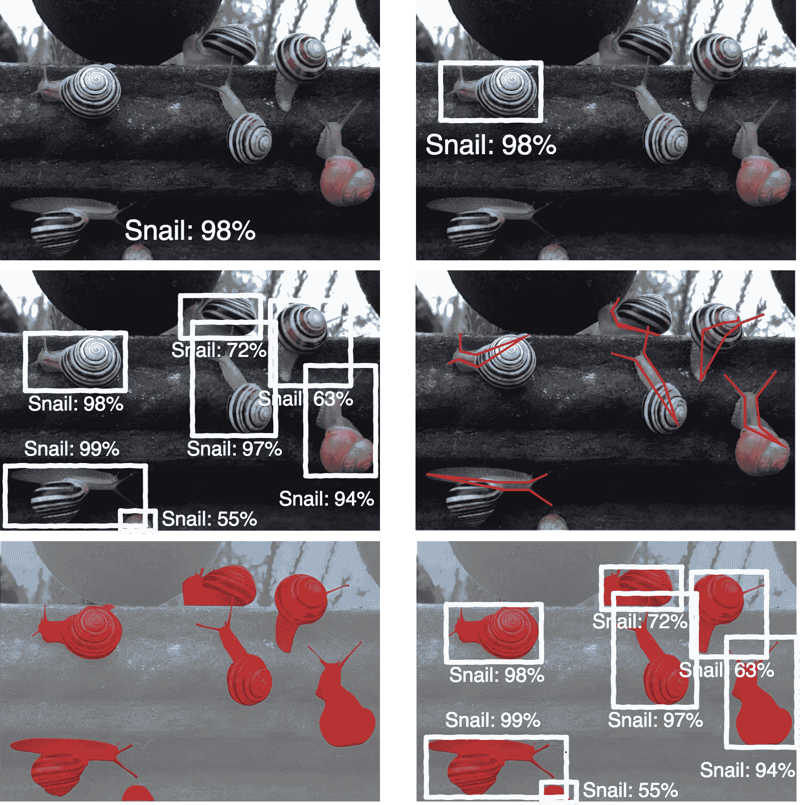

图 9.1:流行的计算机视觉任务。顶行:识别，本地化。中间一行:物体检测，姿态估计。底部一行:语义分段和实例分段

这些任务被认为是困难的问题，因为可变的因素:不同的摄像机位置、照明、对象的遮挡、类内可变性、对象形状的变化等等。许多熟悉的机器学习算法在计算机视觉中发现了意想不到的应用。比如我们已经看到了 *k* -means 可以用于图像分割，线性回归的扩展 RANSAC 用于将照片拼接成全景图。

CNNs 历史背景:多年来，计算机视觉领域的进展一直缓慢而艰巨，涉及大量领域专家知识、人工特征选取和模型参数调整。重大的变化悄然而至:2012 年，Alex Krizhevsky 赢得了年度 ImageNet 图像识别比赛，将其他竞争者远远甩在身后。对于他的分类器，他使用了当时鲜为人知的 CNN (AlexNet 架构)。更令人惊讶的是，CNN 至少早在 1994 年就被提出，当时 Yan LeCunn 发表了他的用于手写数字识别的 LeNet5 体系结构描述。但是它们被认为对于大多数现实世界的任务是不切实际的，因为需要几乎永恒的时间和大量的数据来学习任何有用的东西。新奇的是，Krizhevsky 使用图形加速器(GPU)而不是 CPU 来训练他的网络。利用这些设备的巨大并行性，他将训练时间从数周缩短到数小时。结果是惊人的，因此卷积网络很快在研究人员和从业人员中流行起来。

让我们仔细看看这种类型的神经网络。


# 卷积神经网络简介

在过去的几年中，CNN 或 ConvNets 得到了很多关注，主要是因为它们在计算机视觉领域取得了重大成功。它们是当今大多数计算机视觉系统的核心，包括自动驾驶汽车和大规模照片分类系统。

在某种意义上，CNN 非常类似于多层感知器，我们在前一章已经讨论过。这些网络也是从这些层建立起来的，但是与 MLP 不同，它通常具有彼此相似的所有层，CNN 通常包括许多不同类型的层。该层最重要的类型是卷积层。现代 CNN 可能真的很深——有数百个不同的层次。尽管如此，您仍然可以将整个网络视为一个可微分函数，它接受一些输入(通常是图像像素的原始值)，并产生一些输出(例如，类概率:0.8 猫，0.2 狗)。


# 联营业务

汇集或子采样是输入大小减小的简单操作(*图 9.2* )。如果你有一个黑白图像，你想缩小它的尺寸，你可以用下面的方法:选择一个大小为 *n* × *m* 的滑动窗口，步长 *s* 。浏览图像，应用滑动窗口并在每次想要移动窗口时移动 *s* 像素。在每个位置计算平均值(平均池)或最大值(最大池)，并将该值记录到目标矩阵中。现在，有两种常见的方法来处理图像的边框:

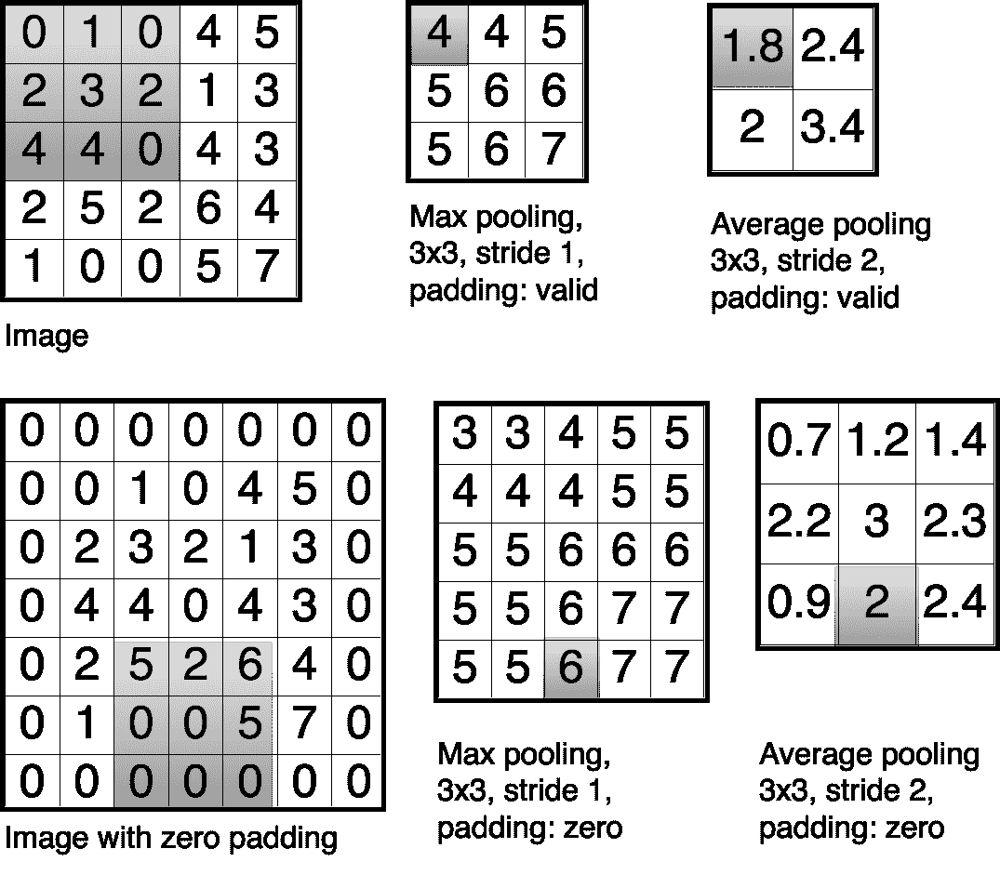

图 9.2。联营业务。源图像中的灰色窗口对应于目标图像中的灰色单元

当数据在网络中传输时，在 CNN 中使用池来减少数据的大小。


# 卷积运算

卷积是图像处理中最重要的运算之一。图像编辑器中的模糊、锐化、边缘检测、去噪、浮雕等很多大家熟悉的操作，其实都是卷积。它在某种程度上类似于池操作，因为它也是一种滑动窗口操作，但它不是在窗口上取平均值，而是通过大小为 n × n 的内核矩阵执行元素级乘法，并将结果求和。运算的结果取决于内核(又称**卷积滤波器**)——一个矩阵，通常是正方形，但不一定，见*图 9.3* 。步幅和填充的概念与合并的情况相同:

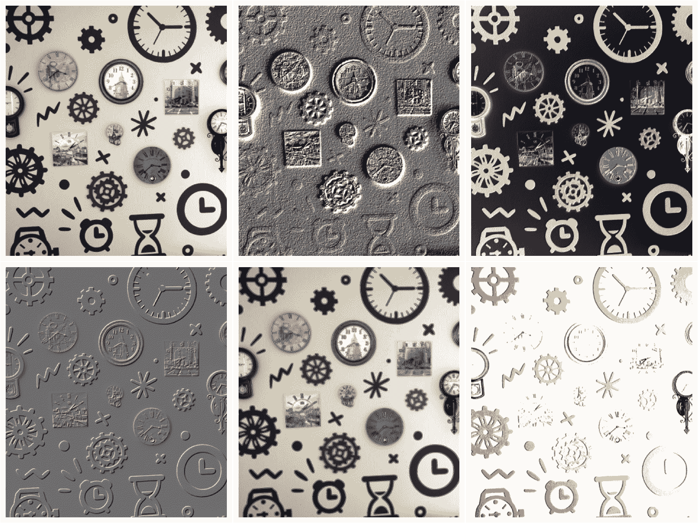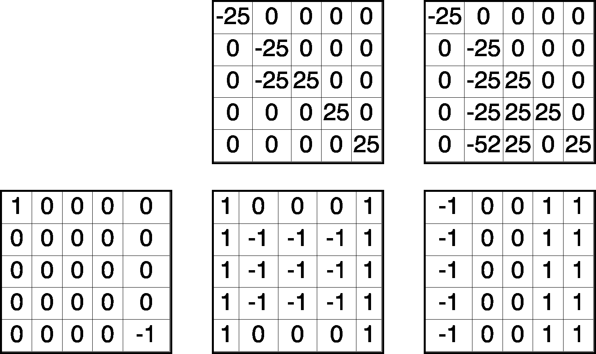

图 9.3:不同的卷积滤镜对图片有不同的效果

卷积运算的工作方式如下(见下图):

*   卷积核(过滤器)从左到右、从上到下滑过图像
*   在每一个位置，我们计算一个元素的产品的过滤器和图像的补丁，这是由一个过滤器在这一步覆盖
*   将所得矩阵的元素相加
*   卷积的结果是一个由滤波器每个位置的和组成的矩阵:

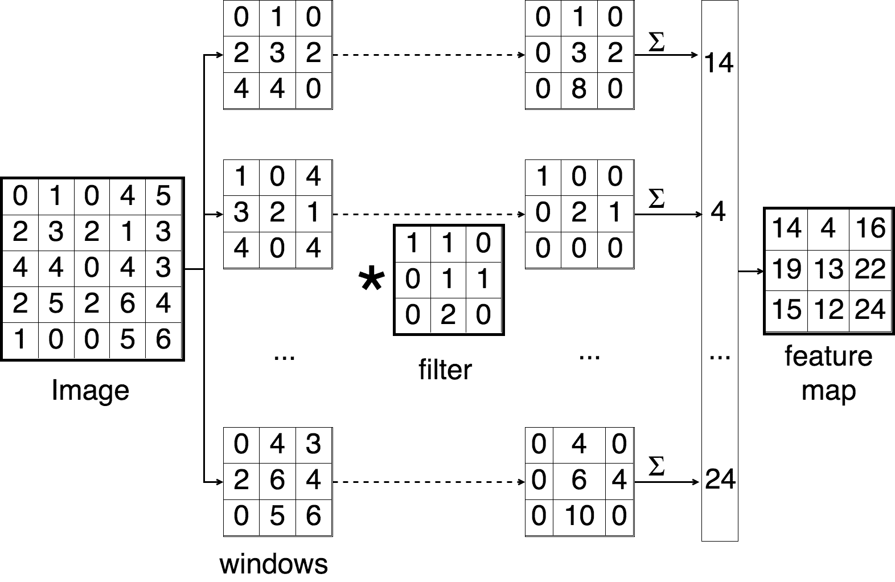

图 9.4:使用 3×3 内核、步长 1 和有效填充的卷积运算: :源图像被分割成多个窗口；每个窗口按元素乘以滤波器；每个窗口中值的总和

该算法乍看起来很简单，因此您可能会想到一个与此类似的快速实现:

```
let input = ... //source image, 2D array
var output = ... //destination image, 2D array
for i in 0..<imageHeight {
     for j in 0..<imageWidth {
         var accumulator = 0;
         for ik in 0..<kernelHeight {
             for jk in 0..<kernelWidth {
                 accumulator += kernel[ik][jk] *
                 input[i+ik-kernelHeight/2][j+jk-kernelWidth/2]
             } 
         }
         output[i][j] = accumulator;
     }
}
```

但是，您真的不应该在生产代码中实现自己的卷积运算。以下是您必须处理的问题的非详尽列表:

*   正确处理图像的边缘(见下图)
*   处理步幅——每一步后内核移动了多少
*   正确处理整数溢出
*   优化速度

一个好的卷积实现可能需要数百行代码(甚至更多)。iOS SDK 为开发人员提供了几种 API 供他们选择，具体取决于他们的需求和目标:

*   对于图像过滤:
    *   `CIImageFilter`来自核心形象框架
    *   `vImage convolution`加速框架中的函数，例如`vImageConvolve_ARGB8888()`
*   对于运行 CNN:
    *   **对于 CPU 执行** : BNNS 卷积层:`BNNSFilterCreateConvolutionLayer`
    *   **用于 GPU 执行**:来自金属性能着色器框架的`MPSCNNConvolution`类

`vImage functions`是处理大型图像或连续多次重复操作的推荐方式。要过滤中等大小的图像，坚持使用 CoreImage 更有效。当您实现 CNN 时，您通常希望使用 Metal 或 accelerate 框架。这是我们将在第十一章、*机器学习库*中详细讨论的内容。

检查补充代码中的`Convolution.playground`，看看不同的卷积滤波器如何产生不同的效果。试试你自己的过滤器，看看会发生什么。我们使用 accelerate 框架中的`vImageConvolve_ARGB8888()`函数来应用过滤器。

下面是一个例子:

```
import Accelerate

let error = vImageConvolve_ARGB8888(&input, &output, nil, 0, 0, kernel, kernelHeight, kernelWidth, Int32(divisor), nil, flags)
```

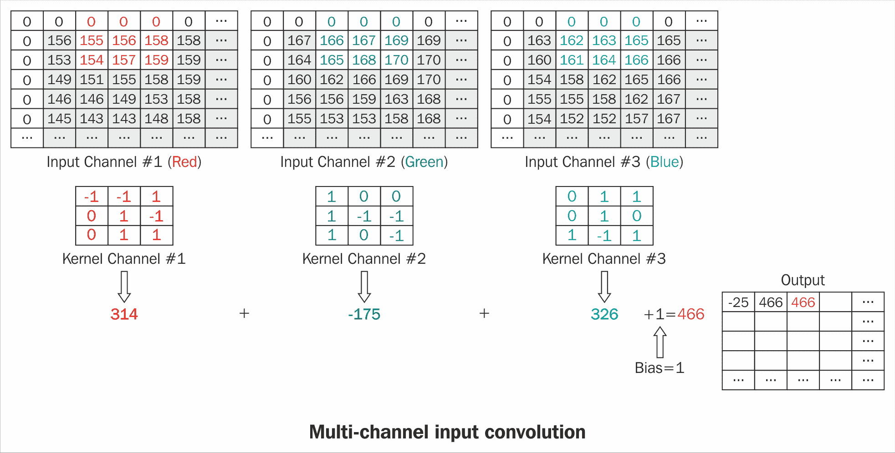

图 9.5:多通道卷积


# CNN 中的卷积

第一层将滤波器应用于输入图像，并将结果特征矩阵发送到下游。接下来的层将它们的过滤器应用于它们得到的输入，从越来越高的层次提取特征(见*图 9.6 - 9.8* )。在图像分类(或*物体识别*的任务中，CNN 在训练过程中逐渐调整滤波器，从图片中提取有用的特征。在这种情况下，有用的特征是不同的图案，如眼睛、喙、轮子等:

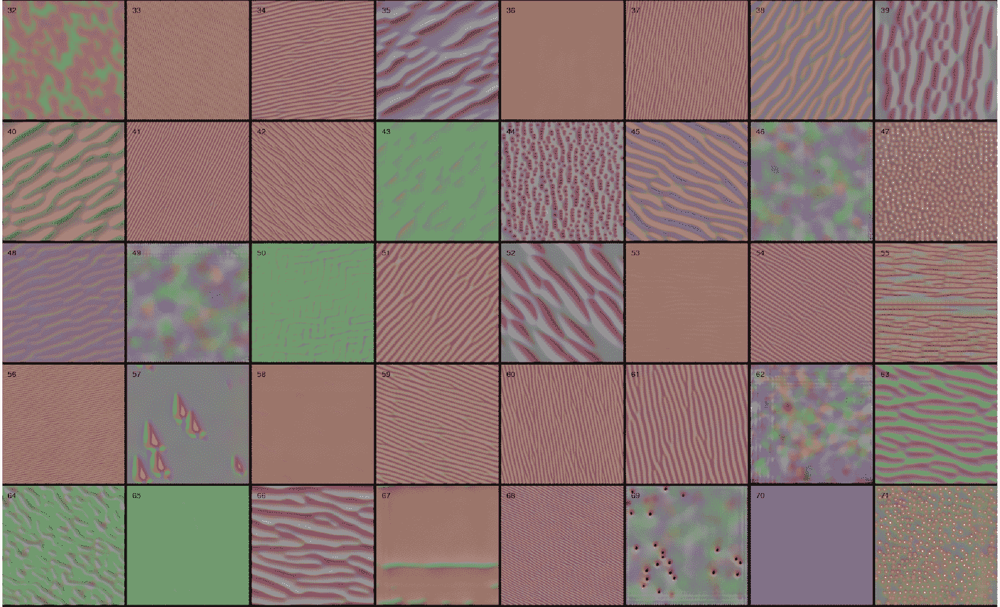

图 9.6:每个 CNN 层学习一组卷积核。在这里，您可以看到 VGG 16 的第二个模块中第二个卷积层的不同滤波器的输出

有趣的是，卷积神经网络在计算机视觉领域之外被广泛使用；例如，在自然语言建模和语音识别中。这是因为它们能够从原始数据中提取有意义的特征。从图像中提取边缘和角点与从文本中提取句法特征没有本质的区别。


# 构建网络

当您第一次遇到 CNN 的各种架构时，您会被大量的新术语、不同的层及其超参数所淹没。事实上，目前只有少数架构找到了广泛的应用，适合移动开发的设计数量更少。

有五种基本类型的层和一个输入层，输入层通常除了向前传递数据之外什么也不做:

*   **输入层**:神经网络中的第一层。它什么也不做，只接受输入并将其传递到下游。
*   **回旋层**:回旋发生的地方
*   **完全**:连接或密集层
*   **非线性层**:这些层将激活函数应用于前一层的输出:sigmoid、ReLU、tanh、softmax 等。
*   **合并图层**:对它们的输入进行缩减采样。
*   **规则化层**:对抗过度拟合的层。

现代深度学习框架包含更多不同类型的层来满足所有需求，但这些是最常用的。在下面几节中，我们将详细讨论每种类型的层。由于 CNN 通常不在移动设备上训练，而是仅用于预测，因此我们在此不详细讨论 CNN 中的反向传播。不过，如果你有兴趣了解更多细节，本章补充资料中的`NN Demo.playground`包含了 CNN 及其所有经典层的纯 Swift 实现。它还包含随机梯度下降算法及其几个变体的实现。请参考这个操场，了解更多关于图层齿轮和训练算法的技术细节。操场是安德烈·卡帕西设计的`ConvNetJS`图书馆的快捷港。它仅仅是为了研究目的而开发的，用来演示 CNN 如何在内部工作，而不是为了在实际应用中使用，并且它没有利用 GPU 或 CPU 加速。原 JS 库可以在这里找到:[https://cs.stanford.edu/people/karpathy/convnetjs/](https://cs.stanford.edu/people/karpathy/convnetjs/)


# 输入层

这是一个虚拟层；它在向前传球和向后传球中都不起作用。我们只用它来定义输入张量的大小。


# 卷积层

在 CNN 中，卷积发生在特殊的层，称为**卷积层**。每一层都有一个卷积滤波器阵列，也可以看作一个具有宽度、高度和通道数(或深度)的 3D 卷积滤波器。在第一卷积层中，我们通常希望有 3 个通道对应于输入图像的 RGB 通道:

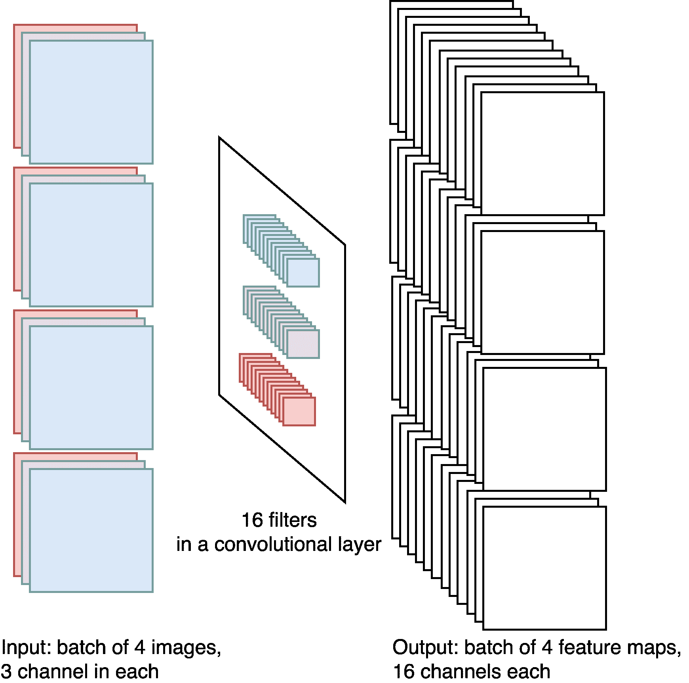

图 9.7:第一个卷积层以一批图像为输入，输出一批特征图。将 16 个红色、绿色和蓝色过滤器中的每一个的结果相加，以获得最终的特征地图

卷积层的输出被称为**特征图**，因为它显示了特定特征在输入图像中的位置。请注意，只有第一个卷积层将图像作为其输入，所有后续层都将它们的前任(特征映射)的输出作为其输入。这些特征地图被存储为张量。

深度学习背景下的张量是一个多维数组。神经网络参数，例如卷积滤波器，存储为张量，所有数据以张量形式通过深度神经网络传输。0 维张量是标量，1D 是矢量，2D 是矩阵，3D 有时称为**体积**。

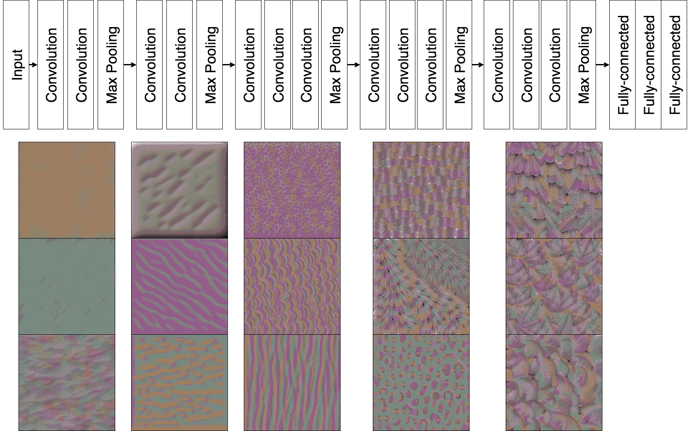

图 9.8:CNN 中的每一个下一层都比前一层提取更多的抽象特征。取自 VGG 16 网络的示例。

注意，对于你的生产应用，你通常不希望在 Swift 中编写自己的卷积层，因为你想利用 GPU 的能力，所以你通常使用现有的深度学习库(见[第 10 章](a0699ba2-e643-4a53-914b-890b435be480.xhtml)、*自然语言处理*)或在 Metal 或 Accelerate 中实现自定义层(见[第 11 章](dc502f3c-ae07-4291-8cfe-4ea4bef76e24.xhtml)、*机器学习库*)。


# 完全连接的层

完全收集层就像上一章中多层感知器的一层，但是没有激活功能。你可以把它想象成一个权重乘以一个输入的矩阵或者一层人工神经元(*图 9.9* ):

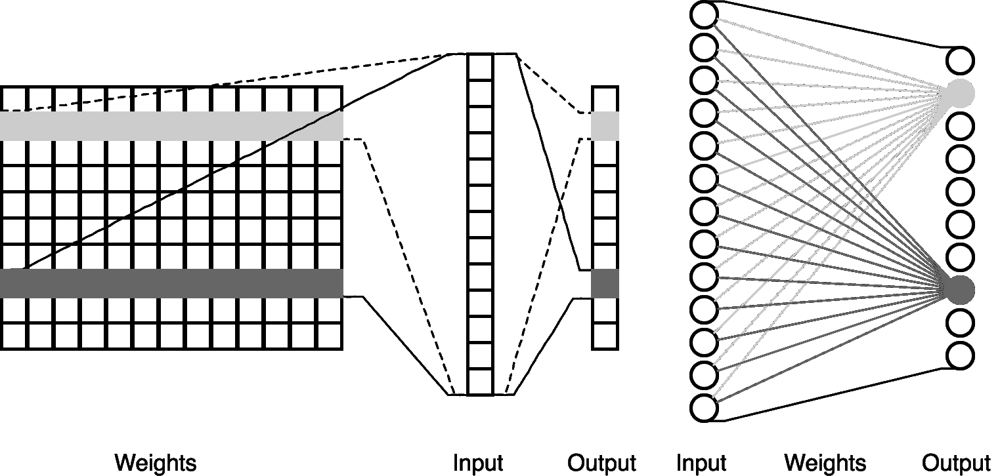

图 9.9:表示全连接层的两种方式:矩阵向量乘法和图形。


# 非线性层

这些都是我们在前一章已经讨论过的非线性:tanh、sigmoid、ReLU 等。您通常希望将它们放在卷积层或全连接层之后。

Softmax 是逻辑函数对向量的推广:当逻辑函数`squashes`的标量值在 0 和 1 之间时，softmax 压缩向量，使其元素相加为 1。在统计学中，离散随机分布的结果的概率加起来是 1，所以这个函数对于目标变量是离散的分类非常有用。


# 汇集层

汇集层执行汇集操作。当你想减少传递到下一层的张量的大小时，把它放在卷积层之后。


# 正则化层

正规化层旨在打击过度拟合，提高训练速度。最受欢迎的正则化图层是丢弃和批量正则化图层，因为这两种技术在实践中都非常有用。


# 拒绝传统社会的人

对于深度神经网络，丢弃是一种常见的正则化方法。其思想是在训练的每一步，以某种预定的概率关闭前一层中的随机神经元。关闭的神经元在该步骤中不被训练，但是将在下一个步骤中以原始权重恢复。这种技术防止过拟合，因为它不允许对所有数据训练所有神经元。


# 批量标准化

层参数的微小变化会影响所有后续层的输入，并且这种影响会随着每个后续层而放大。这对于深层网络来说尤其成问题。
由于前一层的参数正在被调整，在训练过程中，每一层的输入分布发生变化。这个问题被称为**内部协变移位**。
批量归一化技术是由谷歌的 Sergey Ioffe 和 Christian Szegedy 在 2015 年提出来解决这个问题的[1]。作为网络架构的一部分，它允许标准化每个小批量的层输入。批量标准化层通常插在点积和非线性之间。

好处如下:

*   你可以用更高的学习率
*   您可以不太在意权重初始化
*   正常工作-不需要辍学
*   相同型号的火车速度快 14 倍

协变量移位:

机器学习系统中的常见问题正式称为**协变量移位**:当模型被部署到生产环境中时，它的数据分布似乎与训练数据的分布不同。名字来源于协变量，协变量和特征基本相同。通过类比，引入了内部协变量移位的概念:当在神经网络中输入数据到每一层的分布不稳定时，但是在 SGD 的每一步之后显著变化。

如果输入和输出分布都发生变化，这就是所谓的**数据集偏移**。


# 损失函数

损失函数是一个必要的部分，因为它是我们在训练过程中想要最小化的部分。您可以在表格中找到一些常见的损失函数:

| **名字** | **公式** | **通常用于** |
| 均方误差或 L2 损失 |  | 回归 |
| 平均绝对误差或 L1 损失 |  | 回归 |
| 范畴交叉熵 |  | Softmax 多类分类 |

其中 *y* 是基本事实向量，而 *ŷ* 是长度为 *n* 的预测向量。


# 训练网络

**随机梯度下降** ( **SGD** )是训练深度神经网络的有效方法。SGD 寻求网络的这些参数*θ*，使损失函数 *ℒ* 最小。


其中是训练数据集。

训练是循序渐进的。在每一步，我们选择一个规模为 m(小批量)的训练集的子集，并使用它来逼近关于参数*θ*的损失函数梯度:

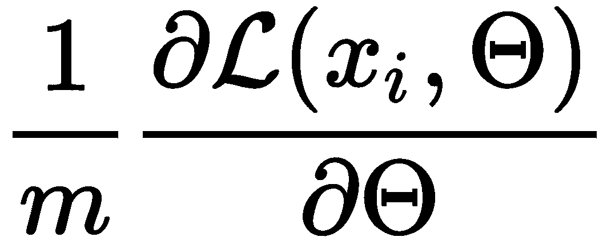

小批量培训的优势如下:

*   小批量损失函数的梯度是对整个训练集的梯度的更好的近似，而不是仅对一个样本进行计算
*   多亏了 GPU，你可以对批量中的每个样本并行执行计算，这样速度更快，然后逐个处理它们


# 训练 CNN 进行面部表情识别

为了演示 CNN，我们将实现一个简单的用于情感识别的神经网络。我们将使用来自 ICML 2013 年比赛*面部表情识别挑战赛*【1】的面部表情数据集`fer2013`。

数据集可以从 kaggle 网站下载:

[https://www . ka ggle . com/c/challenges-in-re presentation-learning-face-expression-recognition-challenge/data](https://www.kaggle.com/c/challenges-in-representation-learning-facial-expression-recognition-challenge/data)

您将被要求注册并接受条款和条件。

归档文件`fer2013.tar.gz`包含带有数据集本身的`fer2013.csv`和一些补充信息文件。`.csv`文件包含 35887 个样本，其中 28709 个标记为训练集，3589 个标记为公共测试，3589 个标记为私有测试。表格中有三栏:情感、像素和使用情况。每个样本都是像素阵列形式的 48 × 48 像素灰度人脸照片。人脸是以自动方式裁剪的，所以数据集中有一些假阳性(非人脸和卡通人脸)。每个面都被标记为属于 7 个类别中的一个。情绪在数据集中的分布如下:

| **类别 id** | 0 | 一 | 2 | 3 | 四 | 5 | 6 |
| **情感** | 愤怒的 | 厌恶 | 害怕 | 幸福的 | 悲哀的 | 惊喜 | 中立的 |
| **计数** | 4953 | 547 | 5121 | 8989 | 6077 | 4002 | 6198 |


# 环境设置

要训练深度 CNN，你需要一台配有 CUDA 兼容 GPU 的电脑。我用了一台 Ubuntu 16.x 的机器，搭配 NVidia GTX980 GPU 进行模型训练，用了一台 macOS 的机器将模型转换成 Core ML 格式。如果没有兼容 CUDA 的 GPU，可以尝试在 CPU 上训练模型；但是请注意，这将需要很多时间。此外，本章的训练模型可以在补充材料中找到，所以如果你不想通过从头开始重新训练模型来加剧全球变暖，这也是可行的。

下面列出了您的系统中应该安装哪些组件来训练网络:

*   最新的 NVIDIA 驱动程序
*   CUDA 8.0
*   cuDNN 5.1
*   Python 2.7
*   `tensorflow-gpu`(或纯 CPU 模式的张量流)
*   克拉斯
*   喀拉斯-维兹
*   熊猫 Matplotlib

请参考官方网站的安装说明。


# 深度学习框架

针对不同类型的平台，有大量的深度学习工具包和库。很长一段时间，其中最受欢迎的三个是 Theano (Python)、Torch (Lua)和 Caffe (C++)。不知何故，咖啡成了一种工业标准，而茶和火炬主要用于研究人员。我把这三个库称为第一代深度学习框架。互联网上可用的大多数预训练神经网络仍然是 Caffe 格式的。他们有自己的问题，所以几年后下一代框架出现了。如果说第一代主要是由个体研究人员创造的，那么第二代则是由大型 IT 公司推动的。今天，除了苹果，每个互联网巨头都有自己的开源深度学习框架:谷歌有 TensorFlow 和 Keras，微软有 CNTK，脸书发布了 Caffe 2，Torch 重生为 PyTorch，这都要感谢 Twitter 和脸书。亚马逊已经选择 MXNet 作为其在 AWS 的深度学习框架。你的深度学习项目应该选择哪一个？目前，最好的 iOS 支持由 Caffe 2 和 TensorFlow 框架提供。随着 Core ML 的发布，我们也可以轻松地将 Caffe 和 Keras 中训练的模型转换为苹果的`ml`模型格式。在这一章中，我们对 CNN 使用 Keras。

旁注:苹果的 Metal 2 也包含许多用于构建深度学习神经网络的原语，但很难称之为深度学习框架，最重要的是因为它不支持训练神经网络。


# 克拉斯

Keras 是一个流行的 Python 包，用于构建深度学习神经网络。它有一个用户友好的语法。在其中构建原型和构建深度模型既简单又快速。它最初是作为 Theano 符号计算库的门面，但随着时间的推移，它也开发了 TensorFlow 后端，因此最终成为 TensorFlow 的一部分。所以现在，TensorFlow 是一个默认的后端，但你仍然可以选择切换回 Theano。还有 MXNet 和 CNTK 后端的在建项目。

Keras 包含最常见数据类型的预处理函数:图像、文本和时间序列。

核心 ML 支持 Keras 内置的卷积和循环神经网络。

Keras 官网:[https://keras.io/](https://keras.io/)


# 加载数据

像往常一样，首先我们添加一些魔法来显示 Jupyter 中的内嵌图像:

```
%matplotlib inline 
```

我们用熊猫来处理我们的数据:

```
import pandas 
```

请访问 Kaggle 网站并下载数据集:[https://www . ka ggle . com/c/challenges-in-re presentation-learning-face-expression-recognition-challenge](https://www.kaggle.com/c/challenges-in-representation-learning-facial-expression-recognition-challenge)

将数据集加载到内存中:

```
data = pandas.read_csv("fer2013/fer2013.csv") 
```

数据集由编码为像素强度的灰度人脸照片组成。48 x 48 为每个像素提供 2304 个像素。每一个图像都是根据脸上的情绪来标注的。

```
data.head() 
emotion  pixels   Usage 
0  0  70 80 82 72 58 58 60 63 54 58 60 48 89 115 121...  Training 
1  0  151 150 147 155 148 133 111 140 170 174 182 15...  Training 
2  2  231 212 156 164 174 138 161 173 182 200 106 38...  Training 
3  4  24 32 36 30 32 23 19 20 30 41 21 22 32 34 21 1...  Training 
4  6  4 0 0 0 0 0 0 0 0 0 0 0 3 15 23 28 48 50 58 84...  Training 
How many faces of each class do we have? 

data.emotion.value_counts() 
3    8989 
6    6198 
4    6077 
2    5121 
0    4953 
5    4002 
1     547 
Name: emotion, dtype: int64 
```

这里 0 =生气，1 =厌恶，2 =恐惧，3 =快乐，4 =悲伤，5 =惊讶，6 =中立。

让我们去掉`Disgust`，因为我们的样本太少了:

```
data = data[data.emotion != 1] 
data.loc[data.emotion > 1, "emotion"] -= 1 
data.emotion.value_counts() 
2    8989 
5    6198 
3    6077 
1    5121 
0    4953 
4    4002 
Name: emotion, dtype: int64 
emotion_labels = ["Angry", "Fear", "Happy", "Sad", "Surprise", "Neutral"] 
num_classes = 6
```

这就是样本在训练和测试中的分布方式。我们将使用训练来训练模型，其他一切都将用于测试集:

```
data.Usage.value_counts() 
Training       28273 
PrivateTest     3534 
PublicTest      3533 
Name: Usage, dtype: int64
```

图像的大小和通道的数量(深度):

```
from math import sqrt 
depth = 1 
height = int(sqrt(len(data.pixels[0].split()))) 
width = int(height) 
height 
48
```

让我们看看一些面孔:

```
import numpy as np 
import scipy.misc 
from IPython.display import display 
for i in xrange(0, 5): 
    array = np.mat(data.pixels[i]).reshape(48, 48) 
    image = scipy.misc.toimage(array, cmin=0.0) 
    display(image) 
    print(emotion_labels[data.emotion[i]]) 

//Images are being shown in the notebook
```

许多人脸都有模糊的表情，因此我们的神经网络将很难对它们进行分类。例如，第一张脸看起来惊讶或悲伤，而不是生气，第二张脸看起来一点也不生气。然而，这是我们拥有的数据集。对于真正的应用，我建议收集更多更高分辨率的样本，然后对它们进行注释，这样每张照片都会由不同的独立注释者进行多次注释。然后，删除所有注释模糊的照片。


# 拆分数据

在定型模型之前，不要忘记将数据分成定型集和测试集，如下所示:

```
train_set = data[(data.Usage == 'Training')] 
test_set = data[(data.Usage != 'Training')] 
X_train = np.array(map(str.split, train_set.pixels), np.float32) 
X_test = np.array(map(str.split, test_set.pixels), np.float32) 
(X_train.shape, X_test.shape) 
((28273, 2304), (7067, 2304)) 
48*48 
2304 
X_train = X_train.reshape(28273, 48, 48, 1) 
X_test = X_test.reshape(7067, 48, 48, 1) 
(X_train.shape, X_test.shape) 
((28273, 48, 48, 1), (7067, 48, 48, 1)) 
num_train = X_train.shape[0] 
num_test = X_test.shape[0] 
(num_train, num_test) 
(28273, 7067) 
```

将标签转换为分类标签:

```
from keras.utils import np_utils # utilities for one-hot encoding of ground truth values 
Using TensorFlow backend. 
y_train = train_set.emotion 
y_train = np_utils.to_categorical(y_train, num_classes) 
y_test = test_set.emotion 
y_test = np_utils.to_categorical(y_test, num_classes) 
```


# 数据扩充

在深度学习应用中，一般来说，数据越多越好。深度神经网络通常有很多参数，因此在小数据集上它们很容易过拟合。通过使用被称为**数据扩充**的技术，我们可以从现有的样本中生成更多的训练样本。这个想法是随机改变样本。例如，对于面部照片，我们可以水平翻转面部，稍微移动它们，或者添加一些旋转:

```
from keras.preprocessing.image import ImageDataGenerator  
datagen = ImageDataGenerator( 
    rotation_range=25, 
    width_shift_range=0.2, 
    height_shift_range=0.2, 
    horizontal_flip=True) 
```

计算特征标准化所需的数量(标准差、平均值和主成分，如果应用 ZCA 白化):

```
 datagen.fit(X_train)
 batch_size = 32 
```

在每次迭代中，我们会一次性考虑 32 个训练样本，换句话说，我们的批量是 32 个。让我们看看增强后的图像:

```
from matplotlib import pyplot 
for X_batch, y_batch in datagen.flow(X_train, y_train, batch_size=9): 
```

创建 3 x 3 图像的网格:

```
    for i in range(0, 9): 
        pyplot.axis('off') 
        pyplot.subplot(330 + 1 + i) 
        pyplot.imshow(X_batch[i].reshape(48, 48), cmap=pyplot.get_cmap('gray')) 
```

用图像显示绘图:

```
    pyplot.axis('off') 
    pyplot.show() 
    break 

<Images> 
```

培训期间提供样本的生成器:

```
train_flow = datagen.flow(X_train, y_train, batch_size=batch_size) 
test_flow = datagen.flow(X_test, y_test) 
```


# 创建网络

Keras 允许通过一个接一个地添加新层来建立深度神经网络。请注意，到目前为止，所有图层都应该是您熟悉的。

```
from keras.models import Sequential 
from keras.layers import Activation, Dropout, Flatten, Dense, BatchNormalization, Conv2D, MaxPool2D 
model = Sequential() 

model.add(Conv2D(16, (3, 3), padding='same', activation='relu', input_shape=(height, width, depth))) 
model.add(Conv2D(16, (3, 3), padding='same')) 
model.add(BatchNormalization()) 
model.add(Activation('relu')) 
model.add(MaxPool2D((2,2))) 

model.add(Conv2D(32, (3, 3), padding='same', activation='relu')) 
model.add(Conv2D(32, (3, 3), padding='same')) 
model.add(BatchNormalization()) 
model.add(Activation('relu')) 
model.add(MaxPool2D((2,2))) 

model.add(Conv2D(64, (3, 3), padding='same', activation='relu')) 
model.add(Conv2D(64, (3, 3), padding='same')) 
model.add(BatchNormalization()) 
model.add(Activation('relu')) 
model.add(MaxPool2D((2,2))) 

model.add(Flatten()) 
model.add(Dense(128)) 
model.add(BatchNormalization()) 
model.add(Activation('relu')) 
model.add(Dense(num_classes, activation='softmax')) 
model.compile(loss='categorical_crossentropy',  
              optimizer='rmsprop', 
              metrics=['accuracy']) 
```

可以通过`model`对象的`layers`属性访问图层列表:

```
model.layers 
[<keras.layers.convolutional.Conv2D at 0x7f53b5d12fd0>, 
 <keras.layers.convolutional.Conv2D at 0x7f53b5ca2090>, 
 <keras.layers.normalization.BatchNormalization at 0x7f53b5ca2a10>, 
 <keras.layers.core.Activation at 0x7f53b5cbbe50>, 
 <keras.layers.pooling.MaxPooling2D at 0x7f53b5c68ed0>, 
 <keras.layers.convolutional.Conv2D at 0x7f53b5c68bd0>, 
 <keras.layers.convolutional.Conv2D at 0x7f53b5c8b310>, 
 <keras.layers.normalization.BatchNormalization at 0x7f53b5c3ad10>, 
 <keras.layers.core.Activation at 0x7f53b5c0e790>, 
 <keras.layers.pooling.MaxPooling2D at 0x7f53b5bd7c50>, 
 <keras.layers.convolutional.Conv2D at 0x7f53b5bbf990>, 
 <keras.layers.convolutional.Conv2D at 0x7f53b5bb1950>, 
 <keras.layers.normalization.BatchNormalization at 0x7f53b5b845d0>, 
 <keras.layers.core.Activation at 0x7f53b5b3f950>, 
 <keras.layers.pooling.MaxPooling2D at 0x7f53b5b05610>, 
 <keras.layers.core.Flatten at 0x7f53b5ae31d0>, 
 <keras.layers.core.Dense at 0x7f53b5af35d0>, 
 <keras.layers.normalization.BatchNormalization at 0x7f53b5ac6690>, 
 <keras.layers.core.Activation at 0x7f53b5a85750>, 
 <keras.layers.core.Dense at 0x7f53b5a2e910>] 
model.summary() 
_________________________________________________________________ 
Layer (type)                 Output Shape              Param #    
================================================================= 
conv2d_1 (Conv2D)            (None, 48, 48, 16)        160        
_________________________________________________________________ 
conv2d_2 (Conv2D)            (None, 48, 48, 16)        2320       
_________________________________________________________________ 
batch_normalization_1 (Batch (None, 48, 48, 16)        64         
_________________________________________________________________ 
activation_1 (Activation)    (None, 48, 48, 16)        0          
_________________________________________________________________ 
max_pooling2d_1 (MaxPooling2 (None, 24, 24, 16)        0          
_________________________________________________________________ 
conv2d_3 (Conv2D)            (None, 24, 24, 32)        4640       
_________________________________________________________________ 
conv2d_4 (Conv2D)            (None, 24, 24, 32)        9248       
_________________________________________________________________ 
batch_normalization_2 (Batch (None, 24, 24, 32)        128        
_________________________________________________________________ 
activation_2 (Activation)    (None, 24, 24, 32)        0          
_________________________________________________________________ 
max_pooling2d_2 (MaxPooling2 (None, 12, 12, 32)        0          
_________________________________________________________________ 
conv2d_5 (Conv2D)            (None, 12, 12, 64)        18496      
_________________________________________________________________ 
conv2d_6 (Conv2D)            (None, 12, 12, 64)        36928      
_________________________________________________________________ 
batch_normalization_3 (Batch (None, 12, 12, 64)        256        
_________________________________________________________________ 
activation_3 (Activation)    (None, 12, 12, 64)        0          
_________________________________________________________________ 
max_pooling2d_3 (MaxPooling2 (None, 6, 6, 64)          0          
_________________________________________________________________ 
flatten_1 (Flatten)          (None, 2304)              0          
_________________________________________________________________ 
dense_1 (Dense)              (None, 128)               295040     
_________________________________________________________________ 
batch_normalization_4 (Batch (None, 128)               512        
_________________________________________________________________ 
activation_4 (Activation)    (None, 128)               0          
_________________________________________________________________ 
dense_2 (Dense)              (None, 6)                 774        
================================================================= 
Total params: 368,566 
Trainable params: 368,086 
Non-trainable params: 480 
_________________________________________________________________ 
```


# 绘制网络结构

也许，探索网络结构更方便的方法是画一张图。让我们这样做:

```
from IPython.display import SVG 
from keras.utils.vis_utils import model_to_dot 

SVG(model_to_dot(model, show_shapes=True).create(prog='dot', format='svg')) 

from IPython.display import Image 
from keras.utils import plot_model 
plot_model(model, show_shapes=True, show_layer_names=True, to_file='model.png') 
```

结果见*图 9.10* 。


# 训练网络

首先，我们必须定义我们要训练网络多长时间。一次`epoch`是训练集的一次完整通过。历元中的步骤数取决于批量大小和训练集中的样本数。假设我们想跳过训练集 100 次:

```
num_epochs = 100
```

通过实时数据扩充在批次上拟合模型:

```
num_epochs = 100 # we iterate 200 times over the entire training set 
history = model.fit_generator(train_flow, 
                    steps_per_epoch=len(X_train) / batch_size, 
                    epochs=num_epochs,  
                    verbose=1,  
                    validation_data=test_flow,  
                    validation_steps=len(X_test) / batch_size) 
Epoch 1/100 
883/883 [==============================] - 15s - loss: 1.7065 - acc: 0.2836 - val_loss: 1.8536 - val_acc: 0.1822 
Epoch 2/100 
883/883 [==============================] - 14s - loss: 1.4980 - acc: 0.4008 - val_loss: 1.5688 - val_acc: 0.3891 
... 
883/883 [==============================] - 13s - loss: 0.9292 - acc: 0.6497 - val_loss: 1.1499 - val_acc: 0.5819 
Epoch 100/100 
883/883 [==============================] - 13s - loss: 0.9225 - acc: 0.6487 - val_loss: 1.0829 - val_acc: 0.6122 
```

如果训练顺利，损失值应该会随着时间的推移而减少，如下图所示:


图 9.10:神经网络结构


# 绘图损失

训练集和验证集的损失值允许查看我们的模型如何随着时间的推移而改进，并决定何时停止训练:

```
from matplotlib import pyplot as plt 
history.history.keys() 
['acc', 'loss', 'val_acc', 'val_loss'] plt.plot(history.history['loss']) 
plt.plot(history.history['val_loss']) 
plt.title('model loss') 
plt.ylabel('loss') 
plt.xlabel('epoch') 
plt.legend(['train', 'test'], loc='upper left') 
plt.show() 
```

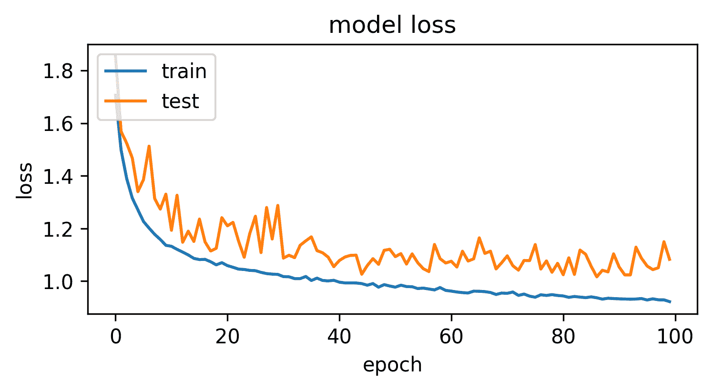

图 9.11:训练和测试集在训练时期的损失


# 做预测

首先，让我们准备数据来预测图像:

```
array = np.mat(data.pixels[1]).reshape(48, 48) 
image = scipy.misc.toimage(array, cmin=0.0) 
display(image) 
print(emotion_labels[data.emotion[1]]) 

<Image> 

```

让我们输入一个愤怒的情绪图像:

```
input_img = np.array(array).reshape(1,48,48,1)
```

好吧，我们有一张愤怒的脸。现在让我们进行预测，并检查网络是否能正确识别它:

```
prediction = model.predict(input_img) 
print(prediction) 
[[ 0.05708674  0.35863262  0.03299783  0.17862292  0.00069717  0.37196276]] 
emotion_labels[prediction.argmax()] 
'Neutral' 
```

请注意那些由 6 个浮点数组成数组。这些是属于每一类的概率。换句话说，该模型预测，这张脸可能是一个愤怒的人，只有 5%的概率。完整的表格将如下所示:

| **愤怒的** | **恐惧** | **快乐** | **悲伤** | **惊喜** | **空档** |
| 0.05708674 | 0.35863262 | 0.03299783 | 0.17862292 | 0.00069717 | 0.37196276 |

```
for i in xrange(1, 100): 
    array = np.mat(data.pixels[i]).reshape(48, 48) 
    image = scipy.misc.toimage(array, cmin=0.0) 
    display(image) 
    print(emotion_labels[data.emotion[i]]) 
    input_img = np.array(array).reshape(1,48,48,1) 
    prediction = model.predict(input_img) 
    print(emotion_labels[prediction.argmax()])
```

您将获得以下结果:

```
Angry 
Neutral 

Fear 
Sad 

Sad 
Sad 

Neutral 
Neutral 

Fear 
Sad 

Sad 
Sad 

Happy 
Happy 

Happy 
Happy 

Fear 
Fear 
```

在测试集上评估训练的模型。该函数报告损失值和精确度，如下所示:

```
model.evaluate_generator(test_flow, steps=len(X_test) / batch_size) 
[1.1285726155553546, 0.60696517426491459]
```

所以，我们模型的最终准确率大约是 60%。考虑到数据集有多嘈杂，这还不算太糟糕。


# 以 HDF5 格式保存模型

保存模型非常简单，如下所示:

```
model.save('Emotions.h5') 
```


# 转换为核心 ML 格式

在 iOS 上使用预训练 CNN 的最简单方法是将其转换为核心 ML 格式:

```
from keras.models import load_model
model = load_model('Emotions.h5')
coreml_model = convert(model, 
                       image_input_names = 'image', 
                       class_labels = emotion_labels)
...
coreml_model.save('Emotions.mlmodel')
```


# 可视化卷积滤波器

调试 CNN 是出了名的困难。检查卷积层是否学到了任何有意义的东西的方法之一是使用`Keras-vis`包可视化它们的输出:

```
from vis.utils import utils 
from vis.visualization import visualize_class_activation, get_num_filters 
```

我们必须将灰度图像转换为`rgb`，以便与`keras-vis`一起使用:

```
def to_rgb(im): 
    # I think this will be slow 
    w, h = im.shape 
    ret = np.empty((w, h, 3), dtype=np.uint8) 
    ret[:, :, 0] = im 
    ret[:, :, 1] = im 
    ret[:, :, 2] = im 
    return ret 
```

我们要可视化的层的名称(请参考模型结构以了解确切的层名称):

```
layer_names = ['conv2d_1', 'conv2d_2',  
               'conv2d_3', 'conv2d_4',  
               'conv2d_5', 'conv2d_6'] 

layer_sizes = [(80, 20), (80, 20),  
               (80, 40), (80, 40),  
               (80, 80), (80, 80)] 

stitched_figs = [] 

for (layer_name, layer_size) in zip(layer_names, layer_sizes): 
    layer_idx = [idx for idx, layer in enumerate(model.layers) if layer.name == layer_name][0] 

```

可视化该层中的所有过滤器:

```
filters = np.arange(get_num_filters(model.layers[layer_idx])) 
```

为每个过滤器生成输入图像，如下所示。这里的`text`字段用于覆盖图像顶部的`filter_value`:

```
    vis_images = [] 
    for idx in filters: 
        img = visualize_class_activation(model, layer_idx, filter_indices=idx)  
        vis_images.append(to_rgb(img.reshape(48,48))) 

```

生成 8 列拼接图像调色板，如下所示:

```
    stitched = utils.stitch_images(vis_images, cols=8) 
    stitched_figs.append(stitched) 

    plt.figure(figsize = layer_size) 
    plt.axis('off') 
    plt.imshow(stitched, interpolation='nearest', aspect='auto') 
    plt.title(layer_name) 
    plt.savefig(layer_name+"_filters.png", bbox_inches='tight') 
    plt.show() 
```

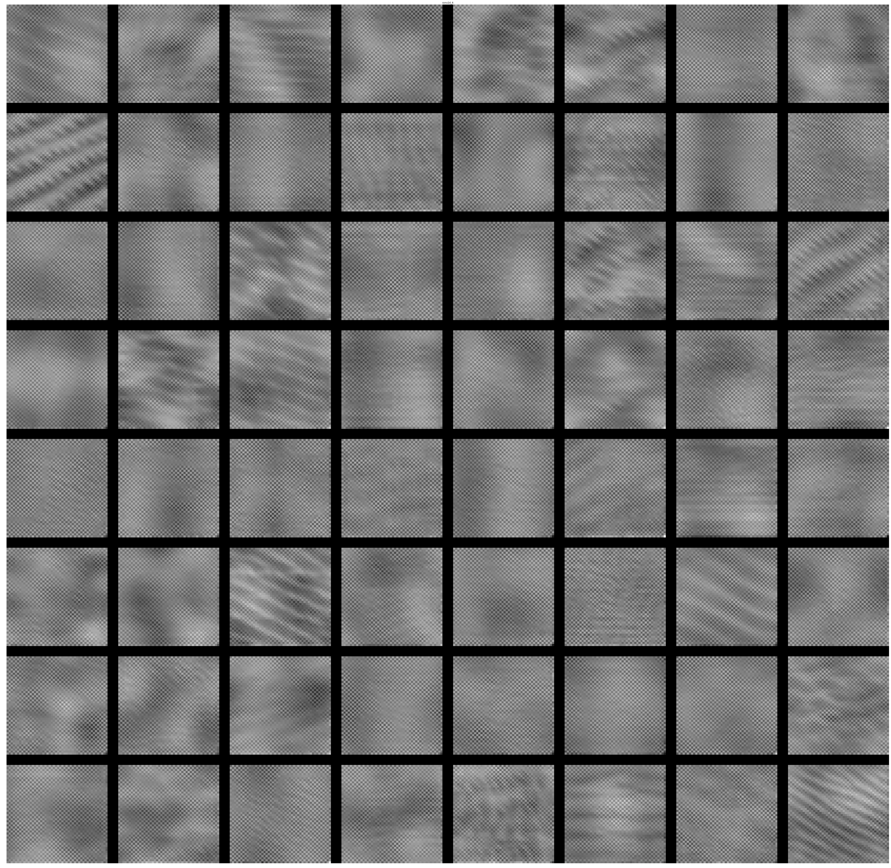

图 9.12:网络最后一个卷积层的卷积滤波器


# 将 CNN 部署到 iOS

您需要将上一节中生成的核心 ML 文件拖放到您的项目中，以开始使用模型。

进口:

```
import Foundation
import Vision
import AVFoundation
import UIKit
```

首先，让我们定义一些数据结构。可能分类结果的枚举:

```
enum FaceExpressions: String {
 case angry = "angry"
 case anxious = "anxious"
 case neutral = "neutral"
 case happy = "happy"
 case sad = "sad"
}
```

分类器错误的枚举:

```
enum ClassifierError: Error {
 case unableToResizeBuffer
 case noResults
}
```

`Classifier`是核心 ML 模型的包装器单例:

```
class Classifier {
 public static let shared = Classifier()

 private let visionModel: VNCoreMLModel
 var visionRequests = [VNRequest]()
 var completion: ((_ label: [(FaceExpressions, Double)], _ error: Error?)->())?
```

```
private init() {
 guard let visionModel = try? VNCoreMLModel(for: Emotions().model) else {
 fatalError("Could not load model")
 }

 self.visionModel = visionModel

 let classificationRequest = VNCoreMLRequest(model: visionModel, completionHandler: classificationResultHandler)
 classificationRequest.imageCropAndScaleOption = .centerCrop
 visionRequests = [classificationRequest]
 }
```

根据推理运行网络的功能:

```
 public func classifyFace(image: CGImage, completion: @escaping (_ labels: [(FaceExpressions, Double)], _ error: Error?)->()) {
 self.completion = completion
 let imageRequestHandler = VNImageRequestHandler(cgImage: image, orientation: .up)
 do {
 try imageRequestHandler.perform(visionRequests)
 } catch {
 print(error)
 completion([], error)
 }
 }
```

当新的分类结果出现时，将调用该方法:

```
private func classificationResultHandler(request: VNRequest, error: Error?) {
 if let error = error {
 print(error.localizedDescription)
 self.completion?([], error)
 return
 }
 guard let results = request.results as? [VNClassificationObservation] else {
 print("No results")
 self.completion?([], ClassifierError.noResults)
 return
 }

 let sortedResults = results
 .sorted { $0.confidence > $1.confidence }
 .map{(FaceExpressions(rawValue:$0.identifier)!, Double($0.confidence))}
```

```
self.completion?(sortedResults, nil)
 print(sortedResults)
 }
}
```

这里我们省略了应用的 UI 部分，完整代码请参考演示应用。


# 摘要

在这一章中，我们建立了一个深度学习 CNN，并使用 Keras 训练它识别照片上的面部表情。然后，我们使用 Core ML 将其移植到移动应用中。该模型可以实时工作。我们也已经熟悉了苹果的愿景框架。

CNN 是强大的工具，可以应用于许多计算机视觉任务，以及时间序列预测、自然语言处理等。它们是围绕卷积的概念构建的，卷积是一种数学运算，可用于定义多种类型的图像变换。CNN 学习卷积滤波器的方式与通常的神经网络使用相同的随机梯度下降学习权重的方式相似。卷积比通常的矩阵乘法需要更少的计算，这就是为什么它们可以有效地用于移动设备。除了卷积层，CNN 通常包括其他类型的层，如池化、全连接、非线性、正则化等等。多年来，研究人员出于不同的目的提出了许多 CNN 架构。其中一些是专门为在移动设备上运行而设计的；例如 SquizeNet 和 MobileNets。

在下一章，我们将探索人类自然语言的神奇世界。我们还将使用神经网络来构建几个具有不同个性的聊天机器人。


# 文献学

1.  *表征学习的挑战:关于三个机器学习* *竞赛的报告*，I Goodfellow，D Erhan，PL Carrier，A，M Mirza，B Hamner，W Cukierski，Y Tang，DH Lee，Y Zhou，C Ramaiah，F Feng，R Li，X Wang，D Athanasakis，J Shawe-Taylor，M Milakov，J Park，R，M Popescu，C Grozea，J Bergstra，J Xie，L Romaszko，B Xu，Z Chuang，和 arXiv 2013。比赛地点[http://deeplearning.net/icml2013-workshop-competition](http://deeplearning.net/icml2013-workshop-competition)。
2.  *情感计算*，罗莎琳德·皮卡尔。麻省理工学院技术报告#32，1995 年【http://affect.media.mit.edu/pdfs/95.picard.pdf 。
3.  批量标准化:通过减少内部协变量转移加速深度网络训练。谢尔盖·约夫，克里斯蒂安·塞格迪，2015。