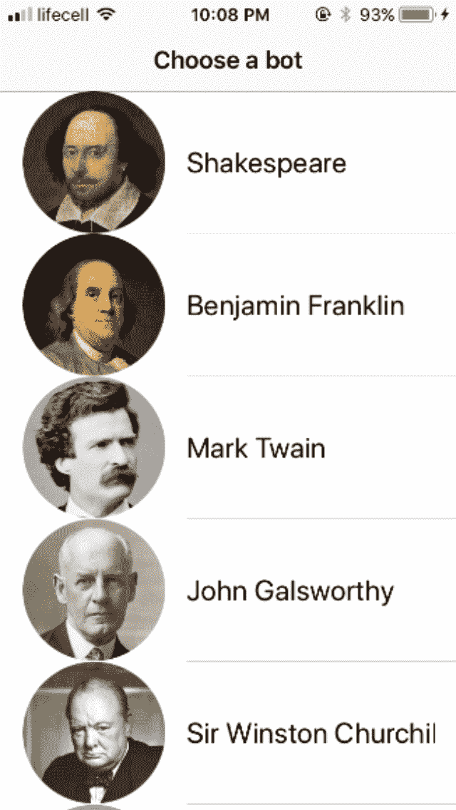
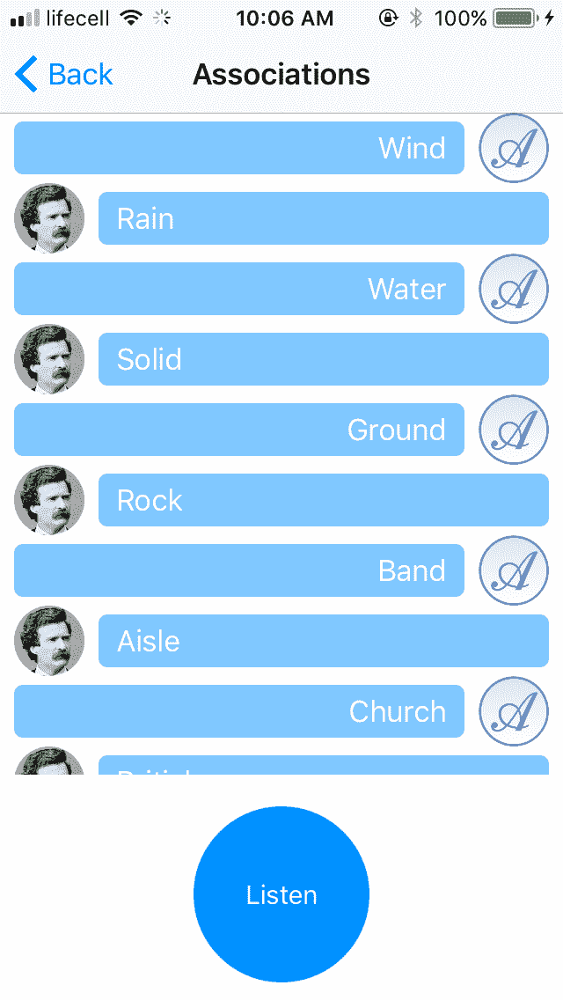
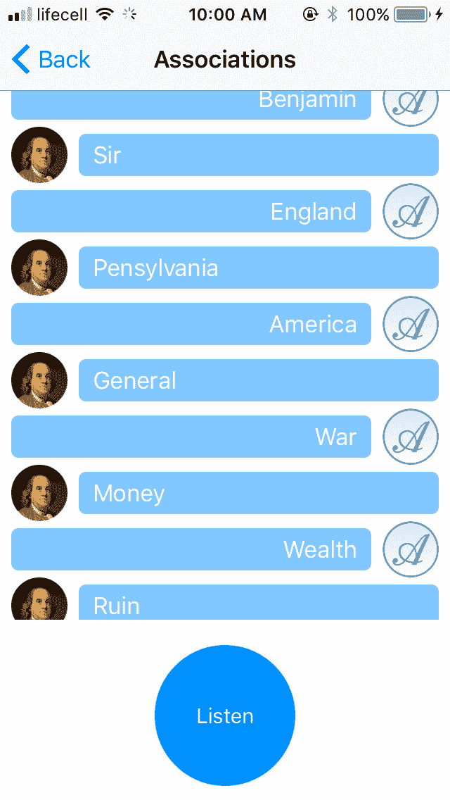
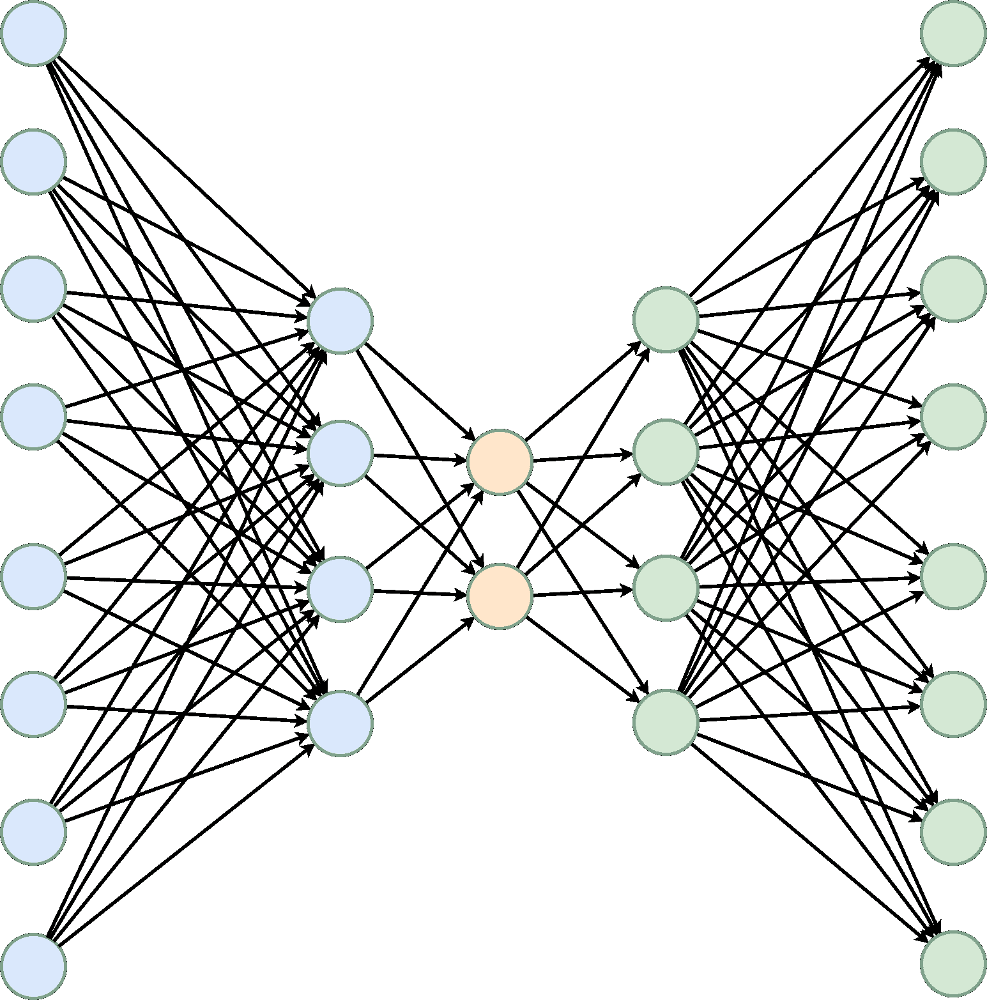
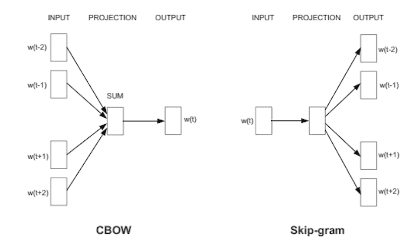
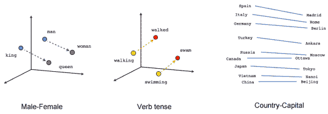
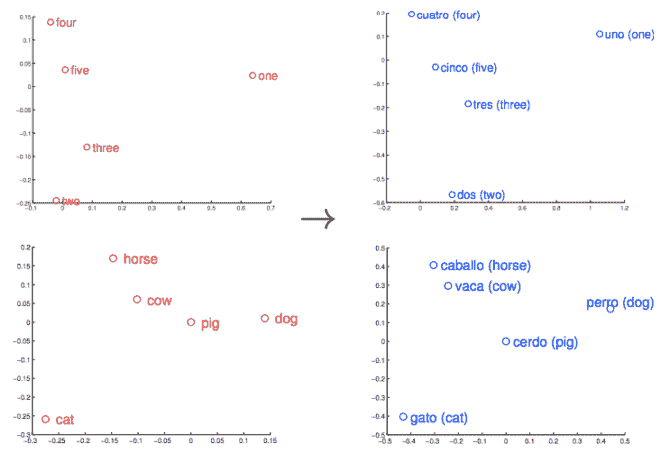
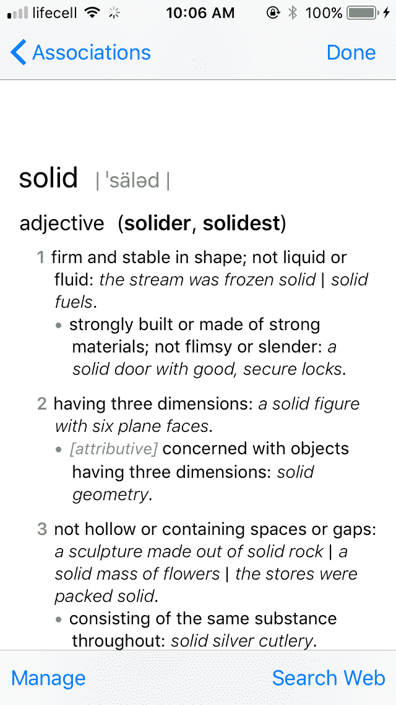

# 自然语言处理

语言是我们日常生活中不可或缺的一部分，也是人与人之间交流思想的自然方式。但是对我们来说理解我们的母语是容易的，对计算机来说处理它也是困难的。互联网永远改变了语言科学，因为它允许收集大量的文本和录音。语言学、计算机科学和机器学习的交叉领域被称为**自然语言处理** ( **NLP** )。

在这一章中，我们将了解 NLP 的基本概念和应用，与移动开发相关。我们将讨论 iOS 和 macOS SDK 为语言处理提供的强大工具。我们还将学习分布语义学的理论和作为其体现的词的向量表示法。它们将允许我们以计算机最喜欢的格式表达句子的意思——以数字的形式。基于向量表示，我们将从头开始构建一个聊天机器人来玩一个*单词联想*游戏。

在本章中，我们将讨论以下主题:

*   什么是 NLP？
*   Python 库—NLTK 和 Gensim
*   iOS NLP 工具—NSRegularExpression、NSDataDetector、NSLinguisticTagger、Speech framework 和 UIReferenceLibraryViewController
*   macOS NLP 工具—latentsmanticmapping
*   如何使用记号化、词汇化和词性标注
*   什么是向量单词表示法？
*   如何生成单词嵌入
*   如何在 iOS 上使用 Word2Vec 模型
*   如何从头开始构建聊天机器人


# 移动开发世界中的 NLP

通常，自然语言处理专家处理大量组织在语言语料库中的原始文本。这个领域中的算法是消耗资源的，并且经常包含许多手工制作的试探法。所有这些看起来都不太适合移动应用，在移动应用中，每秒每兆字节或每帧都很重要。尽管有这些障碍，NLP 在移动平台上被广泛使用，通常与服务器端后端紧密集成以进行繁重的计算。以下是许多移动应用程序中常见的 NLP 功能列表:

*   聊天机器人
*   垃圾邮件过滤
*   自动翻译
*   情感分析
*   语音到文本和文本到语音
*   自动拼写和语法纠正
*   自动完成
*   键盘建议

直到最近，除了最后两项任务，所有任务都是在服务器端完成的，但随着移动计算能力的增长，更多的应用程序倾向于在客户端本地进行处理(至少是部分处理)。当我们谈论移动设备上的 NLP 时，在大多数情况下，它是关于处理私人用户信息:消息、信件、笔记和类似的文本。因此，这里的安全问题尤为突出。通过从我们的模式中删除服务器，我们大大降低了泄露用户数据的风险。在本章中，除了讨论常见的技巧和流行的 NLP 工具，我们还将了解苹果在 iOS SDK 中提供的解决方案。此外，继续我们关于神经网络的对话，我们将教六个聊天机器人玩一个*单词联想*游戏。每个聊天机器人都有自己的个性，并在设备上运行。每个模型平均不会超过 3 MB。



图 10.1:我们应用程序中的每个聊天机器人都有自己的个性


# 单词联想游戏

我们很多人小时候可能都玩过这个游戏。规则非常简单:

*   你说这个词:

```
do while(true) { 
```

*   我首先想到的是你的话
*   你给我协会一个协会:

```
} 
```

比如狗→猫→宠物→玩具→婴儿→女孩→婚礼→葬礼。在游戏中，人们互相透露自己的生活经历和思维方式；也许这就是我们小时候能玩几个小时的原因。不同的人对同一个词有不同的联想，而联想往往会朝着一个完全意想不到的方向发展。一个多世纪以来，心理学家一直在研究联想系列，希望从中找到揭开意识和潜意识奥秘的钥匙。你能编一个 AI 这样玩的游戏吗？也许你认为你将需要一个手工组成的关联数据库。但是如果你想让你的 AI 有几个人格呢？多亏了机器学习，这绝对是可能的，你甚至不需要手动构建数据库。在下面的截图中，你可以看到马克·吐温和本杰明·富兰克林两个角色的两个游戏的结果:



图 10.2:和历史人物玩单词联想游戏

如果你对这个游戏没有概念，可以去维基百科，在那里得到更详细的解释:[https://en.wikipedia.org/wiki/Word_Association](https://en.wikipedia.org/wiki/Word_Association)。


# Python NLP 库

我们将在本章使用的两个 Python 库是**自然语言工具包** ( **NLTK** )和 Gensim。我们将使用第一个用于文本预处理，第二个用于训练或机器学习模型。要安装它们，请激活您的 Python 虚拟环境:

```
> cd ~
> virtualenv swift-ml-book
```

并运行`pip install`:

```
> pip install -U nltk gensim 
```

官方网站:
Python 中 NLP 的其他流行库:

*   NLTK，[http://www.nltk.org/](http://www.nltk.org/)
*   根辛姆，[https://radimrehurek.com/gensim/](https://radimrehurek.com/gensim/)

Other popular libraries for NLP in Python:

*   https://textblob.readthedocs.io/en/dev/
*   斯坦福大学的科伦普，[https://stanfordnlp.github.io/CoreNLP/](https://stanfordnlp.github.io/CoreNLP/)
*   斯帕西，[https://spacy.io/](https://spacy.io/)


# 文本语料库

对于我们的 NLP 实验，我们需要一些相当大的文本。我使用了古腾堡计划中的古典作家和政治家的全集，因为它们在公共领域，但是你可以在上面找到你自己的文本和训练模型。如果你想使用和我一样的文本，我把它们放在了本章的补充材料中的`Corpuses`文件夹下。应该有五个人:本杰明·富兰克林、约翰·高尔斯华绥、马克·吐温、威廉·莎士比亚和温斯顿·丘吉尔。创建一个新的 Jupyter 笔记本，并将马克·吐温的文集作为一个长字符串加载:

```
import zipfile 
zip_ref = zipfile.ZipFile('Corpuses.zip', 'r') 
zip_ref.extractall('') 
zip_ref.close() 
In [1]: 
import codecs 
In [2]: 
one_long_string = "" 
with codecs.open('Corpuses/MarkTwain.txt', 'r', 'utf-8-sig') as text_file: 
    one_long_string = text_file.read() 
In [3]: 
one_long_string[99000:99900] 
Out[3]: 
u"size, very elegantly wrought and dressed in the fancifulrncostumes of two centuries ago. The design was a history of something or somebody, but none of us were learned enough to read the story. The old father, reposing under a stone close by, dated 1686, might have told usrnif he could have risen. But he didn't.rnrnAs we came down through the town we encountered a squad of little donkeysrnready saddled for use. The saddles were peculiar, to say the least.rnThey consisted of a sort of saw-buck with a small mattress on it, andrnthis furniture covered about half the donkey. There were no stirrups,rnbut really such supports were not needed--to use such a saddle was thernnext thing to riding a dinner table--there was ample support clear out tornone's knee joints. A pack of ragged Portuguese muleteers crowded aroundrnus, offering their beasts at half a dollar an hour--more rascality to" 
```


# 常见的 NLP 方法和子任务

大多数程序员都熟悉处理自然语言的最简单方式:正则表达式。不同编程语言有许多正则表达式实现，它们在细节上有所不同。由于这些细节，不同平台上的同一个正则表达式可能产生不同的结果，或者根本不起作用。两个最流行的标准是 POSIX 和 Perl。然而，基础框架包含它自己版本的正则表达式，基于 ICU C++库。它是 Unicode 字符串的 POSIX 标准的扩展。

为什么我们在这里讨论正则表达式？正则表达式是 NLP 专家称之为启发式的一个很好的例子——手动编写的规则，特别的解决方案，以及以一种考虑到所有异常和变化的方式描述一个复杂的结构。复杂的试探法需要深厚的领域专业知识来构建。只有当我们不能用启发式方法捕捉所有的复杂性时，我们才会去进行机器学习。试探法是脆弱的，构建成本高，但不一定是错的；与机器学习不同，它们是确定性的，易于测试。

启发式和机器学习是使用 NLP 的两个武器。大型 NLP 任务通常由较小的任务组成。要执行语法纠正，您必须将文本拆分成句子，将句子拆分成单词，确定这些句子中的词性，等等。在我们的文本语料库预处理中，我们将经历几个这样的任务:句子标记化、单词标记化、词条标记化和停用词去除。


# 标记化

语言学中的令牌不同于过去使用的授权令牌。它们是语言单位:单词是记号，数字和标点符号是记号，句子是记号。换句话说，它们是离散的信息或意义。标记化是将文本拆分成**词汇标记**的过程。句子分词器将文本拆分成句子，单词分词器将句子进一步拆分成单独的单词、标点符号等等。这个任务可能看起来很简单(**有一个正则表达式！**)，但这种印象是骗人的。这里有几个问题需要考虑:

*   如何用连字符或撇号来标记单词，例如，*纽约的*或*你是*？
*   如何对网址和邮件进行分词，比如`My_mail@examplewebsite.com`？
*   表情符号和 kaomoji 怎么办？！
*   对于那些把几个单词粘成一个长单词是常态的语言，该怎么办呢？德语*siebenhundertsieebenundsiebzig tausendsiebenhundertsiebeenundsiebzig*就是一个例子。顺便说一下，这是 777，777 这个数字。
*   完全不使用空格的语言(中文和泰文)怎么办？

幸运的是，有许多针对不同语言的标记器实现，包括 NLTK Python 库和 Apple `NSLinguisticTagger`:

```
In [4]: 
from nltk import word_tokenize, sent_tokenize 
In [5]: 
sentences = sent_tokenize(one_long_string) 
del(one_long_string) 
In [6]: 
sentences[200:205] 
Out[6]: 
[u'Ah, if I had only known then that he was only a common mortal, and thatrnhis mission had nothing more overpowering about it than the collecting ofrnseeds and uncommon yams and extraordinary cabbages and peculiar bullfrogsrnfor that poor, useless, innocent, mildewed old fossil the SmithsonianrnInstitute, I would have felt so much relieved.', 
 u'During that memorable month I basked in the happiness of being for oncernin my life drifting with the tide of a great popular movement.', 
 u'Everybodyrnwas going to Europe--I, too, was going to Europe.', 
 u'Everybody was going tornthe famous Paris Exposition--I, too, was going to the Paris Exposition.', 
 u'The steamship lines were carrying Americans out of the various ports ofrnthe country at the rate of four or five thousand a week in the aggregate.'] 
In [7]: 
tokenized_sentences = map(word_tokenize, sentences) 
del(sentences) 
In [8]: 
print(tokenized_sentences[200:205]) 
[[u'Ah', u',', u'if', u'I', u'had', u'only', u'known', u'then', u'that', u'he', u'was', u'only', u'a', u'common', u'mortal', u',', u'and', u'that', u'his', u'mission', u'had', u'nothing', u'more', u'overpowering', u'about', u'it', u'than', u'the', u'collecting', u'of', u'seeds', u'and', u'uncommon', u'yams', u'and', u'extraordinary', u'cabbages', u'and', u'peculiar', u'bullfrogs', u'for', u'that', u'poor', u',', u'useless', u',', u'innocent', u',', u'mildewed', u'old', u'fossil', u'the', u'Smithsonian', u'Institute', u',', u'I', u'would', u'have', u'felt', u'so', u'much', u'relieved', u'.'], [u'During', u'that', u'memorable', u'month', u'I', u'basked', u'in', u'the', u'happiness', u'of', u'being', u'for', u'once', u'in', u'my', u'life', u'drifting', u'with', u'the', u'tide', u'of', u'a', u'great', u'popular', u'movement', u'.'], [u'Everybody', u'was', u'going', u'to', u'Europe', u'--', u'I', u',', u'too', u',', u'was', u'going', u'to', u'Europe', u'.'], [u'Everybody', u'was', u'going', u'to', u'the', u'famous', u'Paris', u'Exposition', u'--', u'I', u',', u'too', u',', u'was', u'going', u'to', u'the', u'Paris', u'Exposition', u'.'], [u'The', u'steamship', u'lines', u'were', u'carrying', u'Americans', u'out', u'of', u'the', u'various', u'ports', u'of', u'the', u'country', u'at', u'the', u'rate', u'of', u'four', u'or', u'five', u'thousand', u'a', u'week', u'in', u'the', u'aggregate', u'.']] 
In [9]: 
from nltk import download 
In [10]: 
download('stopwords') 
[nltk_data] Downloading package stopwords to 
[nltk_data]     /Users/Oleksandr/nltk_data... 
[nltk_data]   Package stopwords is already up-to-date! 
Out[10]: 
True 
In [11]: 
from nltk.stem import WordNetLemmatizer 
In [12]: 
wordnet_lemmatizer = WordNetLemmatizer() 
In [13]: 
lemmatized_sentences = map(lambda sentence: map(wordnet_lemmatizer.lemmatize, sentence), tokenized_sentences) 
In [14]: 
print(lemmatized_sentences[200:205]) 
[[u'Ah', u',', u'if', u'I', u'had', u'only', u'known', u'then', u'that', u'he', u'wa', u'only', u'a', u'common', u'mortal', u',', u'and', u'that', u'his', u'mission', u'had', u'nothing', u'more', u'overpowering', u'about', u'it', u'than', u'the', u'collecting', u'of', u'seed', u'and', u'uncommon', u'yam', u'and', u'extraordinary', u'cabbage', u'and', u'peculiar', u'bullfrog', u'for', u'that', u'poor', u',', u'useless', u',', u'innocent', u',', u'mildewed', u'old', u'fossil', u'the', u'Smithsonian', u'Institute', u',', u'I', u'would', u'have', u'felt', u'so', u'much', u'relieved', u'.'], [u'During', u'that', u'memorable', u'month', u'I', u'basked', u'in', u'the', u'happiness', u'of', u'being', u'for', u'once', u'in', u'my', u'life', u'drifting', u'with', u'the', u'tide', u'of', u'a', u'great', u'popular', u'movement', u'.'], [u'Everybody', u'wa', u'going', u'to', u'Europe', u'--', u'I', u',', u'too', u',', u'wa', u'going', u'to', u'Europe', u'.'], [u'Everybody', u'wa', u'going', u'to', u'the', u'famous', u'Paris', u'Exposition', u'--', u'I', u',', u'too', u',', u'wa', u'going', u'to', u'the', u'Paris', u'Exposition', u'.'], [u'The', u'steamship', u'line', u'were', u'carrying', u'Americans', u'out', u'of', u'the', u'various', u'port', u'of', u'the', u'country', u'at', u'the', u'rate', u'of', u'four', u'or', u'five', u'thousand', u'a', u'week', u'in', u'the', u'aggregate', u'.']] 
In [15]: 
del(tokenized_sentences) 
```


# 堵塞物

词干提取是将单词缩减为词干的过程。这里的想法是，相关的单词通常可以简化为一个共同的词干。

例如:(**带** e，**带** ening，**带** ish，**带** er) → **带**。

例如，这可以用于扩展用户查询。但有些情况可能会很棘手，想想英国的*男人*和*男人*，爱尔兰的*男人* = *女人*和*女人* = *女人*，或者更极端的英语 *am* ，*是*，*是*，*是*，*是*和*有几种流行的英语词干分析器。*


# 词汇化

这是比词干提取更高级的方法。词条分类器不是将单词归入词干，而是将每个单词与其*词条*(字典中的形式)进行匹配。这对于像波兰语这样的语言来说尤其有用，在波兰语中，一个动词可以很容易地拥有 220 种不同的语法形式，其中大多数都有不同的拼写:[http://wsjp.pl/do_druku.php?id_hasla=34745&id _ znaczenia = 0](http://wsjp.pl/do_druku.php?id_hasla=34745&id_znaczenia=0)。

这里的问题是同音词。


# 词性标注

NLTK 使用预训练的机器学习模型(平均感知器)进行词性标注。对英语来说，这项任务尤其艰巨，因为与许多其他语言不同，同一个单词可以根据上下文扮演不同的词类角色:

```
In [16]: 
from nltk import download 
In [17]: 
download('averaged_perceptron_tagger') 
[nltk_data] Downloading package averaged_perceptron_tagger to 
[nltk_data]     /Users/Oleksandr/nltk_data... 
[nltk_data]   Package averaged_perceptron_tagger is already up-to- 
[nltk_data]       date! 
Out[17]: 
True 
In [18]: 
from nltk import pos_tag, pos_tag_sents 
In [19]: 
pos_tag(word_tokenize('Cats, cat, Cat, and "The Cats"')) 
Out[19]: 
[('Cats', 'NNS'), 
 (',', ','), 
 ('cat', 'NN'), 
 (',', ','), 
 ('Cat', 'NNP'), 
 (',', ','), 
 ('and', 'CC'), 
 ('``', '``'), 
 ('The', 'DT'), 
 ('Cats', 'NNP'), 
 ("''", "''")] 
In [20]: 
pos_sentences = pos_tag_sents(lemmatized_sentences) 
del(lemmatized_sentences) 
In [21]: 
print(pos_sentences[200:205]) 
[[(u'Ah', 'NNP'), (u',', ','), (u'if', 'IN'), (u'I', 'PRP'), (u'had', 'VBD'), (u'only', 'RB'), (u'known', 'VBN'), (u'then', 'RB'), (u'that', 'IN'), (u'he', 'PRP'), (u'wa', 'VBZ'), (u'only', 'RB'), (u'a', 'DT'), (u'common', 'JJ'), (u'mortal', 'NN'), (u',', ','), (u'and', 'CC'), (u'that', 'IN'), (u'his', 'PRP$'), (u'mission', 'NN'), (u'had', 'VBD'), (u'nothing', 'NN'), (u'more', 'RBR'), (u'overpowering', 'VBG'), (u'about', 'IN'), (u'it', 'PRP'), (u'than', 'IN'), (u'the', 'DT'), (u'collecting', 'NN'), (u'of', 'IN'), (u'seed', 'NN'), (u'and', 'CC'), (u'uncommon', 'JJ'), (u'yam', 'NN'), (u'and', 'CC'), (u'extraordinary', 'JJ'), (u'cabbage', 'NN'), (u'and', 'CC'), (u'peculiar', 'JJ'), (u'bullfrog', 'NN'), (u'for', 'IN'), (u'that', 'DT'), (u'poor', 'JJ'), (u',', ','), (u'useless', 'JJ'), (u',', ','), (u'innocent', 'JJ'), (u',', ','), (u'mildewed', 'VBD'), (u'old', 'JJ'), (u'fossil', 'NN'), (u'the', 'DT'), (u'Smithsonian', 'NNP'), (u'Institute', 'NNP'), (u',', ','), (u'I', 'PRP'), (u'would', 'MD'), (u'have', 'VB'), (u'felt', 'VBN'), (u'so', 'RB'), (u'much', 'JJ'), (u'relieved', 'NN'), (u'.', '.')], [(u'During', 'IN'), (u'that', 'DT'), (u'memorable', 'JJ'), (u'month', 'NN'), (u'I', 'PRP'), (u'basked', 'VBD'), (u'in', 'IN'), (u'the', 'DT'), (u'happiness', 'NN'), (u'of', 'IN'), (u'being', 'VBG'), (u'for', 'IN'), (u'once', 'RB'), (u'in', 'IN'), (u'my', 'PRP$'), (u'life', 'NN'), (u'drifting', 'VBG'), (u'with', 'IN'), (u'the', 'DT'), (u'tide', 'NN'), (u'of', 'IN'), (u'a', 'DT'), (u'great', 'JJ'), (u'popular', 'JJ'), (u'movement', 'NN'), (u'.', '.')], [(u'Everybody', 'NN'), (u'wa', 'VBZ'), (u'going', 'VBG'), (u'to', 'TO'), (u'Europe', 'NNP'), (u'--', ':'), (u'I', 'PRP'), (u',', ','), (u'too', 'RB'), (u',', ','), (u'wa', 'VBZ'), (u'going', 'VBG'), (u'to', 'TO'), (u'Europe', 'NNP'), (u'.', '.')], [(u'Everybody', 'NN'), (u'wa', 'VBZ'), (u'going', 'VBG'), (u'to', 'TO'), (u'the', 'DT'), (u'famous', 'JJ'), (u'Paris', 'NNP'), (u'Exposition', 'NNP'), (u'--', ':'), (u'I', 'PRP'), (u',', ','), (u'too', 'RB'), (u',', ','), (u'wa', 'VBZ'), (u'going', 'VBG'), (u'to', 'TO'), (u'the', 'DT'), (u'Paris', 'NNP'), (u'Exposition', 'NNP'), (u'.', '.')], [(u'The', 'DT'), (u'steamship', 'NN'), (u'line', 'NN'), (u'were', 'VBD'), (u'carrying', 'VBG'), (u'Americans', 'NNPS'), (u'out', 'IN'), (u'of', 'IN'), (u'the', 'DT'), (u'various', 'JJ'), (u'port', 'NN'), (u'of', 'IN'), (u'the', 'DT'), (u'country', 'NN'), (u'at', 'IN'), (u'the', 'DT'), (u'rate', 'NN'), (u'of', 'IN'), (u'four', 'CD'), (u'or', 'CC'), (u'five', 'CD'), (u'thousand', 'NNS'), (u'a', 'DT'), (u'week', 'NN'), (u'in', 'IN'), (u'the', 'DT'), (u'aggregate', 'NN'), (u'.', '.')]] 
In [22]: 
download('tagsets') 
[nltk_data] Downloading package tagsets to 
[nltk_data]     /Users/Oleksandr/nltk_data... 
[nltk_data]   Package tagsets is already up-to-date! 
Out[22]: 
True 
In [23]: 
from nltk.help import upenn_tagset 
In [24]: 
upenn_tagset() 
```

您可以在笔记本或 NLTK 文档中找到标签的完整列表:[https://www . ling . upenn . edu/courses/Fall _ 2003/ling 001/Penn _ tree bank _ pos . html](https://www.ling.upenn.edu/courses/Fall_2003/ling001/penn_treebank_pos.html)。在这里，我只是用一些例子来叙述对我们的目标很重要的位置。

形容词:

```
JJ: adjective or numeral, ordinal 
third ill-mannered pre-war regrettable oiled calamitous first  
JJR: adjective, comparative 
JJS: adjective, superlative 
```

名词:

```
NN: noun, common, singular or mass 
common-carrier cabbage knuckle-duster Casino afghan shed 
NNP: noun, proper, singular 
Conchita Escobar Kreisler Sawyer CTCA Shannon A.K.C. Liverpool 
NNPS: noun, proper, plural 
Americans Americas Anarcho-Syndicalists Andalusians Andes 
NNS: noun, common, plural 
```

副词:

```
RB: adverb 
occasionally unabatingly maddeningly adventurously swiftly 
RBR: adverb, comparative 
RBS: adverb, superlative 
```

感叹词:

```
UH: interjection 
Goodbye Wow Hey Oops amen huh uh anyways honey man baby hush 
```

动词:

```
VB: verb, base form 
ask assemble assess assign assume avoid bake balkanize begin 
VBD: verb, past tense 
VBG: verb, present participle or gerund 
VBN: verb, past participle 
VBP: verb, present tense, not 3rd person singular 
VBZ: verb, present tense, 3rd person singular 
```


# 命名实体识别(NER)

注意(u'Paris '，' NNP ')，(u'Exposition '，' NNP ')，(u'Americans，NNPS)。NNP 代表专有名词，NNPS 专有名词复数。我们需要去掉非专有名词中的所有大写字母，以及所有标点符号和数字:

```
In [25]: 
# tags_to_delete = ['$', "''", "(", ")", ",", "--", ".", ":", "CC"] 
tags_to_not_lowercase = set(['NNP', 'NNPS']) 
tags_to_preserve = set(['JJ', 'JJR', 'JJS', 'NN', 'NNP', 'NNPS', 'NNS', 'RB', 'RBR', 'RBS','UH', 'VB', 'VBD', 'VBG', 'VBN', 'VBP', 'VBZ']) 
In [26]: 
print(pos_sentences[203]) 
[(u'Everybody', 'NN'), (u'wa', 'VBZ'), (u'going', 'VBG'), (u'to', 'TO'), (u'the', 'DT'), (u'famous', 'JJ'), (u'Paris', 'NNP'), (u'Exposition', 'NNP'), (u'--', ':'), (u'I', 'PRP'), (u',', ','), (u'too', 'RB'), (u',', ','), (u'wa', 'VBZ'), (u'going', 'VBG'), (u'to', 'TO'), (u'the', 'DT'), (u'Paris', 'NNP'), (u'Exposition', 'NNP'), (u'.', '.')] 
In [27]: 
def carefully_lowercase(words): 
    return [(word.lower(), pos) if pos not in tags_to_not_lowercase else (word, pos) 
            for (word, pos) in words] 
In [28]: 
def filter_meaningful(words): 
    return [word for (word, pos) in words if pos in tags_to_preserve] 
In [29]: 
res = map(carefully_lowercase, pos_sentences[203:205]) 
print(res) 
[[(u'everybody', 'NN'), (u'wa', 'VBZ'), (u'going', 'VBG'), (u'to', 'TO'), (u'the', 'DT'), (u'famous', 'JJ'), (u'Paris', 'NNP'), (u'Exposition', 'NNP'), (u'--', ':'), (u'i', 'PRP'), (u',', ','), (u'too', 'RB'), (u',', ','), (u'wa', 'VBZ'), (u'going', 'VBG'), (u'to', 'TO'), (u'the', 'DT'), (u'Paris', 'NNP'), (u'Exposition', 'NNP'), (u'.', '.')], [(u'the', 'DT'), (u'steamship', 'NN'), (u'line', 'NN'), (u'were', 'VBD'), (u'carrying', 'VBG'), (u'Americans', 'NNPS'), (u'out', 'IN'), (u'of', 'IN'), (u'the', 'DT'), (u'various', 'JJ'), (u'port', 'NN'), (u'of', 'IN'), (u'the', 'DT'), (u'country', 'NN'), (u'at', 'IN'), (u'the', 'DT'), (u'rate', 'NN'), (u'of', 'IN'), (u'four', 'CD'), (u'or', 'CC'), (u'five', 'CD'), (u'thousand', 'NNS'), (u'a', 'DT'), (u'week', 'NN'), (u'in', 'IN'), (u'the', 'DT'), (u'aggregate', 'NN'), (u'.', '.')]] 
In [30]: 
filtered = map(filter_meaningful, res) 
del(res) 
print(filtered) 
[[u'everybody', u'wa', u'going', u'famous', u'Paris', u'Exposition', u'too', u'wa', u'going', u'Paris', u'Exposition'], [u'steamship', u'line', u'were', u'carrying', u'Americans', u'various', u'port', u'country', u'rate', u'thousand', u'week', u'aggregate']] 
In [31]: 
lowercased_pos_sentences = map(carefully_lowercase,  pos_sentences) 
del(pos_sentences) 
```


# 删除停用字词和标点符号

停用词是那些不会给句子增加太多信息的词。比如最后一句可以缩短为:*停用词不添加有用信息句*。尽管它看起来不像一个正确的英语句子，但如果你在某个地方听到过，你可能会理解它的意思。这就是为什么在很多情况下，我们可以通过简单地忽略这些词来简化我们的模型。停用词通常是自然文本中最常见的词。对于英语，可以在`nltk.corpus.stopwords`中找到它们的列表:

```
In [32]: 
sentences_to_train_on = map(lambda words: [word for (word, pos) in words], lowercased_pos_sentences) 
In [33]: 
print(sentences_to_train_on[203:205]) 
[[u'everybody', u'wa', u'going', u'to', u'the', u'famous', u'Paris', u'Exposition', u'--', u'i', u',', u'too', u',', u'wa', u'going', u'to', u'the', u'Paris', u'Exposition', u'.'], [u'the', u'steamship', u'line', u'were', u'carrying', u'Americans', u'out', u'of', u'the', u'various', u'port', u'of', u'the', u'country', u'at', u'the', u'rate', u'of', u'four', u'or', u'five', u'thousand', u'a', u'week', u'in', u'the', u'aggregate', u'.']] 
In [34]: 
import itertools 
In [35]: 
filtered = map(filter_meaningful, lowercased_pos_sentences) 
flatten = list(itertools.chain(*filtered)) 
words_to_keep = set(flatten) 
In [36]: 
del(filtered, flatten, lowercased_pos_sentences) 
In [37]: 
from nltk.corpus import stopwords 
import string 
In [38]: 
stop_words = set(stopwords.words('english') + list(string.punctuation) + ['wa']) 
```


# 分布语义学假设

很难说“理解文本的意思”是什么意思，但每个人都会说人能做到这一点，而计算机不能。自然语言理解是人工智能中的难题之一。如何捕捉句子的语义

传统上对这个问题有两种相反的方法。第一个是这样的:从独立单词的定义开始，硬编码它们之间的关系，并写下句子结构。如果你足够坚持，希望你将最终得到一个复杂的模型，它将包含足够的专家知识来解析一些自然问题并产生有意义的答案。然后，你会发现对于一门新的语言，你需要从头开始。

这就是为什么许多研究人员转向相反的方法:统计方法。在这里，我们从大量的文本数据开始，并让计算机计算出文本的含义。**分布语义学**假设一个特定单词在句子中的意义不是由单词本身定义的，而是由该单词出现的所有上下文定义的。维基百科给出了更正式的措辞:

"具有相似分布的语言项目具有相似的意义."

现在抓紧了！在接下来的几节中，我们将讨论一个让你大吃一惊的算法。当我第一次遇到它的时候，我花了几个晚上做实验。我把不同的文本输入其中，从电影评论数据集开始，到古希腊文的新约和未被破译的伏尼契手稿结束。这感觉就像一些狂热或魔术。该算法能够从原始文本中捕捉单词和整个句子的含义，即使是在早已消亡的语言中。对我来说，这是第一次计算机似乎跨越了处理兆字节文本的*和理解人类所写文本的意义的*之间的界限*。*


# 词向量表示法

分布语义学将词表示为意义空间中的向量。在这个空间中，对应于具有相似含义的单词的向量应该彼此接近。然而，如何构建这样的载体并不是一个简单的问题。最简单的方法是从单词的一个热点向量开始，但是向量将是稀疏的和巨大的，每个向量的长度与词汇表中单词的数量相同。这就是我们在类似 autoencoder 的架构中使用降维技术的原因。


# 自动编码器神经网络

**自动编码器**是一个神经网络，其目标是产生与输入相同的输出。例如，如果你向它传递一张图片，它应该在另一端返回同样的图片。这似乎...不复杂！但诀窍在于特殊的架构——它的内层比输入和输出层的神经元少，通常在中间有一些极端的瓶颈。瓶颈之前的层称为编码器，之后的层称为**解码器网络**。编码器将输入转换成某种内部表示，然后解码器将数据恢复成原始形式。在训练过程中，网络必须找出如何最有效地压缩输入数据，然后以尽可能少的信息损失对其进行解压缩。这种架构也可以用来训练神经网络，以我们希望的方式改变输入数据。例如，自动编码器已经成功地用于去除图像中的噪声。

自动编码器神经网络是所谓的**表示学习**的一个例子。它介于监督学习和非监督学习之间。



图 10.3:自动编码器架构

蓝色层是编码器部分，中间的**黄色层**是瓶颈，**绿色层**是解码器。图中的网络是全连通网络(一层的每一个神经元都与下一层的每一个神经元相连)；然而，这并不是自动编码器的唯一选择。


# Word2Vec

Word2Vec 是一种基于神经网络的高效单词嵌入生成算法。它最初是由 Mikolov 等人在*单词和短语的分布式表示及其组合性* (2013)中描述的。在[https://code.google.com/archive/p/word2vec/](https://code.google.com/archive/p/word2vec/)可以获得命令行应用形式的原始 C 实现。



图 10.4:word 2 vec 的架构

Word2Vec 通常被称为深度学习的实例，但架构实际上相当浅:只有三层深度。这种误解可能与它被广泛用于提高 NLP 中深层网络的生产率有关。Word2Vec 架构类似于自动编码器。神经网络的输入是一个足够大的文本语料库，输出是一个向量列表(数字数组)，语料库中的每个单词对应一个向量。该算法使用每个单词的上下文在这些向量中编码关于单词共现的信息。因此，向量具有一些特殊的性质；意义相近的词的向量也彼此接近。虽然我们无法从数学上计算出词义之间的精确距离，但我们可以毫无问题地计算两个向量的相似度。这就是为什么将单词转化为向量的算法如此重要。例如，使用余弦相似性度量，我们可以找到最接近 cat 的单词:

*   鸟:0.760521
*   奶牛:0.766533
*   狗:0.831517
*   老鼠:0.748557
*   金发女郎:0.763721
*   猪:0.751001
*   山羊:0.798104
*   仓鼠:0.768635
*   蜜蜂:0.774112
*   美洲驼:0.747295



图 10.5:可以使用 Word2Vec 捕获的单词之间的关系示例

您可以添加、减去和投影向量。有趣的是，这些运算有一些相当有意义的结果，例如，*国王-男人+女人=王后*，*狗-男人+女人=猫*等等。顺便说一下，正如你从上一个例子中看到的，一个算法相当精确地捕捉到了我们所有的刻板印象。



图 10.6:在不同的语言中，单词在向量空间中的分布是相似的

Word2Vec 不仅可以用于自然文本，还可以用于任何离散状态序列，其中上下文很重要:播放列表、DNA、源代码等等。


# Gensim 中的 Word2Vec

在 iOS 设备上运行 Word2Vec 没有任何意义:在应用程序中，我们只需要它生成的向量。为了运行 Word2Vec，我们将使用 Python NLP 包 gensim。这个库在主题建模方面很流行，包含一个快速的 Word2Vec 实现和一个漂亮的 API。我们不想在手机上加载大量文本，也不想在 iOS 设备上训练 Word2vec，因此我们将使用 Gensim Python 库学习一个矢量表示。然后，我们将做一些预处理(删除除名词以外的所有内容)，并将这个数据库插入我们的 iOS 应用程序:

```
In [39]: 
import gensim 
In [40]: 
def trim_rule(word, count, min_count): 
    if word not in words_to_keep or word in stop_words: 
        return gensim.utils.RULE_DISCARD 
    else: 
        return gensim.utils.RULE_DEFAULT 
In [41]: 
model = gensim.models.Word2Vec(sentences_to_train_on, min_count=15, trim_rule=trim_rule) 
```


# 向量空间属性

”帽匠听到这话，睁大了眼睛。但他只是说，“为什么乌鸦像写字台？”
“来吧，我们现在去找点乐子！”爱丽丝想。我很高兴他们已经开始问谜语了。“我相信我能猜到，”她大声补充道。你的意思是你认为你能找到这个问题的答案吗？三月兔说。"

–*刘易斯·卡罗尔*、*爱丽丝梦游仙境*

*为什么乌鸦像写字台？*借助分布式语义和向量单词表示，我们最终可以帮助爱丽丝解决哈特之谜(以数学上精确的方式):

```
In [42]: 
model.most_similar('house', topn=5) 
Out[42]: 
[(u'camp', 0.8188982009887695), 
 (u'cabin', 0.8176383972167969), 
 (u'town', 0.7998955845832825), 
 (u'room', 0.7963996529579163), 
 (u'street', 0.7951667308807373)] 
In [43]: 
model.most_similar('America', topn=5) 
Out[43]: 
[(u'India', 0.8678370714187622), 
 (u'Europe', 0.8501001596450806), 
 (u'number', 0.8464810848236084), 
 (u'member', 0.8352445363998413), 
 (u'date', 0.8332008123397827)] 
In [44]: 
model.most_similar('water', topn=5) 
Out[44]: 
[(u'bottom', 0.9041773676872253), 
 (u'sand', 0.9032160639762878), 
 (u'mud', 0.8798269033432007), 
 (u'level', 0.8781479597091675), 
 (u'rock', 0.8766734600067139)] 
In [45]: 
model.most_similar('money', topn=5) 
Out[45]: 
[(u'pay', 0.8744806051254272), 
 (u'sell', 0.8554744720458984), 
 (u'stock', 0.8477637767791748), 
 (u'bill', 0.8445131182670593), 
 (u'buy', 0.8271161913871765)] 
In [46]: 
model.most_similar('cat', topn=5) 
Out[46]: 
[(u'dog', 0.836624026298523), 
 (u'wear', 0.8159085512161255), 
 (u'cow', 0.7607206106185913), 
 (u'like', 0.7499277591705322), 
 (u'bird', 0.7386394739151001)] 
```


# iOS 应用程序

要在 iOS 应用程序中使用向量，我们必须以二进制格式导出它们:

```
In [47]: 
model.wv.save_word2vec_format(fname='MarkTwain.bin', binary=True) 
```

这个二进制包含单词和它们的嵌入向量，长度都相同。Word2Vec 的原始实现是用 C 语言编写的，所以我采用了它并根据我们的目的修改了代码——解析二进制文件并找到与我们指定的单词最接近的单词。


# 聊天机器人解剖学

大多数聊天机器人看起来像控制台应用程序的化身:你有一个预定义的命令集，机器人为你的每个命令产生一个输出。有人甚至开玩笑说，Linux 包括一个很棒的聊天机器人，叫做**控制台**。但是他们并不总是那样。让我们看看如何让它们变得更有趣。典型的聊天机器人由一个或几个输入流、大脑和输出流组成。输入可以是键盘、语音识别或一组预定义的短语。大脑是一种将输入转化为输出的算法。在我们的例子中，大脑将基于单词嵌入。输出流也可能不同，比如文本、语音、搜索结果(就像 Siri 一样)等等。


# 语音输入

代码如下:

```
SFSpeechRecognizer 
class func requestAuthorization(_ handler: @escaping (SFSpeechRecognizerAuthorizationStatus) -> Swift.Void) 

import Speech 

class VoiceRecognizer: NSObject, SFSpeechRecognizerDelegate { 
static var shared = VoiceRecognizer() 

private let speechRecognizer = SFSpeechRecognizer(locale: Locale(identifier: "en-US"))! 
private var recognitionRequest: SFSpeechAudioBufferRecognitionRequest? 
private var recognitionTask: SFSpeechRecognitionTask? 
private let audioEngine = AVAudioEngine() 

public var isListening: Bool { 
    return audioEngine.isRunning 
} 

public func stopListening() { 
    self.audioEngine.stop() 
    self.recognitionRequest?.endAudio() 
} 

public func startListening(gotResult: @escaping (String)->(), end: @escaping ()->()) { 
    speechRecognizer.delegate = self 

```

如果上一个任务正在运行，则取消它:

```
    if let recognitionTask = recognitionTask { 
        recognitionTask.cancel() 
        self.recognitionTask = nil 
    } 
    do { 
        let audioSession = AVAudioSession.sharedInstance() 
        try audioSession.setCategory(AVAudioSessionCategoryRecord) 
        try audioSession.setMode(AVAudioSessionModeMeasurement) 
        try audioSession.setActive(true, with: .notifyOthersOnDeactivation) 
    } catch { 
        print(error) 
    } 

    recognitionRequest = SFSpeechAudioBufferRecognitionRequest() 

    let inputNode = audioEngine.inputNode 
    guard let recognitionRequest = recognitionRequest else { fatalError("Unable to created a SFSpeechAudioBufferRecognitionRequest object") } 
```

配置请求，以便在录音完成前返回结果:

```
recognitionRequest.shouldReportPartialResults = false 
```

创建识别任务。将识别任务存储为属性，以便在需要时能够取消它:

```
    recognitionTask = speechRecognizer.recognitionTask(with: recognitionRequest) { [weak self] result, error in 
        guard let `self` = self else { return } 
        var isFinal = false 

        if let result = result { 
            let string = result.bestTranscription.formattedString 
            gotResult(string) 
            isFinal = result.isFinal 
        } 

        if error != nil || isFinal { 
            self.audioEngine.stop() 
            inputNode.removeTap(onBus: 0) 

            self.recognitionRequest = nil 
            self.recognitionTask = nil 
            end() 
        } 
    } 

    let recordingFormat = inputNode.outputFormat(forBus: 0) 
    inputNode.installTap(onBus: 0, bufferSize: 1024, format: recordingFormat) { (buffer: AVAudioPCMBuffer, when: AVAudioTime) in 
        self.recognitionRequest?.append(buffer) 
    } 

    audioEngine.prepare() 
    do { 
        try audioEngine.start() 
    } catch { 
        print(error) 
    } 
} 
} 
```


# 翻译语言学家和朋友

`NSLinguisticTagger`是一个集语言检测、标记化、词条化、词性标注、命名实体识别等功能于一体的类。这个 API 是 Objective-C 的传统:你必须创建一个带有一些选项的类的实例，然后给它分配一个要分析的字符串，然后遍历使用`enumerateTags()`方法找到的标签。对于每个标签，它返回`NSRange`对象，这在 Swift 中使用有些不方便，因此我们必须添加一些实用函数来将它们转换为 Swift 范围:

```
extension String { 
func range(from nsRange: NSRange) -> Range<String.Index>? { 
    guard 
        let from16 = utf16.index(utf16.startIndex, offsetBy: nsRange.location, limitedBy: utf16.endIndex), 
        let to16 = utf16.index(utf16.startIndex, offsetBy: nsRange.location + nsRange.length, limitedBy: utf16.endIndex), 
        let from = from16.samePosition(in: self), 
        let to = to16.samePosition(in: self) 
        else { return nil } 
    return from ..< to 
} 
} 

struct NLPPreprocessor { 

static func preprocess(inputString: String, errorCallback: (NLPPreprocessorError)->()) -> [String] { 

    let languageDetector = NSLinguisticTagger(tagSchemes: [.language], options: 0) 
    languageDetector.string = inputString 
    let language = languageDetector.dominantLanguage 

    if language != "en" { 
        errorCallback(.nonEnglishLanguage) 
        return [] 
    } 
```

这是使 NSLinguisticTagger 的 lemmatizer 处理短句的一种变通方法:

```
    let string = inputString + ". Hello, world!" 

    let tagSchemes: [NSLinguisticTagScheme] = [.tokenType, .lemma, .lexicalClass] 

    let options = NSLinguisticTagger.Options.omitPunctuation.rawValue | NSLinguisticTagger.Options.omitWhitespace.rawValue 
    let tagger = NSLinguisticTagger(tagSchemes: NSLinguisticTagger.availableTagSchemes(forLanguage: "en"), options: Int(options)) 
    tagger.string = string 
    let range = NSRange(location: 0, length: string.utf16.count) 

    var resultTokens = [String?]() 
    let queryOptions = NSLinguisticTagger.Options(rawValue: options)    
```

使用 POS tagger 删除所有不可播放的单词类型:

```
    let posToPreserve: Set<NSLinguisticTag> = Set([.noun, .verb, .adjective, .adverb, .interjection, .idiom, .otherWord]) 

    for scheme in tagSchemes { 
        var i = 0 
        tagger.enumerateTags(in: range, scheme: scheme, options: queryOptions) 
        { (tag, range1, _, _) in 
            defer { i+=1 } 

            guard let tag = tag else { 
                // Preserve total count of tokens. 
                if scheme == .tokenType { resultTokens.append(nil) } 
                return 
            } 

            switch scheme { 
            case .tokenType: 
```

仅保存单词，同时保留令牌总数:

```
                let token = string.substring(with: string.range(from: range1)!) 

                if tag == .word { 
                    resultTokens.append(token) 
                } else { 
                    resultTokens.append(nil) 
                } 
            case .lemma: 
```

如果一个单词有一个词条，保存它:

```
                resultTokens[i] = tag.rawValue 
            case .lexicalClass: 
                // Using POS tagger to remove all word types that are not playable. 
                if !posToPreserve.contains(tag) { 
                    resultTokens[i] = nil 
                } 
            default: 
                break 
            } 
        } 
    } 
```

这也是让 NSLinguisticTagger 的 lemmatizer 处理短句的一种变通方法:

```
    var result = resultTokens.flatMap{$0} 
    print(result) 
    result.removeLast() 
    result.removeLast() 
    return result 
} 
} 
```


# iOS 上的 Word2Vec

最初的实现是用 C 编写的，所以我添加了一个简单的 Objective-C 包装器:

```
@interface W2VDistance : NSObject 

- (void)loadBinaryVectorFile:(NSURL * _Nonnull) fileURL 
                       error:(NSError *_Nullable* _Nullable) error; 

- (NSDictionary <NSString *, NSNumber *>  * _Nullable)closestToWord:(NSString * _Nonnull) word 
                                                    numberOfClosest:(NSNumber * _Nullable) numberOfClosest; 

- (NSDictionary <NSString *, NSNumber *>  * _Nullable)analogyToPhrase:(NSString * _Nonnull) phrase 
                                                      numberOfClosest:(NSNumber * _Nullable) numberOfClosest; 

@end 
private func getW2VAnalogy(sentence: String) -> String? { 
guard let words = word2VecProvider?.analogy(toPhrase: sentence, numberOfClosest: 1)?.keys else { 
    return nil 
} 
return Array(words).last 
} 

private func getW2VWord(word: String) -> String? { 
guard let words = word2VecProvider?.closest(toWord: word, numberOfClosest: 1)?.keys else { 
    return nil 
} 
return Array(words).last 
} 
```


# 文本到语音输出

代码如下:

```
import Speech 

class SpeechSynthesizer: NSObject, AVSpeechSynthesizerDelegate { 
static var shared = SpeechSynthesizer() 

private var synthesizer = AVSpeechSynthesizer() 
var voice = AVSpeechSynthesisVoice(language: "en-US") 

public func prepare() { 
    let dummyUtterance = AVSpeechUtterance(string: " ") 
    dummyUtterance.voice = AVSpeechSynthesisVoice(language: "en-US") 

    synthesizer.speak(dummyUtterance) 
} 

public func speakAloud(word: String) { 
    if synthesizer.isSpeaking { 
        synthesizer.stopSpeaking(at: .immediate) 
    } 

    let utterance = AVSpeechUtterance(string: word) 
    utterance.rate = 0.4 
    utterance.preUtteranceDelay = 0.1; 
    utterance.postUtteranceDelay = 0.1; 
    utterance.voice = self.voice 

    synthesizer.speak(utterance) 
} 

public func speechSynthesizer(_ synthesizer: AVSpeechSynthesizer, didStart utterance: AVSpeechUtterance) { 

} 

public func speechSynthesizer(_ synthesizer: AVSpeechSynthesizer, didFinish utterance: AVSpeechUtterance) { 

} 

public func speechSynthesizer(_ synthesizer: AVSpeechSynthesizer, didCancel utterance: AVSpeechUtterance) { 

} 
} 
```


# UIReferenceLibraryViewController

代码如下:

```
 let hasDefinition = UIReferenceLibraryViewController.dictionaryHasDefinition(forTerm: term) 
if hasDefinition { 
     let referenceController = UIReferenceLibraryViewController(term: term) 
navigationController?.pushViewController(referenceController, animated: true) 
} 
```



图 10.7:参考库视图控制器用户界面


# 把所有的放在一起

代码如下:

```
private func recognitionEnded() { 
recordButton.isEnabled = true 
recordButton.setTitle("Listen", for: []) 
let result = self.recognitionResult 

let words: [String] 
if allLowercase { 
    words = result.split(separator: " ").map(String.init).map{$0.lowercased()} 
} else { 
    words = NLPPreprocessor.preprocess(inputString: result) { error in 
        messages.append(result) 
        messages.append("This doesn't look like English.") 
        reloadTable() 
    } 
} 

let wordCount = words.count 

var stringToPassToW2V: String 
var stringToShowInUI: String 
switch wordCount { 
case 1: 
    stringToPassToW2V = String(words.last!) 
    stringToShowInUI = String(words.last!) 
case 2: 
    let wordPair = Array(words.suffix(2)) 
    stringToPassToW2V = "(wordPair[0]) (wordPair[1])" 
    stringToShowInUI = "(wordPair[0]) - (wordPair[1])" 
case 3...: 
    let wordTriplet = Array(words.suffix(3)) 
    stringToPassToW2V = "(wordTriplet[0]) (wordTriplet[1]) (wordTriplet[2])" 
    stringToShowInUI = "(wordTriplet[0]) - (wordTriplet[1]) + (wordTriplet[2])" 
default: 
    print("Warning: wrong number of input words.") 
    return 
} 
print(stringToPassToW2V) 
messages.append(stringToShowInUI) 
reloadTable() 

DispatchQueue.main.async() { [weak self] in 
    guard let `self` = self else { return } 
    var response: String? 
    if wordCount > 1 { 
        response = self.getW2VAnalogy(sentence: stringToPassToW2V)?.capitalized 
    } else { 
        response = self.getW2VWord(word: stringToPassToW2V)?.capitalized 
    } 

    if response?.isEmpty ?? true || response == "``" { 
        response = "I don't know this word." 
    } 

//            SpeechSynthesizer.shared.speakAloud(word: response!) 
    self.messages.append(response!) 
    self.reloadTable() 

    print(response!) 
} 
} 

private func gotNewWord(string: String) { 
recognitionResult = string 
} 
```


# Word2Vec 朋友和亲戚

手套，Lexvec 快速文本。

word2vec 的一个流行替代品是 GloVe(全局向量)。

doc 2 vec——通过损坏对文档进行有效的矢量表示。

[https://openreview.net/pdf?id=B1Igu2ogg](https://openreview.net/pdf?id=B1Igu2ogg)

https://github.com/mchen24/iclr2017

两个模型都从单词的共现信息(它们在大型文本语料库中出现的频率)中学习单词的几何编码(向量)。它们的区别在于 word2vec 是一个“预测”模型，而 GloVe 是一个“基于计数”的模型。更多关于这两种方法的区别，请看这篇文章:【http://clic.cimec.unitn.it/marco

预测模型学习它们的向量是为了提高它们的丢失预测能力(目标词|上下文词；向量)，即在给定向量表示的情况下从上下文单词预测目标单词的损失。在 Word2Vec 中，这被转换为前馈神经网络，并使用 SGD 等进行优化。

基于计数的模型通过本质上对同现计数矩阵进行维数缩减来学习它们的向量。他们首先构建了一个(单词 x 上下文)共现信息的大矩阵，也就是说，对于每个“单词”(行)，你统计一下我们在大型语料库的某个“上下文”(列)中看到这个单词的频率。“上下文”的数量当然很大，因为它在大小上基本上是组合的。因此，然后他们分解这个矩阵，以产生一个低维(单词 x 特征)矩阵，其中每一行现在为每个单词产生一个向量表示。一般来说，这是通过最小化“重建损失”来实现的，该“重建损失”试图找到可以解释高维数据中大部分差异的低维表示。在手套的特定情况下，计数矩阵通过标准化计数和对数平滑来预处理。就所学表征的质量而言，这被证明是一件好事。

然而，正如所指出的，当我们控制所有的训练超参数时，使用这两种方法生成的嵌入往往在下游 NLP 任务中表现得非常相似。GloVe over word2vec 的额外好处是更容易并行化实现，这意味着更容易对更多数据进行训练，对于这些模型来说，这总是一件好事。

另一个相关的技术是潜在语义分析。macOS SDK 将其实现作为潜在的语义映射框架。LSM 算法采用文本文档(大量文本文档)，计算词频向量，并对获得的向量空间进行降维。有了这样的空间，您就可以确定以前未见过的文档的主题，或者计算两个文档有多相似。潜在语义映射为 macOS 中的垃圾邮件过滤、家长控制、汉字文本输入和帮助提供了动力。您可以使用它来改进文档搜索、排序、过滤、分类和检索等功能。

macOS 包括命令行工具 lsm:

[https://developer . apple . com/legacy/library/documentation/Darwin/Reference/man pages/man 1/LSM . 1 . html](https://developer.apple.com/legacy/library/documentation/Darwin/Reference/ManPages/man1/lsm.1.html)

【http://www.extinguishedscholar.com/wpglob/?p=297 号

【https://en.wikipedia.org/wiki/Latent_semantic_analysis 

观看 WWDC 2011 会议*潜在语义映射:揭示单词和文档背后的含义*了解 API 和算法的更多细节，以及关于进行机器学习的一般有用建议:

[https://developer.apple.com/videos/play/wwdc2011/136/](https://developer.apple.com/videos/play/wwdc2011/136/)


# 从这里去哪里？

单词嵌入是一个非常好的想法，它立即成为 NLP 和其他领域中许多应用程序不可或缺的一部分。以下是您进一步探索的几个可能方向:

*   你可以很容易地把*单词联想*游戏转换成问答系统，用句子的向量代替单词的向量。获得句子向量最简单的方法是将所有单词向量相加。有趣的是，这样的句子向量仍然保留了语义，所以你可以用它们来找到相似的句子。
*   通过对嵌入向量进行聚类，可以根据相似性将单词、句子和文档分成不同的组。
*   正如我们提到的，Word2Vec 向量作为更复杂的 NLP 管道的一部分很受欢迎。例如，你可以将它们输入到神经网络或其他机器学习算法中。通过这种方式，您可以训练文本片段的分类器，例如，识别文本情感或主题。
*   Word2Vec 本身只是一个压缩算法；它对语言和人一无所知。您可以在任何类似于自然文本的东西上运行它，并获得同样好的结果:Code2Vec、Logs2Vec、Playlist2Vec 等等。


# 摘要

为了开发能够理解语音或文本输入的应用程序，我们使用自然语言处理领域的技术。我们刚刚看到了几种广泛使用的文本预处理方法:标记化、停用词去除、词干化、词汇化、词性标注和命名实体识别。

单词嵌入算法，主要是 Word2Vec，从分布式语义假设中获得灵感，该假设认为单词的含义由其上下文定义。使用类似自动编码器的神经网络，我们为文本语料库中的每个单词学习固定大小的向量。实际上，这种神经网络可以捕捉单词的上下文，并将其编码到相应的向量中。然后，使用这些向量的线性代数运算，我们可以发现单词之间不同的有趣关系。例如，它允许我们找到语义相近的单词(向量之间的余弦相似度)。

在本书的下一部分，我们将深入探讨机器学习的一些实际问题。我们将从现有的 iOS 兼容的机器学习库的概述开始。