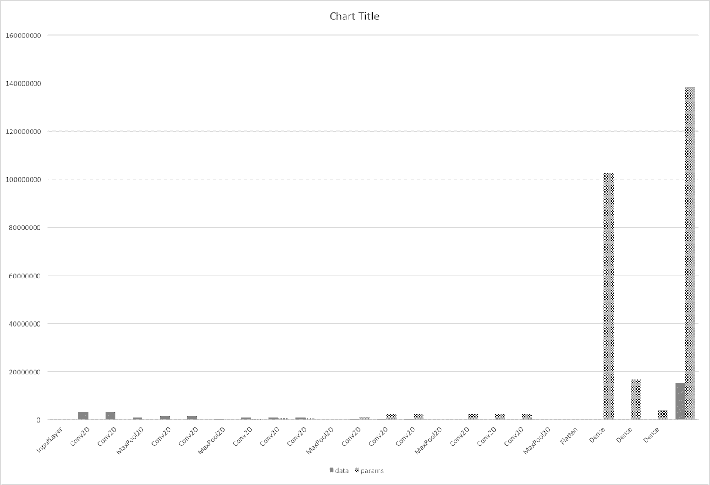
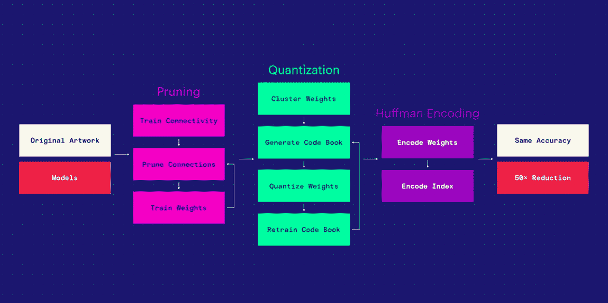

# 十二、为移动设备优化神经网络

现代卷积神经网络可能非常庞大。例如，预训练的 ResNet 家庭网络可以是 100 到 1，000 层深，并且以 Torch 数据格式占用 138 MB 到 0.5 GB。将它们部署到移动或嵌入式设备可能会有问题，特别是如果您的应用需要多个模型来完成不同的任务。此外，CNN 的计算量很大，并且在某些设置中(例如，实时视频分析)会很快耗尽设备电池。实际上，比写这一章的介绍要快得多。但是它们为什么这么大，为什么消耗这么多能量？我们如何在不牺牲准确性的情况下修复它？

因为我们已经在前一章讨论了速度优化，所以我们在这一章集中讨论内存消耗。我们特别关注深度学习神经网络，但我们也给出了适用于其他类型的机器学习模型的几个通用建议。

在本章中，我们将讨论以下主题:

*   为什么要压缩模型？
*   机器学习模型压缩的一般建议
*   为什么深度神经网络很大
*   什么因素影响神经网络的大小？
*   神经网络的哪些部分最重？
*   模型规模缩减的方法——参数数量缩减、剪枝、训练量化和霍夫曼编码
*   紧凑型 CNN 架构


# 提供完美的用户体验

根据 iTunes Connect 开发者指南，app 未压缩的总大小应小于 4 GB(截至 2017 年 12 月 15 日)；然而，这仅适用于二进制文件本身，而资产文件可以占用磁盘容量允许的尽可能多的空间。苹果开发者网站([https://developer.apple.com/news/?id=09192017b](https://developer.apple.com/news/?id=09192017b))声明，手机下载的应用大小也有限制:

“我们已经将手机网络下载限制从 100 MB 提高到 150 MB，让客户可以通过手机网络从 App Store 下载更多应用。”

简单的结论是，你最好将你的模型参数存储为按需资源，或者在应用已经安装后从你的服务器下载它们；但这只是问题的一半。另一半是你真的不希望你的 app 占用很多空间，消耗成吨的流量，因为这是很差的用户体验。

我们可以从几个方向着手解决这个问题(从最简单到最复杂):

*   使用标准无损压缩算法
*   选择紧凑的架构
*   防止模型变得过大
*   使用有损压缩技术—删除不重要的模型部分

第一种方法只是权宜之计，因为您仍然需要在运行时解压缩您的模型。在最后一种情况下，我们通常谈论减少模型参数的数量，有效地减少它的容量，以及随之而来的准确性。


# 计算卷积神经网络的大小

让我们拿一些知名的 CNN，比如说 VGG16，来详细看看内存到底是怎么被消耗的。您可以使用 Keras 打印它的摘要:

```
from keras.applications import VGG16
model = VGG16()
print(model.summary())
```

该网络由 13 个 2D 卷积层(具有 3×3 个滤波器、跨距 1 和 pad 1)和 3 个全连接层(“密集层”)组成。此外，还有一个输入层，5 个最大池层和一个展平层，它们不包含参数。

| **层** | **输出形状** | **数据存储器** | **参数** | **p**参数的数量 |
| 输入层 | 224×224×3 | 150528 | 0 | 0 |
| Conv2D | 224×224×64 | 3211264 | 3×3×3×64+64 | 1792 |
| Conv2D | 224×224×64 | 3211264 | 3×3×64×64+64 | 36928 |
| MaxPool2D | 112×112×64 | 802816 | 0 | 0 |
| Conv2D | 112×112×128 | 1605632 | 3×3×64×128+128 | 73856 |
| Conv2D | 112×112×128 | 1605632 | 3×3×128×128+128 | 147584 |
| MaxPool2D | 56×56×128 | 401408 | 0 | 0 |
| Conv2D | 56×56×256 | 802816 | 3×3×128×256+256 | 295168 |
| Conv2D | 56×56×256 | 802816 | 3×3×256×256+256 | 590080 |
| Conv2D | 56×56×256 | 802816 | 3×3×256×256+256 | 590080 |
| MaxPool2D | 28×28×256 | 200704 | 0 | 0 |
| Conv2D | 28×28×512 | 401408 | 3×3×256×512+512 | 1180160 |
| Conv2D | 28×28×512 | 401408 | 3×3×512×512+512 | 2359808 |
| Conv2D | 28×28×512 | 401408 | 3×3×512×512+512 | 2359808 |
| MaxPool2D | 14×14×512 | 100352 | 0 | 0 |
| Conv2D | 14×14×512 | 100352 | 3×3×512×512+512 | 2359808 |
| Conv2D | 14×14×512 | 100352 | 3×3×512×512+512 | 2359808 |
| Conv2D | 14×14×512 | 100352 | 3×3×512×512+512 | 2359808 |
| MaxPool2D | 7×7×512 | 25088 | 0 | 0 |
| 变平 | 25088 | 0 | 0 | 0 |
| 稠密的 | 4096 | 4096 | 7×7×512×4096+4096 | 102764544 |
| 稠密的 | 4096 | 4096 | 4097×4096 | 16781312 |
| 稠密的 | 1000 | 1000 | 4097×1000 | 4097000 |

数据的总内存:Batch_size × 15，237，608 ≈ 15 M

？？？总内存:Batch _ size×24M 5；4 字节≈ 93 MB

参考:

[http://cs231n.github.io/convolutional-networks/#case](http://cs231n.github.io/convolutional-networks/#case)
[https://data science . stack exchange . com/questions/17286/CNN-memory-consumption](https://datascience.stackexchange.com/questions/17286/cnn-memory-consumption)

总参数:138357544≈138 米

<title>Lossless compression</title>  

# 无损压缩

典型的神经网络包含大量冗余信息。这使我们能够对它们应用无损和有损压缩，并且经常获得相当好的结果。

霍夫曼编码是一种压缩类型，在关于 CNN 压缩的研究论文中经常被提及。你也可以使用 Apple compression 或脸书`zstd`库，它们提供最先进的压缩技术。Apple compression 包含四种压缩算法(三种通用算法和一种 Apple 专用算法):

*   LZ4 是四个中最快的。
*   ZLIB 是标准的 zip 存档。
*   LZMA 速度较慢，但压缩效果最好。
*   LZFSE 比 ZLIB 快一点，压缩性能也略好。它针对苹果硬件进行了节能优化。

下面是一个代码片段，您可以使用 LZFSE 算法从压缩库中压缩数据，并将其解压缩回来。您可以在`Compression.playground`中找到完整的代码:

```
import Compression 
let data = ... 
```

`sourceSize`保存压缩前的数据大小:

```
let sourceSize = data.count 
```

为压缩结果分配缓冲区...我们以原始(非压缩)大小分配它:

```
let compressedBuffer = UnsafeMutablePointer<UInt8>.allocate(capacity: sourceSize) 
```

`compression_encode_buffer()`是用来压缩你的数据的函数。它获取输入和输出缓冲区、它们的大小以及压缩算法的类型(`COMPRESSION_LZFSE`)，并返回压缩数据的大小:

```
var compressedSize: Int = 0 
data.withUnsafeBytes { (sourceBuffer: UnsafePointer<UInt8>) in 
compressedSize = compression_encode_buffer(compressedBuffer, sourceSize, sourceBuffer, sourceSize, nil, COMPRESSION_LZFSE) 
} 
```

`compressedSize`变量保存压缩后的大小。

现在，为了减压。以下是如何为未压缩数据分配适当大小的缓冲区:

```
var uncompressedBuffer = UnsafeMutablePointer<UInt8>.allocate(capacity: sourceSize) 
```

同样，`compression_decode_buffer()`函数返回未压缩数据的真实大小:

```
let uncompressedSize = compression_decode_buffer(uncompressedBuffer, sourceSize, compressedBuffer, compressedSize, nil, COMPRESSION_LZFSE) 
```

将缓冲区转换为普通数据对象:

```
let uncompressedData = Data(bytes: uncompressedBuffer, count: uncompressedSize) 
```

`uncompressedData.count`应该等于初始的`sourceSize`。

为了使无损压缩有效，您的网络结构中需要有许多重复的元素。这可以通过使用权重量化的精度降低来实现(见下一节)。

苹果 lzfse 压缩库:脸书 zstd 压缩库:

*   [https://github.com/lzfse/lzfse](https://github.com/lzfse/lzfse)
*   [https://开发者. apple . com/reference/compression/data _ compression](https://developer.apple.com/reference/compression/data_compression)

Facebook zstd compression library:

*   [https://github.com/facebook/zstd](https://github.com/facebook/zstd)
*   [https://github.com/omniprog/SwiftZSTD](https://github.com/omniprog/SwiftZSTD)


# 紧凑型 CNN 架构

在推理过程中，整个神经网络应该被加载到内存中，因此作为移动开发人员，我们对占用尽可能少的内存的小型架构特别感兴趣。小型神经网络也允许减少从网络下载时的带宽消耗。

最近已经提出了几种设计用于减小卷积神经网络大小的体系结构。我们将简要讨论其中几个最著名的例子。


# 挤压网

该架构由 Iandola 等人在 2017 年提出，用于自动驾驶汽车。作为基线，研究人员采用了 AlexNet 架构。这个网络需要 240 MB 的内存，相当于移动设备。SqueezeNet 的参数减少了 50 倍，并在 ImageNet 数据集上实现了相同的精度。使用额外的压缩，它的大小可以减少到大约 0.5 MB。

挤压网是由火模块建造的。目标是创建一个具有少量参数的神经网络，但保持有竞争力的精度水平。这是通过以下方法实现的:

*   通过用 1 x 1 过滤器替换 3 x 3 过滤器来减小网络大小。
    在这里，通过用 1×1 滤波器替换 3×3 滤波器，我们可以将参数数量瞬间减少 9 倍。
*   减少其余 3 x 3 滤波器的输入数量。这里，仅通过减少滤波器的数量来减少参数的数量。
*   在架构后期进行下采样，使卷积层具有更大的激活图。为了提高分类精度，SqueezeNet 的作者减小了后面卷积层的步幅，因此创建了更大的激活/特征图。

原文可以在这里找到:[https://arxiv.org/abs/1602.07360](https://arxiv.org/abs/1602.07360)。


# 移动网络

**MobileNets** 是一类针对移动和嵌入式应用的高效 CNN。它是由谷歌研究团队在 2017 年 *MobileNets:面向移动视觉应用的高效卷积神经网络*中提出的。与传统的 CNN 相比，它具有更少的参数，并且需要更少的学习和预测过程的计算。这使得它更快更轻，同时保持了预测的准确性。主要的创新是引入了深度可分卷积:[http://machine think . net/blog/Google-mobile-net-architecture-on-iphone/](http://machinethink.net/blog/googles-mobile-net-architecture-on-iphone/)。

原文可以在这里找到:[https://arxiv.org/abs/1704.04861](https://arxiv.org/abs/1704.04861)。


# 沙狐球网

ShuffleNet 架构是由 Face++的研究团队(旷视科技公司)在 2017 年提出的。它面向计算能力有限(例如，10 - 150 MFLOPs)的移动设备。与经典的 CNN 相比，ShuffleNet 具有更少的参数和执行更少的计算，因为它使用逐点群卷积和信道混洗；例如，它比 AlexNet 快 13 倍。准确性保持不变:在 ImageNet 上，它甚至比 MobileNet 表现得稍好(头号误差指标)。

原文可以在这里找到:[https://arxiv.org/abs/1707.01083](https://arxiv.org/abs/1707.01083)。


# 冷凝网

冷凝网是由、刘、劳伦斯范德马腾和基利安 q 温伯格提出的。通过将各层之间的密集连接与删除未使用连接的机制相结合，它达到了前所未有的效率水平，因此支持在网络内重用功能。CondenseNet 被认为比最先进的压缩卷积网络(如 MobileNets 和 ShuffleNets)更有效。

参考这个: *CondenseNet:一个利用学习型群卷积的高效 DenseNet】，，，刘，劳伦斯·范·德·马滕，基利安·q·温伯格，2017 年 11 月 25 日:[，](https://arxiv.org/abs/1711.09224)。*


# 防止神经网络变大

为了在移动平台上利用尖端的深度学习网络，有效地调整网络的学习变得极其重要，以便我们可以用最少的资源做最多的事情。Google Translate 团队为 OCR 实现的神经网络非常有趣，有助于理解一些防止网络变得过大的经验法则。

以下是谷歌新闻稿的摘录，可在以下网址找到:[https://translate . Google blog . com/2015/07/how-Google-translate-squeezes-deep . html](https://translate.googleblog.com/2015/07/how-google-translate-squeezes-deep.html):

“我们需要开发一个非常小的神经网络，并对我们试图教给它的东西施加严格的限制——本质上，对它处理的信息密度设定一个上限。这里的挑战是创建最有效的训练数据。因为我们正在生成自己的训练数据，所以我们尽了很大努力只包含正确的数据，仅此而已。例如，我们希望能够通过少量旋转来识别字母，但不要旋转太多。如果我们过度旋转，神经网络会在不重要的事情上使用过多的信息密度。因此，我们努力开发能够给我们带来快速迭代时间和良好可视化效果的工具。在几分钟之内，我们可以改变生成训练数据的算法，生成数据，重新训练数据，并将其可视化。从那里，我们可以看到什么样的信件是失败的，为什么。在某一点上，我们过度扭曲了我们的训练数据，并且' $ '开始被认为是' S '。我们能够快速识别出这一点，并调整扭曲参数来解决问题。(好，2015)”

以下是上述笔记的要点:

*   通过限制训练数据内的变化来限制学习能力。
*   有效的训练数据可以通过仅增加图像中的小旋转来创建。更大的旋转会导致学习的增加，从而增加体型。
*   广泛利用可视化快速修复来自网络的错误结果。

我们能从这些启示中得出什么一般规律？

*   为模型尺寸设定一个上限。这将限制您的模型的容量。
*   创建最有效的训练数据，并尽可能简化您的网络任务。例如，如果神经网络正在识别照片中的字符，向数据集添加旋转一点的字母，但不要让它学习颠倒或镜像的字符。如果您通过数据扩充来创建数据集，请努力保持数据集的整洁，这样网络除了需要了解的内容之外，不会了解任何其他内容。
*   哪些角色可以忽略？比如你可以让网络把“5”和“S”识别为同一个字符，在字典的层面上处理问题。
*   一定要想象一下，你的网络内部发生了什么，在哪些地方出现了问题。它最常混淆哪些字符？


# 有损压缩

所有有损压缩方法都涉及一个潜在的问题:当您丢失了模型中的部分信息时，您应该检查它在此之后的表现。对压缩模型的再训练将有助于网络适应新的约束。

网络优化技术包括:

*   **权重量化**:改变计算精度。比如模型可以全精度(float32)训练，然后压缩到 int8。这显著提高了性能。
*   权重修剪
*   重量分解
*   低秩近似。CPU 的好方法。
*   **知识提炼**:训练一个较小的模型来预测较大模型的输出。
*   动态存储分配
*   层和张量融合。这个想法是将连续的层合并成一层。这减少了存储中间结果所需的内存。

目前，他们每个人都有自己的优点和缺点，但毫无疑问，更完美的技术将在不久的将来被提出。

*   **内核自动调优**:通过为目标 Jetson、Tesla 或 DrivePX GPU 平台选择最佳数据层和最佳并行算法来优化执行时间
*   **动态张量内存**:通过仅在每个张量使用期间为其分配内存，减少内存占用并提高内存重用
*   **多流执行**:通过使用相同的模型和权重并行处理多个输入流，扩展到多个输入流


# 推理优化

去掉图中只用于反向传播，对推理无用的元素。

例如，批量归一化图层可以与前面的卷积图层合并为一个图层，因为卷积和批量归一化都是线性操作。


# 网络修剪

这种方法背后的一般思想是，不是神经网络中的所有权重都同等重要。因此，我们可以通过去掉不重要的权重来减小网络的规模。从技术上讲，这可以通过以下方式实现:

1.  训练大型网络:
    *   利用任何以前训练过的网络，比如 VGG16，并且只重新训练完全连接的层
2.  对过滤器进行分级，或根据标准创建稀疏网络:
    *   我们可以通过使用任何可行的标准(比如泰勒标准)对每个过滤器进行排序，并删除排序最低的过滤器，或者用零替换所有小于某个阈值的值，从而形成稀疏网络
3.  微调并重复:
    *   在稀疏网络上执行几次迭代训练

这里棘手的问题是如何决定哪些网络不够重要。这可以用我们通常选择超参数的相同方式来解决:检查几个阈值，并比较结果网络的质量度量。

一定要在修剪过的模型上进行几轮训练，让它修复你造成的伤害。


# 权重量化

8 位或更少。

权重量化允许减小模型的大小，但是以预测精度为代价。在任何情况下，它在运行时都需要相同数量的内存。对于量化，可以使用任何通用聚类算法，例如 k-means。

应用于权重的标准聚类算法。这样，我们用几个比特来代替所有的浮点数，代表它的簇。每个集群 1 个浮点。重新训练。

[https://Pete warden . com/2016/05/03/how-to-quantize-neural-networks-with-tensor flow/](https://petewarden.com/2016/05/03/how-to-quantize-neural-networks-with-tensorflow/)

[https://github . com/tensor flow/tensor flow/tree/master/tensor flow/contrib/quantization](https://github.com/tensorflow/tensorflow/tree/master/tensorflow/contrib/quantization)


# 降低精度

另一种减小网络规模的简单方法是直接将权重从双精度/浮点数据类型转换为另一种具有较低内存大小的数据类型，或者转换为固定精度。这(几乎)不会影响预测的质量，但允许将模型的规模缩小到原来的四分之一。

仅在训练完成后才专门关注网络精度的降低。以前，曾尝试用较低精度的数据类型训练网络，结果表明难以处理反向传播和梯度。

一旦训练好了网络，我们可以马上用浮点数代替 double，或者用固定精度代替 double。例如，在经过训练的神经网络中，您有这样的双重权重:

```
0.954929658551372
```

在这一点之后，神经网络不太可能在所有这些数字中编码出有意义的东西。所以，如果你把它们中的大部分去掉，转换成 float，什么都不会改变:0.9549297。神经网络足够稳定，可以处理那种微不足道的变化。但即使是现在，看起来精度也太大了。所以，我们可以把它变得更圆。例如到 0.9550000。这不会减少内存中模型的大小，因为权重仍然是浮点数；但是它确实减小了 IPA 二进制文件的大小，因为归档会更有效。此外，压缩模型将占用更少的磁盘空间。


# 其他方法

另一种减小神经网络规模的流行方法是通过 SVD。SVD 应用于预调整的神经网络，因此减少了网络中的参数数量。在减少参数数量后，采用非常规的**反向传播**算法训练 SVD 重构的模型，比常规 BP 算法具有更低的时间复杂度。实验结果表明，速度提高了近 2 倍，而准确度没有损失，准确度提高了约 4 倍，但损失很小。

补充阅读:你可以探索科技巨头为移动平台采用的其他几种方法:

*   [https://handong 1587 . github . io/deep _ learning/2015/10/09/acceleration-model-compression . html](https://handong1587.github.io/deep_learning/2015/10/09/acceleration-model-compression.html)
*   [https://research . Google blog . com/2017/02/on-device-machine-intelligence . html](https://research.googleblog.com/2017/02/on-device-machine-intelligence.html)
*   [https://www . slide share . net/embedded vision/tensor flow-enabled-mobile-and-embedded-machine-intelligence-a-presentation-from-Google](https://www.slideshare.net/embeddedvision/tensorflow-enabling-mobile-and-embedded-machine-intelligence-a-presentation-from-google)


# 脸书在咖啡馆的做法 2

在开发者大会期间，脸书最近宣布了他们在手机上渲染图像和视频的尖端艺术作品的方法，同时通过高度移动优化的深度神经网络有效地利用计算资源。可以使用以下视觉([https://developers . Facebook . com/videos/F8-2017/delivering-real-time-ai-in-the-palm-of-hand/](https://developers.facebook.com/videos/f8-2017/delivering-real-time-ai-in-the-palm-of-your-hand/))来研究整体方法:



图 12.1:压缩神经网络的脸书管道

脸书在他们的应用中使用了以下流水线来实现 50 倍的尺寸缩减，同时保持精度:

*   修剪
*   量化
*   赫夫曼编码，或标准通用压缩算法


# 知识的升华

知识提炼——您训练您的模型来预测更复杂模型的逻辑。使用大模型的输出作为基础事实来训练小模型。

附加阅读:

*   [https://arxiv.org/abs/1503.02531](https://arxiv.org/abs/1503.02531)
*   [https://www . slide share . net/Alexander korbonits/distillating-dark-knowledge-from-neural-networks](https://www.slideshare.net/AlexanderKorbonits/distilling-dark-knowledge-from-neural-networks)
*   [https://github . com/cheng shengchan/model _ compression/blob/master/teacher-student . py](https://github.com/chengshengchan/model_compression/blob/master/teacher-student.py)


# 工具

以下是用于有损压缩的工具:

TensorFlow 压缩工具


# 网络压缩的一个例子

您可以在以下地址找到合适的网络压缩示例:

[https://github.com/caffe2/caffe2/issues/472](https://github.com/caffe2/caffe2/issues/472)


# 摘要

有几种方法可以使深度神经网络部署在移动平台上达到合适的规模。到目前为止，最流行的是选择紧凑的架构，和有损压缩:量化，剪枝，等等。确保在应用压缩后网络的精度没有下降。


# 文献学

1.  O.好，*Google Translate 如何将深度学习挤到手机上*，2015 年 7 月 29 日:[https://research . Google blog . com/2015/07/How-Google-Translate-squeezes-deep . html](https://research.googleblog.com/2015/07/how-google-translate-squeezes-deep.html)
2.  Y.LeCun、J. S. Denker、S. A. Solla、R. E. Howard 和 L. D. Jackel。*优脑残*。NIPS，第 2 卷，第 598-605 页，1989 年