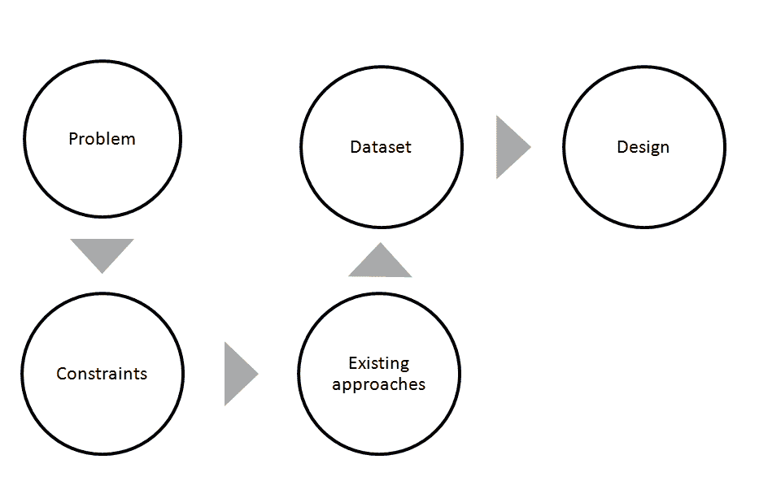
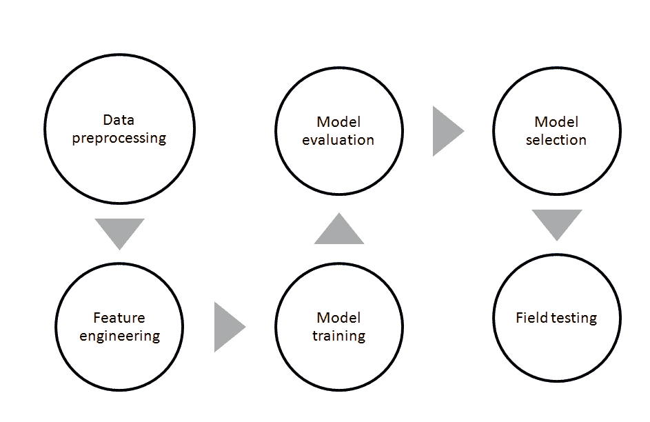
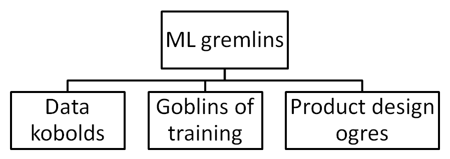
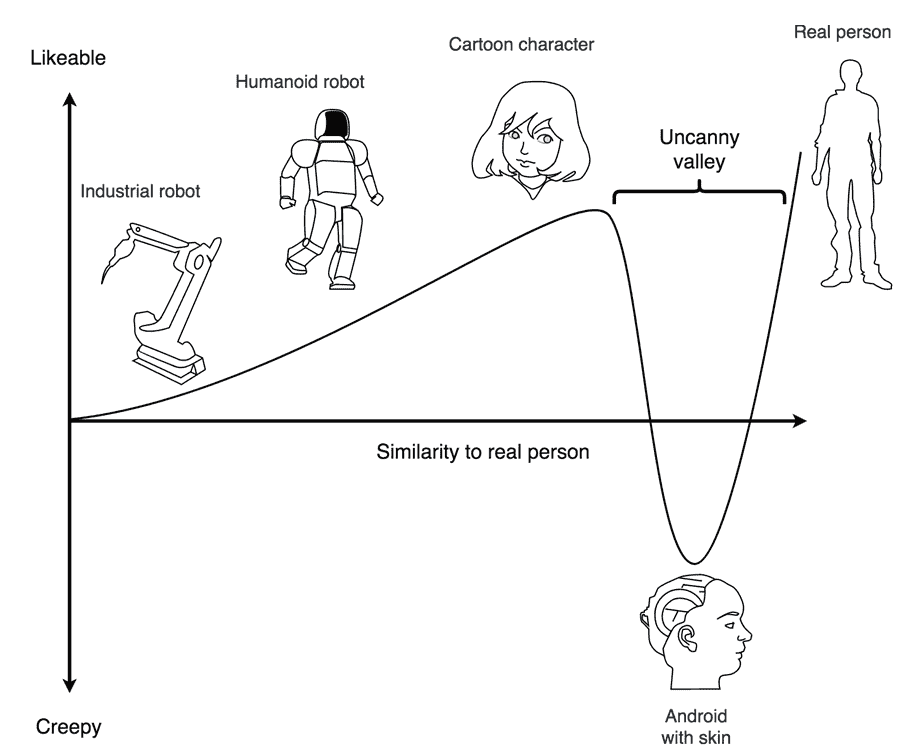

# 最佳实践

“讲故事的人的目的不是告诉你如何思考，而是给你思考的问题。”

–*布兰登·桑德森*、*王者之路*

把人工智能领域想象成一个巨大的国家公园。在前面的章节中，我们引导你沿着几条激动人心的路线前进，并向你展示了移动开发者最感兴趣的景点。但是还有很多东西没有被探索。因此，在这一章中，我们想为你提供一张从想法到生产的普通路径图。我们已经概述了危险区域，并留下了关于单独徒步旅行最佳实践的笔记！我们也想为你未来的探索指出几个有趣的方向。

在本章中，我们将讨论以下主题:

*   从创意到生产的路径
*   机器学习项目中的常见陷阱，也称为机器学习小精灵
*   机器学习最佳实践
*   推荐的学习资源

# 移动机器学习项目生命周期

开发移动机器学习产品时，通常会经历几个阶段:

*   预备伐
*   原型创建
*   移植到移动平台或部署训练好的模型
*   生产

根据你的情况，你的路线可能更短，也可能更长；但通常情况下，如果你跳过了某个阶段，那只是说明别人替你做了。在下面的解释中，我们省略了所有类型的移动应用项目共有的所有步骤，只关注机器学习特有的步骤。

# 预备伐

这是你基本上决定你将做什么的阶段。这一阶段可能有两种结果:你有一个如何进行的计划，或者你决定不进行:

图 13.1:准备阶段图

# 阐明问题

如果不用机器学习就能解决你的问题，那就不要用。如果任务可以用传统的编程技术解决，那么恭喜你！不需要机器学习！此外，如果你的问题是那种你不能允许错误的，不要使用机器学习。

对于你的机器学习项目的开始，有必要把一个现实世界的问题归结为一个机器学习的任务。机器学习算法是由数学家开发的，主要是在受控环境中对纯数据进行测试。如果你可以用一些现有的机器学习方法来定义你的问题，那就很好了:分类、回归、聚类等等。但迄今为止，有许多问题无法轻松适应常见的机器学习蓝图。其中就有需要常识推理和语境理解的问题。

# 定义约束

人们很容易迷失在各种各样的人工智能方法中。有一组约束条件将帮助您集中精力并确定解决方案的最佳路径。通过对自己回答以下问题，你将显著缩小你探索的范围；或者，在某些情况下，你可能会认为这项任务是不可能完成的(这一点在早期比后期更好理解):

*   可以用什么数据？
*   哪些数据不应该使用？
*   你的模型的输入和输出应该是什么？
*   你期望的准确性或成功的其他衡量标准是什么？请记住，机器学习算法不会 100%准确。
*   模型应该能够在目标平台上训练吗？
*   你的模型应该有多大的可解释性？你的模型是黑匣子可以吗？
*   你的模型在训练和推理阶段能消耗多少磁盘空间和内存？例如，模型在推断过程中不应该占用超过 15 MB 的磁盘空间和超过 30 MB 的 RAM。
*   训练和推理应该有多快(或者可以有多慢)？
*   你的编程语言和目标平台是什么？

# 研究现有的方法

这里的关键问题是，*其他人如何解决类似的问题？*

可以用原生 iOS SDK 解决你的问题吗？例如，如果你想检测照片中的人脸，你不需要训练自己的神经网络或 Haar cascade。只是用远景框架来代替。换句话说，不要重新发明轮子。寻找可以在设备或服务器端工作的现成解决方案。对于最常见的日常任务，你会找到合适的。

扩大搜索范围，进行文献综述。即使您还没有找到现成的解决方案，您至少会对方法和领域细节有所了解。在这一阶段可以使用的网站有 arXiv、谷歌学术和 GitHub。当你完成后，你会对经典的和最先进的解决问题的方法有一个清晰的理解。

即使您没有找到一个足够好的解决方案，您也可能会找到一个基线解决方案来与您未来的模型进行比较。

# 研究数据

如果你还没有找到一个现有的解决方案，并希望训练自己的算法，你将需要一个数据集。

这里有几种可能的情况:

*   您感到很幸运，您已经找到了一个现有的数据集。潜在的问题是，你可能不是唯一幸运的人，你的方法可以被其他人复制。还可能存在许可问题或其他相关问题。
*   您可以收集或生成自己的数据集。
*   在监督学习的情况下，应该对数据集进行标注。手工贴标是一项费力的工作，因此经常外包给一些第三方服务，比如亚马逊 Mechanical Turk。

计算从时间和金钱的角度给你的数据贴标签需要多少成本。

另一件需要提及的重要事情是，您应该清楚地了解数据是如何收集的。这一点很重要，因为为模型训练收集数据的方式可能与在应用中收集相同数据的方式有很大不同，这将影响模型的工作结果。例如，如果数据集中的所有人脸都是使用专业相机在白色背景上以完美的照明条件收集的，那么当用户背后有明亮的窗户时，就不要指望你的人脸识别模型在移动电话上表现得同样好。

你应该问自己的问题是，“如果我是一个机器学习算法，有了这些数据，我能表现得很好吗？”如果数据不足，任何算法都无法扭转乾坤。请记住，数据越多，算法越好。

# 做出设计选择

当您对目标、约束、竞争解决方案和数据有了清晰的理解后，您就可以开始定义未来模型的技术细节了。在实现您的模型之前，应该回答以下问题:

*   这是有监督的还是无监督的学习问题？分类还是聚类？判别模型还是生成模型？
*   成功的衡量标准是什么？你的基线解决方案是什么，你的基准是什么？你如何选择最好的模型？换句话说，定义最佳模型的度量标准是什么？
*   你的模型质量评估策略是什么？准确性、精确回忆、交叉验证还是其他？这主要取决于在您的应用领域中什么成本更高:假阳性还是假阴性。选择质量度量标准并设定明确的目标；例如，精确度不应低于 80%。
*   模型是否可以训练一次，然后在所有设备上进行推理，或者您是否需要为每个客户端训练单独的模型？
*   来自一个用户的数据是否足以让您的模型运行，或者您是否需要聚合来自许多用户的数据？这个问题将帮助你认识到你是否需要把你的模型放在服务器端。
*   对你来说，准确性和可解释性哪个更重要？对于分类问题，在第一种情况下，你可能想用神经网络或集成；在第二种情况下，你可能想用决策树或朴素贝叶斯。
*   需要概率估计吗？是/不是还是 42%的可能性是，58%的可能性不是？
*   你如何清理你的数据？如何选择好的特性？
*   如何将数据分成训练集和测试集？50/50?90/10?
*   您希望您的模型以增量方式合并新数据(在线学习)还是不时地根据一大堆数据重新训练模型(批量学习)？你的训练数据会过时吗？您的模型运行的环境多久改变一次？它应该适应还是不适应？

# 原型创建

理解原型制作和生产工具之间的区别是很重要的，因为在这两个阶段对工具有非常不同的要求。为正确的任务选择正确的工具将为您节省大量时间。

在原型阶段，您希望能够快速测试您的假设并进行实验。这就是为什么在环境允许的范围内选择灵活的编程语言是合理的，比如 Python 或 r。您还希望拥有用于数据可视化和模型调试的工具。这是 Swift 生态系统仍然薄弱的地方。在原型开发过程中，模型的大小、速度和稳定性可能是次要的(这并不意味着你应该把它们放在脑后)。但是，当您为生产准备解决方案时，您会面对面地看到这些问题，并且在大多数情况下，您必须依赖本地的、高度优化的库。在寻找一个通用的解决方案的过程中，你有可能最终得到对原型和生产都同样糟糕的工具。

从头开始实现机器学习算法是一项非常重要的任务。所以，如果可能的话，选择可移植的库(TensorFlow 或者 OpenCV)或者你知道已经为 iOS 实现的算法。否则，您将不得不花费额外的资源在 iOS 上重现用 Python 编写的算法:

图 13.2:原型创建图

# 数据预处理

从简单的数据预处理开始。要知道，通常数据准备会占用项目 80%的时间。用你的数据保持一个干净的存储库，整理你的数据。记住，**垃圾进，垃圾出** ( **GIGO** )！

把工作分成或多或少独立的部分。假设您正在编写一个通过手机摄像头读取医疗设备适应症的应用，以简化护士的工作。

写下不同的工作块，它们的输入和输出。通过这种方式，您将看到它们之间的相互依赖，这也有助于理解如何测试每一步。表格显示了示例:

| **序号** | **步骤** | **输入** | **输出** |
| 一 | 设备类型识别 | 图像 | 设备类型 |
| 2 | 设备屏幕检测 | 图像 | 屏幕四边形的顶点(点) |
| 3 | 透视校正 | 四边形的顶点，屏幕图像 | 透视已校正的屏幕图像 |
| 四 | 屏幕布局分割 | 屏幕图像，设备类型 | 包含不同布局元素的多个图像 |
| 5 | 光学字符识别的图像预处理 | 嘈杂的图像 | 干净的图像 |
| 6 | 光学字符识别 | 形象 | 嘈杂的文本 |
| 七 | 确认 | 嘈杂的文本 | 干净的文本 |

应该记录数据预处理流程。例如，如果您正在减去平均值并将数据除以标准偏差，那么在训练您的模型时，不要忘记记下平均值和标准偏差的精确值。这是互联网上预先训练好的神经网络的通病。当作者忘记提到预处理步骤时，模型实际上变得毫无用处。

对于分类任务，数据集预处理通常包括信息特征工程、类别平衡和缺失值插补。在监督学习的情况下，不要忘记在下一阶段将数据集分成三部分:训练集(大多数样本)、测试集和验证集。

模型训练、评估和选择

# 通常，最好从简单和经典的模型开始，因为有时最简单的模型表现最好。但这只是一个经验法则，而不是自然法则。

每个机器学习算法都体现了一些关于数据的假设或先验知识:KNN 假设相似的例子是同一类的，线性回归假设线性依赖和正态分布的误差，许多模型假设特征或样本之间的独立性或有限依赖性，等等。这有助于他们成功地归纳训练数据背后的内容。所有这些假设之所以有效，只是因为样本在所有可能的输入空间中并不是均匀分布的，在数据中存在着我们称之为模式的东西。机器学习工程师/研究员的任务是充分了解他的数据，以便能够对其做出有根据的假设。他根据这些假设选择算法。在实践中有帮助的是问你自己，“如果我处在我的算法的位置，我能够用这样的特征、样本数量和假设很好地概括吗？”想想吧！你对数据有什么样的了解？如果您了解样本属于某一类别的前提条件(例如“如果它有四只爪子，那么这是一只猫，但如果它有...”那么决策树就是你的选择。如果实例之间的相似性是很容易理解的，那么使用基于距离的算法。如果您的数据中有大量关于概率相关性的信息，请尝试概率图形模型。

选择最佳模型的典型步骤如下:

选择一组适合您的任务的模型。例如，对于分类，这可以是:KNN、逻辑回归、决策树、神经网络等等。

*   使用训练集来训练您的模型和测试集，以验证它们的准确性；调整它们的超参数(KNN 的邻域数、决策树分裂数以及神经网络的层数和类型)。
*   当您有一组经过训练的模型时，请使用验证集选择其中的最佳模型。
*   同样，从数据集的角度来看:

**训练集**:训练你所有的模型。

*   **测试集**:在训练阶段评估你的模型，同时你还在调整不同的超参数。
*   **验证设置**:测量最终精度。这一个应该与另外两个分开，直到在一组模型中做出最后的选择。
*   最后一个很重要，因为通过多次调整超参数，可以使训练集和测试集都过拟合。

我们不建议在移动设备上使用模型集，因为它们通常会占用大量资源。在您决定使用其中一个之前，请检查如果您在数据收集、清理和功能工程方面投入相同的精力，是否可以达到相同的性能。

迭代工作；尝试一套算法和功能，然后是另一套。记录每次迭代的结果。为随机数生成器设置种子，以便以后能够重现您自己的结果。

你所有的商业问题公式化最终汇聚成一个问题，“你在优化什么损失函数？”重要的是要记住，学习是以最小化损失函数的方式根据数据调整模型的过程。所以，如果损失函数选择得不小心，结果可能会与你真正的目标相差甚远。

田间试验

# 这是一个重要的阶段，因为它揭示了你在训练数据中的偏见，用户对你产品的看法，以及其他潜在的痛点。尝试在最真实的场景和条件下检查模型。假设你正在开发一个语音助手。它将如何工作:

刮风的时候在嘈杂的街道上？

*   当一个孩子在后台哭的时候？
*   当音乐响起的时候。
*   当用户的母语不是英语，或者情绪激动或喝醉时。嗯，那些可能是最需要你协助的用户！
*   在所有这些案件中？
*   如果您的解决方案是安全相关的，那么在受到对手主动攻击的情况下，它有多好？在橙子的帮助下解锁你的 touch ID，或者通过出示照片来欺骗你的面部识别有多容易？

获得所有这些观察结果后，您可以返回并相应地更新您的数据集和模型。

移动平台的移植或部署

# 下一个合乎逻辑的步骤是在移动平台上部署您的解决方案。这里，您有几个考虑事项:

模型内存消耗

*   数据内存消耗
*   训练速度(如果您需要设备上的训练)
*   推理速度
*   磁盘空间消耗
*   电池消耗
*   您可以使用 Xcode 工具来分析所有这些。

有关 Swift 代码速度优化的信息，请查看本指南:*编写高性能 Swift 代码*，网址:[https://github . com/apple/Swift/blob/master/docs/optimization tips . rst](https://github.com/apple/swift/blob/master/docs/OptimizationTips.rst)。

如果您的应用包括几个预训练的模型，例如，神经艺术风格过滤器，您可以使用按需资源将这些模型存储在 App Store 上，并仅在需要时下载它们，而不是在应用安装过程中。《按需资源指南》解释了:

“点播资源是托管在 App Store 上的应用内容，独立于您下载的相关应用捆绑包。它们支持更小的应用包、更快的下载和更丰富的应用内容。该应用请求点播资源集，操作系统管理下载和存储。...资源可以是捆绑包支持的任何类型，除了可执行代码。

截至 2017 年春季，App Store 允许您存储高达 20 GB 的点播资源。您还可以定义当操作系统达到磁盘空间限制时将清除哪些资源。

你可以在这里找到关于这项技术以及如何在你的应用中采用它的更多细节:[https://developer . apple . com/library/content/documentation/file management/Conceptual/On _ Demand _ Resources _ Guide/index . html](https://developer.apple.com/library/content/documentation/FileManagement/Conceptual/On_Demand_Resources_Guide/index.html)。

在前两章中，我们更详细地讨论了模型加速和压缩的问题。

最好事先确保你的模型可以方便地移植到移动平台上。例如，假设您已经决定用其中一个框架来训练一个模型，并将其转换为核心 ML 格式以用于 iOS 部署。在 GPU 服务器上训练一个复杂的神经网络一周之前，验证一下这个架构的未训练网络是否可以通过`coremltools`进行转换。这样，当你发现`coremltools`不支持你超级酷的架构中的某一层时，你会避免失望。实际上，Core ML 现在支持自定义层，但如果可以用更传统的东西来代替，你真的想写一个吗？只有当移植的成本比从头重写低得多的时候，你才能称你的解决方案是可移植的。

生产

# 一些机器学习模型由于其环境的变化性质而需要定期更新；其他人没有。例如，语言的变化比人类外表的变化快，但时尚的变化更快。在欺诈检测系统中，防御者和攻击者之间不断进行军备竞赛，双方都试图发挥创造力。环境变化的问题被称为概念漂移。随着时间的推移，模型变得不相关的错字问题被称为模型衰退。

你如何解决这些问题？有几种可能的方法:

定期重新训练您的模型

*   使用在线学习算法来整合新数据并丢弃旧数据:KNN 就是一个例子
*   使用允许您衡量数据重要性的算法，并为最近的数据分配最高的重要性
*   最佳实践

# 在这一节中，我们收集了一些在整个开发过程中值得记住的一般想法。

在一个地方收集所有重要的想法是不可能的，所以这里列出了一些来自经验丰富的机器学习工程师的真正有见地的指南，介绍他们推荐的最佳实践:

*关于机器学习需要知道的一些有用的事情*作者 Pedro Domingos，演讲地点:【https://homes.cs.washington.edu/~pedrod/papers/cacm12.pdf 

*   *将深度学习应用于新应用的最佳实践*莱斯利·n·史密斯，在:[https://arxiv.org/abs/1704.01568](https://arxiv.org/abs/1704.01568)
*   *机器学习的规则:ML 工程的最佳实践*马丁·津克维奇著，[http://martin.zinkevich.org/rules_of_ml/rules_of_ml.pdf](http://martin.zinkevich.org/rules_of_ml/rules_of_ml.pdf)
*   *机器学习应用的最佳实践*作者布雷特·乌杰克、帕特里克·霍尔和芬达·güneș，网址:[https://support . SAS . com/resources/papers/proceedings 16/SAS 2360-2016 . pdf](https://support.sas.com/resources/papers/proceedings16/SAS2360-2016.pdf)
*   标杆管理

# 当你正在创建一个模型来解决一个流行的机器学习任务时，你怎么知道它比你的前辈发明的任何东西都好？答案就是一个词:基准。

有一些众所周知的数据集用来比较不同模型的准确性。例如，对于大规模视觉对象分类的任务，基准是 ImageNet 数据集。

隐私和差异隐私

# 令人惊讶的是，在过去几年中，大多数同时提到移动设备和机器学习的科学论文都不是关于计算机视觉或自然语言处理的。讨论最多的话题是信息安全和隐私。这两个领域在几个场景中相交:

攻击者使用攻击性机器学习作为他/她的工具包的一部分。它可用于发现和分析漏洞或攻击本身。例如，用于监控的面部或声音识别，以及在不正确的匿名数据中查找数据泄漏。

*   防御性机器学习用于防范网络攻击。它可用于威胁检测和分析。一个例子是银行和反病毒软件中的欺诈检测算法。
*   对抗性机器学习是算法本身受到攻击时的一种设定。例子是搜索引擎优化(SEO)-欺骗搜索引擎和转化率优化(CRO)-欺骗垃圾邮件过滤器。
*   现在，如果使用机器学习来最大化垃圾邮件的打开率，这显然是一种对抗性的设置；但犯罪者和防御者都用机器学习武装起来了，所以这三种场景都在一个地方相遇。

在移动安全环境中，机器学习已经用于:

基于不同特征的用户认证:声音、面部、步态、签名等等

*   旁道攻击:仅使用运动传感器数据的语音识别、按键记录和窃取密码
*   使用人类听不懂的噪音操纵语音助手
*   欺骗图像分类算法将一个物体误标为另一个物体
*   从用户的照片库中提取各种个人信息:文档、条形码、NSFW 照片、信用卡信息等等
*   最后一个例子特别麻烦，因为在 iOS 中，任何可以访问照片库的应用都可以访问用户的所有照片，包括隐藏文件夹中的照片。他们可以不受限制地以任何方式进行分析。所有这些都导致了一个结论:目前，移动设备上的进攻性机器学习胜过防御性学习，它只受到攻击者的想象力和电池消耗的限制。

在移动开发领域之外，机器学习通常用于监控、引人注目的定向广告、挖掘社交媒体中的个人信息以及其他道德上有问题的做法。这是一个没有技术解决方案的问题。像几乎任何其他强大的工具一样，机器学习伴随着责任。计算机只能优化目标函数；人是选择函数进行优化的人。你是在优化销售的收入和商品数量，还是在优化产品质量和用户福利？

在 WWDC 2016 上，苹果官员提出了机器学习背景下的差分隐私话题。据他们称，差分隐私是一个主要的研究课题，苹果公司正在将差分隐私引入整个公司的服务。这里的想法是收集用户的数据，但添加噪音，并以无法提取任何个人信息的方式进行聚合。

有关苹果方法的更多信息，请查看位于[https://images . Apple . com/Privacy/docs/Differential _ Privacy _ overview . pdf](https://images.apple.com/privacy/docs/Differential_Privacy_Overview.pdf)的差分隐私概述文档和位于[http://dev streaming . Apple . com/videos/wwdc/2016/709 tvxadw 201 avg 5v 7n/709/709 _ engineering _ Privacy _ for _ your _ users . pdf](http://devstreaming.apple.com/videos/wwdc/2016/709tvxadw201avg5v7n/709/709_engineering_privacy_for_your_users.pdf)的 WWDC 演示文稿。

据苹果公司称，iOS 拥有 200 MB 的个人信息动态缓存，可以在 iPhone 上训练模型。个人信息包括应用使用数据、与其他人的互动以及键盘和语音输入；它永远不会离开设备。因为在这种情况下，数据不必通过网络传输，所以这是移动机器学习如何减少潜在网络攻击表面积并提高用户安全性的一个很好的例子。

来自谷歌的研究人员还提出了一种用于机器学习的安全数据聚合协议。这是实现分散学习系统所需要的——小型本地模型正在移动设备上接受训练，然后它们向大型中央模型发送更新，后者汇总了所有小型模型的经验。

这种方法被称为联合学习。要了解更多信息，请查阅论文*从分散数据中高效学习深度网络*。布伦丹·麦克马汉等人，在:[https://arxiv.org/abs/1602.05629](https://arxiv.org/abs/1602.05629)。
还可以访问谷歌研究博客:[https://research . Google blog . com/2017/04/federated-learning-collaborative . html](https://research.googleblog.com/2017/04/federated-learning-collaborative.html)。

调试和可视化

# 当我们通常的代码有一个 bug 时，它要么不工作，要么以错误的方式工作。当 ML 代码有 bug 时，它通常会继续工作，但质量会下降。因为机器学习算法可能极其复杂，所以好的调试和可视化工具具有极大的价值。例如，对于 TensorFlow，这样的工具是 TensorBoard，它允许探索模型图、重量分布、损耗图等等。

到目前为止，人类还没有发明出比可视化更好的理解数据的方法。通常，10 分钟的可视化代码比几个小时的控制台调试更能带来深刻的见解。正如马里兰大学的 Ben Shneiderman 教授在他的演讲中指出的:

"没有可视化的统计应该是非法的."

证明文件

# 当然，你的工具越简单越好；它不需要手册。我们都知道在 Objective-C 社区中自文档化代码的根深蒂固的传统。但是在机器学习领域，没有文档的代码通常是没有用的。即使有文件记录，结果通常也不容易再现，因为一些超参数的精确值或其他看似微小的细节是未知的。

那么，你的机器学习相关代码中到底应该记录什么呢？最重要的是:

数据源

*   预处理步骤
*   功能组合
*   模型超参数
*   所有的行业技巧
*   错误消息
*   损失函数
*   实验
*   模型检查点
*   随机数种子
*   质量指标
*   不要忘记在适当的地方引用原始研究论文。尽量避免在你的代码中调用变量 *a* 、 *b* 、 *c* 、 *x* 、 *y* 、 *z* 、 *w* 、α、β、ρ、θ等等，如果这些名字仅仅来自于附近注释中直接引用的某个公式。

机器学习小精灵

# Kaggle 的数据科学家 Ben Hamner 将常见的机器学习陷阱称为 ML 小精灵。

你可以在[https://www.youtube.com/watch?v=tleeC-KlsKA](https://www.youtube.com/watch?v=tleeC-KlsKA)观看本的原话。

我喜欢这个比喻，因为它让我的大脑思考邪恶的角色，而不是一些模糊、抽象的概念。除了 Ben 提出的原始 gremlins，我还想添加几个我自己的，并提出一个 gremlins 的分类法(见下图)。在讨论如何识别和消除这些害虫时，我在本章中使用了这个比喻来避免令人厌烦的问题:

图 13.3:机器学习问题的简化分类

数据狗头人

# 处理数据很难；这就是为什么我们称之为数据科学和数据挖掘！许多不同的事情在不同的阶段可能会出错。Ben 提到了数据不足、数据泄漏、非平稳分布、糟糕的数据采样和分割、数据质量和糟糕的匿名数据。再补充几个吧。

艰难的数据

# 您的数据在很多方面都很难处理:它可能很稀疏(在特征或目标变量中)，它可能包含异常值或缺失值，或者它可能是高维的或高基数的(对于分类特征)。数字要素可以(通常是)具有不同的量级，或者存在多重共线性。没有防弹的解决方案。使用武力。整理你的数据。这里常用的技术有降维、缺失值插补、异常值检测和统计数据归一化。统计学和数据科学的教科书会帮助你了解更多关于这个主题的知识。

偏置数据

# Word2Vec 算法(在第十章、*自然语言处理*中讨论过)是一个很好的例子，说明了文化刻板印象和偏见如何容易泄漏到机器学习模型中。例如，在谷歌新闻语料库上训练的向量告诉我们:

*美国-披萨+俄国=伏特加*

虽然对一些人来说，这听起来很有趣，但对更多人来说，这听起来同样令人不快。算法有偏差吗？不，都在数据集中。

另一个严重偏差数据的例子是一个基于神经网络的网络服务，它通过照片来评估一张脸的美丽。显然，所有的训练数据都包含白人面部，因此该模型给所有非白人面部的分数最低。我真的相信开发人员在训练他们的模型时没有恶意。他们只是没有足够重视输入数据的多样性。

批量效果

# 通常，如果您必须手动标记一个大的数据集，您可以将它分成易于管理的批次。然后，几个人可以在不同的部分并行工作。这里的问题是，这些人中的每个人都会在他/她的批次中引入不同量的可变性。尤其是涉及到主观意见的时候，比如“这个影评是稍微正面还是比较中性？”

对于从几个不同来源编译的数据集，批处理效应也是一个常见问题。在许多情况下，当您分别绘制从不同来源获得的数据时，批量效应变得明显。

训练的妖精

# 除了过度拟合之外，这类问题还包括资源消耗、模型可解释性、超参数调整等等。其中大部分我们已经在本章和其他章节的其他地方讨论过了。

产品设计怪物

# 在他的演讲中，本只提到了其中的一个:解决错误的商业问题。但是还有那么多！

奇幻思维

# 我想讲一个故事来说明这一点。我的一个朋友让我为他的初创公司构建一个机器学习系统，因为他认为这可以解决他的移动应用中的一些问题。我问他有什么数据，他回答说他们计划从用户那里收集大量数据。他们希望为每个用户及时做出高度个性化的预测(精确到几分钟内)。“好吧，”我说，“想象你有这种关于你自己、你妻子和你的狗的数据。对我做出正确的预测会有用吗？”“不，”他摇摇头。“现在想象你刚刚开始收集关于我的信息。需要多长时间才能开始做出合理的预测？”他看上去很失望。“那么这只是一个统计数字吗？我以为它会自己想出办法的。”不管幸运与否，机器学习没有什么超自然的东西。它不会无中生有地为你创造一个奇迹般的解决方案。它能为你做的就是从更少的数据中获取更多的价值。这些基本事实对于非技术人员来说有时并不明显。

货物崇拜

# 不知何故，我们生活在这样一种文化中，技术是一种时尚，几乎是宗教崇拜的对象(想想技术福音传道，“改变世界”，以及标签与太空战争)。人工智能现在正处于其受欢迎的顶峰。我们经常说，“每个人都在做机器学习，所以让我们也在我们的产品中建立一个神经网络，并宣传它是人工智能！”毋庸置疑，机器学习是一把优秀的锤子，但并不是身边的东西都是钉子。你可能知道，如果你给任何产品添加蓝牙，它都会变得更好。然而，这个规则对于机器学习并不成立。这本书的作者认为，当机器学习加入其中时，有太多伟大的服务变得不方便和不可预测。改写 Jamie Zawinski 关于正则表达式的名言:

“有些人，当遇到问题时，会想‘我知道了，我要用 AI’。现在他们有两个问题。”

反馈回路

# 在一次会议上，一位演讲者谈到了他的公司正在开发的一种新产品。发言人解释说，航空公司网站根据各种指标，使用只有他们自己知道的模型，以一种难以预测的方式改变机票价格。因此，演讲者和他的同事从一些航空公司网站收集了价格趋势数据，并建立了一个回归模型。这将预测机票价格的变化，并为用户提供建议，告诉他们是在那个时间购买机票，还是等待省钱。一位听众(不是我)举手问道:“当航空公司了解到你的网站并更新他们的模型以考虑你的预测时，会发生什么？”这个问题让演讲者大吃一惊，因为这种情况是他完全没有预料到的。撇开航空公司是否真的会考虑这样一个网站的问题不谈，这是一个很好的例子，说明了机器学习中所谓的反馈循环。当你的模型的预测影响实际结果时，这可能导致两种不想要的情况:自我实现的预言或自我否定的预言。

一个简单的例子:你的系统预测用户感兴趣的新闻。用户阅读它们，系统记住用户对这样的信息感兴趣。事实上，用户打开它与其说是因为他订婚了，不如说是因为你给他看了(自我实现的预言)。因此，除了阅读展示的内容或关闭应用，他别无选择。结果，在几个周期之后，推荐变得单调乏味，以至于用户停止使用你的应用。这里的问题是，训练数据被模型的预测所污染，模型逐渐退化。

如何处理反馈循环？没办法。只是不要创建它们。

恐怖谷效应

# 术语“恐怖谷”最初出现在机器人的上下文中，描述了人们与人形机器人互动时的感受。从 1970 年开始，日本和韩国的公司一直在生产机器人，复制一个人的外表，直到最细微的细节。机器人通常是一些视觉上吸引人的模型的复制品。然而，据观察，这种机器人似乎会引起排斥，因为它们会让人联想到尸体或精神障碍者。与此同时，没有试图模仿人的外貌的机器人引起了观察者的同情。后来，这个概念被扩展到 3D 动画和视频游戏领域，在那里，恐怖谷被成功地用来创造可怕的角色:

图 13.4:恐怖谷效应。图片由 Mykola Sosnovshchenko 提供。

一些作者将恐怖谷的概念应用于人工智能系统的上下文中，如推荐系统和语音助手。不够可信的模拟人类行为的系统会引起用户的情绪排斥。为什么？让我们试着弄清楚。

人与人之间的互动是基于理解和预测对方行为的能力。大脑中甚至有专门的神经元(镜像神经元)负责这一点。你在问候一个人，并听到对方的回应，或者你在讲一个笑话，期望对方会微笑。如果你的同伴对你的问候没有反应，或者对你的笑话有奇怪的反应，你就觉得不对劲了。机器学习系统通常在这方面表现不佳。对于人类观察者来说，它们不够可预测，这可能会导致一种错误的感觉。例如，按日期或主题排序的新闻提要类似于一个房间，您可以精确地知道东西在哪里。但如果你的新闻提要根据一种未知的人工智能算法进行排序，它就变得类似于沙漠中的海市蜃楼。曾经有一条你感兴趣的新闻，但是现在它在某个地方消失了，无论你怎么努力都找不到它。

可预测性是良好用户体验的基础。可以有可预测的随机性，然后用户意识到一些事情纯粹是偶然发生的。但即便如此，我们的大脑仍试图在这些随机事件中找到一些模式。如果你称之为人工智能，令人毛骨悚然的巧合变得更加令人毛骨悚然:“脸书人工智能算法向我推荐社区”关于萨满教的书籍，“因为我在人工智能社区。”我最喜欢的神秘自然语言处理的例子是一个名为*怪异的多种语言短语*的博客，它收集了该应用要求用户翻译的奇怪的东西。

同样，确保你的个性化模型不会产生令人毛骨悚然的用户体验。如果你的应用太了解用户，这可能是卸载它的好理由。

推荐的学习资源

# 在本书中，我们仅仅触及了机器学习这个术语背后庞大知识体系的表面。如果您想了解更多信息，我们强烈推荐以下资源。

选择课程和书籍的主要标准是陈述的清晰性和以 CS 为导向的方法。这些书的其他标准是免费在线可用性和开放源代码样本。此列表中提到的所有课程都是免费的(截至 2017 年 5 月)，并且是入门级别的。

数学背景

# 宾夕法尼亚大学的 Robert Ghrist 手写的漫画式微积分讲座可以在 YouTube 或 Coursera 上找到。这个教单变量微积分:泰勒级数，牛顿法。如果你不知道如何对一个 sigmoid 函数求导或者哪些函数是可微的，这应该是你的选择。更多信息请参考:https://www.math.upenn.edu/~ghrist/[。](https://www.math.upenn.edu/~ghrist/)

编码矩阵:通过计算机科学应用的线性代数。通过 Python 例子和作业讲授线性代数:特征向量、特征值、奇异值分解、卷积、小波和傅立叶变换。更多信息请参考:http://codingthematrix.com/[。](http://codingthematrix.com/)

由 J. Strö、k . strm 和 t . Akenine-ml ler 编写的*沉浸式线性代数*是一种交互式在线教科书，可在:[http://immersivemath.com/ila/index.html](http://immersivemath.com/ila/index.html)找到。

来自 OpenIntro 的关于概率和统计的开源教材、视频讲座和练习。也可作为 Mine etin Kaya-Rundel 的 Coursera 课程。概率、贝叶斯统计、概率分布、条件概率、推断、置信水平、卡方、方差分析、回归、r 中的编码分配。更多信息请参考:[https://www.openintro.org/stat/](https://www.openintro.org/stat/)。

机器学习

# *麻省理工学院 edX 的分析边缘*课程。讲授 R 编程语言中的应用数据分析，包括分类、聚类和通过一组真实案例的数据可视化。模型质量评估，情感分析。更多信息请参考:[https://www.edx.org/course/analytics-edge-mitx-15-071x-3](https://www.edx.org/course/analytics-edge-mitx-15-071x-3)。

Hugo Larochelle 的神经网络课程——舍布鲁克大学。关于神经网络你想知道和不想知道的一切。更多信息请参考:[http://info . usher Brooke . ca/hlarochelle/neural _ networks/content . html](http://info.usherbrooke.ca/hlarochelle/neural_networks/content.html)。

伊恩·古德菲勒、约舒阿·本吉奥和亚伦·库维尔的《深度学习》:这是一本关于深度学习的书。在该书位于 http://www.deeplearningbook.org/的网站上可以免费在线阅读。

托比·塞格兰的《集体智慧编程》。代码示例:[https://github . com/ferron Smith/programming-collective-intelligence-code](https://github.com/ferronrsmith/programming-collective-intelligence-code)。

计算机视觉

# CS 6476: *乔治亚理工学院计算机视觉简介*。数学-计算机视觉入门，MATLAB/Octave 中的编码任务。更多信息请参考:[https://www . uda city . com/course/introduction-to-computer-vision-ud 810](https://www.udacity.com/course/introduction-to-computer-vision--ud810)。

中佛罗里达大学的计算机视觉课程*。更多信息请参考:>[http://crcv.ucf.edu/courses/CAP5415/Fall2014/index.php](http://crcv.ucf.edu/courses/CAP5415/Fall2014/index.php)。*

Richard Szeliski 的一本经典教材，*计算机视觉:算法与应用*，网上免费提供:[http://Szeliski . org/Book/drafts/SzeliskiBook _ 2010 09 03 _ draft . pdf](http://szeliski.org/Book/drafts/SzeliskiBook_20100903_draft.pdf)。

*CS231n:斯坦福大学的视觉识别卷积神经网络*课程。卷积神经网络的入门课程，并附有 Python 语言的编码作业。更多信息请参考:[http://cs231n.stanford.edu/index.html](http://cs231n.stanford.edu/index.html)。

自然语言处理

# CS224n: *深度学习的自然语言处理*。张量流中的编码赋值。词向量表示，LSTM，GRU，神经机器翻译。更多信息请参考:[http://web.stanford.edu/class/cs224n/](http://web.stanford.edu/class/cs224n/)。

摘要

# 这是这本书的最后一章；所以我们讨论了机器学习应用的生命周期，以及人工智能项目中的常见问题和如何解决这些问题。我们还为读者提供了一系列好的学习材料。我们希望你没有失望，并希望你在自己的人工智能实验中取得许多成功！

This was the final chapter of the book; so we discussed a machine learning app's life cycle, and common problems in AI projects and how to solve them. We also provided a list of good study material for further progress of our readers. We hope that you were not disappointed and wish you many successes in your own AI experiments!