# 一

# Python 时间序列简介

这本书是关于用 Python 进行时间序列的机器学习，你可以把这一章看作是时间序列的 101 课。在这一章中，我们将介绍时间序列，时间序列的研究历史，以及如何使用 Python 处理时间序列。

我们将从什么是时间序列及其主要特性开始。然后，我们将回顾时间序列在不同科学基础学科中的研究历史，如人口学、天文学、医学和经济学。

然后，我们将回顾 Python 对于时间序列的能力，以及为什么 Python 是使用时间序列进行机器学习的首选语言。最后，我将描述如何为时序分析和机器学习安装 Python 中最重要的库，我们将介绍与时序和机器学习相关的 Python 基础知识。

我们将讨论以下主题:

*   什么是时间序列？
    *   时间序列的特征
*   时间序列和预测——过去和现在
    *   人口统计学
    *   遗传学
    *   天文学
    *   经济学
    *   气象学
    *   医学
    *   应用统计
*   面向时间序列的 Python

但是什么是时间序列呢？先来个定义！

# 什么是时间序列？

由于这是一本关于时间序列数据的书，我们应该首先澄清一下我们正在谈论的内容。在本节中，我们将介绍时间序列及其特征，我们将讨论与机器学习和统计相关的不同类型的问题和分析。

许多学科，如金融、公共管理、能源、零售和医疗保健，都受时间序列数据的支配。微观和宏观经济学的大部分领域依赖于应用统计学，强调时间序列分析和建模。以下是时间序列数据的例子:

*   股票指数的每日收盘价
*   一种疾病的每周感染次数
*   每周系列火车事故
*   每天降雨量
*   传感器数据，例如每小时的温度测量
*   每年人口增长
*   一家公司几年来的季度收益

这仅仅是几个例子。任何处理随时间变化的数据都是时间序列。

也许有必要简要地定义一下什么是时间序列。

定义:时间序列是按时间顺序排列观察值的数据集。

这是一个非常宽泛的定义。或者，我们可以说时间序列是一段时间内连续采集的数据点序列，或者时间序列是随机过程的结果。

在形式上，我们可以用两种方式定义时间序列。第一个是作为从时域到实数域的映射:


其中和。

定义时间序列的另一种方式是作为一个随机过程:


这里，或表示随机变量 X 在时间点 t 的值

如果 T 是一组实数，它是一个连续时间的随机过程。如果 T 是一组整数，我们称之为离散时间中的随机过程。后一种情况下的惯例是写。

由于时间是数据集的主要索引，这意味着时间序列数据集描述了世界如何随着时间的推移而变化。他们经常处理过去如何影响现在或未来的问题。

监测和数据收集的增加带来了对应用于时间序列的统计和机器学习技术的需求，以预测和表征复杂系统或系统内组件的行为。处理时间序列的一个重要部分是如何根据过去预测未来的问题。这叫做预测。

一些方法允许添加商业周期作为附加特征。这些额外的特征被称为**外生**特征——它们是依赖于时间的解释变量。我们将在*第 3 章*、*预处理时间序列*中讨论特征生成的例子。

## 时间序列的特征

下面是一个时间序列数据集的摘录作为例子，从 Google Trends 导出，搜索 Python、R 和 Julia:

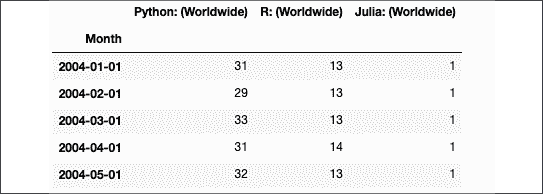

图 1.1:时间序列数据集的摘录

这是一个多变量时间序列，包含 Python、R 和 Julia 列。第一列是索引，一个日期列，它的周期是月。在只有一个变量的情况下，我们称之为**单变量**序列。如果我们只有一种编程语言而不是三种，那么这个数据集将是单变量的。

时间序列大多是离散时间的，每个点之间的时间差是相同的。时间序列最重要的特征如下:

*   数值的长期变动(**趋势**
*   季节性变化(**季节性**)
*   不规则或循环组件

趋势是事物发展或变化的大致方向，例如序列中的长期增加或减少。可以观察到趋势的一个例子是全球变暖，在过去的半个世纪里，我们星球的温度一直在上升。

这是美国宇航局发布的 GISS 地表温度分析数据集绘制的过去 100 年全球地表温度变化图:

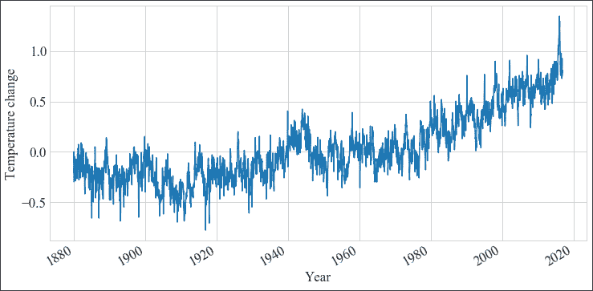

图 1.2:1880 年至 2019 年 GISS 地表温度分析

正如你在*图 1.2* 中看到的，直到 20 世纪中期^(气温变化一直在 0 左右变化；然而，从那以后，每年的气温有一个明显的总体上升趋势。)

季节性是在不到一年的特定定期间隔内发生的变化。季节性可以发生在不同的时间跨度上，例如每天、每周、每月或每年。每周季节性的一个例子是冰淇淋的销售在每个周末增加。此外，根据你居住的地方，冰淇淋可能只在春天和夏天出售。这是每年的变化。

除了季节性变化和趋势之外，还有不具有固定频率的可变性，或者不以基于季节频率的方式上升和下降。根据我们所掌握的知识，我们也许能够解释其中的一些。

作为不规则的周期性变化的一个例子，银行假日可能落在每年不同的日历日，促销活动可能取决于商业决策，如推出新产品。作为一个非季节性的周期性变化的例子，毫秒级的变化或超过一年的时间周期的变化不能称为季节性效应。

**平稳性**是一个时间序列的属性，不随时间改变其分布，如其汇总统计所描述的。如果一个时间序列是稳定的，这意味着它没有趋势，没有确定性的季节性变化，尽管其他周期性变化是允许的。这是我们将在*第 5 章*、*使用移动平均和自回归模型进行预测*中讨论的算法的一个重要特性。为了应用它们，我们需要通过去除季节性和趋势性将非平稳数据转换成平稳数据。

我们将在*第 2 章*、*用 Python 进行时间序列分析*和*第 3 章，预处理时间序列*中更详细地讨论这些和其他概念。

识别、量化和分解这些和其他特征的任务被称为**时间序列** **分析**。探索性的时间序列分析往往是任何特征转换和机器学习之前的第一步。

# 时间序列和预测——过去和现在

时间序列的研究自古以来就有，从那以后，时间序列分析和预测走过了漫长的道路。各种各样的学科促进了应用于时间序列的技术的发展，包括数学、天文学、人口统计学和统计学。很多创新最初来自数学，后来是统计学，最后是机器学习。应用统计学的许多创新源于人口学(用于公共管理)、经济学或其他领域。

在这一节中，我将勾勒出从简单方法到今天可用的机器学习方法的发展道路。我将尝试描绘从工业革命到现代的时间序列相关概念的发展。我们将在*第 4 章*、*时间序列机器学习介绍*中处理更技术性和最新的东西。

时间序列还有更多的未来。可穿戴传感器和物联网的发展意味着大数据可用于分析和预测。最近几年，用于基准测试和竞赛的大型数据集的可用性一直在帮助创建新的方法，我们将在后面的章节中讨论。

## 人口统计学

建立时间序列分析理论和实践的许多早期工作来自于公共管理中使用的人口学。本节提到的许多人要么是公务员，要么是出于对抽象问题的兴趣而以私人身份做出贡献。

约翰·格兰特原本是一名服装商，后来对伦敦教区记录的死亡记录产生了兴趣。1662 年，他在他的书《对死亡率的自然和政治观察》中发表了公共卫生统计数据。“在关于流行病学的统计中，包括了第一张生命表。生命表(也称为死亡率表或精算表)是显示每个年龄的人在下一个生日前死亡的概率的表。Graunt 从死亡清单中做出了他的推论，死亡清单是由教区书记员产生的，他们记录了伦敦城内和城外地区英格兰教会墓地的葬礼。

格兰特的书极具影响力，他被广泛认为是人口学的创始人。格兰特被选为皇家学会的会员；然而，在 1666 年伦敦大火期间，他的房子被烧毁后，他遭遇了破产，他死于黄疸和肝病，享年 53 岁。

除其他外，他还启发了瑞士数学家雅各布·伯努利(Jakob Bernoulli)于 1684 年至 1689 年间撰写的著作《猜度学》(Ars conjudandi)，并在他死后于 1713 年出版，这是组合学和概率论领域的一个里程碑式的出版物，其中包括大数定律的第一个版本。

大数定律描述了当一个实验被大量重复时会发生什么。伯努利证明，在一个有两种结果(如抛硬币)的机会游戏中，一个赢或一个输，如果重复多次，游戏获胜的概率接近真实的预期概率。

人口统计学历史上的另一个重要里程碑是 1689 年德国教授兼牧师 Caspar Neumann 写的一篇文章——“Reflexionenüber Leben und Tod Bei denen in Breslau Geborenen und Gestorbenen”(翻译:关于在 Breslau 出生和死亡的人的生活和死亡的思考)。诺依曼把这篇论文送给了杰出的哲学家和数学家戈特弗里德·莱布尼茨，后来他的数据被伦敦的皇家学会获得。

许多后来的工作都是基于这篇文章中的数据和统计。1693 年，在皇家学会*哲学汇刊*上发表的一篇关于生命年金的文章(*对人类死亡率程度的估计】)中，埃德蒙多·哈雷根据诺依曼的数据编制了死亡率表。年金是等间隔支付的款项，如抵押贷款、保险和养老金。哈雷的文章引导了精算科学的发展，并告知英国政府何时根据购买者的年龄以适当的价格出售退休收入保险。我们会在天文学部分再次遇到哈雷。*

亚伯拉罕·德莫佛是法国人，由于法国胡格诺派教徒的宗教迫害，他在年轻时移居英国。今天，他因在正态分布和概率论方面的工作而闻名。1724 年，他出版了一本名为“*年金对生命的影响*”的书，你可以在下面看到它的封面，是关于死亡率统计和年金理论的基础。


图 1.3:年金对生活的影响

德·莫伊弗尔还因其对二项式分布的近似和对泊松分布的研究(后来以西蒙·丹尼斯·泊松命名)而闻名于世。

有了一些统计学基础，我们现在开始对未来进行预测，这就是时间序列预测的用武之地。1751 年，本杰明·富兰克林在他的文章《关于人类、国家人口增长的观察》中研究了人口增长及其极限。，“预测英国殖民地的指数增长。他预计英国直辖殖民地的人口每 25 年翻一番，他认为，这有可能传播自由主义政治传统，增强英国的实力。他的预测被证明是正确的，指数增长一直持续到 19 世纪 50 年代，当时美国人口超过了英国。

受富兰克林影响的是英国牧师托马斯·罗伯特·马尔萨斯，他担心人口增长会超过粮食生产的增长。在他的设想中，虽然人口呈指数增长，但食品供应和其他资源的增长是线性的，这最终会导致社会崩溃和大量人口死亡。在 18 世纪末的作品中，他描述了不断增长的饥荒和贫困(以他的名字命名为“*马尔萨斯大灾难*”)。

许多其他统计和数学概念都是基于人口统计数据得出的。阿道夫·克托莱是一位天文学家、数学家和社会学家，来自今天的比利时根特，他将统计方法引入社会科学，以描述犯罪率、结婚率和自杀率之间的潜在关系。他呼吁建立一种“社会物理学”，来发现社会现象背后的规律，从而揭示上帝的工作。其中，他发展了身体质量指数，最初称为克托莱指数。在他 1835 年的著作《论人》的英文译本中，他描述了基于正态分布的普通人的概念。克托莱的一个学生皮埃尔·弗赫斯特发展了逻辑函数作为人口增长的模型。

西蒙·丹尼斯·泊松于 1837 年出版了《*Recherches sur la Probabilityédes jugementes en matière criminelle et en matière civile*》(翻译:关于刑事和民事案件中判决概率的研究)，他在书中阐述了在给定时间间隔内发生的离散事件的概率理论。泊松分布就是以他的名字命名的。

人口时间序列分析的先驱威廉·莱克斯(Wilhelm Lexis)发表了一篇名为《*关于统计序列*稳定性理论》的论文(1879)，引入了现在称为莱克斯比率的量。该比率区分稳定序列和非稳定序列，在稳定序列中，引起观察到的比率的潜在概率分布保持不变。这些稳定的时间序列不会受到随机噪声以外的力的影响。在今天的术语中，稳定的时间序列被称为白噪声过程或零阶移动平均。

为了区分稳定和不稳定的时间序列，Lexis 创建了一个检验统计量，该统计量等于观察到的比率的离差与如果每个观察到的比率的潜在概率在所有观察中均相等时预期的离差之间的比率。他认为，如果这个比率 Q 大于 1.41，这意味着时间序列是不稳定的，或者用他的话说，受物理力的影响。Lexis 后来成为德国联邦保险监督办公室保险顾问委员会的成员。

## 遗传学

弗朗西斯·高尔顿，维多利亚时代的英国科学家，出生于一个由银行家和枪支制造商组成的显赫家族，其中包括几名皇家学会成员。高尔顿是一位多产的作家和研究者。今天，他因创造了“优生学”一词而为人们所铭记。优生学是一门研究未来几代人种族素质变化的学科，重点是人们所期望的人类素质。优生学与种族主义和白人至上联系在一起。

高尔顿对许多科学学科感兴趣，如心理学、统计学、心理物理学、摄影等，由于他的贡献，他于 1909 年被授予爵士称号。除此之外，他还对人体测量学做出了贡献，即人体的系统测量和描述。在这项工作中，他重新发现了相关性的概念(首先由法国物理学家奥古斯特·布拉维在 1846 年提出)，并描述了前臂长度和高度、头部宽度和头部宽度以及头部长度和高度之间的相关性(1888 年)。

他的门徒之一(也是传记作者)是卡尔·皮尔逊，出生于伦敦伊斯灵顿的一个贵格会家庭，父亲是王室法律顾问(律师)。在剑桥大学国王学院学习数学，在海德堡大学学习物理和哲学，在柏林大学学习生理学后，他回到伦敦学习法律。在伦敦，他被介绍给高尔顿，两人保持联系。

高尔顿去世后，皮尔逊第一个担任了高尔顿在遗嘱中赋予的优生学的职位。皮尔森的主要兴趣是在遗传背景下应用生物统计学。他被认为是标准偏差的发明者，标准偏差是对正态分布可变性的一种度量，它取代了卡尔·弗里德里希·高斯的平均误差概念。他还对统计学做出了贡献，包括卡方检验、统计显著性的 p 值、今天使用的相关性、主成分分析和直方图。

皮尔逊被罗纳德·费雪继任为高尔顿优生学教授(后来改名为高尔顿遗传学教授)。费希尔在关于模仿、父母投资和 1:1 性别比例背后的费希尔原理的进化理论方面做出了许多创新。在统计学中，他描述了线性判别分析、费希尔信息、F 分布和学生的 t 分布。

他对统计学的贡献为时间序列分析中的统计检验和一些经典模型奠定了基础。1952 年，伊丽莎白女王二世授予费舍尔爵士学士学位。然而，他与种族主义观点的联系——比如，他支持德国纳粹党的灭绝政策，目的是改善基因存量——导致最近对他的工作进行了重新评估。

结果，伦敦大学学院的罗纳德·费雪中心更名为计算生物学中心，UCL 为其在宣传优生学中的作用公开道歉。

## 天文学

对彗星和小行星的观察，以及太阳和行星的运动已经被记录了很长时间，人们一直在研究这些记录，以了解这些运动的规律和关系以及我们在宇宙中的位置。英国天文学家和地球物理学家埃德蒙多·哈雷，我们在人口统计学一节中提到过他，他将艾萨克·牛顿的运动定律(从 1687 年开始)应用于历史上的彗星观测。从地球上肉眼可见的彗星，它在世界各地都可以看到，并被天文学家和哲学家记载至少约 2000 年，出现在古希腊著作和巴比伦的表格中。

例如，它出现在公元前 12 年，接近耶稣基督诞生的指定日期，已经导致暗示它可能是伯利恒之星的圣经故事的背后。1066 年，这颗彗星在英格兰被看到，被认为是一个神圣的信息，一个不祥的预兆，预示着哈罗德二世的命运，同年他死于与征服者威廉率领的诺曼入侵者作战的黑斯廷斯战役。

哈雷联系了许多这样的观察，得出结论，每次都是同一颗彗星，并计算出周期为 75-76 年。今天，为了纪念他，哈雷彗星以他的名字命名。这发表在“*彗星天文学提要* (1705)”上。哈雷彗星将于 2061 年重新出现。

这张图显示了哈雷彗星的轨道(来源:维基共享资源):

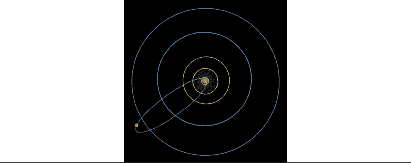

图 1.4:哈雷彗星轨道

德国学者卡尔·弗里德里希·高斯在 1801 年发明了一种确定矮行星谷神星轨道的方法。谷神星在火星和木星之间的小行星带中运行。高斯基于天主教牧师和天文学家朱塞普·皮亚齐的观察做了这个，他在同年 1 月至 2 月间追踪了一个天体，之后就看不见了。

后来，直线拟合被应用于天体的运动，最突出的是**最小二乘法**。1805 年，阿德里安-玛丽·勒让德(Adrien-Marie Legendre)首次描述了这一现象，但今天，它被共同归功于高斯。高斯后来在 1809 年发表了关于这个方法的文章；然而，他的发展大大超越了勒让德的工作，其中包括发明了以他的名字命名的分布，高斯分布(也称为正态分布或钟形分布)。

**最小二乘法**是线性回归方法的基础，其中方程组中的参数被估计。这是一个统计过程，通过最小化绘制曲线的残差平方和来找到一组数据点的最佳拟合。

仅一年后，皮埃尔·西蒙·拉普拉斯就证明了**中心极限定理**，该定理大致陈述了独立变量的总和，即使它们不是来自正态分布，也趋向于正态分布。这为最小平方法和大数据集情况下的正态分布提供了重要的理由。从那以后，正态分布在统计学领域一直具有很大的影响力，并且使用诸如平均值和标准差之类的度量来描述它。

拉普拉斯对行星运动非常感兴趣，但他也提出了潮汐运动的动力系统理论和概率论。了解拉普拉斯的一个有趣事实是，1784 年拿破仑·波拿巴在巴黎军事学院学习时，他是他的考官。

拉普拉斯最著名的贡献之一是继承规则，它描述了在给定过去事件的情况下一个事件发生的概率。他为说明演替规律而提出的日出例子是，给定太阳在过去升起的天数，明天太阳升起的概率:


拉普拉斯对日出问题的假设是，除了公式中使用的观察天数之外，我们对该物质一无所知。他实际上警告说，在这种情况下的应用是对规则的误用，因为我们对太阳和地球的运动知道得更多。

受天文计算的启发，奥古斯丁-路易·柯西(Augustin-Louis Cauchy)于 1847 年发明了梯度下降优化算法(在《法国科学院学报》上，*Comptes rendus de l ' académie des Sciences*)，其中在梯度的相反方向上重复步骤导致找到局部最小值。

许多其他优化和曲线拟合创新随之而来。leven Berg–Marquardt 算法(也称为阻尼最小二乘法)于 1944 年由 Kenneth Levenberg 首次发表，并于 1963 年由 Donald Marquardt 重新发现，可用于问题中的曲线拟合，其中因变量是模型参数的非线性组合(非线性问题)。它结合了高斯-牛顿算法(Gauss 于 1809 年发表的牛顿算法的变体)和大约一百年前发明的梯度下降法。

## 经济学

威廉·普莱费尔 1759 年出生于苏格兰，是一个牧师家庭的第四个儿子。他跟随打谷机的发明者安德鲁·梅克勒在当学徒，后来成为博尔顿·瓦特蒸汽机制造厂詹姆斯·瓦特的私人助理。

他的一生是如此多事，以至于可以写几部关于他的小说。1789 年，他参加了攻占巴黎巴士底狱的行动。此后，他作为投机商威廉·杜尔和 Scioto 公司的代理人，参与了一起可能是盗用公款的阴谋，向愿意移民的法国人出售俄亥俄州的无价值土地契约。回到伦敦后，他开了一家破产的银行。后来，他因负债累累，在债务人监狱——舰队监狱(Fleet Prison)被监禁了几年。然后，他成为了一名英国特工，在 1789 年到 1796 年间伪造法国货币，以削弱法国政府。转让很快变得毫无价值，通货膨胀削弱了法国政府。他还为金属加工机械和船舶的几项发明申请了专利。

然而，Playfair 的主要成就之一是他普及了几种可视化技术，如饼图、条形图和时序图。他有时被认为是条形图的发明者，尽管尼科尔·奥雷斯姆在几百年前就在出版物中展示了条形图。

这里有两个图，条形图和时间序列图，都来自他 1786 年的“*商业和政治图集*”(图片来源:维基百科):

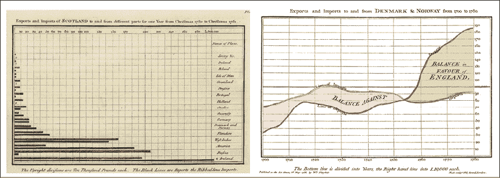

图 1.5: Playfair 来自商业和政治地图集的可视化

在左边，你可以看到条形图 Playfair 用于苏格兰进出口数据的定量比较。右边是时间序列图，显示一段时间内英国的贸易平衡。

## 气象学

希腊哲学家亚里士多德是第一个写天气及其测量的人；然而，第一次天气预报却花了更长的时间。1854 年，中将·罗伯特·菲茨罗伊建立了英国国家气象局。菲茨罗伊已经在历史上保留了他作为英国皇家海军贝格尔号船长的地位，这艘船载着一位名叫查尔斯·达尔文的刚刚毕业的博物学家环游世界，在进化论和自然选择理论的形成中发挥了关键作用。

在电报和气压计(一种气压计)的支持下，英国气象局收集了伦敦许多不同地方的天气数据。1859 年，皇家宪章号蒸汽快船在从澳大利亚墨尔本返回利物浦的途中，在一场风暴中触礁失事，导致大约 450 人丧生。这场灾难导致了风暴预警系统的发展，该系统后来扩展到了一般的天气预报。事实上，是菲茨罗伊创造了*预测*这个词，尽管在当时，许多同时代的人把它们称为“庸医天气预测”。尚不清楚他的预测是否遵循了任何系统。他因为他的工作而受到科学机构的嘲笑。弗朗西斯·高尔顿爵士对他进行了严厉的批评，他出版了一本名为“*气象图*的书，后来又出版了第一张气象图。菲茨罗伊于 1865 年割喉自杀。风暴警报暂时停止，几年后才恢复，延续至今。

第一个使用大气和海洋的天气模型是在 20 世纪 20 年代由 Lewis Fry Richardson 根据挪威人威廉·皮叶克尼斯的工作尝试的，他是斯德哥尔摩大学流体动力学和热力学的微分方程的讲师。然而，在计算机出现之前，这些模型是不切实际的——理查森在一个有限区域的天气预报上工作了大约六周。由于数值的不稳定性，他的预测被证明是不准确的，尽管他的方法本质上是正确的。当他的工作显然对化学武器设计者有价值时，他放弃了他的工作。

第一批计算机化的天气模型在**电子数字积分器和计算机** ( **ENIAC** )上被编程。由约翰·莫奇里和 j·普雷斯珀·埃克特设计的 ENIAC 可以运行任意的运算序列；然而，它不是从磁带上读取程序，而是从插板开关上读取程序。这台 15x9 米的巨型机器今天在华盛顿特区的史密森学会展出。它由 17500 个真空管组成，首先为氢弹的建造进行计算，然后利用数值天气预测的新方法将预测扩展到一两天。这台计算机是由克拉拉·冯·诺依曼设计的。

这里有一张 ENIAC 的照片(来源:维基共享资源):


图 1.6:电子数字积分器和计算机(ENIAC)

你可以看到贝蒂·斯奈德，ENIAC 最早的程序员之一，站在 ENIAC 前面。

后来，Joseph Smagorinsky 和 Douglas Lilly 开发了一个用于计算流体动力学的湍流数学模型。这个模型，Smagorinsky-Lilly 模型，今天仍在使用，使用有关风、云量、降水、大气压力以及地球和太阳辐射的数据作为输入。Smagorinsky 继续领导全球变暖的研究，调查气候对二氧化碳水平增加的敏感性。

移动传感器阵列和计算机模型的引入大大提高了预测的准确性。气象办公室或其他来源部署的传感器收集了有价值的温度和风力数据，最重要的是商业飞机在飞行时收集了这些数据。如今，在 7 天的时间内，预测准确率约为 80%。在 COVID 疫情期间，商业航班停飞，某些时段的航班减少了约 75%，导致最近的预测不太准确。

## 医学

1901 年，威廉·埃因托芬将电报接收器中使用的弦电流计应用于生理学。在荷兰莱顿工作时，他改进了以前的设计，制造出了第一个实用的心电图。心电图对于监测和筛选心脏功能非常重要，可以检测心律失常、冠状动脉血流不足和电解质紊乱。由于这项创新的重要性，爱因斯坦被授予 1924 年诺贝尔生理医学奖。

汉斯·伯杰(Hans Berger)在 1924 年记录了第一次人类脑电图(EEG)记录。脑电图通过放置在头皮上的电极测量大脑的电活动。脑电图记录显示了一段时间内大脑的自发电活动。

这是一个 EEG 信号的图表(来自德国 DHBW 的 Oliver Roesler 上传的 EEG 眼部状态数据集):

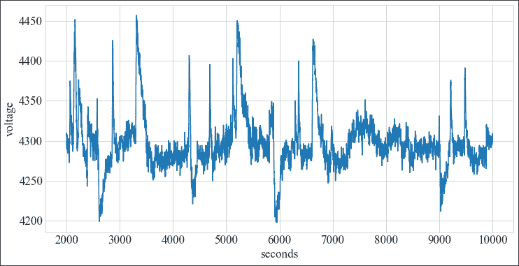

图 1.7:脑电图信号

在脑电图中，通过放置在头皮上的电极记录大脑的电活动。其信号通常在各种频率范围内表现出强烈的振荡(也称为脑电波),其中最突出的是:

*   阿尔法(8-12 赫兹)将出现在放松的状态下，尤其是闭上眼睛的时候
*   贝塔(16-31 赫兹)表示思维更活跃
*   伽玛(超过 32 赫兹)表示跨通道的感觉处理

脑电图的医疗用途非常广泛——除其他用途外，脑电图可用于诊断癫痫、睡眠障碍、肿瘤、中风、麻醉深度、昏迷和脑死亡。

## 应用统计

应用统计学和数学也为时间序列研究提供了灵感和基础。托马斯·贝叶斯牧师证明了一个描述基于先验知识的事件概率的定理。贝叶斯定理被认为是贝叶斯推理的基础，贝叶斯推理是一种统计推理方法。

我们将在*第 9 章*、*时间序列的概率模型*中回到这个问题。贝氏的手稿在他死后两年内(1761 年)被他的朋友理查德·普莱斯以大量编辑的形式读给了皇家学会。

傅立叶变换对滤波很重要，它将信号从时域转换到频域。函数的三角分解是约瑟夫·傅立叶在 1807 年发现的，但一种快速算法是由高斯在 1805 年左右首先发明的(尽管只是在他死后才以拉丁文出版)，然后在 160 年后由 J. W .库利和约翰·图基重新发现。

经典的时间序列建模方法是由 George Box 和 Gwilym Jenkins 于 1970 年在他们的著作“*时间序列分析预测和控制*”中介绍的最重要的是，他们将 ARIMA 和 ARMAX 模型形式化，并描述了如何将它们应用于时间序列预测。我们将在第五章、*移动平均预测和自回归模型*中讨论这些类型的模型。

# 面向时间序列的 Python

对于时间序列，有两种主要的语言，R 和 Python，简单比较一下这两种并描述一下 Python 的特别之处是值得的。Python 是最受欢迎的编程语言之一。根据 2021 年 2 月的 TIOBE，它的受欢迎程度仅次于 C 和 Java。

| **排名** | **语言** | **评级** |
| 一 | C | 16.34% |
| 2 | Java 语言(一种计算机语言，尤用于创建网站) | 11.29% |
| 3 | 计算机编程语言 | 10.86% |
| 四 | C++ | 6.88% |
| ... | ... | ... |
| 11 | 稀有 | 1.56% |
| ... | ... | ... |
| 29 | 朱莉娅 | 0.52% |

图 1.8: TIOBE 语言使用统计

为了支持 Python 是最流行的数据科学语言这一观点，我已经包括了 R 和 Julia 这两种用于数据科学的语言。当比较 Python、R 和 Julia 这三种最重要的数据科学语言的搜索量时，我们可以看到 Python 比 R 更受欢迎，Julia 远远排在第三位。其实 Python 的排名和 C、Java、C++等语言差不多。r 和汇编语言、Groovy 差不多水平，Julia 和 Prolog 等专业语言水平相当。

R 的社区由统计学家和数学家组成，R 的强项在于统计和绘图(ggplot)。R 的弱点是它的工具和一致的代码风格惯例的实际缺乏。

另一方面，Python 已经在统计和科学计算方面赶上了 NumPy、SciPy 和 pandas 等库，并且在数据科学的使用和可用性方面已经超过了 R。

Python 在机器学习库方面很突出。以下库完全或主要用 Python 编写:

*   Scikit-learn 是用 Python 和 Cython(一种类似于 C 编程语言的 Python 方言)编写的。它为训练和评估机器学习模型提供了一个非常大的算法集的实现。
*   Statsmodels 提供统计测试，以及诸如广义线性模型(GLM)、ARMA 等模型。
*   Keras 是 Python 中用于训练神经网络的抽象，它与 TensorFlow 和其他库进行交互。

一些最受欢迎的机器学习框架——那些在开发中有大量用途并具有大量可扩展算法的框架，如 TensorFlow、PyTorch 和 XGBoost——也主要是用 Python 编写的，或者为 Python 提供了一流的接口。

此外，作为一种通用语言，如果你想超越数据分析，Python 是理想的。使用 Python，您可以实现构建端到端机器学习系统所需的完整数据流，您可以部署该系统并将其与公司的后端平台集成。

下面的时间序列图根据 Google Trends 显示了 Python 和 R 的流行程度。朱莉娅被省略了，因为它几乎没有出现在图表的底部。

最近，COVID 削弱了 Python 的受欢迎程度，但其他编程语言的搜索量也下降了。

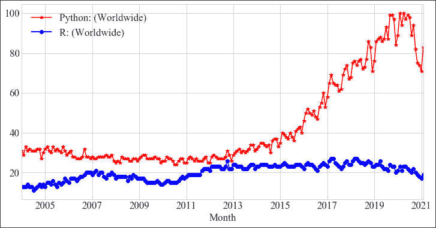

图 1.9:一段时间内 Python 与 R 的使用对比

在过去的几年里，Python 明显胜过 R，尽管不得不承认这种比较并不完全公平，因为 Python 比 R 有更广泛的应用。然而，Python 也是一般数据科学，特别是时间序列方面得到最好支持的语言之一。截至 2021 年 2 月，如果我们在 GitHub 中搜索时间序列，我们会发现大约五倍数量的存储库(包括带有 Jupyter 笔记本的存储库)。对于朱莉娅，我找到了大约 104 个知识库。具体数字请见下表:

| **语言** | **时序知识库** |
| Jupyter 笔记本 | 11,297 |
| 计算机编程语言 | 4,891 |
| 稀有 | 3,656 |
| 朱莉娅 | 104 |

图 1.10: TIOBE 语言使用统计

为了给专门研究时间序列的 Python 机器学习项目一点感觉，这里有一个 GitHub 上著名库的简短列表:

*   先知
*   sktime
*   胶子-ts
*   tslearn
*   pyts
*   seglearn
*   飞镖游戏
*   铯
*   pmdarima

这些截图(取自 gitcompare.com)总结了这些库的一些统计数据，如星级数(有人喜欢该库的次数)、分叉数(有人为了研究它或进行更改而复制了该库的次数)、年龄(该库存在了多长时间)，以及其他:

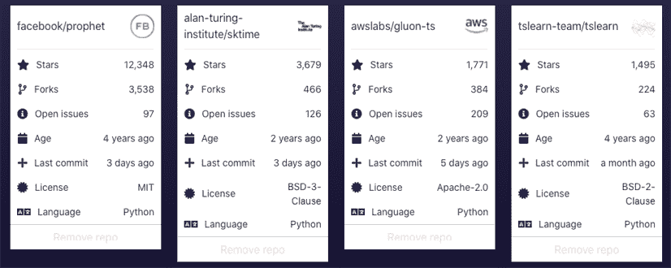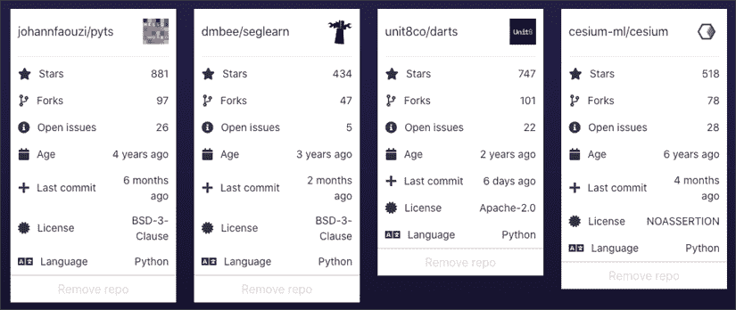

图 1.11:主要 Python 库的库统计数据

在本书中，我们将介绍许多这样的时序库。我们将在接下来的章节中讨论一些 Python 数据科学库，但是如果你想对这些库有一个完整的介绍，你应该浏览一本专门关于 Python 中的数据科学的书，甚至 NumPy 和 pandas。

## 安装库

维护和安装本书所需的 Python 库的两个主要工具是 conda 和 pip。

请注意，接下来两小节中的命令应该从系统终端执行，或者——对于 conda——使用 Anaconda navigator。对于 Windows 和 Mac 用户，有可用的图形用户界面，可以在其中搜索和安装库，而不是依赖于终端。

**conda** 与 Python、R 和其他语言一起工作，用于依赖性管理和环境封装。conda 还通过维护与 Python 库相关的库列表来帮助安装系统库。

开始使用 conda 的最好方法是按照以下链接的说明安装 anaconda:[https://docs.continuum.io/anaconda/install/](https://docs.continuum.io/anaconda/install/)。

conda 还有一个图形界面，设计巧妙，如下图所示:

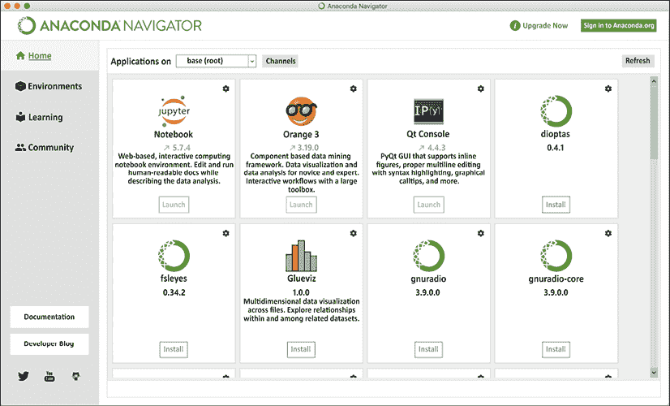

图 1.12: Anaconda 导航器

Anaconda navigator 可以安装在 macOS 和 Microsoft Windows 上。

或者，你可以完全依赖终端。例如，下面是如何从终端安装 NumPy 库:

```
conda install numpy 
```

顺便提一下——如果你想使用 R 编程语言，你也可以使用 conda:

```
conda install r-caret 
```

有关深入的介绍和教程，请参见 conda 文档。Conda 还安装了 Python 和 pip 的版本，因此您可以使用 pip 或 conda 安装 Python 库，同时使用 conda 管理您的环境。

终端命令既可以从系统终端执行，也可以在 Jupyter 环境、笔记本或 JupyterLab 中执行，只需在前面加上感叹号。

例如，来自终端内部的命令:

```
pip install xgboost 
```

可以在 Jupyter 环境中编写，如下所示:

```
!pip install xgboost 
```

Jupyter 内部的感叹号告诉解释器这是一个 shell 命令。在 Jupyter 的最新版本中，pip 命令不再需要感叹号。

让我们快速看一下启动 Python 和安装库的简单会话是如何出现在终端上的:

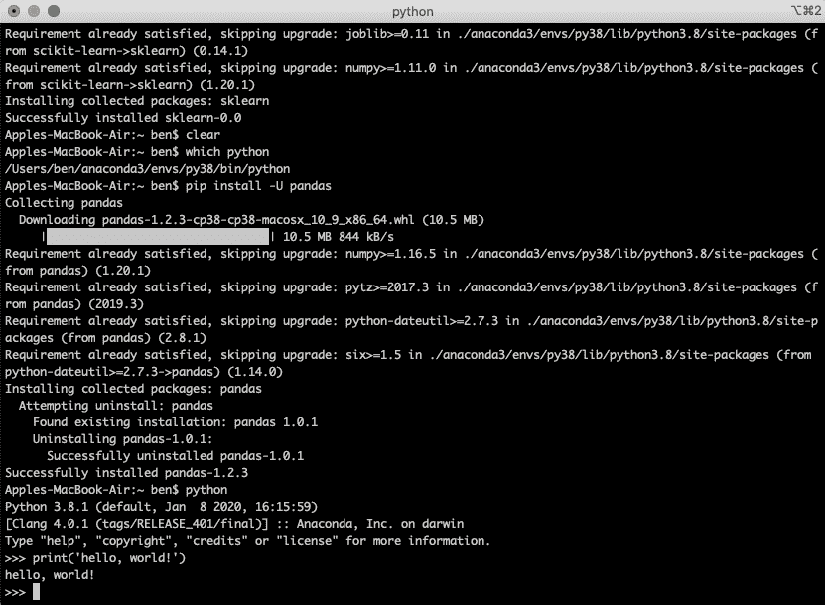

图 1.13:终端窗口

pip 是 Python 库的包管理器。以下是一些来自终端的有用命令:

```
# install NumPy: 

pip install numpy

# install a particular version:

pip install numpy==1.20.0

# upgrade a library:

pip install -U numpy

# install all libraries listed in a requirements file:

pip install -r production/requirements.txt

# write a list of all installed libraries and their versions to a file:

pip freeze > production/requirements.txt 
```

您可以安装不同版本的 Python 和 pip 以及不同版本的库。这些可以作为环境来维护，你可以在它们之间切换。Virtualenv 是一种维护环境的工具:

```
# create a new environment myenv:

virtualenv myenv

# activate the myenv environment:

source myenv/bin/activate

# install dependencies or run python, for example:

python

# leave the environment again:

deactivate 
```

`activate`命令将改变您的`$PATH`变量指向`virtualenv bin/`目录，其中包含 Python 和 pip 可执行文件的版本。这意味着所有这些都可以作为选项使用。您通常会看到反映这一变化的提示。

请注意，对于环境的激活，您可以使用完整或相对路径。在 Windows 中，激活命令略有不同，您可以运行一个 shell 脚本:

```
# activate the myenv environment:

myenv\Scripts\activate.bat 
```

## Jupyter 笔记本和 JupyterLab

Jupyter 代表 Julia，Python，r。它是一个在交互式环境中运行这些语言和其他受支持语言的脚本的平台，如 Scala 和 C。

您可以从终端启动计算机上的笔记本服务器，如下所示:

```
jupyter notebook 
```

您应该看到您的浏览器打开了一个带有 Jupyter 笔记本的新标签。我用于加载数据科学语言时间序列的笔记本的开头是这样的:

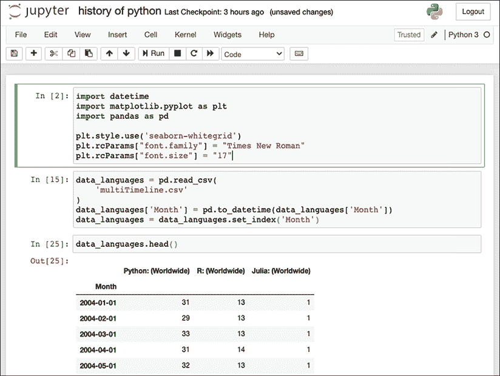

图 1.14: Jupyter 笔记本

或者，我们也可以使用 JupyterLab，这是下一代笔记本服务器，在可用性方面有显著的改进。

您可以从终端启动 JupyterLab 笔记本服务器，如下所示:

```
jupyter lab 
```

JupyerLab 看起来与默认的 Jupyter 服务器有点不同，正如你在下面的截图中看到的(来自 JupyterLab GitHub repo):

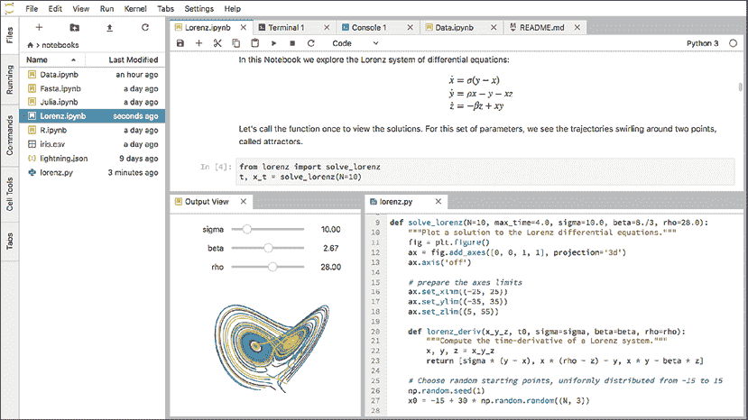

图 1.15: JupyterLab

这两个中的任何一个，Jupyter notebook 或 JupyterLab，都会给你一个**集成开发环境** ( **IDE** )来编写我们将在本书中介绍的代码。

最后，知道如何从 Jupyter 内部获得帮助非常方便。这就是问号出现的地方。问号，？，用于提供笔记本内帮助，如下所示:

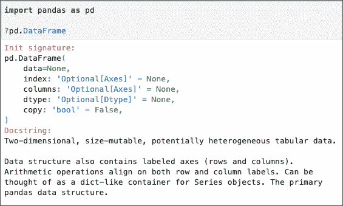

图 1.16:笔记本中的帮助

如果您想访问函数的签名或完整源代码清单，也可以在函数的末尾使用单引号或双引号。这种功能可以节省大量时间——不用在 Google 上搜索代码或类或函数的定义，您可以在几毫秒内获得信息。

## NumPy

NumPy 是 Python 中科学计算的基础库，因为许多库都依赖于它。PyTorch 和 TensorFlow 等库提供了与 NumPy 的接口，因此数据导入/导出轻而易举。pandas 基本上是一个围绕 NumPy 数组的高级接口。

SciPy 也建立在 NumPy 之上。SciPy 代表*科学 Python* ，包含从数学常数到积分、优化、插值、信号处理等功能。

NumPy 允许你处理不同维度的矩阵，并对它们进行计算。你可能主要和 pandas 或其他库一起工作，而不会和 NumPy 有太多接触；然而，为了更深入的理解和更高的性能，了解 NumPy 无疑是非常重要的。

NumPy 中的一些基本命令如下。这应该在 Python 解释器中执行。我们将创建一维和二维数组:

```
import numpy as np

# 1 dimensional array:

x1 = np.array([1, 2, 3])

>>> array([0, 1, 2])

x2 = np.arange(3)

>>> array([0, 1, 2])

x1 == x2 

>>> True

# 2 dimensional array: 

y = np.array([(1, 2, 3),(4, 5, 6)]) 
```

NumPy 有非常方便的文档功能；例如，要检索`optimize.fmin`函数的文档，请使用下面的代码(为了简明起见，我省略了几行):

```
>> np.info(optimize.fmin)

fmin(func, x0, args=(), xtol=0.0001, ftol=0.0001, maxiter=None, maxfun=None,full_output=0, disp=1, retall=0, callback=None)

Minimize a function using the downhill simplex algorithm.

Parameters

----------

func : callable func(x,*args)

    The objective function to be minimized.

x0 : ndarray

    Initial guess.

args : tuple

    Extra arguments passed to func, i.e. ``f(x,*args)``.

callback : callable

    Called after each iteration, as callback(xk), where xk is the

    current parameter vector.

Returns

-------

xopt : ndarray

    Parameter that minimizes function.

fopt : float

    Value of function at minimum: ``fopt = func(xopt)``.

iter : int

    Number of iterations performed.

…

Notes

-----

Uses a Nelder-Mead simplex algorithm to find the minimum of function of

one or more variables. 
```

## 熊猫

pandas 是一个库，它允许通过索引(如列名)访问矩阵或数组，这被称为**数据框架**。单列或单行可以作为系列来访问，这是 pandas 中的另一种数据类型。这些系列是 NumPy 数组。

pandas 库包括从 CSV、Excel 和许多其他格式导入和导出数据的函数和类；用于选择和切片数据；以及类似于结构化查询语言(SQL)的合并、连接、分组和聚合函数。你也可以直接从 pandas 绘图，因为 pandas 集成了 matplotlib，但它也可以与其他绘图库一起工作，如 bokeh:

```
import pandas as pd

# read a csv file:

df = pd.read_csv('value.csv')

# find how many rows in a dataframe:

len(df)

# return the head or tail of a dataframe:

df.head()

df.tail()

# print the full dataframe:

with pd.option_context(

  'display.max_rows', None,

  'display.max_columns', None

):

  print(df)

# create a dataframe:

df2 = pd.DataFrame({"A": [1, 2], "B": [3, 4]})

# plot two columns against each other:

df2.plot(x='A', y='B', kind='scatter')

# save the dataframe to a csv:

df2.to_csv('new_file.csv', index=False)

# output to NumPy matrix:

df2.to_numpy() 
```

最后一个命令的输出应该是这样的:

```
array([[1, 3],

       [2, 4]]) 
```

## Python 中的最佳实践

在这一节，我想谈谈好的编码。整本书都在讨论这个问题，而这一节无法公正地论述这个问题；不过，我的目标是至少给出一些要领和指点。对于超越初学者水平的编码，在公司环境中，或者任何组织中，好的实践很重要。

编写易于维护和增强的通用代码并不容易，需要经验。只有以其他人可读的方式表达思想的代码对团队才是有用的。最重要的原则之一是 DRY(不要重复自己)，减少重复，每个功能在系统中找到自己独特的表现形式。

这不是一个完整的列表，但其他一些原则包括以下内容:

*   证明文件
*   依赖性管理
*   代码验证
*   错误处理
*   测试(尤其是单元测试)

其中一些有整本书都是关于它们的，这超出了我们的讨论范围。一旦你准备好投入生产，这些都是至关重要的，这样你的代码就可以被依赖。

每当我回到我的一个项目时，不管是在我的工作中还是在我的私人生活中，我仍然觉得自己像个白痴，并且意识到我没有写足够的文档。当这种情况发生时，我不得不花费精力来重建我的代码的正确的心理表达。如果做得好，写文档可以帮助你的流程。阅读你的代码的其他人，以及几个月后的你，会很高兴你写了文档，尤其是函数、类和模块(文档串)。

依赖项的封装意味着您的代码是隔离的、可移植的和可复制的。在过去的几年中，出现了两个主要的工具来管理 Python、conda 和 pip 中的依赖和环境，我们在上一节中已经提到过。

风格和约定的混杂使得任何项目都变得一团糟，不仅难以阅读，而且难以维护。Python 最重要的编码风格之一是 Python 增强提案 8，或简称为PEP 8。你可以在 http://bit.ly/3evsgIW[找到 PEP 8 的风格指南。](http://bit.ly/3evsgIW)

已经开发了一些工具来检查 Python 代码是否符合 PEP 8(以及一些附加的约定)。这些工具可以帮助您在节省时间和精力的同时，使代码更易读、更易维护；例如，Flake8、Black、mypy 或 Pylint。Flake8 和 Pylint 不仅检查编码风格，还检查常见的编码错误和潜在的 bug。如果要对 Python 脚本运行 Flake8 测试，可以键入以下内容，例如:

```
flake8 --shore-source --show-pep8 myscript.py 
```

Black 可以让你唠叨格式或者自动修复文件、模块甚至整个项目的格式。pydocstyle 检查文档是否存在，以及文档是否符合文档风格指南。

此外，开发人员已经从几个高级项目中创建了更深入的开发和编码风格，并且非常有指导意义。scikit-learn 项目的指南可以在[http://bitly.com/3etFrtz](http://bitly.com/3etFrtz)找到。对于熊猫，你可以在 http://bit.ly/2OlpCKZ 的[比较它们的风格。](http://bit.ly/2OlpCKZ)

单元测试是一种为模块、类和其他代码单元设置测试的方法。Python 中最流行的单元测试库之一是 pytest。你可以在 pytest 文档中找到更多关于 pytest 的:[https://docs.pytest.org/en/stable/](https://docs.pytest.org/en/stable/)

# 摘要

在这一章中，我们介绍了时间序列，时间序列研究的历史，以及用于时间序列的 Python。

我们从时间序列的定义及其主要性质开始。然后，我们回顾了不同科学学科中时间序列研究的历史，如人口学和遗传学、天文学、经济学、气象学、医学和应用统计学。

然后，我们回顾了 Python 对于时间序列的能力，以及为什么 Python 是使用时间序列进行机器学习的首选语言。最后，我描述了如何安装和使用 Python 来进行时间序列分析和机器学习，并且讲述了一些与时间序列和机器学习相关的 Python 基础知识。

在下一章，我们将看看用 Python 进行时间序列分析。