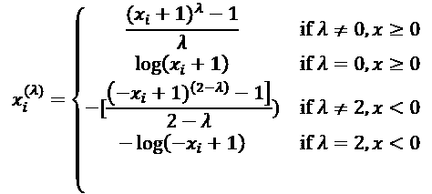
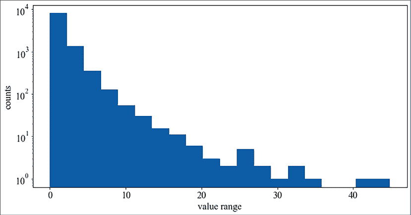
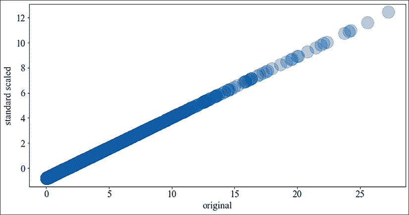
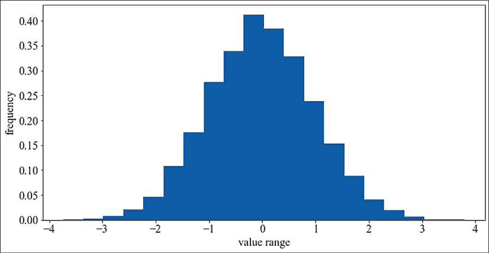

# 3

# 预处理时间序列

预处理是机器学习中至关重要的一步，但却常常被忽视。许多书没有深入讨论预处理，或者完全跳过预处理。当向外人介绍一个机器学习项目时，好奇心自然会被算法吸引，而不是数据集或预处理。

预处理相对沉默的一个原因可能是它没有机器学习本身有吸引力。然而，这往往是花费时间最多的一步，有时估计占整个机器学习过程的 98%左右。通常在预处理中，相对容易的工作会对机器学习模型的最终性能产生巨大影响。数据的质量在很大程度上决定了结果——在最糟糕的情况下，低质量的输入可以使机器学习工作完全无效(这可以用谚语“垃圾进，垃圾出”来概括)。

预处理包括管理和筛选数据，这与前一章中介绍的分析过程有些重叠，*第 2 章*，*用 Python 进行时间序列分析*。预处理的预期输出是数据集，在该数据集上更容易进行机器学习。这意味着它比原始数据集更可靠，噪音更小。

你可以在本书的 GitHub 资源库中找到这一章的代码。

我们将讨论以下主题:

*   什么是预处理？
*   特征转换
*   特征工程
*   Python 实践

我们将从讨论预处理的基础开始。

# 什么是预处理？

任何曾在公司从事机器学习项目的人都知道，现实世界的数据是杂乱的。它通常是从多个来源或使用多个平台或记录设备聚合而成的，并且是不完整和不一致的。在预处理中，我们希望提高数据质量，以成功应用机器学习模型。

数据预处理包括以下一组技术:

*   特征转换
    *   缩放比例
    *   幂/对数变换
    *   归罪
*   特征工程

这些技术主要分为两类:要么它们适应机器学习算法的假设(特征转换),要么它们关注从多个底层特征构建更复杂的特征(特征工程)。我们将只处理单变量特征转换，一次只应用于一个特征的转换。我们不会讨论多变量特征变换(数据缩减)，如变量选择或维度缩减，因为它们并不特定于时间序列数据集。

缺失值是机器学习中的一个常见问题，所以我们也将在本章中讨论替换缺失值(插补)。

我们将讨论作为预处理基本单位的特征。我们希望为我们的机器学习过程创建输入特征，使模型更容易训练、更容易评估或提高模型预测的质量。我们的目标是具有预测目标的特征，并且去相关(它们之间没有冗余)。去相关是线性模型的一个要求，但对于更现代的算法(例如基于树的算法)来说不太重要。

尽管我们将主要处理特征工程，我们也将提到目标转换。我们可以将目标转换更具体地称为目标工程；然而，由于应用于目标的方法与应用于特性的方法是相同的，所以我将它们包含在关于特性工程或特性转换的相同标题下。

请注意，我们将预处理的主要目标定义为增加我们特征的预测性，或者换句话说，我们希望提升我们机器学习模型预测的质量。我们可以从准确性、完整性和一致性的角度来定义数据质量，这将会覆盖更广的范围，包括数据聚合和清理技术，以及数据质量评估方法。

在这一章中，我们务实地将这里的处理范围缩小到机器学习中的有用性。如果我们的模型不符合目的，我们可能想要重复或改进数据收集，做更多的特征工程，或建立一个更好的模型。这再次强调了数据分析、预处理和机器学习是一个迭代过程的观点。

宁滨或离散化也可以是预处理的一部分，但也可以用于根据相似性对数据点进行分组。我们将在第六章、*时间序列的无监督方法*中讨论离散化和其他聚类技术。

在继续之前，让我们先了解一下用 Python 预处理时间序列数据集的一些基础知识。这将包括时间序列数据作为介绍操作背后的理论。

# 特征转换

很多模型或者训练过程都是基于数据按照正态分布的假设。如果数据集有偏差或多个峰值(多模态)，即使是最广泛使用的描述符，算术平均值和标准偏差，在很大程度上也没有用。不幸的是，观察到的数据通常不符合正态分布，因此传统算法可能会产生无效的结果。

当数据是非正态时，应用数据变换以使数据尽可能地像正态，从而增加相关统计分析的有效性。

通常，避开处理时间序列数据的传统机器学习算法可能更容易，相反，使用更新的所谓非线性方法，这些方法不依赖于数据的分布。

最后，虽然以下所有变换和缩放方法都可以直接应用于要素，但时间序列数据集的一个有趣之处在于，它们会随着时间而变化，我们可能不完全了解时间序列。这些转换中的许多都有在线变体，其中所有的统计数据都是动态估计和调整的。你可以看看*第 8 章*、*时间序列在线学习*，了解更多关于这个话题的细节。

在下一节中，我们将研究伸缩性，这是回归中的一个普遍问题。

## 缩放比例

有些特征有自然界限，比如人的年龄或产品的生产年份。如果这些范围在不同的特征之间有所不同，一些模型类型(同样，大多数是线性模型)会遇到这个问题，更喜欢相似的范围和相似的方法。

两种非常常见的缩放方法是最小-最大缩放和 z 分数归一化。

**最小-最大缩放**包括将特征的范围限制在两个常数 *a* 和 *b* 内。其定义如下:


在 *a* 为 0 而 *b* 为 1 的特殊情况下，这将特征的范围限制在 0 和 1 之间。

**Z 值归一化**将特征的平均值设置为 0，方差设置为 1(单位方差)，如下所示:


在 *x* 来自高斯分布的情况下，是标准的正态分布。

在下一节中，我们将研究对数和幂变换。这些转换非常重要，尤其是对于我们将在第 5 章*、*移动平均时间序列预测和自回归模型*中遇到的传统时间序列模型。*

## 对数和幂变换

对数变换和幂变换都可以将大幅度分布的值压缩成小范围的输出值。**对数变换**是一种特征变换，其中每个值 *x* 被*对数(x)* 所取代。

对数函数是指数函数的反函数，重要的是要记住 0 和 1 之间的范围被映射到负数(，而数字 *x > =1* 在正数范围内被压缩。对数的选择通常介于自然数和以 10 为底的数之间，但也可以是任何有助于使您的要素更接近对称钟形分布(即正态分布)的数。

可以说，对数变换是应用于使数据分布更接近高斯分布的不同类型的变换中最流行的一种。对数变换可用于减少分布的偏斜。在最佳情况下，如果要素遵循对数正态分布，则对数变换后的数据遵循正态分布。不幸的是，您的要素可能不会按照对数正态分布进行分布，因此应用此变换没有任何帮助。

一般来说，我建议谨慎对待数据转换。您应该始终在转换前后检查您的数据。您希望要素的方差能够捕捉到目标的方差，因此应确保不损失分辨率。此外，您可能希望检查您的数据是否更接近正态分布，这也是我们的目标。已经开发了许多统计方法来检验观察数据的正态性假设，但是即使一个简单的直方图也可以给出分布的很好的想法。

幂变换通常用于将数据从原始分布转换为更像正态分布的分布。正如引言中所讨论的，这可以对机器学习算法找到解决方案的能力产生巨大的影响。

**幂变换**是使用幂函数保持原始阶(该属性称为单调性)的变换。一个**幂函数**是这个形式的函数:


其中。

当 *n* 是大于 1 的整数时，我们可以根据 *n* 是奇数还是偶数做出两个主要的区分。如果是偶数，函数将趋向正无穷大，且 *x* 很大，无论是正还是负。

如果是奇数， *f(x)* 会随着 *x* 的增大而趋向正无穷大，而随着 *x* 的增大而趋向负无穷大。

电源转换通常定义如下:


其中 *GM(x)* 为 *x* 的几何平均值:


这减少了对参数的最优选择的转换。出于实用目的，两种电源变换是最常用的:

*   博克斯-考克斯变换
*   杨-约翰逊

对于 **Box-Cox 变换**，有两个变量，单参数变量和双参数变量。单参数盒–Cox 变换的定义如下:


参数的值可以经由不同的优化方法，例如变换后的特征是高斯的最大似然。

所以 lambda 的值对应的是幂运算的指数，比如带或者带。

有趣的事实:Box-Cox 变换是以统计学家 George E . P Box 和 David Cox 的名字命名的，他们决定一起工作，因为 Box-Cox 听起来不错。

**Yeo–Johnson 变换**是 Box-Cox 变换的扩展，允许零值和负值的x。可以是任意实数，其中 =1 产生恒等式变换。该转换定义为:



最后，**分位数变换**可以基于累积分布函数的估计将特征映射到均匀分布。可选地，这可以在第二步中被映射为正态分布。与我们讨论过的其他变换类似，这种变换的优势在于，它使要素更便于处理和绘制，并且更易于比较，即使它们是在不同的比例下测量的。

在下一节中，我们将了解插补，它的字面意思是通过推理分配值，但在机器学习中，它通常更狭义地指替换缺失值。

## 归罪

插补是对缺失值的替换。这对于任何无法处理缺失值的机器学习算法都很重要。一般来说，我们可以区分以下几种插补技术:

*   单位插补——缺失值由常数代替,如平均值或 0
*   基于模型的插补——用来自机器学习模型的预测替换缺失值

单元插补法是目前最流行的插补法，部分原因是因为它非常容易实现，而且与基于模型的插补法相比，它对计算资源的要求更低。

我们将在本章的练习部分做插补。在下一节中，我们将讨论特征工程。

# 特征工程

机器学习算法可以使用输入特征的不同表示。正如我们在介绍中提到的，特征工程的目标是产生新的特征，可以在机器学习过程中帮助我们。一些特征的表示或扩充可以提高性能。

我们可以区分手工制作和自动特征提取，其中手工制作意味着我们浏览数据并尝试提出可能有用的表示，或者我们可以使用一组从研究人员和从业人员的工作中建立的特征。一组确定特征的例子是 **Catch22** ，它包括 22 个特征和从相位相关间隔提取的简单汇总统计。Catch22 集合是**高度比较时间序列分析** ( **HCTSA** )工具箱的子集，另一组特性。

另一个区别是可解释和不可解释的特性。可解释的要素可以是汇总要素，如平均值、最大值、最小值等。这些可以在时间段、窗口内汇集，给我们更多的功能。

在《时间序列的特征》中，一些预处理方法附带了它们推荐的机器学习模型。例如，火箭模型是位于火箭特征顶部的线性模型。

在极端情况下，这可以是一种形式的**模型堆叠**，其中模型的结果作为其他模型的输入。这可以是一种分解学习问题的有效方法，即在监督设置中训练不太复杂(较少特征、较少参数)的模型，并使用它们的输出来训练其他模型。

请注意，重要的是，任何新功能只取决于过去和现在的输入。在信号处理中，这种操作被称为**因果滤波器**。单词 causal 表示在时间 *t* 的值的滤波器输出仅使用在时间 *t* 可用的信息，而不窥视未来。相反，其输出也取决于未来输入的滤波器是非因果的。我们将在第 10 章《时间序列的深度学习》中讨论时间卷积网络，基本上是因果卷积。

我们应该在训练和测试中非常小心，在预处理中提取和应用的任何统计数据都要经过仔细考虑——如果模型依赖的数据在预测过程中不可用，那么它的性能充其量会过于乐观。我们将在下一章讨论泄漏，*第四章*，*时间序列的机器学习*。

如果我们有许多特征，我们可能希望通过删减可用的特征并仅使用一个子集(特征选择)来简化我们的模型构建过程，或者相反，使用一组描述特征的基本质量的新特征(维度减少)。

我们可以用时间序列来区分以下类型的特征:

*   与日期和时间相关的功能
    *   日历功能(与日期相关)
    *   与时间相关的特征
*   基于窗口的功能

与日历和时间相关的特性非常相似，所以我们将在同一部分讨论它们。

基于窗口的特征是在(滚动)窗口内，即在一个时间段内集成特征的特征。例如，15 分钟窗口的平均值或 7 天内的销售额。由于我们在第 2 章、*中用 Python* 处理了滚动窗口，在本章中，我们将处理更复杂的特征，如卷积和 shapelets。

许多预处理算法都在`sktime`中实现。另一个方便的库是 tsfresh，它为时间序列计算了大量可解释的特征。在本章的代码中，我们已经通过特性工具访问了 tsfresh 特性。

让我们用 Python 再做一些时序预处理！接下来我们将讨论与日期和时间相关的特性。

## 与日期和时间相关的功能

日期和时间变量包含有关日期、时间或日期时间组合的信息。我们在前一章中看到了几个示例，*第二章*，*使用 Python 进行时间序列分析*——其中一个是与污染相对应的年份。其他例子可能是一个人的出生年份或贷款日期。

如果我们想要将这些字段输入到机器学习模型中，我们需要导出相关信息。例如，我们可以将年份作为一个整数，但是还有更多从日期时间变量中提取特征的例子，我们将在本节中讨论。通过用这些提取的特征来丰富我们的数据集，我们可以显著提高我们的机器学习模型的性能。

Workalendar 是一个 Python 模块，它提供了能够处理日历的类，包括银行和宗教节日的列表，它还提供了与工作日相关的函数。Python-holidays 是一个类似的库，但是这里我们将使用 workalendar。

在下一节中，我们将讨论火箭的特性。

## 火箭

研究论文 *ROCKET:使用随机卷积核的异常快速和准确的时间序列分类* (Angus Dempster，Franç ois Petitjean，Geoffrey I. Webb2019)向展示了一种用随机核卷积时间序列数据的新方法，这种方法可以提高机器学习模型的准确性并缩短训练时间。这篇论文的独特之处在于依靠卷积神经网络最近的成功，并将它们转移到时间序列数据集的预处理中。

我们将深入研究这篇论文的更多细节。 **ROCKET** ，是**随机卷积核变换**的简称，它是基于卷积的，所以我们先从卷积说起。

卷积是一种非常重要的变换，尤其是在图像处理中，并且是图像识别中深度神经网络的最重要的构建块之一。卷积由前馈连接组成，称为**滤波器**或**内核**，应用于图像的矩形面片(前一层)。然后，每个结果图像是整个图像上的核的滑动窗口。简单地说，在图像的情况下，内核是用于修改图像的矩阵。

锐化内核可能如下所示:


如果我们将这个内核依次乘以所有的局部邻域，我们会得到一个更清晰的图像，如下图所示(左边是原始图像，右边是锐化图像):


图 3.1:锐化滤镜

此图为灰色版“一分为二的女人，代表生与死”(伦敦博物馆及展览中心 Wellcome Collection 所有；由 4.0 在 CC 下许可)。

锐化内核强调相邻像素值的差异。你可以看到右边的图片更加粗糙或生动——这是卷积的结果。

我们不仅可以将内核应用于图像，还可以应用于向量或矩阵，这将我们带回 ROCKET。ROCKET 从每个内核和特征卷积中计算两个聚合特征。这两个特性是使用众所周知的方法全局/平均最大池和一种新颖的方法创建的，我们稍后将介绍这种方法。

**全局最大池**输出卷积结果的最大值，最大池取池大小内的最大值。例如，如果卷积的结果是 0，1，2，2，5，1，2，全局最大池返回 5，而池大小为 3 的**最大池**输出窗口 3 内的最大值，因此我们将得到 2，2，5，5，5。

**正比例值** ( **PPV** )，来自论文的方法论，是来自卷积的值为正(或高于偏差阈值)的比例(百分比)。

我们可以通过卷积核应用变换来提高时间序列的机器学习精度。每个特征由随机核进行变换，随机核的数量是算法的一个参数。默认情况下，该值设置为 10，000。转换后的特征现在可以作为输入输入到任何机器学习算法中。作者建议使用线性算法，如岭回归分类器或逻辑回归。

ROCKET 的想法与卷积神经网络(CNN)非常相似，我们将在第 10 章《时间序列的深度学习》中讨论，然而，两个大的区别是:

1.  ROCKET 不使用任何隐藏层或非线性
2.  卷积独立地应用于每个特征

在下一节中，我们将讨论 shapelets。

## Shapelets

时间序列的 shape let 在研究论文*时间序列 shape let:一种新的数据挖掘原语*中提出(叶乐翔和埃蒙，2009)。shape let 的基本思想是将时间序列分解成不同的子部分(shape let)。

第一步，学习 shapelets 。该算法计算可能候选的信息增益，并挑选最佳候选来创建区分子部分的 shapelet 字典。这可能相当昂贵。然后，基于特征的 shapelet 分解，可以应用决策树或其他机器学习算法。

与其他方法相比，Shapelets 有几个优点:

*   他们可以提供可解释的结果
*   shape let 的应用可以非常快——仅取决于特征与 shape let 字典的匹配
*   shapelets 之上的机器学习算法的性能通常非常有竞争力

现在是我们用实际数据集进行 Python 练习的时候了。

# Python 实践

NumPy 和 SciPy 提供了我们需要的大部分功能，但是我们可能还需要一些库。

在本节中，我们将使用几个库，我们可以从终端快速安装这些库，**Jupyter Notebook**，或者类似地从 Anaconda Navigator 安装:

```
pip install -U tsfresh workalendar astral "featuretools[tsfresh]" sktime 
```

所有这些库都非常强大，每一个都值得我们在本章中给予更多的篇幅。

让我们从对数和幂变换开始。

## 实践中的对数和幂变换

让我们创建一个不正常的分布，并对其进行对数变换。我们将绘制原始和转换后的分布图进行比较，并且我们将应用正态性的统计测试。

让我们首先创建发行版:

```
from scipy.optimize import minimize

import numpy as np

np.random.seed(0)

pts = 10000

vals = np.random.lognormal(0, 1.0, pts) 
```

数值是从对数正态分布中抽取的。我添加了一个对随机数生成器种子函数的调用，以确保读者可以重现结果。

我们可以把数组想象成一个直方图:



图 3.2:从对数正态分布取样的数组

我在 y 轴上用了对数刻度。我们可以看到，这些值分布在多个数量级上。

我们可以将标准的归一化应用于 z 分数。我们还可以对其中一个转换后的分布应用统计正态性检验:

```
from sklearn.preprocessing import StandardScaler

from scipy.stats import normaltest

scaler = StandardScaler()

vals_ss = scaler.fit_transform(vals.reshape(-1, 1))

_, p = normaltest(vals_ss)

print(f"significance: {p:.2f}") 
```

该统计检验的无效假设是样本来自正态分布。因此，低于阈值(通常设置为 0.05 或 0.01)的显著性值(p 值)会让我们拒绝零假设。

我们得到了这个输出:`significance: 0.00`。

我们可以从测试中得出结论，通过标准缩放，我们不会从我们的变换中得到零分布。

这应该是显而易见的，但让我们把它弄清楚:我们得到了同样的最小最大值转换值的重要性:

```
from sklearn.preprocessing import minmax_scale

vals_mm = minmax_scale(vals)

_, p = normaltest(vals_mm.squeeze())

print(f"significance: {p:.2f}") 
```

因此，我们得出了相同的结论:最小最大值变换并没有帮助我们得到一个正态分布。

我们可以绘制原始的和标准的比例分布图。不出所料，从视觉上看，这两个分布除了规模之外看起来是一样的。



图 3.3:原始值的线性变换

我们可以看到一切都在对角线上。

让我们使用对数变换:

```
log_transformed = np.log(vals)

_, p = normaltest(log_transformed)

print(f"significance: {p:.2f}") 
```

我们得到了`0.31`的重要性。这让我们得出结论，我们不能拒绝零假设。我们的分布与常态相似。事实上，我们得到的标准差接近 1.0，平均值接近 0.0，正如我们对正态分布的预期。

我们可以看到对数正态分布是一个连续的概率分布，它的对数是正态分布，所以我们得到这个结果并不完全令人惊讶。

我们可以绘制对数变换分布的直方图:


图 3.4:对数转换后的对数正态数组

对数转换看起来更正常——正如我们所理解的。

我们还可以应用 Box-Cox 变换:

```
from scipy.stats import boxcox

vals_bc = boxcox(vals, 0.0) 
```

我们得到了 0.46 的显著性。同样，我们可以得出结论，我们的 Box-Cox 变换是正常的。我们还可以在 Box-Cox 变换分布图中看到这一点:



图 3.5: Box-Cox 变换的对数正态数组

同样，这看起来很像正态分布。该图看起来与之前的对数变换图非常相似，这并不奇怪，因为对数运算对应于 Box-Cox 变换中的λ参数 0。

这是一小部分变换，可以帮助我们将数据与经典预测方法中常见的正态假设相协调。

让我们看看实践中的插补。

## 归罪

机器学习算法能够直接处理缺失值是相当罕见的。相反，我们要么用常量替换丢失的值，要么根据其他特性推断出可能的值。

scikit-learn 文档列出了一个简单的单位插补示例:

```
import numpy as np

from sklearn.impute import SimpleImputer

imp_mean = SimpleImputer(missing_values=np.nan, strategy='mean')

imp_mean.fit([[7, 2, 3], [4, np.nan, 6], [10, 5, 9]])

SimpleImputer()

df = [[np.nan, 2, 3], [4, np.nan, 6], [10, np.nan, 9]]

print(imp_mean.transform(df)) 
```

我们再次使用(类似于之前的标准缩放器)scikit-learn 转换器，它带有`fit()`和`transform()`方法。

我们得到以下估算值:

```
[[ 7\.   2\.   3\. ]

 [ 4\.   3.5  6\. ]

 [10\.   3.5  9\. ]] 
```

缺失值被替换为列的平均值。

让我们看一下作为派生日期特性的注释假日。

## 假日特色

如果我们想得到英国的假期，我们可以这样做:

```
from workalendar.europe.united_kingdom import UnitedKingdom

UnitedKingdom().holidays() 
```

我们有以下假期:

```
[(datetime.date(2021, 1, 1), 'New year'),

 (datetime.date(2021, 4, 2), 'Good Friday'),

 (datetime.date(2021, 4, 4), 'Easter Sunday'),

 (datetime.date(2021, 4, 5), 'Easter Monday'),

 (datetime.date(2021, 5, 3), 'Early May Bank Holiday'),

 (datetime.date(2021, 5, 31), 'Spring Bank Holiday'),

 (datetime.date(2021, 8, 30), 'Late Summer Bank Holiday'),

 (datetime.date(2021, 12, 25), 'Christmas Day'),

 (datetime.date(2021, 12, 26), 'Boxing Day'),

 (datetime.date(2021, 12, 27), 'Christmas Shift'),

 (datetime.date(2021, 12, 28), 'Boxing Day Shift')] 
```

我们可以按年生成假日，然后按日期查找假日。

同样，我们也可以去其他地方度假，例如，美国的加利福尼亚。我们还可以提取假日列表，并添加自定义假日:

```
from typing import List

from dateutil.relativedelta import relativedelta, TH

import datetime

from workalendar.usa import California

def create_custom_holidays(year: int) -> List:

      custom_holidays = California().holidays()

      custom_holidays.append((

        (datetime.datetime(year, 11, 1) + relativedelta(weekday=TH(+4)) + datetime.timedelta(days=1)).date(),

        "Black Friday"

      ))

      return {k: v for (k, v) in custom_holidays}

custom_holidays = create_custom_holidays(2021) 
```

这给了我们 2021 年的自定义假期:

```
{datetime.date(2021, 1, 1): 'New year',

 datetime.date(2021, 1, 18): 'Birthday of Martin Luther King, Jr.',

 datetime.date(2021, 2, 15): "Washington's Birthday",

 datetime.date(2021, 3, 31): 'Cesar Chavez Day',

 datetime.date(2021, 5, 31): 'Memorial Day',

 datetime.date(2021, 7, 4): 'Independence Day',

 datetime.date(2021, 7, 5): 'Independence Day (Observed)',

 datetime.date(2021, 9, 6): 'Labor Day',

 datetime.date(2021, 11, 11): 'Veterans Day',

 datetime.date(2021, 11, 25): 'Thanksgiving Day',

 datetime.date(2021, 11, 26): 'Thanksgiving Friday',

 datetime.date(2021, 12, 24): 'Christmas Day (Observed)',

 datetime.date(2021, 12, 25): 'Christmas Day',

 datetime.date(2021, 12, 31): 'New Years Day (Observed)',

 datetime.date(2016, 11, 25): 'Black Friday'} 
```

请注意，我们在上面的代码段中使用了类型提示。我们像这样声明函数的签名:

```
def create_custom_holidays(year: int) -> List: 
```

这意味着我们期待一个名为`year`的整数，并且期待一个`List`作为输出。注释是可选的，它们不会被检查(如果你不调用 mypy)，但是它们可以使 Python 中的代码更加清晰。

现在我们可以像这样实现一个简单的查找:

```
def is_holiday(current_date: datetime.date):

    """Determine if we have a holiday."""

    return custom_holidays.get(current_date, False)

today = datetime.date(2021, 4, 11)

is_holiday(today) 
```

我将得到一个`False`，尽管我希望它是一个假期。

对于机器学习模型来说，这可能是一个非常有用的特性。例如，我们可以想象在银行假日或工作日申请贷款的用户的不同情况。

## 日期注释

日历模块提供了许多方法，例如，`monthrange() - calendar.monthrange`返回给定年份和月份中一个月的第一个工作日和天数。星期几以整数给出，其中星期一是 0，星期日是 6。

```
import calendar

calendar.monthrange(2021, 1) 
```

我们该走了。这意味着 2021 年的第一个工作日是星期五。2021 年 1 月有 31 天。

我们还可以提取与一年中的某一天相关的特征。以下函数提供自上一年年末到本年末的天数:

```
from datetime import date

def year_anchor(current_date: datetime.date):

      return (

        (current_date - date(current_date.year, 1, 1)).days,

        (date(current_date.year, 12, 31) - current_date).days,

      )

year_anchor(today) 
```

这个特征可以提供一个大概的概念，告诉我们一年有多长。这对于估计趋势和捕捉周期性变化都是有用的。

同样，我们可以提取从月初到月末的天数:

```
def month_anchor(current_date: datetime.date):

      last_day = calendar.monthrange(current_date.year, current_date.month)[0]

      return (

        (current_date - datetime.date(current_date.year, current_date.month, 1)).days,

        (current_date - datetime.date(current_date.year, current_date.month, last_day)).days,

      )

month_anchor(today) 
```

像这样的功能也可以提供一些有用的信息。我得到了`(10, 8)`。

在零售业中，预测顾客的消费行为是非常重要的。因此，在下一节中，我们将为发薪日编写注释。

## 发薪日

我们可以想象一些人在月中或月底拿到工资，然后会访问我们的网站购买我们的产品。

大多数人会在这个月的最后一个星期五拿到工资，所以让我们为此写一个函数:

```
def get_last_friday(current_date: datetime.date, weekday=calendar.FRIDAY):

      return max(week[weekday]

        for week in calendar.monthcalendar(

            current_date.year, current_date.month

        ))

get_last_friday(today) 
```

到最后一个星期五，我就满 30 岁了。

季节也可以预测。

## 季节

我们可以得到特定日期的季节:

```
YEAR = 2021

seasons = [

    ('winter', (date(YEAR,  1,  1),  date(YEAR,  3, 20))),

    ('spring', (date(YEAR,  3, 21),  date(YEAR,  6, 20))),

    ('summer', (date(YEAR,  6, 21),  date(YEAR,  9, 22))),

    ('autumn', (date(YEAR,  9, 23),  date(YEAR, 12, 20))),

    ('winter', (date(YEAR, 12, 21),  date(YEAR, 12, 31)))

]

def is_in_interval(current_date: datetime.date, seasons):

      return next(season for season, (start, end) in seasons

                if start <= current_date.replace(year=YEAR) <= end)

is_in_interval(today, seasons) 
```

我们应该在这里得到 T1，但是鼓励读者用不同的值来尝试。

## 太阳和月亮

星体模块提供关于日出、月相等信息。让我们来看看伦敦某一天的日照时间:

```
from astral.sun import sun

from astral import LocationInfo

CITY = LocationInfo("London", "England", "Europe/London", 51.5, -0.116)

def get_sunrise_dusk(current_date: datetime.date, city_name='London'):

      s = sun(CITY.observer, date=current_date)

      sunrise = s['sunrise']

      dusk = s['dusk']

      return (sunrise - dusk).seconds / 3600

get_sunrise_dusk(today) 
```

我得到了`9.788055555555555`小时的日光。

经常可以观察到，白天时间越长，商业活动越多。我们可以推测，这个特性可能有助于预测我们的销售量。

## 工作日

同样，如果一个月有更多的营业日，我们可以期待我们的零售店有更多的销售。另一方面，如果我们在销售帆板课程，我们可能想知道某个月有多少假期。以下函数提取一个月中的工作日和周末/节假日的数量:

```
def get_business_days(current_date: datetime.date):

      last_day = calendar.monthrange(current_date.year, current_date.month)[1]

      rng = pd.date_range(current_date.replace(day=1), periods=last_day, freq='D')

      business_days = pd.bdate_range(rng[0], rng[-1])

      return len(business_days), last_day - len(business_days)

get_business_days(date.today()) 
```

我们应该得到`(22, 9)`–22 个工作日和 9 个周末和假日。

## 自动特征提取

我们也可以从 featuretools 这样的模块中使用自动特征提取工具。Featuretools 计算许多与日期时间相关的函数。这里有一个简单的例子:

```
import featuretools as ft

from featuretools.primitives import Minute, Hour, Day, Month, Year, Weekday

data = pd.DataFrame(

    {'Time': ['2014-01-01 01:41:50',

              '2014-01-01 02:06:50',

              '2014-01-01 02:31:50',

              '2014-01-01 02:56:50',

              '2014-01-01 03:21:50'],

     'Target': [0, 0, 0, 0, 1]}

)        

data['index'] = data.index

es = ft.EntitySet('My EntitySet')

es.entity_from_dataframe(

    entity_id='main_data_table',

    index='index',

    dataframe=data,

    time_index='Time'

)

fm, features = ft.dfs(

    entityset=es, 

    target_entity='main_data_table', 

    trans_primitives=[Minute, Hour, Day, Month, Year, Weekday]

) 
```

我们的特色是`Minute`、`Hour`、`Day`、`Month`、`Year`、`Weekday`。这是我们的数据框架，


图 3.6:功能工具输出

我们可以提取更多的特征。有关更多详细信息，请参见 featuretools 文档。

tsfresh 模块还为特征提取提供了自动化功能:

```
from tsfresh.feature_extraction import extract_features

from tsfresh.feature_extraction import ComprehensiveFCParameters

settings = ComprehensiveFCParameters()

extract_features(data, column_id='Time', default_fc_parameters=settings) 
```

请注意，tsfresh 使用 statsmodels 的自回归来优化特性，并且(我最后检查的)仍然没有更新为使用`statsmodels.tsa.AutoReg`而不是`statsmodels.tsa.AR`，后者已被否决。

我们得到 1574 个特征来描述我们的`time`物体。这些特征可以在机器学习模型中帮助我们。

让我们演示如何从时间序列中提取火箭特征。

## 火箭

我们将在`sktime`库中使用 ROCKET 的实现。

`sktime`库表示嵌套数据帧中的数据。正如所料，每一列代表一个特性，然而，令人惊讶的是，每一行都是一个时间序列的实例。每个像元包含一段时间内给定要素的所有值的数组。换句话说，每个单元都有一个嵌套的对象结构，其中存储了实例-特征组合。

这种结构是有意义的，因为它允许我们在同一个数据帧中存储多个时间序列的实例，然而，一开始并不直观。幸运的是，正如我们将看到的，SkTime 提供了实用函数来解除 SkTime 数据集的嵌套。

如果我们想在 SkTime 中加载一个示例时间序列，我们可以这样做:

```
from sktime.datasets import load_arrow_head

from sktime.utils.data_processing import from_nested_to_2d_array

X_train, y_train = load_arrow_head(split="train", return_X_y=True)

from_nested_to_2d_array(X_train).head() 
```

我们得到这样一个未嵌套的数据帧:


图 3.7:火箭特征

同样，每一行都是一个时间序列。只有一个特点，叫`dim_0`。该时间序列有 251 个测量值。

我们可以导入火箭，然后创建火箭特征。我们首先要学习这些特性，然后应用它们。这是机器学习的典型模式。在 scitkit-learn 中，我们将对模型使用`fit()`和`predict()`方法，其中`fit()`应用于训练数据，`predict()`给出测试集上的预测。

学习步骤应该只应用于训练集。ROCKET 中的一个参数是内核的数量。我们在这里将其设置为 1，000，但我们也可以将其设置为更高的数字。默认值为 10，000 个内核:

```
from sktime.transformations.panel.rocket import Rocket

rocket = Rocket(num_kernels=1000)

rocket.fit(X_train)

X_train_transform = rocket.transform(X_train) 
```

返回的数据集不是嵌套的，它包含 2000 列。每一列都描述了整个时间序列，但却是来自不同内核的结果。

在下一部分，我们将做一个 shapelets 练习。

## 实践中的小形体

让我们为之前查看 ROCKET 时使用的数据集创建 shapelets。我们将再次使用`SkTime`:

```
from sktime.transformations.panel.shapelets import ContractedShapeletTransform

shapelets_transform = ContractedShapeletTransform(

    time_contract_in_mins=1,

    num_candidates_to_sample_per_case=10,

    verbose=0,

)

shapelets_transform.fit(X_train, y_train) 
```

培训可能需要几分钟时间。我们将得到一些关于正在被检查的候选人的输出。

我们可以使用 shapelet 转换器再次转换我们的时间序列。其工作原理如下:

```
X_train_transform = shapelets_transform.transform(X_train) 
```

这为我们提供了一个可以在机器学习模型中使用的转换数据集。我们鼓励读者尝试这些特性集。

我们的 Python 实践到此结束。

# 摘要

预处理是机器学习中经常被忽视的关键步骤。许多书没有将预处理作为主题，或者完全跳过预处理。然而，通常是在预处理中，可以相对容易地取得胜利。数据的质量决定结果。

预处理包括管理和筛选数据。预处理的预期输出是数据集，在该数据集上更容易进行机器学习。这意味着它比原始数据集更可靠，噪音更小。

我们已经讨论了时间序列数据的特征转换和特征工程方法，也讨论了自动化方法。

在接下来的章节中，我们将探索如何在机器学习模型中使用这些提取的特征。我们将在下一章讨论特征和建模算法的组合，*第 4 章*，*时序的机器学习介绍*。在*第 5 章*、*用移动平均和自回归模型进行时间序列预测*中，我们将使用机器学习管道，在这里我们可以连接特征提取和机器学习模型。