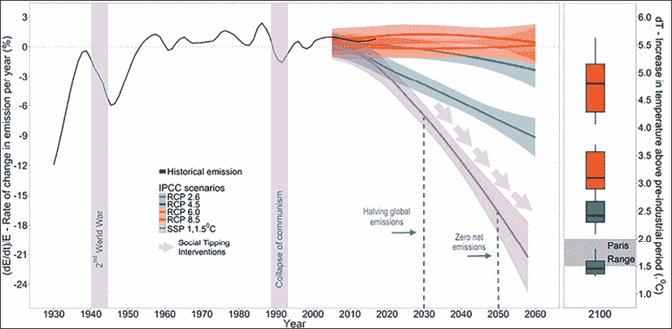
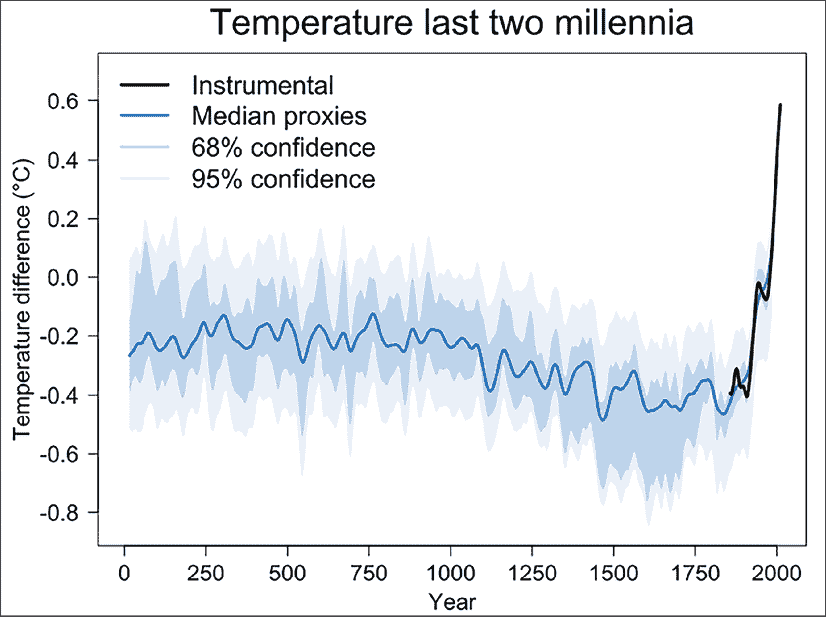
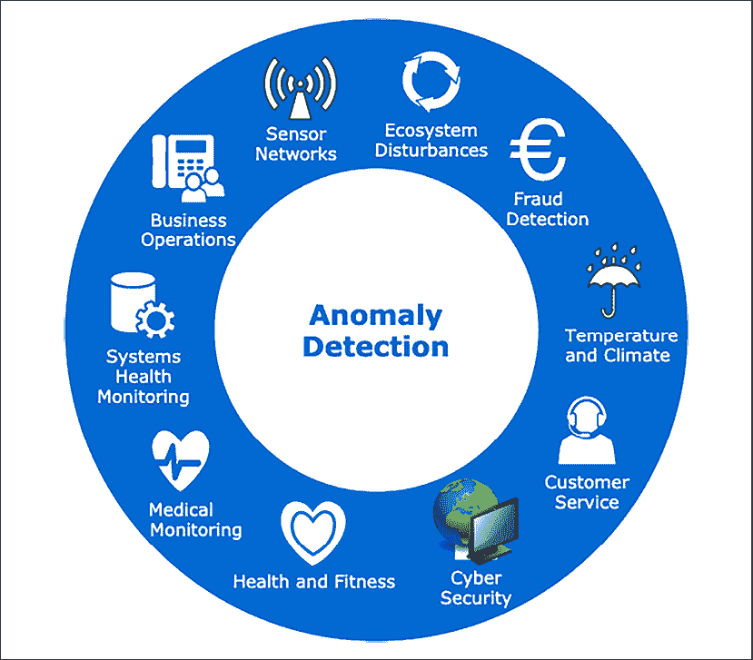
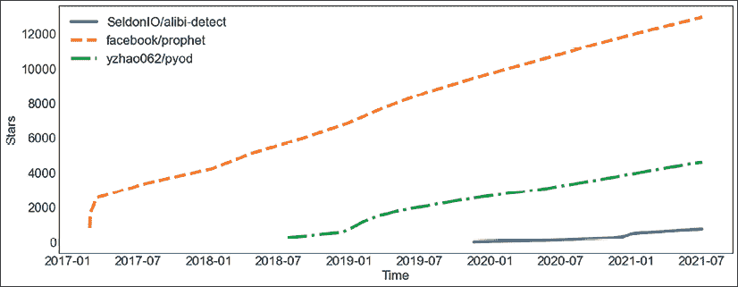
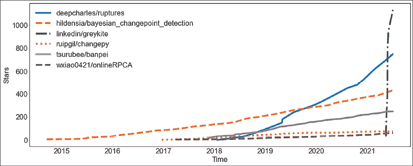
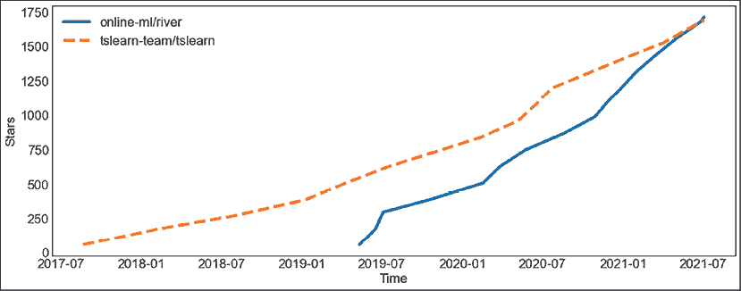
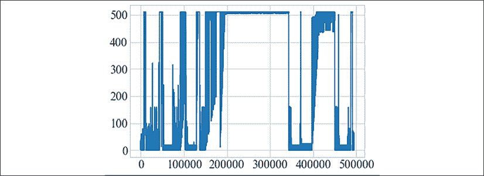
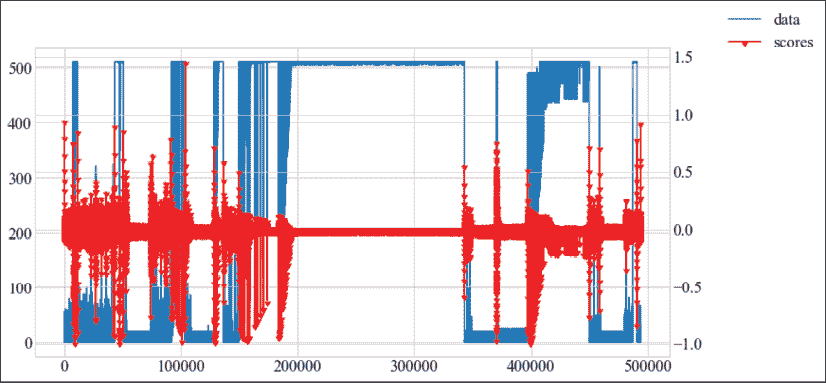
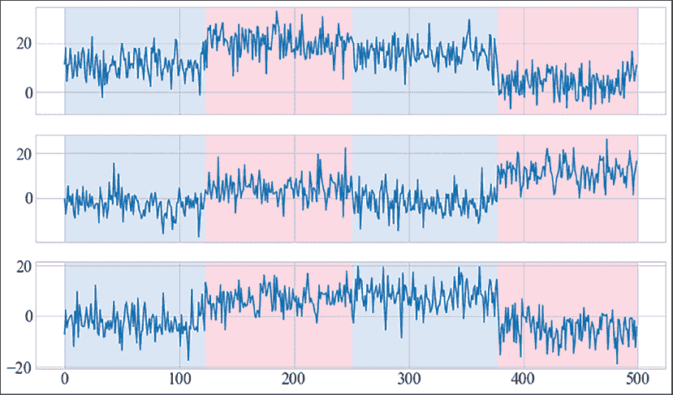
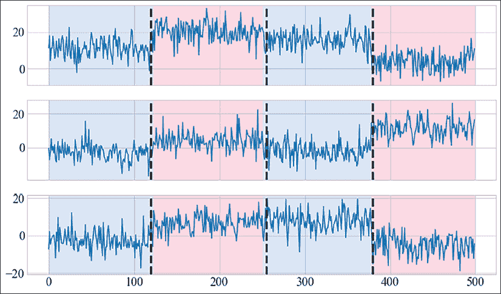

# 六、时间序列的无监督方法

我们已经在前一章讨论了预测，我们将在下一章讨论时间序列的预测。这些预测模型的性能很容易受到数据重大变化的影响。识别这些变化是无监督学习的领域。

在这一章中，我们将描述时间序列数据的无监督学习的具体挑战。无监督学习的核心是从时间序列中提取结构，最重要的是识别子序列之间的相似性。这是异常检测(也称为异常检测)的本质，我们希望识别出与序列中的其他序列明显不同的序列。

时间序列数据通常是非平稳的、非线性的和动态演变的。处理时间序列的一个重要挑战是识别潜在过程的变化。这被称为变化点检测(CPD)或漂移检测。数据会随着时间的推移而变化，了解数据变化的程度至关重要。这是值得深入研究的，因为变化点和异常点的存在是现实应用的常见问题。

在本章中，我们将集中讨论异常检测和 CPD，而在*第 8 章*、*时间序列在线学习*中，我们将更详细地讨论漂移检测。在查看大型科技公司的行业实践之前，我们将从概述和定义开始。

我们将讨论以下主题:

*   时间序列的无监督方法
*   异常检测
*   变化检测
*   使聚集
*   Python 实践

我们将从时间序列的无监督学习的一般介绍开始。

# 时间序列的无监督方法

时间序列和其他类型数据之间的主要差异是对时间轴的依赖；在一个点*t*1 的相关结构可能与在点*t*2 的相同结构具有非常不同的信息。时间序列通常包含大量噪声，并且具有很高的维数。

为了减少噪声和降低维数，可以应用维数减少、小波分析或信号处理技术，例如滤波，例如傅立叶分解。这通常是异常检测或 CPD 的基础，也是我们在本章中讨论的技术。我们将在*第 8 章*、*时间序列的在线方法*中讨论漂移检测。

我们将详细讨论异常和变化点，看一看异常和变化点的样子可能会有所帮助。在 Ilona Otto 等人的文章“*到 2050 年稳定地球气候的社会倾斜动力学*”中，他们分析了基于社会动力学的温室气体排放变化是否以及如何将国家转变为碳中和社会。他们在下面的图表中根据不同的情景预测了全球变暖，转折点(另一种说法是变化点)大约在 2010 年和 21 世纪 20 年代初(图表改编自他们的文章):



图 6.1:基于温室气体排放的可能变化点

全球气温在冰期和暖期之间循环，每个循环大约需要数万年。在过去的几千年里，气候变冷导致了广泛的猜测，直到 20 世纪 70 年代，围绕着可能导致另一个冰河世纪的变冷趋势。然而，数据表明，自工业化开始以来，主要由化石燃料的燃烧驱动，全球气温上升了约整整 1 摄氏度。

因此，工业时期的开始可以被认为是全球气温的一个转折点，如下图所示(来源:维基共享资源):



图 6.2:全球气温的转折点:工业时代的开始

在上面的图中，工业革命开始时的变化点先于现代气温上升的异常。

对于一个人来说，指出变化点或异常是相对容易的，尤其是在有完整的历史数据可用的时候。对于自动检测，有许多不同的方法来寻找显著点。在实际环境中，小心地平衡检测率和误报是很重要的。

# 异常检测

在异常检测中，我们希望识别出明显不同于系列中其他部分的序列。异常或异常值有时可能是测量误差或噪声的结果，但它们可能表明被观察系统中的行为变化或异常行为，这可能需要采取紧急措施。

异常检测的一个重要应用是对潜在复杂的高维数据集进行自动实时监控。

是时候尝试下定义了(在 D.M. Hawkins，1980，“离群值的*识别*”)之后:

**定义**:异常值是一个数据点，它明显偏离其他观察值，可能是由不同的机制产生的。

让我们从一个图开始，这样我们可以看到一个异常是如何图形化的。这也将为我们的讨论提供背景。

异常检测方法可以区分为单变量和多变量方法。参数异常检测方法通过选择它们的分布参数(例如，算术平均值)，对基础分布进行假设——通常是高斯分布。这些方法标记异常值，即偏离模型假设的点。

在最简单的情况下，我们可以将异常值定义为观察值*x*I 相对于分布参数的 z 得分:


z 得分以移动或样本标准偏差为单位，测量每个点与移动平均值或样本平均值的距离。高于平均值的值为正值，低于平均值的值为负值。

在这个公式中，和是时间序列的估计平均值和标准偏差， *x* 是我们想要测试的点。最后，是一个取决于我们感兴趣的置信区间的阈值，通常选择 2 或 1.96，对应于 95%的置信区间。通过这种方式，异常值是指出现率为 5%或更低的点。

z 得分假设数据呈正态分布；然而，上述异常值公式中使用的平均值和标准偏差可以由其他消除这一假设的方法代替。诸如中位数或四分位数范围(如第 2 章、*使用 Python 分析时间序列*中*所讨论的)之类的度量对分布更稳健。*

汉佩尔滤波器(也称为:汉佩尔识别器)是这种情况的特例，其中使用了中值和**中值绝对偏差** ( **MAD** ):


在该等式中，样本均值由(样本)中值代替，标准差由 MAD 代替，MAD 定义为:


反过来，中位数是排序后的数字列表中的中间数字。

在 Hampel 滤波器中，每个观察值 x 将与中值进行比较。在正态分布的情况下，Hampel 滤波器相当于 z 得分，并且可以按照与 z 得分相同的方式选择ε。

在多变量的情况下，异常值函数可以表示为到模型分布中的一个点的距离(或者相反:相似性),例如重心、平均值。例如，我们可以将新观测值的协方差取平均值。

虽然这些以前的方法仅限于低维或单变量时间序列，但基于距离的方法可以处理更大的空间。基于距离的异常检测方法有效地将点聚类成不同的组，其中小组将被标记为异常值。在这些方法中，距离度量的选择至关重要。

检测时序异常的一些挑战是:

*   缺乏离群值的定义
*   输入数据中的噪声
*   时间序列的复杂性
*   高度不平衡

我们通常不知道离群值是什么样的。在实际设置中，我们通常没有离群值的标签——这使得针对真实案例的基准测试变得不可能。至于复杂性，时间序列随时间变化，它们往往是非平稳的，变量之间的依赖关系可以是非线性的。最后，我们通常有比异常值更多的正常观察值。

将异常检测模型部署为大规模服务的一个要求是，它们应该能够实时检测异常。

异常检测的应用包括下图中的应用:



图 6.3:异常检测的应用

一些例子可以是支付欺诈检测、网络安全(网络入侵)、医疗监控或传感器网络。在医疗监控领域，我们希望实时监控心率、脑电图和心电图等生理变量，以便在紧急情况下发出警报。例如，传感器网络中的异常警报有助于防止工业损坏。

该图根据数据集的可用知识说明了异常检测方法的主要类型:


图 6.4:基于可用知识的异常检测方法

异常检测的最早例子包括基于规则的系统。当模式可以被清楚地定义时，这是可行的。当我们有一组带注释的异常时，我们可以应用监督或半监督方法，如分类器或回归模型。然而，最常见的用例是当异常没有被注释时，我们需要无监督的方法来基于密度或分布检测异常点或部分。

看看大型科技公司 Alphabet(谷歌)、亚马逊(Amazon)、脸书(Alibaba)、苹果(Apple)和微软(Microsoft)在异常检测方面的做法很有启发意义。让我们依次检查一下，看看它们是如何处理异常检测的。

## 微软

在论文“*微软的时序异常检测服务*”(Hansheng Ren 等人，2019)中，介绍了一种部署用于微软生产数据异常检测的时序服务。其核心是一个**光谱残差** ( **SR** )和卷积神经网络(CNN)，应用于单变量时间序列的无监督在线异常检测。

他们从视觉中的显著图的概念中借鉴了 SR 方法。显著图突出了图像中的点，这些点对于人类观察者来说是突出的。该算法对数据执行傅立叶变换，然后应用变换信号的对数幅度的 SR，最后利用傅立叶逆变换将频谱数据投影回时间域。

作为扩展，他们使用 SR 方法基于人工数据训练 CNN。他们展示了公开可用数据的基准，支持他们的声明，即他们的方法是异常检测的艺术状态。

他们进一步声称，在微软生产数据上，他们的检测准确性(F1 分数)提高了 20%以上。您可以在 alibi-detect 库中找到基本实现(“*光谱残差*”方法)。

## 谷歌

在谷歌分析([https://support.google.com/analytics/answer/7507748?hl=en](https://support.google.com/analytics/answer/7507748?hl=en))的常见问题中，谷歌提到了一个贝叶斯状态时空序列模型(Steven L. Scott 和 Hal Varian 于 2013 年提出的*用贝叶斯结构时间序列*预测现在)，用于变化点和异常检测。

Google 发布了一个 R 包，具有更具体的时间序列功能——causal impact。一篇描述该一揽子计划背后的研究的论文于 2015 年发表(Kay H. Brodersen，Fabian Gallusser，Jim Koehler，Nicolas Remy，Steven L. Scott 的“使用贝叶斯结构时间序列模型推断因果影响”T17。CausalImpact 基于结构化贝叶斯时间序列模型来估计干预的因果效应。这已经被移植到 Python(pycausalimpact 库)。我们将在*第 9 章*、*时间序列概率模型*中使用贝叶斯结构时间序列(BSTS)进行因果影响分析实验。

## 亚马孙

亚马逊通过其**亚马逊网络服务** ( **AWS** )平台大规模提供机器学习解决方案，将异常检测作为其资源和应用监控解决方案 CloudWatch 的一部分。目前还不清楚他们的解决方案是如何工作的，但经济学家科里·奎因(Corey Quinn)在一条推文中理论称，他们的解决方案是指数平滑。作为其中的一部分，他们很可能将季节分解作为算法的第一步。

他们还有第二项异常检测服务:Amazon Lookout for Metrics。也不清楚这是如何工作的引擎盖下。该服务旨在监控业务指标，根据文档，该服务在亚马逊内部用于大规模监控。在该服务中，用户可以从具有不同细分的数据源中选择字段，例如，通过选择数据库列`page_views`和`device_type`，用户可以分别查找每种设备类型的页面视图的异常变化。

至于亚马逊在异常检测方面的研究，他们在关于声学场景和事件的**检测和分类的研讨会** ( **DCASE** 2020)的挑战中，从 117 份提交材料中获得了前三名。这是一个与时序异常检测相当的挑战。他们凭借“*基于群组屏蔽自编码器的密度估计器用于音频异常检测*”获得了最佳论文奖(Ritwik Giri 等人，2020)。

## 脸谱网

脸书的核心数据科学团队在 GitHub 上开源了他们的时序预测和异常检测实现。他们的图书馆叫做先知。在 2017 年宣布该库的博客文章中，他们表示，Prophet 是脸书大规模预测能力的关键部分，是决策中值得信赖的重要信息。

Sean J Taylor 和 Benjamin Letham (2017)的论文“*大规模预测*”描述了他们在脸书的设置，其中包括一名分析师，可以自动标记预测，以便人工审查和调整。异常检测建立在广义加性模型(GAM)预测的不确定性上。

Prophet 已经在基准测试中与其他概率和非概率模型进行了比较，很少表现出突出的成功。microprediction.com 的 Elo 评级表明，Prophet 在单变量预测方面的表现不如指数移动平均线和许多其他标准方法。

## 推特

Twitter 也发布了一个 R 包，名为异常检测。他们的方法是基于广义极端学生化偏差(ESD)测试，用于检测单变量近似正态分布时间序列中的异常。他们的方法于 2017 年发表(*通过统计学习*“云中自动异常检测”，Jordan Hochenbaum，Owen Vallis，Arun Kejariwal)。

为了适应 ESD 测试，即季节性混合 ESD，他们在对 z 得分应用阈值(如上所述)之前，使用黄土(STL)进行了季节性趋势分解，或者对于具有大量异常的数据集，基于中值和 MAD 进行阈值处理。Twitter 模型已经移植到了 Python(sesd 库)。

## 履行

我们将以结束对 Python 中异常检测的现有实现的概述。许多实现都是可用的。它们的用例非常相似，但是实现和用户基础却大不相同。

以下是根据 GitHub 上的明星数量排序的列表(截至 2021 年 5 月):

| 图书馆 | 履行 | 维护者 | 明星 |
| 先知 | 来自预测的估计趋势分量的不确定性区间 | 脸书核心研究 | 12.7 千 |
| 热电偶 | 多变量时间序列的 30 种检测算法——从经典的 LOF (SIGMOD 2000)到 COPOD (ICDM 2020) | 赵月等人 | 4.5k |
| 不在场证明-检测 | 许多异常检测算法—具体到时间序列，有似然比、Prophet、光谱残差、Seq2Seq、模型提取 | 塞尔登技术有限公司 | 683 |
| sci kit-乐高 | 通过 PCA/UMAP 进行重建 | 文森特·瓦尔默达姆等人 | 499 |
| 光源 | 光源窗口密度模型 | Zillow | 371 |
| 油炸圈饼 | 季节性 KPI 的可变自编码器 | 清华网人实验室 | 327 |
| rrcf | 稳健的随机切割森林算法在流异常检测中的应用 | 密歇根大学实时水系统实验室 | 302 |
| 班培 | 霍特林理论 | 鹤田博文 | 245 |
| 多残株的 | 单变量和多变量时间序列的矩阵分析算法，如 STUMP、FLUSS 和 FLOSS(另请比较 matrixprofile-ts) | TD Ameritrade | 169 |
| 皮萨德 | 十多种用于流异常值异常检测的算法 | 塞利姆·伊尔马斯、塞利姆和苏莱曼·科扎特 | 98 |

图 6.5:Python 中的异常检测方法

这些方法中的每一个都有自己的背景和正式的基础；然而，描述所有这些超出了本章的范围。

此图表显示了前三个存储库的 star 历史(来自 star-history.t9t.io ):



图 6.6:预言家、PyOD 和 alibi-detect 的明星历史

Prophet 和 PyOD 的人气都在持续上升(GitHub stars)。

最近，许多深度学习算法已经应用于单变量和多变量时间序列的异常检测。

深度学习模型特别有趣的是其应用可以更加广泛:闭路电视视频监控中的异常检测。我们将在*第十章*、*时间序列的深度学习*中更详细地讨论深度学习架构。

# 变化点检测

时间序列的一个常见问题是被观察系统行为的变化。一般来说，变化点表示生成序列的过程中状态之间的突然且显著的转变。例如，趋势可能会突然发生变化，而变化点可以指示序列趋势的变化位置。这是众所周知的伪装下的技术图表模式分析的交易。

此列表捕获了**变化点检测** ( **CPD** )的一些应用:

*   语音识别:单词和句子边界的检测
*   图像分析:闭路电视录像监视
*   健身:根据手表或手机等智能设备的运动传感器数据，对人类活动进行分段
*   金融:识别趋势模式的变化，这些变化可能预示着从熊市到牛市的变化，或者相反

以股票市场为例来说明持续专业发展的重要性。描述市场演变的时间序列数据，如股票价格，遵循趋势——它要么上涨，要么下跌，要么没有显著变化(停滞)。

当一只股票上涨时，投资者想买这只股票。否则，当股票下跌时，投资者不想持有股票，而是想卖掉它。不改变头寸将导致账面价值损失——在最好的情况下，这将导致流动性问题。

因此，对于投资者来说，关键是要知道市场何时从上涨转为下跌，或者相反。认识到这些变化可以决定胜败。

在预测中，特殊事件如黑色星期五、圣诞节、选举、新闻发布或监管变化会导致趋势或序列水平的短期(或许被归类为异常)或长期变化。这必然会导致传统模型的奇怪预测。

CPD 算法的一个特别有趣的挑战是实时检测这些拐点。这意味着当一个变化点到达时(或者至少在下一个变化点出现之前)就检测到它。

我们可以区分 CPD 的在线和离线方法，其中在线指的是动态处理，在每个新数据点可用时对其进行处理。另一方面，离线算法可以一次处理整个时间序列。我们将在*第 8 章*、*时间序列在线学习*中更多地讨论在线处理。

CPD 与分割、边缘检测、事件检测和异常检测相关，并且类似的技术可以应用于所有这些应用。CPD 可以被视为非常类似于异常检测，因为识别变化点的一种方式是通过来自异常检测算法的异常分数。

从这个角度来看，变化点等同于高度异常点，任何高于某个阈值的点都对应于变化。与异常检测一样，CPD 可以定义为两个备选项之间的假设检验问题，零假设为“*无变化*”，备选项为“*有变化*”

CPD 算法由三部分组成:成本函数、搜索方法和约束。我们将依次讨论这些内容。成本函数是距离函数，可应用于时间序列的一个分段(多变量或单变量)。

成本函数的一个例子是**最小绝对偏差** ( **LAD** )，它是分布中心点(平均值、中值和众数)偏移的估计值，定义如下:


在这个定义中, *l* 是时间序列 *x* 中一个分段的索引，而是 *x* 的中心点。

然后，搜索函数在时间序列上迭代，以检测变化点。这可以近似地完成，例如在基于窗口的检测、自底向上的方法或二进制分割中，或者它可以是穷举的，例如在动态编程或**修剪精确线性时间** ( **毛皮**)的情况下。

佩尔特(Gachomo Dorcas Wambui 等人，2015 年)依赖于剪枝试探法，其计算成本与时间序列的点数成线性关系。动态规划方法的计算成本要高得多，其中 n 是预期变化点的最大数量。

最后，约束可以作为搜索算法中的惩罚。这个惩罚项可以编码成本预算或我们期望找到的变更点数量的知识。

众所周知，由于缺乏基准数据集，很难评估 CPD 算法的性能。最近(2020 年)，艾伦图灵研究所和爱丁堡大学的 Gerrit van den Burg 和 Christopher Williams 公布了一项基准，其中包括来自世界银行、欧盟统计局、美国人口普查局、GapMinder 和维基百科等来源的 37 个时间序列。他们的基准可以在 GitHub 上找到，他们提到了围绕 2007-08 年金融危机的数据集的变化点注释，英国关于安全带的立法，管制含氯氟烃排放的蒙特利尔议定书，或美国对自动电话呼叫的监管。

在同一篇论文(“*对变化点检测算法的评估*”)中，作者评估了用于 CPD 的一系列方法。他们指出，根据 F1-measure 和基于 Jaccard 指数的聚类重叠度量，他们的“零”基线方法(假设没有任何变化点)优于许多其他方法。这是因为数据集中变化点的比例很小，而方法返回的误报数量很大。他们得出结论，二元分割和贝叶斯在线 CPD 是时间序列中最好的方法。

二进制分割(Ashish Sen 和 Muni S. Srivastava，1975 年的“关于检测均值变化的测试的 T3”)属于基于窗口的 CPD 的范畴。二进制分割是一种贪婪算法，它最大程度地最小化成本总和，定义如下:


是找到的变化点，而 *c()* 是一个类似于 LAD 的成本函数，我们在本节前面已经看到。一般的想法是，当两个子序列非常不相似时，这表明一个变化点。

二元分割是连续的，即首先在完整的时间序列上检测变化点，然后再在变化点前后的两个子序列上检测变化点。这解释了它的低复杂度，其中 T 是时间序列的长度。这种计算成本使得它可以扩展到更大的数据集。

下表概述了持续专业发展的方法:

| 图书馆 | 履行 | 维护者 |
| 灰风筝 | 通过自适应套索的 CPD | 商务化人际关系网 |
| 断裂 | 离线 CPD:二进制分割，动态规划，毛皮，基于窗口 | 查尔斯·张 |
| 贝叶斯变点检测 | 贝叶斯 CPD | 约翰内斯·库利克 |
| 班培 | 奇异谱变换 | 鹤田博文 |
| 变化无常 | 佩尔特算法 | 鲁伊·吉尔 |
| onlineRPCA | 在线移动窗口稳健主成分分析 | 肖伟 |

图 6.7:Python 中的 CPD 方法

我们省略了脸书的先知库，因为它不是一个专用的 CPD 包。

下面的图表说明了 CPD 方法随着时间的推移而流行的情况。



图 6.8:CPD 方法的发展史

LinkedIn 的 Greykite 自发布以来，在 GitHub 上的人气直线上升。《破裂》也见证了人气的大幅增长。

# 使聚集

聚类分析或聚类是根据相似性在数据集中寻找点或对象的有意义的组(簇)的过程。作为这种无监督数据挖掘技术的结果，我们希望每个聚类中的点彼此相似，而与其他聚类中的点不同。

时间序列的聚类具有挑战性，因为每个数据点都是一段时间(有序序列)。它已经在不同的领域得到应用，以发现能够分析时间序列的模式，从复杂的数据集中提取洞察力。

我们不打算详细讨论时间序列聚类，但是下表给出了用于时间序列聚类的 Python 库的概述:

| 图书馆 | 履行 | 维护者 | 明星 |
| tslearn | 时间序列 K 均值，K 形聚类，核均值 | 罗曼·塔维纳德 | 1.7k |
| 河 | DBStream，时间序列 K 均值，CluStream，DenStream，Stream 均值 | 艾伯特·比费特和其他人 | 1.7k |

图 6.9:Python 中时间序列的聚类方法

你可以在这里看到历史上顶级实现的 GitHub 星级:



图 6.10:ts learn 和 river 的恒星历史

两个图书馆都很强劲。我们将在*第 8 章*、*中重温 river 对于时序*的在线学习。

# Python 实践

让我们先做一个异常检测的例子，然后再做一个 CPD 的例子。让我们在下一节首先看看需要的库。

## 要求

在本章中，我们将使用几个库，我们可以从终端(或者类似地从 anaconda navigator)快速安装这些库:

```
pip install ruptures alibi_detect 
```

我们将从 Python(或 IPython)终端执行命令，但同样我们也可以从 Jupyter 笔记本(或不同的环境)执行它们。

我们现在应该准备好进入用 Python 实现无监督时序算法的森林了。

## 异常检测

alibi-detect 带有几个用于时序异常检测的基准数据集:

*   fetch _ ecg—来自 BIDMC 充血性心力衰竭数据库的 ECG 数据集
*   fetch_nab—Numenta 异常基准
*   fetch_kdd—KDD 杯 99 计算机网络入侵数据集

最后一个是通过 scikit-learn 加载的。

让我们加载计算机网络入侵的时间序列(KDD99):

```
from alibi_detect.datasets import fetch_kdd

intrusions = fetch_kdd() 
```

`intrusions`是字典，其中`data`键返回 494021x18 的矩阵。时间序列的 18 个维度是数据集的连续特征，主要是错误率和计数:

```
intrusions['feature_names']

['srv_count',

 'serror_rate',

 'srv_serror_rate',

 'rerror_rate',

 'srv_rerror_rate',

 'same_srv_rate',

 'diff_srv_rate',

 'srv_diff_host_rate',

 'dst_host_count',

 'dst_host_srv_count',

 'dst_host_same_srv_rate',

 'dst_host_diff_srv_rate',

 'dst_host_same_src_port_rate',

 'dst_host_srv_diff_host_rate',

 'dst_host_serror_rate',

 'dst_host_srv_serror_rate',

 'dst_host_rerror_rate',

 'dst_host_srv_rerror_rate'] 
```

`target`另一个重点，包含了对异常现象的注释。

因为我们已经准备好了注释，我们可以训练一个分类器，但是，我们将坚持使用无监督的方法。此外，由于我们将使用的谱方法是针对单变量数据的，并且我们将只从多变量数据集中提取一个维度，因此我们将完全忽略注释。

这是我们的时间序列的快速图(我们将任意选择数据集的第维):

```
import pandas as pd

pd.Series(intrusions['data'][:, 0]).plot() 
```

情节是这样的:



图 6.11:时间序列图表

我们将加载并运行 SpectralResidual 模型，该模型实现了微软提出的方法:

```
from alibi_detect.od import SpectralResidual

od = SpectralResidual(

    threshold=1.,

    window_amp=20,

    window_local=20,

    n_est_points=10,

    n_grad_points=5

) 
```

然后我们可以得到我们时间序列中每个点的异常分数:

```
scores = od.score(intrusions['data'][:, 0]) 
```

让我们在时间序列的顶部绘制分数！

```
import matplotlib

ax = pd.Series(intrusions['data'][:, 0], name='data').plot(legend=False, figsize=(12, 6))

ax2 = ax.twinx()

ax = pd.Series(scores, name='scores').plot(ax=ax2, legend=False, color="r", marker=matplotlib.markers.CARETDOWNBASE)

ax.figure.legend(bbox_to_anchor=(1, 1), loc='upper left'); 
```

我们使用双 y 轴在同一个图中绘制分数和数据。这是:



图 6.12:异常的时间序列

一些点没有被识别为异常值，因为信号的周期性特性被傅立叶滤波器去除了。

## 变化点检测

我们将首先用破裂库创建一个合成的多变量时间序列。我们将维度的数量设置为 3，时间序列的长度设置为 500，我们的时间序列将有 3 个变化点，并将叠加标准差为 5.0 的高斯噪声:

```
import numpy as np

import matplotlib.pylab as plt

import ruptures as rpt

signal, bkps = rpt.pw_constant(

  n_samples=500, n_features=3, n_bkps=3,

  noise_std=5.0, delta=(1, 20)

) 
```

信号是一个 500x3 的 NumPy 数组。`bkps`是变化点的数组(123、251 和 378)。

我们可以用一个效用函数来绘制这个时间序列，该效用函数突出显示由变点分隔的子部分:

```
 rpt.display(signal, bkps) 
```

这是我们的时间序列图，有三个变化点:



图 6.13:具有变化点的时间序列

我们可以对这个时间序列应用二元分割。破裂遵循 scikit-learn 约定，因此如果您以前使用过 scikit-learn，用法应该非常直观:

```
 algo = rpt.Binseg(model="l1").fit(signal)

my_bkps = algo.predict(n_bkps=3) 
```

对于二进制分段约束，我们有几个选项–我们可以在`l1`、`l2`、`rbf`、`linear`、`normal`和`ar`之间选择。

我们可以用另一个效用函数来绘制二元分割的预测:

```
 rpt.show.display(signal, bkps, my_bkps, figsize=(10, 6)) 
```

这是二元分割模型中我们的变化点预测图:



图 6.14:检测到变化点的时间序列(二元分割)

让我们总结一下本章的一些信息吧！

# 摘要

在这一章中，我们集中讨论了时间序列的非监督方法的两个方面:

*   异常检测
*   变化点检测

异常检测(也称为异常值检测)的本质是识别与序列中的其余部分明显不同的序列。我们调查了不同的异常检测方法，以及几家大公司如何大规模处理它。

处理时间序列时，重要的是要意识到数据随时间的变化会使模型变得无用(模型过时)。这被称为变化点检测和漂移检测。

在本章中，我们已经讨论了变化点检测。在*第 8 章*、*时间序列在线学习*中，我们将更详细地了解漂移检测。