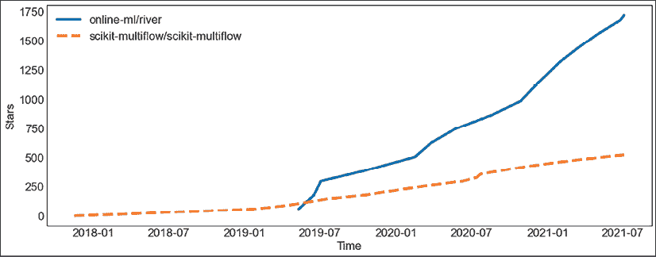
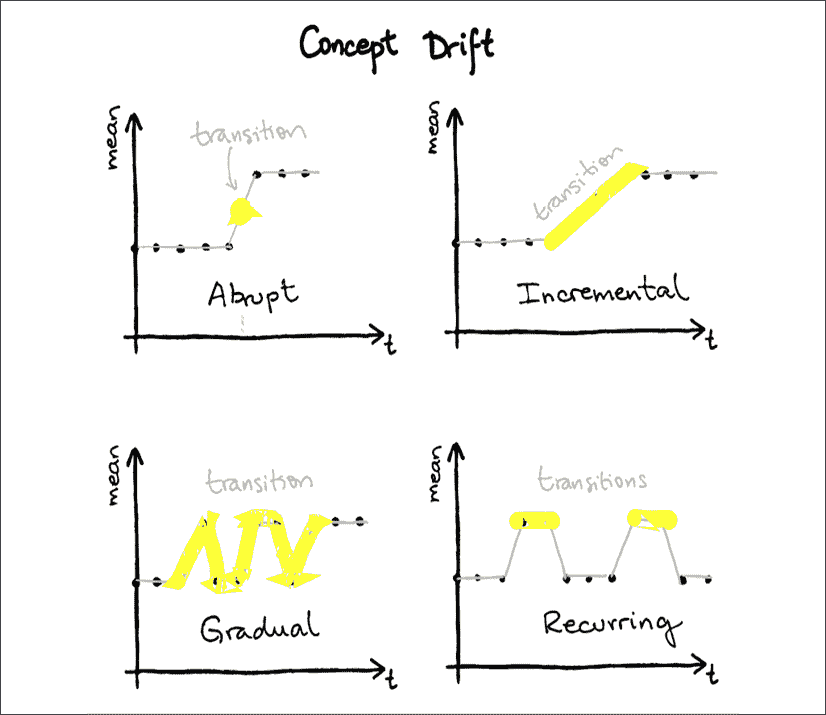
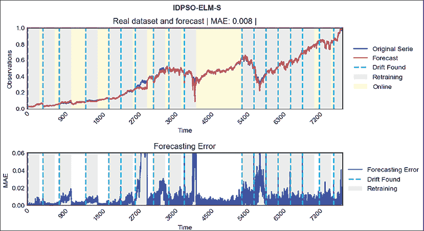
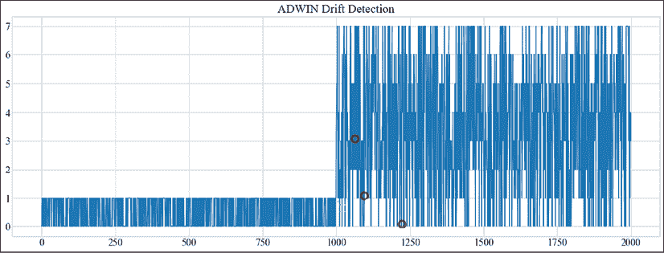
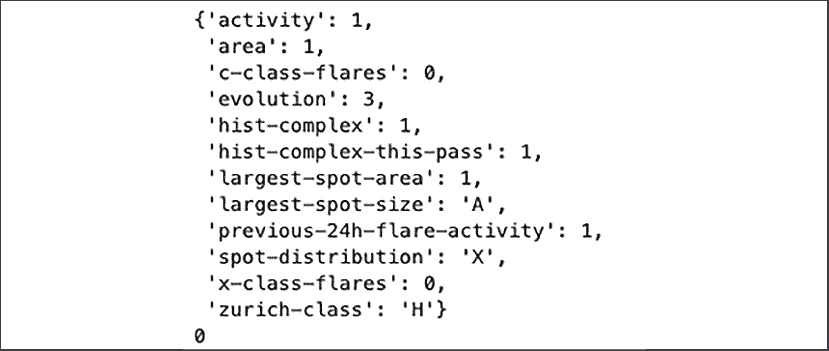
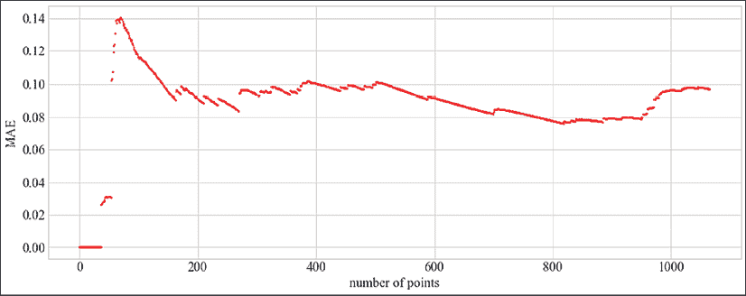
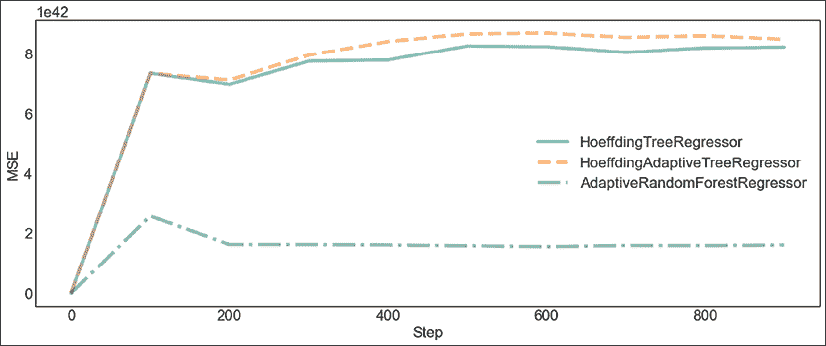
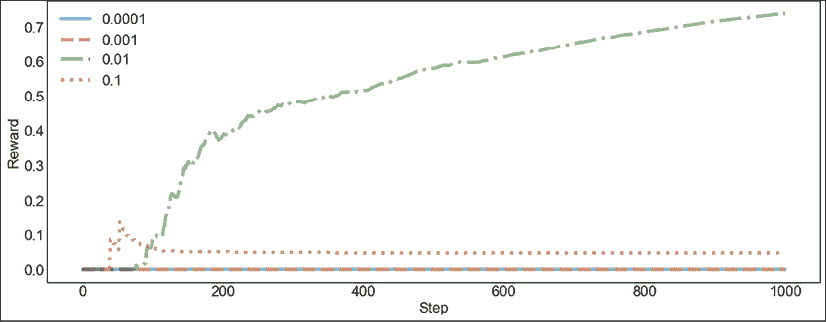
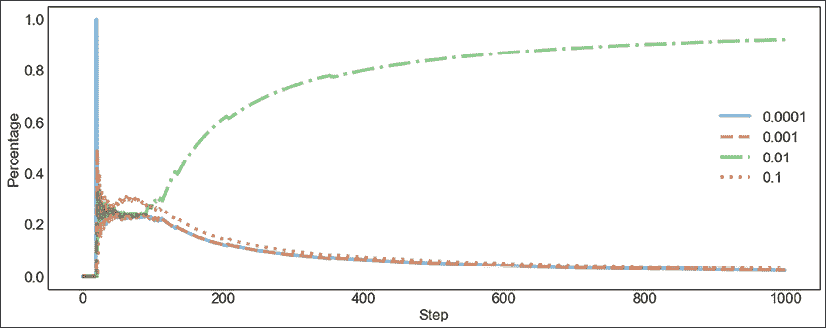

# 八、时间序列的在线学习

在这一章中，我们将深入到时间序列的在线学习和数据流。在线学习意味着随着新数据的到来，我们不断更新我们的模型。在线学习算法的优势在于，它们可以处理高速且可能是大规模的流数据，并且能够适应数据的新分布。

我们将讨论漂移，这很重要，因为机器学习模型的性能会受到数据集变化的强烈影响，以至于模型会变得过时(陈旧)。

我们将讨论什么是在线学习，数据如何变化(漂移)，以及自适应学习算法如何结合漂移检测方法来适应这种变化，以避免性能下降或代价高昂的重新训练。

我们将讨论以下主题:

*   时间序列的在线学习
    *   在线算法
*   漂流
    *   漂移检测方法
*   适应性学习方法
*   Python 实践

我们将从讨论在线学习开始。

# 时间序列的在线学习

学习有两种主要场景——在线学习和离线学习。**在线学习**意味着随着数据的流入(流数据)，你正在逐步拟合你的模型。另一方面，**离线学习**，也就是更常见的方法，意味着你有一个从一开始就知道的静态数据集，你的机器学习算法的参数一次性调整到整个数据集(往往是将整个数据集加载到内存中或者批量加载)。

在线学习有三个主要的使用案例:

*   大数据
*   时间约束(例如，实时)
*   动态环境

通常，在在线学习环境中，你有更多的数据，并且它适合大数据。在线学习可以应用于大型数据集，其中在整个数据集上进行训练在计算上是不可行的。

在线学习的另一个用例是在时间限制下执行推理和拟合(例如，实时应用)，与离线算法相比，许多在线算法非常节省资源。

在线学习的一个常见应用是时间序列数据，一个特殊的挑战是时间序列观察值的基本生成过程会随着时间的推移而变化。这叫概念漂移。在离线设置中，参数是固定的，而在在线学习中，参数根据新数据不断调整。所以在线学习算法可以处理数据的变化，有的可以处理概念漂移。

下表总结了在线学习和离线学习之间的更多差异:

|  | 脱机的 | 在线的 |
| 监控的必要性 | 是的，模型会变得陈旧(模型会失去性能) | 适应不断变化的数据 |
| 再训练费用 | 昂贵(从零开始) | 便宜(增量) |
| 内存要求 | 可能的高内存需求 | 低的 |
| 应用 | 图像分类器、语音识别等，其中假设数据是静态的 | 金融、电子商务、经济和医疗保健，这些领域的数据都在动态变化 |
| 工具 | tslearn，sktime，prophet | sci kit-多流，河流 |

图 8.1:时间序列中的在线和离线学习方法

还有许多其他工具不是专门针对在线学习的，但支持在线学习，例如最受欢迎的深度学习库——py torch 和 TensorFlow，其中模型固有地支持在线学习，数据加载器支持流场景——通过迭代器，可以根据需要加载数据。

监督机器学习问题的流公式可以被提出如下:

1.  在时间 *t* 接收数据点
2.  在线算法预测标签
3.  在下一个数据点出现之前，真正的标签就显现出来了

在批量设置中，一组 *n* 点在时间 *t* 同时到达，在真实标签被揭示和下一批点到达之前，所有 *n* 点将被在线模型预测。

我们可以演示 Python 代码片段中的差异，以显示在线和离线设置中机器学习的特征模式。你应该熟悉离线学习，它看起来像这样的特征`X`，目标向量`y`，和模型参数`params`:

```py
from sklearn import linear_model

offline_model = linear_model.LogisticRegression(params)

offline_model.fit(X, Y) 
```

这应该从前面的章节中熟悉，例如*第 7 章*、*时间序列的机器学习模型*。为了简单起见，我们省略了数据加载、预处理、交叉验证和参数调整等问题。

在线学习遵循以下模式:

```py
from river import linear_model

online_model = linear_model.LogisticRegression(params)

for xi, yi in zip(X, y):

    online_model.learn_one(xi, yi) 
```

在这里，我们逐点向模型提供信息。同样，这是简化的——我省略了设置参数、加载数据集等等。

这些片段应该清楚地表明了主要的区别:一次学习整个数据集(离线)与一点一点学习(在线)。

我应该提到在线方法的评估方法:

*   坚持
*   前序的

在**保持**中，我们可以将当前模型应用于独立测试集。这在批处理以及在线(流)学习中很流行，并且给出了一个无偏的性能估计。

在**顺序评估**中，我们在执行顺序时进行测试。每一个新的数据点首先经过测试，然后进行训练。

在线学习的一个有趣的方面是模型选择，即如何在一组候选模型中选择最佳模型。我们在*第 4 章*、*时序机器学习模型*中看到了时序模型的模型选择。在线设置中有不同的型号选择选项。

在**多臂土匪**(也叫 **K 臂土匪**)问题中，有限的资源必须以最大化期望增益的方式在竞争的选择之间分配。每一个选择(“手臂”)都会带来回报，这可以通过时间来学习。随着时间的推移，我们可以调整对每一种武器的偏好，并根据预期回报做出最佳选择。类似地，通过学习竞争分类或回归模型的预期回报，可以将用于多武装匪徒的方法应用于模型选择。在实践部分，我们将讨论多臂土匪的模型选择。

在接下来的部分中，我们将更详细地研究增量方法和漂移。

## 在线算法

当数据随着时间的推移逐渐变得可用或其大小超过系统内存限制时，无论是监督学习还是非监督学习，增量机器学习算法都可以更新部分数据的参数，而不是从头开始学习。**增量学习**是指不断调整参数，使模型适应新的输入数据。

一些机器学习方法天生支持增量学习。神经网络(如深度学习)、最近邻和进化方法(如遗传算法)是增量的，因此可以应用于在线学习环境，在那里它们会不断更新。

增量算法可以随机访问以前的样本或原型(选定的样本)。这些算法，比如基于最近邻算法的，叫做部分记忆增量算法。它们的变体可以适用于循环漂移情况。

许多著名的机器学习算法都有增量变体，如自适应随机森林、自适应 XGBoost 分类器或增量支持向量机。

强化学习和主动学习都可以被视为在线学习的类型，因为它们以在线或主动的方式工作。我们将在*第 11 章*、*时间序列的强化学习*中讨论强化学习。

在在线学习中，更新是不断计算的。这一过程的核心是运行统计数据，因此可以说明如何递增地计算均值和方差(在在线设置中)。

我们来看看在线算术平均值和在线方差的公式。对于**在线均值**，更新时间点 *t* 的均值可以如下进行:


其中是之前更新的次数——有时写为。

**在线方差** 可以根据在线均值和运行平方和计算:


离线算法的一个缺点是它们有时更难实现，并且需要一个学习曲线来跟上库、算法和方法的速度。

scikit-learn，Python 中机器学习的标准库，只有有限数量的增量算法。它专注于批量学习模型。相比之下，有专门的在线学习库，具有覆盖许多用例的自适应和增量算法，如不平衡数据集。

来自怀卡托大学(新西兰)、巴黎电信公司和巴黎理工学院的研究工程师、学生和机器学习研究人员一直在致力于**河流图书馆**。River 是两个库合并的结果:Creme(意为 incremental 的双关语)和 Scikit-Multiflow。River 提供了许多元方法和集合方法。最重要的是，许多元方法或集成方法可以使用 scikit-learn 模型作为基础模型。

在撰写本文时，河流库拥有 1700 颗恒星，并实现了许多非监督和监督算法。在写作的时候，River 的文档仍然是一个正在进行的工作，但是很多功能是可用的，正如我们将在本章最后的实用部分看到的。

该图表显示了 River 和 Scikit-Multiflow 随时间的流行程度(根据 GitHub 上的明星数量):



图 8.2:河流和 Scikit-Multiflow 库的恒星历史

我们可以看到，尽管 Scikit-Multiflow 稳步上升，但这种上升基本上是平稳的。River 在 2019 年超过了 Scikit-Multiflow，并继续获得 GitHub 用户的许多星级评分。这些明星的评分类似于社交媒体平台上的一个“赞”。

下表显示了一些在线算法，其中一些适用于漂移情况:

| 算法 | 描述 |
| **极速决策树** ( **VFDT** ) | 由基于几个例子的分裂组成的决策树。也叫赫夫丁树。与漂移作斗争。 |
| **极速决策树** ( **EFDT** ) | 当有把握时，通过创建一个分割来递增地构建树，并且如果有更好的分割可用，则替换该分割。假设为平稳分布。 |
| 学习++吧。国家证券交易所（ National Stock Exchange 的缩写） | 非平稳环境下增量学习的分类器集成。 |

图 8.3:在线机器学习算法——其中一些适合漂移

最优秀的在线算法是**赫夫丁树**(杰夫·胡尔顿、劳里·斯潘塞和佩德罗·多明戈斯，2001)，也叫做非常快速决策树 ( **VFDT** )。这是最广泛使用的在线决策树归纳算法之一。

虽然一些在线学习算法相当有效，但所获得的性能可能对数据点的排序高度敏感，并且潜在地，在早期示例的驱动下，它们可能永远无法摆脱它们最终所处的局部最小值。吸引人的是，VFDTs 提供了很高的分类精度，并在理论上保证它们会随着时间的推移向决策树的性能靠拢。事实上，VFDT 和传统训练的树在它们的树分裂上不同的概率随着例子的数量而指数下降。

由瓦西里·赫夫丁在 1963 年提出的**赫夫丁界限**指出，在概率下，随机变量 *Z* 的计算均值，在 *n* 个样本上计算，与真实均值的偏差小于:


在这个方程中， *R* 是随机变量 *Z* 的范围。这个界限与产生观测值的概率分布无关。

随着数据的输入，新的分支不断增加，过时的分支从 Hoeffding 树中删除。然而，有问题的是，在概念漂移下，一些节点可能不再满足 Hoefdding 边界。

在下一节中，我们将讨论漂移，为什么要关注漂移，以及如何应对漂移。

# 漂流

数据质量的一个主要决定因素是漂移。**漂移**(也就是:**数据集漂移**)意味着数据中的模式随着时间而改变。漂移很重要，因为数据集的变化会对机器学习模型的性能产生不利影响。

漂移过渡可以突然发生、递增发生、逐渐发生或重复发生。这里举例说明了这一点:



图 8.4:四种类型的概念漂移转换

当转变是突然的，它从一个时间步到另一个时间步发生，没有明显的准备或警告。相比之下，它也可以是递增的，首先是一点点的变化，然后是更大的变化，然后又是更大的变化。

当过渡逐渐发生时，它看起来像是不同力量之间的来回，直到建立新的基线。另一种类型的转换是周期性的，即在不同的基线之间有规律的或周期性的转换。

有不同种类的漂移:

*   协变量漂移
*   先验概率漂移
*   概念漂移

**协变量漂移**描述了自变量(特征)的变化。一个例子可能是监管干预，新的法律将动摇市场格局，消费者行为将遵循与以前不同的行为。一个例子是，如果我们想预测给定吸烟行为的 10 年内的慢性疾病，吸烟突然变得不那么流行了，因为新的法律。这意味着我们的预测可能不太可靠。

**概率漂移**是目标变量的变化。例如，在欺诈检测中，欺诈发生率会发生变化；在零售业，商品的平均价值增加了。漂移的一个原因可能是季节性——例如，在冬天卖出更多的外套。

在**概念漂移**中，自变量和目标变量之间的关系发生变化。术语所指的概念是自变量和因变量之间的关系。例如，如果我们想预测吸烟的数量，我们可以假设我们的模型在引入新的法律后将变得无用。请注意，术语“概念漂移”通常在更广泛的意义上被应用于任何不稳定的事物。

**协变漂移**:特征的变化 *P(x)* 。

**标签漂移(**或**先验概率漂移)**:目标变量 *P(y)* 的一个变化。

**概念漂移**:(在监督机器学习中)目标的条件分布发生变化——换句话说，自变量和因变量之间的关系发生变化 *P(y|X)* 。

通常，当构建机器学习模型时，我们假设数据集不同部分内的点属于同一分布。

虽然偶尔出现的异常(如异常事件)通常会被视为噪音并被忽略，但当分布发生变化时，通常必须根据新的样本从头开始重建模型，以捕捉最新的特征。这就是我们测试带有前推验证的时间序列模型的原因，正如在*第 7 章*、*时间序列的机器学习模型*中所讨论的。然而，这种从头开始的训练可能非常耗时，并且会占用大量计算资源。

漂移会给机器学习模型带来问题，因为模型会变得陈旧——随着时间的推移，它们会变得不可靠，因为它们捕获的关系不再有效。这导致这些模型的性能下降。因此，预测、分类、回归或异常检测的方法应该能够及时检测概念漂移并对其做出反应，以便能够尽快更新模型。机器学习模型通常会定期重新训练，以避免性能下降。或者，基于模型的性能监控或者基于变化检测方法，可以在需要时触发再训练。

至于时间序列的应用，在许多领域，如金融、电子商务、经济和医疗保健，时间序列的统计属性可能会改变，导致预测模型无用。令人困惑的是，尽管漂移问题的概念在文献中得到了很好的研究，但很少有人用时间序列方法来解决它。

Gustavo Oliveira 等人在 2017 年提出(“*存在概念漂移的时间序列预测:一种基于粒子群算法的方法*”)训练几个时间序列预测模型。在每个时间点，这些模型中的每个模型的参数根据最新的性能(粒子群优化)进行加权改变。当最佳模型(最佳粒子)偏离超过某个置信区间时，触发模型的再训练。

下面的图表说明了错误触发的再训练和在线学习的结合，这是一种时间序列预测的方法:



图 8.5:时间序列预测的在线学习和再训练

您可以看到，随着概念漂移的发生，错误率周期性地增加，并且根据漂移检测的概念，触发了重新训练。

许多在线模型已经被特别调整以适应或处理概念漂移。在这一部分，我们将讨论一些最受欢迎或表现最好的。我们还将讨论漂移检测的方法。

## 漂移检测方法

有许多不同的方法来明确检测数据流中的漂移和分布变化。佩奇-欣克利(Page，1954)和几何移动平均线(Roberts，2000)就是其中的两位先驱。

漂移检测器通常通过性能指标来监控模型的性能，然而，它们也可以基于输入特征，尽管这是一个例外。基本思想是，当样本的类别分布发生变化时，模型不再对应于当前分布，并且性能下降(错误率增加)。因此，模型性能的质量控制可以作为漂移检测。

漂移检测方法至少可分为三类(joo Gama 等人，2014 年之后):

*   统计过程控制
*   顺序分析
*   基于 Windows 的比较

统计过程控制方法考虑汇总统计数据，如模型预测的平均值和标准偏差。比如**漂移检测法**(**DDM**)；joo Gama 等人，2004 年)如果误差率超过先前记录的最小误差率三个标准差，就会发出警报。根据统计学习理论，在连续训练的模型中，误差应该随着样本数量的增加而减小，因此只有在漂移的情况下才应该超过这个阈值。

顺序方法基于模型预测的阈值。例如，在**线性四费率**(王，2015)方法中，列联表中的费率是增量更新的。显著性是根据在开始时通过蒙特卡洛采样估计一次的阈值计算的。这种方法可以比 DDM 更好地处理类不平衡。

**列联表**:比较变量频率分布的表。具体来说，在机器学习分类中，该表显示了相对于实际标签的测试集上标签的预测数量。在二元分类的情况下，单元格显示真阳性、假阳性、假阴性和真阴性。

基于窗口的方法监控错误的分布。例如， **ADWIN** ( **自适应窗口化**)由 Albert Bifet 和 Ricard Gavaldà于 2007 年发表。时间窗口 *W* 内的预测误差被划分成更小的窗口，并且这些窗口内的平均误差率的差异与 Hoeffding 界限相比较。最初的版本提出了这种策略的一种变型，其时间复杂度为 *O(log W)* ，其中 *W* 是窗口的长度。

下面列出了一些漂移检测方法:

| 算法 | 描述 | 类型 |
| **自适应开窗** ( **ADWIN** ) | 基于阈值的自适应滑动窗口算法。 | 基于窗口 |
| **漂移检测方法** ( **DDM** ) | 基于模型的错误率应该随着时间的推移而降低的前提。 | 统计的 |
| **早期漂移检测方法** ( **EDDM** ) | 统计两个误差之间的平均距离。类似于 DDM，但更适合逐渐漂移。 | 统计的 |
| **霍夫丁漂移检测** ( **HDDM** ) | 基于 Hoeffding 界限的非参数方法——移动平均检验或移动加权平均检验。 | 基于窗口 |
| **Kolmogorov-Smirnov 开窗** ( **KSWIN** ) | 时间序列窗口中的 Kolmogorov-Smirnov 检验。 | 基于窗口 |
| 佩奇-欣克利 | 高斯信号均值变化的统计检验。 | 连续的 |

图 8.6:漂移检测算法

Kolmogorov-Smirnov 是连续一维概率分布相等的非参数检验。

这些方法可以在回归和分类(以及，通过扩展，预测)的上下文中使用。它们可用于触发模型的再训练。例如，如果检测到漂移，Hassan Mehmood 等人(2021)重新训练时间序列预测模型(在其他模型中，他们使用了脸书的先知)。

漂移探测器都有关于输入数据的假设。了解这些假设很重要，我已尝试在表格中列出这些假设，因此您可以对数据集使用正确的检测器。

上面列出的漂移检测方法都会产生标记成本。因为它们都监视基本分类器或集成的预测结果，所以它们要求分类标签在预测之后立即可用。这种约束在一些实际问题中是不现实的。这里没有列出的其他方法可以基于异常检测(或新奇检测)、特征分布监控或依赖于模型的监控。我们在第六章、*中看到了一些这样的方法，时间序列的无监督方法*。

在下一节中，我们将了解一些旨在抵抗漂移的方法。

# 适应性学习方法

**自适应学习**是指带有漂移调整的增量方法。这个概念指的是在线更新预测模型，以对概念漂移做出反应。目标是通过考虑漂移，模型可以确保与当前数据分布的一致性。

集合方法可以与漂移检测器结合来触发基本模型的再训练。他们可以监控基本模型的性能(通常使用 ADWIN)——如果新模型更准确，表现不佳的模型将被重新训练的模型所取代。

例如，**自适应 XGBoost** 算法(**AXGB**；Jacob Montiel 等人，2020)是对 XGBoost 的改编，用于进化数据流，其中随着新数据变得可用，从小批量数据创建新子树。最大集合大小是固定的，一旦达到该大小，集合就根据新数据进行更新。

在 Scikit-Multiflow 和 River 库中，有几种方法将机器学习方法与漂移检测方法相结合，从而调节适应性。其中许多是由两个库的维护者发布的。以下是这些方法中的一些:

| 算法 | 描述 |
| **带有 ADWIN 变化检测器的 K-最近邻** ( **KNN** )分类器 | KNN 用 ADWIN 变化检测器来决定保留或遗忘哪些样本。 |
| 适应性随机森林 | 每个采油树包括漂移探测器。它在检测到警告后开始在后台训练，如果发生漂移，则替换旧树。 |
| 加法专家集成分类器 | 实现修剪策略-最老或最弱的基础模型将被删除。 |
| **赫夫丁适应树** ( **帽子**) | 配对 ADWIN 来检测漂移，配对 Hoeffding 树模型来学习。 |
| 非常快速的决策规则 | 类似于 VFDT，但规则集合而不是一棵树。在 Scikit 中，支持利用 ADWIN、DDM 和 EDDM 进行多流漂移检测。 |
| Oza Bagging ADWIN | 不同于替换取样，每个样品都有一个重量。在 River 中，这可以与 ADWIN 变化检测器结合使用。 |
| 在线 CSB2 | 在线升压算法，在 AdaBoost 和 AdaC2 之间折衷，并可选择使用变化检测器。 |
| 在线提升 | 带 ADWIN 漂移检测的 AdaBoost。 |

图 8.7:自适应学习算法

这些方法通过用漂移检测的概念来调节自适应或学习，对漂移是鲁棒的。

让我们试试这些方法吧！

# Python 实践

本章中的安装非常简单，因为在本章中，我们将只使用 River。我们可以从终端(或者类似地从 Anaconda Navigator)快速安装:

```py
pip install river 
```

我们将从 Python(或 IPython)终端执行命令，但同样，我们也可以从 Jupyter 笔记本(或不同的环境)执行它们。

## 漂移检测

让我们从尝试用人工时间序列进行漂移检测开始。这遵循了河流库测试中的例子。

我们将首先创建一个可以测试的人工时间序列:

```py
import numpy as np

np.random.seed(12345)

data_stream = np.concatenate(

    (np.random.randint(2, size=1000), np.random.randint(8, size=1000))

) 
```

这个时间序列由两个具有不同特征的序列组成。让我们看看漂移检测算法能多快发现这一点。

对此运行漂移检测器意味着迭代该数据集并将值输入漂移检测器。我们将为此创建一个函数:

```py
def perform_test(drift_detector, data_stream):

    detected_indices = []

    for i, val in enumerate(data_stream):

        in_drift, in_warning = drift_detector.update(val)

        if in_drift:

            detected_indices.append(i)

    return detected_indices 
```

现在我们可以在这个时间序列上尝试 ADWIN 漂移检测方法。让我们创建另一种方法来绘制时间序列上的漂移点:

```py
import matplotlib.pyplot as plt

def show_drift(data_stream, indices):

    fig, ax = plt.subplots(figsize=(16, 6))

    ax.plot(data_stream)

    ax.plot(

        indices,

        data_stream[indices],

        "ro",

        alpha=0.6,

        marker=r'$\circ$',

        markersize=22,

        linewidth=4

    )

plt.tight_layout() 
```

这是 ADWIN 漂移点的图:



图 8.9:人工数据集上的 ADWIN 漂移点

我鼓励你尝试一下这种方法，并尝试其他漂移检测方法。

接下来，我们将执行回归任务。

## 回归

我们将估计中等太阳耀斑的发生。

为此，我们将使用 UCI 机器学习库中的太阳耀斑数据集。River library 附带了一个压缩的列分隔数据集，我们将加载它，指定列类型，并选择我们感兴趣的输出。

现在让我们绘制 ADWIN 结果图:

```py
from river import stream

from river.datasets import base

class SolarFlare(base.FileDataset):

    def __init__(self):

        super().__init__(

            n_samples=1066,

            n_features=10,

            n_outputs=1,

            task=base.MO_REG,

            filename="solar-flare.csv.zip",

        )

    def __iter__(self):

        return stream.iter_csv(

            self.path,

            target="m-class-flares",

            converters={

                "zurich-class": str,

                "largest-spot-size": str,

                "spot-distribution": str,

                "activity": int,

                "evolution": int,

                "previous-24h-flare-activity": int,

                "hist-complex": int,

                "hist-complex-this-pass": int,

                "area": int,

                "largest-spot-area": int,

                "c-class-flares": int,

                "m-class-flares": int,

                "x-class-flares": int,

            },

        ) 
```

请注意我们是如何选择目标和转换器的数量的，其中包含了所有特性列的类型。

让我们看看这个是什么样子的:

```py
from pprint import pprint

from river import datasets

for x, y in SolarFlare():

    pprint(x)

    pprint(y)

    break 
```

我们看到数据集的第一个点(数据集的第一行):



图 8.10:中等大小耀斑的太阳耀斑数据集的第一个点

我们把这十个特性列看作一个字典，把输出看作一个浮点数。

让我们在 River 中构建我们的模型管道:

```py
import numbers

from river import compose

from river import preprocessing

from river import tree

num = compose.SelectType(numbers.Number) | preprocessing.MinMaxScaler()

cat = compose.SelectType(str) | preprocessing.OneHotEncoder(sparse=False)

model = tree.HoeffdingTreeRegressor()

pipeline = (num + cat) | model 
```

像这样的管道非常容易阅读:数字特征得到最小-最大缩放，而字符串特征得到一次性编码。预处理后的特征被输入 Hoeffding 树模型进行回归。

我们现在可以通过预测值，然后像前面讨论的那样训练它们，来预先学习我们的模型:

```py
from river import evaluate

from river import metrics

metric = metrics.MAE()

evaluate.progressive_val_score(SolarFlare(), pipeline, metric) 
```

我们使用**平均绝对误差** ( **MAE** )作为我们的度量。

我们得到的平均相对误差为 0.096979。

这个顺序的评估`evaluate.progressive_val_score()`相当于以下内容:

```py
errors = []

for x, y in SolarFlare():

    y_pred = pipeline.predict_one(x)

    metric = metric.update(y, y_pred)

    errors.append(metric.get())

    pipeline = pipeline.learn_one(x, y) 
```

我增加了两行额外的代码来收集算法学习过程中的误差。

让我们画出这个:

```py
fig, ax = plt.subplots(figsize=(16, 6))

ax.plot(

    errors,

    "ro",

    alpha=0.6,

    markersize=2,

    linewidth=4

)

ax.set_xlabel("number of points")

ax.set_ylabel("MAE") 
```

该图显示了该误差如何演变为算法遇到的点数的函数:



图 8.11:按点数排列的 MAE

我们可以看到，在 20-30 个点之后，在度量稳定之后，Hoeffding 树开始学习，并且误差保持降低，直到大约 800 个点，在该点，误差再次增加。这可能是行排序效应。

具有概念漂移的数据集是自适应模型的用例。让我们在有概念漂移的数据集上比较自适应和非自适应模型:

```py
from river import (

    synth, ensemble, tree,

    evaluate, metrics

)

models = [

    tree.HoeffdingTreeRegressor(),

    tree.HoeffdingAdaptiveTreeRegressor(),

    ensemble.AdaptiveRandomForestRegressor(seed=42)

] 
```

我们将比较赫夫丁树回归器、自适应赫夫丁树回归器和自适应随机森林回归器。我们为每个型号采用默认设置。

我们可以在这个测试中使用一个合成的数据集。我们可以在数据流上训练上述每个模型，并查看**均方误差** ( **MSE** )度量:

```py
for model in models:

    metric = metrics.MSE()

    dataset = synth.ConceptDriftStream(

        seed=42, position=500, width=40

    ).take(1000)

    evaluate.progressive_val_score(dataset, model, metric)

    print(f"{str(model.__class__).split('.')[-1][:-2]}: {metric.get():e}") 
```

`evaluate.progressive_val_score`方法遍历数据集的每个点并更新度量。我们得到以下结果:

```py
HoeffdingTreeRegressor: 8.427388e+42

HoeffdingAdaptiveTreeRegressor: 8.203782e+42 AdaptiveRandomForestRegressor: 1.659533037987239+42 
```

由于这些算法的性质，您的结果可能会有所不同。我们可以设置一个随机数生成器种子来避免这种情况，但是，我发现有必要强调这一点。

我们在科学记数法中看到了模型误差(MSE ),这有助于理解这些数字，因为它们非常大。您会看到误差分为两部分，首先是一个因子，然后是以 10 的指数表示的数量级。三个模型的数量级是相同的，但是，自适应随机森林回归器得到的误差大约是其他两个模型的五分之一。

随着模型的学习和适应，我们还可以将误差可视化:



图 8.12:概念漂移数据流(MSE)的模型性能

River 中没有非自适应版本的随机森林算法，所以我们无法对此进行比较。对于自适应算法实际上是否工作得更好，我们无法得出明确的结论。

如果您想体验一下，可以尝试许多其他模型、元模型和预处理器。

## 型号选择

我们在本章前面已经提到了多臂强盗的模型选择，这里我们将通过来看一个实际的例子。这是基于 River 中的文档。

让我们使用`UCBRegressor`来选择线性回归模型的最佳学习率。同样的模式可以更广泛地用于在任何一组(在线)回归模型之间进行选择。

首先，我们定义模型:

```py
from river import compose

from river import linear_model

from river import preprocessing

from river import optim

models = [

    compose.Pipeline(

        preprocessing.StandardScaler(),

        linear_model.LinearRegression(optimizer=optim.SGD(lr=lr))

    )

    for lr in [1e-4, 1e-3, 1e-2, 1e-1]

] 
```

我们在 TrumpApproval 数据集上构建和评估我们的模型:

```py
from river import datasets

dataset = datasets.TrumpApproval() 
```

我们将应用 UCB 班迪特，它计算回归模型的回报:

```py
from river.expert import UCBRegressor

bandit = UCBRegressor(models=models, seed=1) 
```

bandit 提供了在线训练模型的方法:

```py
for x, y in dataset:

    bandit = bandit.learn_one(x=x, y=y) 
```

我们可以检查每只手臂被拉动的次数(百分比)。

```py
for model, pct in zip(bandit.models, bandit.percentage_pulled):

    lr = model["LinearRegression"].optimizer.learning_rate

    print(f"{lr:.1e} — {pct:.2%}") 
```

四种型号的百分比如下:

```py
1.0e-04 — 2.45%

1.0e-03 — 2.45%

1.0e-02 — 92.25%

1.0e-01 — 2.85% 
```

我们还可以看看每个模型的平均报酬:

```py
for model, avg in zip(bandit.models, bandit.average_reward):

    lr = model["LinearRegression"].optimizer.learning_rate

    print(f"{lr:.1e} — {avg:.2f}") 
```

奖励如下:

```py
1.0e-04 — 0.00

1.0e-03 — 0.00

1.0e-02 — 0.74

1.0e-01 — 0.05 
```

我们还可以绘制奖励随时间的变化图，根据模型性能进行更新:



图 8.13:长期回报

你可以看到，随着我们逐步处理数据，模型得到更新，回报慢慢变得为人所知。模型奖励在大约 100 个时间步长时明显分开，而在大约 1000 个时间步长时，似乎已经收敛。

我们还可以画出每一步选择不同模型的时间的百分比(这是基于奖励的):



图 8.14:随时间选择的模型比率

随着时间的推移，这种分布大致遵循报酬分布。这是意料之中的，因为模型的选择取决于奖励(以及一个控制探索的随机数)。

我们还可以选择最佳模式(平均奖励最高的模式)。

```py
best_model = bandit.best_model 
```

土匪选择的学习率是:

```py
best_model["LinearRegression"].intercept_lr.learning_rate 
```

学习率为 0.01。

# 摘要

在这一章中，我们讨论了在线学习。我们已经讨论了在线学习方法的一些优势:

*   它们效率很高，可以处理高速吞吐量
*   他们可以处理非常大的数据集
*   并且它们可以适应数据分布的变化

概念漂移是数据和学习目标之间关系的变化。我们已经谈到了漂移的重要性，即机器学习模型的性能会受到数据集变化的强烈影响，以至于模型会变得过时(陈旧)。

漂移检测器不监控数据本身，但它们用于监控模型性能。漂移检测器可以使流学习方法对概念漂移具有鲁棒性，在 River 中，许多自适应模型使用漂移检测器进行部分重置或改变学习参数。自适应模型是结合漂移检测方法的算法，以避免性能下降或昂贵的重新训练。我们已经给出了一些自适应学习算法的概述。

在 Python 实践中，我们使用了 River 库中的一些算法，包括漂移检测、回归和使用多臂 bandit 方法的模型选择。