# 十、时间序列的深度学习

深度学习是机器学习的一个子领域，涉及与神经网络相关的算法。神经网络，或者更准确地说，**人工神经网络** ( **ANNs** )因与人脑中的生物神经网络存在松散关联而得名。

近年来，深度学习已经在许多应用领域提升了技术水平。对于文本、图像、视频和音频等非结构化数据集来说确实如此；然而，表格数据集和时间序列迄今为止表明它们不太适合深度学习。

深度学习带来了非常高的灵活性，可以提供在线学习的优势，如第 8 章中讨论的*、*时间序列的在线学习*，以及概率方法，如第 9 章*、*时间序列的概率模型*中讨论的。然而，由于其高度参数化的模型，找到正确的模型可能是一个挑战。

深度学习已经能够给时间序列带来的贡献包括数据扩充、迁移学习、长序列时间序列预测，以及利用**生成对抗网络** ( **GANs** )的数据生成。然而，直到最近，深度学习方法在预测、分类和回归任务方面才变得有竞争力。

在本章中，我们将讨论应用于时间序列的深度学习，特别是针对时间序列设计的算法和方法。我们将进入当前的挑战，有前途的研究途径，以及将深度学习引入时间序列的竞争方法。我们将详细介绍时间序列深度学习中的许多最新创新。

我们将讨论以下主题:

*   深度学习简介
*   时间序列的深度学习
    *   自编码器
    *   开始时间
    *   迪帕尔
    *   n 拍
    *   循环神经网络
    *   ConvNets
    *   变压器架构
    *   告密者
*   Python 实践
    *   全连接网络
    *   循环神经网络
    *   扩张因果卷积神经网络

我们先来介绍一下深度学习和核心概念。

## 深度学习简介

深度学习基于 20 世纪早期的基本概念——神经元之间的连接。神经元通过所谓的神经突进行化学和电学交流。

西班牙神经学家 Santiago Ramón y Cajal 首先描述并绘制了这种线路。他绘制了大脑的解剖图和大脑中神经网络的结构。他与卡米洛·高尔基分享了 1906 年的诺贝尔生理医学奖，后者发明了基于重铬酸钾和硝酸银的神经元染色剂，雷蒙·卡哈尔将其应用于显微镜研究。

下面的图表只是他精心绘制的大脑神经元之间的神经连接(称为神经突——树突和轴突)的分支图之一(来源 Wikimedia Commons):

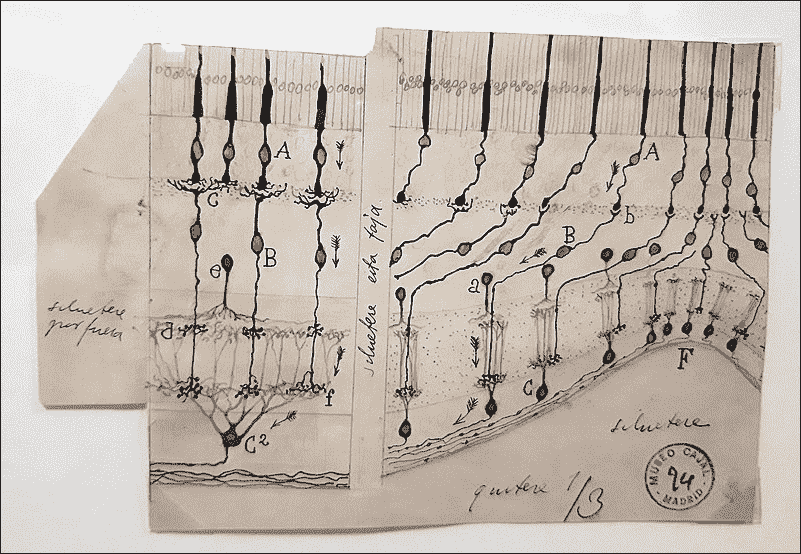

图 10.1:拉蒙·y·卡哈尔绘制的大脑神经元网络

在示意图中，你可以将神经元理解为大脑各层中的灰点。神经元之间是树突和轴突，即大脑的布线。每个神经元通过被称为突触的神经突接收相当于环境信息的信息。

拉蒙·y·卡哈尔和他的学生创造了*电缆理论*，其中通过数学模型模拟通过神经突的电流。通过在不同位置和时间接收突触输入的树突到达神经部位的电压被认为是细胞之间传递的感觉和其他信息。这是今天在研究中用来模拟突触和神经反应的详细神经元模型的基础。

神经元的基本功能由 Frank Rosenblatt 在 1958 年正式定义为感知器——一个包含大多数现代深度学习概念本质的模型。


图 10.2:感知器模型

在感知器模型中，一个神经元——由中间的椭圆形表示——接收来自其他神经元的输入。在模型中，这些输入可以代表文本、图像、声音或任何其他类型的信息。这些通过总结得到整合。在这个总和中，来自神经元的每一个输入， *i* ，都带有它的权重，*w*I，这标志着它的重要性。这个整合的输入然后可以导致由神经元的激活函数 *g* 给出的神经激活。

在最简单的情况下，激活函数可以仅仅是阈值函数，使得如果输入的加权和超过某个值，则神经元被激活。在现代神经网络中，激活函数是非线性函数，例如 sigmoid 函数或修正线性函数，其中输出在阈值以上是线性的，在阈值以下被裁剪。

当网络受到数据刺激时，输入神经元被激活，并馈给二阶神经元，二阶神经元再依次馈给其他神经元，直到输出层被激活。这就是所谓的*前馈传播*。

感知器由单层的整合神经元组成，这些神经元对输入的连接进行求和。马文·明斯基和西摩·帕珀特在他们的书《T4 感知器》 (1969)中证明了这些神经元，类似于一个简单的线性模型，不能逼近真实世界中相关的复杂函数。

然而，多层神经网络可以克服这种限制，这就是我们慢慢进入深度学习领域的地方。这些网络可以通过一种叫做*反向传播*的算法来训练——这通常归功于 Paul Werbos (1975)。在反向传播中，可以将输出与目标进行比较，并且可以通过网络反馈误差导数，以计算对连接中权重的调整。

神经网络的另一项创新同样来自神经科学。在 20 世纪 50 年代和 60 年代，David Hubel 和 Torsten Wiesel 发现猫视觉皮层(V1)中的神经元对视野中的小区域做出反应。这个区域他们称之为感受野(1959，“猫纹状皮层中单个神经元的感受野”)。他们区分了两种基本的细胞类型:

*   简单单元格–这些单元格可以主要通过输入求和来表征
*   复杂细胞——对不同位置的各种刺激做出反应的细胞

复杂细胞启发了神经网络中采用卷积的计算层，这是由 Kunihiko Fukushima 在 1980 年首次提出的。我们已经在第三章、*预处理时间序列*中讨论过卷积。

具有卷积层的神经网络是图像处理、分类和分割等应用的主要模型类型。Yann LeCun 及其同事介绍了 LeNet 架构(1989 年)，其中卷积核是通过反向传播学习的，用于手写数字图像的分类。

深度学习网络通常不只是有层，输入从一层传播到下一层(前馈)。这些连接也可以是重复的，它们连接到同一层的神经元，甚至连接回同一个神经元。

Jürgen Schmidhuber 和 Sepp Hochreiter 在 1997 年提出了一个循环神经网络框架，**长短期记忆** ( **LSTM** )。与以前的型号相比，LSTMs 可以在更长的时间内检索和学习信息。这种模型架构曾一度为 Android 智能手机的语音识别软件等行业模型提供动力，但此后大多被卷积模型所取代。

2012 年，Alex Krizhevsky 与 Ilya Sutskever 和 Geoffrey Hinton 合作创建的 AlexNet 在 ImageNet 大规模视觉识别挑战(简称 ImageNet)中取得了突破，数百万张图像将被分类到 20，000 个类别中。AlexNet 将前 5 名的错误率从 25%左右降到了 15%左右。该模型利用由**图形处理单元**(**GPU**)支持的大规模并行硬件，将全连接层与卷积和池层结合在一起。

这仅仅是包括图像在内的不同任务性能大幅提升的开始。AlexNet 的表现在第二年被 ResNet 击败。

由于 ResNet 论文非常有影响力，所以有必要绕一小段路来解释它是如何工作的。resnet是微软研究院的何等人在 2015 年提出的(*用于图像识别的深度残差学习*)。深度神经元网络的一个常见问题是，随着层的增加，它们的性能会饱和并下降，部分原因是消失梯度问题，其中优化中计算的误差梯度会变得太小而无用。

受大脑中锥体细胞的启发，残余神经网络采用所谓的*跳过连接*，本质上是跳过中间层的捷径。ResNet 是一个网络，它包含具有跳过连接的块(剩余块)，如该模式所示:

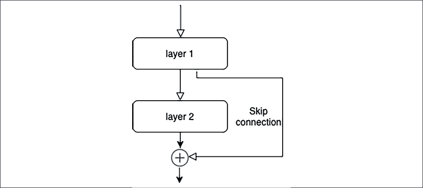

图 10.3:跳过连接的剩余块

在所示的残差块中，第 2 层的输出如下:


其中和分别是层 2 中的激活功能和跳过连接。通常是识别功能，其中第 1 层的激活不变。如果第 1 层和第 2 层输出之间的维度不匹配，则使用填充或卷积。

利用这些跳跃连接，和其他人成功地训练了多达 1000 层的网络。2015 年的原版 ResNet 在图像上非常成功。在其他奖项中，它赢得了几个图像分类和对象检测的顶级比赛:ILSVRC 2015，ILSVRC 2015，Coco 2015 ImageNet 检测，ImageNet 定位，COCO 检测和 COCO 分割比赛。

我在下面的时间线中总结了人工神经网络和深度学习的早期历史:

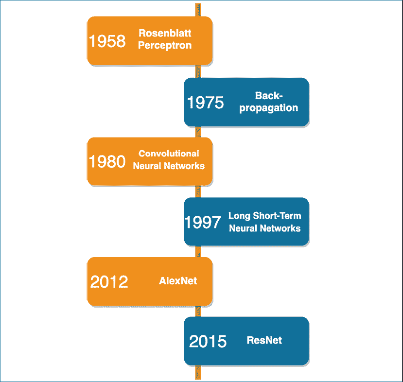

图 10.4:人工神经网络和深度学习的时间轴

请注意，这是高度简化的，省略了许多重要的里程碑。我已经在 2015 年结束了，当时 ResNet 被提出。

深度学习有许多架构和方法，这张图表显示了这些方法的类型学:


图 10.5:深度学习方法的类型

我们在本节中提到了其中的一些方法，我们将在下一节中更详细地解释其中的一些方法，因为它们与时间序列相关。

基于深度神经网络的技术的计算复杂性首先由输入数据的维度驱动，并且取决于使用反向传播训练的隐藏层的数量。高维数据往往需要更多的隐藏层来确保更高层次的特征学习，其中每一层都基于前一层导出更高级别的特征。训练时间和复杂性随着神经元数量的增加而增加——超参数的数量有时可以达到数百万或数十亿。

作为学习的一部分，深度学习构建了一堆派生特征，这种表达能力使建模者能够摆脱手工制作的特征。使用深度学习模型的进一步优势包括其在选择架构、超参数(如激活函数、正则化、层大小和损失目标)方面的灵活性，但这是针对其在参数数量方面的复杂性以及询问其内部工作的难度进行的权衡。

与其他机器学习方法相比，深度学习方法在大量时间序列数据集上提供了更好的表示和预测；然而，到目前为止，他们还没有发现在其他领域产生的影响。

# 时间序列的深度学习

近年来，深度神经网络激增，各种应用领域都取得了前所未有的进步，特别是图像、自然语言处理和声音。深度学习模型的潜在优势是，它们可以比其他类型的模型更加准确，从而在视觉、声音和自然语言处理等领域推进极限**(**NLP**)。**

 **在预测中，尤其是需求预测中，数据通常是高度不稳定的、不连续的或突发的，这违反了经典技术的核心假设，例如高斯误差、平稳性或同方差性，正如在*第 5 章*、*时间序列预测*中所讨论的。应用于预测、分类或回归任务的深度学习技术可以克服经典方法面临的许多挑战，最重要的是，它们可以提供一种对非线性动态进行建模的方法，这种方法通常被传统方法所忽略，如 Box-Jenkins、指数平滑(es)或状态空间模型。

最近，许多深度学习算法已经应用于时间序列，包括单变量和多变量时间序列。模型架构包括循环神经网络(RNNs)、大多数显著的长短期记忆(LSTM)模型、转换器和卷积模型，或者不同类型的自编码器。

然而，就它们在时间序列中的应用而言，它们还无法挑战该领域的顶级模型。例如，正如 Spyros Makridakis 等人(2020 年)所指出的，在 M4 竞赛(可以说是单变量时间序列预测的最重要基准)中，排名最好的方法是广泛使用的经典统计技术的集合，而不是纯粹的机器学习方法。

这可能至少部分是由于竞争的性质。正如 Slawek Smyl 所指出的，季节性序列的去季节性在 M4 竞赛中非常重要，因为这些序列是作为不带时间戳的标量向量提供的，所以没有办法纳入日历功能，如星期几或月份数。

在 M4 竞赛中，在 60 个参赛作品中，第一个机器学习方法排在第 23 位。然而，有趣的是，M4 竞赛的获胜者是注意力分散的 LSTM 和霍尔特-温特斯统计模型的混合体。另一个顶级竞争者，由 Rob Hyndman 周围的研究小组开发，将梯度增强的树集成应用于传统模型的输出( *FFORMA:基于特征的预测模型平均*，2020)。

这些排名让 Spyros Makridakis 和其他人得出结论，经典和机器学习方法的混合或混合是前进的方向。对深度学习架构的搜索正在进行中，这种架构可能会在研究和应用中提供一个转折点，类似于 AlexNet 或图像领域的 Inception。

在*第 4 章*、*时序机器学习简介*中，我们首先讨论了用**动态时间扭曲** ( **DTW** )和击败最近邻等基线方法的难度，然后讨论了最先进的方法。就性能而言，最具竞争力的模型是 **HIVE-COTE** ( **基于转换的集成的分层投票集合**)，它由机器学习模型的集成组成——由于计算量和长运行时间，在资源方面非常昂贵。

愤世嫉俗的读者可能会评论说，这听起来像深度学习，并问深度学习是否已经成为最先进的方法。一般来说，深度学习模型的复杂度远远高于传统模型或其他机器学习技术。可以认为这是深度学习模型的最大区别特征之一。

有没有和 HIVE 相似或者复杂度更低的深度学习模型架构，可以达到有竞争力的结果？

我在下表中总结了几个实现时间序列深度学习算法的库:

| 图书馆 | 维护者 | 算法 | 结构 |
| dl-4-tsc | 哈桑·伊斯梅尔·法瓦兹 | **多层感知器** ( **MLP** )、**全连接网络** ( **FCN** )、ResNet、编码器(基于 CNN)、**多尺度卷积神经网络** ( **MCNN** )、**时间 Le-Net** ( **t-LeNet** )、**多通道深度卷积神经网络**( | 张量流/Keras |
| Sktime-DL | 托尼·巴格内尔周围的东安格利亚大学的学生和工作人员 | ResNet，CNN，InceptionTime(通过与另一个库的接口) | 张量流/Keras |
| 胶子-TS | 亚马逊网络服务–实验室 | Gluon-TS 专门研究概率神经网络模型，比如这些:**卷积神经网络** ( **CNN** )、DeepAR、**循环神经网络** ( **RNN** )、**多层感知器** ( **MLP** ) | MXNET |
| Pytorch 预测 | 丹尼尔·奥约斯等人 | 循环网络(GRU，LSTM)，时间融合变压器，N-Beats，多层感知器，DeepAR | PyTorch 闪电 |

图 10.6:时间序列的几个深度学习库概述

Sktime-DL 是 Sktime 的扩展，由同一个研究小组维护。截至 2021 年 8 月，该库正在进行重写。

Gluon-TS 基于 MXNET 深度学习建模框架，除了表中提到的网络架构之外，还包括许多其他功能，例如用于**支持向量机** ( **SVMs** )和**高斯过程** ( **GP** )的内核，以及用于概率网络模型的分布。

*dl-4-tsc* 是由 Hassan Ismail Fawaz 等人(2019)编写的许多时间序列深度学习算法的综述论文的 GitHub 姊妹库。它包括 TensorFlow/Keras 中的实现及其实现。它本身不是一个库*，因为它不像一个库那样安装，并且模型与数据集一起运行；然而，由于这些算法是在 TensorFlow 和 Keras 中实现的，因此任何了解这些算法的人都会感觉很自在。*

 *Pytorch-forecasting、sktime-DL 和 Gluon-TS 都有自己的数据集抽象，有助于常见任务的自动化。虽然 Sktime-DL 建立在 Sktime 抽象的基础上，但 Pytorch-Forecasting 和 Gluon-TS 内置了用于深度学习的电池，这些电池具有用于常见任务的实用程序，如变量的缩放和编码、目标变量的归一化和下采样。然而，这些抽象是以学习曲线为代价的，我应该提醒那些没有耐心的读者，这需要时间来适应，这也是我在实践部分省略它们的原因。

我已经从这个表中省略了只实现单一算法的存储库。在下一个可视化中，我已经包含了其中的一些，比如 Informer 模型或神经先知的存储库。在下图中，您可以看到时间序列深度学习的一些存储库的流行程度:

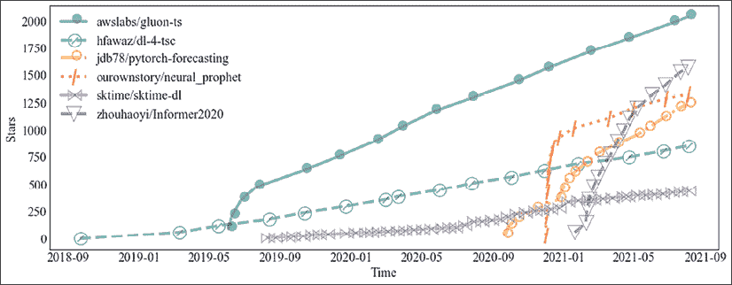

图 10.7:时间序列深度学习库的流行程度

像往常一样，我试图选择最受欢迎的存储库——以及最近更新的存储库。可以看到 Gluon-TS 是最流行的存储库。在实现几种算法的存储库中，Pytorch 预测最接近，最近在流行度方面取得了进展。

在接下来的章节中，我们将集中讨论时间序列深度学习的最新和竞争性方法。我们将更详细地介绍一些最著名的算法:Autoencoders、InceptionTime、DeepAR、N-BEATS、RNNs(最突出的是 LSTMs)、ConvNets 和 Transformers(包括 Informer)。

## 自编码器

**自编码器** ( **AEs** )是人工神经网络，学习有效压缩和编码数据，并对重建误差进行训练。基本线性 AE 在功能上基本等同于**主成分分析** ( **PCA** )，尽管在实践中，AE 通常是正则化的。

AEs 由编码器和解码器两部分组成，如下图所示(来源:维基百科):

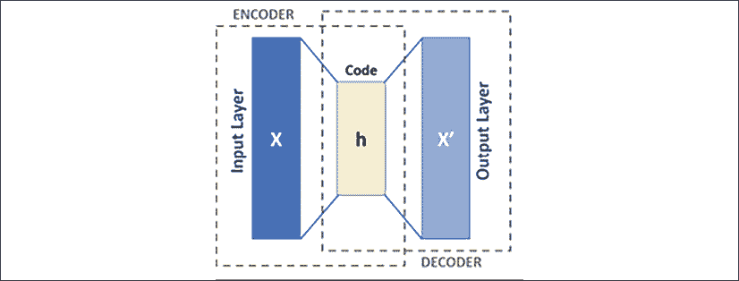

图 10.8:自编码器架构

编码器和解码器通常都是相同的架构，这取决于领域。例如，关于图像，它们通常包含像`LeNet`这样的卷积。对于时间相关性建模，它们可以包括因果卷积或递归层，作为时间相关性建模的一种方式。

AEs 是降低噪声的自然方法。它们通常用于时间序列中的异常检测。

## 开始时间

在一个大约花了一个月时间在 60 个 GPU 集群上完成的大规模测试中，Hassan Ismail Fawaz 和上阿尔萨斯大学的其他人在单变量 UCR/UEA 时间序列分类档案(85 个时间序列)和 13 个数据集的**多变量时间序列** ( **MTS** )分类档案上运行了深度学习算法。他们在 2019 年的论文“*时间序列分类的深度学习:综述*”中介绍了这项工作。

他们对 11 个模型进行了系统的评估，包括 LeNet、**全连接网络** ( **FCNs** )、Time-CNN 和 ResNet。只有 9 个算法完成了所有测试。与单变量数据集上的深度学习算法(UCR/UEA)相比，ResNet 在 85 个问题中的 50 个问题上获胜，并且在统计上优于第二好的算法**完全卷积神经网络** ( **FCNN** )。同时，它在统计上并不比时间序列分类中的顶级模型 HIVE-COTE 差。在多元基准测试中，FCNN 胜出，尽管他们没有发现网络之间有任何统计上的显著差异。

在另一篇论文中，“*InceptionTime:Finding AlexNet for Time-Series Classification，*”Hassan Ismail Fawaz 和一个扩大的研究小组，包括来自莫纳什大学的 Geoff Webb 和其他人(我们在*第 3 章*、*预处理时间序列*中遇到过他们)，提出了一个新模型，他们称之为 inception Time。

名称 *InceptionTime* 参考了盗梦空间模型(*2014 年*)，这是一个由谷歌、北卡罗来纳大学和密西根大学的研究人员提出的网络。Inception 架构由前馈和卷积层组成，类似于我们在本章前面提到的 LeNet。一个 22 层的变体因此也被称为 GoogleLetNet(或者:Inception model version 1)。粗略地说，初始模型由将不同大小的卷积连接在一起的模块(“初始模块”)组成。

InceptionTime 采用具有不同超参数(不同长度的过滤器)的初始模型集合。他们对集合中的网络数量和过滤器大小进行了实验，最终表明他们的模型在 UCR 档案的 85 个数据集上明显优于 ResNet，同时在统计上与 HIVE-COTE 不相上下-与 HIVE-COTE 相比，训练时间大大减少。

## 迪帕尔

DeepAR 是德国亚马逊研究院的一种概率预测方法。它基于训练一个自回归循环网络模型。在他们的文章“ *DeepAR:用自回归循环网络进行概率预测*”(2019)中，David Salinas、Valentin Flunkert 和 Jan Gasthaus 通过对几个真实世界预测数据集(零件、电力、交通、ec-sub 和 ec)进行广泛的经验评估，证明了与最先进的方法相比，精确度提高了约 15%。

DeepAR 是为需求预测而设计的，由一个 RNN 架构组成，并为可以跨越几个数量级的无界计数数据合并了一个负二项式似然。蒙特卡罗抽样用于计算预测范围内所有子范围的分位数估计值。对于时间序列的幅度变化很大的情况，他们还引入了负二项式似然的均值和方差参数的标度，因子取决于时间序列的均值和网络的输出。

## n 拍

这是一个用于单变量时间序列点预测的模型架构，基于向后和向前残差链接以及完全连接的 ReLU 神经元的非常深的多层网络。N-BEATS 使用深度学习原语，如残差块，而不是任何特定于时间序列的组件，并且是第一个证明不使用特定于时间序列的组件的深度学习可以优于成熟的统计方法的架构。

该网络于 2019 年由 Yoshua Bengio 周围的一个小组发布("*N-BEATS:Neural basis expansion analysis for interpretatable time-series forecasting*")，该网络在两个配置上达到了最先进的性能，并优于所有其他方法，包括 M3、M4 和旅游竞争数据集基准中的传统统计方法的集合。

对深度学习的一个常见批评是学习的不透明性质，或者相反，在网络做什么方面缺乏透明度。n 拍可以通过很少的改变来解释，而不会损失显著的准确性。

## 循环神经网络

RNNs，最突出的是 T2 lstm，已被大量应用于多元用电量预测。电力预测是一个长序列时间序列，需要精确捕捉序列项之间随时间变化的长程相关性耦合。

早期的工作探索了 LSTMs 与扩张、剩余连接和注意力的结合。这些成为 M4 竞赛获胜者的基础(Slawek Smyl，2020)。

Smyl 引入了一种混合的标准 T4 指数平滑模型和 LSTM 网络。ES 方程使该方法能够有效地捕捉单个序列的主要成分，如季节性和基线水平，而 LSTM 网络可以模拟非线性趋势。

rnn(包括 LSTMs)的一个问题是，它们不能以训练时间和计算资源为代价轻松地并行化。也有人认为 LSTMs 不能捕捉长程相关性，因为它们与长于约 100 个时间步长的序列进行斗争。rnn 对过去的隐藏状态进行编码，以捕获与先前项目的依赖关系，并且它们显示出由于长依赖关系而导致的性能下降。

在下一节中，我们将研究 transformer 架构，它在性能和最近的受欢迎程度方面已经取代了 LSTM 模型。

事实表明，卷积架构在音频处理和机器翻译等任务上可以优于循环网络，并且它们也已经被应用于时间序列任务。

## ConvNets

来自卡耐基梅隆大学和英特尔实验室的研究人员(“*用于序列建模的通用卷积和循环网络的经验评估*”2018)比较了通用卷积和循环网络，如 LSTM/GRU，用于广泛任务的序列建模。这些都是大型文本数据集，并提出了序列问题，如加法问题，记忆任务的复制，或复调音乐。诸如此类的问题和数据集通常用于测试循环网络。

他们发现，一个简单的卷积架构，即**时间卷积网络** ( **TCN** )，在大量任务的规范循环网络(如 LSTMs)上的表现优于，同时表现出更长的有效记忆。

TCN 中卷积的重要特征是它们是因果的。如果卷积的输出仅仅是当前和过去输入的结果，那么卷积就是因果的。此处举例说明(资料来源:keras-tcn，GitHub):


图 10.9:时间因果卷积

时间 t 的输出仅与时间 t 和更早时间的元素进行卷积。这意味着来自未来的信息不能泄露给过去。这种基本设计的缺点是，为了实现长的有效历史大小，我们需要非常深的网络或非常大的滤波器。

与 RNNs 相比，卷积的一些优势是并行性、灵活的感受野大小(指定模型可以看多远)和稳定的梯度——随着时间的推移反向传播会出现梯度消失的问题。

该转换器还解决了 rnn 的已知缺点。

## 变压器架构

谷歌大脑和多伦多大学的研究人员在文章“*注意力是你所需要的全部*”中介绍的变形金刚，旨在避免递归，以便允许并行计算。

变形金刚引入了两个构建模块——多头注意力和位置嵌入。序列不是按顺序工作，而是作为一个整体处理，而不是逐项处理。他们使用自我注意，其中存储了句子中项目之间的相似性得分。

变形金刚最初是为机器翻译而推出的，在那里它们被证明优于谷歌的神经机器翻译模型。因此，核心部分是两个序列的比对。代替递归，引入了位置嵌入，其中权重编码与序列中记号的特定位置相关的信息。

变压器由堆叠模块组成，首先是编码器模块，然后是解码器模块。编码器模块各由自关注层和前馈层组成，而解码器模块由自关注、编码器-解码器关注和前馈层组成。这些模块可以堆叠，从而创建可以学习海量数据集的非常大的模型。

变形金刚在 NLP 方面已经突破了极限，尤其是在翻译和语言理解方面。此外，OpenAI 强大的语言生成 GPT-3 模型也是一个转换器，DeepMind 的 AlphaFold 2 也是如此，这是一个根据基因序列预测蛋白质结构的模型。

变压器已经能够在较长的序列中保持性能。但是，它们只能捕获用于训练它们的固定输入大小内的依赖关系。为了处理超过固定输入宽度的更长的句子，Transformer-XL 之类的架构通过存储已编码句子的隐藏状态来重新引入递归，以便在下一个句子的后续编码中利用它们。

在文章“*时态融合转换器用于可解释的多时域时间序列预测*”中，来自牛津大学和谷歌云人工智能的研究人员介绍了一种基于注意力的架构，他们称之为**时态融合转换器** ( **TFT** )。为了学习不同尺度的时间关系，TFT 使用循环层进行局部处理，使用可解释的自我关注层进行长期依赖。此外，一系列门控层抑制了不必要的成分。

在各种真实数据集上，他们展示了其架构在广泛基准集上的显著性能改进。在其他改进中，它们比亚马逊的 DeepAR 高出 36%到 69%。

## 告密者

变压器的一个问题是二次时间复杂度和内存使用，以及编码器-解码器架构的限制。这使得对更长时间段的预测变得复杂，例如，每小时耗电量的 510 个时间步长。为了解决这些问题，来自北京航空航天大学、加州大学伯克利分校、罗格斯大学和 SEDD 公司的研究人员设计了一个基于高效变压器的长序列时间序列预测模型，名为 Informer-"*Informer:Beyond Efficient Transformer for Long Sequence Time-Series Forecasting*"。该论文在 2021 年的 AAAI 会议上获得了杰出论文奖。

生成解码器通过在一次正向操作中而不是一步一步地预测长时间序列来减轻编码器-解码器的时间复杂度。他们用一种称为 pro sparse Self-Attention 的新的自我关注机制取代了位置嵌入，这种机制实现了，其中 *L* 是序列的长度，而不是二次时间复杂度和内存使用量，同时保持了序列比对的可比性能。

最后，自我注意提取将级联层输入减半，并有效地处理极长的输入序列。这降低了从到的复杂度，其中 J 是变压器层数。

Informer 架构如下图所示(来自官方的 Informer 存储库):

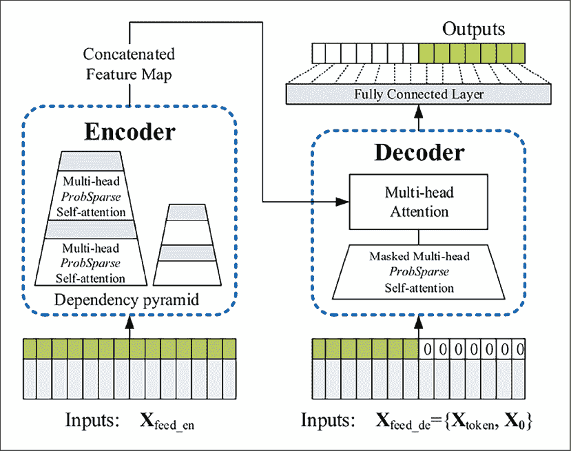

图 10.10:Informer 架构

该图显示，Informer 在长时间序列预测的数据集上明显优于现有方法，如电力变压器温度(ETT)、用电负荷(ECL)和天气。

在单变量数据集上，他们取得了优于所有竞争对手的性能，除了两种情况，DeepAR 略好，如下所示(来源:Informer GitHub repository):

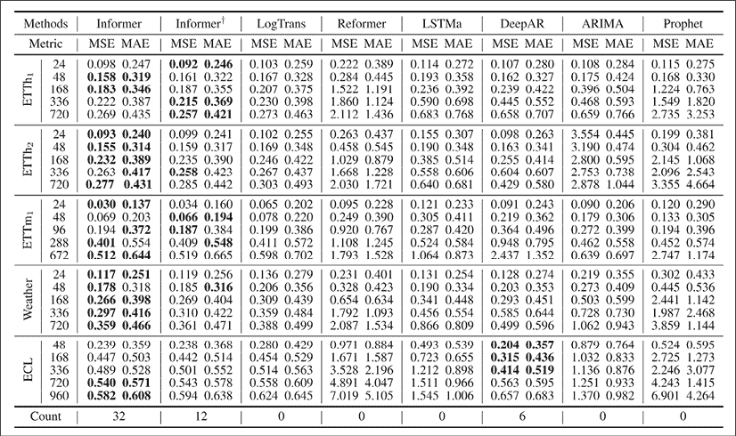

图 10.11:单变量长序列时间序列预测性能

最重要的是，他们击败了竞争对手，如 ARIMA，先知，LSTMs 和其他基于变压器的架构。

在多元基准测试中，他们还击败了包括其他基于变压器的模型和 LSTMs 在内的竞争对手。

我们现在将把其中一些付诸实践。

# Python 实践

让我们模拟飞机乘客。我们将预测每月的旅客人数。

这个数据集被认为是经典的时间序列之一，由 George E.P. Box 和 Gwilym Jenkins 与《时间序列分析:预测和控制》(1976 年)一起出版。我在本书的 GitHub 资源库的`chapter10`文件夹中提供了这个数据集的副本。你可以从那里下载或者直接在`pd.read_csv()`里使用网址。

我们将首先从一个简单的 FCN 开始，然后应用一个循环网络，最后，我们将应用一个非常新的架构，一个扩展的因果卷积神经网络。

FCN 是第一个。

## 全连接网络

在第一个练习会话中，我们将使用 TensorFlow 库，我们可以从终端(或者类似地从 anaconda navigator)快速安装这些库:

```
pip install -U tensorflow 
```

我们将从 Python(或 IPython)终端执行命令，但同样，我们也可以从 Jupyter 笔记本(或不同的环境)执行它们。

安装可能需要一段时间 TensorFlow 库的大小约为 200 MB，附带一些依赖项。

让我们加载数据集。这里，我假设你已经把它下载到你的电脑上了:

```
import pandas as pd

passengers = pd.read_csv(

  "passengers.csv", parse_dates=["date"]

).set_index("date") 
```

让我们天真地尝试只使用 FCN，也称为 MLP。

让我们设置一些导入并设置几个全局常量:

```
import tensorflow as tf

import tensorflow.keras as keras

from tensorflow.keras.layers import Dense, Input, Dropout

DROPOUT_RATIO = 0.2

HIDDEN_NEURONS = 10

callback = tf.keras.callbacks.EarlyStopping(

  monitor='loss', patience=3

) 
```

我们将在模型架构中使用这些常量。

去除(或:稀释)是一种正则化技术，可以帮助减少过度拟合。退出意味着在训练期间，一小部分连接(在我们的例子中是 20%)被随机移除。

提前停止是另一种正规化的形式，训练在特定条件下停止。在我们的案例中，我们已经声明，如果我们的损失连续三次没有改善，就应该停止。如果模型停止改进，继续训练它就没有意义，尽管我们可能会陷入局部最小误差，但我们也许能够逃脱。早停的一大好处就是可以帮助我们快速看出一个模型是否在工作。

我们可以在这个函数中定义我们的模型:

```
def create_model(passengers):

  input_layer = Input(len(passengers.columns))

  hiden_layer = Dropout(DROPOUT_RATIO)(input_layer)

  hiden_layer = Dense(HIDDEN_NEURONS, activation='relu')(hiden_layer)

  output_layer = Dropout(DROPOUT_RATIO)(hiden_layer)

  output_layer = Dense(1)(output_layer)

  model = keras.models.Model(

    inputs=input_layer, outputs=output_layer

  )

  model.compile(

    loss='mse',

  optimizer=keras.optimizers.Adagrad(),

    metrics=[keras.metrics.RootMeanSquaredError(), keras.metrics.MeanAbsoluteError()])

  return model 
```

借助 Keras functional API，我们定义了一个双层神经网络，其中隐藏的`HIDDEN_NEURONS`神经元层由整流线性单元(ReLU)函数激活。

让我们将数据集分成训练集和测试集。我们将根据前一时间段(前一个月)的乘客预测乘客数量:

```
from sklearn.model_selection import train_test_split

X_train, X_test, y_train, y_test = train_test_split(

  passengers, passengers.passengers.shift(-1), shuffle=False

) 
```

我们将基于数据集的前 75%进行学习——这是`train_test_split`函数中`test_size`参数的默认值。

我们现在可以训练我们天真的 FCN:

```
model = create_model(X_train)

model.fit(X_train, y_train, epochs=1000, callbacks=[callback]) 
```

当它们结束时，我们应该得到每个时期的损失和指标的输出:

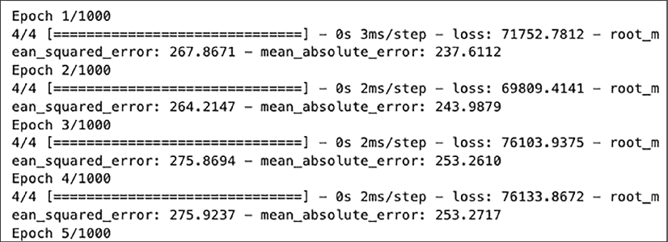

图 10.12:模型训练

理想情况下，我们会看到误差(损失)下降，并且我们会看到最终的低误差。我没有包含任何修复随机数生成器(`tf.random.set_seed`)的代码，所以您的输出可能会有所不同。

然后，我们可以得到测试集的预测，如下所示:

```
predicted = model.predict(X_test) 
```

现在，最好将乘客预测与实际乘客值进行对比。

我们可以使用这个函数:

```
import matplotlib.pyplot as plt

def show_result(y_test, predicted):

  plt.figure(figsize=(16, 6))

  plt.plot(y_test.index, predicted, 'o-', label="predicted")

  plt.plot(y_test.index, y_test, '.-', label="actual")

  plt.ylabel("Passengers")

  plt.legend() 
```

让我们想象一下我们的预测吧！

```
show_result(y_test, predicted) 
```

这是图表:

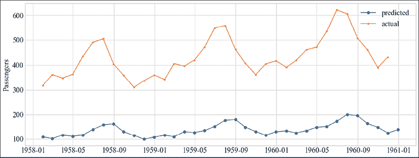

图 10.13:根据实际飞机乘客预测:假设网络完全连通

我们可以看到模型已经学习了一些月度变化。然而，它系统性地预测不足——它从 1949 年至 1958 年的训练集中学习了基线，当时旅行的乘客要少得多。

让我们把它变得更复杂更好。

第一个模型只在之前的旅行者数量上进行训练。

作为第一步，我们将包括年份和月份作为预测变量。年可以用来模拟趋势，而月与月变化相关联，因此这似乎是一个自然的步骤。

这将根据 DateTimeIndex 向 DataFrame 添加月和年列:

```
passengers["month"] = passengers.index.month.values

passengers["year"] = passengers.index.year.values 
```

现在我们可以重新定义我们的模型——我们需要添加更多的输入列:

```
model = create_model(passengers) 
```

我们准备好了另一轮训练:

```
X_train, X_test, y_train, y_test = train_test_split(

  passengers, passengers.passengers.shift(-1), shuffle=False

)

model.fit(X_train, y_train, epochs=100, callbacks=[callback])

predicted = model.predict(X_test)

show_result(y_test, predicted) 
```

让我们看看模型预测与测试数据的匹配程度:

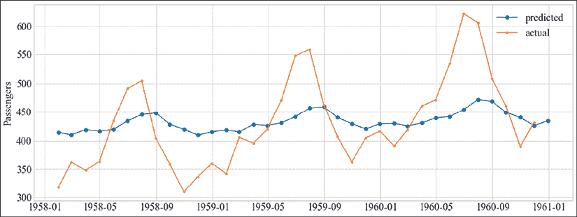

图 10.14:对实际飞机乘客的预测；具有年月的全连接网络

请注意，由于参数数量多，以及学习过程中的随机性，结果可能会在运行之间有很大差异。这确实是与深度学习相关的问题之一。

这已经看起来好多了。年份特性帮助我们的模型了解基线。该模型已经了解了月变化的一些情况，但还不足以真正逼近月变化。

让我们创建一个不那么天真的版本。我们将改变这一模式中的一些东西:

*   我们将添加一个嵌入的月份功能
*   我们将把年份视为线性预测值
*   我们将把上个月的乘客量加入到我们的预测中
*   最后，我们将根据训练数据集中的标准偏差来调整我们的预测

那是相当多的。让我们慢慢来。

我们将月份作为从 1 到 12 的值输入到之前的模型中。然而，我们可以凭直觉猜测，一月(1)和十二月(12)可能比十一月(11)和十二月更相似。我们知道 12 月和 1 月都有很多游客，但 11 月的游客量可能会低得多。我们可以根据数据捕捉这些关系。

这可以在嵌入层中完成。嵌入层是不同类别到实数的映射。该映射作为网络优化的一部分被更新。

这一年与整体趋势密切相关。每年，航空乘客的数量都在增加。我们可以对这种关系进行非线性或线性建模。在这里，我决定只对年份特征和结果之间的线性关系进行建模。

上个月的乘客数量和本月的乘客数量之间的关系再次被假设为线性关系。

最后，我们可以缩放我们的预测，类似于标准变换的逆变换。你应该记得*第三章* *中的标准归一化，预处理时间序列*，如下:


其中是总体均值，是总体标准差。

与此相反的情况如下:


我们的公式如下:


其中是时间 t 的航班乘客，是基于嵌入的月份和年份的预测。

我们假设网络会学习基线，但可能不会完美地学习规模——所以我们会帮忙。

一个例子可能会有帮助(来自 TensorBoard，TensorFlow 的可视化工具包):

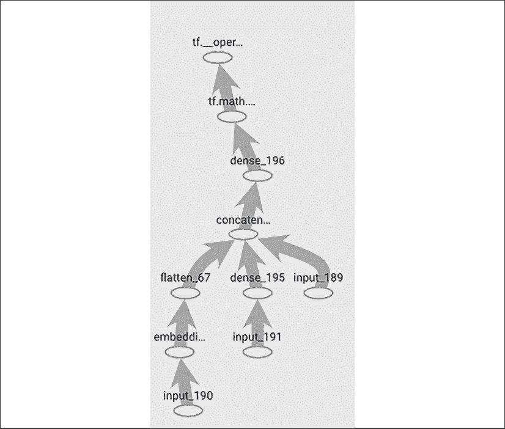

图 10.15:模型架构:具有嵌入、缩放和基线的全连接网络

我们可以看到三个输入，其中一个(月份)通过嵌入层，另一个通过(线性)投影。它们都聚集在一起(连接)并通过一个密集层，在该层上执行另一个数学运算。

我们首先需要一些进口货:

```
from tensorflow.keras.layers.experimental preprocessing

from tensorflow.keras.layers import Embedding, Flatten, Concatenate

from tensorflow.keras.metrics import (

  RootMeanSquaredError, MeanAbsoluteError

) 
```

现在，我们将网络重新定义如下:

```
def create_model(train):

  scale = tf.constant(train.passengers.std())

  cont_layer = Input(shape=1)

  cat_layer = Input(shape=1)

  embedded = Embedding(12, 5)(cat_layer)

  emb_flat = Flatten()(embedded)

  year_input = Input(shape=1)

  year_layer = Dense(1)(year_input)

  hidden_output = Concatenate(-1)([emb_flat, year_layer, cont_layer])

  output_layer = keras.layers.Dense(1)(hidden_output)

  output = output_layer * scale + cont_layer

  model = keras.models.Model(inputs=[

    cont_layer, cat_layer, year_input

  ], outputs=output)

  model.compile(loss='mse', optimizer=keras.optimizers.Adam(),

    metrics=[RootMeanSquaredError(), MeanAbsoluteError()])

  return model 
```

我们重新初始化我们的模型:

```
model = create_model(X_train) 
```

在训练期间，出于预测的目的，我们需要像这样分别输入三种类型的输入:

```
model.fit(

  (X_train["passengers"], X_train["year"], X_train["month"]),

  y_train, epochs=1000,

  callbacks=[callback]

)

predicted = model.predict((X_test["passengers"], X_test["year"], X_test["month"])) 
```

您可能会注意到，在这种配置下，训练会持续更长时间。

这张图表展示了我们的新网络正在实现的契合度:

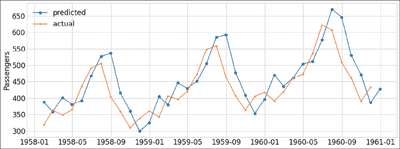

图 10.16:根据实际飞机乘客人数预测:具有嵌入、缩放和基线的全连接网络

这看起来又比前一个网络好得多。我们把它作为一个练习留给读者去尝试进一步改进这个网络。

接下来我们将建立一个 RNN。

## 循环神经网络

我们在理论一节中讨论过，循环神经网络可以很好地建模时间序列中点之间的长期关系。让我们建立一个 RNN。

我们将使用与之前相同的数据集——飞机乘客的单变量值。在这种情况下，我们的网络将需要每个训练样本的一系列点。在每一个训练步骤中，RNN 都将在指向下一个乘客编号的点(乘客)上进行训练。

请注意，我们可以使用 TensorFlow(或者甚至 statsmodels 的`lagmat()`)实用函数来实现这个目的(我们将在第 12 章、*案例研究*中使用它们)，但是在这个实例中，我们将自己快速地编写它。

我们需要对乘客数量进行重新采样，如下所示:

```
def wrap_data(df, lookback: int):

  dataset = []

  for index in range(lookback, len(df)+1):

    features = {

        f"col_{i}": float(val) for i, val in enumerate(

          df.iloc[index-lookback:index].values

        )

    }

    row = pd.DataFrame.from_dict([features])

    row.index = [df.index[index-1]]

    dataset.append(row)

  return pd.concat(dataset, axis=0) 
```

这个函数完成这项工作。它遍历数据集中的所有点，并采用一个序列引导它。新序列中的点数由参数`lookback`定义。

让我们把它派上用场:

```
LOOKBACK = 10

dataset = wrap_data(passengers, lookback=LOOKBACK)

dataset = dataset.join(passengers.shift(-1)) 
```

我们使用 10 的回看。我故意选择了一个非最优值。我把它作为一个练习留给读者，让他们选择一个更好的并尝试一下。

上面代码中的最后一行将目标(lookahead 1)和序列连接在一起。

我们已经准备好定义我们的网络，但是让我们先把导入的东西放在一边:

```
import tensorflow.keras as keras

from tensorflow.keras.layers import Input, Bidirectional, LSTM, Dense

import tensorflow as tf 
```

该网络由以下函数定义:

```
def create_model(passengers):

  input_layer = Input(shape=(LOOKBACK, 1))

  recurrent = Bidirectional(LSTM(20, activation="tanh"))(input_layer)

  output_layer = Dense(1)(recurrent)

  model = keras.models.Model(inputs=input_layer, outputs=output_layer)

  model.compile(loss='mse', optimizer=keras.optimizers.Adagrad(),

    metrics=[keras.metrics.RootMeanSquaredError(), keras.metrics.MeanAbsoluteError()])

  return model 
```

这是一个双向 LSTM 网络。最后一层的结果被线性投影为我们的输出。我已经将 LSTM 的激活功能设置为`tanh`，以防你想在 GPU 运行时上运行它，因此它将受益于 NVIDIA 的 GPU 加速库 cuDNN。我们将提取与上一练习中相同的指标。

您应该熟悉上一节中的一些预备知识，如下所示:

```
from sklearn.model_selection import train_test_split

callback = tf.keras.callbacks.EarlyStopping(monitor='loss', patience=3)

model = create_model(passengers)

X_train, X_test, y_train, y_test = train_test_split(

    dataset.drop(columns="passengers"),

    dataset["passengers"],

    shuffle=False

) 
```

让我们来训练它:

```
model.fit(X_train, y_train, epochs=1000, callbacks=[callback]) 
```

结果看起来已经相当好了——尽管我们做了一些次优选择:

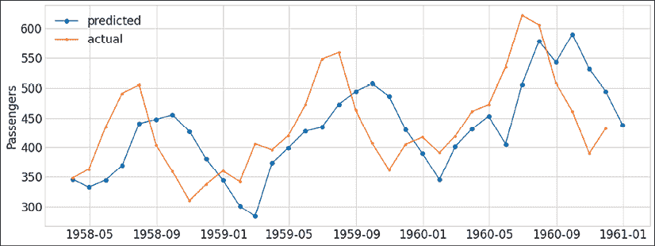

图 10.17:用于乘客预测的循环神经网络

考虑到这很容易建立，这看起来已经很有希望了。

现在让我们尝试一个因果关系图！

## 扩张因果卷积神经网络

这个例子基于 Krist Papadopoulos 对 Anastasia Borovykh 等人的论文“*用卷积神经网络进行条件时间序列预测*”的 SeriesNet 实现。

我们将一起实现这个模型，并将它应用于两个数据集，看看它开箱即用的效果如何。在这个例子中，我不会调整数据和架构。

首先，进口:

```
import numpy as np

import pandas as pd

from keras.layers import Conv1D, Input, Add, Activation, Dropout

from keras.models import Sequential, Model

from keras.layers.advanced_activations import LeakyReLU, ELU

from keras import optimizers

import tensorflow as tf 
```

也许令人惊讶的是，在张量流中做因果卷积是多么容易。Conv1D 带有一个参数`padding`，可以指定为`'causal'`。这只是根据因果性质用零填充层的输入，其中时间 t 处的输出仅取决于之前的时间步长< t。请参考本章 ConvNets 一节中的讨论。

这意味着我们可以预测帧中早期时间步长的值。

该网络的主要思想是具有因果卷积的剩余块。这段代码构建了相应的网络架构:

```
def DC_CNN_Block(nb_filter, filter_length, dilation):

    def f(input_):

        residual =    input_

        layer_out =   Conv1D(

            filters=nb_filter, kernel_size=filter_length, 

            dilation_rate=dilation, 

            activation='linear', padding='causal', use_bias=False

        )(input_)                    

        layer_out =   Activation('selu')(layer_out)        

        skip_out =    Conv1D(1, 1, activation='linear', use_bias=False)(layer_out)        

        network_in =  Conv1D(1, 1, activation='linear', use_bias=False)(layer_out)                      

        network_out = Add()([residual, network_in])        

        return network_out, skip_out    

    return f 
```

我把它简化了一点，以便于阅读。

网络本身只是堆叠这些层，作为一个 SkipNet 后续的卷积:

```
def DC_CNN_Model(length):

    input = Input(shape=(length,1))

    l1a, l1b = DC_CNN_Block(32, 2, 1)(input)    

    l2a, l2b = DC_CNN_Block(32, 2, 2)(l1a) 

    l3a, l3b = DC_CNN_Block(32, 2, 4)(l2a)

    l4a, l4b = DC_CNN_Block(32, 2, 8)(l3a)

    l5a, l5b = DC_CNN_Block(32, 2, 16)(l4a)

    l6a, l6b = DC_CNN_Block(32, 2, 32)(l5a)

    l6b = Dropout(0.8)(l6b)

    l7a, l7b = DC_CNN_Block(32, 2, 64)(l6a)

    l7b = Dropout(0.8)(l7b)

    l8 =   Add()([l1b, l2b, l3b, l4b, l5b, l6b, l7b])

    l9 =   Activation('relu')(l8)   

    l21 =  Conv1D(1, 1, activation='linear', use_bias=False)(l9)

    model = Model(inputs=input, outputs=l21)

    model.compile(loss='mae', optimizer=optimizers.Adam(), metrics=['mse'])

    return model 
```

这是针对单变量时间序列的。对于多变量时间序列，一些变化是必要的，我们不会在这里讨论。

让我们再次预测乘客数量。我们将像前面的练习部分一样加载数据帧:

```
passengers = pd.read_csv(

  "passengers.csv", parse_dates=["date "]

).set_index("date") 
```

我们将再次将其分为测试集和训练集:

```
from sklearn.model_selection import train_test_split

X_train, X_test, y_train, y_test = train_test_split(

    passengers.passengers, passengers.passengers.shift(-1), shuffle=False

) 
```

我们将用这个函数训练模型:

```
def fit_model(timeseries):

    length = len(timeseries)-1

    model = DC_CNN_Model(length)

    model.summary()

    X = timeseries[:-1].reshape(1,length, 1)

    y = timeseries[1:].reshape(1,length, 1)

    model.fit(X, y, epochs=3000, callbacks=[callback])

    return model 
```

这个函数将为我们做预测:

```
def forecast(model, timeseries, horizon: int):

    length = len(timeseries)-1

    pred_array = np.zeros(horizon).reshape(1, horizon, 1)

    X_test_initial = timeseries[1:].reshape(1,length,1)

    pred_array[: ,0, :] = model.predict(X_test_initial)[:, -1:, :]

    for i in range(horizon-1):

        pred_array[:, i+1:, :] = model.predict(

            np.append(

                X_test_initial[:, i+1:, :], 

                pred_array[:, :i+1, :]

            ).reshape(1, length, 1))[:, -1:, :]

    return pred_array.flatten() 
```

预测是通过根据以前的预测预测下一个未来值来创建的。参数`horizon`是预测范围。

为了方便起见，我们将这些放在一起作为一个函数:

```
def evaluate_timeseries(series, horizon: int):

    model = fit_model(series)

    pred_array = forecast(model, series, horizon)

    return pred_array, model 
```

现在我们准备好训练了。我们将像这样运行一切:

```
HORIZON = len(y_test)

predictions, model = evaluate_timeseries(

    X_train.values.reshape(-1, 1), horizon= HORIZON

) 
```

该模型非常深，但由于卷积，就参数而言并不是很大。我们将看到有 865 个可训练参数。

然而，模型拟合度并不是很好，无论是 MSE 还是图表看起来都不是很令人印象深刻:

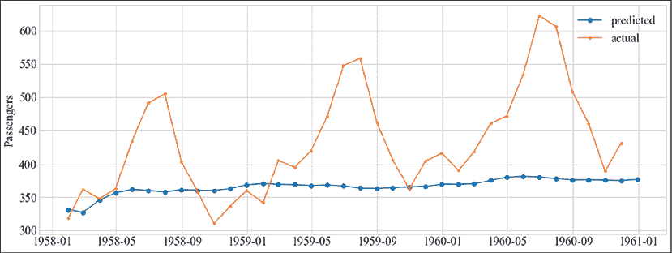

图 10.18:旅客人数的 ConvNet 预测

这个图可以通过运行`show_result(y_test[:HORIZON], predictions[:HORIZON], "Passengers")`产生。

这突出了一个事实，即每个模型都有其优点和缺点，如果不使模型适应我们的数据集并进行仔细的预处理，我们将无法获得良好的性能。这是留给读者尝试和调整这个模型的一个练习。

# 摘要

在这一章中，我介绍了许多与时间序列相关的深度学习概念，我们讨论了许多架构和算法，如自编码器、InceptionTime、DeepAR、N-BEATS、ConvNets 和一些 transformer 架构。深度学习算法确实非常接近时间序列的艺术水平，这是一个令人兴奋的研究和应用领域。

在实践部分，我先实现了一个完全连接的前馈网络，然后是一个 RNN，最后才开始使用因果网络。

在*第 12 章*、*多元预测*中，我们会做一些更深入的学习，包括一个变压器模型和一个 LSTM。***