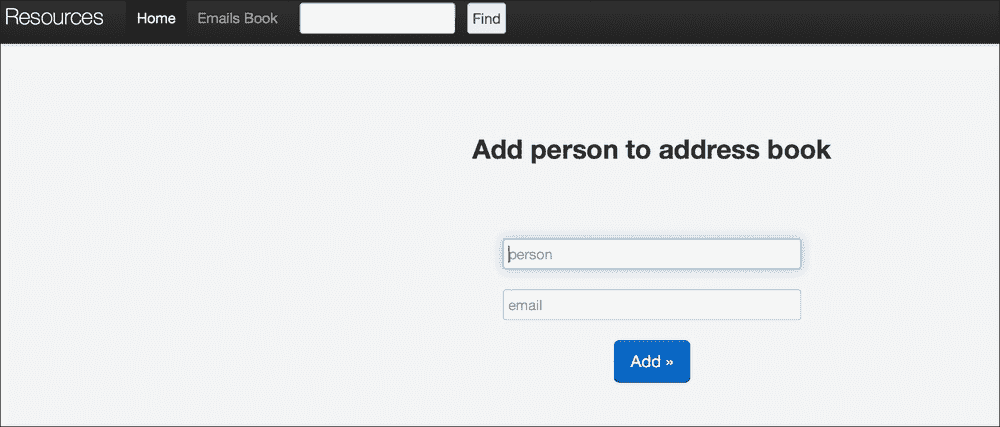
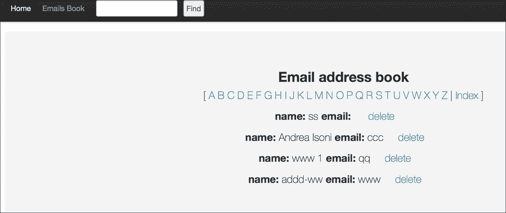
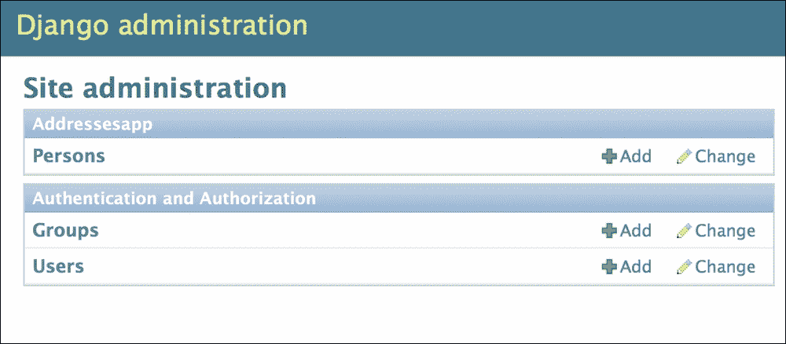
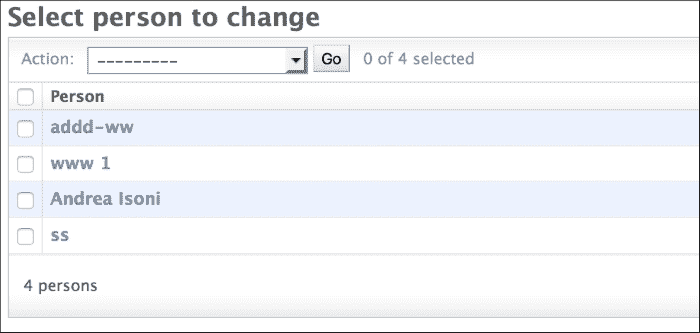
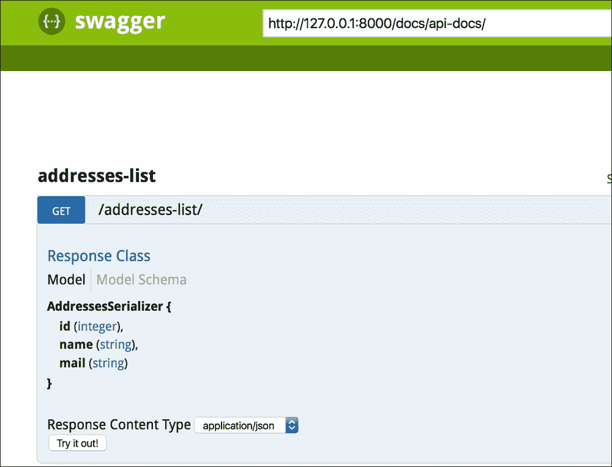

# 第六章。Django 入门

Django 是一个在商业环境中使用的开源 web 框架，因为它易于使用、稳定且灵活(它利用了 Python 中可用的多个库)。

在这一章中，我们将关注我们认为对于管理和分析框架中的数据至关重要的特性。我们还解释了与构建基本 web 应用程序相关的主要部分，但是更多的细节和信息可以在网上的[https://docs.djangoproject.com](https://docs.djangoproject.com)或其他来源找到。我们将介绍框架的主要部分，包括 web 服务器应用程序的基本概念(设置、模型和命令)、HTML 和 shell 接口的基础知识、REST 框架接口的一般思想以及如何在 Django 中实现它(序列化器、REST 调用和 swagger)。在简单介绍了通过互联网传输数据的 HTTP GET 和 POST 方法之后，我们开始在 Django 中安装和创建一个新的服务器。

# HTTP–GET 和 POST 方法的基础

**超文本传输协议** ( **HTTP** )允许客户端(例如，网络浏览器)与服务器(我们的应用程序)进行交互。给定一个服务器 web 页面的 URL，GET 方法是客户端从服务器查询数据的方式，指定一些参数。这可以使用`curl`命令来解释，如下所示:

```
curl -X GET url_path?name1=value1&name2=value2

```

在`?`符号之后，名称/值对指定要查询的数据，它们由一个`&`符号分隔。

客户端向服务器传输数据的方式称为 POST，数据在调用的*体*中:

```
curl -X POST  -d @datafile.txt url_path

```

现在我们可以开始讨论如何使用 Django 创建一个新的服务器和应用程序。

## 安装和服务器创建

Django 库通过在终端键入以下命令来安装:

```
sudo pip instal django

```

该命令应该安装 Django 版或更高版本(作者用的是 1.7 版)。为了启动一个新的应用程序，我们键入以下命令:

```
django-admin startproject test_server

```

它将生成一个新文件夹`test_app`,包含以下文件树:

```
└── test_server
 ├── manage.py
 └── test_server
 ├── __init__.py
 ├── settings.py
 ├── urls.py
 └── wsgi.py

```

我们可以看到，在该文件夹中，我们有一个`manage.py`文件，它允许程序员运行各种操作，还有另一个子文件夹`test_app`，它包含以下文件:

*   `settings.py`:存储配置服务器的所有参数设置
*   `urls.py`:它收集了你的 web 应用程序中所有可用的 URL 路径，网页背后的实际功能通常写在`views.py` app 文件中
*   `wsgi.py`:这是一个让服务器与 web 应用程序通信的模块
*   `__init__.py`:该文件用于将每个文件夹定义为一个包，在内部导入模块

在我们的本地机器上，带有**欢迎来到 Django** 页面的服务器部署在`http://127.0.0`T5 上，只需输入以下命令:

```
python manage.py runserver 8080

```

这里，`8080`是服务器启动的端口(如果没有指定端口，默认情况下服务器在`port 8000`启动)。现在服务器已经准备好了，我们可以创建任意多的应用程序，只需输入以下命令:

```
python manage.py startapp nameapp

```

这将在根目录下的`test_app`文件夹中创建一个新文件夹`nameapp`:

```
├── manage.py
├── nameapp
│   ├── __init__.py
│   ├── admin.py
│   ├── migrations
│   ├── __init__.py
│   ├── models.py
│   ├── tests.py
│   └── views.py
└── test_server
 ├── __init__.py
 ├── settings.py
 ├── urls.py
 └── wsgi.py

```

在解释完最重要的设置参数后，我们将讨论该文件夹的内容及其功能。注意，对于 Django 版本 1.9，`nameapp`文件夹包含`apps.py`文件，以便在不使用`settings.py`文件的情况下配置`nameapp`。

## 设置

文件`settings.py`存储了 Django 服务器运行所需的所有配置。要设置的最重要的参数如下:

*   Apart from the common Django apps installed by default to manage a website, we will also install the REST framework:

    ```
    INSTALLED_APPS = (
    ...
    'rest_framework',
    'rest_framework_swagger',
    'nameapp',
    )
    ```

    REST 框架是一个允许 Django app(本例中为`nameapp`)通过 REST API 进行通信的应用，REST 框架 Swagger 只是一个管理 REST API 的 web 交互接口。这些功能将在下面的章节中解释。另外，请注意，创建的每个应用程序都需要添加到该字段中(在本例中为`nameapp`)。

*   Different backend databases (**MySQL**, **Oracle**, **PostgreSQL**, and so on) can be used to store the data. In this case, we use **SQLite3** (the default option):

    ```
    DATABASES = {
           'default': {
            'ENGINE': 'django.db.backends.sqlite3',
            'NAME': 'mydatabase',
            }
          }
    ```

    网页是用 HTML 编写的，所以需要一个文件夹来存储 HTML 代码。`templates`文件夹通常用于存储网页布局:

    ```
    TEMPLATE_DIRS = (
        os.path.join(BASE_DIR, 'templates'),
    )
    ```

*   为了修饰一个网站，CSS 格式和 JavaScript 代码通常存储在另一个文件夹`static`中，与`server`文件夹在同一层。然后需要配置设置从文件夹中取出文件:

    ```
    MEDIA_ROOT = os.path.join(BASE_DIR, 'static') STATIC_URL = '/static/' MEDIA_URL = '' STATIC_ROOT = '' STATICFILES_DIRS = ( os.path.join(BASE_DIR, "static"), )
    ```

*   要设置网站的 URL，设置配置为从文件中获取路径(本例中为`test_server/urls.py` ):

    ```
    ROOT_URLCONF = 'test_server.urls'
    ```

*   It is possible to set up a file to store all the printout statements we want to put in the code for debugging purposes. We use the `logging` library and the following configuration:

    ```
    LOGGING = {
        'version': 1,
        'disable_existing_loggers': True,
        'formatters': {
            'standard': {
                'format': '%(asctime)s %(levelname)s %(name)s %(message)s'
            },
        },
        'handlers': {
            'default': {
                'level':'DEBUG',
                'class':'logging.handlers.RotatingFileHandler',
                'filename': 'test_server.log',
                'maxBytes': 1024*1024*5, # 5 MB
                'backupCount': 5,
                'formatter':'standard',
            },  
        },
    'loggers': {
            '': {
                'handlers': ['default'],
                'level': 'DEBUG',
                'propagate': True
            },
        }
    }
    ```

    在这里，`test_server.log`文件存储了使用`logging`库定义的所有打印语句(例如，`logging.debug('write something')`)。

现在所有最重要的设置都配置好了，我们可以专注于开发一个新的应用程序来创建一个简单的电子邮件地址簿。所以我们像往常一样创建应用程序:

```
python manage.py startapp addresesapp

```

现在，我们在服务器的根目录`test_server`下添加模板和静态文件夹:

```
├── addresesapp
│
 ├── __init__.py
│   ├── admin.py
│   ├── migrations
│   ├── models.py
│   ├── tests.py
│
 └── views.py
├── manage.py
└── test_server
 ├── __init__.py
 ├── __init__.pyc
 ├── settings.py
 ├── settings.pyc
 ├── static
 ├── templates
 ├── 
urls.py
 └── wsgi.py

```

注意上的`nameapp`变成了`addressesapp`。在下一节中，我们将讨论如何实现该应用程序的主要功能。所有代码都可以在作者的 GitHub 资源库的`chapter_6`文件夹中找到([https://GitHub . com/ai 2010/machine _ learning _ for _ the _ web/tree/master/chapter _ 6](https://github.com/ai2010/machine_learning_for_the_web/tree/master/chapter_6))。


# 编写应用程序——最重要的功能

要创建一个存储电子邮件地址的 web 应用程序，我们需要一个表来存储数据和 web 页面，允许最终用户添加、删除和查看地址簿。此外，我们可能希望将地址簿转换为电子表格，或者通过互联网将数据发送到另一个应用程序。有特定的 Django 特性来完成所有这些动作(`models`、`views`、`admin`、API REST-framework 和`commands`)，我们现在将讨论数据存储的方式。

## 车型

要创建电子邮件地址簿，我们需要在一个表中存储每个联系人的姓名及其电子邮件地址。Django 中的表格称为模型，它在`models.py`文件中定义:

```
from django.db import models
from django.utils.translation import ugettext_lazy as _

class Person(models.Model):
 name = models.CharField(_('Name'), max_length=255, unique=True)
 mail = models.EmailField(max_length=255, blank=True)
 #display name on admin panel
 def __unicode__(self):
 return self.name

```

在 Django 中，表的列是模型的字段，可以是不同类型的:integer、char 等等。注意，Django 会自动为任何新对象添加一个增量 ID 字段。unique 选项意味着模型中不能存在重复的名称，而 blank 表示字段是否可以为空。`__unicode__`函数是可选的，它用于将每个人呈现为一个字符串(在本例中我们设置了姓名字符串)。

既然已经创建了模型，我们需要将它应用到 SQLite 数据库:

```
python manage.py makemigrations
python manage.py migrate

```

`makemigrations`将模型变更转换到迁移文件中(对于`addressesapp`中的文件夹`migrations`，而`migrate`将变更应用到数据库模式中。注意，如果同一个网站使用多个应用程序，那么生成迁移的命令是`python manage.py makemigrations 'appname'`。

## HTML 网页背后的 URL 和视图

现在我们知道了如何存储数据，我们需要通过网页记录联系人，并在另一个页面显示联系人。在下面的小节中，我们将简要介绍 HTML 页面的主要属性。

### HTML 页面

本节解释的所有代码都存储在`test_server`文件夹下的文件夹模板中。

应用程序的主页面允许用户记录一个新的联系人，它看起来像下面的屏幕截图:



正如您所看到的，页面的主体由两个框指定，这两个框中要填入用户的姓名和电子邮件地址，按下 **Add** 将它们添加到数据库中。HTML 文件`home.html`如下所示:

```



        <form action="" method="POST">
            
            <h2 align = Center>Add person to address book </h2>
            <p> <br><br></p>
            <p align = Center><input type="search" class="span3" placeholder="person" name="name" id="search" autofocus /> </p>
            <p align = Center><input type="search" class="span3" placeholder="email" name="email" id="search" autofocus /> </p>
            <p align = Center><button type="submit" class="btn btn-primary btn-large pull-center">Add &raquo;</button></p>
        </form>  

```

我们使用 POST 表单提交由两个段落字段(由`<p>...</p>`指定)收集并由 **Add** 按钮标签激活的数据(`&raquo`:是呈现文本后的小箭头)。页面标题**将人员添加到地址簿**，由类型 2 ( `<h2>...</h2>`)的标题呈现。请注意`csrt_token`标签，它启用了跨站点伪造保护请求(更多信息请参见[https://www . square free . com/security tips/we b-developers . html # CSRF](https://www.squarefree.com/securitytips/web-developers.html#CSRF))。

页面的样式(CSS 和 JavaScript 文件)，以及带有**主页**、**电子邮件簿**和**查找**按钮的页脚和标题栏都在`base.html`文件中定义(参见`template`文件夹)。**查找**按钮以表单形式实现:

```
<form class="navbar-search pull-left" action="" method="GET">
          
           <div style="overflow: hidden; padding-right: .5em;">
             <input type="text" name="term" style="width: 70%;" />
             <input type="submit" name="search" value="Find" size="30" style="float: right" />
            </div>
        </form>
```

标签`div`用于定义文本字段和 **Find** 按钮，该按钮激活对在`urls.py`文件中定义为`get_contacts`的 URL 的 GET 调用(见下一节)。

要显示的另一页是地址簿:



```



<h2 align = Center>Email address book</h2>
<P align=Center>[

which is given by the book.html file:



<h2 align = Center>Email address book</h2>
<P align=Center>[

<a href="?letter={{letter}}" > {{letter}} </a>

|<a href="addressesapp/book.html"> Index </a> ] </P>
<section id="gridSystem">

<div class="row show-grid">
	<p align = Center><strong> name: </strong>{{ contact.name }} <strong>email:</strong> {{ contact.mail }}&nbsp&nbsp&nbsp&nbsp
        <a class="right" href="" >   delete </a>
    </p>
</div>

</section>


```

再次调用`base.html`来呈现主要的标题按钮、页脚和样式。在包含**电子邮件地址簿**的标题(类型 2)之后，对字母``执行`for`循环，以仅显示以对应字母开始的联系人。这是通过调用带有字母的`addressesbook` URL 来查询`{{letter}}`来实现的。然后显示联系人列表，在联系人列表上循环``:一个段落标签显示姓名、电子邮件和一个按钮，用于从数据库中删除这个人。我们现在将讨论页面操作(添加、查找或删除人员，以及显示地址簿)的实现。

## URL 声明和视图

我们现在将讨论`urls.py`和`views.py`与每个页面的 HTML 代码一起执行期望的动作的方式。

正如我们所看到的，应用程序的两个主要页面 home 和 address book 都与一个 URL 相关联，在 Django 中，这个 URL 是在`urls.py`文件中声明的:

```
from django.conf.urls import patterns, include, url
from django.contrib import admin
from addressesapp.api import AddressesList

urlpatterns = patterns('',
 url(r'^docs/', include('rest_framework_swagger.urls')),
 url(r'^$','addressesapp.views.main'),
 url(r'^book/','addressesapp.views.addressesbook',name='addressesbook'),
 url(r'^delete/(?P<name>.*)/','addressesapp.views.delete_person', name='delete_person'),
 url(r'^book-search/','addressesapp.views.get_contacts', name='get_contacts'),
 url(r'^addresses-list/', AddressesList.as_view(), name='addresses-list'),
 url(r'^notfound/','addressesapp.views.notfound',name='notfound'),url(r'^admin/', include(admin.site.urls)),)

```

每个 URL 由一个 regex(URL 字符串前面的一个`r`)指定，因此主页面由`http://127.0.0.1:8000/`指定(`^`开始符号后面是`$`结束符号)，其动作(`add record`)在`views.py`文件的`main`函数中实现:

```
def main(request): 
 context={}
 if request.method == 'POST':
 post_data = request.POST
 data = {}
 data['name'] = post_data.get('name', None)
 data['email'] = post_data.get('email', None)
 if data:
 return redirect('%s?%s' % (reverse('addressesapp.views.main'),
 urllib.urlencode({'q': data})))
 elif request.method == 'GET':
 get_data = request.GET
 data= get_data.get('q',None)
 if not data:
 return render_to_response(
 'addressesapp/home.html', RequestContext(request, context))
 data = literal_eval(get_data.get('q',None))
 print data
 if not data['name'] and not data['email']:
 return render_to_response(
 'addressesapp/home.html', RequestContext(request, context))

 #add person to emails address book or update
 if Person.objects.filter(name=data['name']).exists():
 p = Person.objects.get(name=data['name'])
 p.mail=data['email']
 p.save()
 else:
 p = Person()
 p.name=data['name']
 p.mail=data['email']
 p.save()

 #restart page
 return render_to_response(
 'addressesapp/home.html', RequestContext(request, context)) 

```

每当用户发布一个要存储的新联系人时，POST 方法将调用重定向到 GET 方法。如果已经提供了名称和电子邮件，那么将添加一个新的`Person`模型对象，或者更新它(如果它已经存在的话)。在此方法中，大写字母的相同姓名将被视为不同的姓名，因此`Andrea`、`ANDREA`和`andrea`将是三个独立的联系人。要改变这一点，读者可以简单地对 name 字段应用 lower 函数，这样三个表达式将都指向一个`andrea`。

`base.html`文件中的 find 动作与`http://127.0.0.1:8000/book-search/` URL 关联，该动作在`views.py`的`get_contacts`函数中定义:

```
def get_contacts(request):
 logging.debug('here')
 if request.method == 'GET':
 get_data = request.GET
 data= get_data.get('term','')
 if data == '':
 return render_to_response(
 'addressesapp/nopersonfound.html', RequestContext(request, {}))
 else:
 return redirect('%s?%s' % (reverse('addressesapp.views.addressesbook'),
 urllib.urlencode({'letter': data})))

```

如果用户在文本头字段上指定一个非空字符串，该函数将重定向到具有要搜索的名称的`addressesbook`函数(否则显示一个未找到的页面)。

标题按钮**电子邮件簿**链接到`http://127.0.0.1:8000/book/` URL，根据`addressesbook`功能显示联系人:

```
def addressesbook(request):
 context = {}
 logging.debug('address book')
 get_data = request.GET
 letter = get_data.get('letter',None)
 if letter:
 contacts = Person.objects.filter(name__iregex=r"(^|\s)%s" % letter)
 else:
 contacts = Person.objects.all()
 #sorted alphabetically
 contacts = sort_lower(contacts,"name")#contacts.order_by("name")
 context['contacts']=contacts
 alphabetstring='ABCDEFGHIJKLMNOPQRSTUVWXYZ'
 context['alphabet']=[l for l in alphabetstring]
 return render_to_response(
 'addressesapp/book.html', RequestContext(request, context)) 
def sort_lower(lst, key_name):
 return sorted(lst, key=lambda item: getattr(item, key_name).lower())

```

信件字段存储姓名(在从**查找**标题按钮重定向的情况下)或信件(在从电子邮件簿页面呼叫的情况下)，并且在`Person`模型中的联系人上执行查找。检索到的联系人存储在`contacts`上下文对象中，而字母存储在`alphabet`上下文对象中。如果没有指定字母，则返回数据库中的所有联系人。请注意，名称可以同时包含大写和小写首字母，因此常用的`order_by`方法不会按字母顺序对名称进行排序。因此，函数`sort_lower`会将每个名字转换成小写，并按字母顺序对联系人进行排序。

删除操作由`delete_person`函数执行，并由`http://127.0.0.1:8000/delete/(?P<name>.*)/` URL 调用。`.*`表示所有的字符对于构成一个名称都是有效的(注意，如果我们只需要字符数字和空白，我们应该有`[a-zA-Z0-9 ]+`):

```
def delete_person(request,name):
 if Person.objects.filter(name=name).exists():
 p =  Person.objects.get(name=name)
 p.delete()

 context = {}
 contacts = Person.objects.all()
 #sorted alphabetically
 contacts = sort_lower(contacts,"name")#contacts.order_by("name")
 context['contacts']=contacts 
 return render_to_response(
'addressesapp/book.html', RequestContext(request, context))

```

在数据库的`Person`表上搜索并删除`name`查询变量。该函数返回包含剩余联系人的电子邮件簿页面。

同样，未找到的 URL 激活了未找到功能，现在您应该能够理解它是如何工作的了。

admin URL 指的是 Django 接口(参见下一节),而 docs 是本书的 *RESTful 应用程序编程接口(API)*一节中讨论的 REST 框架 swagger。


# 管理员

管理面板是用于管理应用程序的用户界面，可通过浏览器访问。在`admin.py`文件中，我们可以使用以下命令添加刚刚创建的模型:

```
from models import Person
admin.site.register(Person)

```

所有模型均可通过用户界面访问，网址为:

`http://127.0.0.1:8000/admin/`

在此链接中，用户名和密码是必需的。我们使用以下命令创建它:

```
python manage.py createsuperuser

```

然后，我们输入用户名和密码(在我的例子中是`andrea/a`)。

现在，我们可以浏览下面的面板:



点击**人物**，我们会看到所有的`Person`对象都是按名称显示的(因为模型中的`__unicode__`函数引用了名称字段):



## 外壳接口

Django 框架还提供了一个 shell 来探索和测试创建的模型。要启动它，我们在终端中键入以下内容:

```
python manage.py shell

```

现在我们可以导入`Person`模型并使用它:

```
In [1]: from addressesapp.models import Person
In [2]: newcontact = Person()
In [3]: newcontact.name = 'myfriend1'
In [4]: newcontact.mail = 'bla@.com'
In [5]: newcontact.save()
In [6]: Person.objects.all()
Out[6]: [<Person: ss>, <Person: Andrea Isoni>, <Person: www 1>, <Person: addd-ww>, <Person: myfriend1>]

```

在这几行中，我们创建了一个新的联系人`myfriend1`，并验证了它已经被添加到了`Person`对象列表中。

## 命令

Django 框架还允许我们通过`manage.py`模块编写定制命令。例如，我们希望将整个联系人列表导出到 CSV 文件中。为了实现这一点，我们在`management`文件夹中创建一个`commands`文件夹(每个文件夹中有`__init__.py`)。该文件实现了将联系人列表导出到 CSV 的自定义命令，扩展了`BaseCommand`类:

```
from addressesapp.models import Person
from django.core.management.base import BaseCommand, CommandError
from optparse import make_option
import csv

class Command(BaseCommand):

option_list = BaseCommand.option_list + (
 make_option('--output',
 dest='output', type='string',
 action='store',
 help='output file'),
 )

 def person_data(self, person):
 return [person.name,person.mail]

 def handle(self, *args, **options):
 outputfile = options['output']

contacts = Person.objects.all()

 header = ['Name','email']
 f = open(outputfile,'wb')
 writer = csv.writer(f, quoting=csv.QUOTE_NONNUMERIC)
 writer.writerow(header)
 for person in contacts:
 writer.writerow(self.person_data(person))

```

命令必须定义一个`handler`函数，该函数将执行导出操作。从`test_server`文件夹中键入以下内容:

```
python manage.py contacts_tocsv –output='contacts_list.csv'

```

## RESTful 应用编程接口(API)

RESTful API 是一个应用程序编程接口，它使用 HTTP 请求(比如 GET 和 POST)来管理应用程序的数据。在这种情况下，API用于通过`curl`调用获取地址簿。为此，我们在`settings.py`的`INSTALLED_APPS`部分定义了`rest_framework` app，然后`api.py`文件实现 API:

```
from rest_framework import viewsets, generics, views
from rest_framework.response import Response
from rest_framework.permissions import AllowAny
from rest_framework.pagination import PageNumberPagination
from addressesapp.serializers import AddressesSerializer
from addressesapp.models import Person

class LargeResultsSetPagination(PageNumberPagination):
 page_size = 1000
 page_size_query_param = 'page_size'
 max_page_size = 10000

class AddressesList(generics.ListAPIView):

 serializer_class = AddressesSerializer
 permission_classes = (AllowAny,)
 pagination_class = LargeResultsSetPagination

 def get_queryset(self):
 query = self.request.query_params.get
 if query('name'):
 return Person.objects.filter(name=query('name')) 
 else:
 return Person.objects.all()

```

我们已经使用了类来返回所有的`Person`对象，或者说只返回与`name`值匹配的对象。由于返回的列表可能太大，我们需要覆盖`PageNumberPagination`类以在同一页面上显示更多的对象；`LargeResultsSetPagination`类允许每页最多 10，000 个对象。这个 API 需要将`Person`对象转换成 JSON 格式的对象，这由`serializers.py`中实现的`AddressesSerializer serializer`来执行:

```
from addressesapp.models import Person
from rest_framework import serializers

class AddressesSerializer(serializers.HyperlinkedModelSerializer):

 class Meta:
 model = Person
 fields = ('id', 'name', 'mail')

```

现在可以使用`curl`命令检索地址簿:

```
curl -X GET http://localhost:8000/addresses-list/

```

请注意 URL 末尾的正斜杠。同理，我们可以注意到 URL 末尾的正斜杠。同样，我们可以指定一个名称值来获取他们的电子邮件:

```
curl -X GET http://localhost:8000/addresses-st/?name=name_value
```

注意，我们总是可以指定页面查询参数，以防联系人的数量太大(或者更改分页大小值)。在`urls.py`文件中，我们还将 docs URL 定义为我们的 Swagger RESTful API，它允许用户使用浏览器来探索和测试 API:



这是一种用户友好的方式来验证 API 是否按预期工作，数据是否以正确的格式显示。


# 总结

在本章中，我们已经讨论了如何使用 Django 框架创建一个 web 应用程序。已经描述了 Django 的主要特性，比如`models`、`admin`、`views`、 `commands`、`shell`和`RESTful API`，因此读者现在应该具备了在现实场景中开发 web 应用程序的必要知识。

在接下来的两章中，我们将使用这些知识，以及我们在前面章节中学到的知识，来构建我们的电影推荐引擎和电影情感分析应用程序。