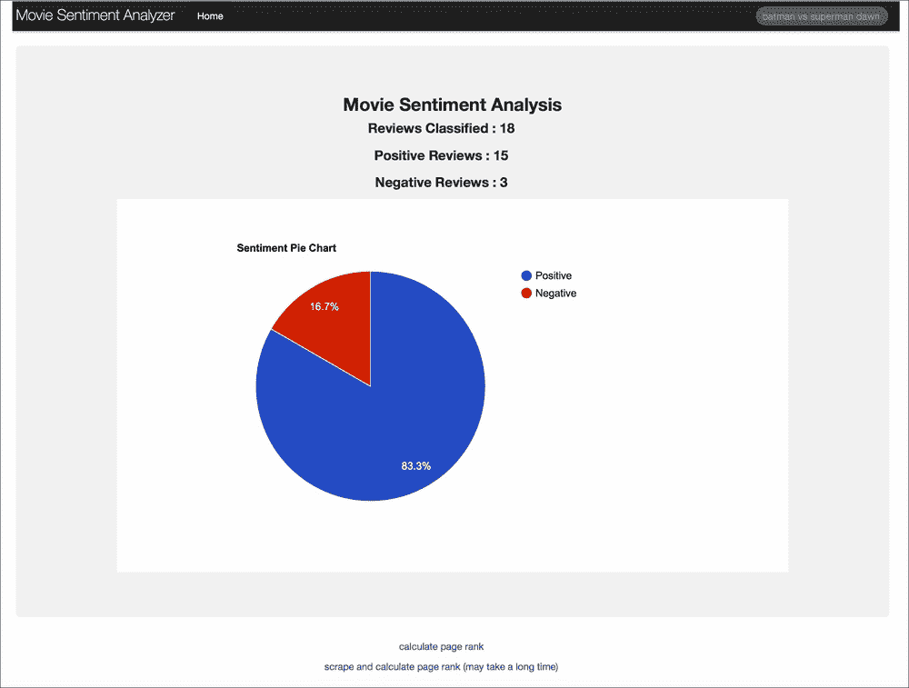
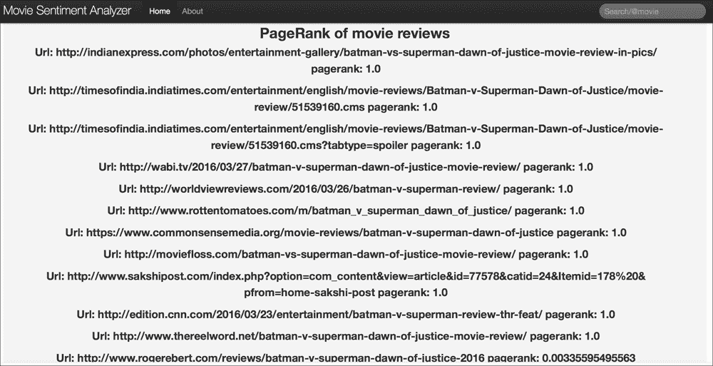
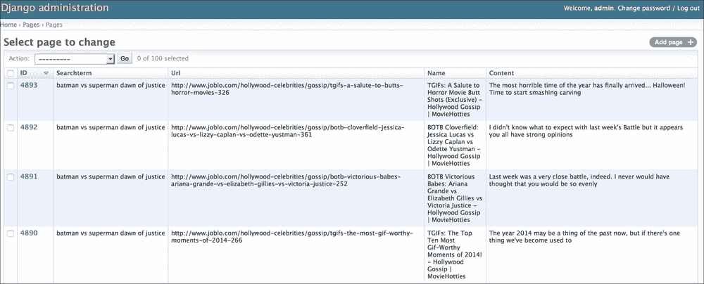

# 第八章。用于电影评论的情感分析器应用

在这一章中，我们描述了一个应用，使用整本书中描述的算法和方法来确定电影评论的情感。此外， **Scrapy** 库将用于通过一个搜索引擎 API (Bing 搜索引擎)收集不同网站的评论。使用报纸库或遵循 HTML 格式页面的一些预定义提取规则来提取电影评论的文本和标题。使用朴素贝叶斯分类器对信息量最大的单词(使用 X *2* 度量)来确定每个评论的情感，其方式与第 4 章、 *Web 挖掘技术*中的方式相同。此外，使用第 4 章、 *Web 挖掘技术*中讨论的[page rank 算法，计算与每个电影查询相关的每个页面的排名](ch04.html "Chapter 4. Web Mining Techniques")完整性。本章将讨论用于构建应用的代码，包括 Django 模型和视图，Scrapy scraper 用于从电影评论的网页中收集数据。我们首先给出一个 web 应用的例子，并解释所使用的搜索引擎 API 以及我们如何将它包含在应用中。然后，我们描述如何收集电影评论，将 Scrapy 库集成到 Django 中，存储数据的模型，以及管理应用的主要命令。本章讨论的所有代码都可以在作者位于[https://GitHub . com/ai 2010/machine _ learning _ for _ the _ web/tree/master/chapter _ 8](https://github.com/ai2010/machine_learning_for_the_web/tree/master/chapter_8)的`chapter_8`文件夹中的 GitHub 资源库中找到。

# 应用使用概述

主页如下:


如果用户想知道评论的观点和相关性，他们可以键入电影名称。例如，我们在下面的截图中寻找*蝙蝠侠大战超人正义黎明*:



应用从 Bing 搜索引擎收集并抓取 18 条评论，并使用 Scrapy 库分析他们的情绪(15 条正面评论和 3 条负面评论)。所有数据都存储在 Django 模型中，准备好用于使用 PageRank 算法计算每个页面的相关性(页面底部的链接如前面的截图所示)。在这种情况下，使用 PageRank 算法，我们得到以下结果:



这是与我们的电影评论搜索最相关的页面的列表，在抓取爬虫上设置深度参数 2(参考下面的部分以获得进一步的细节)。请注意，要获得良好的页面相关性结果，您必须抓取数千个页面(前面的屏幕截图显示了大约 50 个抓取页面的结果)。

为了编写应用，我们照常启动服务器(参见[第 6 章](ch06.html "Chapter 6. Getting Started with Django")、*Django 入门*和[第 7 章](ch07.html "Chapter 7. Movie Recommendation System Web Application")、*电影推荐系统 Web 应用*)和 Django 中的主 app。首先，我们创建一个文件夹来存储我们所有的代码，`movie_reviews_analyzer_app`，然后我们使用下面的命令初始化 Django:

```
mkdir  movie_reviews_analyzer_app
cd  movie_reviews_analyzer_app
django-admin startproject webmining_server
python manage.py startapp startapp pages

```

我们像在[第六章](ch06.html "Chapter 6. Getting Started with Django")*Django*入门*设置*部分、[第七章](ch07.html "Chapter 7. Movie Recommendation System Web Application")的*应用设置*部分、*电影推荐系统 Web 应用*中一样设置`.py`文件中的设置(当然，在这种情况下名称是`webmining_server`而不是`server_movierecsys`)。

情感分析器应用将`.py`文件中的主要视图放在主`webmining_server`文件夹中，而不是我们之前所做的`app` (pages)文件夹中(参见[第 6 章](ch06.html "Chapter 6. Getting Started with Django")、*Django 入门*和[第 7 章](ch07.html "Chapter 7. Movie Recommendation System Web Application")、*电影推荐系统 Web 应用*)，因为这些功能现在更多地指的是服务器的一般功能，而不是特定的应用(pages)。

使 web 服务可操作的最后一个操作是创建一个`superuser`帐户，并与服务器一起运行:

```
python manage.py createsuperuser (admin/admin)
python manage.py runserver

```

既然已经解释了应用的结构，我们可以从用于收集 URL 的搜索引擎 API 开始，更详细地讨论不同的部分。


# 搜索引擎选择和应用代码

由于直接从最相关的搜索引擎如 Google、Bing、Yahoo 和其他搜索引擎抓取违反了他们的服务条款，我们需要从他们的 REST API 中获取初始评论页面(使用抓取服务如 Crawlera、[http://crawlera.com/](http://www.crawlera.com/)也是可能的)。我们决定使用 Bing 服务，它允许每月 5000 次免费查询。

为了做到这一点，我们向微软服务注册，以获得允许搜索所需的密钥。简而言之，我们遵循以下步骤:

1.  在[https://datamarket.azure.com](https://datamarket.azure.com)上在线注册。
2.  在**我的账户**中，取**主账户密钥**。
3.  注册一个新的应用(在**开发者**下)| **注册**；放**雷迪**CT URI:`https://www.``bing.com`

之后，我们可以编写一个函数来检索尽可能多的与我们的查询相关的 URL:

```
num_reviews = 30 
def bing_api(query):
    keyBing = API_KEY        # get Bing key from: https://datamarket.azure.com/account/keys
    credentialBing = 'Basic ' + (':%s' % keyBing).encode('base64')[:-1] # the "-1" is to remove the trailing "\n" which encode adds
    searchString = '%27X'+query.replace(" ",'+')+'movie+review%27'
    top = 50#maximum allowed by Bing

    reviews_urls = []
    if num_reviews<top:
        offset = 0
        url = 'https://api.datamarket.azure.com/Bing/Search/Web?' + \
              'Query=%s&$top=%d&$skip=%d&$format=json' % (searchString, num_reviews, offset)

        request = urllib2.Request(url)
        request.add_header('Authorization', credentialBing)
        requestOpener = urllib2.build_opener()
        response = requestOpener.open(request)
        results = json.load(response)
        reviews_urls = [ d['Url'] for d in results['d']['results']]
    else:
        nqueries = int(float(num_reviews)/top)+1
        for i in xrange(nqueries):
            offset = top*i
            if i==nqueries-1:
                top = num_reviews-offset
                url = 'https://api.datamarket.azure.com/Bing/Search/Web?' + \
                      'Query=%s&$top=%d&$skip=%d&$format=json' % (searchString, top, offset)

                request = urllib2.Request(url)
                request.add_header('Authorization', credentialBing)
                requestOpener = urllib2.build_opener()
                response = requestOpener.open(request) 
            else:
                top=50
                url = 'https://api.datamarket.azure.com/Bing/Search/Web?' + \
                      'Query=%s&$top=%d&$skip=%d&$format=json' % (searchString, top, offset)

                request = urllib2.Request(url)
                request.add_header('Authorization', credentialBing)
                requestOpener = urllib2.build_opener()
                response = requestOpener.open(request) 
            results = json.load(response)
            reviews_urls += [ d['Url'] for d in results['d']['results']]
    return reviews_urls
```

`API_KEY`参数取自微软账户，`query`是指定电影名称的字符串，`num_reviews = 30`是从 Bing API 返回的 URL 总数。有了包含评论的 URL 列表，我们现在可以设置一个 scraper，使用 Scrapy 从每个网页中提取标题和评论文本。


# Scrapy 设置和应用代码

Scrapy 是一个 Python 库，用于从网页中提取内容或抓取链接到给定网页的页面(详见[第 4 章](ch04.html "Chapter 4. Web Mining Techniques")、 *Web 挖掘技术*的 *Web 爬虫(或蜘蛛)*部分)。要安装该库，请在终端中键入以下内容:

```
sudo pip install Scrapy 

```

将可执行文件安装在`bin`文件夹中:

```
sudo easy_install scrapy

```

从`movie_reviews_analyzer_app`文件夹，我们如下初始化我们的 Scrapy 项目:

```
scrapy startproject scrapy_spider

```

该命令将在`scrapy_spider`文件夹中创建以下树:

```
├── __init__.py
├── items.py
├── pipelines.py
├── settings.py
├── spiders
├── spiders
│   ├── __init__.py

```

`pipelines.py`和`items.py`文件管理如何存储和操作抓取的数据，它们将在后面的*蜘蛛*和*集成 Django 和 Scrapy* 部分讨论。`settings.py`文件设置在`spiders`文件夹中定义的每个蜘蛛(或爬虫)用来操作的参数。在接下来的两节中，我们将描述这个应用中使用的主要参数和蜘蛛。

## 刺痒设置

`settings.py`文件收集了 Scrapy 项目中每个蜘蛛抓取网页时使用的所有参数。主要参数如下:

*   `DEPTH_LIMIT`:跟随初始 URL 爬行的后续页面的数量。默认值是`0`，这意味着没有设置限制。
*   `LOG_ENABLED`:执行默认为真时，允许/拒绝 Scrapy 登录终端。
*   `ITEM_PIPELINES = {'scrapy_spider.pipelines.ReviewPipeline': 1000,}`:管道函数的路径，用于操作从每个网页中提取的数据。
*   `CONCURRENT_ITEMS = 200`:流水线中处理的并发项目数。
*   `CONCURRENT_REQUESTS = 5000`:Scrapy 处理的最大并发请求数。
*   `CONCURRENT_REQUESTS_PER_DOMAIN = 3000`:Scrapy 为每个指定域处理的最大并发请求数。

深度越大，刮擦的页面就越多，因此刮擦所需的时间也会增加。为了加速这个过程，可以在最后三个参数上设置较高的值。在这个应用(`spiders`文件夹)中，我们设置了两个爬行器:一个从每个电影评论 URL 提取数据的抓取器(`movie_link_results.py`)和一个生成链接到初始电影评论 URL 的网页图的爬行器(`recursive_link_results.py`)。

## 刮刀

`movie_link_results.py`上的刮刀外观如下:

```
from newspaper import Article
from urlparse import urlparse
from scrapy.selector import Selector
from scrapy import Spider
from scrapy.spiders import BaseSpider,CrawlSpider, Rule
from scrapy.http import Request
from scrapy_spider import settings
from scrapy_spider.items import PageItem,SearchItem

unwanted_domains = ['youtube.com','www.youtube.com']
from nltk.corpus import stopwords
stopwords = set(stopwords.words('english'))

def CheckQueryinReview(keywords,title,content):
 content_list = map(lambda x:x.lower(),content.split(' '))
 title_list = map(lambda x:x.lower(),title.split(' '))
 words = content_list+title_list
 for k in keywords:
 if k in words:
 return True
 return False

class Search(Spider):
 name = 'scrapy_spider_reviews'

 def __init__(self,url_list,search_key):#specified by -a
 self.search_key = search_key
 self.keywords = [w.lower() for w in search_key.split(" ") if w not in stopwords]
 self.start_urls =url_list.split(',')
 super(Search, self).__init__(url_list)

 def start_requests(self):
 for url in self.start_urls:
 yield Request(url=url, callback=self.parse_site,dont_filter=True)

 def parse_site(self, response):
 ## Get the selector for xpath parsing or from newspaper

 def crop_emptyel(arr):
 return [u for u in arr if u!=' ']

 domain = urlparse(response.url).hostname
 a = Article(response.url)
 a.download()
 a.parse()
 title = a.title.encode('ascii','ignore').replace('\n','')
 sel = Selector(response)
 if title==None:
 title = sel.xpath('//title/text()').extract()
 if len(title)>0:
 title = title[0].encode('utf-8').strip().lower()

 content = a.text.encode('ascii','ignore').replace('\n','')
 if content == None:
 content = 'none'
 if len(crop_emptyel(sel.xpath('//div//article//p/text()').extract()))>1:
 contents = crop_emptyel(sel.xpath('//div//article//p/text()').extract())
 print 'divarticle'
 ….
 elif len(crop_emptyel(sel.xpath('/html/head/meta[@name="description"]/@content').extract()))>0:
 contents = crop_emptyel(sel.xpath('/html/head/meta[@name="description"]/@content').extract())
 content = ' '.join([c.encode('utf-8') for c in contents]).strip().lower()

 #get search item 
 search_item = SearchItem.django_model.objects.get(term=self.search_key)
 #save item
 if not PageItem.django_model.objects.filter(url=response.url).exists():
 if len(content) > 0:
 if CheckQueryinReview(self.keywords,title,content):
 if domain not in unwanted_domains:
 newpage = PageItem()
 newpage['searchterm'] = search_item
 newpage['title'] = title
 newpage['content'] = content
 newpage['url'] = response.url
 newpage['depth'] = 0
 newpage['review'] = True
 #newpage.save()
 return newpage 
 else:
 return null

```

我们可以看到来自`scrapy`的`Spider`类被`Search`类继承，必须定义以下标准方法来覆盖这些标准方法:

*   `__init__`:蜘蛛的构造器需要定义`start_urls`列表，该列表包含要从中提取内容的 URL。此外，我们还有自定义变量，如`search_key`和`keywords`，它们存储与搜索引擎 API 上使用的电影名称查询相关的信息。
*   `start_requests`:该函数在`spider`被调用时被触发，它声明对`start_urls`列表中的每个 URL 做什么；对于每个 URL，将调用自定义的`parse_site`函数(而不是默认的`parse`函数)。
*   `parse_site`:从每个 URL 解析数据是一个自定义函数。为了提取评论的标题及其文本内容，我们使用了报纸库(`sudo pip install newspaper`)，或者，如果失败，我们使用一些定义好的规则直接解析 HTML 文件，以避免由于不需要的标签而产生的干扰(每个规则结构都是用`sel.xpath`命令定义的)。为了达到这个结果，我们选择了一些流行的域名(`rottentomatoes`、`cnn`等等)，并确保解析能够从这些网站中提取内容(并非所有的提取规则都显示在前面的代码中，但它们通常可以在 GitHub 文件中找到)。然后使用相关的废料项目和`ReviewPipeline`功能将数据存储在页面`Django`模型中(见下一节)。
*   `CheckQueryinReview`:这是一个自定义函数，用于检查电影标题(来自查询)是否包含在每个网页的内容或标题中。

要运行蜘蛛，我们需要从`scrapy_spider`(内部)文件夹中键入以下命令:

```
scrapy crawl scrapy_spider_reviews -a url_list=listname -a search_key=keyname

```

## 管道

管道定义了当蜘蛛抓取新页面时要做什么。在前面的例子中，`parse_site`函数返回一个`PageItem`对象，它触发下面的管道(`pipelines.py`):

```
class ReviewPipeline(object):
 def process_item(self, item, spider):
 #if spider.name == 'scrapy_spider_reviews':#not working
 item.save()
 return item

```

这个类只是保存每个条目(蜘蛛符号中的一个新页面)。

## 爬虫

正如我们在概述(上一节)中显示的，在我们存储了从评论的 URL 开始的所有链接页面之后，使用 PageRank 算法计算评论的相关性。爬虫`recursive_link_results.py`执行此操作:

```
#from scrapy.spider import Spider
from scrapy.selector import Selector
from scrapy.contrib.spiders import CrawlSpider, Rule
from scrapy.linkextractors import LinkExtractor
from scrapy.http import Request

from scrapy_spider.items import PageItem,LinkItem,SearchItem

class Search(CrawlSpider):
 name = 'scrapy_spider_recursive'

 def __init__(self,url_list,search_id):#specified by -a

 #REMARK is allowed_domains is not set then ALL are allowed!!!
 self.start_urls = url_list.split(',')
 self.search_id = int(search_id)

 #allow any link but the ones with different font size(repetitions)
 self.rules = (
 Rule(LinkExtractor(allow=(),deny=('fontSize=*','infoid=*','SortBy=*', ),unique=True), callback='parse_item', follow=True), 
 )
 super(Search, self).__init__(url_list)

 def parse_item(self, response):
 sel = Selector(response)

 ## Get meta info from website
 title = sel.xpath('//title/text()').extract()
 if len(title)>0:
 title = title[0].encode('utf-8')

 contents = sel.xpath('/html/head/meta[@name="description"]/@content').extract()
 content = ' '.join([c.encode('utf-8') for c in contents]).strip()

 fromurl = response.request.headers['Referer']
 tourl = response.url
 depth = response.request.meta['depth']

 #get search item 
 search_item = SearchItem.django_model.objects.get(id=self.search_id)
 #newpage
 if not PageItem.django_model.objects.filter(url=tourl).exists():
 newpage = PageItem()
 newpage['searchterm'] = search_item
 newpage['title'] = title
 newpage['content'] = content
 newpage['url'] = tourl
 newpage['depth'] = depth
 newpage.save()#cant use pipeline cause the execution can finish here

 #get from_id,to_id
 from_page = PageItem.django_model.objects.get(url=fromurl)
 from_id = from_page.id
 to_page = PageItem.django_model.objects.get(url=tourl)
 to_id = to_page.id

 #newlink
 if not LinkItem.django_model.objects.filter(from_id=from_id).filter(to_id=to_id).exists():
 newlink = LinkItem()
 newlink['searchterm'] = search_item
 newlink['from_id'] = from_id
 newlink['to_id'] = to_id
 newlink.save()

```

来自`scrapy`的`CrawlSpider`类被`Search`类继承，必须定义以下标准方法来覆盖这些标准方法(对于蜘蛛的情况):

*   `__init__`:是类的构造函数。`start_urls`参数定义了蜘蛛开始爬行的起始 URL，直到达到`DEPTH_LIMIT`值。`rules`参数设置允许/拒绝抓取的 URL 的类型(在这种情况下，相同的页面但不同的字体大小被忽略),它定义调用的函数来操作每个检索的页面(`parse_item`)。此外，还定义了一个定制变量`search_id`，它需要在其他数据中存储查询的 ID。
*   `parse_item`:这是一个自定义函数，调用它来存储每个检索页面的重要数据。从每个页面中创建一个新的`Page`模型的 Django 项(见下一节)，它包含页面的标题和内容(使用`xpath` HTML 解析器)。为了执行 PageRank 算法，使用相关的 Scrapy 项将链接到每个页面的页面连接和页面本身保存为`Link`模型的对象(参见以下章节)。

要运行爬虫，我们需要从(internal) `scrapy_spider`文件夹中键入以下内容:

```
scrapy crawl scrapy_spider_recursive -a url_list=listname -a search_id=keyname

```


# Django 车型

使用蜘蛛收集的数据需要存储在数据库中。在 Django 中，数据库表被称为模型，并在`models.py`文件中定义(在`pages`文件夹中)。该文件的内容如下:

```
from django.db import models
from django.conf import settings
from django.utils.translation import ugettext_lazy as _

class SearchTerm(models.Model):
 term = models.CharField(_('search'), max_length=255)
 num_reviews = models.IntegerField(null=True,default=0)
 #display term on admin panel
 def __unicode__(self):
 return self.term

class Page(models.Model):
 searchterm = models.ForeignKey(SearchTerm, related_name='pages',null=True,blank=True)
 url = models.URLField(_('url'), default='', blank=True)
 title = models.CharField(_('name'), max_length=255)
 depth = models.IntegerField(null=True,default=-1)
 html = models.TextField(_('html'),blank=True, default='')
 review = models.BooleanField(default=False)
 old_rank = models.FloatField(null=True,default=0)
 new_rank = models.FloatField(null=True,default=1)
 content = models.TextField(_('content'),blank=True, default='')
 sentiment = models.IntegerField(null=True,default=100)

class Link(models.Model):
 searchterm = models.ForeignKey(SearchTerm, related_name='links',null=True,blank=True)
 from_id = models.IntegerField(null=True)
 to_id = models.IntegerField(null=True)

```

在应用主页上输入的每个电影标题都存储在`SearchTerm`模型中，而每个网页的数据都收集在`Page`模型的一个对象中。除了内容字段(HTML、标题、URL、内容)之外，还记录了评论的情绪和在图形网络中的深度(布尔值还指示网页是电影评论页面还是简单的链接页面)。`Link`模型存储页面之间的所有图形链接，然后由 PageRank 算法用来计算评论网页的相关性。注意`Page`模型和`Link`模型都通过外键链接到相关的`SearchTerm`。像往常一样，要将这些模型写成数据库表，我们键入以下命令:

```
python manage.py makemigrations
python manage.py migrate

```

为了填充这些 Django 模型，我们需要让 Scrapy 与 Django 交互，这是下一节的主题。


# 整合姜戈和 Scrapy

为了使路径更容易调用，我们移除了外部的`scrapy_spider`文件夹，这样在`movie_reviews_analyzer_app`内部，`webmining_server`文件夹与`scrapy_spider`文件夹处于同一层级:

```
├── db.sqlite3
├── scrapy.cfg
├── scrapy_spider
│   ├── ...
│   ├── spiders
│   │   ...
└── webmining_server

```

我们将 Django 路径设置到 Scrapy `settings.py`文件中:

```
# Setting up django's project full path.
import sys
sys.path.insert(0, BASE_DIR+'/webmining_server')
# Setting up django's settings module name.
os.environ['DJANGO_SETTINGS_MODULE'] = 'webmining_server.settings'
#import django to load models(otherwise AppRegistryNotReady: Models aren't loaded yet):
import django
django.setup()

```

现在我们可以安装库，允许从 Scrapy 管理 Django 模型:

```
sudo pip install scrapy-djangoitem

```

在`items.py`文件中，我们将 Django 模型和 Scrapy 项目之间的链接编写如下:

```
from scrapy_djangoitem import DjangoItem
from pages.models import Page,Link,SearchTerm

class SearchItem(DjangoItem):
 django_model = SearchTerm
class PageItem(DjangoItem):
 django_model = Page
class LinkItem(DjangoItem):
 django_model = Link

```

每个类继承了`DjangoItem`类，因此用`django_model`变量声明的原始 Django 模型被自动链接。Scrapy 项目现在已经完成了，所以我们可以继续讨论解释处理 Scrapy 提取的数据的 Django 代码和管理应用所需的 Django 命令。

## 命令(情感分析模型和删除查询)

应用需要管理一些不允许服务的最终用户进行的操作，例如定义一个情感分析模型和删除一个电影的查询以便重做它，而不是从内存中检索现有的数据。以下部分将解释执行这些操作的命令。

## 情感分析模型加载器

这个应用的最终目标是确定电影评论的情绪(积极的或消极的)。为了实现这一点，必须使用一些外部数据来构建情感分类器，，然后将它存储在内存(缓存)中，供每个查询请求使用。这就是下面显示的`load_sentimentclassifier.py`命令的目的:

```
import nltk.classify.util, nltk.metrics
from nltk.classify import NaiveBayesClassifier
from nltk.corpus import movie_reviews
from nltk.corpus import stopwords
from nltk.collocations import BigramCollocationFinder
from nltk.metrics import BigramAssocMeasures
from nltk.probability import FreqDist, ConditionalFreqDist
import collections
from django.core.management.base import BaseCommand, CommandError
from optparse import make_option
from django.core.cache import cache

stopwords = set(stopwords.words('english'))
method_selfeatures = 'best_words_features'

class Command(BaseCommand):
 option_list = BaseCommand.option_list + (
 make_option('-n', '--num_bestwords', 
 dest='num_bestwords', type='int',
 action='store',
 help=('number of words with high information')),)

 def handle(self, *args, **options):
 num_bestwords = options['num_bestwords']
 self.bestwords = self.GetHighInformationWordsChi(num_bestwords)
 clf = self.train_clf(method_selfeatures)
 cache.set('clf',clf)
 cache.set('bestwords',self.bestwords)

```

在文件的开头处，变量`method_selfeatures`设置了特征选择的方法(在这种情况下，特征是评论中的单词；参见[第 4 章](ch04.html "Chapter 4. Web Mining Techniques")、 *Web 挖掘技术*，了解更多细节)用于训练分类器`train_clf`。最佳单词(特征)的最大数量由输入参数`num_bestwords`定义。然后，分类器和最佳特征(`bestwords`)存储在缓存中，以备应用使用(使用`cache`模块)。选择最佳单词(特征)的分类器和方法如下:

```
 def train_clf(method):
 negidxs = movie_reviews.fileids('neg')
 posidxs = movie_reviews.fileids('pos')
 if method=='stopword_filtered_words_features':
 negfeatures = [(stopword_filtered_words_features(movie_reviews.words(fileids=[file])), 'neg') for file in negidxs]
 posfeatures = [(stopword_filtered_words_features(movie_reviews.words(fileids=[file])), 'pos') for file in posidxs]
 elif method=='best_words_features':
 negfeatures = [(best_words_features(movie_reviews.words(fileids=[file])), 'neg') for file in negidxs]
 posfeatures = [(best_words_features(movie_reviews.words(fileids=[file])), 'pos') for file in posidxs]
 elif method=='best_bigrams_words_features':
 negfeatures = [(best_bigrams_words_features(movie_reviews.words(fileids=[file])), 'neg') for file in negidxs]
 posfeatures = [(best_bigrams_words_features(movie_reviews.words(fileids=[file])), 'pos') for file in posidxs]

 trainfeatures = negfeatures + posfeatures
 clf = NaiveBayesClassifier.train(trainfeatures)
 return clf

 def stopword_filtered_words_features(self,words):
 return dict([(word, True) for word in words if word not in stopwords])

 #eliminate Low Information Features
 def GetHighInformationWordsChi(self,num_bestwords):
 word_fd = FreqDist()
 label_word_fd = ConditionalFreqDist()

 for word in movie_reviews.words(categories=['pos']):
 word_fd[word.lower()] +=1
 label_word_fd['pos'][word.lower()] +=1

 for word in movie_reviews.words(categories=['neg']):
 word_fd[word.lower()] +=1
 label_word_fd['neg'][word.lower()] +=1

 pos_word_count = label_word_fd['pos'].N()
 neg_word_count = label_word_fd['neg'].N()
 total_word_count = pos_word_count + neg_word_count

 word_scores = {}
 for word, freq in word_fd.iteritems():
 pos_score = BigramAssocMeasures.chi_sq(label_word_fd['pos'][word],
 (freq, pos_word_count), total_word_count)
 neg_score = BigramAssocMeasures.chi_sq(label_word_fd['neg'][word],
 (freq, neg_word_count), total_word_count)
 word_scores[word] = pos_score + neg_score

 best = sorted(word_scores.iteritems(), key=lambda (w,s): s, reverse=True)[:num_bestwords]
 bestwords = set([w for w, s in best])
 return bestwords

 def best_words_features(self,words):
 return dict([(word, True) for word in words if word in self.bestwords])

 def best_bigrams_word_features(self,words, measure=BigramAssocMeasures.chi_sq, nbigrams=200):
 bigram_finder = BigramCollocationFinder.from_words(words)
 bigrams = bigram_finder.nbest(measure, nbigrams)
 d = dict([(bigram, True) for bigram in bigrams])
 d.update(best_words_features(words))
 return d

```

编写了三个方法来选择前面代码中的单词:

*   `stopword_filtered_words_features`:使用**自然语言工具包** ( **NLTK** )的连词列表删除`stopwords`，并将剩余的视为相关词
*   `best_words_features`:使用*X²度量(`NLTK`库)，选择与正面或负面评论相关的最有信息量的词(参见[第四章](ch04.html "Chapter 4. Web Mining Techniques")、*网络挖掘技术*，了解更多细节)*
*   `best_bigrams_word_features`:使用*X²度量(`NLTK`库)从单词集中找到 200 个最有信息的二元模型(详见*第 4 章*、 *Web 挖掘技术*)*

所选择的分类器是朴素贝叶斯算法(参见[第 3 章](ch03.html "Chapter 3. Supervised Machine Learning")、*监督机器学习*)，标记文本(正面、负面情绪)取自`movie_reviews`的`NLTK.corpus`。要安装它，在 Python 中打开一个终端并从`corpus`安装`movie_reviews`:

```
nltk.download()--> corpora/movie_reviews corpus

```

## 删除已经执行的查询

由于我们可以指定不同的参数(比如特征选择方法、最佳词的数量等等)，我们可能希望使用不同的值来执行和存储评论的情感。为此需要`delete_query`命令，如下所示:

```
from pages.models import Link,Page,SearchTerm
from django.core.management.base import BaseCommand, CommandError
from optparse import make_option

class Command(BaseCommand):
 option_list = BaseCommand.option_list + (
 make_option('-s', '--searchid',
 dest='searchid', type='int',
 action='store',
 help=('id of the search term to delete')),)

 def handle(self, *args, **options):
 searchid = options['searchid']
 if searchid == None:
 print "please specify searchid: python manage.py --searchid=--"
 #list
 for sobj in SearchTerm.objects.all():
 print 'id:',sobj.id,"  term:",sobj.term
 else:
 print 'delete...'
 search_obj = SearchTerm.objects.get(id=searchid)
 pages = search_obj.pages.all()
 pages.delete()
 links = search_obj.links.all()
 links.delete()
 search_obj.delete()

```

如果我们运行命令而没有指定`searchid`(查询的 ID)，那么将会显示所有查询和相关 ID 的列表。之后，我们可以通过键入以下命令来选择要删除的查询:

```
python manage.py delete_query --searchid=VALUE

```

我们可以使用缓存的情感分析模型向用户显示所选电影的在线情感，正如我们在下一节中解释的那样。

## 情感评论分析器–Django 视图和 HTML

本章中解释的大部分代码(命令、Bing 搜索引擎、Scrapy 和 Django 模型)在`views.py`中的函数分析器中使用来驱动*应用使用概述*部分中显示的主页(在将`urls.py`文件中的 URL 声明为`url(r'^$','webmining_server.views.analyzer')`之后)。

```
def analyzer(request):
 context = {}

 if request.method == 'POST':
 post_data = request.POST
 query = post_data.get('query', None)
 if query:
 return redirect('%s?%s' % (reverse('webmining_server.views.analyzer'),
 urllib.urlencode({'q': query}))) 
 elif request.method == 'GET':
 get_data = request.GET
 query = get_data.get('q')
 if not query:
 return render_to_response(
 'movie_reviews/home.html', RequestContext(request, context))

 context['query'] = query
 stripped_query = query.strip().lower()
 urls = []

 if test_mode:
 urls = parse_bing_results()
 else:
 urls = bing_api(stripped_query)

 if len(urls)== 0:
 return render_to_response(
 'movie_reviews/noreviewsfound.html', RequestContext(request, context))
 if not SearchTerm.objects.filter(term=stripped_query).exists():
 s = SearchTerm(term=stripped_query)
 s.save()
 try:
 #scrape
 cmd = 'cd ../scrapy_spider & scrapy crawl scrapy_spider_reviews -a url_list=%s -a search_key=%s' %('\"'+str(','.join(urls[:num_reviews]).encode('utf-8'))+'\"','\"'+str(stripped_query)+'\"')
 os.system(cmd)
 except:
 print 'error!'
 s.delete()
 else:
 #collect the pages already scraped 
 s = SearchTerm.objects.get(term=stripped_query)

 #calc num pages
 pages = s.pages.all().filter(review=True)
 if len(pages) == 0:
 s.delete()
 return render_to_response(
 'movie_reviews/noreviewsfound.html', RequestContext(request, context))

 s.num_reviews = len(pages)
 s.save()

 context['searchterm_id'] = int(s.id)

 #train classifier with nltk
 def train_clf(method):
 ... 
 def stopword_filtered_words_features(words):
 ... 
 #Eliminate Low Information Features
 def GetHighInformationWordsChi(num_bestwords):
 ... 
 bestwords = cache.get('bestwords')
 if bestwords == None:
 bestwords = GetHighInformationWordsChi(num_bestwords)
 def best_words_features(words):
 ... 
 def best_bigrams_words_features(words, measure=BigramAssocMeasures.chi_sq, nbigrams=200):
 ...
 clf = cache.get('clf')
 if clf == None:
 clf = train_clf(method_selfeatures)

 cntpos = 0
 cntneg = 0
 for p in pages:
 words = p.content.split(" ")
 feats = best_words_features(words)#bigram_word_features(words)#stopword_filtered_word_feats(words)
 #print feats
 str_sent = clf.classify(feats)
 if str_sent == 'pos':
 p.sentiment = 1
 cntpos +=1
 else:
 p.sentiment = -1
 cntneg +=1
 p.save()

 context['reviews_classified'] = len(pages)
 context['positive_count'] = cntpos
 context['negative_count'] = cntneg
 context['classified_information'] = True
 return render_to_response(
 'movie_reviews/home.html', RequestContext(request, context))

```

插入的电影标题存储在`query`变量中，并发送给`bing_api`函数以收集评论的 URL。然后调用 Scrapy 来抓取 URL，以找到评论文本，使用`clf`分类器模型和从缓存中检索的所选最具信息性的单词(`bestwords`)来处理评论文本(或者在缓存为空的情况下再次生成相同的模型)。评论的预测情绪计数(`positive_counts`、`negative_counts`和`reviews_classified`)然后被发送回`home.html`(`templates`文件夹)页面，该页面使用以下 Google 饼状图代码:

```
        <h2 align = Center>Movie Reviews Sentiment Analysis</h2>
        <div class="row">
        <p align = Center><strong>Reviews Classified : {{ reviews_classified }}</strong></p>
        <p align = Center><strong>Positive Reviews : {{ positive_count }}</strong></p>
        <p align = Center><strong> Negative Reviews : {{ negative_count }}</strong></p>
        </div> 
  <section>
      <script type="text/javascript" src="img/jsapi"></script>
      <script type="text/javascript">
        google.load("visualization", "1", {packages:["corechart"]});
        google.setOnLoadCallback(drawChart);
        function drawChart() {
          var data = google.visualization.arrayToDataTable([
            ['Sentiment', 'Number'],
            ['Positive',     {{ positive_count }}],
            ['Negative',      {{ negative_count }}]
          ]);
          var options = { title: 'Sentiment Pie Chart'};
          var chart = new google.visualization.PieChart(document.getElementById('piechart'));
          chart.draw(data, options);
        }
      </script>
        <p align ="Center" id="piechart" style="width: 900px; height: 500px;display: block; margin: 0 auto;text-align: center;" ></p>
      </div>
```

函数`drawChart`调用 Google `PieChart`可视化函数，该函数将数据(正计数和负计数)作为输入来创建饼图。要了解 HTML 代码如何与 Django 视图交互的更多细节，请参考*HTML 网页背后的 URL 和视图*部分的[第 6 章](ch06.html "Chapter 6. Getting Started with Django")、*Django 入门*。从带有观点计数的结果页面(参见*应用使用概述*部分)，可以使用页面底部的两个链接之一来计算抓取评论的 PagerRank 相关性。这个操作背后的 Django 代码将在下一节讨论。


# PageRank: Django 视图和算法代码

为了对在线评论的重要性进行排名，我们在应用中实现了 PageRank 算法(参见[第 4 章](ch04.html "Chapter 4. Web Mining Techniques")、 *Web 挖掘技术*，在*排名:PageRank 算法*部分)。`webmining_server`文件夹内`pgrank`文件夹中的`pgrank.py`文件实现如下算法:

```
from pages.models import Page,SearchTerm

num_iterations = 100000
eps=0.0001
D = 0.85

def pgrank(searchid):
 s = SearchTerm.objects.get(id=int(searchid))
 links = s.links.all()
 from_idxs = [i.from_id for i in links ]
 # Find the idxs that receive page rank 
 links_received = []
 to_idxs = []
 for l in links:
 from_id = l.from_id
 to_id = l.to_id
 if from_id not in from_idxs: continue
 if to_id  not in from_idxs: continue
 links_received.append([from_id,to_id])
 if to_id  not in to_idxs: to_idxs.append(to_id)

 pages = s.pages.all()
 prev_ranks = dict()
 for node in from_idxs:
 ptmp  = Page.objects.get(id=node)
 prev_ranks[node] = ptmp.old_rank

 conv=1.
 cnt=0
 while conv>eps or cnt<num_iterations:
 next_ranks = dict()
 total = 0.0
 for (node,old_rank) in prev_ranks.items():
 total += old_rank
 next_ranks[node] = 0.0

 #find the outbound links and send the pagerank down to each of them
 for (node, old_rank) in prev_ranks.items():
 give_idxs = []
 for (from_id, to_id) in links_received:
 if from_id != node: continue
 if to_id  not in to_idxs: continue
 give_idxs.append(to_id)
 if (len(give_idxs) < 1): continue
 amount = D*old_rank/len(give_idxs)
 for id in give_idxs:
 next_ranks[id] += amount
 tot = 0
 for (node,next_rank) in next_ranks.items():
 tot += next_rank
 const = (1-D)/ len(next_ranks)

 for node in next_ranks:
 next_ranks[node] += const

 tot = 0
 for (node,old_rank) in next_ranks.items():
 tot += next_rank

 difftot = 0
 for (node, old_rank) in prev_ranks.items():
 new_rank = next_ranks[node]
 diff = abs(old_rank-new_rank)
 difftot += diff
 conv= difftot/len(prev_ranks)
 cnt+=1
 prev_ranks = next_ranks

 for (id,new_rank) in next_ranks.items():
 ptmp = Page.objects.get(id=id)
 url = ptmp.url

 for (id,new_rank) in next_ranks.items():
 ptmp = Page.objects.get(id=id)
 ptmp.old_rank = ptmp.new_rank
 ptmp.new_rank = new_rank
 ptmp.save()

```

此代码获取与给定的`SearchTerm`对象相关联的所有链接存储，并在时间 *t* 实现每页 *i* 的 PageRank 分数，其中 *P(i)* 由递归等式给出:


这里， *N* 是总页数，(*N[j]是页面 *j* 的出链接数)如果页面 *j* 指向*I*；否则， *N* 为`0`。参数 *D* 是所谓的**阻尼因子**(在前面的代码中设置为 0.85)，它表示遵循转移矩阵 *A* 给出的转移的概率。方程被迭代，直到满足收敛参数`eps`或达到最大迭代次数`num_iterations`。在显示电影评论的观点后，通过点击`home.html`页面底部的**抓取并计算页面排名(可能需要很长时间)**或**计算页面排名**链接来调用该算法。链接链接到`views.py`中的函数`pgrank_view`(通过`urls.py: url(r'^pg-rank/(?P<pk>\d+)/','webmining_server.views.pgrank_view', name='pgrank_view')`中声明的 URL):*

```
def pgrank_view(request,pk): 
 context = {}
 get_data = request.GET
 scrape = get_data.get('scrape','False')
 s = SearchTerm.objects.get(id=pk)

 if scrape == 'True':
 pages = s.pages.all().filter(review=True)
 urls = []
 for u in pages:
 urls.append(u.url)
 #crawl
 cmd = 'cd ../scrapy_spider & scrapy crawl scrapy_spider_recursive -a url_list=%s -a search_id=%s' %('\"'+str(','.join(urls[:]).encode('utf-8'))+'\"','\"'+str(pk)+'\"')
 os.system(cmd)

 links = s.links.all()
 if len(links)==0:
 context['no_links'] = True
 return render_to_response(
 'movie_reviews/pg-rank.html', RequestContext(request, context))
 #calc pgranks
 pgrank(pk)
 #load pgranks in descending order of pagerank
 pages_ordered = s.pages.all().filter(review=True).order_by('-new_rank')
 context['pages'] = pages_ordered

 return render_to_response(
 'movie_reviews/pg-rank.html', RequestContext(request, context)) 

```

这段代码调用爬虫收集所有链接到评论的页面，并使用前面讨论的代码计算 PageRank 分数。然后，分数会显示在`pg-rank.html`页面中(按页面排名分数降序排列)，如本章的*应用使用概述*部分所示。因为这个函数可能需要很长时间来处理(抓取数千个页面)，所以编写了命令`run_scrapelinks.py`来运行 Scrapy crawler(作为一个练习，请读者按照自己喜欢的方式阅读或修改脚本)。


# 管理和 API

作为本章的最后一部分，我们简要描述了模型的一些可能的管理和 API 端点的实现，以检索应用处理的数据。在`pages`文件夹中，我们可以在`admin.py`文件中设置两个管理界面来检查`SearchTerm`和`Page`模型采集的数据:

```
from django.contrib import admin
from django_markdown.admin import MarkdownField, AdminMarkdownWidget
from pages.models import SearchTerm,Page,Link

class SearchTermAdmin(admin.ModelAdmin):
 formfield_overrides = {MarkdownField: {'widget': AdminMarkdownWidget}}
 list_display = ['id', 'term', 'num_reviews']
 ordering = ['-id']

class PageAdmin(admin.ModelAdmin):
 formfield_overrides = {MarkdownField: {'widget': AdminMarkdownWidget}}
 list_display = ['id', 'searchterm', 'url','title','content']
 ordering = ['-id','-new_rank']

admin.site.register(SearchTerm,SearchTermAdmin)
admin.site.register(Page,PageAdmin)
admin.site.register(Link)

```

注意`SearchTermAdmin`和`PageAdmin`都显示 ID 递减的对象(在`PageAdmin`的情况下显示`new_rank`)。下面的截图就是一个例子:



注意虽然不是必须的，`Link`模型也被包含在管理界面(`admin.site.register(Link)`)中。更有趣的是，我们可以设置一个 API 端点来检索与电影标题相关的情感计数。在 pages 文件夹内的`api.py`文件中，我们可以有以下内容:

```
from rest_framework import views,generics
from rest_framework.permissions import AllowAny
from rest_framework.response import Response
from rest_framework.pagination import PageNumberPagination
from pages.serializers import SearchTermSerializer
from pages.models import SearchTerm,Page

class LargeResultsSetPagination(PageNumberPagination):
 page_size = 1000
 page_size_query_param = 'page_size'
 max_page_size = 10000

class SearchTermsList(generics.ListAPIView):

 serializer_class = SearchTermSerializer
 permission_classes = (AllowAny,)
 pagination_class = LargeResultsSetPagination

 def get_queryset(self):
 return SearchTerm.objects.all() 

class PageCounts(views.APIView):

 permission_classes = (AllowAny,)
 def get(self,*args, **kwargs):
 searchid=self.kwargs['pk']
 reviewpages = Page.objects.filter(searchterm=searchid).filter(review=True)
 npos = len([p for p in reviewpages if p.sentiment==1])
 nneg = len(reviewpages)-npos
 return Response({'npos':npos,'nneg':nneg})

```

`PageCounts`类将搜索的 ID(电影的标题)作为输入，并返回对电影的评论的意见，即正面和负面的计数。要从电影的标题中获取`earchTerm`的 ID，您可以查看管理界面或者使用其他 API 端点`SearchTermsList`；这只是返回电影标题列表以及相关的 ID。串行器设置在`serializers.py`文件上:

```
from pages.models import SearchTerm
from rest_framework import serializers

class SearchTermSerializer(serializers.HyperlinkedModelSerializer):
 class Meta:
 model = SearchTerm
 fields = ('id', 'term')

```

为了调用这些端点，我们可以再次使用 swagger 接口(参见[第 6 章](ch06.html "Chapter 6. Getting Started with Django")、*Django 入门*)或者在终端中使用`curl`命令来进行这些调用。例如:

```
curl -X GET localhost:8000/search-list/
{"count":7,"next":null,"previous":null,"results":[{"id":24,"term":"the martian"},{"id":27,"term":"steve jobs"},{"id":29,"term":"suffragette"},{"id":39,"term":"southpaw"},{"id":40,"term":"vacation"},{"id":67,"term":"the revenant"},{"id":68,"term":"batman vs superman dawn of justice"}]}

```

和

```
curl -X GET localhost:8000/pages-sentiment/68/
{"nneg":3,"npos":15}

```


# 总结

在本章中，我们描述了一个电影评论情感分析器 web 应用，以使您熟悉我们在[第 3 章](ch03.html "Chapter 3. Supervised Machine Learning")、*监督机器学习*、[第 4 章](ch04.html "Chapter 4. Web Mining Techniques")、 *Web 挖掘技术*和[第 6 章](ch06.html "Chapter 6. Getting Started with Django")、*Django 入门*中讨论的一些算法和库。

这是一个旅程的终点:通过阅读本书并使用提供的代码进行实验，您应该已经获得了关于当今商业环境中使用的最重要的机器学习算法的重要实用知识。

通过阅读这本书，你应该已经准备好使用 Python 和一些机器学习算法来开发你自己的 web 应用和想法了。当今的现实世界中存在许多与数据相关的挑战性问题，等待着那些能够掌握并应用本书所讨论的材料的人去解决，而你，已经到了这一步，肯定是那些人中的一员。