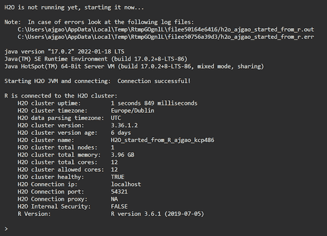
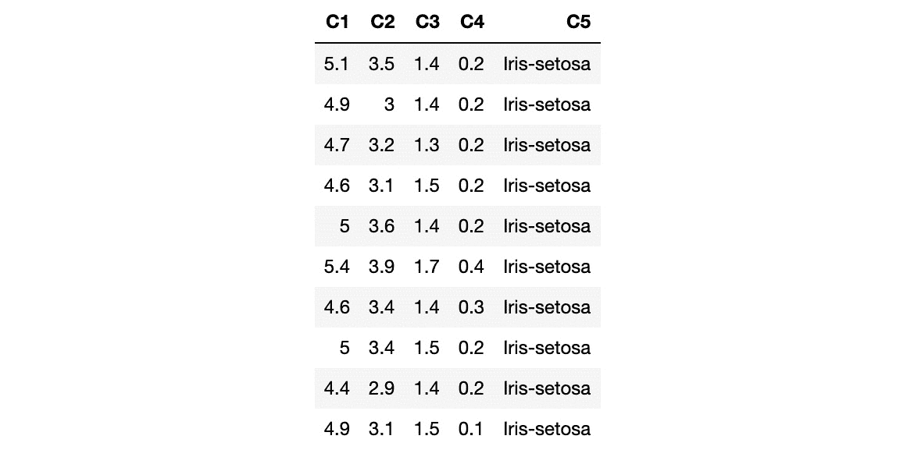
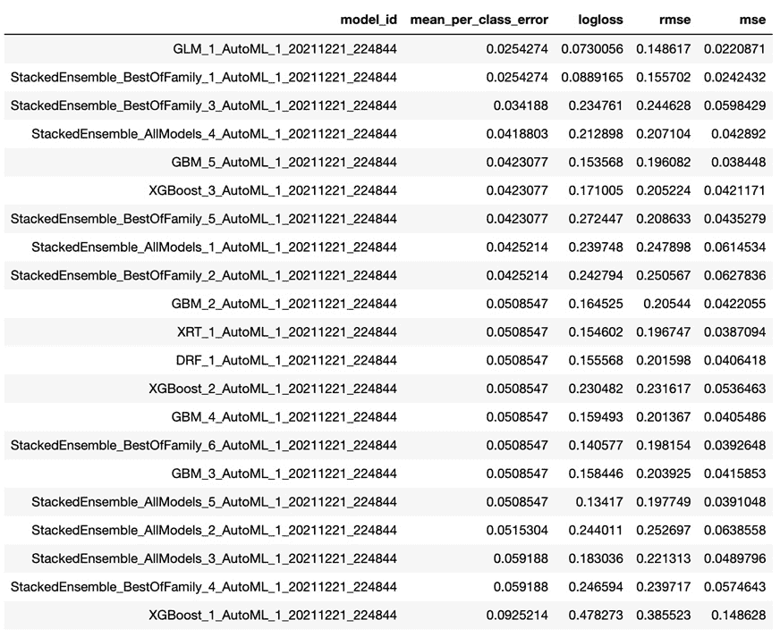
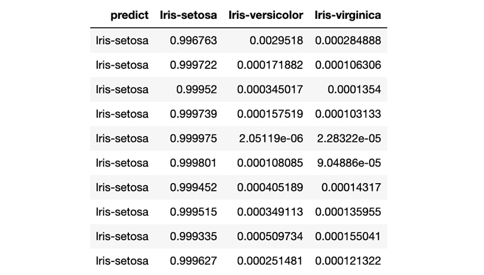
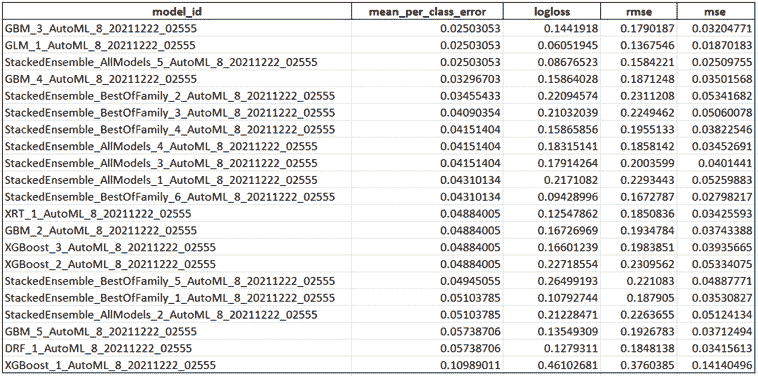

# 1

# 了解 H2O 汽车基础知识

**机器学习** ( **ML** )是使用计算机系统建立分析或统计模型的过程，该系统从历史数据中学习并识别其中的模式。然后，这些系统使用这些模式，并试图做出预测性决策，从而为企业和研究提供价值。然而，实现可以提供任何具体值的 ML 系统所需的复杂数学知识已经阻止了一些人对它进行实验，留下了大量他们本可以从中受益的未发现的潜力。

**自动化机器学习** ( **AutoML** )是最新的 ML 技术之一，加速了各种规模的组织对 ML 的采用。它是 ML 生命周期中所有这些复杂任务的自动化过程。AutoML 隐藏了所有这些复杂性，并在幕后实现了自动化。这使得任何人都可以轻松地实现 ML，没有任何麻烦，并且更加关注结果。

在这一章中，我们将通过 H2O . ai([https://www.h2o.ai/](https://www.h2o.ai/))了解一种这样的 AutoML 技术，简称为 H2O AutoML。我们将提供 AutoML 的简史和它解决的问题，以及一点关于 H2O.ai 和它的 H2O AutoML 技术。然后，我们将使用 H2O 的 AutoML 技术编写一个简单的 ML 实现，并构建我们的第一个 ML 模型。

到本章结束时，你会明白 AutoML 到底是什么，公司 H2O.ai，以及它的技术 H2O AutoML。您还将了解使用 H2O AutoML 的最低要求，以及使用 H2O AutoML 训练您的第一个 ML 模型是多么容易，而无需了解任何复杂的数学火箭科学。

在本章中，我们将讨论以下主题:

*   了解 AutoML 和 H2O AutoML
*   使用 H2O 汽车的最低系统要求
*   安装 Java
*   使用 Python 实现 H2O 的基本方法
*   使用 R 的 H2O 的基本实现
*   使用 H2O AutoML 训练你的第一个 ML 模型

# 技术要求

对于本章，您将需要以下内容:

*   一个像样的网络浏览器(Chrome、Firefox 或 Edge)，您首选的网络浏览器的最新版本。
*   您选择的一个集成开发环境
*   Jupyter 项目的 Jupyter 笔记本([https://jupyter.org/](https://jupyter.org/))(可选)

本章的所有代码示例都可以在 GitHub 上找到，网址是[https://GitHub . com/packt publishing/Practical-Automated-Machine-Learning-on-H2O/tree/main/Chapter % 201](https://github.com/PacktPublishing/Practical-Automated-Machine-Learning-on-H2O/tree/main/Chapter%201)。

# 了解 AutoML 和 H2O AutoML

在我们开始 H2O AutoML 的旅程之前，了解 AutoML 到底是什么以及它在整个 ML 管道中扮演什么角色是很重要的。在这一节中，我们将试图理解 ML 管道中涉及的各个步骤，以及 AutoML 在其中的位置。然后，我们将探索是什么使 H2O 的 AutoML 在各种 AutoML 技术中如此独特。

让我们从学习一些关于 AutoML 的一般知识开始。

## 汽车

AutoML 是在开发一个可行的 ML 预测系统时，将各个步骤自动化的过程。典型的 ML 管道由以下步骤组成:

1.  **数据收集**:这是 ML 管道中的第一步。数据是从各种来源收集的。这些源可以生成不同类型的数据，例如分类数据、数字数据、文本数据、时间序列数据，甚至是视觉和听觉数据。所有这些类型的数据都根据需求聚合在一起，并合并到一个公共结构中。这可能是逗号分隔的值文件、拼花文件，甚至是数据库中的表。
2.  **数据探索**:一旦收集了数据，就使用基本的分析技术对其进行探索，以确定它包含什么，数据的完整性和正确性，以及数据是否显示了可以建立模型的潜在模式。
3.  **数据准备**:缺失值、重复值和噪声数据都会影响模型的质量，因为它们会引入不正确的学习。因此，需要对收集和探测的原始数据进行预处理，以使用特定的数据处理方法消除所有异常。
4.  **数据转换**:许多 ML 模型使用不同类型的数据。有些可以处理分类数据，而有些只能处理数值数据。这就是为什么您可能需要将某些类型的数据从一种形式转换成另一种形式。这允许数据集在模型训练期间被适当地馈送。
5.  **模型选择**:一旦数据集准备好，选择一个 ML 模型进行训练。模型的选择基于数据集包含的数据类型、要从数据集中提取的信息以及哪个模型适合该数据。
6.  **模特培训**:这里是模特接受培训的地方。ML 系统将从处理过的数据集学习并创建模型。这种训练会受到几个因素的影响，例如数据属性权重、学习率和其他超参数。
7.  **超参数调整**:除了模型训练，另一个需要考虑的因素是模型的架构。模型的架构取决于所使用的算法类型，例如随机森林中的树的数量或神经网络中的神经元的数量。我们无法立即知道哪种架构对于给定的模型是最佳的，因此需要进行实验。定义模型架构的参数称为超参数；找到超参数值的最佳组合被称为**超参数调整**。
8.  **预测**:ML 流水线的最后一步是预测。根据模型在训练期间学习到的数据集中的模式，模型现在可以对看不见的数据进行广义预测。

对于非专家来说，所有这些步骤及其复杂性可能会让人不知所措。ML 管道流程中的每一步都经过了多年的研究，其中包含大量的主题。AutoML 是将这些步骤中的大部分自动化的过程，从数据探索到超参数调整，并提供最佳的可能模型来进行预测。这有助于公司专注于用结果解决现实世界的问题，而不是 ML 过程和工作流。

现在，您已经了解了 ML 管道中的不同步骤以及 AutoML 如何实现这些步骤的自动化，让我们看看为什么 H2O 的 AutoML 技术是业界领先的技术之一。

## H2O 汽车公司

H2O AutoML 是由 H2O.ai 开发的 AutoML 软件技术，它通过提供用户友好的界面来简化 ML 系统的开发，帮助非专家进行 ML 实验。它是一个内存中、分布式、快速、可扩展的 ML 和分析平台，可处理大数据，可用于满足企业需求。

它是用 Java 编写的，使用键值存储来访问数据、模型和其他相关的 ML 对象。它运行在集群系统上，并使用多线程 MapReduce 框架来并行化数据操作。与它交流也很容易，因为它使用简单的 REST APIs。最后，它有一个 web 界面，提供了数据和模型细节的详细图形视图。

H2O AutoML 不仅自动化了 ML 生命周期中涉及的大部分复杂步骤，而且它还为专家数据科学家提供了很大的灵活性来实现专门的模型训练过程。H2O AutoML 提供了一个简单的包装函数，它封装了几个模型训练任务，否则编排起来会很复杂。它还具有广泛的可解释功能，可以描述模型训练生命周期的各种细节。这提供了模型的易于导出的细节，用户可以使用这些细节来解释已经被训练的模型的性能和合理性。

H2O 汽车最好的部分是它完全是开源的。你可以在 https://github.com/h2oai 的[找到 H2O 的源代码。它由服务于开源和闭源公司的开发人员社区积极维护。在撰写本文时，它正处于其第三个主要版本，这表明它是一项相当成熟的技术，并且是功能密集型的——也就是说，它支持世界上的几家主要公司。它还支持几种编程语言，包括 R、Scala、Python 和 Java，可以在几种操作系统上运行，并为 ML](https://github.com/h2oai) 生命周期中涉及的各种数据源提供支持，如 Hadoop 分布式文件系统、Hive、亚马逊 S3，甚至 **Java 数据库连接** ( **JDBC** )。

现在您已经了解了 AutoML 的基础知识以及 H2O AutoML 的强大功能，让我们来看看运行 H2O AutoML 而不出现任何性能问题的系统的最低要求是什么。

# 使用 H2O 汽车的最低系统要求

H2O 非常容易安装，但需要满足某些最低标准要求，才能平稳高效地运行。以下是 H2O 在硬件功能以及其他软件支持方面的一些最低要求:

*   H2O 要求的最低硬件如下:
    *   **内存** : H2O 运行在内存架构上，因此它受到使用它的系统的物理内存的限制。因此，为了能够处理大量数据，系统的内存越大越好。
    *   **中央处理器** ( **CPU** ):默认情况下，H2O 将使用系统的最大可用 CPU。但是，至少需要 4 个 CPU。
    *   **图形处理单元** ( **GPU** ):如果 GPU 是 NVIDIA GPU(GPU Cloud、DGX 站、DGX-1 或 DGX-2)或者是 CUDA 8 GPU，则 GPU 支持仅适用于 AutoML 中的 XGBoost 型号。
*   支持 H2O 的操作系统如下:
    *   **Ubuntu 12.04**
    *   **OS X 10.9 或更高版本**
    *   **Windows 7 或更高版本**
    *   **CentOS 6 或更高版本**
*   支持 H2O 的编程语言如下:
    *   Java:Java 对于 H2O 来说是强制性的。H2O 需要 64 位 JDK 来构建 H2O，需要 64 位 JRE 来运行其二进制文件:
        *   **支持的 Java 版本** : Java SE 15、14、13、12、11、10、9 和 8
    *   **其他语言**:仅当 H2O 在这些环境中运行时，才需要以下语言:
        *   Python 2.7.x、3.5.x 或 3.6.x
        *   Scala 2.10 或更高版本
        *   r 版本 3 或更高版本
*   **附加要求**:只有在这些环境中运行 H2O 时，才需要满足以下要求:
    *   **Hadoop** : Cloudera CDH 5.4 或更高版本，Hortonworks HDP 2.2 或更高版本，MapR 4.0 或更高版本，或者 IBM 开放平台 4.2
    *   **康达** : 2.7、3.5 或 3.6
    *   **Spark** :版本 2.1、2.2 或 2.3

一旦我们有了一个满足最低要求的系统，我们需要关注 H2O 对其他软件的功能依赖。H2O 只有一个依赖，那就是 Java。让我们看看为什么 Java 对 H2O 如此重要，以及我们如何下载和安装正确的受支持的 Java 版本。

# 安装 Java

H2O 的核心代码是用 Java 写的。它需要在您的系统中安装 **Java 运行时环境** ( **JRE** )来启动 H2O 服务器集群。H2O 还以多线程的方式训练所有的 ML 算法，在 MapReduce 框架之上使用 Java Fork/Join 框架。因此，强烈推荐使用与 H2O 兼容的最新 Java 版本来流畅地运行 H2O。

你可以从 https://www.oracle.com/java/technologies/downloads/安装最新稳定的 Java 版本。

安装 Java 时，了解您的系统运行在哪个位版本上是很重要的。如果是 64 位版本，请确保为您的操作系统安装 64 位 Java 版本。如果是 32 位的，那么就用 32 位版本吧。

现在我们已经安装了正确的 Java 版本，我们可以下载并安装 H2O。让我们看一个简单的例子来说明如何使用 Python 来实现这一点。

# 使用 Python 基本实现 H2O

Python 是计算机编程的 ML 领域最流行的语言之一。它被广泛应用于各行各业，拥有大量积极维护的 ML 库，为创建 ML 管道提供了大量支持。

我们将从安装 Python 编程语言开始，然后使用 Python 安装 H2O。

## 安装 Python

安装 Python 非常简单。无论是 Python 2.7 还是 Python 3 或更高版本都没有关系，因为 H2O 可以很好地使用这两个版本的语言。然而，如果您使用的是比 Python 2.7 更老的版本，那么您将需要升级您的版本。

最好使用 Python 3，因为它是当前的标准，而 Python 2.7 已经过时了。除了 Python，你还需要`pip`，Python 的包管理器。现在，让我们学习如何在各种操作系统上安装 Python:

*   在 Linux 上(Ubuntu、Mint、Debian):
    *   对于 Python 2.7，在系统终端运行以下命令:

        ```
        sudo apt-get python-pip 
        ```

    *   对于 Python 3，在系统终端运行以下命令:

        ```
        sudo apt-get python3-pip
        ```

*   在 macOS 上:macOS 版本 10.8 预装了 Python 2.7。如果你想安装 Python 3，那就去 https://python.org，去**下载**版块，下载最新版本的 Python 3 for macOS。
*   在 Windows 上:与 macOS 不同，Windows 没有预装任何 Python 语言支持。你需要从 https://python.org[下载一个用于 Windows 的 Python 安装程序。安装程序将取决于您的 Windows 操作系统，即它是 64 位还是 32 位。](https://python.org)

现在你知道如何安装正确版本的 Python，让我们使用 Python 下载并安装 H2O Python 模块。

## 使用 Python 安装 H2O

H2O 在 Python 包索引中提供了一个 Python 模块。要安装`h2o` Python 模块，您需要做的就是在您的终端中执行以下命令:

```
pip install h2o
```

差不多就是这样。

要测试它是否已成功下载和安装，请按照下列步骤操作:

1.  打开您的 Python 终端。
2.  通过运行以下命令导入`h2o`模块:

    ```
    import h2o
    ```

3.  通过运行以下命令来初始化 H2O，以启动本地的`h2o`服务器:

    ```
    h2o.init()
    ```

下面的截图显示了初始化`h2o`后应该得到的结果:


图 1.1–使用 Python 执行 H2O

让我们快速查看一下我们得到的输出。首先，它运行成功，因此任务完成。

在通过读取输出日志来执行`h2o.init()`之后，您将看到 H2O 检查了在本地主机上是否已经有一个运行在端口 54321 上的 H2O 服务器实例。在这个场景中，之前没有运行任何 H2O 服务器实例，所以 H2O 尝试在同一个端口上启动一个本地服务器。如果它已经在端口上找到了一个已经存在的本地 H2O 实例，那么它将在任何进一步的 H2O 命令执行中重用同一个实例。

然后，它使用 Java 版本 16 来启动 H2O 实例。您可能会看到不同的 Java 版本，这取决于您在系统中安装的版本。

接下来，您将看到启动服务器的`h2o jar`文件的位置，接着是 **Java 虚拟机** ( **JVM** )日志的位置。

一旦服务器启动并运行，它会显示托管在您系统上的本地 H2O 服务器的 URL 以及 H2O Python 库与服务器的连接状态。

最后，您将看到一些关于服务器配置的基本元数据。该元数据可能与您在执行中看到的略有不同，因为它在很大程度上取决于您的系统规范。例如，默认情况下，H2O 将使用系统中所有可用的内核进行处理。因此，如果您有一个 8 核系统，那么`H2O_cluster_allowed_cores`属性值将是`8`。或者，如果您决定只使用四个内核，那么您可以执行`h2o.init(nthreads=4)`来只使用四个内核，在服务器配置输出中反映同样的情况。

现在你已经知道了如何使用 Python 实现 H2O，让我们学习如何在 R 编程语言中做同样的事情。

# 使用 R 的 H2O 的基本实现

R 编程语言是 ML 和数据科学领域非常流行的语言，因为它广泛支持统计和数据操作。它被数据科学家和数据挖掘者广泛用于开发分析软件。

我们将从安装 R 编程语言开始，然后使用 R 安装 H2O

## 安装 R

一个国际开发团队维护 R 编程语言。他们有一个专门的 R 编程语言网页，名为**综合 R 档案网**(**CRAN**):[https://cran.r-project.org/](https://cran.r-project.org/)。安装 R 有不同的方式，这取决于你使用的操作系统:

*   在 Linux 上(Ubuntu、Mint、Debian):

在系统终端中执行以下命令:

```
sudo apt-get install r-base
```

*   在 macOS 上:要安装 R，请转到[https://cran.r-project.org/](https://cran.r-project.org/)，转到**下载 R for macOS** 超链接，并下载 R for macOS 的最新版本。
*   在 Windows 上:类似于你在 macOS 上安装 R 的方法，你可以从[https://cran.r-project.org/](https://cran.r-project.org/)下载`.exe`文件，进入**下载 R for Windows** 超链接，下载 R for Windows 的最新版本。

在 macOS 和 Windows 上安装 R 的另一个好方法是通过 RStudio。RStudio 简化了支持 R 的软件的安装，通常也是一个非常好的 R 编程 IDE。你可以从[https://www.rstudio.com/](https://www.rstudio.com/)下载 R studio。

现在你知道了如何安装正确的 R 版本，让我们使用 R 编程语言下载并安装 H2O R 包。

## 使用 R 安装 H2O

与 Python 类似，H2O 也为 R 编程语言提供了支持。

要安装 R 包，请按照下列步骤操作:

1.  首先，我们需要下载 H2O R 包的依赖项。为此，在您的 R 终端中执行以下命令:

    ```
    install.packages(c("RCurl", "jsonlite"))
    ```

2.  然后，要安装实际的`h2o`包，在您的 R 终端中执行以下命令:

    ```
    install.packages("h2o")
    ```

你完了。

1.  要测试它是否已经成功下载和安装，打开您的 R 终端，导入`h2o`库，并执行`h2o.init()`命令。这将启动一个本地 H2O 服务器。

结果可以在下面的截图中看到:



图 1.2–使用 R 的 H2O 执行

让我们快速查看一下我们得到的输出。

在执行`h2o.init()`之后，H2O 客户端将检查系统上是否已经有一个 H2O 服务器实例在运行。默认情况下，H2O 服务器通常在本地端口 54321 上运行。如果它在端口上找到了一个已经存在的本地 H2O 实例，那么它将重用同一个实例。然而，在这个场景中，没有任何 H2O 服务器实例在端口 54321 上运行，这就是为什么 H2O 试图在同一个端口上启动一个本地服务器。

接下来，您将看到 JVM 日志的位置。服务器启动并运行后，H2O 客户端会尝试与其连接，并显示与服务器的连接状态。最后，您将看到一些关于服务器配置的基本元数据。该元数据可能与您在执行中看到的略有不同，因为它在很大程度上取决于您的系统规范。例如，默认情况下，H2O 将使用系统中所有可用的内核进行处理。因此，如果您有一个 8 核系统，那么`H2O_cluster_allowed_cores`属性值将是`8`。或者，如果您决定只使用四个内核，那么您可以执行`h2o.init(nthreads=4)`命令来只使用四个内核，从而在服务器配置输出中反映相同的内容。

现在你知道了如何使用 Python 和 R 实现 H2O，让我们创建我们的第一个 ML 模型，并使用 H2O AutoML 对其进行预测。

# 使用 H2O AutoML 训练你的第一个 ML 模型

所有的 ML 管道，无论是否自动化，最终都遵循本章*了解 AutoML 和 H2O AutoML* 一节中讨论的相同步骤。

对于这个实现，我们将使用Iris flower 数据集。这个数据集可以在[https://archive.ics.uci.edu/ml/datasets/iris](https://archive.ics.uci.edu/ml/datasets/iris)找到。

## 了解鸢尾花数据集

Iris flower 数据集，也称为 Fisher 的 Iris 数据集，是最受欢迎的多变量数据集之一，即数据集中有两个或更多变量，在模型训练期间对每个观察值进行分析。该数据集由三种不同品种的鸢尾花的 50 个样本组成。数据集中的要素包括花瓣和萼片的长度和宽度，单位为厘米。由于数据集的简单性，它经常被用来研究 ML 中的各种分类技术。通过使用花瓣和萼片的长度和宽度作为确定鸢尾花种类的特征来进行分类。

下面的屏幕截图显示了数据集的一个小样本:



图 1.3–虹膜数据集

数据集中的列表示以下内容:

*   **C1** :萼片长度，单位为厘米
*   **C2** :萼片宽度，单位为厘米
*   **C3** :花瓣长度厘米
*   **C4** :花瓣宽度厘米
*   **C5** :等级:
    *   鸢尾属
    *   虹膜变色
    *   鸢尾-弗吉尼亚

在这个场景中， **C1** 、 **C2** 、 **C3** 和 **C4** 代表用于确定 **C5** 鸢尾花的种类的特征。

现在您已经理解了我们将要使用的数据集的内容，让我们实现我们的模型训练代码。

## 模特培训

**模型训练**是为给定的最大似然算法寻找偏差和权重的最佳组合的过程，以便最小化损失函数。**损失函数**是一种测量预测值与实际值相差多远的方法。因此，最小化它表明模型越来越接近做出准确的预测——换句话说，它在学习。ML 算法构建了数据集中各种要素与目标标注之间关系的数学表示。然后，我们使用这种数学表示来预测目标标签对于某些特征值的潜在值。预测值的准确性在很大程度上取决于数据集的质量，以及针对模型训练期间使用的要素的权重和偏差的组合。然而，所有这些都是由 AutoML 完全自动化的，因此，不是我们所关心的。

记住这一点，让我们学习如何使用 Python 中的 H2O 快速而轻松地创建 ML 模型。

### Python 中的模型训练和预测

H2O Python 模块使得在 Python 程序中使用 H2O 变得容易。H2O Python 模块中内置的函数简单易用，隐藏了使用 H2O 的许多复杂性。

按照以下步骤使用 H2O AutoML 训练你的第一个 Python 模型:

1.  导入 H2O 模块:

    ```
    import h2o
    ```

2.  初始化 H2O 以启动本地 H2O 服务器:

    ```
    h2o.init()
    ```

`h2o.init()`命令启动或重用在本地端口 54321 上运行的 H2O 服务器实例。

1.  现在，您可以使用`h2o.import_file()`命令导入数据集，同时将数据集的位置传递到您的系统中。
2.  接下来，通过传递您下载数据集

    ```
    data = h2o.import_file("Dataset/iris.data")
    ```

    的位置来导入数据集
3.  现在，您需要确定数据框的哪些列是特征，哪些是标签。一个`C1`、`C2`、`C3`、`C4`和`C5`——作为特性列表:

    ```
    features = data.columns
    ```

4.  基于我们的数据框架，`C5`列表示鸢尾花的种类，是我们希望在模型被训练后最终预测的列。因此，我们将`C5`标记为标签，并将其从剩余的列名集中移除，我们将这些列名记为特性。设置目标标签并将其从功能列表中移除:

    ```
    label = "C5" features.remove(label)
    ```

5.  将数据帧分为训练和测试数据帧:

    ```
    train_dataframe, test_dataframe = data.split_frame([0.8])
    ```

`data.split_frame([0.8])`命令将数据帧一分为二——一个训练数据帧和另一个测试数据帧。训练数据帧包含 80%的数据，而测试数据帧包含剩余的 20%。我们将使用训练数据框架来训练模型，并使用测试数据框架在模型经过训练后运行预测，以测试模型的表现。

小费

如果您对 H2O 如何基于比率分割数据集以及它如何在不同分割之间随机化数据感到好奇，请随意使用来探索和试验`split_frame`函数。你可以在 https://docs . H2O . ai/H2O/latest-stable/H2O-py/docs/_ modules/H2O/frame . XHTML # H2 of frame . split _ frame 找到更多详情。

1.  初始化 H2O AutoML 对象。这里，我们将`max_model`参数设置为`10`以限制将由 H 2O 训练的模型数量，将 AutoML 设置为`10`，并将随机`seed`生成器设置为`1` :

    ```
    aml=h2o.automl.H2OAutoML(max_models=10, seed = 1)
    ```

2.  现在，通过使用`aml.train()`命令传入特征列(即`C1`、`C2`、`C3`和`C4`)(在 *x* )、标签列`C5`(在 *y* )和`train_dataframe`数据帧来触发 AutoML 训练。这是 H2O 开始自动模型训练的时候。
3.  使用 H2O AutoML 对象训练模型:

    ```
    aml.train(x = features, y = label, training_frame = train_dataframe)
    ```

在培训期间，H2O 将分析标签列的类型。对于数字标签，H2O 将最大似然问题视为回归问题。如果标签是分类的，那么它就把这个问题当作一个分类问题。对于 Iris flower 数据集，`C5`列是包含类值的分类值。H2O 将分析该列，并正确地识别出它是一个分类问题，并训练分类模型。

H2O 汽车公司使用不同类型的最大似然算法在幕后训练几个模型。在测试数据集上评估所有已训练的模型，并测量它们的性能。H2O 还提供了所有模型的详细信息，用户可以使用这些信息来进一步实验数据或比较不同的最大似然算法，并了解哪些更适合解决他们的最大似然问题。H2O 最终可以培训 20-30 名模特，这可能需要一段时间。然而，由于我们已经将`max_models`参数作为`10`传递，我们正在限制将被训练的模型的数量，以便我们可以快速看到训练过程的输出。更多关于集成学习的内容将在第 5 章 、*了解 AutoML 算法*中讨论。

1.  一旦训练完成，AutoML 就会为它训练过的所有模型创建一个排行榜，从表现最好到最差对它们进行排名。这种排序是通过比较所有模型的误差度量来实现的。**误差度量**是测量模型在用实际标签值对样本测试数据集进行预测时产生多少误差的值。较低的误差度量表示该模型在预测过程中产生的误差较少，这表明与具有较高误差度量的模型相比，它是一个更好的模型。提取 AutoML 排行榜:

    ```
    model_leaderboard = aml.leaderboard
    ```

2.  显示 AutoML 排行榜:

    ```
    model_leaderboard.head(rows=model_leaderboard.nrows)
    ```

排行榜将如下所示:



图 1.4-H2O 汽车排行榜(Python)

排行榜包括的以下详细信息:

*   `model_id`:这代表型号的 ID。
*   `mean_per_class_error`:此指标用于测量多类数据集中每个类的平均误差。
*   `logloss`:此指标用于测量每个实例的校正预测概率对数的负平均值。
*   **均方根误差** ( **RMSE** ):该指标用于衡量预测误差的标准差。
*   **均方误差** ( **MSE** ):该指标用于测量误差平方的平均值。

排行榜根据特定的默认指标对模型进行排序，具体取决于 ML 问题的类型，除非在 AutoML 培训中特别提到。排行榜根据用于多项式分类的`mean_per_class_error`和用于回归的**偏差**对模型进行分类。

这些指标是对模型性能误差的不同测量。因此，误差值越小，模型就越有利于做出准确的预测。我们将在 [*第 6 章*](B17298_06.xhtml#_idTextAnchor129) 、*了解 H2O 汽车排行榜和其他绩效指标*中探讨不同的车型绩效指标。

在这种情况下，`GLM_1_AutoML_1_20211221_224844`是根据 H2O 汽车公司的最佳模型，因为它是多项式分类问题，并且该模型具有最低的`mean_per_class_error`。

您可能会注意到，尽管将`max_model`值作为`10`传递，但当触发 AutoML 进行训练时，我们会在排行榜中看到 10 多个模型。这是因为只训练了 10 个模型；其余型号为堆叠整体型号。 **Stacked Ensemble** 模型是根据其他模型所学到的知识而创建的模型，并且没有经过正常意义上的技术培训。我们将在 [*第 5 章*](B17298_05.xhtml#_idTextAnchor109) 、*了解 AutoML 算法*中了解更多关于堆叠集成模型的信息，并在 [*第 6 章*](B17298_06.xhtml#_idTextAnchor129) 、*了解 H2O AutoML 排行榜和其他性能指标*中了解更多关于排行榜的信息。

恭喜你！您已经使用 H2O AutoML 正式训练了您的第一个 ML 模型，现在它已准备好用于进行预测。

做出预测非常简单:我们将使用从`data.split_frame([0.8])`命令创建的`test_dataframe`数据帧。

在 Python 中执行以下命令:

```
aml.predict(test_dataframe)
```

就是这样——一切都包装在模型对象的`predict`函数中。

执行预测后，您将看到以下结果:



图 1.5-H2O 汽车模型预测(Python)

预测结果显示了一个表，其中每一行都是测试数据帧中存在的行的预测的表示。`predict`列表示该行的虹膜类别，而剩余的列是虹膜类别的计算概率，如列名所示，由模型在读取该行的特征值后计算。简而言之，模型预测对于*第 1 行*，有 *99.6763%* 的几率是鸢尾。

恭喜你！现在，您已经使用 AutoML 使用新训练的模型做出了准确的预测。

既然我们已经看到了在 Python 中使用 H2O AutoML 是多么容易，让我们学习如何在 R 编程语言中做同样的事情。

### R 中的模型训练和预测

与 Python 类似，使用 R 编程语言中的 H2O AutoML 训练和进行预测也非常容易。H2O 对 R 编程语言有很多支持，因此，在现成的函数后面封装了很多 ML 的复杂性。

让我们看一个模型训练的例子，它在 Iris flower 数据集上使用 R 编程语言中的 H2O AutoML。

你会注意到 R 中的训练模型类似于我们在 Python 中的训练方式，唯一的区别是语法上的细微变化。

请遵循以下步骤:

1.  导入`H2O`库:

    ```
    library(h2o)
    ```

2.  初始化 H2O 以启动本地 H2O 服务器:

    ```
    h2o.init()
    ```

`h2o.init()`将启动一个在端口 54321 上本地运行的 H2O 服务器实例，并连接到它。如果 H2O 服务器已经存在于同一个端口上，那么它将重用它。

1.  使用`h2o.importFile(“Dataset/iris.data”)`导入数据集，同时将数据集在系统中的位置作为参数传递。导入数据集:

    ```
    data <- h2o.importFile("Dataset/iris.data")
    ```

2.  现在，您需要设置数据帧的哪一列是特征，哪一列是标签。将`C5`列设置为目标标签，其余列名设置为特征列表:

    ```
    label <- "C5" features <- setdiff(names(data), label)
    ```

3.  将数据帧分成两部分:

    ```
    parts <- h2o.splitFrame(data, 0.8)
    ```

一个数据框架将用于训练，而另一个将用于测试/验证被训练的模型。`parts <- h2o.splitFrame(data, 0.8)`将数据帧分成两部分。一个数据帧包含 80%的数据，而另一个包含剩余的 20%。现在，将包含 80%数据的数据帧指定为训练数据帧，将另一个数据帧指定为测试或验证数据帧。

1.  将第一部分指定为训练数据帧:

    ```
    train_dataframe <- parts[[1]]
    ```

2.  将第二部分指定为测试数据帧:

    ```
    test_dataframe <- parts[[2]]
    ```

3.  既然数据集已经导入，其特征和标签也已经确定，让我们将它们传递给 H2O 的 AutoML 来训练模型。这意味着您可以使用`h2o.automl()`在 R 中实现 AutoML 模型训练函数。使用 H2O AutoML:

    ```
    aml <- h2o.automl(x = features, y = label, training_frame = train_dataframe, max_models=10, seed = 1)
    ```

    训练模型
4.  提取 AutoML 排行榜:

    ```
    model_leaderboard <- aml@leaderboard
    ```

5.  显示 AutoML 排行榜:

    ```
    print(model_leaderboard, n = nrow(model_leaderboard))
    ```

训练结束后，AutoML 将为所有训练过的模型创建一个排行榜，从表现最好到最差进行排名。

排行榜将显示如下结果:



图 1.6-H2O 汽车排行榜(R)

排行榜包括的详细信息与我们在 Python 中训练模型时在排行榜中看到的相同。

然而，你可能会注意到排行榜中推荐的最佳型号与我们在之前的实验中得到的型号不同。

在这种情况下，`GBM_3_AutoML_8_20211222_02555`是 H2O 汽车公司的最佳车型，而在之前的实验中，它是`GLM_1_AutoML_1_20211221_224844`。这可能是由于几个因素，例如在模型训练期间为种子值生成了不同的随机数，或者在两个实验之间的训练和测试数据帧上分割了不同的数据值。这就是 ML 的棘手之处——您在模型训练管道中执行的每一步都会极大地影响您训练的模型的整体性能。最终，ML 是做出最准确预测的最佳方法。

祝贺你——你已经正式使用 H2O 自动建模语言 r 训练了你的 ML 模型。现在，让我们学习如何对它进行预测。我们将使用 split 函数后创建的测试数据框架对我们训练的模型进行预测。

在 R 中执行以下命令进行预测:

```
predictions <- h2o.predict(aml, test_dataframe)
```

`h2o`对象的`predict`函数接受两个参数。一个是模型对象，在我们的例子中是`aml`对象，而另一个是用于进行预测的数据框架。默认情况下，`aml`对象将使用排行榜中的最佳模型进行预测。

执行预测后，您将看到以下结果:


图 1.7-H2O 汽车模型预测(R)

结果显示了一个表，其中的细节与我们在之前的 Python 实验中看到的相似。每一行都是对测试数据帧中存在的行的预测的表示。`predict`列表示该行的虹膜类别，而其余列是虹膜类别的计算概率。

祝贺您——您已经使用 AutoML in R 使用您新训练的模型对做出了准确的预测。现在，让我们总结一下这一章。

# 总结

在这一章中，我们了解了 ML 管道中的各个步骤，以及 AutoML 如何在自动化这些步骤中发挥作用。然后，我们通过安装基本要求来准备我们的系统以使用 H2O AutoML。一旦我们的系统准备就绪，我们就用 Python 和 R 实现了一个简单的应用程序，它使用 H2O AutoML 在 Iris flower 数据集上训练一个模型。最后，我们理解了排行榜结果，并在我们刚刚训练的 ML 模型上做出了成功的预测。所有这些都有助于我们测试 H2O 汽车，从而为 H2O 汽车更先进的理念打开大门。

在下一章中，我们将探索 H2O 的 web **用户界面** ( **UI** )，以便我们可以使用交互式视觉界面来理解和观察各种 ML 细节。