<title>Chapter 4: Understanding H2O AutoML Architecture and Training</title>

# 4

# 了解 H2O 汽车架构和培训

模型训练是**机器学习** ( **ML** )流水线的核心组成部分之一。这是流水线中系统读取和理解数据集中模式的一步。这种学习输出数据集中不同要素与目标值之间关系的数学表示。系统读取和分析数据的方式取决于所使用的 ML 算法及其复杂性。这就是 ML 的主要复杂性所在。每种 ML 算法都有自己解释数据和从中获取信息的方式。每个 ML 算法都旨在优化某些度量，同时权衡某些偏差和方差。H2O 汽车公司的自动化使这个概念变得更加复杂。对于许多工程师来说，试图理解这是如何工作的可能是压倒性的。

不要因为这种复杂性而气馁。所有复杂的系统都可以分解成简单的组件。理解这些组件以及它们之间的相互作用有助于我们从整体上理解系统。同样，在本章中，我们将打开黑盒，即 H2O 的 AutoML 服务，并试图了解是什么样的魔力使 ML 的自动化成为可能。我们将首先了解 H2O 的建筑。我们将把它分解成简单的部分，然后理解 H2O 的各个部分之间发生了什么样的相互作用。稍后，我们将了解 H2O AutoML 如何训练如此多的模型，并能够优化它们的超参数以获得最佳模型。

在本章中，我们将讨论以下主题:

*   观察 H2O 高层建筑
*   了解客户端和 H2O 服务之间的交互流
*   了解 H2O 汽车公司如何进行超参数优化和训练

所以，让我们先从了解 H2O 的建筑开始。

# 观察 H2O 高层建筑

要深入研究 H2O 技术，我们首先需要了解它的高层架构。它不仅会帮助我们理解组成 H2O 人工智能堆栈的不同软件组件是什么，还会帮助我们理解这些组件如何相互作用以及它们的依赖性。

考虑到这一点，我们来看看 H2O AI 高层架构，如下图所示:

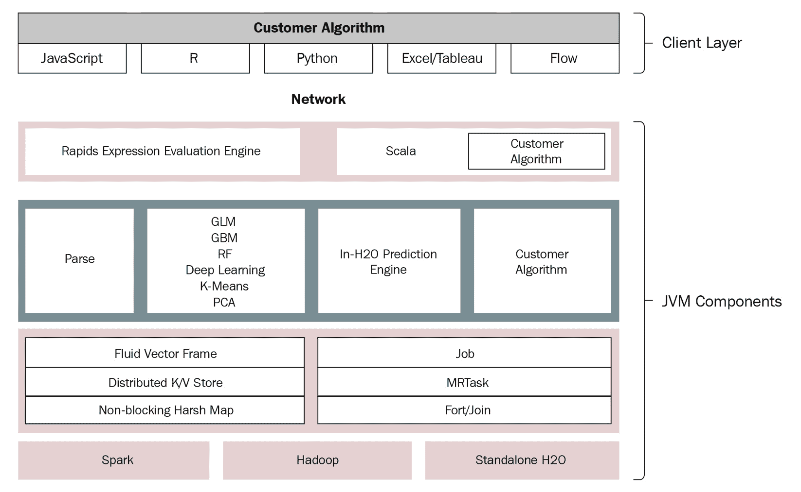

图 4.1–H2O 人工智能高层架构

H2O 人工智能架构在概念上分为两个部分，每个部分在软件栈中服务于不同的目的。这些部分如下:

*   **客户端层**–这一层指向与 H2O 服务器通信的客户端代码。
*   **Java 虚拟机** ( **JVM** ) **组件**——这一层表示 H2O 服务器及其 JVM 组件的所有，负责 H2O AI 的不同功能，包括 AutoML。

客户端和 JVM 组件层被**网络层**分开。网络层只不过是普通的互联网，请求是通过互联网发送的。

让我们深入每一层，以便更好地理解它们的功能，从第一层开始，客户端层。

## 观察客户端层

客户端层包含所有安装在系统中的客户端代码。您使用该软件程序向 H2O 服务器发送请求，以执行您的洗钱活动。下图显示了 H2O 高层架构的客户端层:


图 4.2-H2O 高层架构的客户端层

每种受支持的语言都有自己的 H2O 客户端代码，这些代码安装在各自语言的脚本中并在其中使用。所有客户端代码都通过一个套接字连接上的 REST API 与 H2O 服务器进行内部通信。

以下 H2O 客户端适用于相应的语言:

*   **JavaScript** : H2O 的嵌入式 web UI 是用 JavaScript 写的。当您启动 H2O 服务器时，它会启动一个托管在 http://localhost:54321 上的 JavaScript web 客户端。您可以使用 web 浏览器登录到该客户端，并与 H2O 服务器通信，以执行您的 ML 活动。JavaScript 客户端通过 REST API 与 H2O 服务器通信。
*   `library(h2o)`然后使用导入的`H2O`变量导入数据集和训练模型。这是与初始化的 H2O 服务器交互的 R 客户机，它使用 REST API 来完成这一任务。
*   `import h2o`然后使用导入的`H2O`变量来命令 H2O 服务器。这是使用 REST API 与 H2O 服务器交互的 Python 客户端。
*   **Excel** :微软 Excel 是微软为 Windows、macOS、Android、iOS 开发的电子表格软件。H2O 也支持微软 Excel，因为它是使用最广泛的处理大量二维数据的电子表格软件。这些数据非常适合分析和 ML。还有一个用于 Microsoft Excel 的 H2O 客户端，使 Excel 用户能够通过 Excel 客户端使用 H2O 进行洗钱活动。
*   **Tableau** : Tableau 是一款交互式数据可视化软件，帮助数据分析师和科学家以图形和图表的形式可视化数据，这些图形和图表本质上是交互式的。H2O 支持 Tableau，因此有一个专门的 Tableau 客户端，为 Tableau 获取的数据添加 ML 功能。
*   **流程**:如 [*第二章*](B17298_02.xhtml#_idTextAnchor038) 所示，*与 H2O 流程(H2O 的 Web UI)* 一起工作，H2O 流程是 H2O 的 Web 用户界面，具有在笔记本式界面中设置整个 ML 生命周期的所有功能能力。这个接口在内部运行在 JavaScript 上，同样通过标准的 REST API 与 H2O 服务器通信。

下图显示了不同的 H2O 客户端与同一个 H2O 服务器的交互:

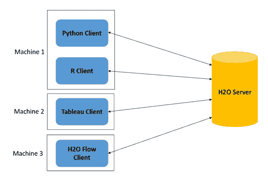

图 4.3–不同的客户端与同一个 H2O 服务器通信

正如您在图中看到的，所有不同的客户端都可以与 H2O 服务器的同一个实例通信。这使得单个 H2O 服务器能够为用不同语言编写的不同软件产品提供服务。

这涵盖了客户端层的内容；让我们向下移动到 H2O 的高层架构中的下一层，即 JVM 组件层。

## 观察 JVM 组件层

JVM 是一个运行时引擎，它在你的系统中运行 Java 程序。H2O 云服务器运行在多个 **JVM 进程**上，也称为 **JVM 节点**。每个 JVM 节点运行 H2O 软件栈的特定组件。

下图显示了组成 H2O 服务器的各种 JVM 组件:

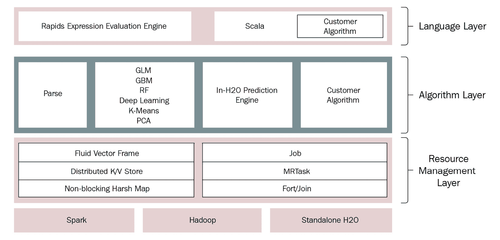

图 4.4–H2O JVM 组件层

如前面的图所示，JVM 节点进一步分为三个不同的层，如下所示:

*   库是一个代码库，它访问专用的领域特定语言，用户可以用它来编写自己的程序和 H2O 可以使用的算法。
*   ****算法层**:该层包含了 H2O 提供的所有内置的 ML 算法。这一层中的 JVM 进程负责执行所有的 ML 活动，比如导入数据集、解析、计算各个 ML 算法的数学以及模型的整体训练。这一层还有预测引擎，其流程使用训练好的模型执行预测和评分功能。任何导入 H2O 的定制算法也位于这一层，JVM 进程像其他算法一样处理执行。**
***   ****资源管理层**:该层包含所有 JVM 进程，负责在执行 ML 活动时有效管理系统资源，如内存和 CPU。****

 ****这一层中的一些 JVM 进程如下:

*   **流体矢量帧**:帧，也称为数据帧，是 H2O 的基本数据存储对象。Fluid Vector 是一个由 H2O.ai 的工程师创造的术语，指向一种有效的(或者换句话说，流动的)方式，与数据工程领域中的数据帧相比，通过这种方式可以添加、更新或删除数据帧中的列，在数据工程领域中，它们通常被认为本质上是不可变的。
*   **分布式键值存储**:键值存储或数据库是一个数据存储系统，它被设计为使用索引键从分布式存储系统中高效快速地检索数据或值。H2O 在其集群中使用这种分布式键值内存存储来实现快速存储和查找。
*   **非阻塞散列表**:通常在数据库中提供**原子性、一致性、隔离性和持久性** ( **ACID** )属性，当对数据执行更新时，使用锁定来锁定数据。这阻止了多个进程访问同一个资源。H2O 使用非阻塞 HashMap，它是 ConcurrentHashMap 的一个实现，具有更好的伸缩能力。
*   **作业**:在编程中，作业只不过是由软件完成的一大块工作，而只为一个目的服务。H2O 使用一个作业管理器来协调各种执行复杂任务(如数学计算)的作业，提高效率并减少 CPU 资源消耗。
*   MRTask : H2O 使用它自己的内存 MapReduce 任务来执行它的 ML 活动。MapReduce 是一种编程模型，用于通过在分布式集群上并行执行任务来处理大量计算或数据读写。MapReduce 有助于系统比顺序计算更快地执行计算活动。
*   **Fork/Join** : H2O 使用一个名为 **jsr166y** 的修改后的 Java 并发库来执行任务的并发执行。jsr166y 是一个非常轻量级的任务执行框架，它使用 **Fork** ，其中流程将任务分解为更小的子任务，并使用 **Join** ，其中流程将子任务的结果连接在一起，以获得任务的最终输出。

整个 JVM 组件层位于 **Spark** 和 **Hadoop** 数据处理系统之上。JVM 层中的组件利用这些数据处理集群管理引擎来支持集群计算。

这概括了 H2O 软件技术的整个高层架构。记住这个背景，让我们进入下一部分，在这里我们将理解客户端和 H2O 之间的交互流程，以及客户端-服务器交互如何帮助我们执行 ML 活动。

# 了解客户端和 H2O 服务之间的交互流程

在 [*第 1 章*](B17298_01.xhtml#_idTextAnchor017) 、*了解 H2O AutoML 基础知识*和 [*第 2 章*](B17298_02.xhtml#_idTextAnchor038) 、*使用 H2O 流(H2O 的 Web UI)* 中，我们看到了如何向 H2O 发送命令以导入数据集或训练模型。让我们试着理解当您向 H2O 服务器发送请求时，在幕后发生了什么，从数据接收开始。

## 了解数据摄取期间 H2O 客户端与服务器的交互

系统接收数据的过程与我们在现实生活中阅读一本书的方式相同:我们打开书，开始一行一行地阅读。类似地，当您希望您的程序读取存储在系统中的数据集时，您将首先通知程序数据集的位置。然后，程序将打开文件，开始逐行读取数据的字节，并将其存储在 ram 中。然而，ML 中的顺序数据读取类型的问题是，ML 中的数据集往往很大。此类数据通常被称为大数据，其容量可能从千兆字节到兆兆兆字节不等。一个系统读取如此大量的数据，无论它有多快，都需要大量的时间。这是 ML 管道没有的时间，因为 ML 管道的目的是进行预测。如果做决定的时间已经过去，这些预测就没有任何价值。例如，如果您设计了一个安装在汽车上的 ML 系统，该系统在检测到碰撞可能性时会自动停止汽车，那么如果 ML 系统花费所有时间读取数据，并且在碰撞发生前来不及做出预测，那么它将毫无用处。

这就是**并行计算**或**集群计算**发挥作用的地方。一个**集群**不过是通过网络连接在一起的多个进程，就像一个单一实体一样运行。集群计算的主要目标是使用这些多个进程并行化长时间运行的顺序任务，以快速完成任务。正是由于这个原因，集群计算在 ML 管道中扮演着非常重要的角色。H2O 也正确地使用集群来接收数据。

让我们观察数据接收交互请求如何从 H2O 客户端流向 H2O 服务器，以及 H2O 如何接收数据。

参考下图了解数据摄取交互的流程:

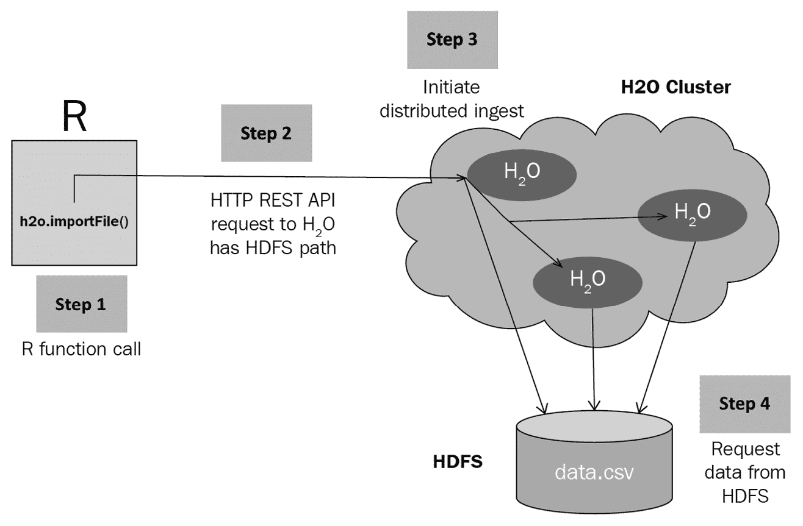

图 4.5–H2O 数据接收请求交互流程

以下一系列步骤描述了 H2O 如何使用 **Hadoop 分布式文件系统** ( **HDFS** )来处理客户端向 H2O 集群服务器发出的摄取数据的请求:

1.  **发出请求**:一旦 H2O 集群服务器启动并运行，使用 H2O 客户端的用户发出指向数据集位置的数据摄取函数调用(参见*图 4.5* 中的**步骤 1** )。Python 中的函数调用如下:

    ```
    h2o.import_file("Dataset/iris.data")
    ```

H2O 客户端将从函数调用中提取数据集位置，并在内部创建一个 REST API 请求(参见*图 4.5* 中的**步骤 2** )。然后，客户端将通过网络将请求发送到托管 H2O 服务器的 IP 地址。

1.  **H2O 服务器处理请求**:一旦 H2O 集群服务器收到来自客户端的 HTTP 请求，它将从请求中提取数据集位置路径值，并启动分布式数据集摄取过程(参见*图 4.5* 中的**步骤 3** )。然后，集群节点将协调并并行化从给定路径读取数据集的任务(参见*图 4.5* 中的**步骤 4** )。

每个节点将读取数据集的一部分，并将其存储在其集群内存中。

1.  **数据的摄取**:从数据集位置路径读取的数据将被分块存储在分布式 H2OFrame 集群内存中(参见*图 4.6* 中的**步骤 1** )。数据块存储在分布式键值存储中(参见*图 4.6* 中的**步骤 2** )。一旦数据被完全摄取，H2O 服务器将创建一个指针，指向存储在键值存储中的摄取的数据集，并将它返回给请求客户端(参见**图 4.6 中的*步骤 3*** )。

参考下图，了解一旦数据被接收且 H2O 返回响应时的交互流程:

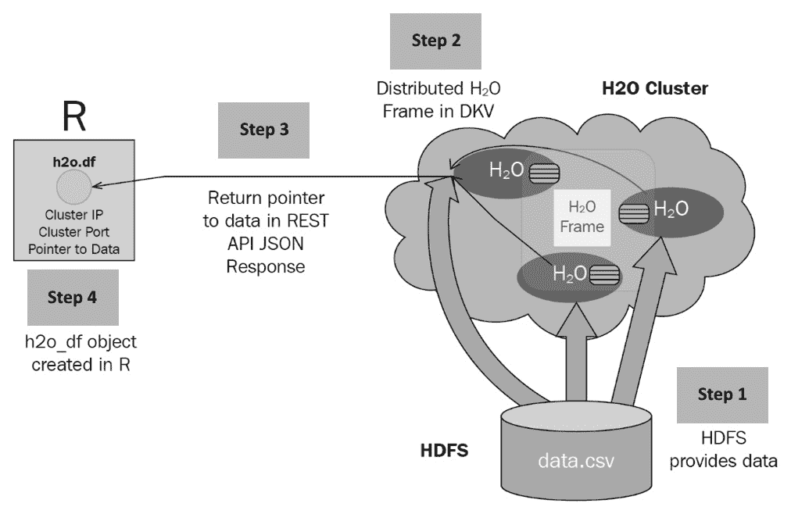

图 4.6–H2O 数据接收响应交互流程

一旦客户端收到响应，它将创建一个包含该指针的 DataFrame 对象，用户随后可以使用该对象对摄取的数据集运行任何进一步的执行(参见*图 4.6* 中的**步骤 4** )。这样，通过使用指针和分布式键值存储，H2O 可以对数据帧进行操作和使用，而不需要在服务器和客户端之间传输大量数据。

既然我们已经了解了 H2O 是如何接收数据的，现在让我们来看看它是如何处理模型训练请求的。

## 在模型训练期间了解 H2O 的互动顺序

在模型训练期间，从用户发出模型训练请求到用户获得训练好的 ML 模型，会发生大量的交互。H2O 的各个组成部分使用一系列协调的消息和预定的作业来执行模型训练活动。

为了更好地理解当模型训练请求被发送到 H2O 服务器时内部发生了什么，我们需要深入研究模型训练期间发生的交互序列。

我们将通过如下分类来理解相互作用的顺序:

1.  客户开始模特培训工作。
2.  H2O 负责模特培训工作。
3.  客户端轮询作业完成状态。
4.  客户端查询型号信息。

所以，让我们首先从了解客户开始模特培训工作时会发生什么开始。

### 客户开始模特培训工作

当客户第一次向 H2O 发送模特培训请求时，模特培训工作开始。

以下序列图向您展示了当客户发送模型培训请求时，在 H2O 内部发生的交互序列:

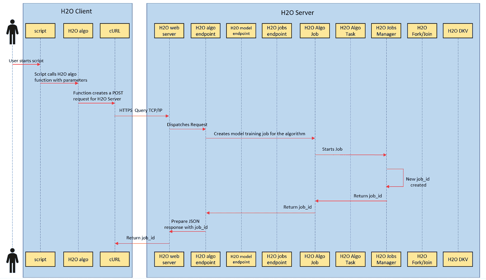

图 4.7-模型培训请求中的交互顺序

在模型训练请求期间，会出现以下一组序列:

1.  用户首先运行一个包含所有指令和函数调用的脚本，向 H2O 发出一个模型训练请求。
2.  该脚本包含一个模型训练函数调用及其相应的参数。这也包括以类似方式执行的 H2O AutoML 函数调用。
3.  该函数调用指示相应的特定于语言的 H2O 客户端，该客户端创建一个包含正确训练模型所需的所有参数信息的 **POST** 请求。
4.  然后，H2O 客户端将执行一个 **curl** 操作，将 HTTP POST 请求发送到托管它的主机 IP 地址上的 H2O web 服务器。
5.  从这一点开始，信息流在 H2O 服务器内部执行。H2O 服务器基于用户选择要训练的模型将请求分派到适当的模型训练端点。
6.  这个模型训练端点从请求中提取参数值并调度一个作业。
7.  该作业一旦被调度，就开始训练模型。
8.  培训作业的`job_id`，可用于标识作业的进度。
9.  然后，作业管理器将`job_id`发送回训练作业，训练作业将它分配给自己。
10.  训练作业又将相同的`job_id`返回给模型训练端点。
11.  模型训练端点创建一个包含此`job_id`的 JSON 响应，并指示 web 服务器将其作为响应发送回发出请求的客户机。
12.  web 服务器相应地做出 HTTP 响应，该响应通过网络传输并到达 H2O 客户端。
13.  然后，客户端创建一个包含这个`job_id`的模型对象，用户可以进一步使用它来跟踪模型训练的进度，或者在训练完成后执行预测。

这总结了当 H2O 服务器接收到一个模型训练请求时，它内部发生的一系列事件。

既然我们已经了解了培训请求会发生什么，那么让我们来了解在*步骤 6* 中创建的培训作业培训模型时会发生什么事件。

### H2O 负责模特培训工作

在 H2O，模型的训练是由独立于用户 API 请求的内部模型训练作业执行的。用户的 API 请求只是启动作业；作业管理器实际执行作业。

下面的序列图显示了模型训练作业训练模型时发生的交互序列:

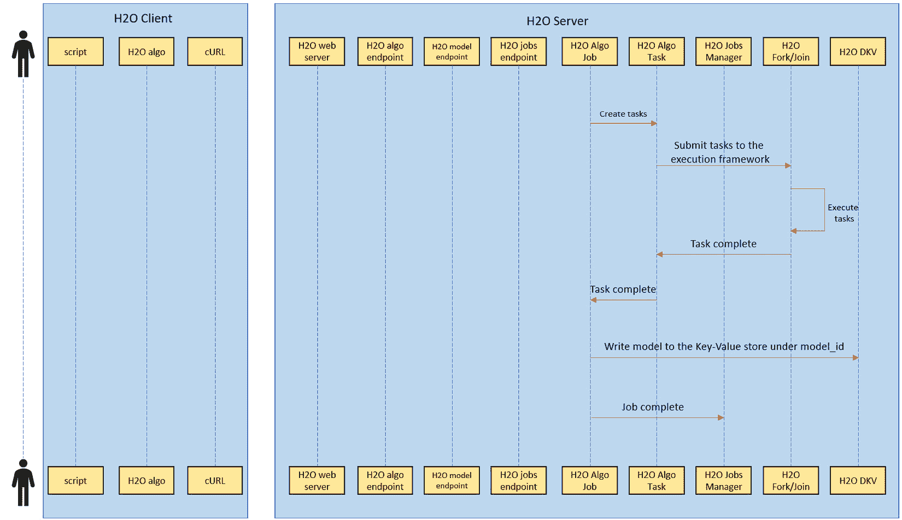

图 4.8-模型培训工作执行中的交互顺序

在模型训练过程中会发生以下一组序列:

1.  模型训练作业将模型训练分解为任务。
2.  然后，作业将任务提交给执行框架。
3.  执行框架使用 Java 并发库`jsr166y`使用 Fork/Join 处理框架以并发方式执行任务。
4.  一旦一个分叉任务被成功执行，执行库就发回已完成的任务结果。
5.  一旦所有任务完成，被训练的模型被发送回模型训练作业。
6.  然后，模型训练作业将模型对象存储在 H2O 的分布式键值存储中，并用唯一的模型 ID 对其进行标记。
7.  然后，训练作业通知作业管理器模型训练已经完成，作业管理器可以自由地转移到其他训练作业。

既然我们已经理解了当一个模型训练工作正在训练一个模型时，在幕后发生了什么，那么让我们继续理解当一个客户轮询模型训练状态时会发生什么。

### 客户轮询模型培训作业完成状态

如前所述，模型的实际培训独立于客户的培训请求进行处理。在这种情况下，一旦客户端发送了训练请求，客户端实际上并不知道模型的进度。客户将需要不断地轮询模型训练工作的状态。这可以通过使用 HTTP 手动发出请求来完成，或者通过某些客户端软件功能来完成，例如进度跟踪器定期轮询 H2O 服务器以了解模型训练的状态。

下面的序列图显示了客户端轮询模型培训作业完成时发生的交互序列:

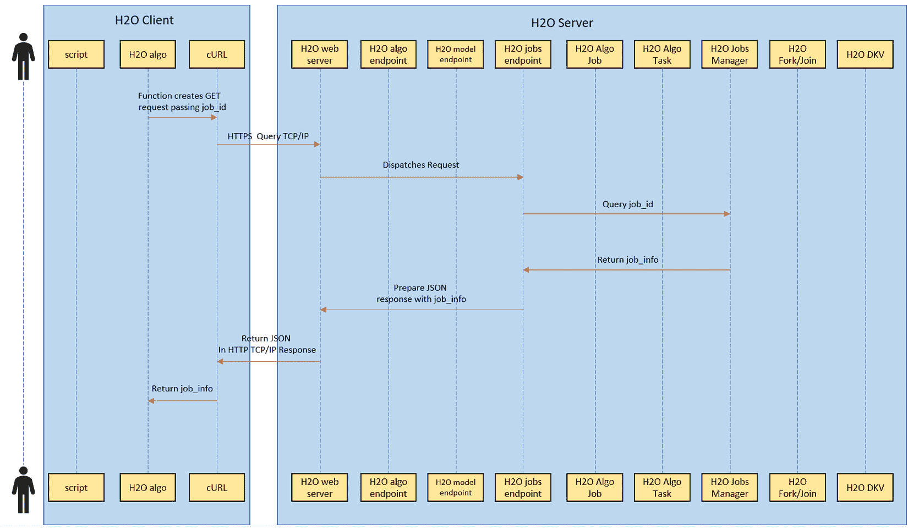

图 4.9-交互模型状态序列的用户投票

当客户端轮询模型训练作业完成时，发生以下一组序列:

1.  为了获得模型训练的状态，客户机将发出一个`GET`请求，传递它第一次发出训练模型的请求时收到的响应`job_id`。
2.  `GET`请求通过网络传输到位于主机 IP 地址的 H2O web 服务器。
3.  H2O web 服务器将请求发送到 H2O 作业端点。
4.  然后，H2O 作业端点将查询作业管理器，请求在`GET`请求中传递的`job_id`的状态。
5.  作业管理器将返回各个`job_id`的作业信息，其中包含关于模型训练进度的信息。
6.  H2O 作业端点将准备一个 JS ON 响应，包含`job_id`的作业信息，并将其发送到 H2O web 服务器。
7.  H2O web 服务器将把 JSON 作为响应发送回发出请求的客户机。
8.  收到响应后，客户机将解包这个 JSON，并根据作业信息向用户更新模型训练的状态。

这总结了当客户调查模型训练状态时发生的各种互动。考虑到这一点，现在让我们来看看当客户机被告知模型训练作业已经完成了模型训练后，请求模型信息时会发生什么。

### 客户对模型信息的查询

一旦模型训练成功，用户很可能想要分析模型的细节。一个 ML 模型有大量与其性能和质量相关的元数据。这种元数据甚至在模型用于预测之前就非常有用。但是正如我们在上一节中看到的，模型训练过程是独立于用户请求的，一旦训练完成，H2O 不会返回模型对象。然而，H2O 服务器确实提供了一个 API，使用它您可以获得关于已经存储在服务器中的模型的信息。

下面的序列图显示了当客户端请求有关定型模型的信息时发生的交互序列:

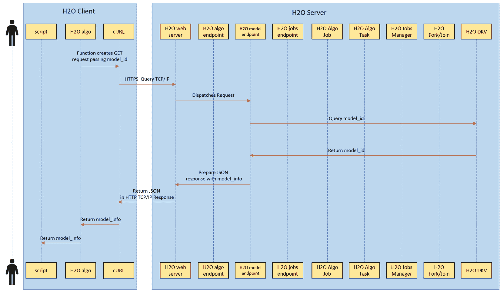

图 4.10–用户查询模型信息

当客户端轮询模型训练作业完成时，发生以下一组序列:

1.  为了获得模型信息，客户机将发出一个`GET`请求，传递 ML 模型的惟一`model_id`。
2.  `GET`请求通过网络传输到位于主机 IP 地址的 H2O 网络服务器。
3.  H2O web 服务器将请求发送到 H2O 模型端点。
4.  当模型训练作业完成对模型的训练时，所有模型信息都存储在 H2O 的分布式键值存储中。H2O 模型端点将使用`model_id`作为过滤器来查询这个分布式键值存储。
5.  分布式键值存储将返回传递给它的`model_id`的所有模型信息。
6.  然后，H2O 模型端点将准备一个包含模型信息的 JSON 响应，并将其发送到 H2O web 服务器。
7.  H2O web 服务器将把 JSON 作为响应发送回发出请求的客户机。
8.  收到响应后，客户端将提取所有模型信息并显示给用户。

模型一旦被训练，就直接存储在 H2O 服务器本身中，以便在有任何预测请求时快速访问。你也可以下载 H2O 模型；但是，任何未导入 H2O 服务器的模型都不能用于预测。

这概括了发生在 H2O 客户机-服务器通信的各个部分的整个交互序列。现在，我们已经了解了 H2O 如何使用 jobs 和 job manager 在内部训练模型，让我们更深入地了解当 H2O AutoML 训练和优化超参数，最终选择最佳模型时会发生什么。

# 了解 H2O 汽车公司如何进行超参数优化和训练

在本书的整个过程中，我们惊叹于 AutoML 过程如何自动化训练和选择最佳模型的复杂任务，而无需我们动动手指。然而，在每个自动化的背后，都有一系列按顺序执行的简单步骤。

现在，我们已经很好地了解了 H2O 的架构以及如何使用 H2O AutoML 来训练模型，我们现在准备最终打开黑盒，即 H2O AutoML。在这一节中，我们将了解 H2O 汽车公司在幕后做什么，以便使训练和选择最佳 ML 模型的整个过程自动化。

这个问题的答案很简单。H2O 汽车公司使用**网格搜索超参数优化**自动化整个 ML 过程。

网格搜索超参数优化对许多非专家来说听起来非常吓人，但是如果你知道模型训练中的一些基本概念，特别是**超参数**的重要性，那么概念本身实际上非常容易理解。

所以，在我们深入研究网格搜索超参数优化之前，让我们先来了解一下什么是超参数。

## 理解超参数

大多数软件工程师都知道什么是参数:包含特定用户输入数据的特定变量，或者任何系统计算的数据，这些数据被提供给另一个函数或进程。然而，在 ML 中，由于引入了超参数，这个概念有点复杂。在 ML 领域中，有两种类型的参数。一类我们称之为**模型参数**，或简称为参数，另一类是**超参数**。尽管它们有相似的名字，但是它们之间有一些重要的区别，所有的软件工程师在 ML 领域工作时都应该记住。

所以，让我们用简单的定义来理解它们:

*   **模型参数**:模型参数是在模型训练过程中，由 ML 算法从给定的数据集中计算或学习出来的参数值。基本模型参数的一些示例是数据集中数据的**均值**或**标准差**、**权重**和**偏差**。这些是我们在训练模型时从训练数据中学习的元素，这些是 ML 算法用来训练 ML 模型的参数值。模型参数也称为**内部参数**。在给定的 ML 训练场景中，模型参数是不可调整的。
*   **超参数**:超参数是模型训练之外的配置，并且不是从训练数据集导出的。这些是由 ML 从业者设置的参数值，用于导出模型参数。它们是由 ML 从业者启发式地发现的值，并在模型训练开始之前输入到 ML 算法中。超参数的一些简单例子是随机森林中的**树数**，或者回归算法中的**学习率**。每种类型的最大似然算法都有自己所需的超参数集。超参数是可调的，并且经常被试验以在给定的 ML 训练场景中获得最佳模型。

训练最佳模型的目的很简单:

1.  你选择超参数的最佳组合。
2.  这些超参数产生理想的模型参数。
3.  这些模型参数训练具有最低可能错误率的模型。

听起来很简单。然而，有一个问题。超参数本质上不是直观的。人们不能简单地观察数据并决定超参数的 *x* 值将为我们提供最佳模型。寻找完美的超参数是一个反复试验的过程，目的是找到一个最小化误差的组合。

现在，出现的下一个问题是如何找到训练模型的最佳超参数。这就是超参数优化发挥作用的地方，我们将在接下来讨论。

## 了解超参数优化

超参数优化，也称为**超参数调整**，是为给定的 ML 算法选择最佳超参数集来训练最优模型的过程。这些值的最佳组合使 ML 算法的预定义损失函数**最小化。简单地说，损失函数是一个度量某个误差单位的函数。对于不同的 ML 算法，损失函数是不同的。在超参数值的潜在组合中具有最低可能误差量的模型被称为具有最佳超参数。**

有许多方法可以实现超参数优化。最常见的有**网格搜索**、**随机网格搜索**、**贝叶斯优化**、**基于梯度的优化**。每一个都是一个非常广泛的话题；然而，对于这个章节，我们将只关注两种方法:网格搜索和随机网格搜索。

小费

如果您想探索关于超参数调优的贝叶斯优化技术的更多信息，请随意。你可以通过这个链接获得更多关于这个话题的信息:[https://arxiv.org/abs/1807.02811](https://arxiv.org/abs/1807.02811)。同样，你可以在这个链接获得更多基于梯度优化的细节:[https://arxiv.org/abs/1502.03492](https://arxiv.org/abs/1502.03492)。

它实际上是 H2O 的 AutoML 用于超参数优化的随机网格搜索方法，但是你需要了解优化的原始网格搜索方法，以便理解随机网格搜索。

那么，让我们从网格搜索超参数优化开始。

### 了解网格搜索优化

让我们以我们在第 1 章 、*了解 H2O 汽车基础知识*中使用的Iris Flower 数据集为例。在这个数据集中，我们正在训练一个模型，该模型从萼片宽度、萼片长度、花瓣宽度和花瓣长度进行学习，以预测花的分类类型。

现在，你面临的第一个问题是:应该用哪种 ML 算法来训练一个模型？假设你真的找到了答案并选择了算法，你的下一个问题是:哪种超参数组合能让我得到最佳模型？

传统上，ML 实践者会用超参数值的不同组合为给定的 ML 算法训练多个模型。然后，他们将比较这些模型的性能，并找出哪个超参数组合以最低的可能错误率训练模型。

下图显示了超参数的不同组合如何训练具有不同性能的不同模型:

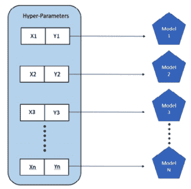

图 4.11–手动超参数调整

让我们举一个例子，你正在训练一个决策树。它的超参数是树的数量`ntrees`和最大深度`max_depth`。如果您正在执行超参数优化的手动搜索，那么您将首先使用类似于值`50`、`100`、`150`和`200`作为`ntrees`和`5`、`10`和`50`作为`max_depth`，训练模型，并测量它们的性能。当您发现这些值的哪种组合能产生最佳结果时，您将这些值设置为阈值，并以较小的增量或减量调整它们，使用这些新的超参数值重新训练模型，并再次比较性能。一直这样做，直到找到最佳的超参数值集，从而获得最佳性能。

然而，这种方法有一些缺点。首先，您最初可以尝试的值的范围是有限的，因为您只能手动训练这么多模型。因此，如果您有一个值在 1 到 10，000 之间的超参数，那么您需要确保覆盖足够的范围，以免与理想值相差太大。如果你这样做了，那么你将会不断地用较小的增量或减量来调整值，花费大量的时间来优化。其次，随着超参数数量的增加，可能值的数量以及您想要使用的值的组合的增加，ML 从业者管理和运行优化过程变得乏味。

为了管理并部分自动化使用不同超参数训练多个模型的过程，发明了网格搜索。网格搜索又称**笛卡尔超参数搜索**或**穷举搜索**。

网格搜索基本上将给定超参数的所有值映射到一个笛卡尔网格上，并彻底地在网格中搜索组合来训练模型。参考下图，该图显示了超参数网格搜索如何转化为多个被训练的模型:

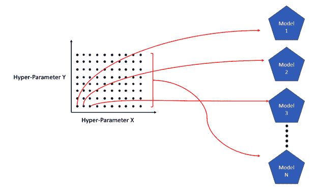

图 4.12–笛卡尔网格搜索超参数调整

在图中，我们可以看到一个映射两个超参数的二维网格。使用这个笛卡尔网格，我们可以进一步将超参数值的组合扩展到每个参数 10 个值，从而扩展我们的搜索。网格搜索方法穷尽地搜索两个超参数的不同值。因此，它将有 100 种不同的组合，总共将训练 100 种不同的模型，所有的训练都不需要太多的人工干预。

H2O 确实有网格搜索功能，用户可以使用它来测试他们自己的手动实现的网格搜索方法来优化超参数。使用网格搜索训练模型时，H2O 会将其训练的所有模型映射到网格的各个超参数值组合。H2O 还允许您根据任何支持的模型性能指标对所有这些模型进行排序。这种排序有助于您根据指标值快速找到性能最佳的模型。我们将在第 6 章 、*了解 H2O 汽车排行榜和其他绩效指标*中探讨更多关于绩效指标的内容。

然而，尽管将人工搜索自动化并引入生活质量的改善，这种方法仍然存在一些缺点。网格搜索超参数优化遭遇所谓的**维数灾难**。

维数灾难是理查德·e·贝尔曼在考虑动态编程中的问题时创造的一个术语。从 ML 的角度来看，这个概念表明，随着超参数组合数量的增加，网格搜索将执行的评估数量呈指数增长。

例如，假设您有一个超参数 *x* ，您想要尝试 1-20 的整数值。在这种情况下，你将最终做 20 个评估，换句话说，训练 20 个模型。现在假设有另一个超参数 *y* 并且您想要结合 *x* 的值来尝试值 1-20。您的组合如下:

*(1，1)、(1，2)、(1，3)、(1，4)、(1，5)、(1，6)、(1，7)…。(20，20)其中(x，y)*

现在，在你的网格中总共有 20x20=400 个组合，为此你的网格搜索优化将最终训练 400 个模型。再添加一个超参数 z，你的组合数量将会激增到无法管理的程度。您拥有的超参数越多，您尝试的组合就越多，组合爆炸就会发生得越多。

考虑到 ML 的时间和资源敏感性，穷举搜索对于找到最佳模型是不利的。现实世界有局限性，因此随机选择超参数值通常被证明比穷举网格搜索提供更好的结果。

这就引出了超参数优化的下一个方法，随机网格搜索。

### 了解随机网格搜索优化

随机网格搜索通过从超参数搜索空间中选择随机值来取代之前的穷举网格搜索，而不是依次穷尽所有值。

例如，参考下图，该图显示了随机网格搜索优化的一个示例:

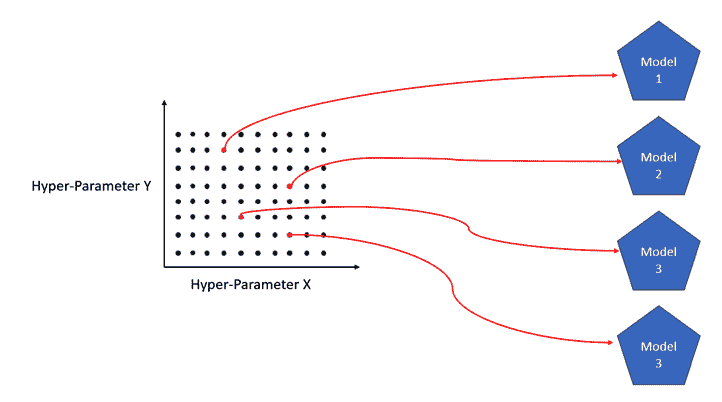

图 4.13–随机网格搜索超参数调整

上图是两个超参数的 100 个组合的超参数空间， *X* 和 *Y* 。随机网格搜索优化只会随机选择几个，并使用这些超参数值进行评估。

随机网格搜索优化的缺点是，它是一种尽最大努力用有限数量的评估找到超参数值的最佳组合的方法。它可能会也可能不会找到超参数值的最佳组合来训练最佳模型，但在给定大样本量的情况下，它可以找到近乎完美的组合来训练质量足够好的模型。

H2O 库函数支持随机网格搜索优化。它为用户提供了设置自己的超参数搜索网格和设置搜索标准参数的功能，以控制搜索的类型和范围。搜索标准可以是任何东西，比如最大运行时间、要训练的模型的最大数量，或者任何指标。H2O 将从网格中依次随机选择不同的超参数组合，不会重复，并将继续搜索和评估，直到满足搜索标准。

H2O AutoML 的工作方式与随机网格搜索优化略有不同。H2O 不再等待用户输入超参数搜索网格，而是已经通过拥有一个超参数列表，将网格中特定算法的所有潜在值作为默认值，从而实现了这一部分的自动化。H2O 汽车公司还规定在用户设置的超参数搜索列表中包括非默认值。H2O 汽车公司已经为算法设定了预定值；我们将在下一章探索它们，并理解不同的算法是如何工作的。

# 总结

在这一章中，我们已经开始了解 H2O 的高层架构，以及组成整个架构的不同层是什么。然后我们深入到架构的客户端和 JVM 层，在那里我们理解了组成 H2O 软件栈的不同组件。接下来，牢记 H2O 的体系结构，我们开始理解发生在客户机和服务器之间的交互流，在这里我们理解我们如何准确地命令 H2O 服务器执行各种 ML 活动。我们也开始理解在模型训练期间交互是如何沿着架构堆栈向下流动的。

基于这些知识，我们研究了模型训练期间 H2O 服务器内部发生的交互序列。我们还研究了 H2O 如何使用作业管理器协调训练作业来训练模型，以及 H2O 如何与用户交流模型训练的状态。最后，我们拆开了 H2O 汽车公司的包装，开始了解它是如何自动训练最佳模型的。我们已经了解了超参数优化的概念及其各种方法，以及 H2O 如何自动化这些方法并减少其缺点，以自动训练最佳模型。

现在我们知道了 H2O 汽车公司的内部细节以及它如何训练模型，我们现在可以理解 H2O 汽车公司训练的各种 ML 算法以及它们如何设法进行预测。在下一章中，我们将探索这些算法，并对模型有更好的理解，这将帮助我们证明哪种模型对给定的 ML 问题最有效。****