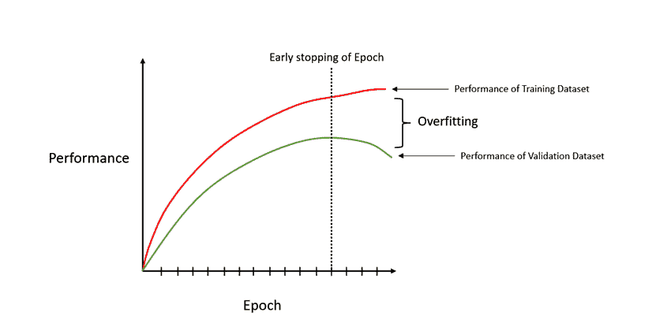
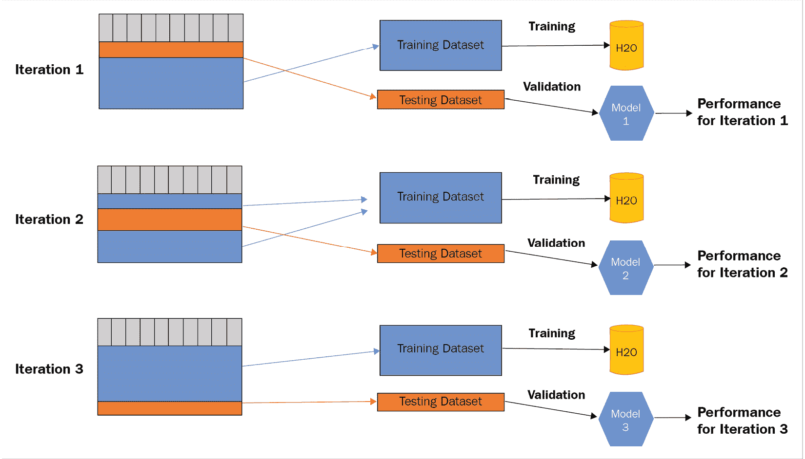

# 八、探索 H2O 自动化的可选参数

正如我们在 [*第二章*](B17298_02.xhtml#_idTextAnchor038)*中所探讨的，使用 H2O 流(H2O 的 Web UI)* ，当使用 H2O AutoML 训练模型时，我们有大量的参数可供选择。所有这些参数使我们有能力控制 H2O 自动化应该如何训练我们的模型。这种控制有助于我们根据我们的需求尽可能最好地使用 AutoML。我们探索的大多数参数都很容易理解。然而，在这本书的开头，有些参数的目的和作用要理解起来有点复杂。

在本章中，我们将通过学习这些参数背后的**机器学习** ( **ML** )概念来探索这些参数，然后理解我们如何在 AutoML 设置中使用它们。

在本章结束时，你不仅会学到一些先进的 ML 概念，而且你将能够使用 H2O 自动化制造公司的参数化规定来实现它们。

在本章中，我们将讨论以下主题:

*   试验支持不平衡类的参数
*   试验支持早期停止的参数
*   试验支持交叉验证的参数

我们将从了解什么是不平衡的班级开始。

# 技术要求

要完成本章，您需要具备以下条件:

*   您首选的 web 浏览器的最新版本。
*   安装在您系统上的 H2O 软件。参考 [*第 1 章*](B17298_01.xhtml#_idTextAnchor017) 、*了解 H2O 自动化基础知识*，了解如何在您的系统上安装 H2O。

小费

为了简单起见，本章中显示的所有 H2O AutoML 函数参数都是使用 H2O 流显示的。Python 和 R 编程语言中也提供了等效的参数，供软件工程师编写服务代码时使用。你可以在[https://docs . H2O . ai/H2O/latest-stable/H2O-docs/parameters . XHTML](https://docs.h2o.ai/h2o/latest-stable/h2o-docs/parameters.xhtml)找到这些细节。

# 试验支持不平衡类的参数

你在 ML 领域经常会遇到的一个常见问题是对罕见事件进行分类。考虑大地震的情况。7 级及以上的大地震大约每年发生一次。如果您有一个包含过去十年以来每天地球构造活动的数据集，响应列包含是否发生地震，那么您将有大约 3，650 行数据；也就是说，十年中每天一行，大约 8-12 行显示大地震。这一事件发生的概率不到 0.3%。99.7%的时候，不会有大地震。这个数据集，其中大地震事件的数量如此之少，被称为**不平衡数据集**。

不平衡数据集的问题是，即使您编写一个简单的`if-else`函数，将所有构造事件标记为非地震，并将其称为模型，它仍然会显示 99.7%的准确性，因为大多数事件都不会引起地震。然而，实际上，这种所谓的模型非常糟糕，因为它不能正确地告诉你这是不是地震。

当训练 ML 模型时，**目标类**中的这种不平衡产生了许多问题。ML 模型更有可能假设这些事件非常罕见，以至于它们永远不会发生，并且不会知道这些事件之间的区别。

然而，有办法解决这个问题。一种方法是欠采样多数类，另一种方法是过采样少数类。我们将在接下来的章节中学习更多关于这些技术的知识。

## 了解欠采样多数类

在预测地震发生的场景中，数据集包含大量已经被识别为*非地震*的事件。这一事件被称为多数阶级。为数不多的事件标志着*地震*被称为少数类。

让我们看看**欠采样多数类**如何解决类不平衡引起的问题。请考虑下图:


图 8.1-不平衡数据集的欠采样

让我们假设你有 3640 个构造活动的数据样本，表明没有发生地震，只有 10 个样本表明发生了地震。在这种情况下，要解决这种不平衡问题，您必须创建一个包含所有 10 个少数类样本和从 3，640 个数据样本中随机选择的 10 个多数类样本的引导数据集。然后，您可以将这个新数据集提供给 H2O 自动化进行训练。在这种情况下，在训练模型之前，我们对多数类进行了欠采样，并均衡了*地震*和*非地震*数据样本。

这种方法的缺点是，我们最终丢弃了大量的数据，模型无法从减少的数据中学习到很多东西。

## 了解过采样少数类

解决不平衡数据集问题的第二种方法是**对少数类**进行过采样。一个显而易见的方法是复制少数类数据样本，并将它们附加到数据集，这样多数类和少数类之间的数据样本数量相等。为了更好地理解，请参考下图:


图 8.2–对不平衡数据集进行过采样

在上图中，您可以看到我们复制了少数类数据样本并将它们追加到数据集，因此每个类最终有 3，640 行。

这种方法是可行的；但是，过采样会导致数据集的规模爆炸。您需要确保它不会超出您的计算和内存限制而失败。

既然我们已经介绍了使用欠采样和过采样的类平衡的基础，让我们看看 H2O AutoML 如何使用它的类平衡参数来处理它。

## 在 H2O 自动化中使用分类平衡参数

H2O AutoML 有一个名为`balance_classes`的参数，它接受一个布尔值。如果设置为*真*，H2O 对少数类执行过采样，对多数类执行欠采样。以这样的方式执行平衡，使得最终每个类包含相同数量的数据样本。

各个类别的欠采样和过采样都是随机进行的。此外，少数类的过采样是通过替换完成的。这意味着来自少数类的数据样本可以被选择并多次添加到新的训练数据集中，并且可以被重复。

H2O 自动化具有以下支持分类平衡功能的参数:

*   `balance_classes`:该参数接受一个布尔值。默认情况下为*假*，但是如果您想在将数据集提供给 H2O AutoML 进行训练之前对其执行类平衡，那么您可以将布尔值设置为*真*。

在 H2O 流中，除了参数之外，还有一个复选框。参考以下截图:


图 8.3–H2O 流程中的 balance_classes 复选框

勾选后，在 **Run AutoML** 参数的**专家**部分的`class_sampling_factors`和`max_after_balance_size`参数可用，如下图所示:


图 8.4–专家部分中的类 _ 采样 _ 因子和最大 _after_balance_size 参数

*   `class_sampling_factors`:该参数要求`balance_classes`为*真*。该参数将一个浮点值列表作为输入，表示该类的采样速率。给定类别的采样速率值 *1.0* 在类别平衡期间不会改变其采样速率。在类别平衡期间， *0.5* 的采样率将使类别的采样率减半，而 *2.0* 的采样率将使其翻倍。
*   `max_after_balance_size`:该参数要求`balance_classes`为*真*，指定平衡后训练数据集的最大相对大小。该参数接受一个`float`值作为输入，这将限制您的训练数据集可以增长到的大小。默认值为 *5.0* ，这表明训练数据集将增长到其大小的最大值 *5* 倍。该值也可以小于 *1.0* 。

在 Python 编程语言中，可以如下设置这些参数:

```py

aml = h2o.automl.H2OAutoML(balance_classes = True, class_sampling_factors =[0.3, 2.0], max_after_balance_size=0.95, seed = 123)

aml.train(x = features, y = label, training_frame = train_dataframe)
```

同样，在 R 编程语言中，可以按如下方式设置这些参数:

```py

aml <- h2o.automl(x = features, y = label, training_frame = train_dataframe, seed = 123, balance_classes = TRUE, class_sampling_factors = c(0.3, 2.0), max_after_balance_size=0.95)
```

要在使用 AutoML 训练模型时执行类平衡，可以在 H2O AutoML 估计器对象中将`balance_classes`参数设置为 true。在同一个对象中，您可以指定您的`class_sampling_factors`和`max_after_balance_size`参数。然后，您可以使用这个初始化的 AutoML estimator 对象在您的训练数据集上触发 AutoML。

既然您已经理解了我们如何使用`balance_classes`、`class_sampling_factors`和`max_after_balance_size`参数解决类不平衡问题，那么让我们来理解 AutoML 中的下一个可选参数——即停止标准。

# 试验支持早期停止的参数

**过度拟合**模型是试图解决 ML 问题时经常面临的问题之一。当 ML 模型试图过多地适应您的训练集，以至于它只能对以前在训练集中看到的值进行预测，而不能对看不见的数据进行广义预测时，就会发生过度拟合。

过度拟合是由多种原因造成的，其中一个原因是模型从数据集中学习了太多，以至于它甚至合并并学习了数据集中的噪声。这种学习对可能没有这种噪声的新数据的预测产生负面影响。那么，我们如何解决这个问题并防止模型过度拟合呢？在模型了解到噪音之前尽早停止它。

在下面的小节中，我们将了解什么是提前停止以及如何进行提前停止。然后，我们将了解 H2O 自动化提供的提前停车参数是如何工作的。

## 了解提前停止

**提前停止**是**正则化**的一种形式，一旦模型对数据的理解达到令人满意的程度，它就会停止模型的训练，进一步防止模型过度拟合。早期停止旨在使用适当的性能度量来观察模型性能的改善，并在由于过度拟合而观察到性能下降时停止模型的训练。

当使用使用迭代优化来最小化损失函数的算法来训练模型时，训练数据集在每次迭代期间通过该算法。通过的观察和理解将在下一次迭代中使用。这个通过算法传递训练数据集的迭代被称为**时期**。

对于早期停止，在每个时期结束时，我们可以计算模型的性能并记下度量值。在每次迭代过程中比较这些值有助于我们了解模型是否在每个时期后都在提高其性能，或者它是否在学习噪声和损失性能。我们可以对此进行监控，并在我们开始看到性能下降时停止模型训练。请参考下图，以便更好地理解提前停止:



图 8.5-早期停止以避免模型过度拟合

在上图中，在 *Y* 轴上，我们有该型号的**性能**值。在 *X* 轴上，我们有**纪元**值。因此，随着时间的推移，我们遍历了多个时期，我们看到模型在训练集和验证集上的性能继续提高。但是在某个点之后，模型在验证数据集上的性能开始下降，而训练数据集的性能继续提高。这就是过度拟合开始的地方。该模型从训练数据集中学习了太多，并开始将噪声结合到它的学习中。这可能会在训练数据集上显示出高性能，但该模型无法概括预测。这将导致对看不见的数据(如验证数据集中的数据)的不良预测。

因此，最好的办法是在模型的性能对于定型数据集和验证数据集来说都是最高的那一点停止模型。

现在我们已经基本了解了模型训练的提前停止是如何工作的，让我们学习如何使用 H2O AutoML 函数提供的提前停止参数来执行它。

## 在 H2O 自动化使用提前停止参数

H2O 自动化为您提供了来实现和控制它将自动为您训练的车型的提前停止。

您可以使用以下参数来实现提前停止:

*   `stopping_rounds`:该参数表示训练轮数，超过该轮数，如果停止指标没有改善，我们将停止模型训练。
*   `stopping_metric`:该参数用于选择提前停止时要考虑的性能指标。当`stopping_rounds`置位且大于 *0* 时可用。我们在 [*第 6 章*](B17298_06.xhtml#_idTextAnchor129) 、*了解 H2O 自动化排名和其他表现指标*中学习了表现指标，因此如果您希望修改不同指标衡量表现的方式，请参考该章。此参数的可用选项如下:
    *   `AUTO`:这是默认值，根据 ML 问题的类型，进一步默认为以下值:
        *   `logloss`:分类问题的默认停止度量。
        *   `deviance`:回归问题的默认停止度量。这代表平均剩余偏差。
        *   `anomaly_score`:隔离森林模型的默认停止度量，隔离森林模型是一种集合模型。
    *   `anomaly_score`:隔离森林模型(集合模型)的默认停止度量。它是观察值的正态性度量，相当于隔离给定树中最大深度点所需的决策树分裂数。
    *   `deviance`:这代表平均剩余偏差。该值告诉我们模型根据数据集中的要素数量预测标注值的准确程度。
    *   `logloss` : Log loss 是一种度量标准，用于衡量以概率值形式输出分类结果的分类模型的性能。
    *   `MSE`(`RMSE`(`MAE`(`RMSLE`(`AUC`(`AUCPR`(`lift_top_group`):该参数配置 AutoML，使得被训练的模型必须在训练数据的前 1%内提高其 lift。与随机预测的模型相比，Lift 只不过是对模型进行精确预测的性能的度量。数据集的前 1%是预测值最高的观测值。
    *   `misclassification`:此指标用于衡量预测不正确的比例，不区分正面预测和负面预测。
    *   `mean_per_class_error`:这是一个度量，计算包含多个类的数据集中每个类的所有错误的平均值。
    *   `custom`:该参数用于将任意自定义指标设置为 AutoML 训练期间的停止指标。自定义指标的行为应该是*越少越好*，这意味着自定义指标的值越低，模型的性能越好。自定义指标的下限值假定为 0。
    *   `custom_increasing`:该参数用于自定义性能指标，其行为为*越多越好*，意味着这些指标的值越高，模型性能越好。在撰写本文时，该参数仅在 GBM 和 DRF 的 Python 客户端中受支持。
*   `stopping_tolerance`:该参数表示在停止模型训练之前，模型的性能指标必须提高的容差值。当`stopping_rounds`置位且大于 *0* 时可用。如果数据集包含至少一百万行，AutoML 的默认停止容差为*0.001*；否则，该值由数据集的大小和数据集中的非 NA 数据量决定，这导致该值大于 *0.001*

在 H2O 流程中，这些参数可以在 **Run AutoML** 参数的 **ADVANCED** 部分获得，如下图所示:


图 8.6-H2O 流中的提前停止参数

在 Python 编程语言中，可以按如下方式设置这些参数:

```py
aml = h2o.automl.H2OAutoML(stopping_metric = "mse", stopping_rounds = 5, stopping_tolerance = 0.001)
aml.train(x = features, y = label, training_frame = train_dataframe)
```

在 R 编程语言中，可以如下设置这些参数:

```py
aml <- h2o.automl(x = features, y = label, training_frame = train_dataframe, seed = 123, stopping_metric = "mse", stopping_rounds = 5, stopping_tolerance = 0.001)
```

为了更好地理解 AutoML 如何提前停止模型的训练，考虑相同的 Python 和 R 示例值。我们有`stopping_metric`作为`stopping_rounds`作为`stopping_tolerance`作为 **0.001** 。

实现提前停止时，H2O 将计算 *0.001* 的最后一个`stopping_tolerance`的移动平均值，然后 H2O 将停止模型训练。对于具有*越多越好*行为的表现指标，最佳移动平均值和参考移动平均值之间的比率应小于或等于停止容差。

既然我们已经了解了如何使用`stopping_rounds`、`stopping_metrics`和`stopping tolerance`参数尽早停止模型训练，那么让我们了解 AutoML 中的下一个可选参数——即交叉验证。

# 试验支持交叉验证的参数

当在数据集上执行模型训练时，我们通常在数据集上执行训练测试分割。假设我们按照 70%和 30%的比例对其进行划分，其中 70%用于创建训练数据集，其余 30%用于创建测试数据集。然后，我们将训练数据集传递给 ML 系统进行训练，并使用测试数据集来计算模型的性能。训练测试分割通常是在随机状态下执行的，这意味着用于创建训练数据集的 70%的数据通常是从原始数据集中随机选择的，没有替换，除非是时间序列数据，其中需要保持事件的顺序，或者我们需要保持类分层。类似地，对于测试数据集，从原始数据集中随机选择 30%的数据来创建测试数据集。

下图显示了如何从数据集中随机选取数据来创建用于各自目的的定型数据集和测试数据集:


图 8.7-数据集上的训练测试分割

现在，训练-测试分割的问题是，当测试数据集之外的 30%的数据没有用于训练模型时，任何可以从该数据中获得的缺失知识都不能用于训练模型。这导致模型性能的损失。如果您使用不同的随机状态为训练测试分割重新训练模型，那么该模型将最终具有不同的性能级别，因为它已经在不同的数据记录上进行了训练。因此，模型的性能取决于训练数据集的随机分配。那么，我们如何为训练提供测试数据，同时保留一些测试数据用于性能测量呢？这就是交叉验证发挥作用的地方。

## 了解交叉验证

**交叉验证**是一种模型验证技术，它对数据进行重新采样，以训练和测试模型。该技术在每次迭代中使用数据集的不同部分进行训练和测试。使用数据集的不同部分执行模型训练和测试的多次迭代。性能结果被组合以给出模型性能的平均估计。

我们试着用一个例子来理解这一点。假设您的数据集包含大约 1，000 条记录。要执行交叉验证，您必须将数据集分割成一个比率，让我们假设一个 1:9 的比率，其中测试数据集有 100 条记录，训练数据集有 900 条记录。然后，对训练数据集执行模型训练。一旦模型定型，您必须在测试数据集上测试模型并记录其性能。这是你交叉验证的第一次迭代。

在下一次迭代中，您以相同的 1/9 记录比率分别为测试数据集和训练数据集拆分数据集，但是这一次，您选择不同的数据记录来组成您的测试数据集，并将剩余的记录用作训练数据集。然后，在定型数据集上执行模型定型，并在测试数据集上计算模型的性能。使用不同的数据记录重复相同的实验，直到所有数据集都用于训练和测试。您将需要执行大约 10 次交叉验证迭代，以便在整个交叉验证过程中，每次迭代都在整个数据集上对模型进行训练和测试，同时在测试数据帧中包含不同的数据记录。

一旦所有的迭代完成，您必须结合实验的性能结果，并提供模型性能的平均估计。这种技术被称为交叉验证。

您可能已经注意到，在交叉验证期间，我们对同一个数据集执行多次模型训练。预计这将增加总的 ML 处理时间。在对定型分区和测试分区之间的比率非常高的大型数据集执行交叉验证时尤其如此。例如，如果我们有一个包含 30，000 行的数据集，我们将该数据集分为 29，000 行用于训练，1，000 行用于测试，那么这将导致模型训练和测试的总共 3，000 次迭代。因此，有一种替代形式的交叉验证，让您选择如何执行多次迭代:称为 **K 倍交叉验证**。

在 K-fold 交叉验证中，您决定 **K** 的值，它用于确定要执行的交叉验证迭代的次数。根据 K 的值，ML 服务将数据集随机划分为 K 个相等的子样本，这些子样本将在交叉验证迭代中重新采样。下图将帮助您理解这一点:



图 8.8-K 倍交叉验证，其中 K=3

如您所见，我们有一个包含 30，000 条数据记录的数据集，在 K 倍交叉验证中选择的 K 值为 3。因此，数据集将被分为 20，000 条测试数据集记录和 10，000 条训练记录，这些记录将在后续迭代中重新采样，从而导致总共三次交叉验证。

使用 K-fold 交叉验证来执行模型验证的好处是，模型是在整个数据集上进行训练的，而不会在训练过程中遗漏数据。这在多类分类问题中尤其有益，在这种情况下，模型可能会错过某些预测类的训练，因为它是从训练数据集中分离出来用于测试数据集中的。

现在，我们对交叉验证的基本原理及其工作原理有了更好的理解，让我们看看如何使用 H2O 自动化训练功能中的特殊参数来执行交叉验证。

## 在 H2O 自动化中使用交叉验证参数

H2O AutoML 规定您可以对所有支持的 ML 算法的数据实现 K 重交叉验证，以及一些可能有助于支持实现的附加信息。

您可以使用以下参数来实现交叉验证:

*   `nfolds`:该参数设置 K 折交叉验证使用的折数。

在 H2O 流程中，该参数将出现在 **Run AutoML** 参数的 **ADVANCED** 部分，如下图所示:


图 8.9-H2O 流中的 nfolds 参数

*   `fold_assignment`:此参数用于指定进行 K 折交叉验证时使用的折分配方案。可以设置的各种类型的折叠指定如下:
    *   `AUTO`:该赋值让模型训练算法选择要使用的折叠赋值。`AUTO`目前使用`Random`作为折叠分配。
    *   `Random`:该赋值用于根据`nfolds`值随机分割数据集。如果未指定`nfolds > 0`和`fold_column`，则默认设置该值。
    *   `Modulo`:该赋值用于在根据`nfolds`值分割折叠时执行模运算。
    *   `Stratified`:该赋值用于根据分类问题的响应变量排列折叠。

在 Python 编程语言中，可以如下设置这些参数:

```py
aml = h2o.automl.H2OAutoML(nfolds = 10, fold_assignment = "AUTO", seed = 123)
aml.train(x = features, y = label, training_frame = train_dataframe)
```

在 R 编程语言中，可以按如下方式设置这些参数:

```py
aml <- h2o.automl(x = features, y = label, training_frame = train_dataframe, seed = 123, nfolds = 10, fold_assignment = "AUTO")
```

*   `fold_column`:该参数用于指定基于列内容的折叠分配，而不是任何程序分配技术。通过创建包含折叠 id 的单独列，然后将`fold_column`设置为自定义列的名称，可以自定义设置数据集中每行的折叠值。

在 H2O 流程中，该参数将在 **Run AutoML** 参数的 **ADVANCED** 部分可用，如下图所示:


图 8.10–H2O 流中的折叠列参数

在 Python 编程语言中，可以按如下方式设置这些参数:

```py
aml.train(x = features, y = label, training_frame = train_dataframe, fold_column = "fold_column_name")
```

在 R 编程语言中，可以按如下方式设置这些参数:

```py
aml <- h2o.automl(x = features, y = label, training_frame = train_dataframe, seed = 123, fold_column="fold_numbers")
```

*   `keep_cross_validation_predictions`:在进行 K-fold 交叉验证时，H2O 将训练 *K+1* 个模型，其中 *K* 个模型被训练作为交叉验证的一部分，另外 *1* 个模型在整个数据集上被训练。每个交叉验证模型对该迭代的测试数据帧进行预测，并且预测值存储在预测帧中。您可以通过将该参数设置为*真*来保存这些预测帧。默认情况下，该参数设置为*假*。
*   `keep_cross_validation_models`:与`keep_cross_validation_predictions`类似，您也可以通过将该参数*设为真*来选择在交叉验证期间保持模型被训练，以便进一步检查和实验。默认情况下，该参数设置为*假*。
*   `keep_cross_validation_fold_assignment`:交叉验证时，通过`fold_cloumn`或`fold_assignment`参数分割数据。通过将该参数设置为*真*，可以保存交叉验证中使用的折叠分配。默认情况下，该参数设置为*假*。

在 H2O 流程中，这些参数将出现在 **Run AutoML** 参数的**专家**部分，如下图所示。


图 8.11-H2O 流程中的高级交叉验证参数

在 Python 编程语言中，可以按如下方式设置这些参数:

```py
aml = h2o.automl.H2OAutoML(nfolds = 10, keep_cross_validation_fold_assignment = True, keep_cross_validation_models = True, keep_cross_validation_predictions= True, seed = 123)
aml.train(x = features, y = label, training_frame = train_dataframe)
```

在 R 编程语言中，可以按如下方式设置这些参数:

```py
aml <- h2o.automl(x = features, y = label, training_frame = train_dataframe, seed = 123, nfolds = 10, keep_cross_validation_fold_assignment = TRUE, keep_cross_validation_models = TRUE, keep_cross_validation_predictions= TRUE)
```

祝贺您——您现在已经理解了一些更先进的 ML 概念以及如何在 H2O 自动化中使用它们！

# 总结

在本章中，我们了解了 H2O 自动化的一些可选参数。我们首先了解数据集中的不平衡类是什么，以及它们如何在训练模型时造成麻烦。然后，我们了解了过采样和欠采样，可以用来解决这个问题。之后，我们了解了 H2O AutoML 如何为我们提供参数来控制采样技术，以便我们可以处理数据集中的不平衡类。

之后我们明白了另一个概念，叫早停。我们了解过度训练如何导致过度拟合的 ML 模型，该模型在面对看不见的新数据时表现很差。我们还了解到，一旦我们通过对照验证数据集监控模型的性能，开始注意到模型已经开始过度拟合，早期停止是一种可以用来停止模型训练的方法。然后，我们了解了 H2O 自动化的各种参数，一旦在模型训练过程中出现过度拟合，我们可以使用这些参数来自动停止模型训练。

接下来，我们了解了什么是交叉验证，以及它如何帮助我们在整个数据集上训练模型，以及验证模型的性能，就像模型第一次看到数据一样。我们还了解了 K-fold 交叉验证如何帮助我们控制在模型训练期间要执行的交叉验证迭代的数量。然后，我们探讨了 H2O AutoML 如何在 AutoML 训练期间执行交叉验证的各种规定。最后，我们学习了如何保存交叉验证模型和预测，如果我们希望对它们进行更多的实验，以及如何存储交叉验证折叠分配。

在下一章中，我们将探讨 H2O 自动化的一些杂项功能，这些功能在某些情况下可能对我们有用。