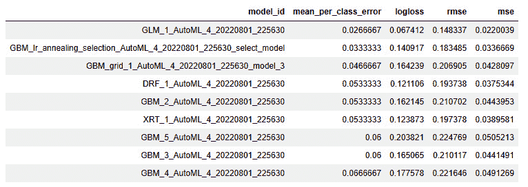
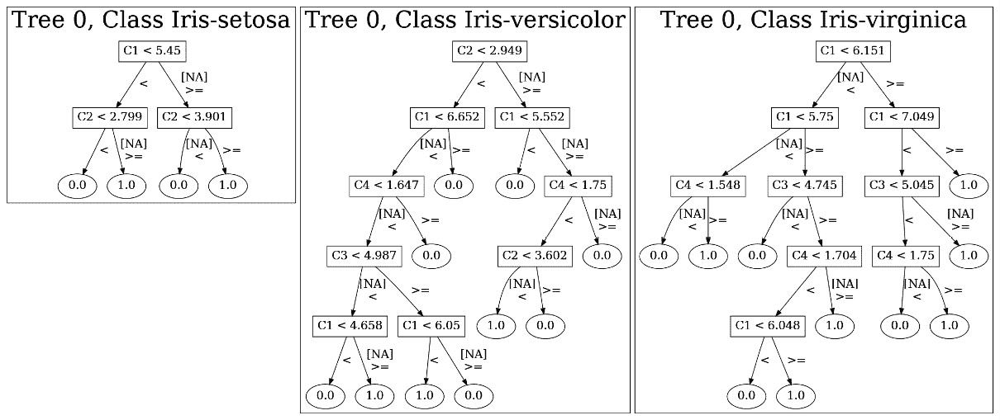
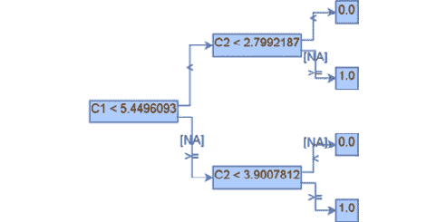

# 11

# 使用模型对象，优化(MOJO)

正如我们在 [*第 10 章*](B17298_10.xhtml#_idTextAnchor196)*使用普通旧 Java 对象(POJO)*中了解到的，当使用生产系统时，我们需要可以轻松部署到生产服务器的可移植软件。在**机器学习** ( **ML** )服务中，ML 模型的可移植性和自给自足性尤为重要。这有助于工程师定期部署新模型，而不必担心由于任何依赖问题而破坏生产中的系统。

H2O 的 POJOs 模型很好地解决了这个问题。模型 POJO 是 H2O 模型，可以以 Java POJOs 的形式提取出来，您可以使用`h2o-genmodel.jar`直接运行这些模型。

然而，模型 POJOs 有某些缺点，使它们不能成为所有这些问题的最佳解决方案。说到软件包的可移植性，包括 POJOs，对象越小，部署就越快。POJOs 对源文件的大小有一个固有的限制，最大为 1 GB。因此，大于 1 GB 的模型不能被提取为 POJOs，同时，大型模型的部署和执行可能会很慢。

这就是为什么 H2O.ai 的团队创建了 POJO 的替代方案，称为**模型对象，优化了** ( **MOJO** )。MOJOs 是低延迟、自给自足的独立对象，可以很容易地在生产中部署。它们是 POJO 的更小更快的对应物，和 POJO 一样容易提取和使用。

在本章中，我们将讨论以下主题:

*   理解什么是魔咒
*   将 H2O 模型提取为 MOJOs
*   查看模型 MOJOs
*   使用 H2O 汽车模型 MOJOs 进行预测

本章结束时，您将能够理解 POJO 和 MOJO 之间的区别，使用 Python、R 或 H2O 流以 MOJO 的形式提取训练模型，然后使用这些 MOJO 模型加载您的 ML 程序以进行预测。

# 技术要求

在本章中，您将需要以下内容:

*   您首选的 web 浏览器的最新版本
*   您选择的一个集成开发环境
*   (可选)朱庇特项目的朱庇特笔记本([https://jupyter.org/](https://jupyter.org/))

本章进行的所有实验都是在终端上进行的。您可以自由地使用相同的设置，或者使用您选择的任何 IDE 执行相同的实验。本章的所有代码示例都可以在 GitHub 上找到，网址为[https://GitHub . com/packt publishing/Practical-Automated-Machine-Learning-on-H2O/tree/main/Chapter % 2011](https://github.com/PacktPublishing/Practical-Automated-Machine-Learning-on-H2O/tree/main/Chapter%2011)。

# 了解什么是魔咒

**mojo**是 H2O 模式 POJOs 的对应物，技术上工作方式相同。H2O 可以构建和提取以 mojo 形式训练的模型，您可以使用提取的 mojo 来部署和预测入站数据。

那么，MOJOs 和 POJOs 有什么不同呢？

POJOs 有一些缺点，使得它们在生产环境中的使用不太理想，如下所示:

*   大于 1 GB 的源文件不支持 POJO，因此任何大于 1 GB 的型号都不能编译成 POJO。
*   POJOs 不支持堆叠整体模型或 Word2Vec 模型。

另一方面，mojo 有以下额外好处:

*   魔咒没有大小限制
*   MOJOs 通过移除 ML 树并使用通用的树遍历算法来计算导航模型，从而解决了大尺寸问题
*   MOJOs 比 POJOs 体积更小，速度更快
*   MOJOs 支持使用 H2O AutoML 训练的所有类型的模型

根据 H2O 的内部实验和测试，如 https://docs . H2O . ai/H2O/latest-stable/H2O-docs/productionizing . XHTML # benefits-of-MOJO-over-POJO 所述，人们注意到 MOJO 模型的磁盘空间比相应的 POJO 模型小大约 20-25 倍。当**热评分**时，MOJOs 的速度也是 POJOs 的两倍，热评分是在 JVM 已经能够优化执行路径之后进行的。在**冷评分**期间，即在 JVM 已经优化执行路径之前进行评分时，MOJOs 的执行速度比 POJOs 快 10-40 倍。随着模型规模的增加，MOJOs 比 POJOs 更有效。

H2O 的内部测试还表明，当用 5000 棵深度为 25 的树进行测试时，POJOs 在对大约 50 棵深度为 5 的非常小的树运行二项式分类时表现更好，但 MOJOs 在多项式分类方面表现更好。

现在我们知道了什么是 mojo，以及它们的好处，让我们看看如何使用简单的例子提取使用 H2O 的 AutoML as MOJOs 训练的模型。

# 提取 H2O 模型作为魔咒

就像 POJOs 一样，你可以使用任何 H2O 支持的语言提取使用 H2O 的 AutoML 训练的模型。

在下面的小节中，我们将学习如何使用 Python 和 R 编程语言提取模型 mojo，以及如何使用 H2O 流提取模型 mojo。

## 在 Python 中提取 H2O 模型作为 MOJOs

让我们看看如何使用 Python 将模型提取为 mojo。我们将对运行 AutoML 的使用相同的 **Iris flower 数据集**。

按照以下步骤使用 H2O AutoML 训练模型。然后，我们将提取领导者模型，并将其作为 MOJO 下载:

1.  导入`h2o`模块并启动您的 H2O 服务器:

    ```
    import h2o h2o.init()
    ```

2.  通过在系统中传递数据集的适当位置来导入 Iris 数据集。执行以下命令:

    ```
    data_frame = h2o.import_file("Dataset/iris.data")
    ```

3.  通过执行以下命令设置特征和标签名称:

    ```
    features = data_frame.columns label = "C5" features.remove(label)
    ```

4.  通过执行以下命令将`max_model`参数值设置为`10`并将`seed`值设置为`5`，初始化 H2O AutoML 对象:

    ```
    aml=h2o.automl.H2OAutoML(max_models=10, seed = 5)
    ```

5.  通过将训练数据集、特征列和标签列作为参数传递来启动 AutoML 过程，如下所示:

    ```
    aml.train(x = features, y = label, training_frame = data_frame) 
    ```

6.  一旦训练完成，您可以通过执行以下命令查看 AutoML 排行榜:

    ```
    print(aml.leaderboard)
    ```

您应该会看到以下排行榜:



图 11.1–提取 MOJOs 的 AutoML 排行榜

1.  您可以使用`aml.leader`获得 AutoML 训练的领导者模型。所有模型都有一个内置函数`download_mojo()`，它提取并下载模型 MOJO 文件:

    ```
    aml.leader.download_mojo()
    ```

这应该会将模型 MOJO 下载到您的设备上。您也可以使用`model_id`从排行榜下载特定型号。让我们下载 DRF 模型，它在排行榜上排名第四。执行以下命令:

```
DRF_model = h2o.get_model(aml.leaderboard[3,0])
DRF_model.download_mojo()
```

您还可以通过将`path`参数和位置传递给`download_mojo()`函数，来指定 MOJO 文件的下载路径。您也可以通过在`download_mojo()`函数中将`get_genmodel_jar`作为`True`传递来下载`h2o-genmodel.jar`和以及 MOJO 文件。

让我们看看如何在 R 编程语言中做同样的事情。

## 提取 H2O 模型作为 R 中的 MOJOs

类似于我们如何用 Python 从 AutoML 排行榜中提取模型，我们可以用 R 编程语言做同样的事情。我们将再次使用相同的 Iris flower 数据集，使用 H2O AutoML 训练模型，然后提取 leader 模型，将其作为 POJO 下载。请遵循以下步骤:

1.  导入`h2o`模块并启动您的 H2O 服务器:

    ```
    library(h2o) h2o.init()
    ```

2.  通过传递数据集在系统中的位置来导入数据集。执行以下命令:

    ```
    data_frame <- h2o.importFile("Dataset/iris.data")
    ```

3.  通过执行以下命令设置特征和标签名称:

    ```
    label <- "C5" features <- setdiff(names(data), label)
    ```

4.  通过将定型数据集、要素列和标签列作为参数传递来触发 AutoML。同样，将`max_models`设置为`10`并将`seed`值设置为`5` :

    ```
    aml <- h2o.automl(x = features, y = label, training_frame = data_frame, max_models=10, seed = 5)
    ```

5.  一旦训练完成并且你有了排行榜，你就可以使用`aml@leaderboard`进入领导者模式。使用相同的命令，我们可以下载领导者模型作为 MOJO，就像这样:

    ```
    h2o.download_pojo(aml@leaderboard)
    ```

这将开始下载模型 MOJO 压缩文件到您的设备。与 Python 类似，在 R 中，您可以指定下载路径并将`get_genmodel_jar`参数设置为 *True* 来下载`h2o-genmodel.jar`文件以及 MOJO ZIP 文件。

既然我们知道了如何在 R 编程语言中提取模型 MOJO，让我们学习如何在 H2O 流中做同样的事情。

## 提取 H2O 模型作为 H2O 流中的 MOJOs

在 H2O 流中下载模型魔咒就像使用 POJOs 一样简单。在**下载 POJO** 按钮的右边，有另一个下载 MOJO 模型的按钮。

正如您在 [*第 2 章*](B17298_02.xhtml#_idTextAnchor038) 、*使用 H2O 流程(H2O 的 Web UI)* 中所了解的，在*使用 H2O 流程中的模型训练功能*部分，您可以访问特定的模型信息。

在 **Actions** 子部分中，您有一个名为**Model Deployment Package(MOJO)**的交互按钮，如下面的屏幕截图所示:


图 11.2–下载模型部署包(MOJO)按钮

只需点击这个按钮将下载模型作为一个魔咒。所有模型都可以通过使用 H2O 流中的这个交互式按钮以这种方式下载。

与 POJOss 不同的是，在 POJO 中只有一个 Java 文件，MOJOs 可以作为压缩文件**下载，压缩文件**包含某些**配置设置**的集合以及其他文件。如果您愿意，您可以提取并研究这些文件，但是从实现的角度来看，我们将使用整个 ZIP 文件并在我们的服务中使用它。

但是不管文件类型有什么不同，不管是 Java 文件还是 ZIP 文件，`h2o-genmodel.jar`都有针对这两种文件类型的解释器和阅读器，您可以使用它们来读取模型并做出预测。

既然我们已经提取了模型 MOJO，那么让我们探索 MOJO 中的一个特殊特性，在这里我们可以图形化地查看一个已训练模型的内容。

# 查看模型魔咒

您可以通过使用一个名为 **Graphviz** 的 Java 工具，将 MOJO 模型视为简单的人类可读图形。Graphviz 是一款可视化软件，用于以图表或图形的形式图形化地可视化结构信息。它是一个方便的工具，经常被用来以简单的图像显示网络、网页设计和 ML 中的技术细节。

您可以在不同的操作系统中安装 Graphviz 库，如下所示:

*   **Linux** :你可以在你的终端运行下面的命令来下载这个库:

    ```
    sudo apt install graphviz
    ```

*   `brew`到在你的 Mac 系统中安装这个库。在您的 Mac 终端中执行以下命令:

    ```
    brew install graphviz
    ```

*   Windows:Graphviz 有一个 Windows 安装程序，你可以从 http://www.graphviz.org/download/.下载

一旦你安装了 Graphviz，你可以从终端使用`PrintMojo`功能来图形化地查看模型，生成一个 **PNG 文件**。

让我们试一试。执行以下步骤:

1.  一旦你下载了你的 model MOJO 文件并安装了 Graphviz，你将需要把`h2o.jar`文件放在同一个路径中来访问`hex`类中的`printMojo()`函数。可以从 http://H2O-release . S3 . amazonaws . com/H2O/rel-zumbo/2/index . XHTML 下载`h2o.jar`文件。
2.  一旦你的文件准备好了，在同一个目录中打开你的终端并执行下面的命令:

    ```
    java -cp h2o.jar hex.genmodel.tools.PrintMojo --tree 0 -i "DRF_1_AutoML_4_20220801_225630.zip" -o model.gv -f 20 -d 3
    ```

我们正在使用从实验中下载的 DRF 模型，该实验是在*将 H2O 模型提取为 Python* 部分中的 MOJO。该命令生成一个`model.gv`文件，Graphviz 可视化工具可以用它来可视化模型。

1.  现在，使用 Graphviz 工具通过`model.gv`文件构建一个 PNG 文件。执行下面的代码:

    ```
    dot -Tpng model.gv -o model.png
    ```

这将生成`model.png`文件。

1.  现在，打开`model.png`文件；您应该会看到模型的图像。该模型应该如下所示:



图 11.3–使用 Graphviz 从 MOJO 生成的模型图像

前面的图很好地展示了`PrintMojo`的决策树如何在不需要 Graphviz 库的情况下运行。但是，这个选项只在 Java 8 和更高版本中可用。

1.  让我们尝试使用`PrintMojo`函数来生成模型图像。按顺序执行这些步骤，在不使用 Graphviz 的情况下生成模型的图像。
2.  与之前的实验相似，我们使用 Graphviz 打印了模型 MOJO，确保您已经下载了模型 MOJO，并将其与您的`h2o.jar`文件一起复制到一个目录中。现在，在同一个文件夹中打开一个终端，执行下面的命令:

    ```
    java -cp h2o.jar hex.genmodel.tools.PrintMojo --tree 0 -i "DRF_1_AutoML_7_20220622_170835.zip" -o tree.png --format png
    ```

该命令的输出应该生成一个`tree.png`文件夹，其中包含决策树的图像。该图应该如下所示:



图 11.4–使用不带 Graphviz 的 PrintMojo 的 Iris-setosa 类图形图像

由于我们使用的是在虹膜数据集上训练过的 ML 模型，因此我们有一个多项式分类模型。因此，在`tree.png`文件中，每个类都有单独的图像——一个用于`Iris-setosa`，一个用于`Iris-virginica`，一个用于`Iris-versicolor`。

请注意，此功能仅适用于基于树的算法，如 DRF、GBM 和 XGBoost。不支持查看线性模型，如 GLM 和深度学习模型。

现在我们知道了如何从模型 mojo 中查看模型，让我们学习如何使用 mojo 进行预测。

# 使用 H2O 汽车模型 MOJOs 进行预测

使用 MOJOs 进行预测与我们使用 POJOS 模型进行预测是一样的，尽管有一些小的变化。与 POJO 类似，编译和运行 model MOJO 来进行预测也依赖于`h2o-genmodel.jar`文件。

因此，让我们继续快速运行一个实验，我们可以使用 model MOJO 和`h2o-genmodel.jar`文件来进行预测。我们将编写一个 Java 程序来导入`h2o-genmodel.jar`文件，并使用它的类来加载和使用我们的模型 MOJO 来进行预测。

因此，让我们首先创建一个文件夹，在其中保存实验所需的 H2O MOJO 文件，然后编写一些使用它的代码。

请遵循以下步骤:

1.  打开您的终端，通过执行以下命令创建一个空文件夹:

    ```
    mkdir H2O_MOJO cd H2O_MOJO
    ```

2.  现在，通过执行下面的命令将您的模型 MOJO 文件复制到这个文件夹中:

    ```
    mv ~/Downloads/DRF_1_AutoML_7_20220622_170835.zip .
    ```

确保将模型 MOJO 的名称`DRF_1_AutoML_7_20220622_170835.zip`更改为您正在使用的模型 MOJO。

1.  然后，你需要下载`h2o-genmodel.jar`文件。正如你在 [*第 10 章*](B17298_10.xhtml#_idTextAnchor196)*使用普通旧 Java 对象(POJO)*中所学的，有两种方法可以做到这一点。您可以从您当前运行的本地 H2O 服务器下载`h2o-genmodel.jar`文件，或者，如果您正在使用`h2o-genmodel`，如下所示:

    ```
    <dependency>         <groupId>ai.h2o</groupId>         <artifactId>h2o-genmodel</artifactId>         <version>3.35.0.2</version> </dependency>
    ```

这方面的专家知识库可以在这里找到:https://mvnrepository.com/artifact/ai.h2o/h2o-genmodel.

1.  现在，让我们创建一个 Java 程序，它将使用 model MOJO 进行预测。在您的终端中执行以下命令，创建一个名为`main.java`的 Java 程序:

    ```
    vim main.java
    ```

这将打开`vim`编辑器，您可以在其中编写代码。

1.  让我们开始编写我们的 Java 程序:

    ```
    import hex.genmodel.easy.RowData; import hex.genmodel.easy.EasyPredictModelWrapper; import hex.genmodel.easy.prediction.*; import hex.genmodel.MojoModel;
    ```

    ```
    public class main { }
    ```

    ```
    public static void main(String[] args) throws Exception { }
    ```

    ```
    EasyPredictModelWrapper modelMOJO = new EasyPredictModelWrapper(MojoModel.load("DRF_1_AutoML_7_20220622_170835.zip"));
    ```

    ```
    RowData row = new RowData(); row.put("C1", 5.1); row.put("C2", 3.5); row.put("C3", 1.4); row.put("C4", 0.2);
    ```

    ```
    MultinomialModelPrediction predictionResultHandler = modelMOJO.predictMultinomial(row);
    ```

    ```
    System.out.println("Predicted Class of Iris flower is: " + predictionResultHandler.label);
    ```

    1.  首先，导入必要的依赖项，如下所示:
    1.  然后，创建`main`类，如下所示:
    1.  然后，在`main`类中，创建一个`main`函数，如下所示:
    1.  在这个`main`函数中，通过使用`MojoModel.load()`函数加载 MOJO 模型并传递模型 MOJO 的位置来创建`EasyPredictModelWrapper`对象。这方面的代码如下:
    1.  既然我们已经将模型 MOJO 加载并包装在`EasyPredictModelWrapper`中，让我们创建将用于进行预测的样本数据。将以下代码添加到您的文件中:
    1.  类似于我们在使用模型 POJOs 进行预测时所做的，我们需要一个预测处理程序来存储来自模型 MOJOs 的预测结果。用于 POJOs 的预测处理程序也适用于 MOJOs。因此，让我们创建一个适当的多项式预测处理程序对象，如下所示:
    1.  现在，让我们添加必要的`print`语句，这样我们就有了一个清晰而简单的方式来理解输出。添加以下`print`语句:

`predictionResultHandler.label`将包含预测的标签值。

1.  让我们打印出不同类别的概率。添加以下代码:

```
System.out.println("Class probabilities are: ");
for (int labelClassIndex = 0; labelClassIndex < predictionResultHandler.classProbabilities.length; labelClassIndex++) {
        System.out.println(predictionResultHandler.classProbabilities[labelClassIndex]);
}
```

1.  确保所有大括号都正确闭合，然后保存文件。

1.  一旦你的文件准备好了，只需执行下面的命令来编译文件:

    ```
    javac -cp h2o-genmodel.jar -J-Xmx2g -J-XX:MaxPermSize=128m main.java
    ```

2.  一旦编译成功，通过在您的终端中运行以下命令来执行编译后的文件:

    ```
    java -cp .:h2o-genmodel.jar main
    ```

您应该得到以下输出:


图 11.5-H2O 模型 MOJO 实施的预测结果

如您所见，使用 model MOJO 和使用 POJO 一样简单。两者都易于提取并在生产中使用。然而，对于大尺寸的模型来说，MOJOs 得益于更小和更快，这使它们与 POJOs 相比有一点优势。

恭喜你！您现在知道了如何构建、提取和部署模型 MOJOs 来进行预测。

# 总结

在本章中，我们从了解 POJOs 的缺点开始。然后，我们了解到 H2O 创造了一个 POJO 的对应物，叫做 MOJOs，它没有 POJO 的问题。然后，我们学习了什么是 MOJOs，以及使用 MOJOs 的好处。我们了解到 MOJOs 比 POJOs 更小更快。在 H2O 的内部实验中，人们发现 MOJOs 在处理大型 ML 模型时表现更好。

之后，我们学习了如何实际提取使用 AutoML 作为 MOJOs 训练的 ML 模型。我们知道如何在 Python、R 和 H2O 流中下载 MOJOs。我们在 MOJOs 中遇到的另一个好处是有一个叫做`PrintMojo`的特殊功能，可以用来创建人类可以阅读的 ML 模型的图形图片。这也使得理解 ML 模型的内容变得容易。

在这个知识的基础上，我们实现了一个实验，其中我们使用了`h2o-genmodel.jar`文件，以及模型 MOJO，来对样本数据进行预测，从而帮助我们更好地理解如何在生产中使用 MOJO。

在下一章，我们将探索各种设计模式，我们可以用来实现 H2O 汽车。这将有助于我们了解如何使用 H2O AutoML 实现理想的 ML 解决方案。