# 12

# 与 H2O 汽车公司和 Apache Spark 合作

在 [*第 10 章*](B17298_10.xhtml#_idTextAnchor196) 、*使用普通旧 Java 对象(POJO)*和 [*第 11 章*](B17298_11.xhtml#_idTextAnchor210) 、*使用模型对象，优化(MOJO)* 中，我们探索了如何在生产系统中构建和部署我们的**机器学习** ( **ML** )模型作为 POJO 和 MOJO，并使用它们进行预测。在大多数现实世界的问题中，您将经常需要在生产中部署您的整个 ML 管道，以便您可以动态地部署和训练模型。您的系统还将收集和存储新数据，您可以稍后使用这些数据来重新训练您的模型。在这种情况下，您最终需要将您的 H2O 服务器集成到您的业务产品中，并协调 ML 工作。

Apache Spark 是 ML 领域中最常用的技术之一。它是一个分析引擎，用于使用集群计算进行大规模数据处理。它是完全开源的，并得到了 Apache 软件基金会的广泛支持。

考虑到 Spark 在数据处理领域的受欢迎程度，H2O.ai 开发了一个优雅的软件解决方案，将 Spark 和 AutoML 的优势结合到一个用于 ML 管道的一站式解决方案中。这个软件产品叫做 H2O 苏打水。

在这一章中，我们将了解更多关于 H2O 苏打水的知识。首先，我们将了解 Spark 是什么以及它是如何工作的，然后继续了解 H2O 苏打水是如何与 Spark 一起操作 H2O AutoML 来解决快速数据处理需求的。

在本章中，我们将讨论以下主题:

*   探索阿帕奇火花
*   探索 H2O 苏打水

到本章结束时，你应该有一个总的想法，我们如何能够将 H2O 人工智能与使用 H2O 苏打水的 Apache Spark 结合起来，以及你如何能够从这两个世界中获益。

# 技术要求

对于本章，您将需要以下内容:

*   您首选的 web 浏览器的最新版本。
*   您选择的**集成开发环境** ( **IDE** )或终端。
*   本章中进行的所有实验都是在终端上进行的。您可以自由地使用相同的设置，或者使用您选择的任何 IDE 执行相同的实验。

所以，让我们从了解 Apache Spark 到底是什么开始。

# 探索阿帕奇火花

Apache Spark 始于 2009 年加州大学伯克利分校 AMPLab 的一个项目。2010 年，它在 BSD 许可下被开源。三年后的 2013 年，它被捐赠给 Apache 软件基金会，成为顶级项目。一年后，它被 Databricks 用于数据排序比赛，并创造了新的世界纪录。从那以后，它开始被广泛用于大数据行业的内存分布式数据分析。

让我们看看 Apache Spark 的各个组件是什么，以及它们各自的功能。

## 了解 Apache Spark 的组件

**Apache Spark** 是一个开源数据处理引擎。它用于实时处理数据，以及使用集群计算进行批处理。所有数据处理任务都在内存中执行，使得任务执行速度非常快。Apache Spark 的数据处理能力与 H2O 的 AutoML 功能相结合，可以使您的 ML 系统更加高效和强大。但是在我们深入研究 H2O 苏打水之前，让我们先了解一下 Apache Spark 是什么，它由什么组成。

让我们先来了解一下 Spark 生态系统的各种组件是什么:

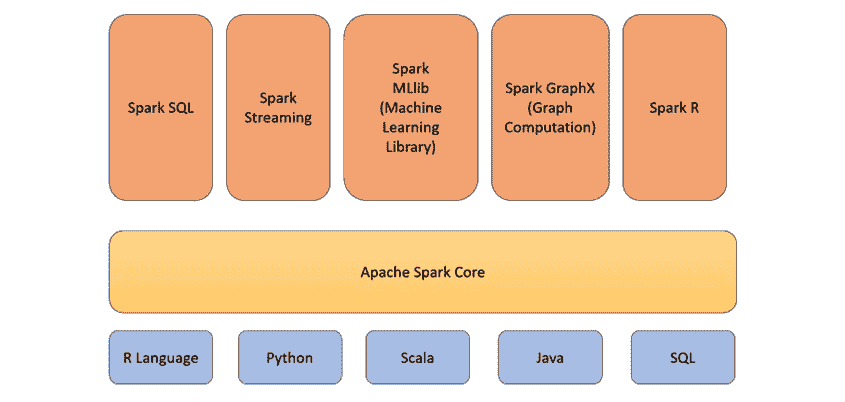

图 12.1-Apache Spark 组件

Spark 生态系统的各个组成部分如下:

*   **Spark Core**:Spark Core组件是 Spark 生态系统中最重要的组件。它负责基本功能，如输入输出操作、调度和监控作业。所有其他组件都构建在该组件之上。该组件使用特定的接口支持 Scala、Java、Python 和 R 编程语言。Spark 核心组件本身是用 Scala 编程语言编写的。
*   **Spark SQL**:Spark SQL 组件用于利用 SQL 查询的能力对存储在 Spark 节点中的数据进行数据查询。
*   **Spark Streaming**:Spark Streaming组件用于在同一个应用程序中批处理和流式传输数据。
*   **Spark MLlib** : Spark MLlib 是 Spark 用来开发和部署可伸缩 ML 管道的 ML 库。它还用于执行 ML 分析任务，如特征提取、特征工程、维度缩减等。
*   **GraphX**:GraphX 组件是一个库，用于对基于图形的数据执行数据分析。它用于执行图形数据构造和遍历。
*   **Spark R**:Spark R 组件是一个 R 包，提供了一个前端外壳，供用户通过 R 编程语言与 Spark 进行通信。R 完成的所有数据处理都是在单个节点上进行的。这使得 R 不适合处理大量数据。Spark R 组件通过使用底层的 Spark 集群，帮助用户以分布式的方式在巨大的数据集上执行这些数据操作。

## 了解 Apache Spark 架构

Apache Spark 拥有定义良好的架构。如前所述，Spark 运行在集群系统上。在这个集群中，将有一个节点被指定为主节点，而其他节点充当工作节点。所有这些工作都是由 worker 节点中的独立进程执行的，并且由 Spark 上下文来协调联合工作。

参考下图，更好地理解 Apache Spark 架构:

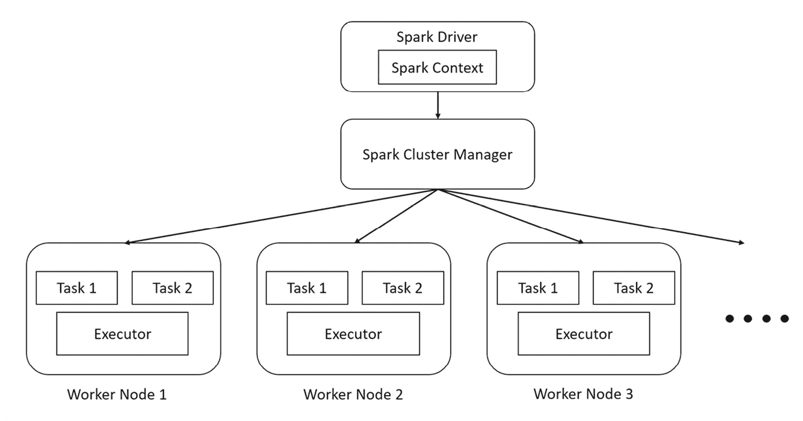

图 12.2–Apache Spark 架构

Spark 架构包括以下组件:

*   **Spark 集群管理器**:Spark 集群管理器负责管理节点的资源分配，并监控它们的健康状况。它负责维护运行 Spark 应用程序的机器集群。当您启动 Spark 应用程序时，集群管理器将根据指定的配置启动集群中的不同节点，并重新启动在执行过程中失败的任何服务。

Spark 集群管理器有三种类型:

*   这是一个简单的集群管理器，与 Spark 捆绑在一起，非常容易设置和使用。
*   **Hadoop YARN** : **另一个资源协商者** ( **YARN** )是 Hadoop 生态系统自带的资源管理器。Spark 作为一个数据处理系统，可以与许多数据存储系统集成。 **Hadoop 分布式文件系统** ( **HDFS** )是大数据行业中最常用的分布式文件系统之一，将 Spark 与 HDFS 一起使用已经成为公司中的常见设置。由于 YARN 附带了 Hadoop 生态系统，您可以使用相同的资源管理器来管理您的 Spark 资源。
*   **Kubernetes** : Kubernetes 是一个开源容器编排系统，用于自动化部署操作、扩展服务和其他形式的服务器管理。Kubernetes 还能够管理 Spark 集群资源。

*   **火花驱动**:火花驱动是火花应用的主程序。它负责控制应用程序的执行，跟踪节点的不同状态，以及分配给每个节点的任务。这个程序可以是你运行的任何脚本，甚至是 Spark 接口。
*   **Spark 执行器**:Spark 执行器是在 worker 节点上执行计算任务的实际进程。它们是非常简单的过程，目的是接受分配的任务，计算它，然后将结果发送回 Spark 上下文。
*   **Spark Context**:Spark Context，顾名思义，跟踪执行的上下文。Spark 驱动程序执行的任何命令都要经过这个上下文。Spark 上下文与 Spark 集群管理器通信，以便与正确的执行器协调执行活动。

Spark 驱动程序是管理集群上操作的并行执行的主要功能。驱动程序使用一种叫做**弹性分布式数据集** ( **RDD** )的数据结构来实现这一点。

## 了解什么是弹性分布式数据集

阿帕奇火花是在 **RDD** 的基础上打造的。它是驻留在多个节点上的数据的容错记录，并且是不可变的。你在 Spark 中所做的一切都是使用 RDD 完成的。因为它是不可变的，你做的任何转换最终都会创造一个新的 RDD。rdd 被划分成逻辑集，然后分布在 Spark 节点中执行。Spark 在内部处理所有这些分配。

让我们了解 Spark 如何使用 rdd 来大规模执行数据处理。请参考下图:

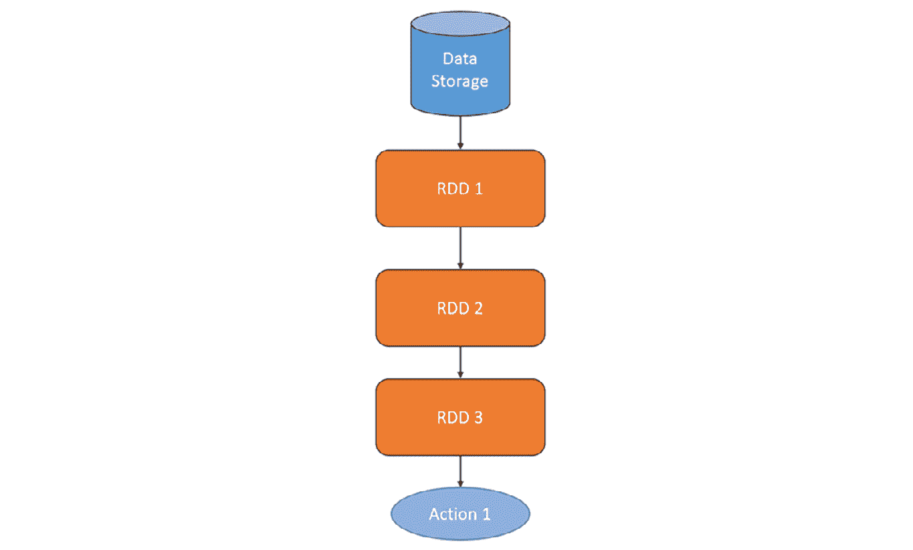

图 12.3–线性 RDD 变换

因此，rdd 是不可变的，这意味着一旦数据集被创建，就不能被修改。因此，如果您想要在数据集中进行更改，Spark 将从现有的 RDD 创建一个新的 RDD，并跟踪这些更改。这里，您的初始数据存储在 **RDD 1** 中，因此您必须假设您需要删除一列并将另一列的类型从字符串转换为数字。Spark 将创建 **RDD 2** ，它将包含这些更改，并记录它所做的更改。最终，当您进一步转换数据时，Spark 将包含许多 rdd。

您可能想知道如果需要对数据执行许多转换会发生什么；Spark 会创建那么多 RRD 并最终耗尽内存吗？记住，RDD 是弹性的和不可变的，所以如果你已经从 **RDD 2、**创建了 **RDD 3、**，那么你只需要保留 **RDD2** 和从 **RDD 2** 到 **RDD 3 的数据转换过程。你将不再需要 **RDD 1** ，这样就可以移除它以释放空间。Spark 会为您完成所有的内存管理工作。它将删除任何不需要的 rdd。**

对于一个简单的问题，这是一个非常简单的解释。如果您从同一个 RDD 中创建多个包含不同转换的 rdd 会怎么样呢？这可以从下图中看出:

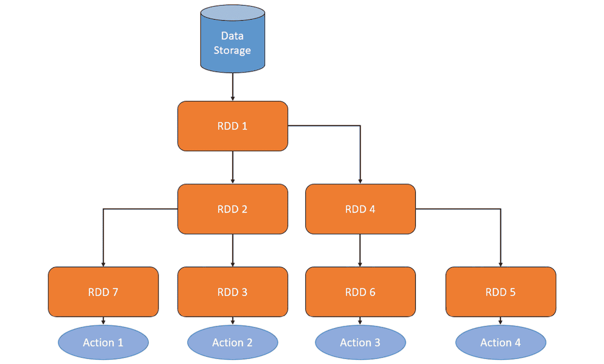

图 12.4–分支 RDD 变换

在这种情况下，您将需要来保存所有的 rdd。这就是 Spark 的**懒评**发挥作用的地方。惰性求值是一种求值技术，其中求值表达式被延迟到需要结果值的时候。让我们通过研究 RDD 的运营来更好地理解这一点。有两种类型的操作:

*   **转换**:转换是从包含数据集中变化的现有 RDD 中产生新 RDD 的操作。这些操作主要包括将原始数据集转换为可用于提取评估指标或其他流程的精确最终数据集。这主要涉及数据操作，如 union 操作或 groupby 操作。
*   **动作**:动作是以一个 RDD 作为输入，但不产生一个新的 RDD 作为输出的操作。从动作操作得到的输出值被发送回驱动程序。这主要涉及诸如 count 或 aggregate 之类的操作，count 返回 RDD 中元素的数量，aggregate 对 RDD 的内容执行聚合操作并将结果发送回来。

转换操作很懒。当在 RDD 上执行转换操作时，Spark 会记下需要做什么，但不会立即去做。它只会在得到一个动作操作的时候才开始转换过程，因此得名懒求值。

我们用一个简单的例子来了解一下整个的过程。假设您有一个 RDD，其中包含一家公司所有员工的原始数据集，并且您想要计算所有高级 ML 工程师的平均工资。你的转换操作是将所有 ML 工程师过滤成 **RDD 2** 然后再按资历进一步过滤成 **RDD 3** 当你将这个转换操作传递给 Spark 时，它不会创建 **RDD 3** 它只会记录下来。当它得到动作操作时——也就是计算平均工资时——懒惰评估开始起作用，Spark 开始执行转换，并最终执行动作。

惰性求值有助于 Spark 理解执行动作操作所需的转换操作，并在记住空间复杂性的同时找到最有效的转换方式。

小费

Spark 是一项非常复杂和强大的技术。它提供了很大的灵活性，可以配置为最适合不同类型的数据处理需求。在本章中，我们只是探索了 Apache Spark 的冰山一角。如果您有兴趣全面了解 Spark 的功能，我强烈建议您研究 Apache Spark 文档，该文档可以在[https://spark.apache.org/](https://spark.apache.org/)找到。

现在我们对 Spark 的工作原理有了一个基本的概念，让我们来理解 H2O 苏打水是如何结合 H2O 和 Spark 的。

# 探索 H2O 苏打水

**苏打水**是一款 H2O 产品，结合了H2O 的快速和可扩展 ML 与 Apache Spark 的分析能力。这两种技术的结合允许用户对数据管理进行 SQL 查询，将结果提供给 H2O 进行模型训练，构建模型并将其部署到生产中，然后使用它们进行预测。

H2O 苏打水的设计可以让你在普通的火花应用中运行 H2O。它在 Spark executors 内部运行 H2O 服务器，这样 H2O 服务器就可以访问 executors 中存储的所有数据，以执行任何基于 ML 的计算。

H2O 和 Spark 之间的透明整合提供了以下好处:

*   包括 AutoML 在内的 H2O 算法可用于 Spark 工作流
*   特定于应用程序的数据结构可以在 H2O 和 Spark 之间转换和支持
*   您可以在 H2O ML 算法中使用 Spark RDDs 作为数据集

苏打水支持两种类型的后端:

*   **内部后端**:在这种类型的设置中，一旦 H2O 上下文初始化，H2O 应用程序就会在 Spark executor 内部启动。然后，H2O 通过初始化每个执行器内部的键值存储和内存管理器来启动它的服务。将 H2O 苏打水作为内部后端部署是很容易的，但是如果 Spark 的集群管理器决定关闭任何一个执行器，那么在执行器中运行的 H2O 服务器也会被关闭。内部后端是 H2O 苏打水使用的默认设置。内部运行的 H2O 苏打水的结构如下:

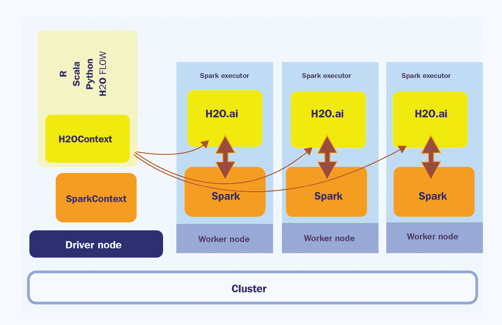

图 12.5–苏打水内部后端架构

如您所见，H2O 服务驻留在每个 Spark 执行器内部。

1.  **外部后端**:在这种类型的设置中，H2O 服务与 Spark 执行器分开部署，H2O 服务器和 Spark 执行器之间的通信由 Spark 驱动程序处理。H2O 苏打水作为外部后端的架构工作如下:

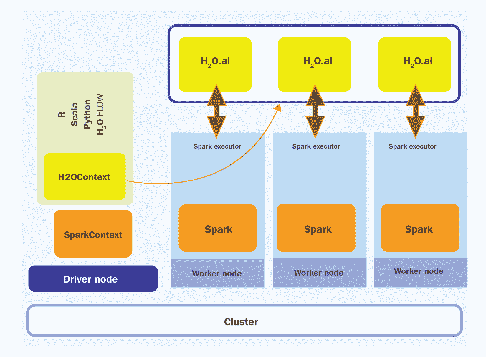

图 12.6–苏打水外部后端架构

如您所见，H2O 集群是与 Spark executor 分开运行的。这种分离有好处，因为 H2O 集群不再受 Spark 执行器关闭的影响。然而，这增加了 H2O 驱动程序的开销，它需要协调 H2O 集群和 Spark 执行器之间的通信。

尽管苏打水是建立在 Spark 的之上，但是在使用苏打水集群中的 H2O 服务器执行计算时，它使用了 H2OFrame。因此，在 Spark RDD 和 H2OFrame 之间有大量的数据交换和互换。

数据帧在不同类型之间转换如下:

*   **H2OFrame 转换成 RDD** :当将 H2OFrame 转换成 RDD 时，Sparkling Water 不是将数据重新创建成不同的类型，而是在 H2OFrame 周围创建一个包装器，其作用类似于 RDD API。这个包装器将所有基于 RDD 的操作解释为相同的 H2OFrame 操作。
*   **RDD 转换成 H2OFrame** :将 RDD 转换成 H2OFrame 包括评估 RDD 中的数据，然后将其转换成 H2OFrame。然而，H2OFrame 中的数据被严重压缩。H2O 和 Spark 之间共享的数据取决于用于部署的后端类型。
*   内部 Sparkling Water 后端中的数据共享:在内部 Sparkling Water 后端中，由于H2O 服务是在 Spark Executor 内部启动的，因此 Spark 服务和 Executor 内部的 H2O 服务都使用相同的 **Java 虚拟机** ( **JVM** )，这样，数据可以被两个服务访问。下图显示了内部苏打水后端的数据共享过程:

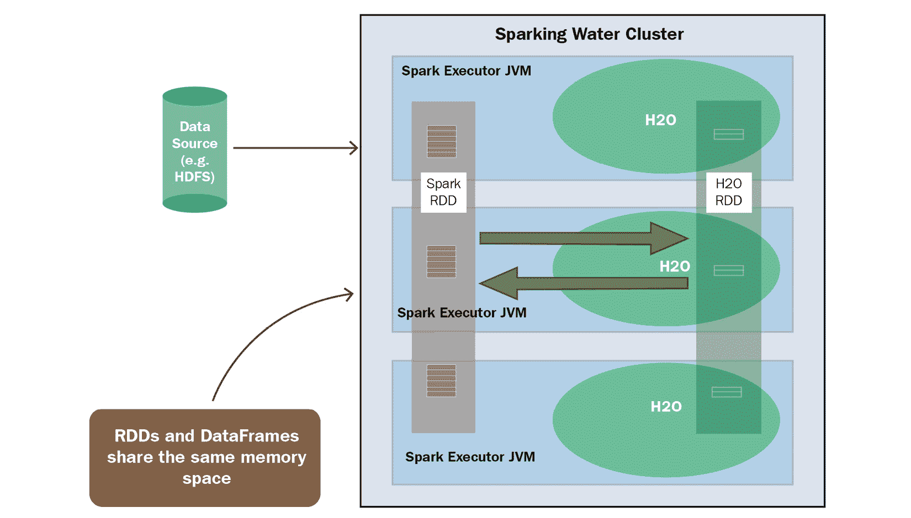

图 12.7–内部苏打水后端的数据共享

因为两个服务在同一个执行器上，所以在两种类型之间转换数据帧时，需要考虑内存。您将需要为 Spark 和 H2O 分配足够的内存来执行它们各自的操作。Spark 将需要数据集的最小内存，以及用于您希望执行的任何转换的额外内存。此外，将 rdd 转换为 H2OFrames 将导致数据重复，因此建议将 4x 大的数据集用于 H2O。

*   **外部苏打水后端**中的数据共享:在外部苏打水后端中，H2O 服务在一个独立于 Spark Executor 的集群中启动。因此，通过网络将数据从一个集群传输到另一个集群会产生额外的开销。下图应该有助于您理解这一点:

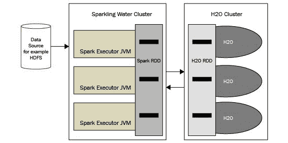

图 12.8–外部苏打水后端的数据共享

由于两个服务都驻留在它们自己的集群中(如果你已经为各自的集群分配了足够的内存)，你不需要担心内存限制。

小费

H2O 苏打水可以在不同类型的平台上以不同的方式运行。如果您有兴趣了解更多关于部署 H2O 苏打水的各种方法，以及获得更多关于其后端的信息，请随时查看[https://docs . H2O . ai/Sparkling-Water/3.2/latest-stable/doc/design/supported _ platforms . XHTML](https://docs.h2o.ai/sparkling-water/3.2/latest-stable/doc/design/supported_platforms.xhtml)。

现在我们知道了 H2O 苏打水是如何工作的，让我们看看如何下载和安装它。

## 下载并安装 H2O 苏打水

H2O 苏打水有一些特殊的要求，需要满足后才能安装到您的系统上。安装 H2O 汽水版本 3.36 的要求如下:

*   **操作系统** : H2O 苏打水仅支持 Linux、macOS 和 Windows。
*   **Java 版本** : H2O 苏打水支持 Java 1.8 以上的所有 Java 版本。
*   **Python 版本**:如果你打算使用 Python 版本的 Sparkling Water，也就是 PySparkling，那么你需要在你的系统上安装一个 Python 版本ABOve 3.6。
*   **H2O 版本** : H2O 汽水版本 3.36.1 要求您的系统上安装相同版本的 H2O。然而，H2O 苏打水预先包装了一个兼容的 H2O 版本，所以你不需要单独安装 H2O 来使用 H2O 苏打水。
*   **Spark 版本** : H2O 苏打水 3.36.1 版本严格支持 Spark 3.2。任何高于或低于 3.2 版本的火花可能会导致安装或 H2O 苏打水如何工作的问题。Spark 3.2 有自己的依赖项，如下所示:
    *   **Java 版本** : Spark 3.2 严格支持 Java 8 和 Java 11
    *   **Scala 版本** : Spark 3.2 严格运行在 Scala 2.12/2.13 上
    *   **R 版本** : Spark 3.2 支持 3.5 以上的任何 R 版本
    *   **Python 版本** : Spark 3.2 支持 3.6 以上的任何 Python 版本
*   `SPARK_HOME`指向本地 Spark 3.2 安装的环境变量。

现在，让我们设置我们的系统，这样我们就可以下载并安装 H2O 苏打水。按照以下步骤设置 H2O 苏打水:

1.  我们将从安装 Java 11 开始，Spark 和 H2O 起泡水都需要 Java 11。尽管 Spark 也支持 Java 8，但最好使用 Java 11，因为它是更新的版本，有改进和安全补丁。您可以通过执行以下命令下载并安装 Java 11:

    ```
    sudo apt-get install openjdk-11-jdk
    ```

2.  或者，如果您希望使用 PySparkling Python 解释器，请安装 Python 3.10 版。您可以通过执行以下命令来实现这一点:

    ```
    sudo apt install python3
    ```

3.  现在我们已经安装了基本语言，让我们继续下载并安装 Spark 版。您可以从 Apache 软件基金会官方下载页面(https://www . Apache . org/dyn/closer . Lua/Spark/Spark-3 . 2 . 1/Spark-3 . 2 . 1-bin-Hadoop 3.2 . tgz)下载 Spark 的具体版本，或者直接在您的终端中运行以下命令:

    ```
    wget https://downloads.apache.org/spark/spark-3.1.2/spark-3.1.2-bin-hadoop3.2.tgz
    ```

如果你正在使用 **Maven 项目**，那么你可以直接指定 Spark 核心 Maven 依赖项，如下:

```
<dependency>
    <groupId>org.apache.spark</groupId>
    <artifactId>spark-core_2.13</artifactId>
    <version>3.1.2</version>
</dependency>
```

你可以在[https://mvn repository . com/artifact/org . Apache . Spark/Spark-core](https://mvnrepository.com/artifact/org.apache.spark/spark-core)找到 Spark 的 Maven 资源库。

1.  然后，您可以通过在终端中执行以下命令来提取`.tar`文件:

    ```
    sudo tar xzvf spark-*
    ```

2.  现在我们已经提取了Spark 二进制文件，让我们设置我们的环境变量，如下所示:

    ```
    export SPARK_HOME="/path/to/spark/installation"
    ```

3.  我们还必须将`MASTER`环境变量设置为`local[*]`来启动一个本地 Spark 集群:

    ```
    export MASTER="local[*]"
    ```

4.  现在我们已经安装并准备好了 H2O 苏打水的所有依赖项，让我们继续下载 H2O 苏打水。你可以从 https://h2o.ai/products/h2o-sparkling-water/下载最新版本。点击**下载最新**按钮，你会被重定向到 H2O 苏打水知识库网站，在那里你可以下载 H2O 苏打水版本 *3.36* ZIP 文件。
5.  下载完成后，您可以在终端中执行以下命令来解压缩 zip 文件:

    ```
    unzip sparkling-water-*
    ```

6.  您可以通过在您的苏打水安装文件夹中执行以下命令来启动 H2O 苏打水外壳，看看是否一切正常:

    ```
    bin/sparkling-shell
    ```

7.  通过这样做，你可以通过在火花簇内启动一个 H2O 云来查看波光粼粼的水是否已经与火花结合。您可以通过在`sparkling-shell` :

    ```
    import ai.h2o.sparkling._ val h2oContext = H2OContext.getOrCreate()
    ```

    中执行以下命令来实现

您应该会得到类似如下的输出:

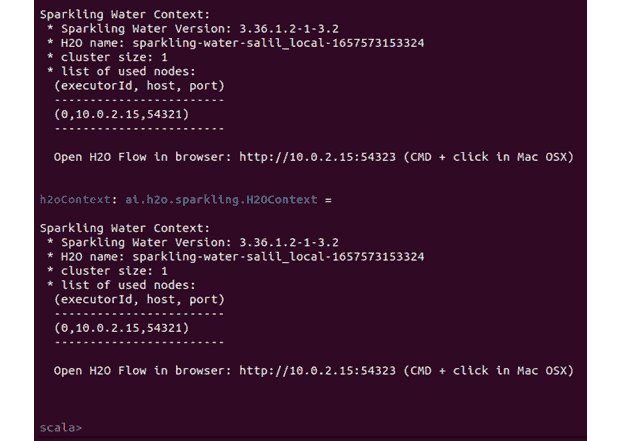

图 12.9–成功启动 H2O 苏打水

现在我们已经成功下载并安装了 Spark 和 H2O 苏打水，并确保两者都能正常工作，根据 H2O.ai 的文档，有一些通用的推荐调整你必须做。让我们来看看:

*   启动闪灵外壳时，从`config`参数的默认值增加火花驱动器和火花执行器的可用内存:

    ```
    bin/sparkling-shell --conf spark.executor.memory=4g spark.driver.memory=4g
    ```

如果你使用 YARN 或者你的集群管理器，那么使用`config spark.yarn.am.memory`而不是`spark.driver.memory`。您也可以通过设置`spark-defaults.conf`文件中的值，将这些值设置为默认配置属性。这可以在您的 Spark 安装文件中找到。

*   除了集群内存，还建议增加 Spark 节点的 PermGen 大小。默认的 PermGen 大小通常很小，可能会导致`OutOfMemoryError`。`spark.driver.extraJavaOptions`和`spark.executor.extraJavaOptions`配置选项，如下:

    ```
    bin/sparkling-shell --conf spark.driver.extraJavaOptions -XX:MaxPermSize=384 -XX:PermSize=384m spark.executor.extraJavaOptions -XX:MaxPermSize=384 -XX:PermSize=384m
    ```

*   还建议保持集群的同质性——也就是说，Spark 驱动程序和执行器分配了相同数量的资源。
*   还建议使用以下配置来加速和稳定 Spark 集群上 H2O 服务的创建:
    *   增加等待以数据本地模式启动的任务的秒数，以便在本地使用数据处理 H2O 任务。您可以按如下方式进行设置:

        ```
        bin/sparkling-shell --conf spark.locality.wait=3000
        ```

    *   强制 Spark 仅在分配了 100%的资源时才开始调度作业:

        ```
        bin/sparkling-shell --conf spark.scheduler.minRegisteredResourcesRatio=1
        ```

    *   不重试失败的任务:

        ```
        bin/sparkling-shell --conf spark.task.maxFailures=1
        ```

    *   将每个执行器对驱动的心跳间隔设置为小于 Spark 的网络超时——即`spark.network.timeout`——默认值为 *120 秒*。因此，将心跳值设置为大约 *10 秒* :

        ```
        bin/sparkling-shell --conf spark.executor.heartbeatInterval=10s
        ```

现在我们已经适当地配置了 Spark 和 H2O 苏打水，让我们看看如何使用这些技术来解决使用 Spark 和 H2O AutoML 的 ML 问题。

## 使用 H2O 苏打水实施 Spark 和 H2O AutoML

对于这个实验，我们将使用混凝土抗压强度数据集。你可以在 https://archive . ics . UCI . edu/ml/datasets/Concrete+Compressive+Strength 找到这个数据集。

以下是关于数据集的更多详细信息:I-Cheng Yeh，*使用人工神经网络对高性能混凝土的强度进行建模*，水泥和混凝土研究，第 28 卷，第 12 期，第 1797-1808 页(1998 年)。

让我们从理解我们将使用的问题陈述开始。

### 理解问题陈述

混凝土抗压强度数据集是一个由*1030*个数据点组成的数据集，包括以下特征:

*   **水泥**:该特征表示以 kg 为单位在 m3 混合物中加入的水泥量
*   **高炉渣**:该特征表示以千克为单位的混合物中加入的炉渣量
*   **飞灰**:此特征表示混合物中添加的飞灰量，单位为千克/立方米
*   **水**:该特性表示混合物中加入的水量，单位为千克/立方米
*   **超塑化剂**:此特征表示混合物中加入的超塑化剂的量，单位为千克/立方米
*   **粗骨料**:该特征表示混合料中添加的粗骨料(换句话说，石头)的量，单位为千克/立方米
*   **细骨料**:该特征表示混合料中添加的细骨料(换句话说，砂)的量，单位为千克/立方米
*   **龄期**:该特征表示水泥的龄期
*   **混凝土抗压强度**:该特征表示混凝土的抗压强度，单位为**兆帕** ( **兆帕**)

ML 问题就是利用所有的特征来预测混凝土的抗压强度。

数据集的内容如下:


图 12.10-混凝土抗压强度数据集样本

那么，让我们看看如何使用 H2O 苏打水来解决这个问题。首先，我们将学习如何使用 H2O AutoML 和 Spark 训练模型。

### 在波光粼粼的水中跑步训练

一旦成功安装了 Spark 3.2 和 H2O 苏打水，以及设置了正确的环境变量(`SPARK_HOME`和`MASTER`，您就可以开始模型训练过程。

请遵循以下步骤:

1.  通过执行 H2O 汽水提取文件夹中的命令启动汽水外壳:

    ```
    ./bin/sparkling-shell
    ```

这应该会在您的终端中启动一个 Scala shell。输出应该如下所示:

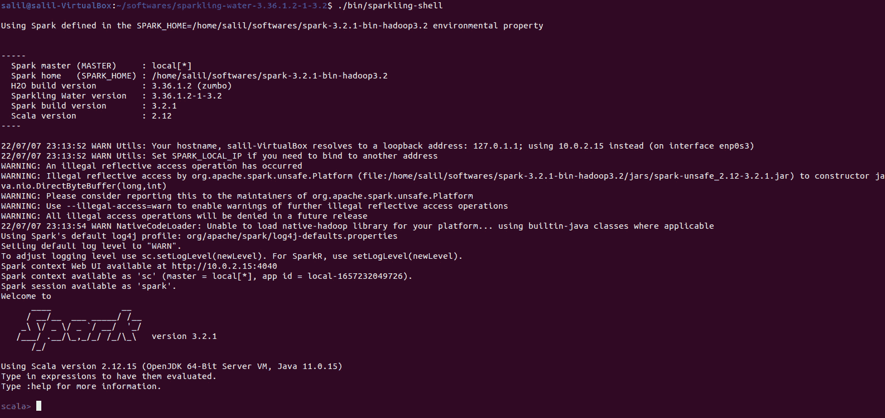

图 12.11–H2O 苏打水的 Scala 外壳

您还可以使用`PySparkling` shell 在 Python 中执行相同的实验。您可以通过执行以下命令来启动`PySparkling` shell:

```
./bin/PySparkling
```

您应该会得到类似如下的输出:

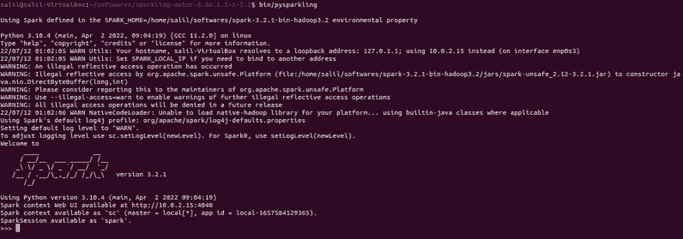

图 12.12-H2O 苏打水的 Python 外壳

1.  现在，我们需要在 Spark 环境中启动一个 H2O 集群。我们可以通过创建一个 H2OContext，然后执行它的`getOrCreate()`函数来做到这一点。因此，在您闪亮的 shell 中执行以下代码，导入必要的依赖项并执行 H2O 上下文代码:

    ```
    import ai.h2o.sparkling._ import java.net.URI val h2oContext = H2OContext.getOrCreate()
    ```

在 PySparkling shell 中，代码如下:

```
from PySparkling import *
h2oContext = H2OContext.getOrCreate()
```

您应该得到类似如下的输出，表明您的 H2O 上下文已经创建:


图 12.13–H2O 上下文创建成功

1.  现在，我们必须确保我们的混凝土抗压强度数据集可以在每个使用 Spark 内置文件 I/O 系统的节点上下载。因此，执行以下命令来导入数据集:

    ```
    import org.apache.spark.SparkFiles spark.sparkContext.addFile("/home/salil/Downloads/Concrete_Data.csv")
    ```

在 PySparkling shell 中，我们必须使用 H2O 的`import`函数导入数据集。Python 代码如下所示:

```
import h2o
h2oFrame = h2o.import_file("/home/salil/Downloads/Concrete_Data.csv")
```

1.  添加之后，我们必须通过在 Scala shell 中执行以下命令将数据集解析成 Spark 数据帧:

    ```
    val sparkDataFrame = spark.read.option("header", "true").option("inferSchema", "true").csv(SparkFiles.get("Concrete_Data.csv"))
    ```

在 PySparkling shell 中，等效代码如下:

```
sparkDataFrame = hc.asSparkFrame(h2oFrame)
```

1.  现在，`sparkDataFrame`包含了作为 Spark 数据框架的数据集。因此，让我们对其执行训练测试分割，将数据帧分割为测试和训练数据帧。您可以通过在 Sparkling shell 中执行以下命令来做到这一点:

    ```
    val Array(trainingDataFrame, testingDataFrame) = sparkDataFrame.randomSplit(Array(0.7, 0.3), seed=123)
    ```

在 PySparkling shell 中，执行以下命令:

```
[trainingDataFrame, testingDataFrame] = sparkDataFrame.randomSplit([0.7, 0.3], seed=123)
```

1.  我们现在已经分别准备好`trainingDataFrame`和`testingDataFrame`进行训练和测试。让我们创建一个 H2OAutoML 实例来自动训练`trainingDataFrame`上的模型。执行以下命令来实例化一个 H2O AutoML 对象:

    ```
    import ai.h2o.sparkling.ml.algos.H2OAutoML val aml = new H2OAutoML()
    ```

在 PySparkling 中，当初始化 H2O AutoML 对象时，我们还设置了标签列。这方面的代码如下:

```
from PySparkling.ml import H2OAutoML
aml = H2OAutoML(labelCol=" Concrete compressive strength ")
```

1.  让我们看看如何设置数据集的标签，以便 AutoML 对象知道数据帧中的哪些列将在 Scala shell 中被预测。执行以下命令:

    ```
    aml.setLabelCol("Concrete compressive strength")
    ```

除非明确指定，否则 H2O 会将数据帧的所有列视为特征。但是，它将忽略设置为**标签**、**折叠列**、**权重**的列，或者任何其他显式设置的忽略列。

H2O 汽车公司根据回复栏的类型区分回归和分类问题。如果响应列是一个字符串，那么 H2O AutoML 假定它是一个`ai.h2o.sparkling.ml.algos.classification.H2OAutoMLClassifier`对象或`ai.h2o.sparkling.ml.algos.regression.H2OAutoMLRegressor`对象而不是`ai.h2o.sparkling.ml.algos.H2OautoML`，正如我们在这个例子中所做的。

1.  现在，让我们将 AutoML 模型训练限制到只有 10 个模型。执行以下命令:

    ```
    aml.setMaxModels(10)
    ```

这段代码的等效 Python 语法是相同的，所以在 PySparkling shell 中执行相同的命令。

1.  一旦我们设置好了 AutoML 对象，剩下的唯一事情就是触发训练。为此，执行以下命令:

    ```
    val model = aml.fit(trainingDataFrame)
    ```

Python 的等效代码如下:

```
model = aml.fit(trainingDataFrame)
```

训练结束后，您应该会得到类似如下的输出:

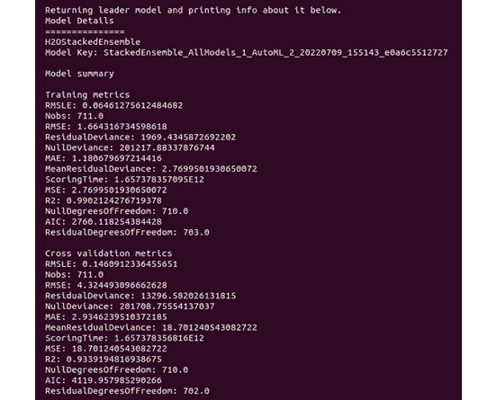

图 12.14-H2O 汽车公司在 H2O 汽水中的结果

如您所见，我们得到了一个堆叠的系综模型作为主模型，其下有模型关键字。在**模型关键字**下面是**模型摘要**，它包含培训和交叉验证指标。

正如我们在 [*第 2 章*](B17298_02.xhtml#_idTextAnchor038) 、*使用 H2O 流(H2O 的 Web UI)* 中所做的，我们没有为`aml`对象设置排序度量，所以默认情况下，H2O AutoML 将使用默认度量。这将是`deviance`,因为它是一个`automl.setSortMetric()`,并传入您选择的排序度量。

1.  您还可以通过使用`getModelDetails()`功能获得模型的详细视图。执行以下命令:

    ```
    model.getModelDetails()
    ```

这个命令将在 PySparkling 和 Scala shells 上运行，并将输出关于模型元数据的非常详细的 JSON。

1.  您也可以通过执行以下命令查看 AutoML 排行榜:

    ```
    val leaderboard = aml.getLeaderboard() leaderboard.show(false)
    ```

PySparkling shell 的等效 Python 代码如下:

```
leaderboard = aml.getLeaderboard("ALL")
leaderboard.show(truncate = False)
```

您应该会得到类似如下的输出:


图 12.15-H2O 苏打水 H2O 汽车排行榜

这将显示排行榜,其中包含所有经过培训并根据分类标准进行排名的型号。

1.  用 H2O 苏打水做预测也很容易。预测功能被包装在一个简单易用的名为`transform`的包装函数中。执行以下代码，对测试数据帧进行预测:

    ```
    model.transform(testingDataFrame).show(false)
    ```

在 PySparkling 外壳中，略有不同。这里，您必须执行以下代码:

```
model.transform(testingDataFrame).show(truncate = False)
```

您应该会得到类似如下的输出:

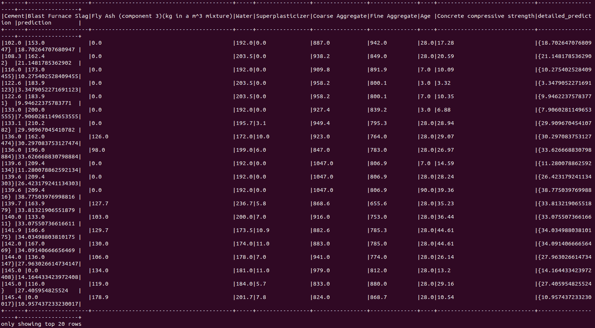

图 12.16–预测结果与测试数据相结合

`transform` 函数的输出显示了整个**测试数据帧**，在右侧增加了两列，分别称为**详细预测**和**预测**。

1.  现在，让我们下载这个模型作为一个 MOJO，以便我们可以在下一个实验中使用它，在那里我们将看到 H2O 苏打水是如何加载和使用 MOJO 模型的。执行以下命令:

    ```
    model.write.save("model_dir")
    ```

这个命令对于 Scala 和 Python shells 都是一样的，应该在您指定的路径下下载 model MOJO。如果您使用 Hadoop 文件系统作为 Spark 数据存储引擎，那么该命令默认使用 HDFS。

既然我们已经知道如何导入数据集、训练模型，并使用 H2O 苏打水进行预测，那么让我们更进一步，看看如何通过将现有的模型二进制文件(也称为 MOJOs)加载到 H2O 苏打水并对其进行预测来重用它们。

### 在 H2O 汽水中使用模型魔咒做预测

当你用 H2O 苏打水训练模型时，生成的模型总是 MOJO 类型的。H2O 苏打水可以加载由 H2O-3 生成的模型 MOJOs，并且也向后兼容不同版本的 H2O-3。您不需要创建 H2O 上下文来使用模型 MOJOs 进行预测，但是您需要一个评分环境。让我们通过完成一个实验来理解这一点。

请遵循以下步骤:

1.  要使用导入的模型 MOJOs 进行预测，您需要一个评分环境。我们可以通过两种方式创造一个得分环境；让我们来看看:
    1.  使用苏打水准备的脚本，它设置了加载 MOJOs 和在 Spark 类路径上进行预测所需的所有依赖项。请参考以下命令:

以下命令适用于 Scala shell:

```
./bin/spark-shell --jars jars/sparkling-water-assembly-scoring_2.12-3.36.1.3-1-3.2-all.jar
```

以下命令适用于 Python shell:

```
./bin/pyspark --py-files py/h2o_PySparkling_scoring_3.2-3.36.1.3-1-3.2.zip
```

1.  直接使用 Spark，手动设置依赖关系。

1.  一旦我们建立了评分环境，我们就可以加载模型 MOJOs 了。装入苏打水的模型魔咒是不可改变的。因此，一旦加载了模型，就不可能进行任何配置更改。但是，您可以在加载模型之前设置配置。您可以通过使用`H2OMOJOSettings()`功能来实现。参考下面的例子:

    ```
    import ai.h2o.sparkling.ml.models._ val modelConfigurationSettings = H2OMOJOSettings(convertInvalidNumbersToNa = true, convertUnknownCategoricalLevelsToNa = true)
    ```

对于 PySparkling，请参考以下代码的:

```
from PySparkling.ml import *
val modelConfigurationSettings = H2OMOJOSettings(convertInvalidNumbersToNa = true, convertUnknownCategoricalLevelsToNa = true)
```

1.  一旦您设置了配置设置，您就可以使用`H2OMOJOModel`库中的`createFromMojo()`函数加载模型 MOJO。因此，执行以下代码来加载您在*在苏打水中运行 AutoML 培训*部分中创建的模型 MOJO，并传递配置设置:

    ```
    val loadedModel = H2OMOJOModel.createFromMojo("model_dir/model_mojo", modelConfigurationSettings)
    ```

Python 的对等用法如下:

```
loadedModel = H2OMOJOModel.createFromMojo("model_dir/ model_mojo", modelConfigurationSettings)
```

如果您指定的模型 MOJO 路径作为一个相对路径，如果 HDFS 是启用的，苏打水将检查 HDFS 主目录；否则，它将从当前目录中搜索它。您还可以传递模型 MOJO 文件的绝对路径。

您也可以手动指定您想要加载模型 MOJO 的位置。对于 HDFS 文件系统，您可以使用以下命令:

```
loadedModel = H2OMOJOModel.createFromMojo("hdfs:///user/salil/ model_mojo")
```

对于本地文件系统，您可以使用以下命令:

```
loadedModel = H2OMOJOModel.createFromMojo("file:///Users/salil/some_ model_mojo")
```

1.  一旦成功加载，您可以简单地使用模型进行预测，正如我们在*在气泡水中运行 AutoML 训练*部分所做的那样。因此，执行下面的命令，使用您最近加载的模型 MOJO 进行预测:

    ```
    val predictionResults = loadedModel.transform(testingDataframe)
    ```

2.  预测结果存储为另一个火花数据帧。因此，为了查看预测值，我们可以通过执行下面的命令来显示预测结果:

    ```
    predictionResults.show()
    ```

您应该会得到类似如下的输出:


图 12.17–来自模型 MOJO 的预测结果

正如你所看到的，在加载 MOJO 时，我们特意将`withDetailedPredictionCol`设置为`False`。这就是为什么我们在预测结果中看不到详细的`_prediction_column`。

小费

有很多配置，你可以设置加载 H2O 模型魔咒到苏打水。还有其他方法可用于 MOJO 模型，有助于收集关于模型 MOJO 的更多信息。所有这些细节都可以在 H2O 的官方文档页面[https://docs . H2O . ai/sparkling-water/3.2/latest-stable/doc/deployment/load _ mojo . XHTML # loading-and-use-of-H2O-3-mojo-model](https://docs.h2o.ai/sparkling-water/3.2/latest-stable/doc/deployment/load_mojo.xhtml#loading-and-usage-of-h2o-3-mojo-model)找到。

祝贺你——你刚刚学会了如何使用 Spark 和 H2O AutoML 一起使用 H2O 苏打水。

# 总结

在这一章中，我们学习了如何使用 H2O AutoML 与阿帕奇火花使用 H2O 系统称为 H2O 苏打水。我们从了解什么是 Apache Spark 开始。我们研究了构成 Spark 软件的各种组件。然后，我们深入研究了它的架构，了解了它如何使用一组计算机来执行数据分析。我们研究了 Spark 集群管理器、Spark 驱动程序、执行器以及 Spark 上下文。然后，我们深入研究 rdd，了解 Spark 如何使用它们对数据集上的转换操作执行惰性评估。我们还知道 Spark 足够聪明，能够高效地管理其资源，并在运营期间删除任何未使用的 rdd。

基于对 Spark 的了解，我们开始探索 H2O 苏打水是什么，以及它如何在一个无缝集成的系统中使用 Spark 和 H2O。然后，我们更深入地研究了它的架构，并理解了它的两种类型的后端，这两种后端可以用来部署系统。我们也了解它如何处理 Spark 和 H2O 之间的数据交换。

一旦我们对什么是 H2O 苏打水有了一个清晰的概念，我们就开始实际使用这个系统。我们学习了如何下载和安装系统，以及平稳运行所需的严格依赖关系。我们还探讨了启动 H2O 苏打水时 H2O.ai 推荐的各种配置调整。系统启动并运行后，我们进行了一项实验，使用混凝土抗压强度数据集对使用 H2O 苏打水的混凝土抗压强度进行预测。我们将数据集导入 Spark 集群，使用 H2O AutoML 执行 AutoML，并使用领先模型进行预测。最后，我们学习了如何将模型魔咒导入和导出到 H2O 苏打水，并使用它们进行预测。

在下一章中，我们将探索由 H2O.ai 进行的一些案例研究，并了解企业在现实世界中实施 H2O 的情况，以及 H2O 如何帮助他们解决他们的 ML 问题。