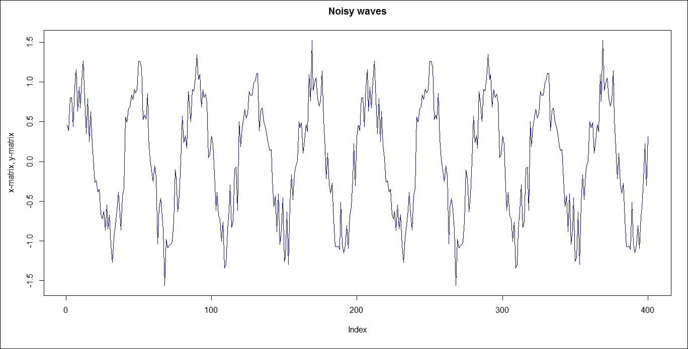
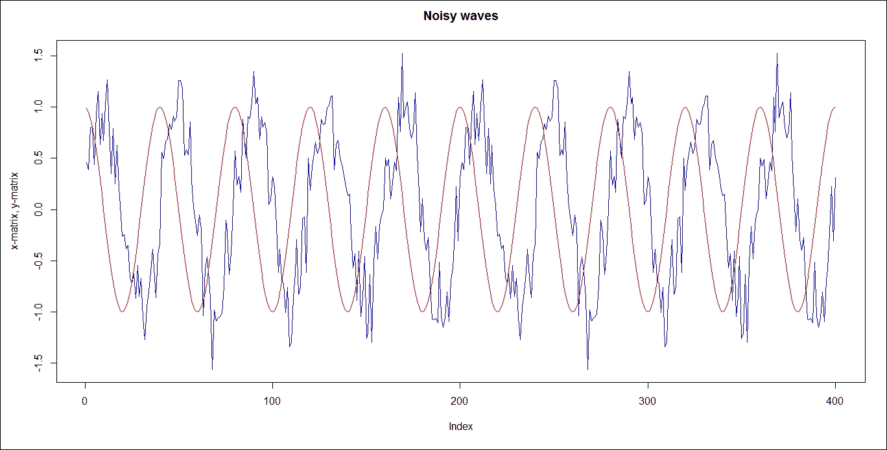
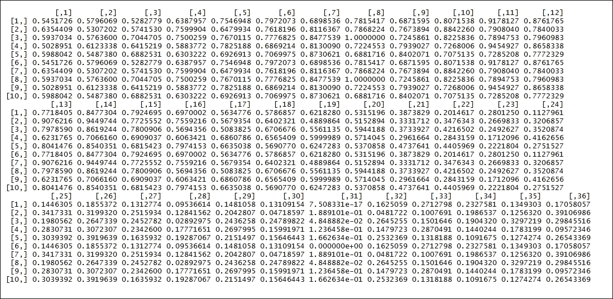
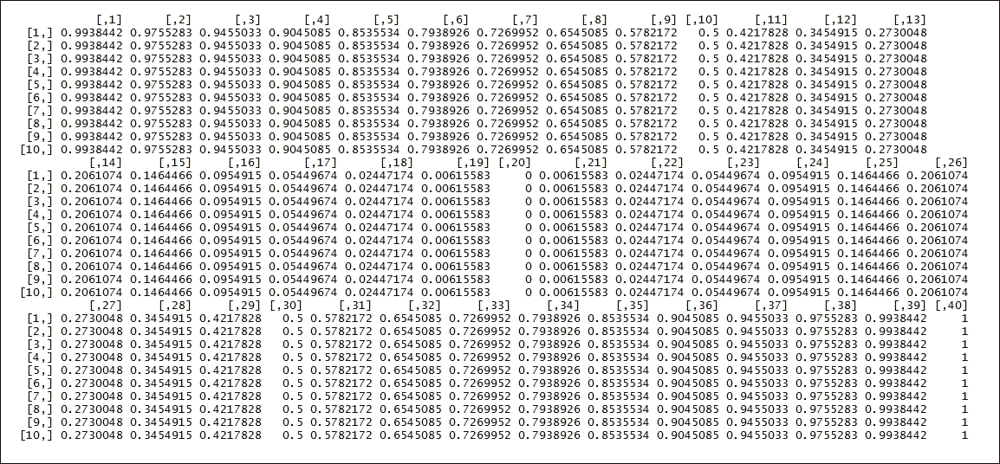
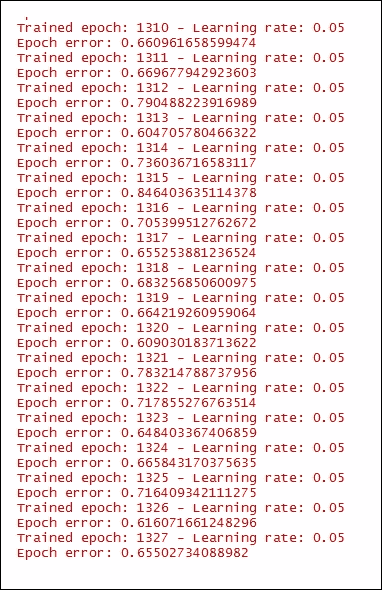
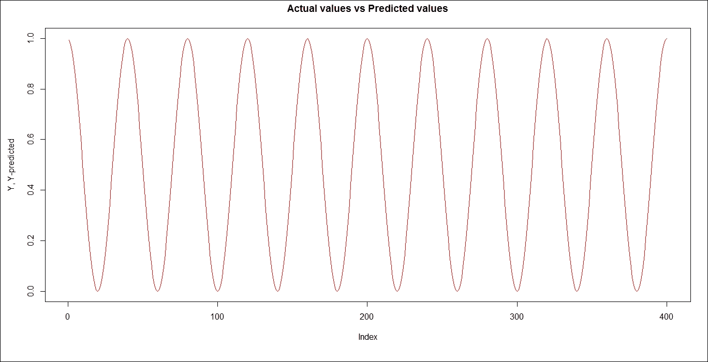
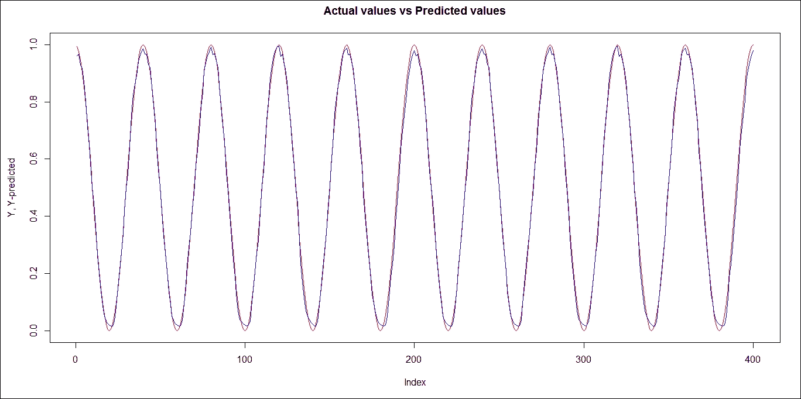
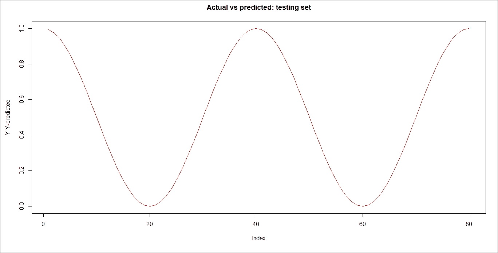
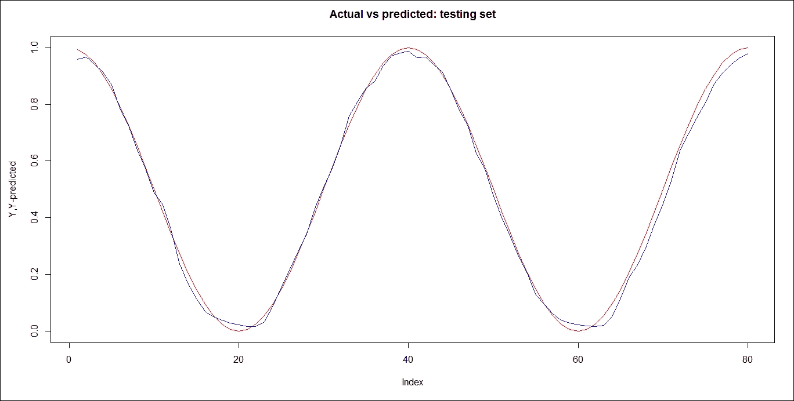

# 十一、深度学习

在本章中，我们将介绍以下配方:

循环神经网络-预测周期信号

# 简介

由于预定义的表示和输入特征，大多数机器学习算法工作良好。机器学习算法优化权重以最佳地做出最终预测，而表示学习试图自动学习好的特征或表示。深度学习算法试图通过增加复杂性来学习多个级别的表示。深层架构由多层次的非线性运算组成，比如有很多隐藏层的神经网络。深度学习技术的主要目标是学习特征层次。深度学习技术可以分为三大类；用于无监督或生成学习的深度网络、用于监督学习的深度网络和混合深度网络


# 循环神经网络-预测周期性信号

振荡器是产生特定周期性波形的电路，如方波、三角波、锯齿波和正弦波。为了产生输出，振荡器通常使用某种形式的有源器件——灯，灯周围有电阻、电容和电感。振荡器的两个主要类别是张弛振荡器和正弦振荡器。使用张弛振荡器产生三角波、锯齿波和其他非正弦波形，而正弦振荡器由带有外部元件的放大器组成，以产生振荡。正常情况下，纯正弦波中不存在谐波，它们由单一频率组成。

## 准备就绪...

任务是从有噪声的正弦波预测余弦。5Hz 频率的波用于带有一些正态分布噪声的正弦波和平滑的余弦波。创建的数据集是一组 10 个序列，每个序列由 40 个观察值组成。

## 怎么做...

作为要执行的第一步，需要加载以下软件包:

```py
 > install.packages("rnn")
 > library(rnn)

```

出于再现性的目的，将初始种子设置为随机数:

```py
> set.seed(10)

```

初始化所需的频率:

```py
> f <- 5

```

创建所需的向量:

```py
> w <- 2*pi*f

```

生成序列:`seq()`函数生成规则序列。`0.005`是起始值，而`2`是结束值。`by=0.005`决定了增量顺序:

```py
> t <- seq(0.005,2,by=0.005)

```

生成`sin`和`cos`值:

```py
 > x <- sin(t*w) + rnorm(200, 0, 0.25)
 > y <- cos(t*w)

```

生成时间序列的样本:`matrix()`函数从`x`和`y`值创建一个矩阵。`nrow = 40`表示所需的行数:

```py
 > X <- matrix(x, nrow = 40)
 > Y <- matrix(y, nrow = 40)

```

绘制噪音波:。`plot()`函数是绘制 R 对象的通用函数。`as.vector(X)`数据帧作为函数值传递。`type='l'`象征线条:

```py
> plot(as.vector(X), col='blue', type='l', ylab = "x-matrix, y-matrix", main = "Noisy waves")

```

结果如下:



```py
> lines(as.vector(Y), col = "red")

```

结果如下:



规范`X`的价值观。值的范围介于 0 和 1 之间:

```py
> X <- (X - min(X)) / (max(X) - min(X))

```

打印`X`的值:

```py
> X

```

结果如下:



标准化`Y`的值。值的范围介于 0 和 1 之间:

```py
> X <- (X - min(X)) / (max(X) - min(X))

```

打印`X`的值:

```py
> X

```

结果如下:



转置`X`和`Y`的值:

```py
 > X <- t(X)
 > Y <- t(Y)

```

创建训练集和测试集:

```py
 > train <- 1:8
 > test <- 9:10

```

训练循环神经网络。`Y = Y[train,]`表示输出值的数组。`X = X[train,]`表示输入值的数组。`learningrate = 0.05`表示应用于权重迭代的比率。`hidden_dim = 16`是隐藏层的维度。`numepochs = 1500`是整个数据集经历训练的次数。

这个阶段需要时间。所花费的时间取决于学习率、维数以及整个数据集接受训练的次数:

```py
> model <- trainr(Y = Y[train,],X = X[train,],learningrate = 0.05,hidden_dim = 16,numepochs = 1500)

```

结果如下:



预测循环神经网络的输出:

```py
> Y_predicted <- predictr(model, X)

```

绘制**实际值与**预测值。输出构成了训练集和测试集:

```py
> plot(as.vector(t(Y)), col = 'red', type = 'l', main = "Actual values vs Predicted values", ylab = "Y, Y-predicted")

```

结果如下:



```py
> lines(as.vector(t(Y_predicted)), type = 'l', col = 'blue')

```

结果如下:



绘制**实际值和**预测值。输出仅构成测试集:

```py
> plot(as.vector(t(Y[test,])), col = 'red', type='l', main = "Actual vs predicted: testing set", ylab = "Y,Y-predicted")

```

结果如下:



```py
> lines(as.vector(t(Y_predicted[test,])), type = 'l', col = 'blue')

```

结果如下:

