# 第十三章。案例研究-再保险合同定价

# 简介

顾名思义，再保险是从保险业务发展而来的，其使用范围不仅取决于金额，还取决于直接保险人承保的风险的特点。可以交易的再保险业务量主要取决于在任何给定时间可获得的直接业务量。再保险的理念根植于人类的本能，正是这种本能导致了保险的产生，也就是说，一个人的损失由许多人分担的愿望。


# 再保险合同定价

保险人安排再保险的主要目标包括:由于财务限制，通过将通常不会承担的部分风险转移给再保险人，提高处理较大风险的能力；提高接受超过资本允许额度的能力；通过再保险人吸收更大的索赔或巨灾损失，逐年稳定经营业绩；通过加强承销商建立一个在风险大小和质量上均一的账户的努力来增加获利的机会；写作能力和新的风险暴露。再保险的功能可以被认为是提供服务以保护增加的能力、金融稳定、稳定索赔比率、不同类别索赔的累积、分散风险、保护偿付能力差额和稳定利润。再保险有助于吸收因经济变化、社会变化、保险方法变化和科学发展引起的变化而产生的较新的风险暴露。只有两种方式可以安排再保险合同，一种是针对单一保单的一次性临时再保险，另一种是针对特定保单组的自动约定再保险。

## 准备就绪...

为了执行再保险合同的定价，我们将使用在飓风数据集上收集的数据集。

### 步骤 1 -收集和描述数据

将使用 XLS 格式的数据集`publicdatamay2007.xls`。数据集采用标准格式。有 207 行数据。有七个变量。数字变量如下:

*   `Year`
*   `Base economic damage`
*   `Normalized PL05`
*   `Normalized CL05`

非数字变量如下:

*   `Hurricane description`
*   `State`
*   `Category`

## 怎么做...

让我们进入细节。

### 第 2 步-探索数据

加载以下软件包:

```
 > install.packages("gdata")
 > install.packages("evir")
 > library(gdata)
 > library(evir)

```

### 注意

版本信息:这个页面的代码在 R 版本 3.2.2 中测试过

让我们研究数据并理解变量之间的关系，如下所示。我们将从导入名为`publicdatamay2007.xls`的 XLS 数据文件开始。我们将把数据保存到`StormDamageData`数据框中:

```
> StormDamageData <- read.xls("d:/publicdatamay2007.xls", sheet = 1)

```

打印`StormDamageData`帧:`head()`函数返回`StormDamageData`帧的第一部分。`StormDamageData`数据帧作为输入参数传递:

```
> head(StormDamageData)

```

结果如下:


`tail()`函数返回`StormDamageData`帧的最后一部分，如下所示。`StormDamageData`帧作为输入参数传递。

```
> tail(StormDamageData)

```

结果如下:


探索`StormDamageData`数据帧的尺寸:`dim()`函数返回`StormDamageData`帧的尺寸。`StormDamageData`数据帧作为输入参数传递。结果清楚地表明有 207 行数据和 9 列:

```
> dim(StormDamageData)

```

结果如下:


### 第 3 步----计算个人损失索赔

格式化数据:包装函数`ChangeFormat`从传递的值中删除逗号(`,`)，并将结果作为数值返回:

```
 > ChangeFormat <- function(x){
 x = as.character(x)
 for(i in 1:10){x=sub(",","",as.character(x))}
 return(as.numeric(x)) }

```

将`StormDamageData`数据帧存储在数据库中:

```
> base <- StormDamageData[,1:4]

```

调用包装函数`ChangeFormat`:数据帧`StormDamageData`的`Base.Economic.Damage`作为输入传递。函数`Vectorize()`创建函数`ChangeFormat()`的包装器。结果存储在`base$Base.Economic.Damage`数据框中:

```
> base$Base.Economic.Damage <- Vectorize(ChangeFormat)(StormDamageData$Base.Economic.Damage)

```

调用包装函数`ChangeFormat`:数据帧`StormDamageData`的`Normalized.PL05`作为输入传递。然后将结果存储在`base$ Normalized.PL05`数据帧中:

```
> base$Normalized.PL05 <- Vectorize(ChangeFormat)(StormDamageData$Normalized.PL05)

```

调用包装函数`ChangeFormat`:数据帧`StormDamageData`的`Normalized.CL05`作为输入被传递。然后将结果存储在`base$ Normalized.CL05`数据帧中:

```
> base$Normalized.CL05 <- Vectorize(ChangeFormat)(StormDamageData$Normalized.CL05)

```

打印`base`数据帧:`head()`函数返回基础数据帧的第一部分。`base`数据帧作为输入参数传递:

```
> head(base)

```

结果如下:

绘制 207 次飓风的标准化成本:`plot()`是一个通用函数。`base$Normalized.PL05/1e9`代表该地块的 *x* 坐标。`type="h"`代表直方图的具象风格。`ylim=c(0,155)`设置 y 轴表示的上限，下限为 0，上限为 155。x 轴代表损失指数:


结果如下:

Plotting the normalized cost of 207 hurricanes: `plot()` is a generic function. `base$Normalized.PL05/1e9` represents the *x* coordinates of the plot. `type="h"` represents the histogram representational style. `ylim=c(0,155)` sets the upper limit of the y axis representation as 0 as the lower limit and 155 as the upper limit. The x axis represents the index of loss:

```
> plot(base$Normalized.PL05/1e9, type="h", ylim=c(0,155), main = "207 Hurricanes, Normalized Costs: 1900 - 2005", xlab = "Index of Loss", ylab = "Normalized Costs", col = "red")

```

The result is as follows:

步骤 4 -计算飓风的数量

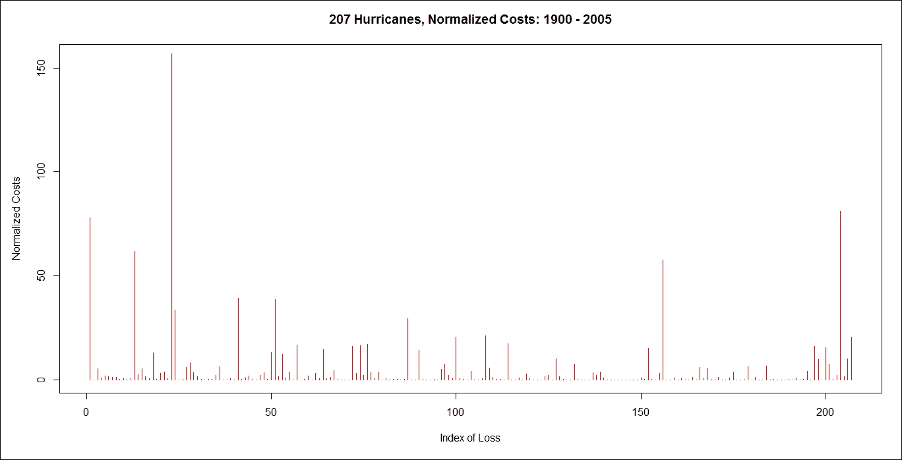

提取每年飓风的年份和频率:基础数据框包含前面文本中显示的详细信息。`table()`使用`base$Year`建立一个每年飓风计数的应急表。结果存储在`TestBase`数据帧中:

### 打印`TestBase`数据帧的内容:

结果如下:

```
> TestBase <- table(base$Year)

```

Printing the contents of the `TestBase` data frame:

```
> TestBase

```

The result is as follows:

从`TestBase`数据帧中提取年份:`names()`函数提取每年的名称。`as.numeric()`将每个提取的年份名称转换成数值。结果存储在年数据框中:


打印`years`数据框的内容:

结果如下:

```
> years <- as.numeric(names(TestBase))

```

Printing the contents of the `years` data frame:

```
> years

```

The result is as follows:

从`TestBase`数据框中提取每年飓风计数的频率:`names()`提取每年飓风计数的频率。`as.numeric()`将每个提取的飓风次数转换成一个数值。结果存储在频率数据帧中:


打印`frequency`数据框的内容:

结果如下:

```
> frequency <- as.numeric(TestBase)

```

Printing the contents of the `frequency` data frame:

```
> frequency

```

The result is as follows:

从`TestBase`数据框中提取没有飓风发生的每年的飓风计数频率；结果存储在`years0frequency`数据框中；


打印`years0frequency`数据框的内容:

结果如下:

```
> years0frequency <- (1900:2005)[which(!(1900:2005)%in%years)]

```

Printing the contents of the `years0frequency` data frame:

```
> years0frequency

```

The result is as follows:

提取每年所有飓风的数量。结果存储在`StormDamageData`数据帧中:


打印`StormDamageData`数据帧。`head()`函数返回`StormDamageData`数据帧的第一部分。`StormDamageData`数据帧作为输入参数传递:

结果如下:

```
> StormDamageData <- data.frame(years=c(years, years0frequency), frequency=c(frequency, rep(0,length(years0frequency))))

```

绘制 1900 年到 2005 年间每年飓风的年份和频率:`plot()`是一个通用函数。years 代表图的 x 坐标，frequency 代表图的 y 坐标。`type="h"`代表直方图表示风格:

```
> head(StormDamageData) 

```

结果如下:

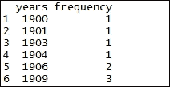

计算 1900 年至 2005 年间所有年份的飓风数量的平均值:

```
> plot(years, frequency, type="h", main = "Frequency of Hurricanes: 1900 - 2005", xlab = "Time (Years)", ylab = "Annual Frequency", col = "red")

```

结果如下:

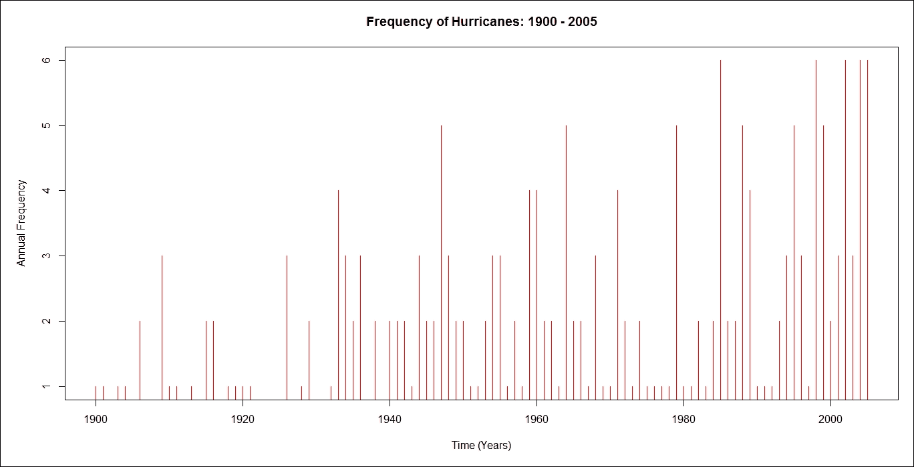

平均每年有两次飓风。

```
> mean(StormDamageData$frequency)

```

第五步——建立预测模型

让我们找出飓风发生频率可能的线性趋势。`glm()`函数用于拟合广义线性模型。`frequency~years`定义公式。`data = StormDamageData`为公式定义数据集。`family=poisson(link="identity")`函数表示泊松分布。


`lm()`功能用于拟合线性模型。`frequency~years`定义公式。`data = StormDamageData`为公式定义数据集。使用以下命令:

打印`LinearTrend`的细节:

### 结果如下:

Let's find out the possible linear trend in the hurricane occurrence frequency. The `glm()` function is used to fit generalized linear models. `frequency~years` defines the formula. `data = StormDamageData` defines the dataset for the formula. The `family=poisson(link="identity")` function signifies the Poisson distribution.

The `lm()` function is used to fit linear models. `frequency~years` defines the formula. `data = StormDamageData` defines the dataset for the formula. Use the following commands:

```
> LinearTrend <- glm(frequency~years, data = StormDamageData, family=poisson(link="identity"), start=lm(frequency~years, data = StormDamageData)$coefficients)

```

找出飓风发生频率的可能指数趋势:

```
> LinearTrend

```

`glm()`函数用于拟合广义线性模型。`frequency~years`定义了公式。`data = StormDamageData`为公式定义数据集。`family=poisson(link="identity")`函数表示泊松分布。我们通过使用以下命令来实现这一点:

打印`ExpTrend`的详细信息:


结果如下:

Finding out the possible exponential trend in the hurricane occurrence frequency:

The `glm()` function is used to fit generalized linear models. `frequency~years` defines the formula. `data = StormDamageData` defines the dataset for the formula. The `family=poisson(link="identity")` function signifies the Poisson distribution. We do this by using the following command:

```
> ExpTrend <- glm(frequency~years, data=StormDamageData, family = poisson(link="log"))

```

绘制`1900`和`2005`之间每年飓风的年份和频率计数:`plot()`是一个通用功能。years 代表图的 x 坐标，frequency 代表图的 y 坐标。`type="h"`代表直方图的表现风格。`ylim=c(0,6)`功能将 *y* 轴表示的上限设定为下限`0`和上限`6`:

```
> ExpTrend

```

结果如下:

基于指数趋势预测 2014 年的趋势:`predict()`函数用于基于线性模型对象预测值。`ExpTrend`表示从`lm`继承的类的对象。`newdata = data.frame(years=1890:2030)`函数代表在其中寻找预测变量的数据框:


印刷`cpred1`的详细资料:

结果如下:

```
> plot(years, frequency, type='h', ylim=c(0,6), main = "No. of Major Hurricanes Predicted for 2014", xlim=c(1900,2020))

```

The result is as follows:

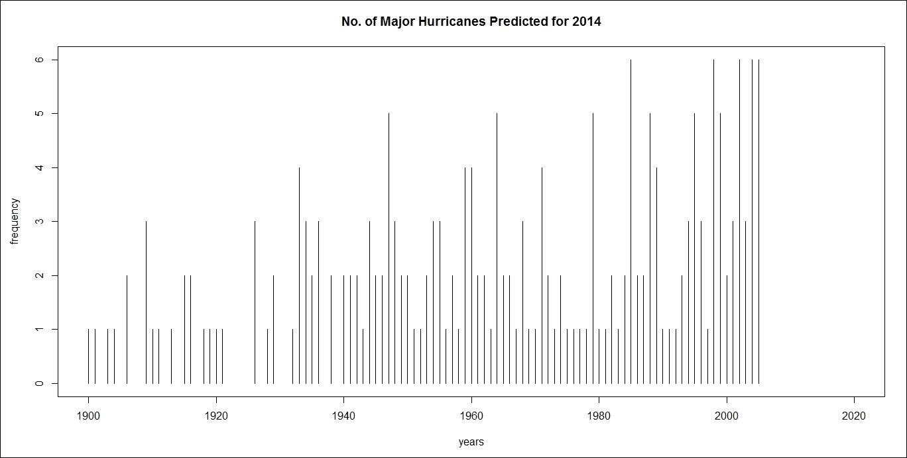

用线段连接`cpred1`的点:`lines()`是一个通用函数，它将`cpred1`数据帧的值作为 *y* 轴的坐标，并用线段连接相应的点。`1890:2030`代表 *x* 轴:

结果如下:

```
> cpred1 <- predict(ExpTrend, newdata = data.frame(years=1890:2030), type="response")

```

Printing the details of `cpred1`:

```
> cpred1

```

The result is as follows:

基于线性趋势预测 2014 年的趋势:`predict()`函数用于基于线性模型对象预测值。`LinearTrend`表示从`lm`继承的类的对象。`newdata = data.frame(years=1890:2030)`函数代表在其中寻找预测变量的数据框:

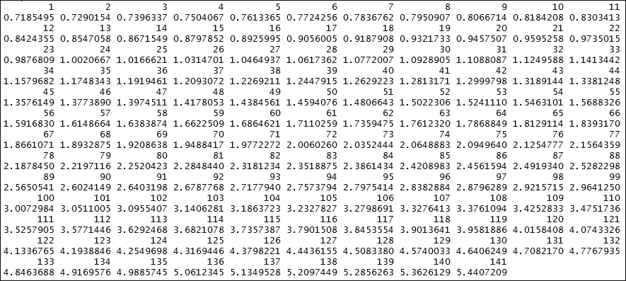

打印`cpred0`的详细信息:

结果如下:

```
> lines(1890:2030,cpred1,col="blue")

```

The result is as follows:

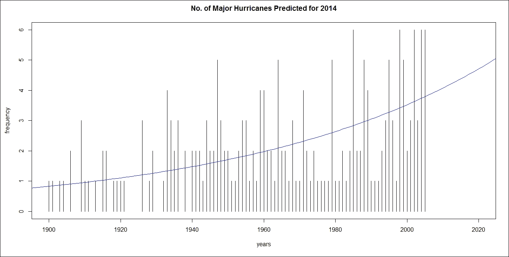

用线段连接`cpred0`的点:`lines()`是一个通用函数，它将`cpred0`数据框的值作为 *y-* 轴的坐标，并用线段连接相应的点。`1890:2030`代表 *x* 轴:

结果如下:

```
> cpred0 <- predict(LinearTrend, newdata=data.frame(years=1890:2030), type="response")

```

Printing the details of `cpred0`:

```
> cpred0

```

The result is as follows:

绘制平均值:`abline()`作为一个函数，使用`StormDamageData$frequency`即`1.95283`的平均值绘制直线。`h = mean(StormDamageData$frequency)`是水平线的 *y* 值；

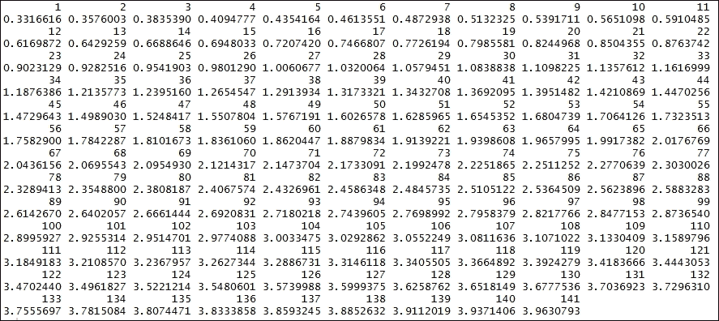

结果如下:

Joining the points of `cpred0` with line segments: `lines()` is a generic function which takes the value of the `cpred0` data frame as coordinates of the *y-*axis and joins the corresponding points with line segments. `1890:2030` represents the *x*-axis:

```
> lines(1890:2030, cpred0, col="red"))

```

The result is as follows:

将数据帧值合并为`StormDamageData$frequency`、`cpred0`和`cpred1`的平均值:

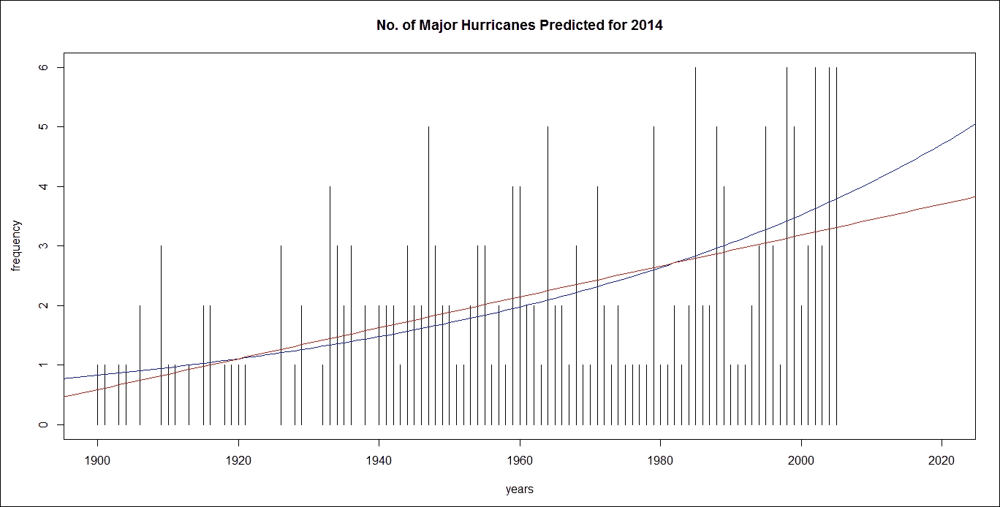

打印预测的详细信息:

结果如下:

```
> abline(h = mean(StormDamageData$frequency), col="black")

```

The result is as follows:

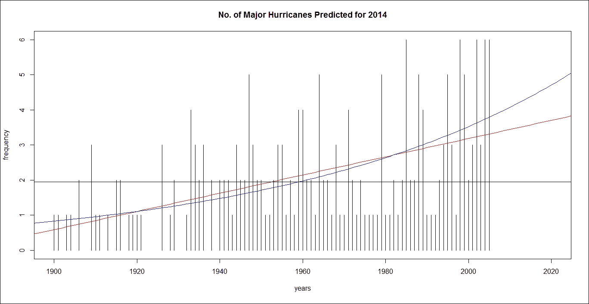

在图表上标出 2014 年的预测点:

结果如下:

```
> predictions <- cbind(constant = mean(StormDamageData$frequency), linear = cpred0[126], exponential=cpred1[126])

```

Printing the details of the predictions:

```
> predictions

```

The result is as follows:

重要的是要观察到，通过改变预测模型，保费将会发生变化。对于平面预测，不到两个(主要)飓风，但对于指数趋势，有四个以上(主要)飓风。


第六步-计算再保险合同的纯保费

现在，我们找到了一个合适的模型来计算再保险条约的保费，具有可扣除额和有限的覆盖范围。使用希尔的尾部指数估计器估计尾部指数，如下所示。`hill()`是估计重尾数据指数尾部的函数，`base$Normalized.PL05`:

```
> points(rep((1890:2030)[126],3), predictions, col=c("black","red","blue"), pch=19)

```

结果如下:

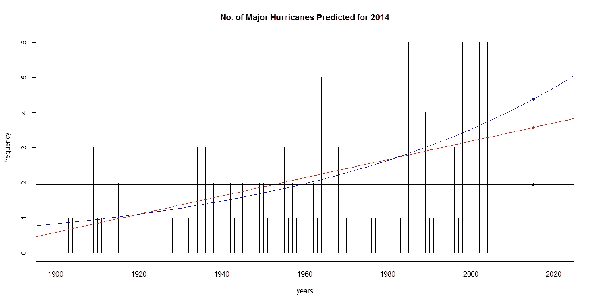

上图显示大飓风的损失是重尾的。

### 为帕累托模型设置 5 亿以上的损失阈值，如下所示:

我们用下面的命令返回一个类的对象，`gpd`，表示广义帕累托模型的拟合度超过了一个阈值(0.5)。数据集由`base$Normalized.PL05/1e9/20`表示:

```
> hill(base$Normalized.PL05)

```

结果如下:

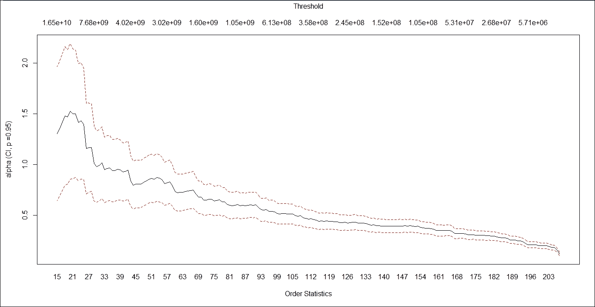

计算阈值 0.5 以上的`base$Normalized.CL05/1e9/20`数据帧的平均值:

结果如下:

```
> threshold <- .5

```

We return an object of the class, `gpd`, representing the fit of a generalized Pareto model to excesses over a threshold (0.5) with the following command. The dataset is represented by `base$Normalized.PL05/1e9/20`:

```
 > gpd.PL <- gpd(base$Normalized.PL05/1e9/20, threshold)$par.ests

```

The result is as follows:

假设损失超过 5 亿，我们现在可以计算再保险合同的预期价值:


Calculating the mean of the `base$Normalized.CL05/1e9/20` data frame above the threshold value of 0.5:

```
> mean(base$Normalized.CL05/1e9/20> .5)

```

如下所示查找预测数据框的平均值:

结果如下:


Given that the loss exceeds 500 million, we can now compute the expected value of the reinsurance contract:

计算阈值 0.5 以上的`base$Normalized.PL05/1e9/20`数据帧的平均值:


结果如下:

```
 > ExpectedValue <- function(yinf,ysup,xi,beta){
 + as.numeric(integrate(function(x) (x-yinf) * dgpd(x,xi,mu=threshold,beta),
 + lower=yinf,upper=ysup)$value +
 + (1-pgpd(ysup,xi,mu=threshold,beta))*(ysup-yinf))
 + }

```

Find the mean value of the predictions data frame as follows:

```
> predictions[1]

```

The result is as follows:

这表明每一次飓风都有 12.5%的几率给保险公司造成超过 5 亿的损失。


计算再保险合同的预期价值:

结果如下:

```
> mean(base$Normalized.PL05/1e9/20>.5)

```

The result is as follows:


这表明再保险公司的预期偿付额约为 33098.65 万英镑。

计算再保险合同的保险费:

结果如下:

```
> ExpectedValue(2,6,gpd.PL[1],gpd.PL[2])*1e3

```

The result is as follows:


This indicates that the expected repayment by the reinsurance company is about 330.9865 million.

Calculating the premium of the reinsurance contract:

```
> predictions[1] * mean(base$Normalized.PL05/1e9/20> .5) * ExpectedValue(2, 6, gpd.PL[1], gpd.PL[2]) * 1e3

```

The result is as follows:

