# 第二章。机器学习和大规模数据集

近年来，随着大数据的出现，我们已经看到数据处理方式发生了巨大变化。机器学习领域已经看到了包括扩展策略以处理新时代数据需求的需求。这实际上意味着一些传统的机器学习实施将不会全部与现在的大数据环境相关。随着存储和处理大规模数据的需要以及数据格式的复杂性，基础设施和调优要求现在成为了挑战。

随着硬件架构的发展，分布式架构的廉价硬件的可访问性，以及简化并行处理选项的新编程范式(现在可以应用于许多学习算法)，我们看到对扩大机器学习系统的兴趣日益增加。

本章将深入介绍下面列出的主题:

*   大数据介绍和大规模机器学习的典型挑战
*   纵向扩展和横向扩展机器学习背后的动机，以及对大型数据集的并行和分布式处理的概述
*   概述并行算法设计、大 O 符号和实现并行的任务分解技术
*   云框架的出现提供了云集群、分布式数据存储、容错和高可用性，以及对计算资源的有效利用
*   实现大规模机器学习的框架和平台选项(并行处理框架如 **中的 MapReduce 大规模并行处理** ( **MPP** )、MRI、平台如 GPU、FPGA、多核)

# 大数据和大规模机器学习的背景

在我之前的 Packt 一书中，名为*Greenplum for Big Data Analytics*入门，我已经介绍了大数据的一些核心方面。在本节中，我们将快速回顾大数据的一些核心方面及其在机器学习领域的影响:

*   大规模的定义是 TB、Pb、EB 或更高的规模。这通常是传统数据库引擎无法处理的卷。下面的图表列出了代表数据量的数量级:

    | 

    字节倍数

     |
    | --- |
    | **SI 十进制前缀** | **二进制用法** |
    | **名称** | 103 | 210 |
    | 兆字节(MB) | 106 | 220 |
    |  | 1015 | 250 |
    | EB | 1018 | 260 |

*   在这种情况下提到的数据格式是不同的；它们被生成和消费，并且不需要被结构化(例如，DBMS 和关系数据存储)。现在，有了新的数据来源；这些数据可以由社交网站、设备等生成。这可以是本质上异构的流数据(例如，视频、电子邮件、推文等)。同样，目前没有一个传统的数据集市/数据存储和数据挖掘应用支持这些格式。
*   此外，所有大规模处理总是成批发生，但我们现在看到了支持*实时*处理能力的需求。新的**λ架构** ( **LA** ) 解决了支持批处理和实时数据摄取和处理的需求。
*   总体而言，响应时间窗口正在缩短，这增加了挑战。

让我们回顾一下大数据的四个关键特征。所有这些都需要特殊的工具、框架、基础设施和能力:

*   更高的容量(达到 Pb 级)
*   对数据可用性/可访问性的需求(更实时)
*   多样化的数据格式
*   未标记数据的增加，因而产生了**噪声**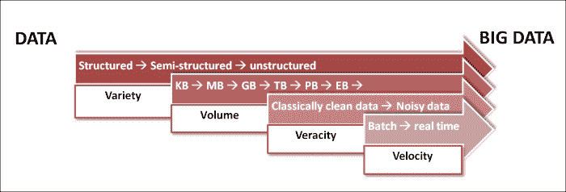

## 功能与结构——方法不匹配

即使在五年前，我们也无法想象关系数据库或像对象数据库这样的非关系数据库将仅仅成为一种数据库技术，而不是数据库技术本身。互联网规模的数据处理改变了我们处理数据的方式。

新一代架构，如脸书、维基百科、Salesforce 等，建立在与当前数据管理技术发展的成熟理论基础完全不同的原则和范例之上。

### 信息商品化

从商业角度来看，苹果应用商店、SaaS、无处不在的计算、移动性、基于云的多租户架构释放了信息交付商品化的能力。这种模式几乎改变了所有的架构决策——因为我们现在需要考虑哪些“信息单元”可以作为服务提供和计费，而不是考虑解决方案的**总拥有成本** ( **TCO** ) 。

### 关系数据库管理系统的理论局限性

正如有影响力的数据库理论家 Michael Stonebreaker 最近所写的，互联网规模架构的核心是一个新的数据处理和管理的理论模型。数据库管理的理论已经有三十多年的历史了，它们是为大型机类型的计算环境和不可靠的电子组件设计的。从那以后，系统和应用的性质和功能发生了巨大的变化。随着可靠性成为底层环境的质量属性，系统由并行处理核心组成，数据创建和使用的性质发生了巨大的变化。为了将这些新环境的解决方案概念化，我们需要从计算的角度而不仅仅是从工程的角度来设计解决方案架构。

推动当今数据革命的六大力量是:

*   大规模并行处理
*   商品化的信息传递
*   无处不在的计算和移动设备
*   非 RDBMS 和语义数据库
*   社区计算
*   云计算

**Hadoop** 和 **MapReduce** 释放了海量数据的大规模并行处理，将复杂的计算算法制作在一个编程平台上。这永远改变了分析和商业智能。类似地，web 服务和 API 驱动的体系结构已经使得信息交付大规模商品化。

如今，可以构建非常大的系统，每个子系统或组件本身都是一个完整的平台，由不同的实体托管和管理。

Dijkstra 曾经说过一句很有见地的话:

> *“计算机科学与计算机的关系，正如天文学与望远镜的关系一样”*

他今天也许会是一个快乐的人，因为计算机已经把自己从个人电脑(也称为工作站和服务器)的魔爪中解放出来。我们今天的大部分信息消费来自我们很少称之为计算机的设备。移动设备、可穿戴设备和无处不在的信息正在改变数据的创建、组装、消费和分析方式。

随着传统数据库局限性的暴露，近年来出现了许多特殊用途的数据库——内存数据库、柱形图数据库、graph-DB 数据库和语义存储现在都可以在市场上买到。

前面提到的创新彻底改变了传统的数据架构。尤其是语义计算，本体驱动的信息建模已经使数据设计变得不可思议。从哲学上讲，数据架构正在经历一个事实基础。在传统的数据模型中，我们首先设计“数据模型”——对世界及其未来的固定的、设计时的理解。数据模型将数据的含义永远固定在一个固定的结构中。表只不过是一个类别，一组东西。因此，数据必须意味着我们是否理解它所属的集合/类别。例如，如果我们将一个汽车加工系统设计成一些类别，如四轮车、两轮车、商用车等等，那么这种划分本身就有相关的含义嵌入其中。存储在这些类别中的每一个中的数据并不揭示嵌入在类别设计方式中的设计目的。例如，另一个系统可能会查看汽车的传动系统——电力、石油动力、核能等等。

这种分类本身以某种方式揭示了系统的目的，这是不可能获得任何单个记录的属性的。语义和元数据驱动的架构可以颠覆这样的数据模型。在元数据模型中，首先存在的是对象。

在基于 RDBMS 的存储系统中如何存储和管理数据的一些核心特征如下:

*   数据存储在通常以行和列为特征的表中
*   使用数据属性之间的关系来链接表
*   它以高效和灵活著称
*   这支持减少数据重复的标准化技术

另一方面:

*   元数据驱动/ NoSQL /语义数据架构摆脱了束缚数据使用目的的关系
*   焦点更多地放在适应业务需求的不断变化上，从而使正在构建的软件系统的变化最小
*   在元数据驱动/NoSQL/语义数据架构中，用分布式存储技术支持大数据集，降低存储成本是非常重要的

### 纵向扩展与横向扩展存储

随着大数据的出现，现在需要扩展数据存储设备，以便能够存储 Pb 级的数据。有两种扩展存储设备的方法:

*   纵向扩展(纵向可扩展性)
*   横向扩展(水平可伸缩性)

**纵向扩展**或垂直可伸缩性是指向现有系统添加更多资源，从而提高存储更多数据的能力。在这里，资源可以指 RAM、计算能力、硬盘驱动器等等。

**向外扩展**或水平可伸缩性是指向系统添加新组件。这需要存储和分发数据，而且有些任务可以并行化。这通常会增加系统的复杂性，并且大多数时候需要重新设计系统。

所有大数据技术都支持基础架构的横向扩展。

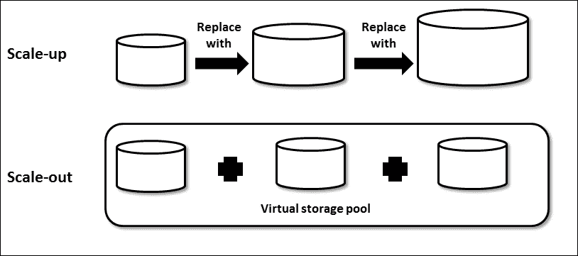

| 

纵向扩展(纵向可扩展性)

 | 

向外扩展(水平可扩展性)

 |
| --- | --- |
| 低容量和高容量服务器 | 更多和中等或低容量服务器 |
| 可能存在一个阈值，超过该阈值，基础架构将停止纵向扩展 | 没有限制，基础架构可以根据需要进行扩展，而不会对设计产生任何影响 |
| 可以容纳更大的虚拟机 | 使用较低的虚拟机运行，可能会受到主机故障的影响 |
| 共享一切数据架构 | 无共享数据架构 |
| 更高的总拥有成本 | 相对较低且可变的成本 |
| 下层网络设备 | 需要相对较多的设备(路由器、交换机等) |

### 分布式和并行计算策略

尽管分布式和并行处理已经存在好几年了，但是随着经济高效的解决方案所需的可用性优先级的出现，这些策略已经成为机器学习任务的关键。

下图描述了 Flynn 对计算的分类。分类是基于数据流的数量与指令流的数量来完成的。

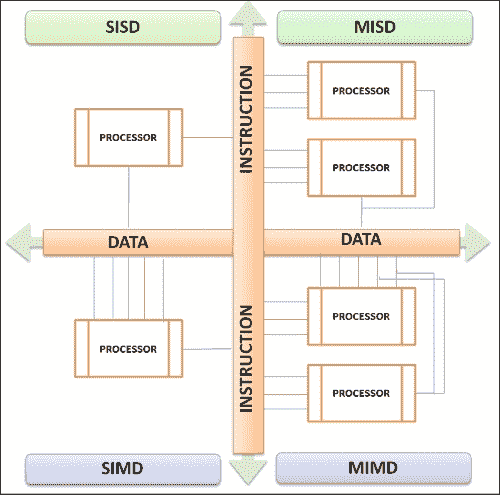

*   **单指令单数据** ( **SISD** ):这是单处理器的情况，在数据或指令上没有并行性。单个指令以顺序方式对单个数据执行，例如单处理器。
*   **多指令单数据** ( **MISD** ):这里，多条指令对单个数据流进行操作；容错就是一个典型的例子。
*   **单指令多数据** ( **SIMD** ):这是一个自然并行的例子；单个指令触发对多个数据流的操作。
*   **多指令多数据** ( **MIMD** ):这个是多个独立指令对多个独立数据流进行操作的情况。由于数据流是多种多样的，所以内存既可以共享也可以分布。这里可以对分布式处理进行分类。上图描述了“分布式”环境中的 MIMD 和变体。

下图解释了并行处理器架构和分类:

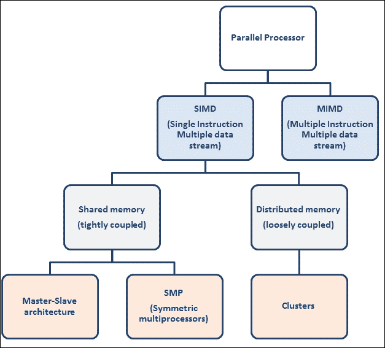

并行/分布式处理系统的关键需求之一是高可用性和容错性。有几种编程范例可以实现并行性。下面的列表详细列出了一些重要的问题:

*   **工长/工人模型**:工长模型是工作进行的驱动力，然后传播给工人。Pivotal Greenplum Database 和 HD (Pivotal 的 Hadoop 发行版)模块实现了这种模式。
*   **生产者/消费者模型**:这里没有触发工作的所有者。生产者生成工作项，消费者异步订阅和执行。基于**企业服务总线** ( **ESB** ) 的数据集成系统实现了这种模式。

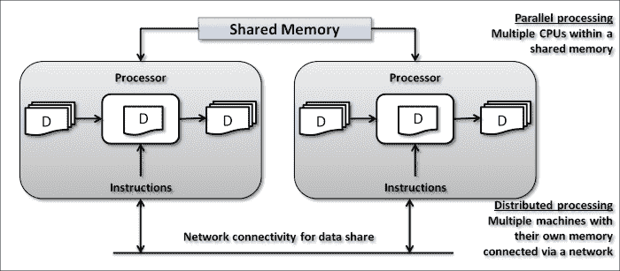

理论上，有两种类型的并行化；一个是数据并行化，另一个是执行或任务并行化:

*   **数据并行化**:它处理并行运行多个输入的相同计算。在机器学习领域，这是一种我们考虑在不同的数据样本上运行相同算法的情况，而不是真正担心数据样本是如何分布的。
*   **执行或任务并行化**:与数据并行化不同，它是将功能分成多个部分，并以并行方式运行。这些工作可以在同一个数据集上进行，但这仅适用于可并行化且子任务之间没有依赖关系的任务。

任务并行化可以是细粒度的，也可以是粗粒度的。

有许多分布式平台选项可以提高机器学习算法的效率和规模，并可以处理大型数据集。一些选项包括:

*   **现场可编程门阵列**(**FPGA**)
*   **图形处理单元**(**GPU**)
*   **高性能计算** ( **HPC** )
*   多核和多处理器并行系统
*   虚拟大规模集群的云基础架构

除了可用的多平台选项，还有其他高度采用的框架，它们具有用于构建机器学习算法的现成 API。这个框架的选择尤其取决于硬件的选择。

重要的是，我们选择一个可以最大限度地利用现有架构的选项，并适合学习算法和数据结构的选择。

## 机器学习:可扩展性和性能

机器学习算法有两种重要的扩展方式:

*   抽样
*   并行处理的分布式系统

可以将给定的学习算法作为独立的工作块同时执行，并合并结果。这听起来像是一种相当简单的并行化方法，能够在更大的数据集上扩展和执行。这是基于一个假设，即数据集是离散的，这些分布式数据集之间没有任何依赖关系。

由于数据源的激增，我们现在可以访问已经分布的大型数据集，这带来了对以分布式模式运行学习算法的能力的需求。

对于机器学习的分布式和并行框架，现在有多种选择。让我们看看这些平台之间的一些关键区别因素:

*   并行化的粒度是一个关键方面。它指的是对细粒度和粗粒度并行化的支持。较低的粒度定义细粒度的任务并行化，而较高的粒度定义粗粒度的任务并行化。
*   支持算法自定义的程度。
*   支持混合多种编程范例。
*   数据集易于横向扩展。
*   支持批处理和实时处理的程度。

给定一个问题环境，平台和编程框架的选择应该由前面的标准来指导。

以下是衡量并行算法计算性能的一些关键指标:

*   **性能**是顺序算法与并行过程的求解时间之比
*   **效率**或**吞吐量**衡量多个处理器的性能比率
*   **可扩展性**是随着处理器数量的增加，效率提高的百分比

下一节涵盖了机器学习问题的一些关键特征，这些特征推动了机器学习算法的扩展。

### 数据点或实例过多

我们现在看到，在大多数机器学习问题中,有丰富的数据集，在许多情况下，所有这些数据点都与模型建立和提炼相关。这些数据点可能会发展到兆兆字节的规模。

这就需要支持分布式存储和带宽来处理集群中的这些数据点。这里使用了能够运行并行编程语言范例(如 MapReduce 和 LINQ)的高容量存储系统。

### 属性或功能过多

形成建筑模型的输入的数据集可能带有太多的特征、属性或维度。在这种情况下，机器学习算法将从属或更相关的属性分组，并在迭代中运行算法。这种类型的数据集可以在文本挖掘和自然语言处理的情况下看到，其中特征的数量可以达到数百万的倍数。在这种情况下，通过消除不相关的特性，跨特性并行化计算可以让我们有效地解决问题。随机森林和决策树就是一些例子。此外，一些具体的特征选择技术，如正则化方法，将涵盖在未来的章节。

### 缩短响应时间窗口–需要实时响应

有些机器学习需求，比如语音识别，需要系统的实时响应。在这些应用中，机器学习实现的响应时间至关重要，否则响应本身将变得无关紧要。并行化可以带来这种效率。

模型的延迟和性能是比吞吐量更重要的问题。在许多用例中，推理中的延迟会使模型本身无效，因为响应变得过时了。

对于这类问题，GPU 或 FPGAs 等高度并行的硬件架构将非常有效。

### 高度复杂的算法

在这种情况下，选择的算法本身是复杂的，例如，计算密集型函数或任何非线性模型。让我们举一个文本或图像内容的例子；它本质上是非线性的。使用分布式计算可以轻松解决这种复杂性。

我们有许多方法可以解决这些问题，其中一种方法是优先考虑功能，并仍然以更高的精度为目标。然而，这将删除学习中的自动化部分。在运行算法之前，总是需要一个步骤来设计特征。

数据越复杂，计算就越复杂。除非平台得到扩展，否则没有办法让学习过程运行得更快。

多核和 GPU 系统适合这种需求。他们把两者都带来了；存储规模和计算效率。

### 前馈，迭代预测循环

在机器学习领域有一些独特的使用案例，它们不会停留在算法的一个执行级别。该算法迭代地和顺序地运行，其中来自一次迭代的输出馈入另一次迭代。这对模型的结果至关重要。还可能需要在顺序运行的所有迭代中合并推理。这可能会使模型执行过程变得非常复杂。我们可以将推理过程作为一次性过程来处理，这将带来计算成本，或者可以存在各个任务的并行化阶段。

一些现实世界的例子是:

*   语音识别
*   机器翻译

## 型号选择流程

在某些情况下，我们将需要在相同的训练和测试集上运行多个模型的参数，这些模型具有不同的特征优先级，并比较准确性，以便为给定的问题域选择合适的模型。这些试验可以并行运行，因为这些模型之间没有任何依赖关系。当我们不得不调整学习算法的参数并评估多个执行以从学习中进行推断时，复杂性增加了。

执行之间没有依赖关系的事实使其高度并行化，并且不需要相互通信。这个用例的一个例子是统计显著性测试。对于这些任务，并行平台的有用性是显而易见的，因为它们可以很容易地同时执行，而不需要并行化实际的学习和推理算法。

## 大规模机器学习的潜在问题

现在让我们看看在大规模机器学习实现中遇到的一些潜在的问题:

*   **并行执行**:管理并行执行的准确性需要特别小心和不同的设计范例。
*   **负载平衡**和**管理偏斜**:随着数据和执行现在分布并并行运行，管理数据和计算偏斜非常必要。没有单个节点需要相对更多的数据存储或计算。
*   **监控**:对于各种硬件，需要放置有效的监控和自动恢复系统。
*   **容错**:一个万无一失的故障转移和恢复系统是必须的。
*   **自动缩放**:缩小和放大过程是自动的。
*   **作业调度** : *批量*作业将需要调度。
*   **工作流管理**:编排和编排流程，用于协调和监控集群节点之间的工作执行。


# 算法和并发

现在让我们看看算法的一些基础知识一般来说，时间复杂度；和数量级测量，在我们开始讨论在执行算法中构建并发性之前，先探索并行化算法的方法。

一个算法可以被定义为一系列的步骤，这些步骤从一个输入产生一个期望的输出。它们是不可知的技术表示；让我们看一个排序算法的例子:

```
Input: A sequence of *n* number—*a1, a2, …,an*
Output: A permutation (reordering)—*a1', a2', …,an'* such that *a1'<=a2'<=… <=an'*

```

以下算法是插入排序算法:

```
INSERTION-SORT(A)
1\. for j = 2 to length[A]
2\. dokey<-A[j]
3\. //insert A[j] to sorted sequence A[1..j-1]
4\. i<-j-1
5\. while i>0 and A[i]>key
6\. do A[i+1] <- A[i] //move A[i] one position right
7\. i<-i-1
8\. A[i+1]<-key
```

为了度量算法的时间和空间复杂度，其中一个要素是输入大小。时间复杂度是算法对于定义的需求有多“足够快”的度量；更重要的是，当数据量增加时，算法将如何反应。

频率计数是算法的关键度量之一。这是对算法的每个指令将运行多少次的预测。例如:

| 

指令

 | 

密码

 | 

频率计数(本币)

 |
| --- | --- | --- |
| 一 | 

```
for (int i=0; i< n ; i++)
```

 | n+1 |
| 2 | 

```
count << i
```

 | 普通 |
| 3 | 

```
p = p + 1
```

 | 普通 |
| 四 |   | 3n +1 |

FC 衡量标准相对来说是没有意义的，除非它考虑到相对性能与体积的关系。还有另一个称为“数量级”的衡量标准，它是对性能与数据量的估计。 *Big-O* 是衡量算法性能下降速率的指标，它是算法需要处理的数据量的函数。

例如， *O(n)* 代表线性性能退化， *O(n2)* 代表二次性能退化。

## 开发并发算法

开发并行算法的第一步是将问题分解成可以并发执行的任务。一个给定的问题可以用许多不同的方式分解成任务。任务可能大小相同或不同:

任务依赖图(Task dependency graph)是一个有向图，其节点对应于任务，其边表示一个任务的结果需要用于处理下一个任务。

示例:这是数据库查询处理。

考虑以下查询的执行:

```
MODEL = ``CIVIC'' AND YEAR = 2001 AND (COLOR = ``GREEN'' OR COLOR = ``WHITE)
```

在以下数据库中:

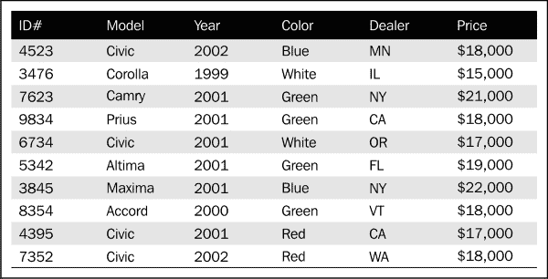

可以有细粒度和粗粒度的任务分解。随着分解变得越来越精细，并发的程度也越来越高。

有许多分解技术，没有单一的最佳方法。以下是一些技巧:

*   递归分解
*   数据分解
*   探索性分解
*   投机分解

分解产生几个任务，这些任务的一些特征严重影响并行算法的性能。这些特性包括任务交互(任务间通信)、每个任务处理的数据大小以及任务大小。在设计并行执行算法时，需要记住一些重要的方面，包括以最小的交互和处理粒度折衷的方式解耦任务。


# 扩展机器学习的技术和实施方案

在本节中，我们将探索机器学习实现可以采用的一些并行编程技术和分布式平台选项。下一章将介绍 Hadoop 平台，我们将从[第 3 章](ch03.html "Chapter 3. An Introduction to Hadoop's Architecture and Ecosystem")、*Hadoop 架构和生态系统介绍*开始研究一些实际例子，并提供一些真实的例子。

## MapReduce 编程范例

MapReduce 是一个并行编程范例，它抽象了分布式计算环境中的并行计算和数据复杂性。它的工作原理是将计算函数用于数据，而不是将数据用于计算函数。

MapReduce 不仅仅是一个编程框架，它提供了许多开发人员无需担心构建的内置函数，并且可以减轻许多实现复杂性，如数据分区、调度、管理异常和系统间通信。

下图描述了 MapReduce 函数的典型组成:

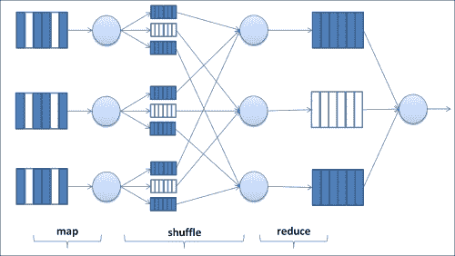

MapReduce 最初由 Google 设计并采用，作为一种编程模型，用于在分布式存储上并行处理集群上的大型数据集。

MapReduce 范式现在已经成为一种行业标准，许多平台都是基于这种范式内部构建的，并支持 MapReduce 实现。例如，Hadoop 是一种开源实现，可以在内部运行，也可以在云计算服务上运行，如使用 elastic MapReduce 的 **Amazon EC2** 。

其核心是能够跨集群中的节点并行运行的`Map()`和`Reduce()`函数。`Map()`函数处理分布式数据并并行运行所需的功能，`Reduce()`函数运行数据的汇总操作。

## 具有消息传递接口(MPI)的高性能计算(HPC)

MPI 旨在提供对高级并行硬件的访问，并旨在与异构网络和集群一起工作。这是一个令人印象深刻的规范，并提供了一种实现并行程序的可移植方法。

消息传递是发送方和接收方之间的数据传输和同步过程。下图演示了发送方和接收方之间的消息传递:


可以对这些过程进行分组；发送方和接收方之间的消息共享需要发生在相同的上下文中。因此，传播者是一个群体和环境的结合。消息中的数据以三元组的形式发送或接收。

MPI 可用于实现可移植性，并可通过并行处理提高性能。它可以支持独特的数据结构，并且可以构建库以供重用。MPI 不支持自由容错。

## 语言集成查询(LINQ)框架

LINQ 框架是一个用于大规模数据和并行计算的通用系统。类似于 MapReduce 范式，它提供了基础实现的高级抽象，并帮助开发人员降低并行和分布式执行的开发复杂性。

随着机器学习功能从一般的数据处理转向对不同数据类型的操作，包括文档、图像和图表，对通用实现范例的需求正在增加。该框架适用于。仅限网络语言。

## 使用 LINQ 操作数据集

LINQ附带了一组函数，这些函数对。NET 对象。这些集合被包含了。NET 数据类型。

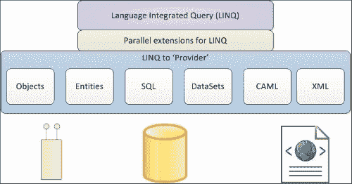

## 图形处理单元(GPU)

GPU 是电子电路，旨在处理内存需求，并在帧缓冲区中快速创建图像以进行可视化显示。

GPU 一直支持不断增长的计算能力。它们最初是为了处理图像处理和渲染，但高级 GPU 现在被定位为独立的通用计算平台。

虽然 CPU 被设计为在异构工作负载上表现良好，但 GPU 是为确保大规模数据集的可用性并以并行方式运行的任务而构建的。

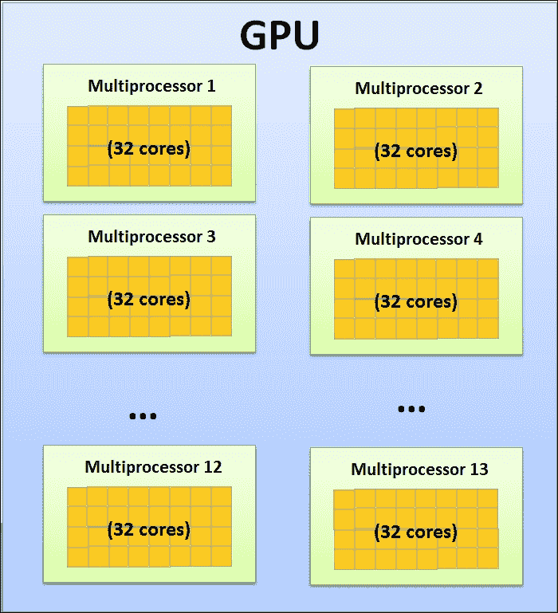

GPU 主要用于深度学习和训练神经网络，这些网络可能需要更大的训练数据集、更低的计算能力和存储空间优化。它们被用于解决云中的分类和预测问题。大多数社交媒体公司都是 GPU 的早期采用者。

### 注意

借助 GPU，可以更快地转录预先录制的语音或多媒体内容。与 CPU 实施相比，我们能够将识别速度提高 33 倍。

## 现场可编程门阵列(FPGA)

FPGAs 正在 HPC 的许多领域出现。FPGAs 可用于大规模并行处理的环境中。在本部分，我们将了解 FPGA 的一些架构和实施方面。

众所周知，FPGAs 提供高性能。它们支持不同的并行计算应用。它们有一个片内存储器，便于对处理器进行存储器访问。最重要的是，存储器耦合到算法逻辑，这意味着我们将不需要任何额外的高速存储器。

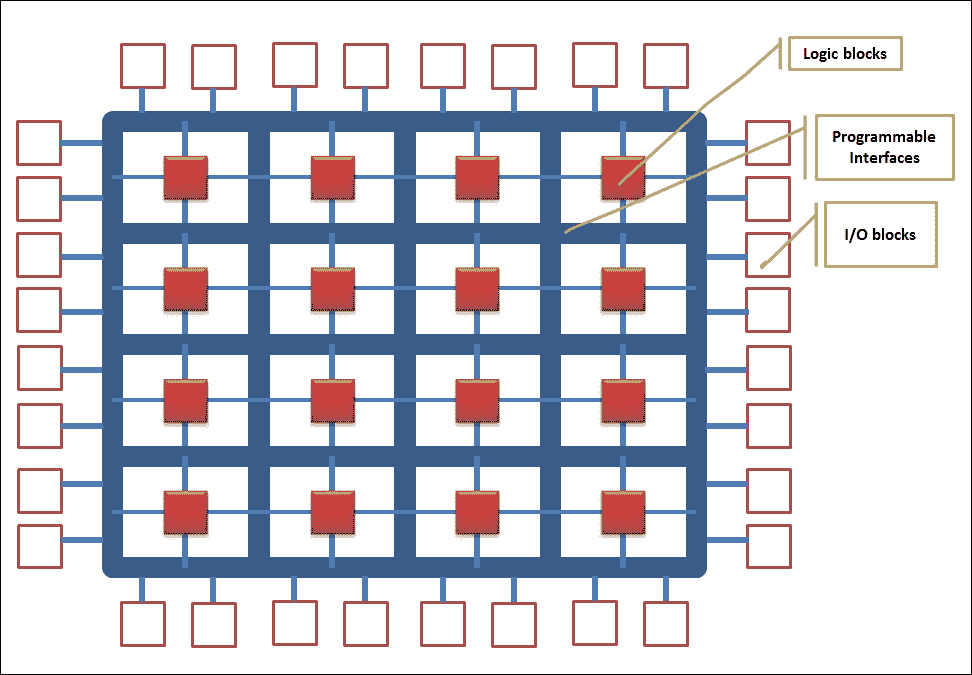

FPGA 包含大量的 **可配置逻辑块**(**CLB**)；这些 clb 中的每一个都使用可编程的接口连接，在它们之间传递信号。I/O 模块是 clb 与外界的连接点。

FPGAs 提供了多种范例，有助于加速硬件和软件设计中的计算。FPGAs 具有成本效益，并且硬件资源得到了最佳利用。IBM Netezza 利用 FPGA 架构。

## 多核或多处理器系统

多处理器系统通常有多个 CPU，不一定在同一个芯片上。新时代的多处理器在同一个物理板上，通过高速连接接口进行通信。

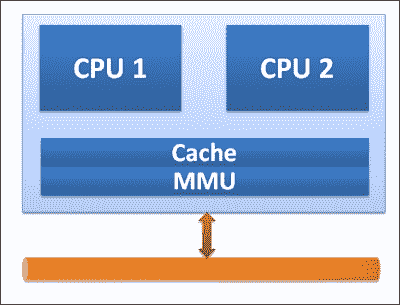

多核处理器代表一个处理器家族，可能在一个芯片上包含许多CPU(例如两个、四个和八个)。在多核系统中，多线程实施的效率取决于代码的并行性。

除了所有硬件和基础设施的进步，我们刚刚看到，基于以最佳成本扩展机器学习过程的能力，机器学习的云框架正在获得相当大的吸引力。

随着云计算的出现，基础设施服务提供商，如 Amazon Web Services，提供了几乎无限的按需计算能力，可以根据使用情况付费。


# 总结

在这一章中，我们探讨了大型数据集的限定条件、它们的共同特征、重复问题以及数据量高速增长的原因；事实上，大数据环境。

将传统的机器学习算法应用于大型数据集的需求给机器学习实践者带来了新的挑战。传统的机器学习库不太支持处理巨大的数据集。使用现代并行计算框架(如 MapReduce)的并行化已经得到普及和采用；这导致了建立在这些框架之上的新库的诞生。

重点是适合大规模数据的方法，并具有并行实现的潜力。在过去的十年里，机器学习应用的前景发生了巨大的变化。投入更多的机器并不总是解决问题的办法。有必要重新审视传统算法和模型的执行方式，因为现在机器学习技术研究的另一个方面是可伸缩性、并行执行、负载平衡、容错和动态调度。

我们还研究了大型数据集环境中新兴的并行化和分布式架构和框架，并了解了纵向和横向扩展机器学习的需求。此外，我们还概述了机器学习的一些并行和分布式平台技术的内部，如 MapReduce、GPU、FGPA 等。

在下一章中，我们将了解 Hadoop 如何成为大规模机器学习的最佳平台。