# 十二、强化学习

我们已经在第五章、*基于决策树的学习*中深入讨论了监督和非监督学习方法，以及各种算法。在这一章中，我们将介绍一种新的学习技术，它不同于监督学习和非监督学习，称为 **强化学习** ( **RL** )。强化学习是一种特殊类型的机器学习，其中学习由来自环境的反馈驱动，并且学习技术是迭代的和自适应的。RL 被认为更接近人类的学习。RL 的主要目标是决策，其核心是 **马尔科夫决策过程** ( **MDP** )。在本章中，我们将介绍一些基本的强化学习方法，如 **时间差异** ( **TD** )、确定性等价、策略梯度、动态规划等等。下图描述了本章将涉及的不同数据架构范例:

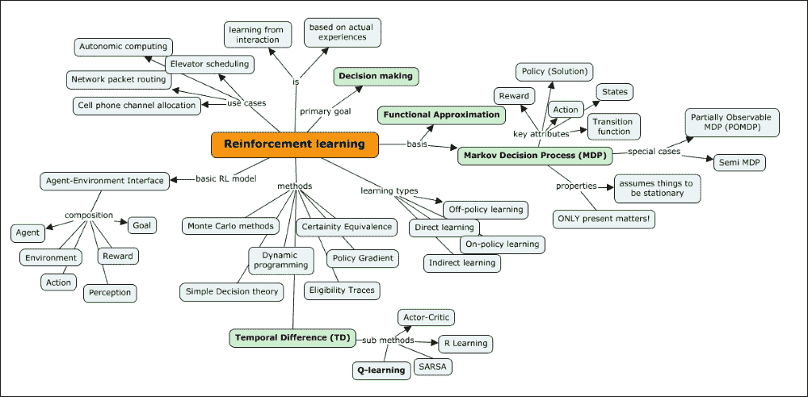

本章深入讨论了以下主题:

*   回顾监督、半监督和非监督学习，以及强化学习的背景。
*   理解 MDP 是强化学习的关键。关于这一点，本章涵盖了以下主题:

    *   【MDP】什么意思，关键属性、状态、奖励、行动和转换(折扣)
    *   MDP 的底层过程及其如何帮助决策过程
    *   政策和价值函数(也称为效用，如在一组奖励中)以及我们如何将价值分配给奖励的无限序列
    *   **贝尔曼方程**—价值迭代和政策迭代

*   关于强化学习，我们将涵盖以下内容:

    *   规划和学习在 MDP
    *   连接规划和函数逼近在 RL
    *   不同的强化学习方法和途径，如简单决策理论、 **时间差分** ( **TD** )、动态规划、策略梯度、确定性等价和合格性痕迹
    *   关键算法如 Q-learning、Sarsa 和其他
    *   强化学习应用

# 强化学习(RL)

让我们回顾一下监督、半监督和非监督学习，并设置强化学习的背景。在[第 1 章](ch01.html "Chapter 1. Introduction to Machine learning")、*机器学习简介*中，我们介绍了监督、半监督和非监督学习的基本定义。归纳学习是一个推理过程，它使用一个实验的结果来运行下一组实验，并从特定的信息中迭代地进化出一个模型。

下图描述了机器学习的各个子领域。这些子字段是机器学习算法分类的方式之一:

监督学习就是按照已知的期望进行操作，在这种情况下，需要从定义的数据中分析什么。在这种情况下，输入数据集也被称为标记为数据集的 **。归入这一类别的算法侧重于建立输入和输出属性之间的关系，并推测性地使用这种关系来为新的输入数据点生成输出。在前面的部分中，为分类问题定义的例子也是监督学习的例子。标记数据有助于建立可靠的模型，但通常昂贵且有限。下图描述了监督学习的工作流程:**

因此，这是一个函数近似值，其中给定了 *x* 、 *y* 对，我们的目标是找到将新的 *x* 映射到适当的 *y* 的函数 *f* :

*y = f(x)*

在一些学习问题中，我们头脑中没有任何具体的目标去解决；这种学习被专门称为无监督分析或学习。在这种情况下，目标是解密数据中的结构，而不是建立数据的输入和输出属性之间的映射，事实上，输出属性没有定义。由于这个原因，这些学习算法在**未标记的**数据集上操作。

因此，给定一串 *x* ，这里的目标是定义一个函数 *f* ，它可以给出一组 *x* 的简明描述。因此，这被称为聚类:

*f(x)*

半监督学习是关于使用标记和未标记的数据来学习更好的模型。对于未标记的数据，有适当的假设是很重要的，因为任何不正确的假设都会使模型无效。半监督学习的动机来自人类的学习方式。

## 强化学习的背景

强化学习是关于专注于最大化结果回报的学习。例如，在教初学走路的孩子新习惯的时候，每次他们按照指示做的时候奖励他们非常有效。事实上，他们知道什么样的行为有助于他们获得回报。这正是强化学习，也称为信用评估学习。

强化学习中最重要的事情是，模型额外负责做出决策，并为此获得定期奖励。在这种情况下，与监督学习不同，结果不是即时的，可能需要执行一系列步骤才能看到最终结果。理想情况下，该算法将生成一系列有助于实现最高回报或效用的决策。

这种学习技巧的目标是通过探索和利用数据来有效地衡量取舍。例如，当一个人必须从 A 点旅行到 B 点时，将有许多方式，包括乘飞机、水路、公路或步行，考虑这些数据来衡量这些选项中每一个的权衡是有重要价值的。另一个重要的方面是，延迟奖励意味着什么？此外，它会如何影响学习？例如，在像国际象棋这样的游戏中，奖励识别的任何延迟都可能改变或影响结果。

因此，这种表示非常类似于监督学习，不同之处在于输入不是 *x* 、 *y* 对，而是 *x* 、 *z* 对。目标是在给定 *x* 和 *z* 的情况下，找到识别一个 *y* 的函数 *f* 。在接下来的章节中，我们将探索更多关于 z 的内容。目标函数的定义公式如下:

*y = f(x)* 给定 *z* 。

强化学习的正式定义如下:

|   | *“强化学习被定义为一种通过奖励和惩罚对代理进行编程的方式，而不需要指定如何完成任务。”* |   |
|   | ——*卡尔布林，利特曼，&摩尔，96* |

因此，总的来说，RL 既不是一种神经网络，也不是神经网络的替代品，而是一种强调学习反馈的机器学习的正交方法，用于评估学习者的表现，而没有衡量表现的标准行为目标，例如，学习骑自行车。

现在让我们看看正式或基本的 RL 模型，并了解不同的元素的作用。首先，让我们了解一些基本术语。

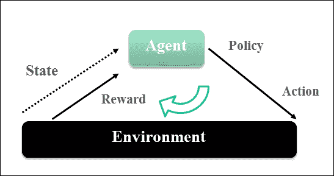

*   代理:代理 是一个既是学习者又是决策者的实体，在这种情况下通常是一个智能程序。
*   **环境**:环境是一个实体，它负责在代理执行一个动作的情况下产生一个新的情况。它对行动给予奖励或反馈。所以，简而言之，环境是除了代理之外的一切。
*   **状态**:状态是一个动作让一个实体进入的情况。
*   **动作**:动作是由代理执行的步骤，导致状态的改变。
*   **策略**:一个策略是代理在给定时间点如何行为的定义。它详细描述了状态和动作之间的映射，通常是一个简单的业务规则或功能。
*   **奖励**:奖励奖励规定了有助于达到目标的行动的短期利益。
*   **价值:**强化学习中还有一个重要的元素，那就是价值函数。回报函数是关于一个行为的短期或直接利益，而价值函数是关于长期利益。这个值是一个代理人从世界开始的时候期望得到的奖励的累积。

### 强化学习的例子

理解强化学习的最简单的方法是看看它的一些实际和真实世界的应用。在这一节中，我们将列出并理解其中的一些。

*   **棋局**:在的棋局中，一个棋手走一步棋；这一步是由对手玩家的一系列反击动作的明智选择所驱动的。玩家的下一步行动是由对手采取什么行动决定的。
*   **电梯调度**:我们举一个多楼层多电梯的大厦为例。这里的关键优化要求是选择哪个电梯应该被送到哪个楼层，并且被归类为控制问题。这里的输入是跨楼层、电梯位置和一组楼层按下的一组按钮(电梯内部和外部)。在这种情况下，回报是想乘电梯的人等待时间最少。在这里，系统再次学习如何控制电梯；通过在建筑物的模拟中学习，系统通过对过去的动作值的估计来学习控制电梯。
*   **网络数据包路由**:这是为动态变化的网络定义路由策略的案例。Q-learning 技术(本章稍后将介绍)用于识别数据包应该路由到哪个相邻节点。在这种情况下，每个节点都有一个队列，一次发送一个数据包。
*   **移动机器人行为**:一个移动机器人需要根据它过去找到充电点的速度来决定是到达充电点还是下一个垃圾点。

### 评估性反馈

将强化学习与其他学习类型区分开来的一个关键特征是，它使用信息来评估特定行动的影响，而不是盲目地指示需要采取什么行动。一方面，评估性反馈表明所采取的行动有多好，而指导性反馈表明正确的行动是什么，而不管是否采取了行动。尽管这两种机制在方式上有所不同，但在某些情况下会结合使用这些技术。在本节中，我们将探索一些评估性反馈方法，为本章的其余部分奠定基础。

#### n 臂土匪问题

这个问题的正式定义与最初的赌徒类比给出如下:

### 注

根据维基百科，n 臂强盗问题是一个问题，其中“赌徒”决定玩哪台机器、玩的顺序和玩的持续时间，然后他玩并收集机器的唯一奖励，目标是最大化整体奖励。

让我们考虑这样一种情况，在这种情况下有成千上万种行动可以采取。每一个行动都会带来回报，我们的目标是确保我们采取行动的方式能够在一段时间内获得最大的回报。特定动作的选择被称为*播放*。

一个例子解释了 n 臂土匪的类比问题是，一个医生需要从一系列治疗严重疾病的选择中进行选择，其中患者的生存成为选择行动(在这种情况下，治疗)的回报。在这个问题中，每一个行动都与所选行动的预期报酬相关联；这叫做*值*。如果我们知道每个动作的值，那么解决 n 臂强盗问题就很容易，因为我们会选择那些具有最大值的动作。唯一可能的是，我们有这些值的估计值，但不确定实际值。

现在让我们看看探索和剥削的区别。

假设我们保持对价值的估计，如果我们选择一个具有最大价值的行动(这个行动被称为贪婪行动)，这种情况被称为剥削，因为我们最好地利用手头的现有知识。此外，在所有选择非贪婪行动的情况下，这将是更多的探索，这将有助于提高非贪婪行动的估计。虽然开发有助于最大化预期回报，但从长远来看，探索有助于增加总回报。勘探的短期回报较低，而长期总回报可能会更高。对于每一个行动，可以选择探索或利用的方法，有效的方法是这两种技术之间的良好平衡。

因此，现在我们将看看一些技术来最好地估计行动的价值，并选择最适合的行动。

#### 行动价值方法

如果一个动作 *a* 的值是 *Q*(a)* ，那么 *t* ^(th) play 的评估值是*Q*[t]*(a)I*，选择该动作所给奖励的平均值，下面的等式表示这一点:

*Q*[t]*(a)=(R1+R2+…r*[ka]*/ka*，其中 *r* 为奖励， *ka* 为选择一个动作*的次数。这是评估行动价值的一种方式，但不一定是最好的方式。让我们接受这一点，现在来看看选择行动的方法。*

最简单的动作选择规则是选择具有最高估计动作值的动作或动作之一 *a* 。因此，对于给定的玩法 *t* ，选择贪婪动作 *a** 可以表示如下:

Q[t](a *)= max[a]Q[t](a)

根据定义，这种方法利用了当前的知识，很少关注行动是否是更好的选择。作为这种方法的替代方案，我们可以在大多数时候选择贪婪，偶尔选择一个独立于价值估计的动作。有了ԑ的概率，这个方法就叫做ԑ**——贪婪方法**。

#### 钢筋对比方法

我们已经在的大多数选择方法中看到，奖励最大的行动比奖励较小的行动更有可能被选中。重要的问题是如何限定奖励是大是小。我们总是需要一个参考数字来证明奖励的价值是高还是低。这个参考值叫做 **参考奖励**。首先，参考奖励可以是以前收到的奖励的平均值。使用这种思想的学习方法叫做比较强化法。这些方法比行动者-价值方法更有效，并构成了我们将在接下来的章节中讨论的行动者-批评家方法的基础。

### 强化学习问题——世界网格示例

我们将尝试使用一个著名的例子来理解强化学习问题:网格世界。这个特殊的网格世界是一个 3X4 的网格，如下面的屏幕截图所示，是世界复杂性的近似值:

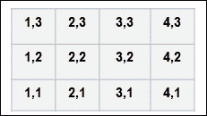

这个例子假设世界是一个游戏，你从一个叫做开始状态的状态开始(从位置 *1，1* )。让我们假设可以采取四个动作，包括向左、向右、向上和向下移动。目标是确保使用这些行动，我们朝着位置 *4，3* 所代表的目标前进。我们需要避开位置 *4，2* 中显示的红框，如下图所示。

*   **起始状态**:位置 *(1，1) - >* 世界从这里开始。
*   **成功状态**:位置 *(4，3) - >* 世界在成功状态下结束。
*   **失败状态**:位置 *(4，2) - >* 世界在失败状态下终结于此。
*   当世界末日的时候，我们需要重新开始。
*   **墙**:在 *(2，2)* 位置显示有路障或墙。该位置无法导航: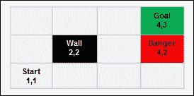
*   为了从起点*【1，1】*达到目标 *(4，3)* ，可以按以下方向进行步骤: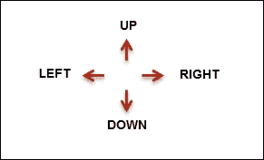
*   在方向上的每一步都将你从一个位置移动到另一个位置(这里的位置只是状态)。例如，从位置 *(1，1)* 沿*向上*方向的移动会将您带到位置 *(1，2)* 等等。
*   不可能从一个给定的位置得到所有的方向。让我们考虑下面截图中的例子。从位置 *(3，2)* 只能取*上*、*下*和*右*。*向左*移动会撞到墙壁，因此无法进行。也就是说，只有*向上*和*向下*的动作才有意义，因为*向右*会移动到导致无法达到目标的危险位置。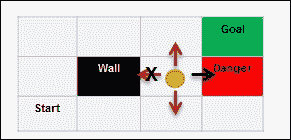
*   同样，网格边界中的任何位置都会有限制，例如，位置 *(1，3)* 允许*向右*和*向下*移动，任何其他移动都不会改变位置。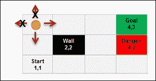
*   现在让我们看看从*起点(1，1)* 到*目标(4，3)* 的最短路径。有两种方案:

    *   **方案 1** : *右* - > *右* - > *上* - > *上* - > *右* (5 步)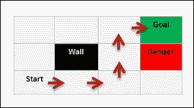
    *   **方案 2** : *上* -)

*   In the real world, not all actions get executed as expected. There is a reliability factor that affects the performance, or rather, there is uncertainty. If we add a small caveat to the example and say that every time there is an action to move from one position to another, the probability that the movement is correct is 0.8\. This means there is an 80% possibility that a movement executes as expected. In this case, if we want to measure the probability of Solution 1, (*R*-->*R*-->*U*-->*U*-->*R*) is succeeding:

    行动按预期发生的概率+行动不按预期发生的概率

    *= 0.8×0.8×0.8×0.8×0.8+0.1×0.1×0.1×0.8*

    *= 0.32768+0.00008 = 0.32776*

*   正如我们所见，不确定因素确实会改变结果。在下一节中，我们将讨论捕捉这些不确定性的决策过程框架。

### 马尔可夫决策过程(MDP)

Markov 的决策过程是做出决策的基本框架或过程，我们将在后面关于强化学习的大部分章节中提到它。

马尔可夫属性是马尔可夫决策过程的核心，它表明重要的是现在或当前状态，并且情况是静止的，这意味着规则不会改变。

MDP 试图捕捉我们在上一节中讨论过的具有以下特征的世界:

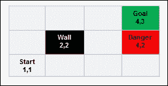

*   **状态**:在前面的例子中，每个网格位置代表一个状态
*   **Model** (Transition function): A Transition function includes three attributes: given state, action, and the destination state. It describes the probability of an end state *s*, given the current state *s* and action *a*:

    T (s，a，s') ~ P(s'/s，a)

*   **动作** : A(s)，上例中为 A， *A (1，2)* = *UP* 中为 *UP* ， *UP* *RIGHT* ， *RIGHT* ， *RIGHT* 解
*   **Rewards**: *R(s)*, *R(s,a)*, *R(s,a,s1)* Rewards tell us the usefulness of entering into a state

    *R(s)* :进入状态的奖励 *s*

    *R(s，a)* :为一个动作 *a* 打开一个状态 *s* 的奖励

    *R(s，a，s1)* :鉴于你处于状态 *s* 中，为一个动作 *a* 打开状态 *s1* 的奖励

*   状态、行动、模型和奖励构成了 MDP 的问题陈述
*   **Policy**: It is a solution for a problem; it says what action should be taken given a state:

    *π(s)*->-*a*

### 基本 RL 模型–代理-环境接口

正如我们已经发现的，RL 问题是从交互中学习以实现目标的一种直接方式。代理人是学习者或决策者，它与环境相互作用，这就是在这个环境之外的一切都会产生回报。它与之交互的东西，包括代理之外的一切，被称为环境。环境的完整规范被定义为一个任务——强化学习问题的一个实例。

以下模型描述了代理-环境界面:

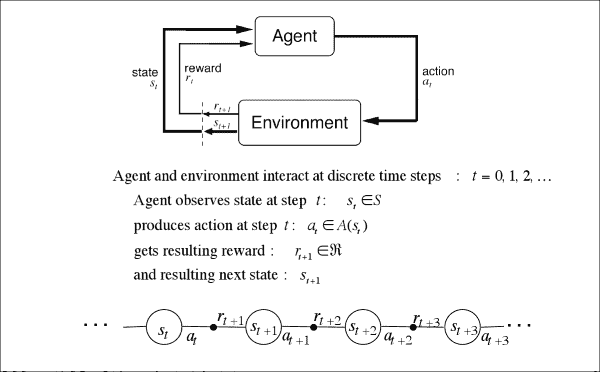

这里的环境模型意味着一个环境，在这个环境中，代理使用任何东西来预测给定动作的环境行为。给定动作和当前状态，该环境模型产生下一状态和奖励的预测。在模型是随机的情况下，可能会有多个下一状态奖励。同样，这些模型可以是分布式的或基于样本的。分布式模型识别所有潜在的概率，而样本模型产生给定样本的概率。

最后，强化学习的目标可以定义如下:

*   在一个环境中，采取的每一个行动都会导致一个新的情况，RL 是关于如何采取行动。以下可以是动作:

    *   定义映射动作和结果情况的策略
    *   识别导致给予最高奖励的策略

强化学习的步骤如下:

1.  代理观察输入状态。
2.  通过应用作为决策功能的策略，可以确定一个动作。
3.  执行导致状态改变的动作。
4.  作为这一行动的结果，代理人从环境中获得了显著的回报。
5.  给定状态的变化，记录奖励的细节。

### 延迟奖励

区分强化学习和监督学习的一个方面是*奖励*。在本节中，我们将探讨延迟奖励的含义。众所周知，每一个导致特定状态变化的行为都会带来回报。在某些情况下，这种回报的实现并不是立竿见影的。让我们看一个象棋游戏的例子。让我们假设用了 65 步来结束一场国际象棋比赛，只有在 65 步结束时，我们才能知道我们是赢了还是输了。这 65 步中的哪一步是成功或失败的原因，这一点很复杂。所以，奖励直到游戏结束或一系列动作后才知道。从技术上来说，我们正在寻找确定哪一系列的行为导致了所看到的奖励。这个过程被称为 **时间信用分配**。

现在，在这个获得最终奖励的旅程中，无论是成功(+1)还是失败(-1)，每一步、每一步或每一个行动都会获得奖励。让我们假设网格世界问题的解决方案 1 中的每一步都获得-0.4 的回报。成功或失败的集体回报将决定长期回报。

### 政策

最优策略是使预期长期回报最大化的策略或解决方案，可以用以下公式表示:

现在，让我们测量依赖于策略( *π* )的特定状态( *s* )的效用:

进入一种状态的奖励( *s* )(这是眼前的收益)不等于那种状态的效用(这是进入状态的长期收益)。

现在，我们可以使用状态值的效用来定义最优策略:

现在，如果我们必须定义处于一种状态的效用( *s* )，它等于进入那种状态的回报，减去我们从那一点得到的回报:

这叫做 **贝尔曼方程**。

*V** 是策略的价值函数，以下是贝尔曼最优方程，其表达了具有最优策略的状态的价值与该状态的最佳行动的最佳预期回报相同的事实:

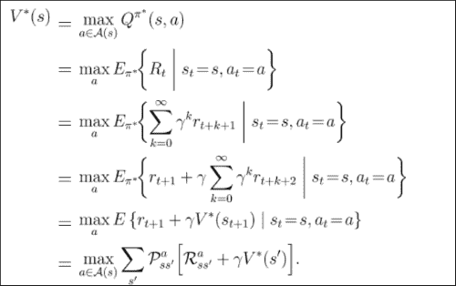

## 强化学习——主要特点

强化学习不是一套技术，而是一套问题，集中于任务是什么，而不是任务应该如何处理。

强化学习被认为是机器使用奖励和惩罚进行学习的工具，这些奖励和惩罚更多地是由试错驱动的。

强化学习采用评估性反馈。评估性反馈衡量所采取行动的有效性，而不是衡量行动是最好还是最差。(请注意，监督学习更多的是一种指导学习，它确定动作的正确性，而不管正在执行的动作。)

强化学习中的任务更多的是相关的任务。关联任务依赖于确定和执行最适合给定情况的动作的情况。非关联任务是那些独立于特定情境的任务，当任务静止时，学习者会找到最佳行动。

# 强化学习解决方法

本节我们将详细讨论解决强化学习问题的一些方法。具体来说，动态规划(DP)、蒙特卡罗方法和时间差分(TD)学习。这些方法也解决了延迟奖励的问题。

## 动态规划

DP 是一组算法，用于在给定环境模型(如马尔可夫决策过程)的情况下计算最优策略。动态规划模型在计算上既昂贵又假设完美的模型；因此，它们的采用率或效用很低。从概念上讲，DP 是以下章节中使用的许多算法或方法的基础:

1.  **评估策略**:可以通过迭代的方式计算策略的价值函数来评估策略。计算策略的价值函数有助于找到更好的策略。
2.  **改进策略**:策略改进是利用其价值函数信息计算修改后的策略的过程。
3.  **价值迭代和策略迭代**:策略评估和改进共同衍生出价值和策略迭代。这是两种最流行的 DP 方法，用于在完全了解 MDP 的情况下计算最优策略和价值函数。

以下算法描述了迭代策略过程:

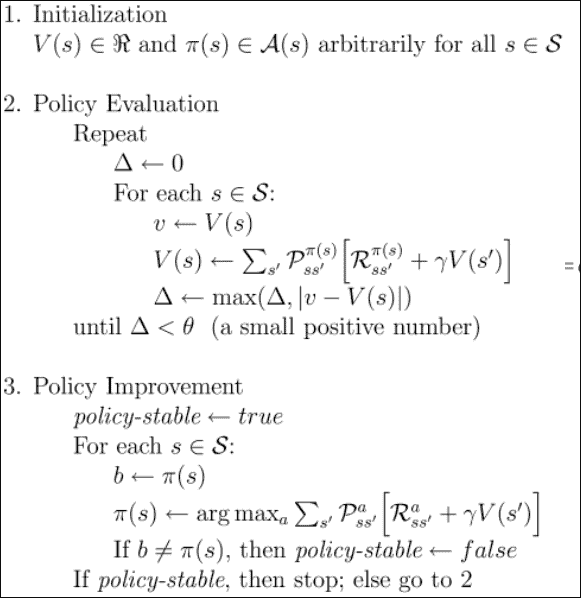

价值迭代结合了坚实的政策改进和过程评估。以下是涉及的步骤:

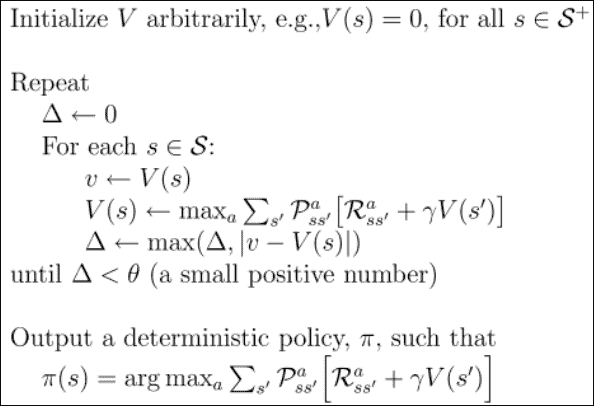

### 通用策略迭代(GPI)

GPI 是一种对动态编程(DP)方法进行分类的方式。GPI 涉及两个流程之间的交互—一个围绕着近似策略，另一个围绕着近似价值。

在第一种情况下，该过程按原样挑选策略，并执行策略评估以识别与该策略相关联的真实或确切的价值函数。另一个过程选择价值函数作为输入，并使用它来改变策略，从而改进策略，这是它的总回报。如果你观察，每一个过程改变了另一个过程的基础，它们协同工作找到一个联合的解决方案，产生一个最优的政策和价值函数。

## 蒙特卡罗方法

蒙特卡罗方法在强化学习中从经验中学习政策和价值观作为样本。由于以下原因，蒙特卡罗方法比动态规划方法具有额外的优势:

*   学习最佳行为直接发生在与环境的交互中，没有任何模拟模型动态的模型。
*   这些方法可用于模拟数据或样本模型；这一特性在实际应用中变得至关重要。
*   使用蒙特卡罗方法，我们可以很容易地聚焦于更小的状态集，并且我们可以探索感兴趣的区域，而不必进入完整的状态集。
*   蒙特卡罗方法受任何违反马尔可夫性质的影响最小，因为值的估计不使用任何后继状态来更新。这也意味着它们不自举。

蒙特卡洛方法是由**广义策略迭代** ( **GPI** )方法设计的。这些方法提供了评估策略的另一种方式。对于每个状态，不是独立地计算该值，而是取从该状态开始的回报的平均值，这可以是该状态的值的良好近似。重点是应用行动价值函数来改进政策，因为这不需要环境的过渡变化。蒙特卡罗方法混合了政策评估和改进方法，可以逐步实现。

多少探索是足够好的？这是蒙特卡罗方法中需要回答的一个关键问题。仅仅根据行动的价值来选择最佳行动是不够的；同样重要的是，要知道这其中有多少是对最终奖励的贡献。

在这种情况下，可以使用两种方法—**on-policy**或 **off-policy** 方法。在基于策略的方法中，代理负责使用探索技术找到最优策略；在非策略方法中，代理探索并不是核心，而是学习一个确定性的最优策略，该策略不需要与所遵循的策略相关。简而言之，脱离政策的学习方法都是通过行为来学习行为。

## 时间差异学习

TD 学习是强化学习的独特技术之一。时间差分学习是蒙特卡罗方法和动态规划方法的结合。强化学习中讨论最多的技术是时间差分(TD)、动态规划(DP)和蒙特卡罗方法之间的关系:

1.  评估一项政策，包括估计给定政策的价值函数*V*π*π*。
2.  选择最佳策略。对于策略选择，所有的 DP、TD 和蒙特卡罗方法都使用广义策略迭代(GPI)的变体。因此，这三种方法的区别只不过是 GPI 的这些变化。

TD 方法遵循自举技术来导出估计值；他们依靠继承国和类似的估计。

现在让我们来看看 TD 相对于 DP 和蒙特卡罗方法的一些优点。我们将简要地讨论这一点，而不去深究太多的复杂性。以下是主要优势:

*   TD 方法不需要环境模型和下一个状态和奖励的概率分布
*   TD 方法可以以在线和增量的方式轻松优雅地运行

### Sarsa - on-Policy TD

让我们看看使用 TD 方法解决控制问题。我们将继续使用 GPI 技术，但现在要结合 TD 方法进行评估和预测。虽然我们需要在探索和利用选项之间取得平衡，但我们可以选择政策内或政策外的学习方法。我们将坚持政策上的方法:

1.  学习与状态价值函数相关的行动价值函数。我们将为策略 *π* :定义 *Q* ^π *(s，a)*
2.  了解从一个状态-动作对转换到另一个状态-动作对的价值。这是如下迭代计算的:

这被定义为一种 Sarsa 预测方法，并且是符合策略的，因为代理使用已识别的策略来实现这一点。

Sarsa 算法陈述如下:

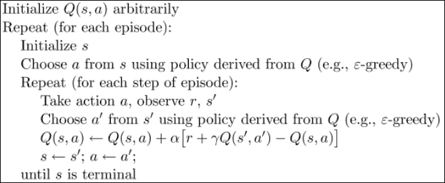

## Q-学习-非政策 TD

采用非策略学习方法的 Q 学习技术是 TD 的开创性策略之一。这种称为 Q-learning (Watkins，1989)的控制算法以简单的形式定义如下:

我们可以看到，最佳动作值函数 *Q** 是使用学习的动作值函数 *Q* 直接近似的，而与它遵循的策略无关。这使它成为一种非策略方法。

随着策略值函数的使用和更新，对策略仍有很小的影响。此外，对所有对的更新努力标志着收敛。

基于这种理解，Q 学习算法可以描述如下:

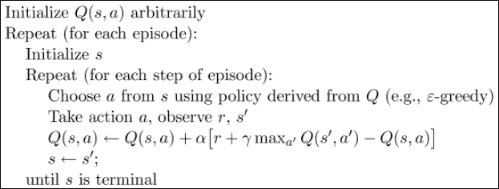

## 演员-评论家方法(政策上)

行动者-批评者方法是时间差异学习方法，使用单独的内存结构来确保策略和价值的独立性。在这种情况下，策略结构被称为*参与者*，而价值结构被称为*批评者*。批评家这个名字来源于它批评政策的价值。由于这位批评家总是批评政策的价值，所以也被称为 TD 错误。下面的屏幕截图显示了 actor-critic 方法流程:

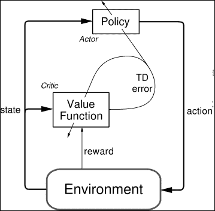

## R 学习(非政策)

R-learning 是一种先进的强化学习技术，用于没有确定和有限回报折扣的情况。算法如下:

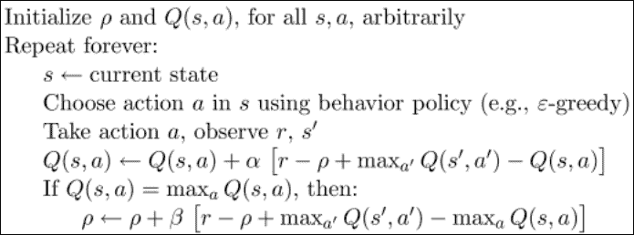

## 实现强化学习算法

参考本章提供的实现强化学习算法的源代码。(源代码路径`.../chapter12/...`下的每个文件夹为该技术。)

### 使用 Mahout

参考文件夹`.../mahout/chapter12/rlexample/`。

### 使用 R

参考文件夹`.../r/chapter12/rlexample/`。

### 使用火花

参考文件夹`.../spark/chapter12/rlexample/`。

### 使用 Python (Scikit-learn)

参考文件夹`.../python-scikit-learn/chapter12/rlexample/`。

### 利用朱丽亚

参考文件夹`.../julia/chapter12/rlexample/`。

# 总结

在这一章中，我们探索了一种叫做强化学习的新的学习技术。我们看到了这与传统的监督和非监督学习技术的不同之处。强化学习的目标是决策，其核心是 MDP。我们探索了 MDP 的元素，并通过一个例子了解了它。然后，我们介绍了一些基本的强化学习技术，包括策略上的和策略外的，其中一些是间接和直接的学习方法。我们介绍了动态规划(DP)方法、蒙特卡罗方法和一些关键的时间差分(TD)方法，如 Q 学习、Sarsa、R 学习和 actor-critic 方法。最后，我们使用本书中确定的标准技术栈亲自实现了其中的一些算法。在下一章，我们将讨论集成学习方法。